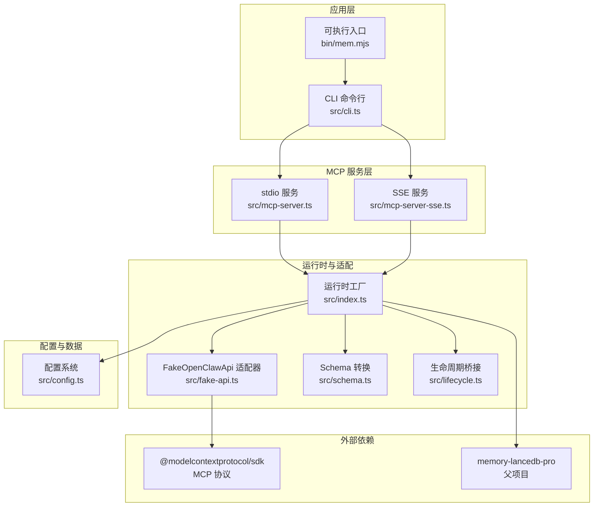
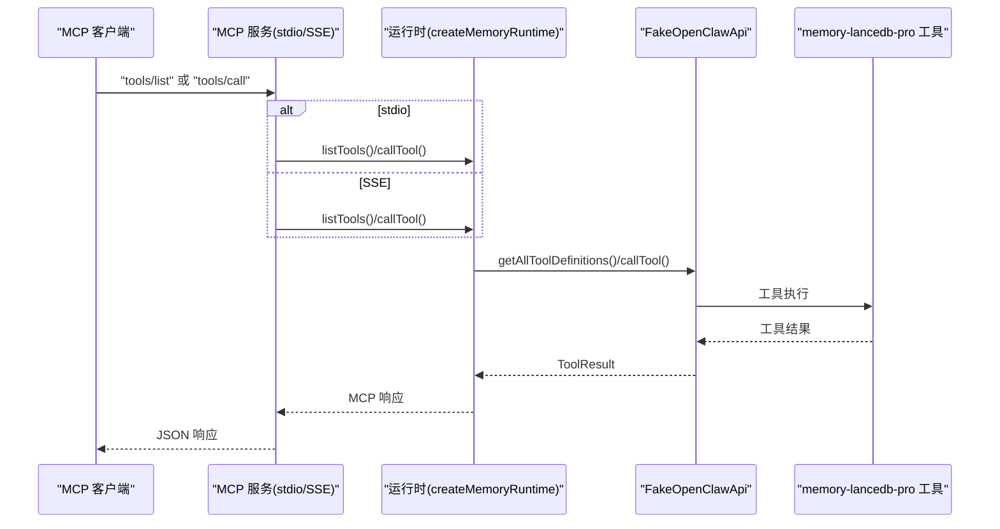
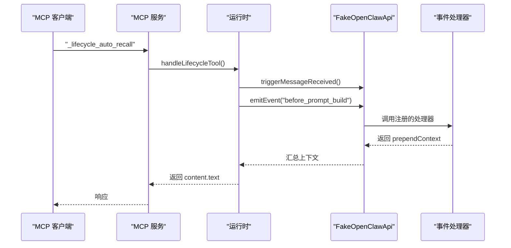
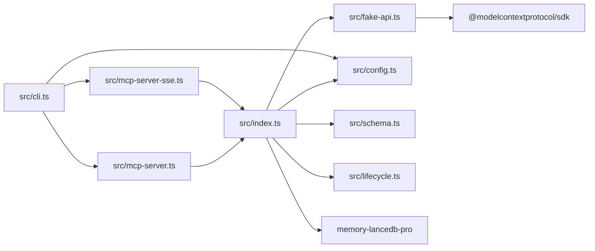

# API 参考

<cite>
**本文引用的文件**
- [README.md](file://README.md)
- [package.json](file://package.json)
- [src/index.ts](file://src/index.ts)
- [src/mcp-server.ts](file://src/mcp-server.ts)
- [src/mcp-server-sse.ts](file://src/mcp-server-sse.ts)
- [src/config.ts](file://src/config.ts)
- [src/fake-api.ts](file://src/fake-api.ts)
- [src/schema.ts](file://src/schema.ts)
- [src/lifecycle.ts](file://src/lifecycle.ts)
- [src/cli.ts](file://src/cli.ts)
- [bin/mem.mjs](file://bin/mem.mjs)
- [test/integration.test.mjs](file://test/integration.test.mjs)
</cite>

## 目录
1. [简介](#简介)
2. [项目结构](#项目结构)
3. [核心组件](#核心组件)
4. [架构总览](#架构总览)
5. [详细组件分析](#详细组件分析)
6. [依赖分析](#依赖分析)
7. [性能考虑](#性能考虑)
8. [故障排查指南](#故障排查指南)
9. [结论](#结论)
10. [附录](#附录)

## 简介
本文件为 memory-lancedb-mcp 的完整 API 参考，覆盖 MCP 工具接口规范、配置 API、生命周期 API、内部接口与数据模型、使用示例与集成方式、版本管理与兼容性策略、错误码与异常处理、测试与验证方法，以及性能特征与限制说明。项目基于 memory-lancedb-pro 的能力，通过 FakeOpenClawApi 适配器桥接 MCP 协议，并提供 stdio 与 SSE 两种传输模式。

## 项目结构
- 入口与运行时
  - 主入口与运行时工厂：src/index.ts
  - MCP 服务（stdio）：src/mcp-server.ts
  - MCP 服务（SSE）：src/mcp-server-sse.ts
  - 配置系统：src/config.ts
  - FakeOpenClawApi 适配器：src/fake-api.ts
  - JSON Schema 转换：src/schema.ts
  - 生命周期桥接：src/lifecycle.ts
  - CLI：src/cli.ts
  - CLI 可执行入口：bin/mem.mjs
- 文档与测试
  - 使用手册：docs/USAGE_GUIDE.md（README.md 中引用）
  - 集成测试：test/integration.test.mjs
  - 包元信息：package.json

图表来源
- [src/cli.ts:1-617](file://src/cli.ts#L1-L617)
- [src/mcp-server.ts:1-306](file://src/mcp-server.ts#L1-L306)
- [src/mcp-server-sse.ts:1-405](file://src/mcp-server-sse.ts#L1-L405)
- [src/index.ts:1-515](file://src/index.ts#L1-L515)
- [src/fake-api.ts:1-318](file://src/fake-api.ts#L1-L318)
- [src/schema.ts:1-151](file://src/schema.ts#L1-L151)
- [src/lifecycle.ts:1-178](file://src/lifecycle.ts#L1-L178)
- [src/config.ts:1-312](file://src/config.ts#L1-L312)

章节来源
- [README.md:22-45](file://README.md#L22-L45)
- [package.json:1-46](file://package.json#L1-L46)

## 核心组件
- 运行时工厂 createMemoryRuntime
  - 负责加载配置、构建 FakeOpenClawApi、注册插件、初始化网关事件、提供工具调用、生命周期事件与钩子、CLI 实例访问。
- FakeOpenClawApi 适配器
  - 捕获工具工厂、事件处理器、钩子与 CLI 实例，统一对外提供 callTool、emitEvent、triggerHook、getToolDefinitions 等能力。
- JSON Schema 转换
  - 将 TypeBox schema 转换为 MCP 兼容的 JSON Schema，保证 tools/list 返回格式正确。
- 生命周期桥接
  - 将 OpenClaw 的 before_prompt_build、agent_end、session_end 等事件映射为可调用的 MCP 工具（_lifecycle_auto_recall、_lifecycle_auto_capture、_lifecycle_session_end），并提供触发函数。
- 配置系统
  - 支持 YAML 配置文件、环境变量扩展、默认路径解析、配置校验与初始化。
- CLI
  - 提供 mem serve、list、search、stats、store、delete、config、doctor、scope 等命令，支持 stdio 与 SSE 两种传输模式。

章节来源
- [src/index.ts:207-498](file://src/index.ts#L207-L498)
- [src/fake-api.ts:57-317](file://src/fake-api.ts#L57-L317)
- [src/schema.ts:39-150](file://src/schema.ts#L39-L150)
- [src/lifecycle.ts:52-177](file://src/lifecycle.ts#L52-L177)
- [src/config.ts:167-214](file://src/config.ts#L167-L214)
- [src/cli.ts:105-616](file://src/cli.ts#L105-L616)

## 架构总览
- MCP 协议
  - stdio 模式：通过标准输入输出与 MCP 客户端通信。
  - SSE 模式：通过 HTTP/SSE 暴露 /sse 与 /message 接口，支持远程连接。
- 适配层
  - FakeOpenClawApi 捕获 memory-lancedb-pro 注册的 14 个工具与事件钩子，统一暴露给 MCP 服务。
- 传输层
  - stdio：src/mcp-server.ts
  - SSE：src/mcp-server-sse.ts
- 配置与运行时
  - src/config.ts 负责配置加载与校验；src/index.ts 负责运行时构建与工具/事件/钩子的桥接。

图表来源
- [src/mcp-server.ts:61-124](file://src/mcp-server.ts#L61-L124)
- [src/mcp-server-sse.ts:247-287](file://src/mcp-server-sse.ts#L247-L287)
- [src/index.ts:455-498](file://src/index.ts#L455-L498)
- [src/fake-api.ts:217-235](file://src/fake-api.ts#L217-L235)

## 详细组件分析

### MCP 工具接口规范
- 工具总数：17 个（14 个记忆工具 + 3 个生命周期工具）
- 工具清单与参数
  - memory_store
    - 参数
      - text: string（必填）
      - category: 枚举（preference / fact / decision / entity / other）
      - tags: string（逗号分隔，支持多标签）
      - importance: number（0-1，默认 0.7）
      - scope: string（目标作用域）
    - 返回
      - content: 数组，元素为 { type: "text" | "image" | "resource", text: string }
      - details?: 附加详情
  - memory_recall
    - 参数
      - query: string（必填）
      - limit: number（默认 5，最大 20）
      - scope: string
      - category: 枚举
      - tags: string（逗号分隔）
    - 返回
      - content: 文本块，包含“找到 N 条记忆”与条目列表
  - memory_list
    - 参数
      - limit: number（默认 10，最大 50）
      - offset: number（默认 0）
      - scope: string
      - category: string
      - tags: string（逗号分隔）
    - 返回
      - content: 文本块，按条目编号列出
  - memory_forget
    - 参数
      - memoryId: string（二选一）
      - query: string（二选一）
    - 返回
      - content: 文本提示是否删除成功
  - memory_update
    - 参数
      - query: string（必填）
      - text: string
      - importance: number（0-1）
      - category: 枚举
    - 返回
      - content: 文本提示是否更新成功
  - memory_stats
    - 参数
      - scope: string
    - 返回
      - content: 统计信息文本
  - memory_debug, memory_promote, memory_archive, memory_compact, memory_explain_rank
    - 说明：高级治理与调试工具，用于记忆归档、提升、去重与解释
  - self_improvement_log, self_improvement_extract_skill, self_improvement_review
    - 说明：自我改进相关工具
  - list_scopes（合成工具）
    - 说明：枚举所有可用 scope 及其记忆数量
    - 输入：无
    - 返回：content 为文本列表，details 为结构化数组
- 标签系统
  - 支持 tags 参数注入与过滤
  - 存储时将 tags 嵌入文本前缀“【标签:x,y】”，检索时通过 BM25 命中前缀
  - CLI 与运行时均对 tags 进行规范化与校验，非法字符将抛错
- 作用域隔离
  - 支持 --scope 与 scope 参数
  - 锁定模式：服务端 --scope X 强制所有操作限定在 X，拒绝其他 scope
  - 跨 scope 模式：默认 agentId="system"，ACL 放宽，允许跨作用域读取
- JSON Schema
  - 通过 typeboxToJsonSchema 与 extractInputSchema 转换，确保 tools/list 返回符合 MCP 规范

章节来源
- [README.md:548-672](file://README.md#L548-L672)
- [src/index.ts:313-453](file://src/index.ts#L313-L453)
- [src/schema.ts:39-150](file://src/schema.ts#L39-L150)
- [src/cli.ts:175-343](file://src/cli.ts#L175-L343)

### 配置 API 规范
- 配置文件位置与解析顺序
  - 环境变量 MEM_CONFIG_PATH
  - 默认路径 ~/.config/memory-mcp/config.yaml
  - 当前目录 config.yaml
  - 不存在则返回默认最小配置
- 环境变量扩展
  - 支持 ${ENV_VAR} 语法，未设置时警告并替换为空字符串
- 关键配置项
  - embedding.apiKey（必填）
  - embedding.model/baseURL/dimensions/requestDimensions/omitDimensions/taskQuery/taskPassage/normalized/chunking
  - dbPath（数据库存储路径）
  - autoCapture/autoRecall/autoRecallMinLength/autoRecallMaxItems/autoRecallMaxChars/autoRecallTimeoutMs/captureAssistant
  - smartExtraction/extractMinMessages/extractMaxChars
  - enableManagementTools/sessionStrategy
  - retrieval.mode/vectorWeight/bm25Weight/minScore/hardMinScore/rerank/rerankProvider/rerankModel/rerankEndpoint/rerankApiKey/rerankTimeoutMs/candidatePoolSize/recencyHalfLifeDays/recencyWeight/filterNoise/lengthNormAnchor/timeDecayHalfLifeDays/reinforcementFactor/maxHalfLifeMultiplier
  - scopes.default/scopes.definitions/scopes.agentAccess
  - selfImprovement.enabled/beforeResetNote/skipSubagentBootstrap/ensureLearningFiles
  - 其他预留字段（如 memoryReflection/mdMirror/admissionControl/memoryCompaction/sessionCompression/extractionThrottle/workspaceBoundary）
- 初始化与显示
  - mem config init：创建默认配置文件
  - mem config show：显示配置（敏感字段掩码）
  - mem config path：显示配置文件路径
  - mem config validate：校验配置有效性

章节来源
- [src/config.ts:107-214](file://src/config.ts#L107-L214)
- [src/config.ts:296-311](file://src/config.ts#L296-L311)
- [src/cli.ts:370-443](file://src/cli.ts#L370-L443)
- [README.md:675-714](file://README.md#L675-L714)

### 生命周期 API
- 事件类型与处理机制
  - before_prompt_build：自动召回，返回 prependContext 文本
  - agent_end：自动捕获，从消息中提取记忆（异步后台执行）
  - session_end：会话结束，清理挂起状态
  - message_received：缓存原始用户消息，用于召回门控逻辑
- 可调用工具（MCP）
  - _lifecycle_auto_recall
    - 输入：prompt（必填）、agentId、sessionKey
    - 输出：content.text 为上下文或“(no relevant memories)”
  - _lifecycle_auto_capture
    - 输入：messages（必填，数组）、agentId、sessionKey
    - 输出：content.text 为“Auto-capture triggered.”
  - _lifecycle_session_end
    - 输入：sessionKey、agentId
    - 输出：content.text 为“Session ended.”
- 触发流程（序列图）

图表来源
- [src/mcp-server.ts:235-305](file://src/mcp-server.ts#L235-L305)
- [src/mcp-server-sse.ts:378-404](file://src/mcp-server-sse.ts#L378-L404)
- [src/lifecycle.ts:52-91](file://src/lifecycle.ts#L52-L91)

章节来源
- [src/lifecycle.ts:19-177](file://src/lifecycle.ts#L19-L177)
- [src/mcp-server.ts:154-233](file://src/mcp-server.ts#L154-L233)
- [src/mcp-server-sse.ts:336-376](file://src/mcp-server-sse.ts#L336-L376)

### 内部接口与数据模型
- MemoryRuntime
  - 属性：api（FakeOpenClawApi）、config（MemConfig）
  - 方法：callTool(name, params, ctx?)、listTools()、emitEvent(event, payload?, ctx?)、triggerHook(name, payload?)、getCliInstance()
- ToolInfo
  - name: string、description: string、inputSchema: JsonSchema
- ToolCallContext
  - agentId?: string、sessionKey?: string
- ToolResult
  - content: Array<{ type: string; text: string }>、details?: Record<string, unknown>
- JsonSchema
  - type/description/properties/required/items/enum/default/minimum/maximum/minLength/maxLength/additionalProperties/oneOf/anyOf/allOf 等
- MemConfig
  - 嵌套对象结构，覆盖 embedding、llm、autoCapture、autoRecall、retrieval、scopes、selfImprovement 等

章节来源
- [src/index.ts:95-134](file://src/index.ts#L95-L134)
- [src/fake-api.ts:20-36](file://src/fake-api.ts#L20-L36)
- [src/schema.ts:16-33](file://src/schema.ts#L16-L33)
- [src/config.ts:23-98](file://src/config.ts#L23-L98)

### API 使用示例与集成
- 启动 MCP 服务
  - stdio：mem serve
  - SSE：mem serve --sse --port 3100 --host 0.0.0.0
- 工具调用
  - 通过 MCP 客户端发送 tools/call 请求，name 为工具名，arguments 为参数对象
  - 生命周期工具：_lifecycle_auto_recall/_lifecycle_auto_capture/_lifecycle_session_end
- CLI 集成
  - mem list/search/stats/store/delete/config/doctor/scope
  - 通过 --config 指定配置文件路径
- 传输模式选择
  - 本地客户端（Claude Desktop/Cursor/Cline）：stdio
  - 远程/多客户端：SSE

章节来源
- [README.md:279-531](file://README.md#L279-L531)
- [src/cli.ts:114-169](file://src/cli.ts#L114-L169)
- [src/mcp-server.ts:43-140](file://src/mcp-server.ts#L43-L140)
- [src/mcp-server-sse.ts:57-209](file://src/mcp-server-sse.ts#L57-L209)

### 版本管理与向后兼容性
- 版本号
  - package.json 中 version: 0.1.0
  - MCP 服务 serverVersion 默认 0.1.0
- 兼容性策略
  - 通过 jiti 直接加载 memory-lancedb-pro 的 TypeScript 源码，避免本地构建依赖
  - 配置结构尽量镜像插件配置，减少迁移成本
  - tools/list 返回的 JSON Schema 严格遵循 MCP 规范
- 注意事项
  - SSE 模式为简化实现，生产环境建议配合反向代理与鉴权
  - 跨 scope 模式下 agentId="system" 会放宽 ACL，注意安全边界

章节来源
- [package.json:3-4](file://package.json#L3-L4)
- [src/mcp-server.ts:44-46](file://src/mcp-server.ts#L44-L46)
- [src/mcp-server-sse.ts:61-62](file://src/mcp-server-sse.ts#L61-L62)
- [src/index.ts:159-184](file://src/index.ts#L159-L184)

### 错误码与异常处理
- MCP 协议错误
  - Method not found：-32601
  - Internal error：-32603
  - Parse error：-32700
- 运行时错误
  - Unknown tool：抛出错误，提示可用工具列表
  - Scope mismatch：锁定模式下拒绝非目标 scope 请求
  - 配置缺失：embedding.apiKey 缺失时报错
  - 标签非法：normalizeTags 抛错，阻止入库
- 日志与调试
  - FakeOpenClawApi 提供 debug/info/warn/error 日志接口
  - CLI doctor 命令提供健康检查与配置验证

章节来源
- [src/mcp-server.ts:117-123](file://src/mcp-server.ts#L117-L123)
- [src/mcp-server-sse.ts:310-329](file://src/mcp-server-sse.ts#L310-L329)
- [src/index.ts:357-366](file://src/index.ts#L357-L366)
- [src/config.ts:192-206](file://src/config.ts#L192-L206)
- [src/index.ts:44-51](file://src/index.ts#L44-L51)
- [src/fake-api.ts:84-89](file://src/fake-api.ts#L84-L89)
- [src/cli.ts:449-517](file://src/cli.ts#L449-L517)

### API 测试与验证
- 单元/集成测试
  - test/integration.test.mjs 验证：
    - 模块导出与运行时创建
    - 工具注册数量与名称
    - JSON Schema 生成与 required 字段
    - 生命周期事件注册
    - FakeOpenClawApi 路径解析
- 健康检查
  - mem doctor：检查配置文件存在、解析、API key、插件加载与工具列表
- 配置验证
  - mem config validate：快速校验配置有效性

章节来源
- [test/integration.test.mjs:9-130](file://test/integration.test.mjs#L9-L130)
- [src/cli.ts:449-517](file://src/cli.ts#L449-L517)
- [src/cli.ts:427-443](file://src/cli.ts#L427-L443)

## 依赖分析
- 外部依赖
  - @modelcontextprotocol/sdk：MCP 协议实现（stdio 与 SSE）
  - memory-lancedb-pro：核心记忆引擎（通过 jiti 加载源码）
  - yaml：YAML 解析与序列化
  - commander：CLI 参数解析
  - jiti：TypeScript 源码即时编译
- 内部耦合
  - src/index.ts 依赖 src/fake-api.ts、src/config.ts、src/schema.ts、src/lifecycle.ts
  - src/mcp-server.ts 与 src/mcp-server-sse.ts 依赖 src/index.ts 与 src/lifecycle.ts
  - src/cli.ts 依赖 src/mcp-server.ts、src/mcp-server-sse.ts、src/config.ts

图表来源
- [src/index.ts:9-12](file://src/index.ts#L9-L12)
- [src/mcp-server.ts:8-22](file://src/mcp-server.ts#L8-L22)
- [src/mcp-server-sse.ts:11-23](file://src/mcp-server-sse.ts#L11-L23)
- [src/cli.ts:17-27](file://src/cli.ts#L17-L27)
- [package.json:26-31](file://package.json#L26-L31)

章节来源
- [package.json:26-31](file://package.json#L26-L31)
- [src/index.ts:9-12](file://src/index.ts#L9-L12)

## 性能考虑
- 检索性能
  - 默认 hybrid 检索（向量 + BM25），可调整 vectorWeight/bm25Weight 与 minScore/hardMinScore
  - 噪声过滤与候选池大小可调，平衡召回质量与延迟
- 存储与索引
  - LanceDB 作为底层存储，建议在支持 AVX2 的平台上运行，避免非法指令错误
  - WSL 环境可能需要手动安装 Linux 原生模块
- 并发与传输
  - stdio：单进程标准流，适合本地客户端
  - SSE：HTTP/SSE，支持多客户端，注意并发连接与资源释放
- 资源限制
  - limit 与 offset 参数限制返回数量，避免一次性返回过多数据
  - tags 过滤在召回阶段通过前缀命中，避免额外索引开销

章节来源
- [README.md:132-167](file://README.md#L132-L167)
- [README.md:548-672](file://README.md#L548-L672)
- [src/mcp-server-sse.ts:174-209](file://src/mcp-server-sse.ts#L174-L209)

## 故障排查指南
- 启动失败
  - 检查配置文件是否存在与可解析：mem doctor
  - 确认 embedding.apiKey 设置或通过环境变量扩展
  - SSE 模式注意 host 与端口绑定，避免暴露到不受信任网络
- 工具调用失败
  - 确认工具名拼写与参数类型
  - 检查 scope 是否与服务端锁定模式一致
  - 标签非法字符导致入库失败：使用 normalizeTags 规范化
- 性能问题
  - 调整 retrieval 参数与 limit
  - 在 WSL/Linux 环境安装正确的原生模块
- 日志定位
  - 使用 --quiet 控制日志级别
  - 查看 stderr 输出（stdio 模式）或服务端日志（SSE 模式）

章节来源
- [src/cli.ts:449-517](file://src/cli.ts#L449-L517)
- [src/index.ts:44-51](file://src/index.ts#L44-L51)
- [README.md:132-167](file://README.md#L132-L167)

## 结论
本项目通过 FakeOpenClawApi 适配器与运行时工厂，将 memory-lancedb-pro 的 14 个核心记忆工具与生命周期事件无缝桥接到 MCP 协议，提供 stdio 与 SSE 两种传输模式，满足本地与远程场景需求。配置系统支持 YAML 与环境变量扩展，CLI 提供完善的管理与诊断能力。通过严格的 JSON Schema 转换与生命周期桥接，确保 MCP 客户端能够稳定调用工具并获得一致的响应格式。

## 附录
- 常用命令速查
  - mem serve [--sse --port --host --scope --config --dry-run --quiet]
  - mem list [--scope --category --limit --offset --tags --json --config]
  - mem search <query> [--scope --limit --tags --json --config]
  - mem stats [--scope --json --config]
  - mem store <text> [--importance --category --tags --scope --config]
  - mem delete <id> [--config]
  - mem config init [--force]
  - mem config show [--json]
  - mem config path
  - mem config validate
  - mem doctor [--config --mcp]
  - mem scope list [--config]
  - mem scope delete <scope> [--dry-run --yes --config]

章节来源
- [README.md:279-531](file://README.md#L279-L531)
- [src/cli.ts:114-616](file://src/cli.ts#L114-L616)