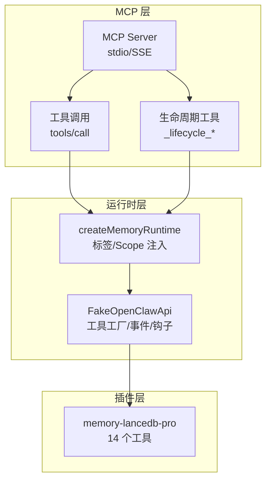
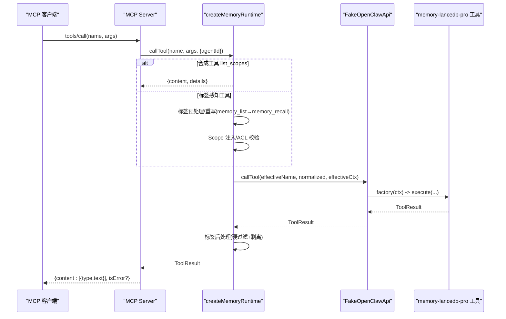
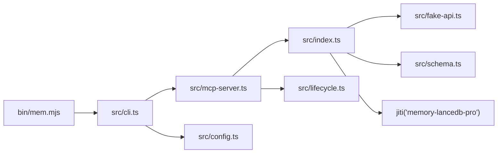

# MCP 工具 API

<cite>
**本文引用的文件**   
- [README.md](file://README.md)
- [USAGE_GUIDE.md](file://docs/USAGE_GUIDE.md)
- [package.json](file://package.json)
- [src/index.ts](file://src/index.ts)
- [src/schema.ts](file://src/schema.ts)
- [src/mcp-server.ts](file://src/mcp-server.ts)
- [src/fake-api.ts](file://src/fake-api.ts)
- [src/cli.ts](file://src/cli.ts)
- [src/config.ts](file://src/config.ts)
- [src/lifecycle.ts](file://src/lifecycle.ts)
- [bin/mem.mjs](file://bin/mem.mjs)
- [test/integration.test.mjs](file://test/integration.test.mjs)
</cite>

## 目录
1. [简介](#简介)
2. [项目结构](#项目结构)
3. [核心组件](#核心组件)
4. [架构总览](#架构总览)
5. [详细组件分析](#详细组件分析)
6. [依赖分析](#依赖分析)
7. [性能考量](#性能考量)
8. [故障排除指南](#故障排除指南)
9. [结论](#结论)
10. [附录](#附录)

## 简介
本文件为 memory-lancedb-mcp 的 MCP 工具 API 完整文档，覆盖所有可用工具接口，重点包括：
- 核心记忆工具：memory_store、memory_recall、memory_list、memory_forget、memory_update、memory_stats
- 合成工具：list_scopes
- 标签系统与 scope 注入机制
- 代理 ID（agentId）与 ACL 权限控制
- JSON Schema 定义、参数验证规则、错误处理
- 工具调用示例、最佳实践、性能与集成模式

## 项目结构
该项目通过 MCP 协议对外暴露 memory-lancedb-pro 的工具集，并提供 CLI 与 SSE 两种传输模式。核心模块职责如下：
- src/index.ts：运行时工厂、标签预处理/后处理、scope 注入、合成工具 list_scopes、工具清单增强
- src/mcp-server.ts：MCP stdio 服务器，注册工具与生命周期工具，映射响应格式
- src/fake-api.ts：适配器，模拟 OpenClaw 插件运行时，收集工具工厂、事件与钩子
- src/schema.ts：TypeBox → JSON Schema 转换器，保证 MCP 协议兼容
- src/cli.ts：mem CLI，封装 serve/list/search/stats/store/delete/scope/config/doctor 等命令
- src/config.ts：配置加载、环境变量展开、默认模板初始化
- src/lifecycle.ts：生命周期桥接（自动召回、自动捕获、会话结束、消息接收）
- bin/mem.mjs：CLI 入口
- docs/USAGE_GUIDE.md：使用手册（含工具参数、最佳实践、Scope 隔离、标签系统）

图表来源
- [src/mcp-server.ts:43-140](file://src/mcp-server.ts#L43-L140)
- [src/index.ts:207-498](file://src/index.ts#L207-L498)
- [src/fake-api.ts:57-317](file://src/fake-api.ts#L57-L317)

章节来源
- [README.md:11-19](file://README.md#L11-L19)
- [src/mcp-server.ts:43-140](file://src/mcp-server.ts#L43-L140)
- [src/index.ts:207-498](file://src/index.ts#L207-L498)
- [src/fake-api.ts:57-317](file://src/fake-api.ts#L57-L317)

## 核心组件
- 运行时工厂 createMemoryRuntime：加载配置、创建 FakeOpenClawApi、注册插件、构建工具清单（含合成工具 list_scopes）、执行工具调用、标签预处理/后处理、scope 注入与 ACL 校验
- FakeOpenClawApi：收集工具工厂、事件处理器、钩子、CLI 实例；提供 callTool/getAllToolDefinitions 等能力
- MCP Server：注册 tools/list 与 tools/call；生命周期工具桥接；响应格式标准化
- JSON Schema 转换：typeboxToJsonSchema/extractInputSchema，确保 MCP 协议兼容
- CLI：mem 命令集合，支持 serve、list、search、stats、store、delete、scope、config、doctor

章节来源
- [src/index.ts:207-498](file://src/index.ts#L207-L498)
- [src/fake-api.ts:57-317](file://src/fake-api.ts#L57-L317)
- [src/mcp-server.ts:43-140](file://src/mcp-server.ts#L43-L140)
- [src/schema.ts:45-150](file://src/schema.ts#L45-L150)
- [src/cli.ts:105-616](file://src/cli.ts#L105-L616)

## 架构总览
MCP 工具调用的关键流程：
- 客户端发起 tools/call 请求
- MCP Server 将请求路由至 createMemoryRuntime.callTool
- 标签感知工具执行标签预处理（memory_store/memory_recall/memory_list）
- Scope 注入：跨 scope 模式（agentId="system"）与锁定 scope 模式（强制 scope 且 ACL 校验）
- 调用 FakeOpenClawApi 获取工具工厂并执行
- 标签后处理：硬过滤 + 前缀剥离
- 响应标准化：content 文本化，details 透传

图表来源
- [src/mcp-server.ts:86-124](file://src/mcp-server.ts#L86-L124)
- [src/index.ts:248-453](file://src/index.ts#L248-L453)
- [src/fake-api.ts:217-235](file://src/fake-api.ts#L217-L235)

章节来源
- [src/mcp-server.ts:86-124](file://src/mcp-server.ts#L86-L124)
- [src/index.ts:248-453](file://src/index.ts#L248-L453)
- [src/fake-api.ts:217-235](file://src/fake-api.ts#L217-L235)

## 详细组件分析

### memory_store
- 功能：存储一条记忆，支持分类、重要度、scope、tags
- 输入参数
  - text: string（必填）
  - category: preference/fact/decision/entity/reflection/other（可选）
  - importance: number 0-1（可选，默认 0.7）
  - scope: string（可选）
  - tags: string（可选，逗号分隔）
- 标签预处理：当 tags 存在时，将 "【标签:x,y】 " 前缀嵌入 text（存储时），不修改父项目 schema
- Scope 注入：跨 scope 模式下，未指定 scope 时自动注入默认 scope（如 global），ACL 由插件层控制
- 输出：标准 MCP content 文本块，details 透传
- 错误处理：非法 tags 会抛出错误；scope 不匹配在锁定模式下被拒绝

章节来源
- [src/index.ts:317-324](file://src/index.ts#L317-L324)
- [src/index.ts:372-381](file://src/index.ts#L372-L381)
- [src/index.ts:446-449](file://src/index.ts#L446-L449)
- [src/schema.ts:136-150](file://src/schema.ts#L136-L150)

### memory_recall
- 功能：混合检索召回记忆（向量 + BM25），支持 limit、scope、category、tags
- 输入参数
  - query: string（必填）
  - limit: number（可选，默认 3，最大 20）
  - scope: string（可选）
  - category: string（可选）
  - tags: string（可选）
- 标签行为：tags 通过前缀嵌入 query，利用 BM25 命中；返回结果中前缀剥离
- 输出：content 文本块，展示“Found N memories”头部与编号条目
- 错误处理：无效 limit 会拒绝；查询异常返回 isError=true 的文本响应

章节来源
- [src/index.ts:324-326](file://src/index.ts#L324-L326)
- [src/index.ts:390-450](file://src/index.ts#L390-L450)
- [src/mcp-server.ts:104-123](file://src/mcp-server.ts#L104-L123)

### memory_list
- 功能：列出记忆，支持 limit、offset、scope、category、tags
- 输入参数
  - limit: number（可选，默认 10，最大 50）
  - offset: number（可选，默认 0）
  - scope: string（可选）
  - category: string（可选）
  - tags: string（可选）
- 标签行为：当传入 tags 时，内部重写为 memory_recall（带前缀 query），实现标签过滤（软过滤）
- 输出：content 文本块，展示“Found N memories”头部与编号条目
- 错误处理：无效 limit/offset 会被拒绝

章节来源
- [src/index.ts:326-334](file://src/index.ts#L326-L334)
- [src/index.ts:390-450](file://src/index.ts#L390-L450)

### memory_forget
- 功能：删除记忆，支持两种模式
  - query 模式：传入 query，返回候选记忆，确认后删除 selected memoryId
  - memoryId 模式：直接传入 memoryId（支持 8+ 位前缀）
- 输入参数
  - memoryId: string（二选一）
  - query: string（二选一）
  - scope: string（可选）
- 输出：content 文本块，反馈删除结果
- 错误处理：非法 ID/查询失败会返回错误文本

章节来源
- [src/cli.ts:349-364](file://src/cli.ts#L349-L364)

### memory_update
- 功能：更新已有记忆，可修改 text、category、importance
- 输入参数
  - memoryId: string（必填）
  - text: string（可选）
  - category: string（可选）
  - importance: number 0-1（可选）
- 输出：content 文本块，反馈更新结果
- 错误处理：非法 ID/参数会返回错误文本

章节来源
- [src/cli.ts:309-343](file://src/cli.ts#L309-L343)

### memory_stats
- 功能：获取统计信息（scope 分布、category 分布、检索模式状态等）
- 输入参数
  - scope: string（可选）
- 输出：content 文本块，details 透传
- 错误处理：异常返回 isError=true 的文本

章节来源
- [src/cli.ts:279-303](file://src/cli.ts#L279-L303)

### list_scopes（合成工具）
- 功能：列举所有可用 memory scope 及其记忆数量，合并配置定义与实际计数
- 输入参数：无
- 输出：content 文本块（人类可读列表），details 包含 scopes/defaultScope
- 使用场景：跨 scope 模式下，帮助用户发现可用 scope 并选择查询目标

章节来源
- [src/index.ts:249-311](file://src/index.ts#L249-L311)

### 生命周期工具（内部）
- _lifecycle_auto_recall：在发送用户提示前自动召回相关记忆，返回 prependContext
- _lifecycle_auto_capture：在会话结束后自动提取记忆
- _lifecycle_session_end：会话结束清理
- 输入参数：prompt/messages、agentId、sessionKey 等
- 输出：文本响应或空内容

章节来源
- [src/mcp-server.ts:154-233](file://src/mcp-server.ts#L154-L233)
- [src/lifecycle.ts:52-177](file://src/lifecycle.ts#L52-L177)

## 依赖分析
- 依赖关系
  - src/index.ts 依赖 src/fake-api.ts、src/schema.ts、jiti 加载 memory-lancedb-pro
  - src/mcp-server.ts 依赖 src/index.ts、src/lifecycle.ts
  - src/cli.ts 依赖 src/mcp-server.ts、src/config.ts、src/index.ts
  - bin/mem.mjs 作为 CLI 入口加载 dist/cli.js
- 外部依赖
  - @modelcontextprotocol/sdk：MCP 协议实现
  - memory-lancedb-pro：核心记忆引擎
  - yaml、commander、jiti

图表来源
- [src/index.ts:9-12](file://src/index.ts#L9-L12)
- [src/mcp-server.ts:8-22](file://src/mcp-server.ts#L8-L22)
- [src/cli.ts:17-27](file://src/cli.ts#L17-L27)
- [bin/mem.mjs:1-7](file://bin/mem.mjs#L1-L7)

章节来源
- [package.json:26-31](file://package.json#L26-L31)
- [src/index.ts:9-12](file://src/index.ts#L9-L12)
- [src/mcp-server.ts:8-22](file://src/mcp-server.ts#L8-L22)
- [src/cli.ts:17-27](file://src/cli.ts#L17-L27)
- [bin/mem.mjs:1-7](file://bin/mem.mjs#L1-L7)

## 性能考量
- 检索权重与候选池
  - retrieval.vectorWeight/bm25Weight、candidatePoolSize、minScore/hardMinScore 控制混合检索效果
  - 建议根据数据规模与查询复杂度调整权重与池大小
- 标签过滤
  - tags 通过 BM25 前缀命中实现软过滤；如需硬过滤，结合 category 使用
- 分页与限制
  - memory_list 的 limit/offset 与 memory_recall 的 limit 应合理设置，避免超大结果集
- 内容长度
  - 建议每条记忆至少 100-200 字，提升语义召回稳定性
- 环境变量与路径
  - dbPath 使用 ~ 或绝对路径，避免相对路径导致的 IO 异常

章节来源
- [src/config.ts:57-77](file://src/config.ts#L57-L77)
- [USAGE_GUIDE.md:268-314](file://docs/USAGE_GUIDE.md#L268-L314)

## 故障排除指南
- 配置问题
  - 缺少 embedding.apiKey 或环境变量未设置：doctor 与 config validate 会提示
  - 配置解析失败：检查 YAML 语法与字段类型
- 工具加载
  - 14 个工具未注册：确认 dist 编译完成并重启服务
- Scope 权限
  - Scope mismatch：锁定模式下请求的 scope 必须与服务端一致
  - Access denied：确认 ACL 与 agentId 是否正确
- 标签校验
  - Invalid tag value：标签包含非法字符（如 】、空格、emoji），需修正后重启服务生效
- SSE/stdio
  - SSE 端口冲突：更换端口或关闭占用进程
  - stdio 日志污染：MCP Server 默认抑制调试日志，CLI 模式可开启 quiet

章节来源
- [src/cli.ts:449-517](file://src/cli.ts#L449-L517)
- [src/index.ts:44-51](file://src/index.ts#L44-L51)
- [src/mcp-server.ts:126-140](file://src/mcp-server.ts#L126-L140)

## 结论
memory-lancedb-mcp 通过统一的运行时层与 FakeOpenClawApi 适配，将 memory-lancedb-pro 的 14 个工具无缝暴露为 MCP 工具，并提供：
- 标签系统：通过文本前缀实现多标签分类与软过滤
- Scope 隔离：跨 scope 与锁定 scope 两种模式，ACL 严格控制访问
- 生命周期桥接：自动召回与自动捕获，便于集成到对话流程
- JSON Schema 兼容：确保 MCP 客户端正确解析工具参数
- CLI 与 SSE：满足本地与远程多客户端场景

## 附录

### 工具参数与 JSON Schema
- memory_store
  - 输入：{ text, category?, importance?, scope?, tags? }
  - JSON Schema：对象类型，properties 包含上述字段；tags 由 wrapper 注入
- memory_recall
  - 输入：{ query, limit?, scope?, category?, tags? }
  - JSON Schema：对象类型，必需 query
- memory_list
  - 输入：{ limit?, offset?, scope?, category?, tags? }
  - JSON Schema：对象类型，必需 limit/offset 为非负数
- memory_forget
  - 输入：{ memoryId? | query?, scope? }
  - JSON Schema：对象类型，必需二选一
- memory_update
  - 输入：{ memoryId, text?, category?, importance? }
  - JSON Schema：对象类型，必需 memoryId
- memory_stats
  - 输入：{ scope? }
  - JSON Schema：对象类型
- list_scopes
  - 输入：{}
  - JSON Schema：对象类型

章节来源
- [src/schema.ts:45-150](file://src/schema.ts#L45-L150)
- [src/index.ts:455-482](file://src/index.ts#L455-L482)

### 标签系统与 scope 注入机制
- 标签预处理
  - normalizeTags：白名单校验、全角逗号半角化、去除空白
  - assembleTags：生成前缀；entryMatchesTags：硬过滤匹配
- scope 注入
  - 跨 scope 模式：agentId="system"，memory_store 未指定 scope 自动注入默认 scope
  - 锁定 scope 模式：强制 normalized.scope=服务端 scope，拒绝不一致请求
- 代理 ID（agentId）
  - defaultAgentId：未指定 scope 时为 "system"，指定 scope 时为该 scope
  - 生命周期工具：_lifecycle_auto_recall/_lifecycle_auto_capture/_lifecycle_session_end 使用默认 agentId

章节来源
- [src/index.ts:41-52](file://src/index.ts#L41-L52)
- [src/index.ts:72-82](file://src/index.ts#L72-L82)
- [src/index.ts:317-335](file://src/index.ts#L317-L335)
- [src/index.ts:351-385](file://src/index.ts#L351-L385)
- [src/mcp-server.ts:84-100](file://src/mcp-server.ts#L84-L100)

### 工具调用示例与最佳实践
- 存储最佳实践
  - 内容长度：建议 100-200 字以上；包含唯一标识性关键词
  - category：按偏好/事实/决策/实体/其他划分
  - importance：核心信息 0.9-1.0，重要决策 0.7-0.8
  - tags：使用合法字符，避免 】、空格、emoji
- 召回最佳实践
  - query 构造：实体名 + 技术术语 + 关键细节
  - 优先使用“实体名 + 术语”的查询风格
  - tags 作为软过滤，必要时配合 category 硬过滤
- Scope 使用
  - 跨 scope 模式：适合多项目并行管理；写入 global 需谨慎
  - 锁定 scope 模式：适合单项目隔离；请求 scope 必须与服务端一致

章节来源
- [USAGE_GUIDE.md:268-314](file://docs/USAGE_GUIDE.md#L268-L314)
- [USAGE_GUIDE.md:317-390](file://docs/USAGE_GUIDE.md#L317-L390)
- [USAGE_GUIDE.md:423-566](file://docs/USAGE_GUIDE.md#L423-L566)

### 错误处理与返回值结构
- 工具调用返回
  - content：数组，元素为 { type, text }；type 为 "text"|"image"|"resource"
  - details：透传插件返回的结构化详情
  - isError：当发生异常时为 true
- 常见错误
  - Scope mismatch：锁定模式下 scope 不一致
  - Access denied：ACL 拒绝访问
  - Invalid tag value：标签包含非法字符
  - 参数非法：limit/offset/重要度越界

章节来源
- [src/mcp-server.ts:104-123](file://src/mcp-server.ts#L104-L123)
- [src/index.ts:358-366](file://src/index.ts#L358-L366)
- [src/index.ts:44-51](file://src/index.ts#L44-L51)

### 性能与集成模式
- 性能优化
  - 合理设置 retrieval 权重与候选池大小
  - 控制 memory_recall/memory_list 的 limit
  - 使用 tags 与 category 双重过滤
- 集成模式
  - MCP 客户端：Claude Desktop、Cursor、Cline、Continue.dev
  - SSE 模式：远程/多客户端，适合容器/WSL/远程服务器
  - 生命周期：在 prompt 构建前注入上下文，在 agent 结束后提取记忆

章节来源
- [README.md:171-276](file://README.md#L171-L276)
- [src/mcp-server.ts:154-233](file://src/mcp-server.ts#L154-L233)