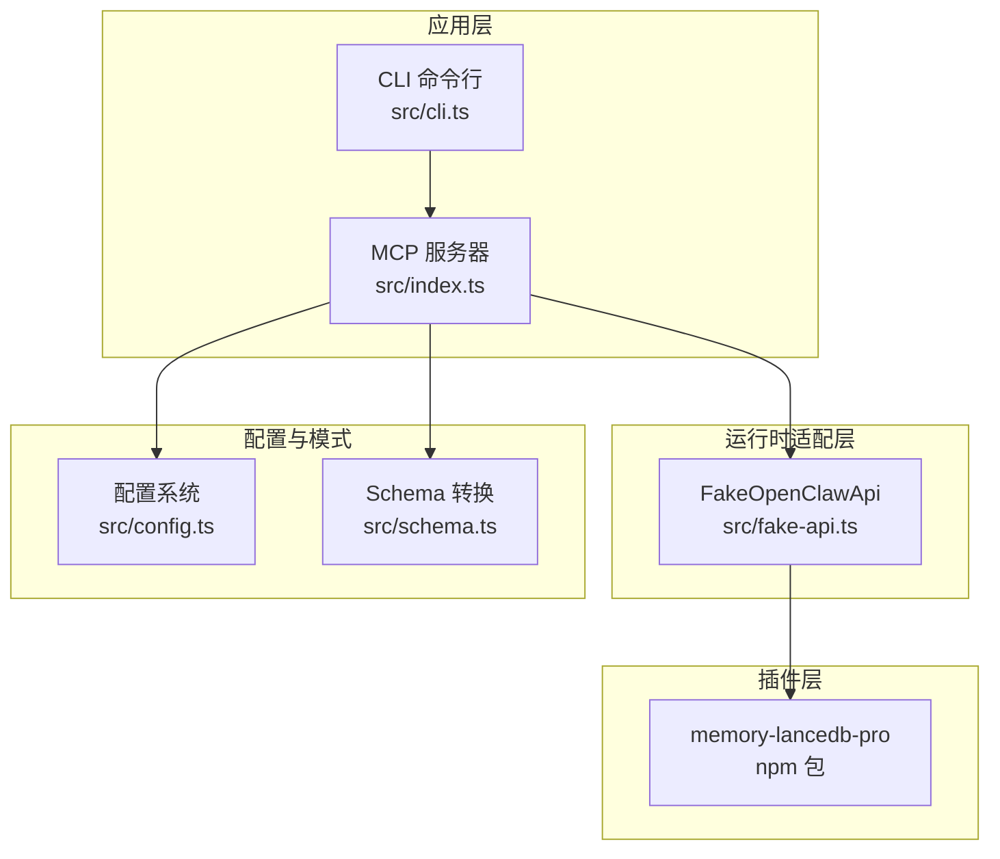
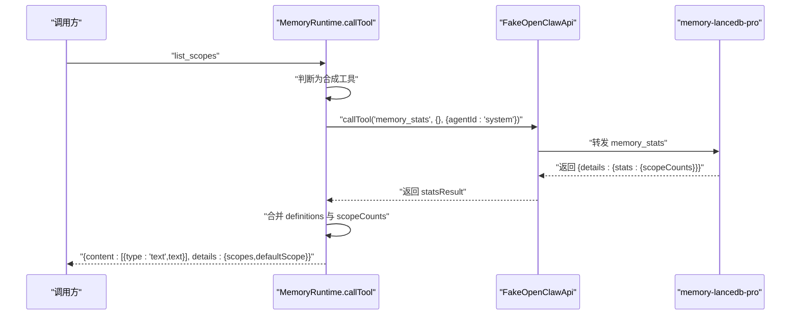
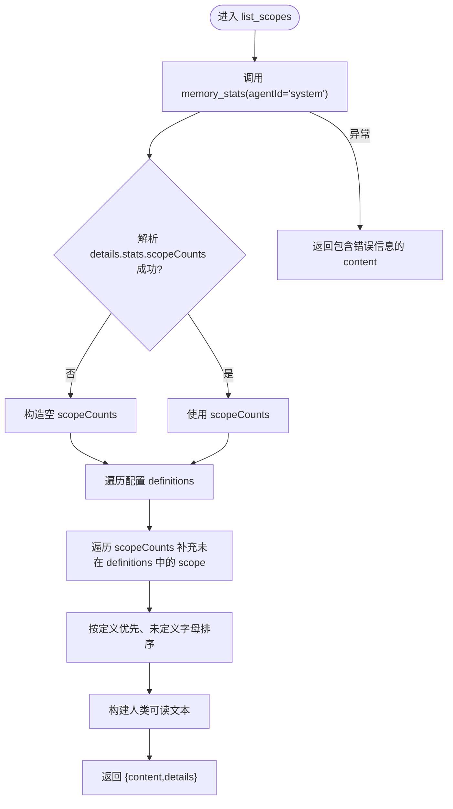
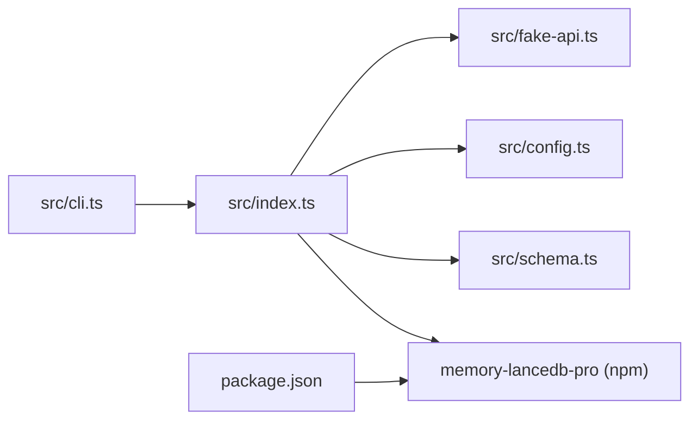

# 合成工具

<cite>
**本文引用的文件**
- [src/index.ts](file://src/index.ts)
- [src/fake-api.ts](file://src/fake-api.ts)
- [src/config.ts](file://src/config.ts)
- [src/schema.ts](file://src/schema.ts)
- [src/cli.ts](file://src/cli.ts)
- [README.md](file://README.md)
- [docs/USAGE_GUIDE.md](file://docs/USAGE_GUIDE.md)
- [package.json](file://package.json)
</cite>

## 目录
1. [简介](#简介)
2. [项目结构](#项目结构)
3. [核心组件](#核心组件)
4. [架构总览](#架构总览)
5. [详细组件分析](#详细组件分析)
6. [依赖分析](#依赖分析)
7. [性能考虑](#性能考虑)
8. [故障排除指南](#故障排除指南)
9. [结论](#结论)
10. [附录](#附录)

## 简介
本文聚焦于合成工具“list_scopes”的实现与行为，深入解释其如何合并配置定义与实际使用情况，提供完整的 scope 列表，并阐述其在多项目管理和 scope 隔离中的关键作用。文档涵盖参数定义、输入输出格式、返回值结构、调用示例、ACL 权限处理与错误处理机制，并给出最佳实践与排障建议。

## 项目结构
该项目围绕“MCP Server 包装器”展开，核心入口位于 src/index.ts，负责：
- 加载配置与插件
- 注册 FakeOpenClawApi 以桥接 memory-lancedb-pro 的工具
- 提供合成工具 list_scopes 的实现
- 处理标签注入、scope 注入与 ACL 绕过逻辑
- 暴露工具清单与事件钩子

图表来源
- [src/index.ts:190-498](file://src/index.ts#L190-L498)
- [src/fake-api.ts:57-317](file://src/fake-api.ts#L57-L317)
- [src/config.ts:167-223](file://src/config.ts#L167-L223)
- [src/schema.ts:45-150](file://src/schema.ts#L45-L150)

章节来源
- [src/index.ts:190-498](file://src/index.ts#L190-L498)
- [src/fake-api.ts:57-317](file://src/fake-api.ts#L57-L317)
- [src/config.ts:167-223](file://src/config.ts#L167-L223)
- [src/schema.ts:45-150](file://src/schema.ts#L45-L150)

## 核心组件
- 合成工具 list_scopes：在运行时动态聚合“配置定义的 scope + 实际存在的 scope”，返回结构化列表与默认 scope。
- FakeOpenClawApi：封装工具工厂、事件与 CLI 注册，提供统一的工具调用与定义查询接口。
- 配置系统：解析 YAML 配置，支持环境变量扩展与默认路径发现。
- Schema 转换：将 TypeBox schema 转换为 MCP 兼容的 JSON Schema。

章节来源
- [src/index.ts:248-311](file://src/index.ts#L248-L311)
- [src/fake-api.ts:113-263](file://src/fake-api.ts#L113-L263)
- [src/config.ts:167-223](file://src/config.ts#L167-L223)
- [src/schema.ts:45-150](file://src/schema.ts#L45-L150)

## 架构总览
list_scopes 的执行路径如下：当调用名为“list_scopes”的工具时，运行时会：
- 以“system”代理 ID 调用 memory_stats，绕过 ACL 获取跨 scope 的统计
- 解析统计结果中的 scopeCounts
- 合并配置 scopes.definitions 与统计结果，保证已定义与已使用的 scope 都可见
- 生成人类可读文本与结构化 details（包含 scopes 数组与 defaultScope）

图表来源
- [src/index.ts:248-311](file://src/index.ts#L248-L311)
- [src/fake-api.ts:217-235](file://src/fake-api.ts#L217-L235)

## 详细组件分析

### 合成工具：list_scopes
- 工具名称：list_scopes
- 输入参数：无（空对象 schema）
- 输出内容：
  - content：数组，其中第一个元素为类型为“text”的富文本，包含“可用 scope 列表”、“默认 scope 标记”、“每个 scope 的记忆数量”、“使用说明”
  - details：对象，包含
    - scopes：数组，元素为 { name, description?, count }
    - defaultScope：字符串，默认 scope 名称
- 行为要点：
  - 合并策略：先遍历配置定义，再补充统计中出现但未在配置中定义的 scope，最终按“已定义优先、未定义按字母排序”的顺序输出
  - ACL 绕过：使用 agentId="system" 调用 memory_stats，从而获得跨 scope 的 scopeCounts
  - 默认 scope：取自配置 scopes.default，若不存在则默认为 "global"
  - 错误处理：若统计调用失败，返回包含错误信息的文本内容

图表来源
- [src/index.ts:248-311](file://src/index.ts#L248-L311)

章节来源
- [src/index.ts:248-311](file://src/index.ts#L248-L311)

### 参数定义与输入输出格式
- 工具定义（MCP tools/list）：
  - name: "list_scopes"
  - description: 列出所有可用的 memory scope 及其记忆数量
  - inputSchema: 空对象（无参数）
- 调用约定：
  - 无参数，直接调用
  - 返回内容为富文本与结构化 details
- 返回值结构：
  - content[0].type: "text"
  - content[0].text: 多行人类可读文本
  - details.scopes: 数组，元素包含 name、description（可选）、count
  - details.defaultScope: 字符串

章节来源
- [src/index.ts:472-482](file://src/index.ts#L472-L482)
- [src/index.ts:299-302](file://src/index.ts#L299-L302)

### 与配置定义的合并机制
- 配置来源：config.scopes.definitions
- 实际来源：memory_stats.scopeCounts
- 合并规则：
  - definitions 中的 scope 优先，保留 description
  - 若某 scope 在统计中存在但未在配置中定义，则追加到末尾
  - 输出顺序：已定义 scope 保持配置顺序，未定义 scope 按字母排序置于末尾

章节来源
- [src/index.ts:266-285](file://src/index.ts#L266-L285)

### ACL 权限处理与“system”绕过
- 为获取跨 scope 统计，list_scopes 使用 agentId="system" 调用 memory_stats
- “system”是插件侧的 ACL 绕过代理 ID，使 isAccessible() 对任意有效 scope 返回 true
- 这确保 list_scopes 能看到所有 scope 的统计，而不受当前 agent 的 ACL 限制

章节来源
- [src/index.ts:256-258](file://src/index.ts#L256-L258)
- [README.md:471-477](file://README.md#L471-L477)
- [docs/USAGE_GUIDE.md:489-496](file://docs/USAGE_GUIDE.md#L489-L496)

### 错误处理机制
- 统计调用失败：返回包含错误信息的文本内容，便于上层感知
- 未找到配置文件：loadConfig 抛出错误，createMemoryRuntime 会传播
- 配置解析失败：YAML 解析错误会被捕获并抛出

章节来源
- [src/index.ts:303-310](file://src/index.ts#L303-L310)
- [src/config.ts:167-214](file://src/config.ts#L167-L214)

### 工具调用示例
- CLI 使用：
  - mem doctor：验证配置并列出工具（包含 list_scopes）
  - mem scope list：通过本地 store 直接读取 scope 统计（与 list_scopes 的统计来源不同）
- MCP 使用：
  - 调用 list_scopes，接收结构化 details 与人类可读文本
  - 使用 details.defaultScope 作为默认 scope 的提示
  - 使用 details.scopes 遍历 scope 列表，结合 scope 参数在其他工具中查询

章节来源
- [src/cli.ts:449-517](file://src/cli.ts#L449-L517)
- [src/cli.ts:527-562](file://src/cli.ts#L527-L562)
- [src/index.ts:472-482](file://src/index.ts#L472-L482)

### 在多项目管理与 scope 隔离中的作用
- 识别可用 scope：帮助用户快速了解当前实例中有哪些 scope，以及每个 scope 的记忆数量
- 默认 scope 提示：通过 details.defaultScope 明确默认写入目标
- 跨 scope 模式与锁定模式：
  - 跨 scope 模式：list_scopes 返回所有 scope，便于在其他工具中按 scope 过滤
  - 锁定 scope 模式：list_scopes 仍可返回所有 scope 的统计，但其他工具的 scope 参数会被强制为服务端 scope，且不一致的 scope 请求会被拒绝
- 与 ACL 的关系：list_scopes 使用“system”绕过 ACL 获取跨 scope 统计，而其他工具在锁定模式下通过“system”绕过 ACL，同时在 wrapper 层强制 scope 一致

章节来源
- [README.md:426-498](file://README.md#L426-L498)
- [docs/USAGE_GUIDE.md:423-565](file://docs/USAGE_GUIDE.md#L423-L565)
- [src/index.ts:351-370](file://src/index.ts#L351-L370)

## 依赖分析
- 依赖关系：
  - src/index.ts 依赖 src/fake-api.ts 提供的工具调用与定义查询
  - 依赖 src/config.ts 提供的配置解析与 scopes 定义
  - 依赖 src/schema.ts 将 TypeBox schema 转换为 MCP 兼容 JSON Schema
  - 依赖 memory-lancedb-pro（通过 jiti 直接加载）提供工具实现
- 外部依赖：
  - @modelcontextprotocol/sdk：MCP 协议 SDK
  - yaml：YAML 解析
  - jiti：TS 源码直载

图表来源
- [src/index.ts:9-12](file://src/index.ts#L9-L12)
- [src/fake-api.ts:13-15](file://src/fake-api.ts#L13-L15)
- [src/config.ts:17-17](file://src/config.ts#L17-L17)
- [src/schema.ts:16-33](file://src/schema.ts#L16-L33)
- [package.json:26-31](file://package.json#L26-L31)

章节来源
- [src/index.ts:9-12](file://src/index.ts#L9-L12)
- [src/fake-api.ts:13-15](file://src/fake-api.ts#L13-L15)
- [src/config.ts:17-17](file://src/config.ts#L17-L17)
- [src/schema.ts:16-33](file://src/schema.ts#L16-L33)
- [package.json:26-31](file://package.json#L26-L31)

## 性能考虑
- list_scopes 的统计调用使用 agentId="system" 绕过 ACL，避免逐 scope 查询带来的多次往返
- 合并逻辑为 O(N+M)，其中 N 为定义的 scope 数，M 为统计中出现的 scope 数，整体开销较小
- 输出文本构建与 details 结构化数据均为常量时间操作

## 故障排除指南
- list_scopes 返回错误文本：
  - 检查 memory_stats 是否可用（确认插件加载成功）
  - 检查配置文件是否存在且可解析
- scope 不一致导致其他工具被拒绝：
  - 确认服务端启动时的 --scope 与请求中指定的 scope 一致
  - 在跨 scope 模式下，可不指定 scope 或指定目标 scope
- ACL 相关问题：
  - 确认 agentId 的使用是否符合预期（list_scopes 使用 system 绕过，其他工具在锁定模式下也使用 system 绕过）
  - 使用 mem scope list 查看可用 scope

章节来源
- [src/index.ts:303-310](file://src/index.ts#L303-L310)
- [README.md:653-666](file://README.md#L653-L666)
- [docs/USAGE_GUIDE.md:653-666](file://docs/USAGE_GUIDE.md#L653-L666)

## 结论
list_scopes 作为合成工具，巧妙地将“配置定义的 scope”与“实际存在的 scope”整合，为用户提供完整的 scope 视图与默认 scope 提示。它通过“system”代理 ID 绕过 ACL 获取跨 scope 统计，既满足跨 scope 模式的灵活查询，又与锁定模式下的 ACL 强制保持一致。该工具在多项目管理与 scope 隔离中扮演关键角色，是理解与治理记忆空间的重要入口。

## 附录
- 相关工具与概念：
  - memory_stats：提供 scope 统计
  - memory_recall/memory_list：支持 scope 与 tags 过滤
  - agentId="system"：系统级绕过 ACL 的代理 ID
  - scopes.default：默认 scope 名称

章节来源
- [src/index.ts:256-258](file://src/index.ts#L256-L258)
- [src/index.ts:287-288](file://src/index.ts#L287-L288)
- [README.md:634-637](file://README.md#L634-L637)
- [docs/USAGE_GUIDE.md:634-637](file://docs/USAGE_GUIDE.md#L634-L637)