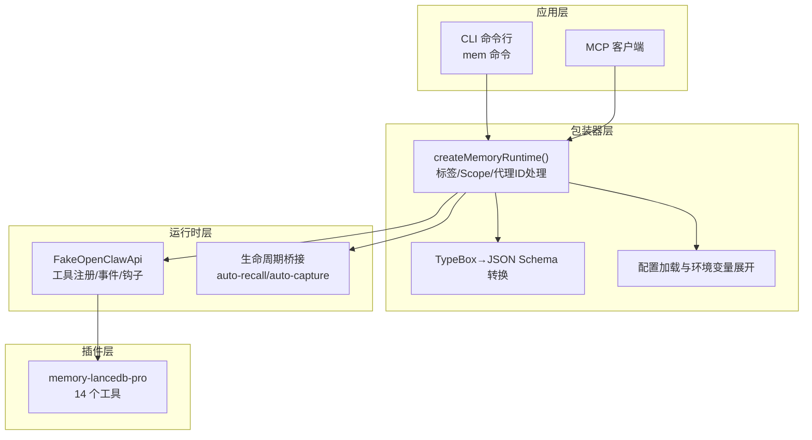
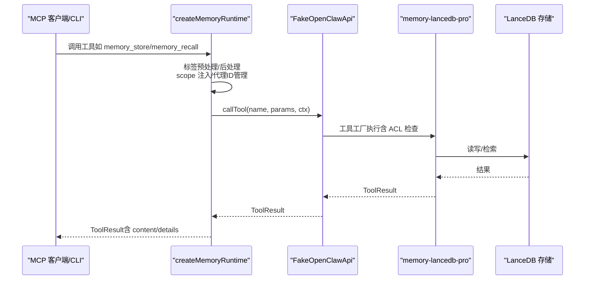
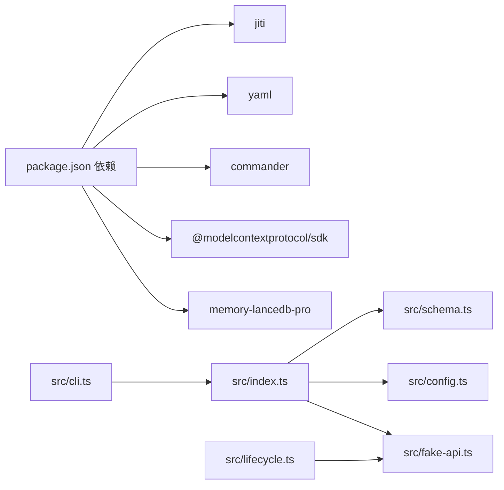

# 核心记忆工具

<cite>
**本文引用的文件**
- [src/index.ts](file://src/index.ts)
- [src/cli.ts](file://src/cli.ts)
- [src/schema.ts](file://src/schema.ts)
- [src/config.ts](file://src/config.ts)
- [src/fake-api.ts](file://src/fake-api.ts)
- [src/lifecycle.ts](file://src/lifecycle.ts)
- [package.json](file://package.json)
- [README.md](file://README.md)
- [docs/USAGE_GUIDE.md](file://docs/USAGE_GUIDE.md)
- [test/integration.test.mjs](file://test/integration.test.mjs)
</cite>

## 目录
1. [简介](#简介)
2. [项目结构](#项目结构)
3. [核心组件](#核心组件)
4. [架构总览](#架构总览)
5. [详细组件分析](#详细组件分析)
6. [依赖分析](#依赖分析)
7. [性能考量](#性能考量)
8. [故障排除指南](#故障排除指南)
9. [结论](#结论)
10. [附录](#附录)

## 简介
本文件面向“核心记忆工具”的使用者与集成者，系统梳理 memory_store、memory_recall、memory_list、memory_forget、memory_update、memory_stats 六个工具的完整实现与使用方式。重点涵盖：
- 参数定义与输入输出格式
- JSON Schema 结构来源与转换
- 标签系统与 scope 注入机制
- 代理 ID（agentId）处理与 ACL 绕过
- 错误处理与边界情况
- 工具调用示例、最佳实践与性能考虑
- 工具组合使用场景与集成模式

## 项目结构
该项目通过包装器将 memory-lancedb-pro 的 14 个工具暴露为 MCP 工具，并提供 CLI 与生命周期桥接能力。核心文件职责如下：
- src/index.ts：核心运行时工厂、标签预处理/后处理、scope 注入、代理 ID 管理、工具列表增强
- src/cli.ts：mem 命令行入口，封装各工具的 CLI 行为
- src/schema.ts：TypeBox 到 JSON Schema 的转换器
- src/config.ts：配置加载、环境变量展开、默认配置模板
- src/fake-api.ts：模拟 OpenClaw 运行时接口，承载工具注册与事件钩子
- src/lifecycle.ts：生命周期事件桥接（自动召回/自动捕获等）
- package.json：依赖与二进制入口
- README.md / docs/USAGE_GUIDE.md：使用手册与工具参考
- test/integration.test.mjs：集成测试，验证工具注册与 JSON Schema 有效性

图表来源
- [src/index.ts:190-498](file://src/index.ts#L190-L498)
- [src/cli.ts:105-617](file://src/cli.ts#L105-L617)
- [src/schema.ts:39-151](file://src/schema.ts#L39-L151)
- [src/config.ts:167-223](file://src/config.ts#L167-L223)
- [src/fake-api.ts:57-318](file://src/fake-api.ts#L57-L318)
- [src/lifecycle.ts:52-178](file://src/lifecycle.ts#L52-L178)

章节来源
- [src/index.ts:190-498](file://src/index.ts#L190-L498)
- [src/cli.ts:105-617](file://src/cli.ts#L105-L617)
- [src/schema.ts:39-151](file://src/schema.ts#L39-L151)
- [src/config.ts:167-223](file://src/config.ts#L167-L223)
- [src/fake-api.ts:57-318](file://src/fake-api.ts#L57-L318)
- [src/lifecycle.ts:52-178](file://src/lifecycle.ts#L52-L178)

## 核心组件
- createMemoryRuntime：主工厂函数，负责加载配置、构建 FakeOpenClawApi、注册插件、初始化生命周期事件，并提供工具调用、事件发射、钩子触发与 CLI 实例导出。
- FakeOpenClawApi：模拟 OpenClaw 运行时，承载工具工厂注册、事件与钩子系统、CLI 注册、路径解析等。
- TypeBox→JSON Schema 转换器：将插件侧 TypeBox 参数 schema 转换为 MCP 兼容的 JSON Schema。
- 配置系统：YAML 配置加载、环境变量展开、默认配置模板与路径解析。
- 生命周期桥接：将 OpenClaw 的 before_prompt_build、agent_end 等事件映射为可调用的工具或函数。

章节来源
- [src/index.ts:190-498](file://src/index.ts#L190-L498)
- [src/fake-api.ts:57-318](file://src/fake-api.ts#L57-L318)
- [src/schema.ts:39-151](file://src/schema.ts#L39-L151)
- [src/config.ts:167-223](file://src/config.ts#L167-L223)
- [src/lifecycle.ts:52-178](file://src/lifecycle.ts#L52-L178)

## 架构总览
包装器通过 jiti 直接从 npm 加载 memory-lancedb-pro 的 TypeScript 源码，无需本地构建。核心流程：
- 初始化配置与 FakeOpenClawApi
- 注册插件（14 个工具）
- 暴露工具列表（含标签参数注入）
- 工具调用时执行标签预处理/后处理、scope 注入、代理 ID 管理
- 生命周期事件通过 FakeOpenClawApi 发射与触发

图表来源
- [src/index.ts:248-453](file://src/index.ts#L248-L453)
- [src/fake-api.ts:217-235](file://src/fake-api.ts#L217-L235)

章节来源
- [src/index.ts:248-453](file://src/index.ts#L248-L453)
- [src/fake-api.ts:217-235](file://src/fake-api.ts#L217-L235)

## 详细组件分析

### memory_store（存储记忆）
- 参数定义
  - text：必填，记忆正文
  - category：可选，类别（preference/fact/decision/entity/reflection/other）
  - importance：可选，0-1，默认 0.7
  - scope：可选，目标 scope
  - tags：可选，逗号分隔标签（自动嵌入到 text 前缀）
- 输入输出
  - 输入：JSON Schema 映射自插件 TypeBox schema
  - 输出：ToolResult，content 为文本块，details 可能包含结构化统计
- 标签处理
  - 存储前将 tags 转换为“【标签:x,y】”前缀并拼接到 text 前
- scope 注入
  - 跨 scope 模式：未指定 scope 时自动注入默认 scope（如 global）
  - 锁定 scope 模式：强制写入服务端 scope，不一致则拒绝
- 代理 ID
  - 写操作默认使用 agentId="system" 绕过 ACL 检查
- 错误处理
  - 非法 tags 字符会抛出错误
  - scope 不匹配会返回明确错误信息
- 性能与最佳实践
  - 建议每条记忆包含 100-200 字上下文，提升语义召回稳定性
  - importance 与 category 有助于后续检索与治理

章节来源
- [src/index.ts:313-335](file://src/index.ts#L313-L335)
- [src/index.ts:370-385](file://src/index.ts#L370-L385)
- [src/index.ts:443-450](file://src/index.ts#L443-L450)
- [src/cli.ts:317-343](file://src/cli.ts#L317-L343)
- [README.md:552-561](file://README.md#L552-L561)
- [docs/USAGE_GUIDE.md:169-197](file://docs/USAGE_GUIDE.md#L169-L197)

### memory_recall（语义召回）
- 参数定义
  - query：必填，检索关键词
  - limit：可选，默认 3-5（上限 20）
  - scope：可选，限定 scope
  - category：可选，限定分类
  - tags：可选，逗号分隔标签（软过滤，BM25 加权）
- 输入输出
  - 输入：JSON Schema 映射自插件 TypeBox schema
  - 输出：ToolResult，content 为格式化的检索结果文本
- 标签处理
  - 传入 tags 时，将 query 前缀替换为“【标签:x,y】”以命中 BM25
  - 结果展示时剥离前缀，保证用户看到干净文本
- scope 注入
  - 跨 scope 模式：跨 scope 检索
  - 锁定 scope 模式：仅返回该 scope 的记忆
- 代理 ID
  - 跨 scope 模式：agentId="system" 绕过 ACL
- 错误处理
  - 非法 tags 字符会抛出错误
  - scope 不匹配会返回明确错误信息
- 性能与最佳实践
  - query 构造建议“实体名 + 技术术语 + 关键细节”
  - tags 为软过滤，如需硬排除可结合 category

章节来源
- [src/index.ts:313-335](file://src/index.ts#L313-L335)
- [src/index.ts:399-450](file://src/index.ts#L399-L450)
- [src/cli.ts:246-273](file://src/cli.ts#L246-L273)
- [README.md:562-571](file://README.md#L562-L571)
- [docs/USAGE_GUIDE.md:198-219](file://docs/USAGE_GUIDE.md#L198-L219)

### memory_list（列表查看）
- 参数定义
  - limit：可选，默认 10，上限 50
  - offset：可选，默认 0
  - scope：可选
  - category：可选
  - tags：可选，逗号分隔标签（软过滤）
- 输入输出
  - 输入：JSON Schema 映射自插件 TypeBox schema
  - 输出：ToolResult，content 为格式化的列表文本
- 标签处理
  - 当传入 tags 时，将请求重写为 memory_recall（带标签前缀），以实现标签过滤
  - 结果展示时剥离前缀
- scope 注入
  - 跨 scope 模式：跨 scope 列表
  - 锁定 scope 模式：仅列出该 scope
- 代理 ID
  - 跨 scope 模式：agentId="system" 绕过 ACL
- 错误处理
  - 非法 tags 字符会抛出错误
  - scope 不匹配会返回明确错误信息
- 性能与最佳实践
  - tags 为软过滤，如需硬排除可结合 category
  - limit/offset 控制分页，避免一次性返回过多

章节来源
- [src/index.ts:313-335](file://src/index.ts#L313-L335)
- [src/index.ts:399-450](file://src/index.ts#L399-L450)
- [src/cli.ts:185-232](file://src/cli.ts#L185-L232)
- [README.md:572-581](file://README.md#L572-L581)
- [docs/USAGE_GUIDE.md:220-231](file://docs/USAGE_GUIDE.md#L220-L231)

### memory_forget（删除记忆）
- 参数定义
  - memoryId：二选一，记忆 ID（完整 UUID 或 8+ 位前缀）
  - query：二选一，先检索再选择删除
  - scope：可选，限定 scope
- 输入输出
  - 输入：JSON Schema 映射自插件 TypeBox schema
  - 输出：ToolResult，content 为删除结果文本
- 标签处理
  - 无标签处理
- scope 注入
  - 跨 scope 模式：跨 scope 删除
  - 锁定 scope 模式：仅删除该 scope 的记忆
- 代理 ID
  - 跨 scope 模式：agentId="system" 绕过 ACL
- 错误处理
  - 非法 tags 字符会抛出错误
  - scope 不匹配会返回明确错误信息
- 性能与最佳实践
  - 建议先用 query 检索确认，再删除
  - 删除操作不可逆，谨慎使用

章节来源
- [src/cli.ts:354-364](file://src/cli.ts#L354-L364)
- [README.md:582-588](file://README.md#L582-L588)
- [docs/USAGE_GUIDE.md:232-244](file://docs/USAGE_GUIDE.md#L232-L244)

### memory_update（更新记忆）
- 参数定义
  - memoryId：必填，记忆 ID
  - text：可选，更新文本（触发重新嵌入）
  - category：可选，更新分类
  - importance：可选，更新重要度
- 输入输出
  - 输入：JSON Schema 映射自插件 TypeBox schema
  - 输出：ToolResult，content 为更新结果文本
- 标签处理
  - 无标签处理
- scope 注入
  - 跨 scope 模式：跨 scope 更新
  - 锁定 scope 模式：仅更新该 scope 的记忆
- 代理 ID
  - 跨 scope 模式：agentId="system" 绕过 ACL
- 错误处理
  - 非法 tags 字符会抛出错误
  - scope 不匹配会返回明确错误信息
- 性能与最佳实践
  - 修改 text 会触发重新嵌入，注意成本与频率

章节来源
- [README.md:589-597](file://README.md#L589-L597)
- [docs/USAGE_GUIDE.md:245-255](file://docs/USAGE_GUIDE.md#L245-L255)

### memory_stats（统计信息）
- 参数定义
  - scope：可选，限定 scope
- 输入输出
  - 输入：JSON Schema 映射自插件 TypeBox schema
  - 输出：ToolResult，content 为统计文本，details 可能包含结构化统计（如 scopeCounts）
- 标签处理
  - 无标签处理
- scope 注入
  - 跨 scope 模式：全局统计
  - 锁定 scope 模式：该 scope 统计
- 代理 ID
  - 跨 scope 模式：agentId="system" 绕过 ACL
- 错误处理
  - 非法 tags 字符会抛出错误
  - scope 不匹配会返回明确错误信息
- 性能与最佳实践
  - 用于监控与运维，建议定期调用

章节来源
- [src/index.ts:254-311](file://src/index.ts#L254-L311)
- [src/cli.ts:287-303](file://src/cli.ts#L287-L303)
- [README.md:598-603](file://README.md#L598-L603)
- [docs/USAGE_GUIDE.md:256-265](file://docs/USAGE_GUIDE.md#L256-L265)

### JSON Schema 结构与转换
- TypeBox→JSON Schema 转换
  - 清理 TypeBox 内部属性，保留标准 JSON Schema 字段
  - 递归处理 properties/items/oneOf/anyOf/allOf
  - 若顶层非 object，包裹为 { input: schema }
- 工具列表增强
  - 对 tag-aware 工具（memory_store/memory_recall/memory_list）注入 tags 参数
  - synthetic 工具 list_scopes 用于枚举 scope

章节来源
- [src/schema.ts:39-151](file://src/schema.ts#L39-L151)
- [src/index.ts:455-482](file://src/index.ts#L455-L482)

### 标签系统（Tags）
- 前缀机制
  - 存储时将 tags 转换为“【标签:x,y】”前缀并拼接到 text
  - 检索时通过 BM25 命中前缀，实现软过滤（加权而非硬排除）
  - 展示时自动剥离前缀，保证用户看到干净文本
- 校验规则
  - 仅允许字母、数字、下划线、连字符、冒号、斜杠、点、CJK 字符、逗号
  - 明确禁止使用“【”、“】”、空格、emoji 等
  - 非法字符会立即抛错，避免破坏前缀结构
- 与工具的交互
  - memory_store：自动嵌入前缀
  - memory_recall/memory_list：将 tags 转换为前缀 query，实现标签过滤
  - 后处理阶段剥离前缀，保证结果整洁

章节来源
- [src/index.ts:18-52](file://src/index.ts#L18-L52)
- [src/index.ts:313-335](file://src/index.ts#L313-L335)
- [src/index.ts:399-450](file://src/index.ts#L399-L450)
- [README.md:639-672](file://README.md#L639-L672)
- [docs/USAGE_GUIDE.md:392-421](file://docs/USAGE_GUIDE.md#L392-L421)

### Scope 注入与代理 ID（agentId）
- 运行模式
  - 跨 scope 模式：默认，可读写任意 scope；memory_store 不指定 scope 自动写入默认 scope（如 global）
  - 锁定 scope 模式：服务端 --scope X，所有操作强制限定在 X；请求其他 scope 会被拒绝
- Scope 注入
  - 跨 scope 模式：写操作未指定 scope 时自动注入默认 scope
  - 锁定模式：强制将 normalized.scope 设为服务端 scope，不一致则拒绝
- 代理 ID
  - 跨 scope 模式：agentId="system" 绕过 ACL 检查
  - 锁定模式：agentId="system" 绕过 ACL 检查，确保对目标 scope 的访问
- 与 ACL 的关系
  - isSystemBypassId("system") 使 isAccessible() 对任何有效 scope 返回 true
  - 不一致的 scope 请求在进入插件前即被拒绝

章节来源
- [src/index.ts:337-385](file://src/index.ts#L337-L385)
- [README.md:426-499](file://README.md#L426-L499)
- [docs/USAGE_GUIDE.md:423-498](file://docs/USAGE_GUIDE.md#L423-L498)

### 工具调用示例与最佳实践
- 存储
  - 使用 tags 与 importance 提升召回质量
  - 建议每条记忆包含 100-200 字上下文
- 检索
  - query 构造遵循“实体名 + 技术术语 + 关键细节”
  - 使用 tags 进行软过滤，必要时结合 category 硬排除
- 列表
  - 使用 limit/offset 分页
  - tags 为软过滤，如需硬排除可结合 category
- 删除与更新
  - 先检索确认，再删除或更新
  - 更新 text 会触发重新嵌入，注意成本

章节来源
- [docs/USAGE_GUIDE.md:268-381](file://docs/USAGE_GUIDE.md#L268-L381)
- [docs/USAGE_GUIDE.md:423-565](file://docs/USAGE_GUIDE.md#L423-L565)

### 工具组合使用场景与集成模式
- 场景一：跨 scope 模式 + 标签 + 分类
  - 存储：memory_store + tags + category + importance
  - 检索：memory_recall + tags + category + limit
  - 列表：memory_list + tags + category + limit/offset
- 场景二：锁定 scope 模式 + 精准控制
  - 服务端 --scope project:myapp
  - 所有调用强制在该 scope 内，避免跨 scope 泄漏
- 场景三：生命周期集成
  - before_prompt_build：触发 auto-recall，将上下文注入 prompt 前
  - agent_end：触发 auto-capture，从对话中提取记忆

章节来源
- [src/lifecycle.ts:52-178](file://src/lifecycle.ts#L52-L178)
- [README.md:426-499](file://README.md#L426-L499)
- [docs/USAGE_GUIDE.md:423-565](file://docs/USAGE_GUIDE.md#L423-L565)

## 依赖分析
- 外部依赖
  - memory-lancedb-pro：核心插件，提供 14 个工具与 LanceDB 向量存储
  - @modelcontextprotocol/sdk：MCP 协议支持
  - commander：CLI 命令解析
  - yaml：配置文件解析
  - jiti：TS 源码按需编译加载
- 内部依赖
  - src/index.ts 依赖 src/fake-api.ts、src/config.ts、src/schema.ts
  - src/cli.ts 依赖 src/index.ts、src/config.ts
  - src/lifecycle.ts 依赖 src/fake-api.ts

图表来源
- [package.json:26-31](file://package.json#L26-L31)
- [src/index.ts:9-12](file://src/index.ts#L9-L12)
- [src/cli.ts:20-27](file://src/cli.ts#L20-L27)
- [src/lifecycle.ts:13](file://src/lifecycle.ts#L13)

章节来源
- [package.json:26-31](file://package.json#L26-L31)
- [src/index.ts:9-12](file://src/index.ts#L9-L12)
- [src/cli.ts:20-27](file://src/cli.ts#L20-L27)
- [src/lifecycle.ts:13](file://src/lifecycle.ts#L13)

## 性能考量
- 标签过滤为软过滤（BM25 加权），非硬排除，建议结合 category 使用
- memory_recall 默认返回 3-5 条，如需更多请显式设置 limit（最大 20）
- memory_list 支持分页 limit/offset，避免一次性返回过多
- 更新 text 会触发重新嵌入，注意调用频率与成本
- 跨 scope 模式使用 agentId="system" 绕过 ACL，减少权限检查开销

章节来源
- [docs/USAGE_GUIDE.md:382-390](file://docs/USAGE_GUIDE.md#L382-L390)
- [docs/USAGE_GUIDE.md:600-607](file://docs/USAGE_GUIDE.md#L600-L607)

## 故障排除指南
- 配置问题
  - 配置文件不存在或为空：检查 MEM_CONFIG_PATH 或默认路径
  - apiKey 缺失或环境变量未设置：使用 mem config show 检查
  - 嵌入模型 endpoint 不可达：确认 baseURL 与网络
- 标签错误
  - Invalid tag value：检查标签字符合法性，避免使用保留字符“【”、“】”、空格、emoji
- Scope 权限
  - Scope mismatch：确认服务端 --scope 与请求 scope 一致
  - Access denied to scope：确认 agentId ACL 与 scope 定义
- CLI 与 MCP 服务
  - 源码修改后需重新编译并重启服务
  - WSL 下 tsc 失败：使用 node node_modules/typescript/bin/tsc -p tsconfig.json

章节来源
- [src/config.ts:167-214](file://src/config.ts#L167-L214)
- [src/index.ts:41-52](file://src/index.ts#L41-L52)
- [src/index.ts:354-366](file://src/index.ts#L354-L366)
- [docs/USAGE_GUIDE.md:618-667](file://docs/USAGE_GUIDE.md#L618-L667)

## 结论
本包装器通过统一的标签系统、scope 注入与代理 ID 管理，将 memory-lancedb-pro 的 14 个工具无缝暴露为 MCP 工具，并提供 CLI 与生命周期桥接。核心记忆工具在参数定义、JSON Schema 转换、标签与 scope 处理、错误处理与性能优化方面均提供了清晰的实现与最佳实践，适合在多项目隔离与复杂检索场景中稳定使用。

## 附录
- 工具清单与描述
  - memory_store、memory_recall、memory_list、memory_forget、memory_update、memory_stats
  - list_scopes（synthetic）
- 配置要点
  - embedding.apiKey、model、dimensions、dbPath
  - scopes.default、enableManagementTools、autoCapture、autoRecall
- CLI 常用命令
  - mem serve、mem store、mem search、mem list、mem stats、mem delete、mem scope

章节来源
- [test/integration.test.mjs:43-67](file://test/integration.test.mjs#L43-L67)
- [src/index.ts:455-482](file://src/index.ts#L455-L482)
- [src/config.ts:229-290](file://src/config.ts#L229-L290)
- [src/cli.ts:105-617](file://src/cli.ts#L105-L617)