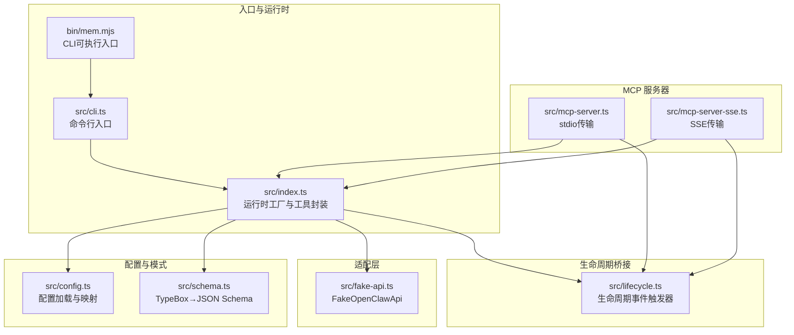
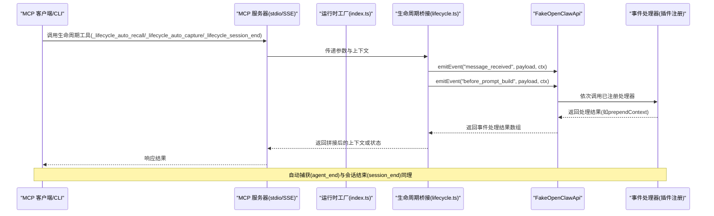
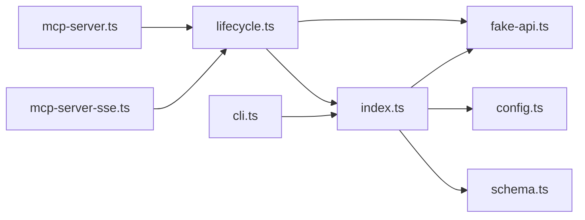

# 生命周期工具

<cite>
**本文引用的文件**
- [src/lifecycle.ts](file://src/lifecycle.ts)
- [src/index.ts](file://src/index.ts)
- [src/fake-api.ts](file://src/fake-api.ts)
- [src/mcp-server.ts](file://src/mcp-server.ts)
- [src/mcp-server-sse.ts](file://src/mcp-server-sse.ts)
- [src/cli.ts](file://src/cli.ts)
- [src/config.ts](file://src/config.ts)
- [src/schema.ts](file://src/schema.ts)
- [package.json](file://package.json)
- [README.md](file://README.md)
- [bin/mem.mjs](file://bin/mem.mjs)
</cite>

## 目录
1. [简介](#简介)
2. [项目结构](#项目结构)
3. [核心组件](#核心组件)
4. [架构总览](#架构总览)
5. [详细组件分析](#详细组件分析)
6. [依赖分析](#依赖分析)
7. [性能考虑](#性能考虑)
8. [故障排除指南](#故障排除指南)
9. [结论](#结论)
10. [附录](#附录)

## 简介
本文件聚焦于“生命周期工具”，系统性阐述与系统生命周期相关的工具与事件处理机制。文档覆盖以下方面：
- 生命周期事件的触发时机、参数定义、处理流程与影响范围
- 事件监听器的注册方式、事件处理器的实现模式与最佳实践
- 生命周期工具在系统状态管理、资源清理与性能监控中的作用
- 生命周期事件的调试方法与故障排除指南

生命周期工具在本项目中体现为一组 MCP 工具（以内部工具名暴露），它们通过统一的事件桥接层触发底层插件的生命周期事件，从而实现自动召回、自动捕获、会话结束清理等能力。

## 项目结构
该项目采用模块化组织，围绕“生命周期桥接”“MCP 服务器”“FakeOpenClawApi 适配层”“配置与模式转换”等核心模块展开。生命周期工具位于独立的桥接模块中，并被 MCP 服务器与 CLI 复用。

图表来源
- [src/index.ts:1-515](file://src/index.ts#L1-L515)
- [src/lifecycle.ts:1-178](file://src/lifecycle.ts#L1-L178)
- [src/mcp-server.ts:1-306](file://src/mcp-server.ts#L1-L306)
- [src/mcp-server-sse.ts:1-405](file://src/mcp-server-sse.ts#L1-L405)
- [src/fake-api.ts:1-318](file://src/fake-api.ts#L1-L318)
- [src/config.ts:1-312](file://src/config.ts#L1-L312)
- [src/schema.ts:1-151](file://src/schema.ts#L1-L151)
- [bin/mem.mjs:1-8](file://bin/mem.mjs#L1-L8)

章节来源
- [src/index.ts:190-498](file://src/index.ts#L190-L498)
- [src/lifecycle.ts:1-178](file://src/lifecycle.ts#L1-L178)
- [src/mcp-server.ts:43-140](file://src/mcp-server.ts#L43-L140)
- [src/mcp-server-sse.ts:57-209](file://src/mcp-server-sse.ts#L57-L209)
- [src/fake-api.ts:57-317](file://src/fake-api.ts#L57-L317)
- [src/config.ts:167-223](file://src/config.ts#L167-L223)
- [src/schema.ts:39-150](file://src/schema.ts#L39-L150)
- [bin/mem.mjs:1-8](file://bin/mem.mjs#L1-L8)

## 核心组件
- 生命周期事件触发器：封装了自动召回、自动捕获、会话结束、消息接收等事件的触发逻辑，负责构造事件负载与上下文，并通过 FakeOpenClawApi 的事件系统分发。
- FakeOpenClawApi：适配层，提供工具注册、事件与钩子注册、CLI 注册、事件分发与钩子触发等能力，是生命周期事件与插件生态的桥梁。
- MCP 服务器：提供 stdio 与 SSE 两种传输模式，将生命周期工具暴露给 MCP 客户端，并在工具调用前后触发相应的生命周期事件。
- 运行时工厂：负责加载配置、创建 FakeOpenClawApi、注册插件、发出网关启动事件、构建运行时对象，供服务器与 CLI 使用。
- CLI：提供 mem 命令行工具，支持服务启动、工具列表、搜索、统计、配置管理、健康检查等，内部也使用生命周期工具进行自动捕获与会话清理。

章节来源
- [src/lifecycle.ts:52-177](file://src/lifecycle.ts#L52-L177)
- [src/fake-api.ts:133-301](file://src/fake-api.ts#L133-L301)
- [src/mcp-server.ts:154-305](file://src/mcp-server.ts#L154-L305)
- [src/mcp-server-sse.ts:336-404](file://src/mcp-server-sse.ts#L336-L404)
- [src/index.ts:207-498](file://src/index.ts#L207-L498)
- [src/cli.ts:105-616](file://src/cli.ts#L105-L616)

## 架构总览
生命周期工具的调用链路如下：MCP 客户端或 CLI 调用生命周期工具 → 服务器/CLI 将事件参数转交给生命周期桥接函数 → 桥接函数构造事件负载与上下文 → 通过 FakeOpenClawApi 的事件系统分发给已注册的处理器 → 处理器完成相应动作（如自动召回、自动捕获、清理）。

图表来源
- [src/mcp-server.ts:235-305](file://src/mcp-server.ts#L235-L305)
- [src/mcp-server-sse.ts:378-404](file://src/mcp-server-sse.ts#L378-L404)
- [src/lifecycle.ts:52-177](file://src/lifecycle.ts#L52-L177)
- [src/fake-api.ts:269-287](file://src/fake-api.ts#L269-L287)

## 详细组件分析

### 生命周期事件类型与触发时机
- before_prompt_build（自动召回）
  - 触发时机：在发送用户提示词前，准备上下文
  - 参数要点：prompt/content、sessionKey、agentId/sessionId/channelId
  - 处理流程：先触发 message_received 缓存原始消息，再触发 before_prompt_build 获取可前置的上下文
  - 影响范围：返回 prependContext，用于在提示构建阶段注入相关记忆
- agent_end（自动捕获）
  - 触发时机：一次对话回合或会话结束后
  - 参数要点：success、messages、sessionKey、agentId/sessionId
  - 处理流程：异步触发，后台提取关键信息并写入记忆
  - 影响范围：增强记忆库，便于后续检索与反思
- session_end（会话清理）
  - 触发时机：会话结束时
  - 参数要点：sessionKey、agentId/sessionId
  - 处理流程：触发清理挂起状态，释放资源
  - 影响范围：保证内存与缓存的一致性
- message_received（消息缓存）
  - 触发时机：收到用户消息时
  - 参数要点：content、role=user、sessionKey、agentId/sessionId/channelId
  - 处理流程：缓存原始消息，供自动召回的门控逻辑使用
  - 影响范围：提升召回的准确性与一致性

章节来源
- [src/lifecycle.ts:42-91](file://src/lifecycle.ts#L42-L91)
- [src/lifecycle.ts:97-128](file://src/lifecycle.ts#L97-L128)
- [src/lifecycle.ts:134-153](file://src/lifecycle.ts#L134-L153)
- [src/lifecycle.ts:155-177](file://src/lifecycle.ts#L155-L177)
- [src/mcp-server.ts:240-270](file://src/mcp-server.ts#L240-L270)
- [src/mcp-server-sse.ts:384-390](file://src/mcp-server-sse.ts#L384-L390)

### 事件监听器注册与事件处理器实现模式
- 注册方式
  - 事件处理器通过 FakeOpenClawApi 的 on(event, handler, opts) 注册，支持优先级排序
  - 钩子处理器通过 registerHook(name, handler, opts) 注册
- 处理器实现模式
  - 事件处理器：接收 payload 与 ctx，返回可选结果（如 prependContext）
  - 钩子处理器：无返回值，用于执行副作用（如日志、指标上报）
- 最佳实践
  - 明确事件职责边界，避免在单一处理器中做过多 IO
  - 使用优先级控制事件处理顺序，确保前置依赖（如消息缓存）先于召回
  - 对异常进行捕获与记录，避免影响主流程
  - 在自动捕获中采用 fire-and-forget 模式，保证响应时间

章节来源
- [src/fake-api.ts:133-151](file://src/fake-api.ts#L133-L151)
- [src/fake-api.ts:269-301](file://src/fake-api.ts#L269-L301)

### 生命周期工具在系统状态管理、资源清理与性能监控中的作用
- 状态管理
  - 通过 sessionKey 与 agentId 维护会话状态，确保跨工具调用的一致性
  - message_received 缓存原始消息，为自动召回提供门控依据
- 资源清理
  - session_end 触发清理挂起状态，释放临时资源
  - gateway_start 在运行时初始化时触发，可能触发插件内部的整理/压缩等操作
- 性能监控
  - 事件处理链路中可插入钩子处理器进行指标采集（如耗时、命中率）
  - 自动捕获采用后台触发，避免阻塞主线程

章节来源
- [src/index.ts:240-242](file://src/index.ts#L240-L242)
- [src/lifecycle.ts:134-153](file://src/lifecycle.ts#L134-L153)
- [src/mcp-server.ts:250-254](file://src/mcp-server.ts#L250-L254)

### 生命周期工具的参数定义与处理流程
- 自动召回（_lifecycle_auto_recall）
  - 输入参数：prompt、agentId、sessionKey
  - 处理流程：先触发 message_received，再触发 before_prompt_build，合并多个处理器返回的 prependContext
  - 输出：拼接后的上下文文本或“无相关记忆”
- 自动捕获（_lifecycle_auto_capture）
  - 输入参数：messages（数组，每项含 role 与 content）、agentId、sessionKey、success（可选）
  - 处理流程：触发 agent_end，后台提取关键信息
  - 输出：提示“自动捕获已触发”
- 会话结束（_lifecycle_session_end）
  - 输入参数：sessionKey、agentId
  - 处理流程：触发 session_end，清理挂起状态
  - 输出：提示“会话已结束”

章节来源
- [src/mcp-server.ts:154-233](file://src/mcp-server.ts#L154-L233)
- [src/mcp-server.ts:235-305](file://src/mcp-server.ts#L235-L305)
- [src/mcp-server-sse.ts:336-376](file://src/mcp-server-sse.ts#L336-L376)
- [src/mcp-server-sse.ts:378-404](file://src/mcp-server-sse.ts#L378-L404)
- [src/lifecycle.ts:52-177](file://src/lifecycle.ts#L52-L177)

### 事件监听器注册方式与实现模式
- 注册位置
  - 插件在注册时通过 api.on/registerHook 注册事件/钩子处理器
  - FakeOpenClawApi 持有事件与钩子处理器映射表，按优先级排序执行
- 实现模式
  - 事件处理器：返回对象（如包含 prependContext）以供上层拼接
  - 钩子处理器：无返回值，用于副作用（如日志、指标上报）

章节来源
- [src/fake-api.ts:133-151](file://src/fake-api.ts#L133-L151)
- [src/fake-api.ts:269-301](file://src/fake-api.ts#L269-L301)

### 生命周期工具的调试方法与故障排除
- 常见问题
  - 事件未触发：检查插件是否正确注册了事件处理器；确认事件名与上下文字段是否匹配
  - 返回为空：确认 before_prompt_build 处理器是否返回了有效 prependContext
  - 自动捕获未生效：确认 agent_end 是否被触发且处理器未抛出异常
  - 会话清理失败：确认 session_end 是否被触发，处理器是否清理了挂起状态
- 排查步骤
  - 启用详细日志：通过 quiet 选项控制日志级别
  - 使用 doctor 命令：验证配置、插件加载与工具列表
  - 手动触发生命周期工具：在 MCP 客户端或 CLI 中调用生命周期工具，观察返回
  - 检查事件注册：通过运行时 API 查询已注册事件与钩子

章节来源
- [src/cli.ts:449-517](file://src/cli.ts#L449-L517)
- [src/fake-api.ts:309-316](file://src/fake-api.ts#L309-L316)

## 依赖分析
生命周期工具依赖 FakeOpenClawApi 的事件系统，MCP 服务器与 CLI 通过运行时工厂创建的 API 实例进行事件分发。配置系统与模式转换模块为工具与事件提供了基础支撑。

图表来源
- [src/lifecycle.ts:13-177](file://src/lifecycle.ts#L13-L177)
- [src/fake-api.ts:57-317](file://src/fake-api.ts#L57-L317)
- [src/index.ts:207-498](file://src/index.ts#L207-L498)
- [src/mcp-server.ts:17-22](file://src/mcp-server.ts#L17-L22)
- [src/mcp-server-sse.ts:16-23](file://src/mcp-server-sse.ts#L16-L23)
- [src/cli.ts:20-27](file://src/cli.ts#L20-L27)
- [src/config.ts:167-223](file://src/config.ts#L167-L223)
- [src/schema.ts:39-150](file://src/schema.ts#L39-L150)

章节来源
- [src/lifecycle.ts:13-177](file://src/lifecycle.ts#L13-L177)
- [src/fake-api.ts:57-317](file://src/fake-api.ts#L57-L317)
- [src/index.ts:207-498](file://src/index.ts#L207-L498)
- [src/mcp-server.ts:17-22](file://src/mcp-server.ts#L17-L22)
- [src/mcp-server-sse.ts:16-23](file://src/mcp-server-sse.ts#L16-L23)
- [src/cli.ts:20-27](file://src/cli.ts#L20-L27)
- [src/config.ts:167-223](file://src/config.ts#L167-L223)
- [src/schema.ts:39-150](file://src/schema.ts#L39-L150)

## 性能考虑
- 异步事件处理：自动捕获采用 fire-and-forget 模式，避免阻塞主流程
- 事件排序：按优先级排序执行，减少不必要的等待
- 日志控制：通过 quiet 选项抑制调试日志，降低 I/O 开销
- 资源清理：会话结束时及时清理挂起状态，防止内存泄漏

## 故障排除指南
- 配置问题
  - 确认配置文件存在且可解析；检查 embedding.apiKey 是否设置
  - 使用 doctor 命令验证配置有效性与插件加载情况
- 事件未触发
  - 检查插件是否正确注册事件处理器；核对事件名与上下文字段
  - 通过运行时 API 查询已注册事件与钩子
- 自动捕获无效
  - 确认 agent_end 已被触发；检查处理器是否抛出异常
- 会话清理失败
  - 确认 session_end 已被触发；检查处理器是否清理了挂起状态

章节来源
- [src/cli.ts:449-517](file://src/cli.ts#L449-L517)
- [src/fake-api.ts:309-316](file://src/fake-api.ts#L309-L316)

## 结论
生命周期工具通过统一的事件桥接层，将 MCP 客户端与 CLI 的调用与插件内部的生命周期事件紧密耦合。借助 FakeOpenClawApi 的事件系统，实现了自动召回、自动捕获、会话清理等功能，提升了系统的状态管理能力与资源利用率。通过合理的注册与实现模式、完善的调试与故障排除手段，生命周期工具能够在复杂场景中稳定运行并发挥关键作用。

## 附录
- 相关文件与用途
  - src/lifecycle.ts：生命周期事件触发器
  - src/fake-api.ts：事件与钩子注册、事件分发
  - src/mcp-server.ts：stdio 传输的 MCP 服务器
  - src/mcp-server-sse.ts：SSE 传输的 MCP 服务器
  - src/index.ts：运行时工厂与工具封装
  - src/cli.ts：命令行入口与工具
  - src/config.ts：配置加载与映射
  - src/schema.ts：TypeBox→JSON Schema 转换
  - package.json：依赖与脚本
  - README.md：使用说明与特性
  - bin/mem.mjs：CLI 可执行入口

章节来源
- [src/lifecycle.ts:1-178](file://src/lifecycle.ts#L1-L178)
- [src/fake-api.ts:1-318](file://src/fake-api.ts#L1-L318)
- [src/mcp-server.ts:1-306](file://src/mcp-server.ts#L1-L306)
- [src/mcp-server-sse.ts:1-405](file://src/mcp-server-sse.ts#L1-L405)
- [src/index.ts:1-515](file://src/index.ts#L1-L515)
- [src/cli.ts:1-617](file://src/cli.ts#L1-L617)
- [src/config.ts:1-312](file://src/config.ts#L1-L312)
- [src/schema.ts:1-151](file://src/schema.ts#L1-L151)
- [package.json:1-46](file://package.json#L1-L46)
- [README.md:1-738](file://README.md#L1-L738)
- [bin/mem.mjs:1-8](file://bin/mem.mjs#L1-L8)