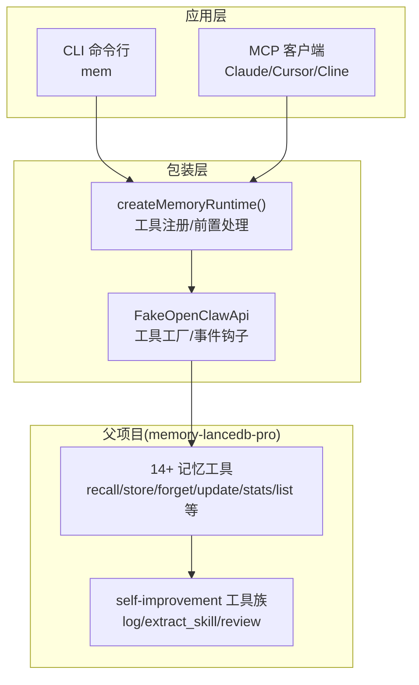
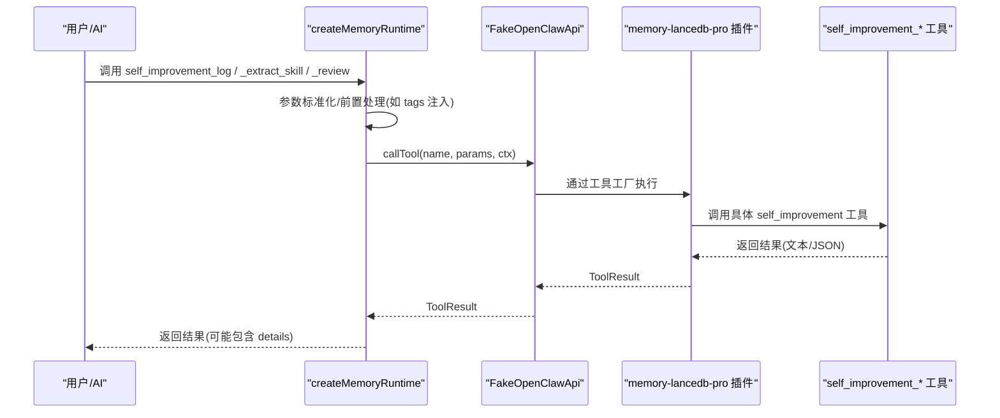
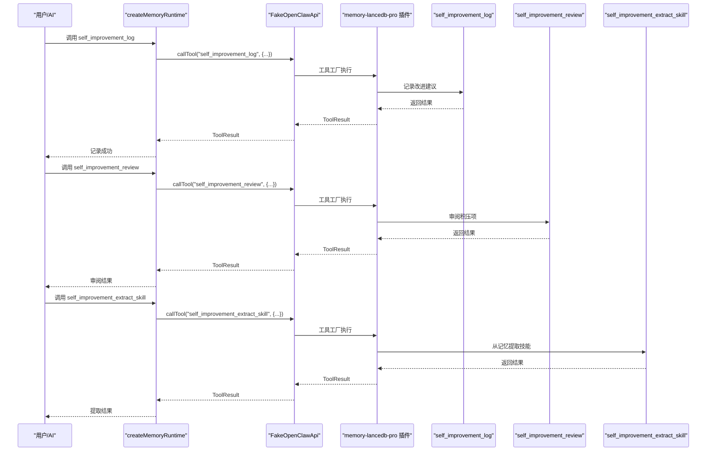
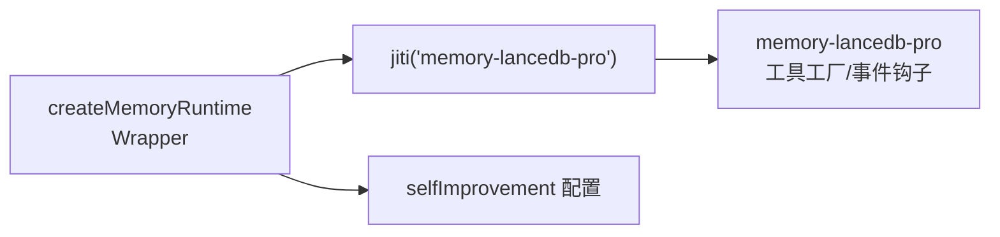

# 自我改进工具

<cite>
**本文引用的文件**
- [src/index.ts](file://src/index.ts)
- [src/fake-api.ts](file://src/fake-api.ts)
- [src/schema.ts](file://src/schema.ts)
- [src/config.ts](file://src/config.ts)
- [README.md](file://README.md)
- [docs/USAGE_GUIDE.md](file://docs/USAGE_GUIDE.md)
- [docs/knowledge-index-skill_DESIGN.md](file://docs/knowledge-index-skill_DESIGN.md)
</cite>

## 目录
1. [简介](#简介)
2. [项目结构](#项目结构)
3. [核心组件](#核心组件)
4. [架构总览](#架构总览)
5. [详细组件分析](#详细组件分析)
6. [依赖分析](#依赖分析)
7. [性能考量](#性能考量)
8. [故障排除指南](#故障排除指南)
9. [结论](#结论)
10. [附录](#附录)

## 简介
本文件面向“自我改进工具”（self-improvement 系列）的使用者与维护者，系统梳理 memory-lancedb-mcp 中与“自我改进”相关的工具与机制，重点覆盖以下三类工具：
- self_improvement_log：记录改进建议或错误经验
- self_improvement_extract_skill：从记忆中提取可复用的技能/规范
- self_improvement_review：审阅积压的待改进项

文档将从功能定义、参数与输入输出、JSON Schema、使用场景与限制、调用示例、改进策略与效果评估、系统自我学习与优化机制等方面展开，并给出最佳实践与注意事项。

## 项目结构
memory-lancedb-mcp 通过包装 memory-lancedb-pro，提供 MCP 工具与 CLI 管理能力。与“自我改进”相关的能力主要体现在：
- 配置层面：selfImprovement.enabled、beforeResetNote、ensureLearningFiles 等开关
- 工具层面：self_improvement_* 系列工具在 README 中被列为“self-improvement”类别
- 运行时：FakeOpenClawApi 注册工具工厂，createMemoryRuntime 暴露工具列表与调用能力

图表来源
- [src/index.ts:190-498](file://src/index.ts#L190-L498)
- [src/fake-api.ts:113-263](file://src/fake-api.ts#L113-L263)
- [README.md:13-13](file://README.md#L13-L13)

章节来源
- [src/index.ts:190-498](file://src/index.ts#L190-L498)
- [src/fake-api.ts:113-263](file://src/fake-api.ts#L113-L263)
- [README.md:13-13](file://README.md#L13-L13)

## 核心组件
- createMemoryRuntime：主入口工厂，负责加载配置、注册 FakeOpenClawApi、加载父项目插件、暴露工具列表与调用能力。在此过程中，会注入标签参数 schema（tags）到 tag-aware 工具，并提供 list_scopes 等增强工具。
- FakeOpenClawApi：模拟 OpenClaw 插件运行时，注册工具工厂、事件处理器、钩子与 CLI 实例，提供 callTool/getToolDefinition 等核心 API。
- typeboxToJsonSchema/extractInputSchema：将 TypeBox schema 转换为 MCP 兼容的 JSON Schema，用于 tools/list 返回的工具定义。
- 配置项 selfImprovement：在配置模板中提供 selfImprovement.enabled、beforeResetNote、ensureLearningFiles 等开关，用于治理“自我改进”相关的行为。

章节来源
- [src/index.ts:190-498](file://src/index.ts#L190-L498)
- [src/fake-api.ts:113-263](file://src/fake-api.ts#L113-L263)
- [src/schema.ts:45-150](file://src/schema.ts#L45-L150)
- [src/config.ts:285-289](file://src/config.ts#L285-L289)

## 架构总览
“自我改进工具”的调用路径与数据流如下：

图表来源
- [src/index.ts:248-453](file://src/index.ts#L248-L453)
- [src/fake-api.ts:217-235](file://src/fake-api.ts#L217-L235)

章节来源
- [src/index.ts:248-453](file://src/index.ts#L248-L453)
- [src/fake-api.ts:217-235](file://src/fake-api.ts#L217-L235)

## 详细组件分析

### self_improvement_log
- 工具定位：记录改进建议或错误经验，便于后续审阅与提取。
- 参数与输入输出
  - 输入：text（建议/经验内容）、category（可选，如 decision/fact 等）、importance（可选，0-1）、scope（可选，项目隔离）、tags（可选，逗号分隔）
  - 输出：ToolResult，包含 content（文本结果）与 details（可选详情）
- JSON Schema
  - 基于 TypeBox schema 转换为 MCP JSON Schema，顶层为 object 类型；若父 schema 非 object，会包裹一层 input 字段。
  - 该工具的参数 schema 由父项目定义，Wrapper 通过 extractInputSchema 转换后返回给 MCP 客户端。
- 使用场景
  - 记录“这次交互中发现的问题/改进点”，便于后续 review 与提取为可复用技能。
  - 结合 tags 与 scope，可在多项目隔离环境中进行分类与检索。
- 限制条件
  - 依赖父项目 memory-lancedb-pro 的工具实现；Wrapper 不直接修改其 schema。
  - tags 与 scope 的注入与过滤由 Wrapper 层处理，确保与现有标签/Scope 机制兼容。
- 调用示例（示意）
  - 使用 MCP 客户端调用：传入 text、tags、scope 等参数，Wrapper 会将 tags 嵌入 text 前缀并注入 scope。
  - 使用 CLI：mem store 可作为等价路径，记录改进建议。
- 改进策略
  - 将 log 的内容结构化为“问题描述 + 影响 + 建议 + 优先级”，便于后续 review 与提取。
  - 为每次 log 添加 tags（如“性能/安全/架构”），提高检索效率。
- 效果评估
  - 通过 self_improvement_review 审阅积压项，统计问题类型分布与解决率。
  - 对比改进前后相关指标（如响应时间、错误率、用户满意度）。

章节来源
- [README.md:618-622](file://README.md#L618-L622)
- [src/schema.ts:136-150](file://src/schema.ts#L136-L150)
- [src/index.ts:313-335](file://src/index.ts#L313-L335)

### self_improvement_extract_skill
- 工具定位：从记忆中提取可复用的技能/规范，形成标准化知识条目，供后续检索与复用。
- 参数与输入输出
  - 输入：query（检索关键词）、limit（结果数量）、scope（可选）、category（可选）、tags（可选）
  - 输出：ToolResult，包含 content（提取的技能/规范文本）与 details（可选详情）
- JSON Schema
  - 由父项目 TypeBox schema 转换而来，Wrapper 通过 extractInputSchema 返回 MCP 兼容定义。
- 使用场景
  - 在 review 过程中，从历史经验中抽取可复用的流程、规范或最佳实践。
  - 与 knowledge-index-skill 设计文档中的“Relations 缓存 + 本地 KB”机制互补：记忆系统负责语义检索，提取技能用于结构化沉淀。
- 限制条件
  - 依赖检索质量与关键词构造；query 构造遵循“实体名 + 技术术语”的最佳实践可显著提升命中率。
  - tags 与 category 的软过滤特性需结合 scope 使用，避免跨 scope 泄漏。
- 调用示例（示意）
  - 传入 query：“前端构建流程”、tags：“部署、前端”，limit=5，scope=project:myapp。
- 改进策略
  - 将提取结果写入本地 KB（与知识索引体系协同），并回写到 Relations 缓存，形成“快速路径 + 检索路径”的双路径路由。
  - 对提取结果进行关键词校验与清洗，确保可检索性与一致性。
- 效果评估
  - 统计提取技能的命中率与使用频率，评估其对开发效率与一致性的影响。
  - 对比提取前后相关任务的重复率与返工率。

章节来源
- [README.md:618-622](file://README.md#L618-L622)
- [docs/knowledge-index-skill_DESIGN.md:936-969](file://docs/knowledge-index-skill_DESIGN.md#L936-L969)
- [docs/knowledge-index-skill_DESIGN.md:1113-1166](file://docs/knowledge-index-skill_DESIGN.md#L1113-L1166)

### self_improvement_review
- 工具定位：审阅积压的待改进项，形成闭环改进流程。
- 参数与输入输出
  - 输入：可选 scope、category、tags、limit 等过滤参数
  - 输出：ToolResult，包含 content（积压项列表/摘要）与 details（可选统计）
- JSON Schema
  - 由父项目 TypeBox schema 转换而来，Wrapper 通过 extractInputSchema 返回 MCP 兼容定义。
- 使用场景
  - 定期回顾“待改进项”，制定优先级与解决计划。
  - 与知识索引体系联动：对未命中的知识，触发“知识缺失路径”，引导用户补充并双写。
- 限制条件
  - 若本地 KB 与记忆系统均未命中，AI 需暂停并请求用户提供线索，随后进行定向扫描与总结。
  - 需要与 manage-index.mjs、sync-relation.ts 等脚本协同，确保新增知识的结构化与一致性。
- 调用示例（示意）
  - 传入 tags：“性能、安全”，limit=10，scope=project:myapp。
- 改进策略
  - 将 review 结果转化为可执行的任务清单，分配责任人与截止时间。
  - 对高频问题建立“知识索引”，形成“快速路径”，减少重复检索成本。
- 效果评估
  - 统计积压项解决率、平均解决周期、重复问题发生率。
  - 对比改进前后系统稳定性与用户反馈。

章节来源
- [README.md:618-622](file://README.md#L618-L622)
- [docs/knowledge-index-skill_DESIGN.md:971-1012](file://docs/knowledge-index-skill_DESIGN.md#L971-L1012)
- [docs/knowledge-index-skill_DESIGN.md:1169-1200](file://docs/knowledge-index-skill_DESIGN.md#L1169-L1200)

### 工具调用序列（示例）

图表来源
- [src/index.ts:248-453](file://src/index.ts#L248-L453)
- [src/fake-api.ts:217-235](file://src/fake-api.ts#L217-L235)

章节来源
- [src/index.ts:248-453](file://src/index.ts#L248-L453)
- [src/fake-api.ts:217-235](file://src/fake-api.ts#L217-L235)

## 依赖分析
- Wrapper 与父项目的关系
  - createMemoryRuntime 通过 jiti 直接加载 memory-lancedb-pro 的 TypeScript 源文件，零侵入地桥接 MCP 协议。
  - FakeOpenClawApi 注册工具工厂，Wrapper 通过 getAllToolDefinitions 与 extractInputSchema 提供 MCP 兼容的工具列表。
- 自我改进治理配置
  - selfImprovement.enabled 控制是否启用自我改进治理。
  - beforeResetNote 与 ensureLearningFiles 用于治理重置前的提示与学习文件确保。
- 标签与 Scope 注入
  - Wrapper 在 callTool 前对 tag-aware 工具进行标签前缀注入与 scope 注入，确保与现有机制一致。

图表来源
- [src/index.ts:159-184](file://src/index.ts#L159-L184)
- [src/config.ts:285-289](file://src/config.ts#L285-L289)

章节来源
- [src/index.ts:159-184](file://src/index.ts#L159-L184)
- [src/config.ts:285-289](file://src/config.ts#L285-L289)

## 性能考量
- 自我改进工具的性能主要受以下因素影响：
  - 记忆检索：self_improvement_extract_skill 依赖 memory_recall 的检索性能，建议遵循“实体名 + 技术术语”的 query 构造原则。
  - 标签过滤：Wrapper 对 recall/list 的标签过滤采用软过滤（BM25 加权），若需硬排除，建议配合 category 使用。
  - 本地 KB 与 Relations 缓存：在知识索引体系中，快速路径（Relations 缓存 + 本地 KB）延迟远低于语义检索，建议优先利用。
- 优化建议
  - 对高频问题建立“快速路径”，减少重复检索。
  - 合理设置 tags 与 category，提升检索命中率与准确性。
  - 定期清理与归档低频知识，维持 Relations 缓存规模可控。

[本节为通用指导，不直接分析具体文件]

## 故障排除指南
- “Scope mismatch”错误
  - 现象：在锁定 scope 模式下，请求的 scope 与服务端 --scope 不一致，被拒绝。
  - 处理：确认 MCP 服务启动时的 --scope，或移除锁定模式以使用跨 scope 模式。
- 标签非法字符
  - 现象：传入包含保留字符（如“【”、“】”）或空格、emoji 的标签，抛出“Invalid tag value”错误。
  - 处理：遵循标签命名约束，仅使用允许字符并避免保留符号。
- 记忆系统不可用
  - 现象：MCP 超时或错误，返回“记忆系统不可用，请稍后重试”。
  - 处理：检查嵌入 API 配置、网络连通性与服务状态。
- 知识缺失
  - 现象：本地 KB 与记忆系统均未命中，AI 暂停并提示用户补充。
  - 处理：根据提示提供目录/文件/上下文线索，进行定向扫描与总结，随后双写。

章节来源
- [src/index.ts:351-367](file://src/index.ts#L351-L367)
- [docs/USAGE_GUIDE.md:612-615](file://docs/USAGE_GUIDE.md#L612-L615)
- [docs/knowledge-index-skill_DESIGN.md:1169-1200](file://docs/knowledge-index-skill_DESIGN.md#L1169-L1200)

## 结论
self_improvement_log、self_improvement_extract_skill、self_improvement_review 三工具共同构成了“系统自我改进”的闭环：记录问题与建议、从记忆中提取可复用技能、审阅积压项并推动解决。通过与知识索引体系（Relations 缓存 + 本地 KB）的协同，可实现“快速路径 + 检索路径”的双路径路由，显著降低检索成本并提升知识复用效率。建议在实践中结合标签与 Scope 管理、定期 review 与效果评估，持续优化改进流程。

[本节为总结性内容，不直接分析具体文件]

## 附录

### 参数与输入输出规范（概览）
- self_improvement_log
  - 输入：text、category、importance、scope、tags
  - 输出：ToolResult（content、details）
- self_improvement_extract_skill
  - 输入：query、limit、scope、category、tags
  - 输出：ToolResult（content、details）
- self_improvement_review
  - 输入：scope、category、tags、limit
  - 输出：ToolResult（content、details）

章节来源
- [README.md:618-622](file://README.md#L618-L622)
- [src/schema.ts:136-150](file://src/schema.ts#L136-L150)

### JSON Schema 转换机制
- TypeBox schema 通过 typeboxToJsonSchema 与 extractInputSchema 转换为 MCP 兼容的 JSON Schema。
- 若父 schema 非 object，会包裹一层 input 字段，确保顶层为 object 类型。

章节来源
- [src/schema.ts:45-150](file://src/schema.ts#L45-L150)

### 最佳实践与注意事项
- 标签命名：仅使用允许字符，避免保留符号与空格。
- Scope 使用：在锁定模式下，请求的 scope 必须与服务端一致。
- query 构造：优先使用“实体名 + 技术术语”的组合，提升检索命中率。
- 自我改进闭环：记录 → 提取 → 审阅 → 解决 → 复用，形成持续优化循环。
- 与知识索引协同：对高频问题建立 Relations 缓存与本地 KB，减少重复检索。

章节来源
- [docs/USAGE_GUIDE.md:300-314](file://docs/USAGE_GUIDE.md#L300-L314)
- [docs/knowledge-index-skill_DESIGN.md:908-970](file://docs/knowledge-index-skill_DESIGN.md#L908-L970)