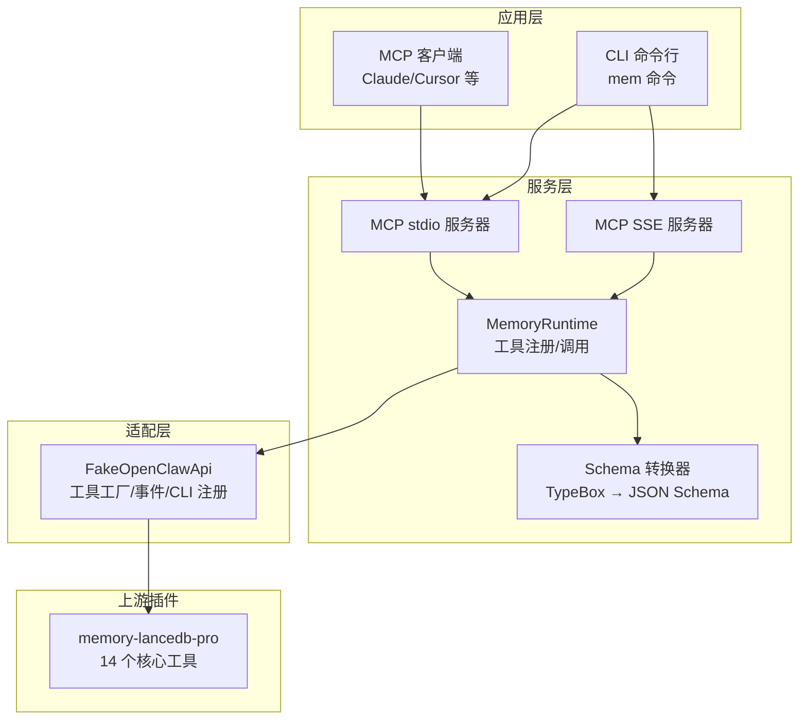
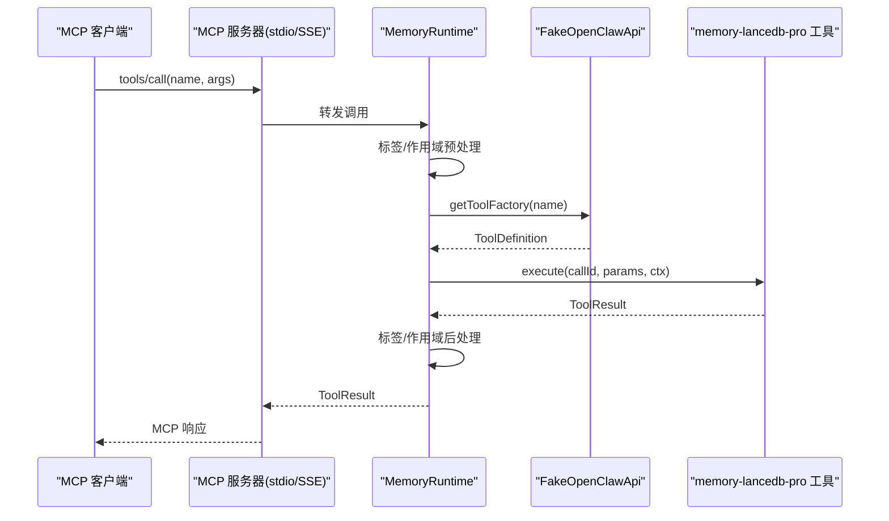
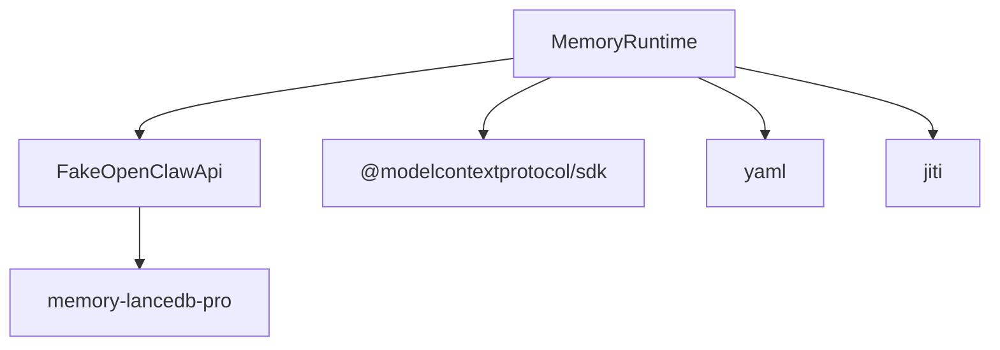

# 高级治理工具

<cite>
**本文引用的文件**
- [README.md](file://README.md)
- [docs/USAGE_GUIDE.md](file://docs/USAGE_GUIDE.md)
- [src/index.ts](file://src/index.ts)
- [src/cli.ts](file://src/cli.ts)
- [src/fake-api.ts](file://src/fake-api.ts)
- [src/mcp-server.ts](file://src/mcp-server.ts)
- [src/mcp-server-sse.ts](file://src/mcp-server-sse.ts)
- [src/schema.ts](file://src/schema.ts)
- [package.json](file://package.json)
</cite>

## 目录
1. [简介](#简介)
2. [项目结构](#项目结构)
3. [核心组件](#核心组件)
4. [架构总览](#架构总览)
5. [详细组件分析](#详细组件分析)
6. [依赖分析](#依赖分析)
7. [性能考量](#性能考量)
8. [故障排除指南](#故障排除指南)
9. [结论](#结论)
10. [附录](#附录)

## 简介
本文件面向“高级治理工具”的使用者与维护者，系统性阐述 memory_debug、memory_promote、memory_archive、memory_compact、memory_explain_rank 五类治理工具的功能定位、参数定义、输入输出格式、JSON Schema 结构、典型使用场景与限制条件，并提供调试技巧、性能优化建议与最佳实践。这些工具属于“治理与管理”类别，用于对长期记忆进行归档、提升、去重与调试，从而提升系统的稳定性、可维护性与检索质量。

## 项目结构
该项目围绕 memory-lancedb-pro 的 MCP 包装实现，提供 stdio 与 SSE 两种传输模式的服务端，CLI 命令行工具，以及一套 FakeOpenClawApi 适配层，将上游插件的 14 个核心工具与生命周期钩子暴露给 MCP 客户端。高级治理工具作为“治理与管理”类工具的一部分，与常规记忆工具（如 memory_recall、memory_store 等）共享相同的调用与序列化框架。

图表来源
- [src/mcp-server.ts:43-140](file://src/mcp-server.ts#L43-L140)
- [src/mcp-server-sse.ts:57-209](file://src/mcp-server-sse.ts#L57-L209)
- [src/index.ts:207-498](file://src/index.ts#L207-L498)
- [src/fake-api.ts:57-317](file://src/fake-api.ts#L57-L317)
- [src/schema.ts:45-150](file://src/schema.ts#L45-L150)

章节来源
- [README.md: 11-20:11-20](file://README.md#L11-L20)
- [src/mcp-server.ts: 43-140:43-140](file://src/mcp-server.ts#L43-L140)
- [src/mcp-server-sse.ts: 57-209:57-209](file://src/mcp-server-sse.ts#L57-L209)
- [src/index.ts: 207-498:207-498](file://src/index.ts#L207-L498)
- [src/fake-api.ts: 57-317:57-317](file://src/fake-api.ts#L57-L317)
- [src/schema.ts: 45-150:45-150](file://src/schema.ts#L45-L150)

## 核心组件
- MemoryRuntime：负责加载配置、创建 FakeOpenClawApi、注册插件、暴露工具调用与生命周期事件、以及对标签与作用域的预处理/后处理。
- FakeOpenClawApi：适配层，捕获上游插件注册的工具工厂、事件与 CLI 实例，统一对外提供 callTool/getAllToolDefinitions 等能力。
- MCP Server（stdio/SSE）：将 MemoryRuntime 暴露为 MCP 工具，处理 tools/list 与 tools/call 请求，并将结果映射为 MCP 协议响应。
- Schema 转换器：将 TypeBox 参数 Schema 转换为 MCP 所需的 JSON Schema，保证工具输入定义的兼容性。

章节来源
- [src/index.ts: 207-498:207-498](file://src/index.ts#L207-L498)
- [src/fake-api.ts: 57-317:57-317](file://src/fake-api.ts#L57-L317)
- [src/mcp-server.ts: 43-140:43-140](file://src/mcp-server.ts#L43-L140)
- [src/mcp-server-sse.ts: 57-209:57-209](file://src/mcp-server-sse.ts#L57-L209)
- [src/schema.ts: 45-150:45-150](file://src/schema.ts#L45-L150)

## 架构总览
高级治理工具与常规记忆工具共享同一调用链：MCP 客户端发起 tools/call 请求，MCP 服务器将请求转发至 MemoryRuntime，后者根据工具名与参数执行预处理（如标签注入、作用域强制），随后调用 FakeOpenClawApi 获取工具工厂并执行具体逻辑，最终将结果映射为 MCP 响应。

图表来源
- [src/mcp-server.ts: 86-124:86-124](file://src/mcp-server.ts#L86-L124)
- [src/index.ts: 313-453:313-453](file://src/index.ts#L313-L453)
- [src/fake-api.ts: 217-235:217-235](file://src/fake-api.ts#L217-L235)

章节来源
- [src/mcp-server.ts: 86-124:86-124](file://src/mcp-server.ts#L86-L124)
- [src/index.ts: 313-453:313-453](file://src/index.ts#L313-L453)
- [src/fake-api.ts: 217-235:217-235](file://src/fake-api.ts#L217-L235)

## 详细组件分析

### memory_debug — 检索链路追踪与排名解释
- 功能定位
  - 提供检索链路的追踪与排名解释能力，帮助诊断召回质量、权重分配与过滤条件的影响。
- 参数定义
  - 输入参数与常规检索工具一致（query、limit、scope、category、tags 等），具体字段以 tools/list 返回的 JSON Schema 为准。
- 输入输出格式
  - 输入：JSON 对象，包含检索查询与过滤条件。
  - 输出：包含检索结果与解释信息的结构化文本，便于人工审阅与自动化分析。
- JSON Schema 结构
  - 由上游插件的 TypeBox Schema 转换而来，顶层为对象类型，包含必需字段与可选字段。tools/list 返回的 inputSchema 可直接用于客户端/工具描述。
- 使用场景
  - 调试召回质量不佳的问题；评估不同过滤条件对结果的影响；审计检索权重与融合策略。
- 限制条件
  - 需要启用“治理与管理”工具集合（enableManagementTools），并在配置中开启相应能力。
- 调用示例
  - 通过 MCP 客户端调用 tools/call，传入 query 与可选过滤参数；或通过 CLI 的 doctor/health 检查工具可用性。
- 调试技巧
  - 逐步缩小过滤范围（减少 tags/category），观察排名变化；对比不同 limit 值下的结果分布。
- 性能优化建议
  - 控制 limit，避免一次性返回过多结果；合理使用 tags 与 category，减少不必要的计算开销。

章节来源
- [README.md: 604-615:604-615](file://README.md#L604-L615)
- [docs/USAGE_GUIDE.md: 167-266:167-266](file://docs/USAGE_GUIDE.md#L167-L266)
- [src/schema.ts: 136-150:136-150](file://src/schema.ts#L136-L150)
- [src/mcp-server.ts: 61-77:61-77](file://src/mcp-server.ts#L61-L77)

### memory_promote — 提升为治理记忆（高优先级，免衰减）
- 功能定位
  - 将普通记忆提升为“治理记忆”，使其具有更高的优先级，避免被 Weibull 衰减淘汰，常用于关键规则、政策、流程等。
- 参数定义
  - 输入参数通常包含 memoryId 或 query（用于定位目标记忆），以及可选的作用域与上下文信息。
- 输入输出格式
  - 输入：JSON 对象，包含定位目标记忆的参数。
  - 输出：包含操作结果与影响范围的文本或结构化信息。
- JSON Schema 结构
  - 由上游插件的 TypeBox Schema 转换而来，包含必需字段与可选字段。
- 使用场景
  - 将关键流程、合规要求、组织规则固化为治理记忆；在系统升级或大规模去重后保留核心知识。
- 限制条件
  - 需要具备相应的权限与 ACL；在锁定 scope 模式下，仅能对当前服务端 scope 内的记忆执行操作。
- 调用示例
  - 通过 MCP 客户端调用 tools/call，传入 memoryId 或 query；或通过 CLI 的 doctor/health 检查工具可用性。
- 调试技巧
  - 先使用 memory_recall 或 memory_list 确认目标记忆存在且状态正常；再执行 promote 操作并观察后续检索行为的变化。
- 性能优化建议
  - 仅对必要的少量关键记忆执行 promote，避免过度提升导致检索权重失衡。

章节来源
- [README.md: 604-615:604-615](file://README.md#L604-L615)
- [docs/USAGE_GUIDE.md: 167-266:167-266](file://docs/USAGE_GUIDE.md#L167-L266)
- [src/schema.ts: 136-150:136-150](file://src/schema.ts#L136-L150)
- [src/mcp-server.ts: 61-77:61-77](file://src/mcp-server.ts#L61-L77)

### memory_archive — 归档（保留但排除召回）
- 功能定位
  - 将记忆标记为“归档”，保留其内容但将其从召回池中排除，适合历史资料、旧版规则等不再参与检索但需要保留的文档。
- 参数定义
  - 输入参数通常包含 memoryId 或 query，以及可选的作用域与上下文信息。
- 输入输出格式
  - 输入：JSON 对象，包含定位目标记忆的参数。
  - 输出：包含归档操作结果与影响范围的文本或结构化信息。
- JSON Schema 结构
  - 由上游插件的 TypeBox Schema 转换而来，包含必需字段与可选字段。
- 使用场景
  - 归档旧版流程、历史决策、过期规则；在不影响检索质量的前提下减少噪音。
- 限制条件
  - 需要具备相应的权限与 ACL；在锁定 scope 模式下，仅能对当前服务端 scope 内的记忆执行操作。
- 调用示例
  - 通过 MCP 客户端调用 tools/call，传入 memoryId 或 query；或通过 CLI 的 doctor/health 检查工具可用性。
- 调试技巧
  - 使用 memory_recall 验证归档后是否仍可检索；使用 memory_list 与 tags/category 过滤确认归档状态。
- 性能优化建议
  - 定期审查归档记忆，清理长期无人访问的历史资料，避免存储膨胀。

章节来源
- [README.md: 604-615:604-615](file://README.md#L604-L615)
- [docs/USAGE_GUIDE.md: 167-266:167-266](file://docs/USAGE_GUIDE.md#L167-L266)
- [src/schema.ts: 136-150:136-150](file://src/schema.ts#L136-L150)
- [src/mcp-server.ts: 61-77:61-77](file://src/mcp-server.ts#L61-L77)

### memory_compact — 去重并压缩记忆
- 功能定位
  - 对重复或高度相似的记忆进行去重与压缩，减少存储占用并提升检索效率；通常结合智能提取与权重调整。
- 参数定义
  - 输入参数通常包含可选的过滤条件（如 scope、category、tags）与控制参数（如阈值、算法开关）。
- 输入输出格式
  - 输入：JSON 对象，包含过滤条件与控制参数。
  - 输出：包含去重统计、压缩结果与影响范围的文本或结构化信息。
- JSON Schema 结构
  - 由上游插件的 TypeBox Schema 转换而来，包含必需字段与可选字段。
- 使用场景
  - 大规模导入后清理冗余；定期维护以保持检索质量与性能稳定。
- 限制条件
  - 需要具备相应的权限与 ACL；在锁定 scope 模式下，仅能对当前服务端 scope 内的记忆执行操作。
- 调用示例
  - 通过 MCP 客户端调用 tools/call，传入过滤条件与控制参数；或通过 CLI 的 doctor/health 检查工具可用性。
- 调试技巧
  - 先使用 memory_stats 与 memory_list 观察重复情况；执行 compact 后再次检查统计与检索质量。
- 性能优化建议
  - 在业务低峰时段执行；分批处理大规模数据；结合 tags 与 category 精确控制处理范围。

章节来源
- [README.md: 604-615:604-615](file://README.md#L604-L615)
- [docs/USAGE_GUIDE.md: 167-266:167-266](file://docs/USAGE_GUIDE.md#L167-L266)
- [src/schema.ts: 136-150:136-150](file://src/schema.ts#L136-L150)
- [src/mcp-server.ts: 61-77:61-77](file://src/mcp-server.ts#L61-L77)

### memory_explain_rank — 解释记忆排名的原因
- 功能定位
  - 解释检索结果中各记忆的排名依据，帮助理解向量相似度、BM25 匹配、权重融合与时间衰减等因素对排序的影响。
- 参数定义
  - 输入参数通常包含 query、memoryId 与可选的过滤条件（如 scope、category、tags）。
- 输入输出格式
  - 输入：JSON 对象，包含查询与目标记忆的定位参数。
  - 输出：包含排名解释、权重分解与影响因素的文本或结构化信息。
- JSON Schema 结构
  - 由上游插件的 TypeBox Schema 转换而来，包含必需字段与可选字段。
- 使用场景
  - 调优检索策略；审计排名异常；为用户提供透明的检索反馈。
- 限制条件
  - 需要启用“治理与管理”工具集合（enableManagementTools），并在配置中开启相应能力。
- 调用示例
  - 通过 MCP 客户端调用 tools/call，传入 query 与 memoryId；或通过 CLI 的 doctor/health 检查工具可用性。
- 调试技巧
  - 对比不同 query 的排名解释，识别关键匹配词与权重变化；结合 tags 与 category 观察过滤对排名的影响。
- 性能优化建议
  - 控制返回的解释粒度，避免过细解释带来的性能开销；在批量分析时分批执行。

章节来源
- [README.md: 604-615:604-615](file://README.md#L604-L615)
- [docs/USAGE_GUIDE.md: 167-266:167-266](file://docs/USAGE_GUIDE.md#L167-L266)
- [src/schema.ts: 136-150:136-150](file://src/schema.ts#L136-L150)
- [src/mcp-server.ts: 61-77:61-77](file://src/mcp-server.ts#L61-L77)

## 依赖分析
- 上游依赖
  - memory-lancedb-pro：提供 14 个核心工具与生命周期事件，高级治理工具作为其一部分被注册与暴露。
  - @modelcontextprotocol/sdk：提供 MCP 协议的服务器端实现（stdio 与 SSE）。
  - yaml/jiti：用于配置解析与上游插件的动态加载。
- 内部耦合
  - MemoryRuntime 与 FakeOpenClawApi：前者负责工具注册与调用，后者负责捕获工具工厂与事件。
  - Schema 转换器：将 TypeBox Schema 转换为 MCP 兼容的 JSON Schema。
- 外部集成
  - CLI 与 MCP 客户端：通过 tools/list 与 tools/call 交互，遵循 MCP 协议规范。

图表来源
- [src/index.ts: 159-184:159-184](file://src/index.ts#L159-L184)
- [src/mcp-server.ts: 8-22:8-22](file://src/mcp-server.ts#L8-L22)
- [package.json: 26-31:26-31](file://package.json#L26-L31)

章节来源
- [src/index.ts: 159-184:159-184](file://src/index.ts#L159-L184)
- [src/mcp-server.ts: 8-22:8-22](file://src/mcp-server.ts#L8-L22)
- [package.json: 26-31:26-31](file://package.json#L26-L31)

## 性能考量
- 检索与排名解释
  - 控制 limit，避免一次性返回过多结果；合理使用 tags 与 category，减少不必要的计算开销。
  - 在执行 ranking 解释时，建议分批处理，避免对大量记忆进行逐条解释。
- 去重与压缩
  - 在业务低峰时段执行；分批处理大规模数据；结合过滤条件精确控制处理范围。
- 归档与治理
  - 定期审查归档记忆，清理长期无人访问的历史资料；仅对必要的少量关键记忆执行 promote。
- 传输与并发
  - stdio 模式适合本地客户端；SSE 模式适合远程或多客户端场景，注意网络延迟与并发连接数。
- 存储与索引
  - 合理设置检索权重与融合策略，避免过度偏向某一模态；定期维护索引与统计信息。

## 故障排除指南
- 工具不可用
  - 确认已启用“治理与管理”工具集合（enableManagementTools）；通过 doctor 命令检查工具注册状态。
- 权限与作用域
  - 在锁定 scope 模式下，仅能对当前服务端 scope 内的记忆执行操作；跨 scope 模式下需明确指定 scope。
- 配置问题
  - 使用 doctor 命令验证配置文件与 API Key；检查 embedding 与 LLM 配置是否正确。
- 检索质量不佳
  - 使用 memory_debug 与 memory_explain_rank 进行链路追踪与排名解释；逐步缩小过滤范围观察变化。
- 性能问题
  - 控制 limit 与批量大小；在低峰时段执行去重与压缩；优化检索权重与融合策略。

章节来源
- [src/cli.ts: 449-517:449-517](file://src/cli.ts#L449-L517)
- [src/mcp-server.ts: 132-138:132-138](file://src/mcp-server.ts#L132-L138)
- [src/mcp-server-sse.ts: 176-183:176-183](file://src/mcp-server-sse.ts#L176-L183)

## 结论
高级治理工具为长期记忆系统提供了强大的维护与优化能力：通过 memory_debug 与 memory_explain_rank 进行链路追踪与排名解释，通过 memory_promote 与 memory_archive 实现治理与归档，通过 memory_compact 进行去重与压缩。结合合理的参数设计、严格的权限控制与持续的性能优化，这些工具能够显著提升系统的稳定性、可维护性与检索质量。

## 附录
- 工具清单与说明
  - memory_debug：检索链路追踪与排名解释
  - memory_promote：提升为治理记忆（高优先级，免衰减）
  - memory_archive：归档（保留但排除召回）
  - memory_compact：去重并压缩记忆
  - memory_explain_rank：解释记忆排名的原因
- 参考文档
  - 使用手册：docs/USAGE_GUIDE.md
  - 工具参考：README.md 中的“MCP 工具参考”与“治理与管理”部分