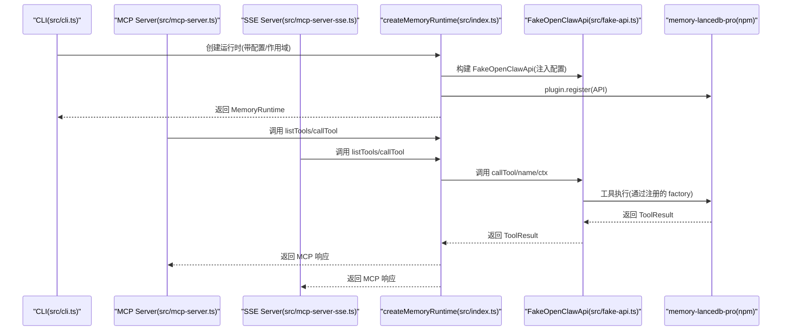
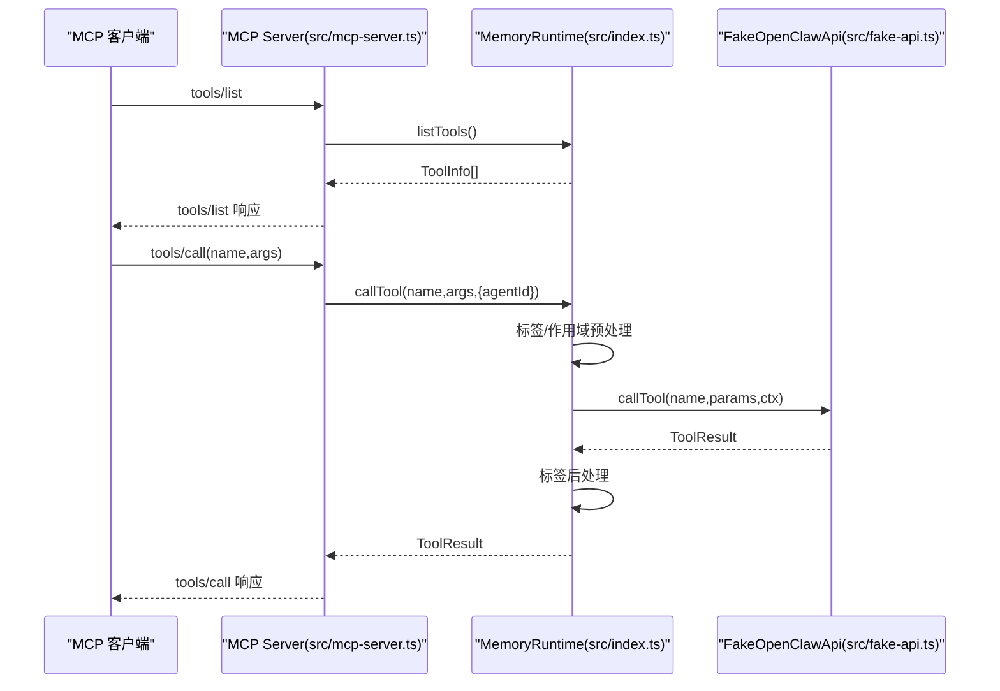
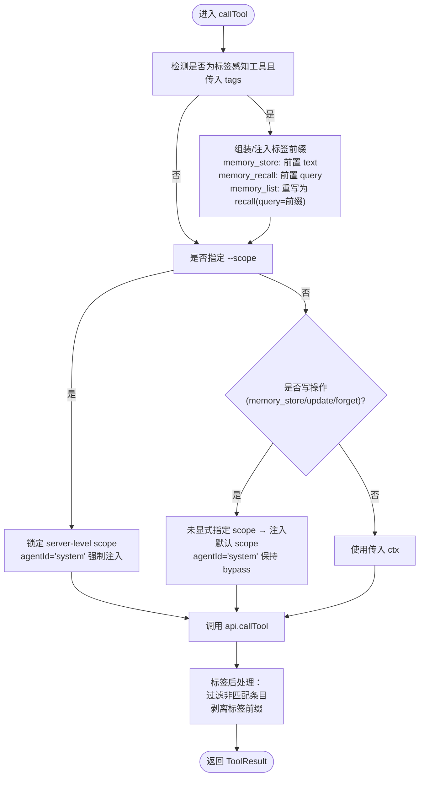
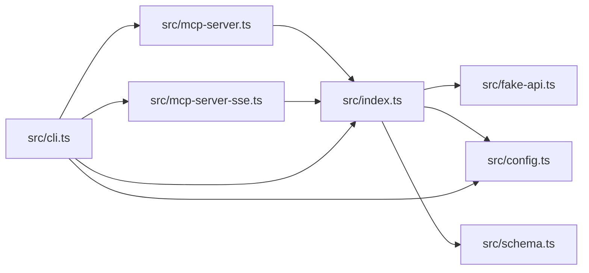

# 内部接口

<cite>
**本文引用的文件**
- [src/index.ts](file://src/index.ts)
- [src/fake-api.ts](file://src/fake-api.ts)
- [src/schema.ts](file://src/schema.ts)
- [src/lifecycle.ts](file://src/lifecycle.ts)
- [src/mcp-server.ts](file://src/mcp-server.ts)
- [src/mcp-server-sse.ts](file://src/mcp-server-sse.ts)
- [src/cli.ts](file://src/cli.ts)
- [src/config.ts](file://src/config.ts)
- [package.json](file://package.json)
- [bin/mem.mjs](file://bin/mem.mjs)
- [README.md](file://README.md)
- [docs/USAGE_GUIDE.md](file://docs/USAGE_GUIDE.md)
</cite>

## 目录
1. [简介](#简介)
2. [项目结构](#项目结构)
3. [核心组件](#核心组件)
4. [架构总览](#架构总览)
5. [详细组件分析](#详细组件分析)
6. [依赖分析](#依赖分析)
7. [性能考量](#性能考量)
8. [故障排除指南](#故障排除指南)
9. [结论](#结论)
10. [附录](#附录)

## 简介
本文件面向内部开发者，系统性梳理 memory-lancedb-mcp 的内部接口与运行时设计，重点覆盖：
- MemoryRuntime 接口的公共方法与使用场景
- ToolInfo、ToolCallContext、ToolResult 等核心数据类型
- FakeOpenClawApi 类的接口规范与实现要点
- createMemoryRuntime 工厂函数的参数选项、配置注入与运行时构建流程
- 接口扩展指南、自定义适配器开发与内部模块交互模式

## 项目结构
该项目围绕“MCP Server 包装器 + FakeOpenClawApi 适配 + 插件桥接”的三层架构组织：
- CLI 层：提供 mem 命令入口与子命令
- MCP Server 层：提供 stdio 与 SSE 两种传输模式
- 运行时层：FakeOpenClawApi 适配 + memory-lancedb-pro 插件注册
- 配置与模式转换：YAML 配置解析与 TypeBox Schema 转 JSON Schema

```mermaid
graph TB
subgraph "CLI"
CLI["src/cli.ts"]
end
subgraph "MCP Server"
STDIO["src/mcp-server.ts"]
SSE["src/mcp-server-sse.ts"]
end
subgraph "Runtime"
IDX["src/index.ts<br/>createMemoryRuntime"]
FAKE["src/fake-api.ts<br/>FakeOpenClawApi"]
SCHEMA["src/schema.ts<br/>TypeBox→JSON Schema"]
end
subgraph "Plugin"
PRO["memory-lancedb-pro<br/>(npm)"]
end
subgraph "Config"
CFG["src/config.ts"]
end
CLI --> STDIO
CLI --> SSE
STDIO --> IDX
SSE --> IDX
IDX --> FAKE
FAKE --> PRO
IDX --> SCHEMA
IDX --> CFG
```

图表来源
- [src/cli.ts:1-617](file://src/cli.ts#L1-L617)
- [src/mcp-server.ts:1-306](file://src/mcp-server.ts#L1-L306)
- [src/mcp-server-sse.ts:1-405](file://src/mcp-server-sse.ts#L1-L405)
- [src/index.ts:190-498](file://src/index.ts#L190-L498)
- [src/fake-api.ts:57-317](file://src/fake-api.ts#L57-L317)
- [src/schema.ts:39-151](file://src/schema.ts#L39-L151)
- [src/config.ts:167-223](file://src/config.ts#L167-L223)

章节来源
- [src/index.ts:190-498](file://src/index.ts#L190-L498)
- [src/fake-api.ts:57-317](file://src/fake-api.ts#L57-L317)
- [src/mcp-server.ts:43-140](file://src/mcp-server.ts#L43-L140)
- [src/mcp-server-sse.ts:57-209](file://src/mcp-server-sse.ts#L57-L209)
- [src/cli.ts:105-617](file://src/cli.ts#L105-L617)
- [src/config.ts:167-223](file://src/config.ts#L167-L223)
- [src/schema.ts:39-151](file://src/schema.ts#L39-L151)

## 核心组件
- MemoryRuntime 接口：封装工具调用、工具清单、事件与钩子、CLI 实例获取等能力
- FakeOpenClawApi 类：最小化实现 OpenClaw 插件 SDK 接口，承载工具注册、事件/钩子系统、CLI 注册与路径解析
- createMemoryRuntime 工厂：加载配置、构建 FakeOpenClawApi、注册插件、初始化运行时
- TypeBox→JSON Schema 转换器：将插件侧 TypeBox schema 转为 MCP 兼容 JSON Schema
- 生命周期桥：将 OpenClaw 生命周期事件映射为 MCP 工具调用

章节来源
- [src/index.ts:95-115](file://src/index.ts#L95-L115)
- [src/fake-api.ts:57-317](file://src/fake-api.ts#L57-L317)
- [src/index.ts:207-498](file://src/index.ts#L207-L498)
- [src/schema.ts:39-151](file://src/schema.ts#L39-L151)
- [src/lifecycle.ts:52-177](file://src/lifecycle.ts#L52-L177)

## 架构总览
内存运行时的内部交互遵循“工厂构建 → FakeOpenClawApi 注册 → 插件工具暴露 → MCP Server 暴露工具”的主干流程。CLI 与 MCP Server 均通过 createMemoryRuntime 获取统一的 MemoryRuntime 实例，再经由 FakeOpenClawApi 将插件工具暴露给 MCP 协议。



图表来源
- [src/cli.ts:124-169](file://src/cli.ts#L124-L169)
- [src/mcp-server.ts:43-140](file://src/mcp-server.ts#L43-L140)
- [src/mcp-server-sse.ts:57-209](file://src/mcp-server-sse.ts#L57-L209)
- [src/index.ts:207-498](file://src/index.ts#L207-L498)
- [src/fake-api.ts:217-235](file://src/fake-api.ts#L217-L235)

## 详细组件分析

### MemoryRuntime 接口与方法
- 接口定义与职责
  - api: FakeOpenClawApi 实例，便于高级集成
  - config: MemConfig 配置对象
  - callTool(name, params, ctx?): Promise<ToolResult>
    - 用途：调用任意工具（含合成工具 list_scopes）
    - 预处理：标签注入、作用域注入、跨 scope 拒绝
    - 后处理：标签过滤与前缀剥离
  - listTools(): ToolInfo[]
    - 用途：返回 MCP tools/list 所需的工具清单
    - 合成：注入 list_scopes 工具
  - emitEvent(event, payload?, ctx?): Promise<unknown[]>
    - 用途：触发事件，收集处理器返回值
  - triggerHook(name, payload?): Promise<void>
    - 用途：触发钩子（异步）
  - getCliInstance(): unknown
    - 用途：返回 CLI 注册实例，供 CLI 复用

- 方法签名与返回值
  - callTool: 输入 name、params、ctx；返回 ToolResult
  - listTools: 返回 ToolInfo[]
  - emitEvent: 返回未知数组
  - triggerHook: 无返回
  - getCliInstance: 返回任意对象

- 使用场景
  - MCP Server：tools/list 与 tools/call 的统一入口
  - CLI：直接调用工具与生命周期桥
  - 扩展：自定义工具可通过 FakeOpenClawApi 注册后被 MemoryRuntime 暴露

章节来源
- [src/index.ts:95-115](file://src/index.ts#L95-L115)
- [src/index.ts:244-495](file://src/index.ts#L244-L495)
- [src/mcp-server.ts:61-124](file://src/mcp-server.ts#L61-L124)
- [src/mcp-server-sse.ts:246-287](file://src/mcp-server-sse.ts#L246-L287)

### 核心数据类型
- ToolInfo
  - 字段：name、description、inputSchema(JsonSchema)
  - 用途：MCP tools/list 的响应项
- ToolCallContext
  - 字段：agentId、sessionKey
  - 用途：工具调用上下文（默认 agentId="main"，默认 sessionKey 基于时间戳）
- ToolResult
  - 字段：content(Array<{ type, text }>)、details(可选)
  - 用途：工具执行结果，MCP Server 映射为 content 数组

章节来源
- [src/index.ts:117-121](file://src/index.ts#L117-L121)
- [src/fake-api.ts:33-36](file://src/fake-api.ts#L33-L36)
- [src/fake-api.ts:28-31](file://src/fake-api.ts#L28-L31)
- [src/mcp-server.ts:104-116](file://src/mcp-server.ts#L104-L116)
- [src/mcp-server-sse.ts:274-282](file://src/mcp-server-sse.ts#L274-L282)

### FakeOpenClawApi 类规范
- 主要职责
  - 工具注册：registerTool(factory)
  - 事件系统：on(event, handler, opts?)
  - 钩子系统：registerHook(name, handler, opts?)
  - CLI 注册：registerCli(cmd)
  - 工具调用：callTool(name, params, ctx?)
  - 事件触发：emitEvent(event, payload, ctx?)
  - 钩子触发：triggerHook(name, payload)
  - 路径解析：resolvePath(path)
  - 配置与运行时属性：config、runtime（占位）

- 关键方法与行为
  - registerTool：预览工厂以提取工具名并缓存
  - getToolNames/getToolFactory/getAllToolFactories：查询工具
  - getToolDefinition/getAllToolDefinitions：导出工具定义（含参数 schema）
  - callTool：根据上下文构造 ToolCallContext，调用工厂产出 ToolDefinition.execute
  - emitEvent：按优先级排序事件处理器并收集返回值
  - triggerHook：顺序触发钩子处理器
  - registerCli/runtime/config：适配外部集成

- 实现细节
  - 日志：debug/info/warn/error 四级日志，quiet 控制 debug
  - 路径解析：支持 ~、相对路径、绝对路径与 Windows 绝对路径
  - 运行时属性：runtime 返回 undefined，config 返回简化的 agents 列表

章节来源
- [src/fake-api.ts:57-317](file://src/fake-api.ts#L57-L317)
- [src/fake-api.ts:217-235](file://src/fake-api.ts#L217-L235)
- [src/fake-api.ts:269-287](file://src/fake-api.ts#L269-L287)
- [src/fake-api.ts:292-301](file://src/fake-api.ts#L292-L301)

### createMemoryRuntime 工厂函数
- 参数选项 RuntimeOptions
  - configPath?: string（覆盖 MEM_CONFIG_PATH）
  - config?: MemConfig（跳过文件加载）
  - quiet?: boolean（抑制调试日志）
  - scope?: string（项目隔离，作用域注入）

- 配置注入机制
  - 加载配置：loadConfig(configPath)
  - 作用域覆盖：合并 scopes.definitions 与 agentAccess，生成 agentId 列表
  - 转换配置：toPluginConfig(config) 直通传递
  - 构建 FakeOpenClawApi：注入 pluginConfig、quiet、homeDir

- 运行时构建流程
  1) 加载配置
  2) 应用 scope 覆盖
  3) 构建 FakeOpenClawApi
  4) 加载插件并注册：plugin.register(api)
  5) 发出 gateway_start 事件
  6) 构建 MemoryRuntime 并返回

- callTool 预处理与后处理
  - 标签预处理：对 memory_store/memory_recall/memory_list 注入/重写
  - 作用域注入：跨 scope 模式与锁定 scope 模式的 agentId 与 scope 注入
  - 标签后处理：过滤与前缀剥离
  - listTools 合成：注入 list_scopes 工具定义

章节来源
- [src/index.ts:123-134](file://src/index.ts#L123-L134)
- [src/index.ts:207-242](file://src/index.ts#L207-L242)
- [src/index.ts:248-453](file://src/index.ts#L248-L453)
- [src/index.ts:455-482](file://src/index.ts#L455-L482)
- [src/index.ts:484-494](file://src/index.ts#L484-L494)
- [src/config.ts:167-223](file://src/config.ts#L167-L223)

### 类关系图（代码级）
```mermaid
classDiagram
class MemoryRuntime {
+api : FakeOpenClawApi
+config : MemConfig
+callTool(name, params, ctx) ToolResult
+listTools() ToolInfo[]
+emitEvent(event, payload, ctx) unknown[]
+triggerHook(name, payload) void
+getCliInstance() unknown
}
class FakeOpenClawApi {
+pluginConfig : Record
+logger : { debug, info, warn, error }
+registerTool(factory) void
+getToolNames() string[]
+getToolFactory(name) ToolFactory
+getAllToolFactories() Map
+callTool(name, params, ctx) ToolResult
+getToolDefinition(name) ToolDefinition
+getAllToolDefinitions() ToolDefinition[]
+emitEvent(event, payload, ctx) unknown[]
+triggerHook(name, payload) void
+registerCli(cmd) void
+getRegisteredEvents() string[]
+getRegisteredHooks() string[]
+resolvePath(p) string
}
class ToolInfo {
+string name
+string description
+JsonSchema inputSchema
}
class ToolCallContext {
+string? agentId
+string? sessionKey
}
class ToolResult {
+Array content
+Record? details
}
MemoryRuntime --> FakeOpenClawApi : "持有"
MemoryRuntime --> ToolInfo : "返回"
MemoryRuntime --> ToolCallContext : "使用"
MemoryRuntime --> ToolResult : "返回"
FakeOpenClawApi --> ToolResult : "返回"
```

图表来源
- [src/index.ts:95-115](file://src/index.ts#L95-L115)
- [src/fake-api.ts:57-317](file://src/fake-api.ts#L57-L317)
- [src/schema.ts:16-33](file://src/schema.ts#L16-L33)

### API/服务组件调用序列（MCP Server）


图表来源
- [src/mcp-server.ts:61-124](file://src/mcp-server.ts#L61-L124)
- [src/index.ts:248-453](file://src/index.ts#L248-L453)
- [src/fake-api.ts:217-235](file://src/fake-api.ts#L217-L235)

### 复杂逻辑组件（标签处理与作用域注入）


图表来源
- [src/index.ts:313-335](file://src/index.ts#L313-L335)
- [src/index.ts:337-385](file://src/index.ts#L337-L385)
- [src/index.ts:389-450](file://src/index.ts#L389-L450)

## 依赖分析
- 外部依赖
  - @modelcontextprotocol/sdk：MCP 协议实现与传输（stdio/SSE）
  - commander：CLI 命令行解析
  - yaml：YAML 配置解析
  - jiti：TS 源码直载（无需本地构建）
  - memory-lancedb-pro：核心插件（npm）

- 内部模块耦合
  - src/index.ts 依赖 src/fake-api.ts、src/config.ts、src/schema.ts
  - src/mcp-server.ts 依赖 src/index.ts、src/schema.ts、src/lifecycle.ts
  - src/mcp-server-sse.ts 依赖 src/index.ts、src/lifecycle.ts
  - src/cli.ts 依赖 src/mcp-server.ts、src/mcp-server-sse.ts、src/index.ts、src/config.ts



图表来源
- [src/index.ts:9-11](file://src/index.ts#L9-L11)
- [src/mcp-server.ts:14-22](file://src/mcp-server.ts#L14-L22)
- [src/mcp-server-sse.ts:16-23](file://src/mcp-server-sse.ts#L16-L23)
- [src/cli.ts:18-27](file://src/cli.ts#L18-L27)

章节来源
- [package.json:26-31](file://package.json#L26-L31)
- [src/index.ts:9-11](file://src/index.ts#L9-L11)
- [src/mcp-server.ts:14-22](file://src/mcp-server.ts#L14-L22)
- [src/mcp-server-sse.ts:16-23](file://src/mcp-server-sse.ts#L16-L23)
- [src/cli.ts:18-27](file://src/cli.ts#L18-L27)

## 性能考量
- 工具调用链路
  - callTool 预处理与后处理均为纯内存操作，开销主要来自插件工具执行与检索
  - 标签注入/剥离与作用域注入为常数时间复杂度，对整体性能影响较小
- 事件与钩子
  - emitEvent 按优先级排序，处理器串行执行；建议避免阻塞型处理
  - triggerHook 为 fire-and-forget，适合后台任务
- 配置与路径解析
  - resolvePath 仅做路径规范化，成本低
- MCP Server
  - stdio 模式适合本地客户端；SSE 模式增加 HTTP/SSE 管道开销，适合远程/多客户端场景

## 故障排除指南
- 配置问题
  - 配置文件不存在或解析失败：检查 MEM_CONFIG_PATH、默认路径 ~/.config/memory-mcp/config.yaml
  - 缺少 embedding.apiKey：确保配置或环境变量设置
- 插件加载失败
  - 确认 memory-lancedb-pro 已安装；开发模式下回退至本地 dist
- Scope 拒绝
  - 锁定 scope 模式下，请求的 scope 必须与服务端一致；否则返回 scope mismatch
- 标签非法
  - 标签包含保留字符或非法字符时，立即抛错并拒绝写入
- SSE 远程暴露
  - 未加 --scope 的 SSE 模式会暴露所有 scope，存在安全风险；生产环境建议绑定内网地址并配合反向代理与鉴权

章节来源
- [src/config.ts:167-214](file://src/config.ts#L167-L214)
- [src/index.ts:159-184](file://src/index.ts#L159-L184)
- [src/index.ts:357-366](file://src/index.ts#L357-L366)
- [src/index.ts:43-52](file://src/index.ts#L43-L52)
- [src/mcp-server-sse.ts:176-184](file://src/mcp-server-sse.ts#L176-L184)

## 结论
本项目通过 FakeOpenClawApi 将 memory-lancedb-pro 的工具与事件系统桥接到 MCP 协议，提供统一的 MemoryRuntime 接口与灵活的运行时构建流程。通过标签系统与作用域隔离，实现了强大的检索与多项目隔离能力。CLI 与 MCP Server 通过 createMemoryRuntime 获取一致的运行时实例，保证了行为的一致性与可扩展性。

## 附录

### 接口扩展指南
- 注册自定义工具
  - 在插件侧实现 ToolDefinition 并通过 api.registerTool(factory) 注册
  - MemoryRuntime 会自动将其纳入 listTools 与 callTool
- 注册事件与钩子
  - 使用 api.on(event, handler, opts?) 与 api.registerHook(name, handler, opts?)
  - 通过 emitEvent/triggerHook 触发
- 自定义适配器开发
  - 若需替换 FakeOpenClawApi，需保证与插件期望的最小接口一致（工具注册、事件/钩子、CLI 注册、路径解析）
  - 保持与 createMemoryRuntime 的集成点兼容

章节来源
- [src/fake-api.ts:113-127](file://src/fake-api.ts#L113-L127)
- [src/fake-api.ts:133-151](file://src/fake-api.ts#L133-L151)
- [src/fake-api.ts:217-235](file://src/fake-api.ts#L217-L235)
- [src/fake-api.ts:269-301](file://src/fake-api.ts#L269-L301)

### 内部模块交互模式
- CLI 与 MCP Server
  - CLI 通过 startMcpServer/startSseServer 调用 createMemoryRuntime 获取 MemoryRuntime
  - MCP Server 通过 MemoryRuntime.listTools 与 callTool 提供 MCP 工具
- 生命周期桥
  - triggerAutoRecall/triggerAutoCapture/triggerSessionEnd/triggerMessageReceived
  - 通过 MemoryRuntime.api.emitEvent/triggerHook 触发插件生命周期

章节来源
- [src/cli.ts:124-169](file://src/cli.ts#L124-L169)
- [src/mcp-server.ts:43-140](file://src/mcp-server.ts#L43-L140)
- [src/mcp-server-sse.ts:57-209](file://src/mcp-server-sse.ts#L57-L209)
- [src/lifecycle.ts:52-177](file://src/lifecycle.ts#L52-L177)