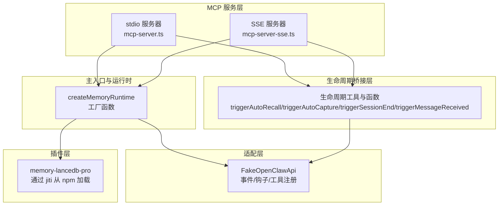
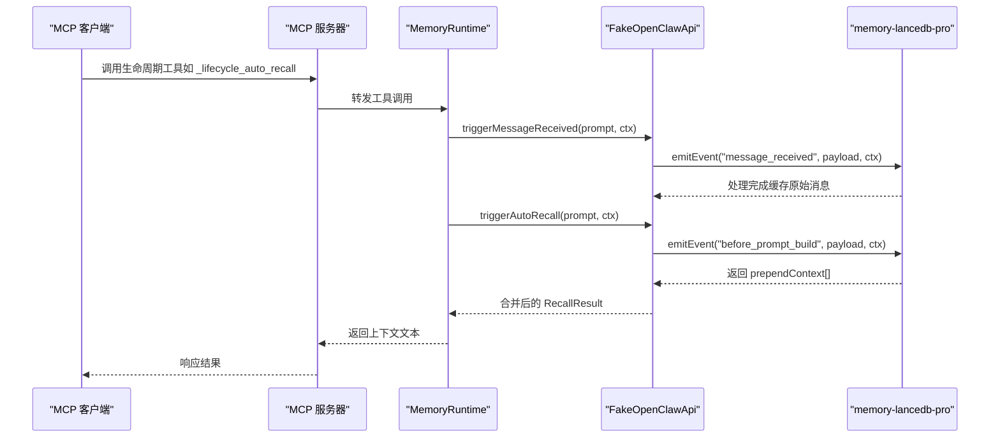
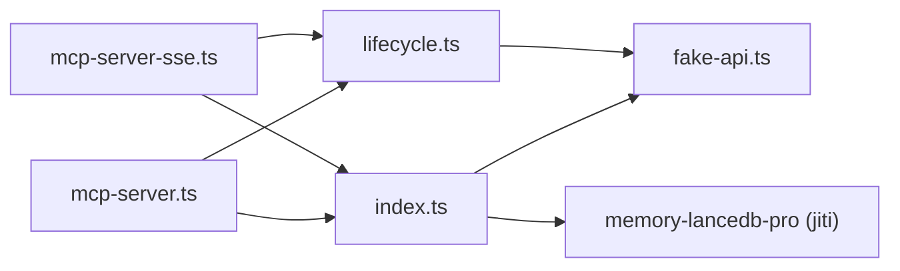

# 生命周期 API

<cite>
**本文引用的文件**
- [lifecycle.ts](file://src/lifecycle.ts)
- [index.ts](file://src/index.ts)
- [mcp-server.ts](file://src/mcp-server.ts)
- [mcp-server-sse.ts](file://src/mcp-server-sse.ts)
- [fake-api.ts](file://src/fake-api.ts)
- [integration.test.mjs](file://test/integration.test.mjs)
- [README.md](file://README.md)
- [package.json](file://package.json)
</cite>

## 目录
1. [简介](#简介)
2. [项目结构](#项目结构)
3. [核心组件](#核心组件)
4. [架构总览](#架构总览)
5. [详细组件分析](#详细组件分析)
6. [依赖分析](#依赖分析)
7. [性能考虑](#性能考虑)
8. [故障排查指南](#故障排查指南)
9. [结论](#结论)
10. [附录](#附录)

## 简介
本文件系统性地记录 memory-lancedb-mcp 的生命周期 API，涵盖以下事件类型及其触发时机、参数结构与处理机制：
- gateway_start：网关启动时触发，用于初始化自动整理等后台任务
- agent_end：代理执行结束时触发，用于自动捕获对话关键信息
- session_start：会话开始时触发（由插件注册，生命周期桥接层提供工具）
- session_end：会话结束时触发，用于清理挂起状态
- message_received：收到用户消息时触发，缓存原始消息供自动召回门控逻辑使用
- auto_recall：自动召回（生命周期桥接工具），在构建提示词前注入相关上下文
- auto_capture：自动捕获（生命周期桥接工具），在会话结束后提取关键信息
- message_sent：消息发送时触发（由插件注册，生命周期桥接层提供工具）

此外，文档还解释钩子系统的工作原理、triggerHook 的使用方法，以及生命周期与工具调用的关系、事件顺序的重要性，并提供典型应用场景、调试技巧与性能优化建议。

## 项目结构
该项目采用“适配层 + MCP 服务层 + 插件层”的分层架构：
- 适配层：FakeOpenClawApi 模拟 OpenClaw 运行时接口，负责工具注册、事件与钩子系统、CLI 注册等
- 生命周期桥接层：lifecycle.ts 将 OpenClaw 的生命周期事件映射为 MCP 可调用的工具与函数
- MCP 服务层：mcp-server.ts 与 mcp-server-sse.ts 暴露 MCP 工具，包含生命周期工具定义与处理
- 主入口与运行时：index.ts 提供 createMemoryRuntime 工厂函数，封装配置加载、插件注册、事件发射与钩子触发
- 测试与文档：integration.test.mjs 验证生命周期事件注册，README.md 提供使用说明与架构图

图表来源
- [index.ts:207-498](file://src/index.ts#L207-L498)
- [fake-api.ts:57-317](file://src/fake-api.ts#L57-L317)
- [lifecycle.ts:52-177](file://src/lifecycle.ts#L52-L177)
- [mcp-server.ts:43-140](file://src/mcp-server.ts#L43-L140)
- [mcp-server-sse.ts:57-209](file://src/mcp-server-sse.ts#L57-L209)

章节来源
- [README.md:22-45](file://README.md#L22-L45)
- [package.json:26-32](file://package.json#L26-L32)

## 核心组件
- FakeOpenClawApi：实现事件系统（on/emitEvent）、钩子系统（registerHook/triggerHook）、工具注册与调用、CLI 注册等
- 生命周期工具与函数：triggerAutoRecall、triggerAutoCapture、triggerSessionEnd、triggerMessageReceived
- MCP 服务器：stdio 与 SSE 两种传输模式，统一暴露生命周期工具与常规工具
- 主运行时：createMemoryRuntime 工厂函数，负责配置加载、插件注册、事件发射与钩子触发

章节来源
- [fake-api.ts:57-317](file://src/fake-api.ts#L57-L317)
- [lifecycle.ts:52-177](file://src/lifecycle.ts#L52-L177)
- [mcp-server.ts:43-140](file://src/mcp-server.ts#L43-L140)
- [mcp-server-sse.ts:57-209](file://src/mcp-server-sse.ts#L57-L209)
- [index.ts:207-498](file://src/index.ts#L207-L498)

## 架构总览
生命周期 API 的核心流程如下：
- 插件通过 FakeOpenClawApi.registerHook 与 api.on 注册生命周期钩子与事件处理器
- MCP 服务器在工具列表中暴露生命周期工具（如 _lifecycle_auto_recall、_lifecycle_auto_capture、_lifecycle_session_end）
- 客户端调用生命周期工具时，服务器内部先触发 message_received，再触发 before_prompt_build（自动召回）或 agent_end（自动捕获）
- FakeOpenClawApi.emitEvent 按优先级顺序调用事件处理器，收集返回值；triggerHook 用于同步触发命名钩子

图表来源
- [mcp-server.ts:235-305](file://src/mcp-server.ts#L235-L305)
- [lifecycle.ts:52-91](file://src/lifecycle.ts#L52-L91)
- [fake-api.ts:269-287](file://src/fake-api.ts#L269-L287)

## 详细组件分析

### 生命周期事件类型与触发时机
- gateway_start
  - 触发时机：createMemoryRuntime 初始化完成后立即触发
  - 作用：通知插件进行网关启动后的初始化（如自动整理等）
  - 参考：[index.ts:240-241](file://src/index.ts#L240-L241)
- agent_end
  - 触发时机：会话结束或代理执行完成后触发
  - 作用：自动捕获对话关键信息，提取为长期记忆
  - 参考：[lifecycle.ts:109-128](file://src/lifecycle.ts#L109-L128)
- session_start
  - 触发时机：会话开始时触发（由插件注册）
  - 作用：初始化会话上下文，准备接收消息
  - 参考：[integration.test.mjs:111](file://test/integration.test.mjs#L111)
- session_end
  - 触发时机：会话结束时触发
  - 作用：清理挂起状态，刷新未提交的数据
  - 参考：[lifecycle.ts:138-153](file://src/lifecycle.ts#L138-L153)
- message_received
  - 触发时机：收到用户消息时触发
  - 作用：缓存原始消息，供自动召回的门控逻辑使用
  - 参考：[lifecycle.ts:159-177](file://src/lifecycle.ts#L159-L177)
- message_sent
  - 触发时机：消息发送后触发（由插件注册）
  - 作用：可用于统计、审计或后续处理
  - 参考：[integration.test.mjs:111](file://test/integration.test.mjs#L111)

章节来源
- [index.ts:240-241](file://src/index.ts#L240-L241)
- [lifecycle.ts:109-153](file://src/lifecycle.ts#L109-L153)
- [integration.test.mjs:111](file://test/integration.test.mjs#L111)

### 参数结构与处理机制
- RecallResult
  - 字段：prependContext（可为空字符串）、ephemeral（是否临时）
  - 来源：triggerAutoRecall 收集多个处理器返回的 prependContext 并拼接
  - 参考：[lifecycle.ts:19-24](file://src/lifecycle.ts#L19-L24)，[lifecycle.ts:72-91](file://src/lifecycle.ts#L72-L91)
- Message
  - 字段：role（user/assistant/system）、content（字符串或富文本数组）
  - 来源：auto_capture 的输入参数
  - 参考：[lifecycle.ts:26-29](file://src/lifecycle.ts#L26-L29)
- LifecycleContext
  - 字段：agentId、sessionKey、sessionId、channelId
  - 用途：事件上下文，用于标识代理、会话与通道
  - 参考：[lifecycle.ts:31-36](file://src/lifecycle.ts#L31-L36)

章节来源
- [lifecycle.ts:19-36](file://src/lifecycle.ts#L19-L36)

### 事件监听器注册方式
- 事件注册（on）：通过 FakeOpenClawApi.on(event, handler, opts) 注册事件处理器
  - 优先级：opts.priority 数值越小优先级越高，emitEvent 会按优先级排序执行
  - 返回值收集：emitEvent 会收集处理器返回的非 undefined 值
  - 参考：[fake-api.ts:133-139](file://src/fake-api.ts#L133-L139)，[fake-api.ts:269-287](file://src/fake-api.ts#L269-L287)
- 钩子注册（registerHook）：通过 FakeOpenClawApi.registerHook(name, handler, opts) 注册命名钩子
  - 触发：通过 FakeOpenClawApi.triggerHook(name, payload) 同步触发
  - 参考：[fake-api.ts:145-151](file://src/fake-api.ts#L145-L151)，[fake-api.ts:292-301](file://src/fake-api.ts#L292-L301)

章节来源
- [fake-api.ts:133-151](file://src/fake-api.ts#L133-L151)
- [fake-api.ts:269-301](file://src/fake-api.ts#L269-L301)

### 事件传播规则与异步处理模式
- 事件传播：emitEvent 按优先级排序依次调用处理器，遇到异常会记录警告但不中断后续处理器
- 异步处理：事件处理器与钩子均为异步回调，生命周期工具内部使用 await 等待处理完成
- 自动捕获的 fire-and-forget：triggerAutoCapture 在触发 agent_end 后立即返回，不等待后台处理完成
- 参考：[fake-api.ts:278-286](file://src/fake-api.ts#L278-L286)，[lifecycle.ts:109-128](file://src/lifecycle.ts#L109-L128)

章节来源
- [fake-api.ts:269-301](file://src/fake-api.ts#L269-L301)
- [lifecycle.ts:109-128](file://src/lifecycle.ts#L109-L128)

### 钩子系统的工作原理与 triggerHook 使用
- 工作原理：registerHook 注册命名钩子，triggerHook 按注册顺序同步触发所有处理器
- 使用场景：可在代理启动、会话开始/结束等节点插入自定义逻辑
- 参考：[fake-api.ts:145-151](file://src/fake-api.ts#L145-L151)，[fake-api.ts:292-301](file://src/fake-api.ts#L292-L301)
- 测试验证：集成测试显示存在 agent:bootstrap 钩子
  - 参考：[integration.test.mjs:116](file://test/integration.test.mjs#L116)

章节来源
- [fake-api.ts:145-151](file://src/fake-api.ts#L145-L151)
- [fake-api.ts:292-301](file://src/fake-api.ts#L292-L301)
- [integration.test.mjs:116](file://test/integration.test.mjs#L116)

### 生命周期工具：auto_recall 与 auto_capture
- _lifecycle_auto_recall
  - 触发顺序：先触发 message_received，再触发 before_prompt_build
  - 返回：prependContext 文本或提示“未找到相关记忆”
  - 参考：[mcp-server.ts:240-270](file://src/mcp-server.ts#L240-L270)，[mcp-server-sse.ts:382-390](file://src/mcp-server-sse.ts#L382-L390)
- _lifecycle_auto_capture
  - 触发：触发 agent_end，返回“后台触发”提示
  - 参考：[mcp-server.ts:271-289](file://src/mcp-server.ts#L271-L289)，[mcp-server-sse.ts:391-396](file://src/mcp-server-sse.ts#L391-L396)
- _lifecycle_session_end
  - 触发：触发 session_end，返回“会话结束”提示
  - 参考：[mcp-server.ts:291-300](file://src/mcp-server.ts#L291-L300)，[mcp-server-sse.ts:397-400](file://src/mcp-server-sse.ts#L397-L400)

章节来源
- [mcp-server.ts:240-300](file://src/mcp-server.ts#L240-L300)
- [mcp-server-sse.ts:382-400](file://src/mcp-server-sse.ts#L382-L400)

### 典型应用场景
- 在构建提示词前注入上下文：调用 _lifecycle_auto_recall 获取 prependContext，将其拼接到用户提示词前
- 在会话结束后提取关键信息：调用 _lifecycle_auto_capture，插件自动从对话消息中抽取重要信息并存入长期记忆
- 会话清理：在长时间无交互或切换会话时调用 _lifecycle_session_end，确保挂起状态被刷新
- 事件顺序的重要性：message_received 必须在 before_prompt_build 之前触发，以保证门控逻辑能正确缓存原始消息

章节来源
- [mcp-server.ts:250-260](file://src/mcp-server.ts#L250-L260)
- [mcp-server-sse.ts:387-389](file://src/mcp-server-sse.ts#L387-L389)

## 依赖分析
- 依赖关系
  - index.ts 依赖 fake-api.ts 与 config.ts/schema.ts，负责配置加载与运行时构建
  - lifecycle.ts 依赖 fake-api.ts 的 emitEvent 与工具类型定义
  - mcp-server.ts 与 mcp-server-sse.ts 依赖 index.ts 的 createMemoryRuntime 与生命周期工具
  - 插件通过 jiti 直接从 npm 加载 memory-lancedb-pro，零修改适配 OpenClaw 接口
- 关键耦合点
  - FakeOpenClawApi 的事件与钩子系统是生命周期 API 的核心
  - MCP 服务器通过工具定义与处理函数桥接生命周期工具与插件事件

图表来源
- [index.ts:207-498](file://src/index.ts#L207-L498)
- [fake-api.ts:57-317](file://src/fake-api.ts#L57-L317)
- [lifecycle.ts:52-177](file://src/lifecycle.ts#L52-L177)
- [mcp-server.ts:43-140](file://src/mcp-server.ts#L43-L140)
- [mcp-server-sse.ts:57-209](file://src/mcp-server-sse.ts#L57-L209)

章节来源
- [package.json:26-32](file://package.json#L26-L32)
- [index.ts:207-498](file://src/index.ts#L207-L498)

## 性能考虑
- 事件处理器优先级：通过 opts.priority 控制执行顺序，避免低优先级处理器阻塞关键路径
- 异常隔离：emitEvent 对单个处理器异常进行捕获并记录警告，不影响其他处理器执行
- 自动捕获的 fire-and-forget：agent_end 触发后立即返回，避免阻塞主流程
- 日志抑制：MCP 服务器启动时可设置 quiet 以减少日志输出对 stdio 的影响
- 参考：[fake-api.ts:273-286](file://src/fake-api.ts#L273-L286)，[lifecycle.ts:109-128](file://src/lifecycle.ts#L109-L128)，[mcp-server.ts:49-52](file://src/mcp-server.ts#L49-L52)

章节来源
- [fake-api.ts:273-286](file://src/fake-api.ts#L273-L286)
- [lifecycle.ts:109-128](file://src/lifecycle.ts#L109-L128)
- [mcp-server.ts:49-52](file://src/mcp-server.ts#L49-L52)

## 故障排查指南
- 事件未触发
  - 检查插件是否通过 api.on 正确注册了事件处理器
  - 确认事件名称与调用一致（如 before_prompt_build、agent_end、message_received）
  - 参考：[fake-api.ts:133-139](file://src/fake-api.ts#L133-L139)，[integration.test.mjs:111](file://test/integration.test.mjs#L111)
- 钩子未生效
  - 确认通过 api.registerHook 注册且名称一致
  - 使用 api.triggerHook(name, payload) 触发钩子
  - 参考：[fake-api.ts:145-151](file://src/fake-api.ts#L145-L151)，[fake-api.ts:292-301](file://src/fake-api.ts#L292-L301)
- 生命周期工具调用失败
  - 检查 _lifecycle_auto_recall 的 prompt 参数与 _lifecycle_auto_capture 的 messages 参数格式
  - 确保 sessionKey 与 agentId 上下文正确传递
  - 参考：[mcp-server.ts:240-289](file://src/mcp-server.ts#L240-L289)，[mcp-server-sse.ts:382-396](file://src/mcp-server-sse.ts#L382-L396)
- 日志过多影响调试
  - 在 MCP 服务器启动时设置 quiet 以抑制调试日志
  - 参考：[mcp-server.ts:49-52](file://src/mcp-server.ts#L49-L52)

章节来源
- [fake-api.ts:133-151](file://src/fake-api.ts#L133-L151)
- [fake-api.ts:292-301](file://src/fake-api.ts#L292-L301)
- [mcp-server.ts:240-289](file://src/mcp-server.ts#L240-L289)
- [mcp-server-sse.ts:382-396](file://src/mcp-server-sse.ts#L382-L396)

## 结论
生命周期 API 通过 FakeOpenClawApi 的事件与钩子系统，将 OpenClaw 的生命周期能力无缝桥接至 MCP 服务器。开发者可通过生命周期工具在提示词构建前注入上下文、在会话结束后自动提取关键信息，并通过钩子系统在关键节点插入自定义逻辑。合理的事件顺序与优先级控制、异常隔离与 fire-and-forget 模式，共同保障了系统的稳定性与性能。

## 附录

### 生命周期事件与工具对照表
- gateway_start：网关启动时触发（由 createMemoryRuntime 触发）
- agent_end：代理执行结束时触发（由 _lifecycle_auto_capture 触发）
- session_start：会话开始时触发（由插件注册）
- session_end：会话结束时触发（由 _lifecycle_session_end 触发）
- message_received：收到用户消息时触发（由 _lifecycle_auto_recall 内部触发）
- message_sent：消息发送后触发（由插件注册）
- auto_recall：生命周期工具 _lifecycle_auto_recall
- auto_capture：生命周期工具 _lifecycle_auto_capture

章节来源
- [index.ts:240-241](file://src/index.ts#L240-L241)
- [lifecycle.ts:109-153](file://src/lifecycle.ts#L109-L153)
- [mcp-server.ts:240-300](file://src/mcp-server.ts#L240-L300)
- [mcp-server-sse.ts:382-400](file://src/mcp-server-sse.ts#L382-L400)
- [integration.test.mjs:111](file://test/integration.test.mjs#L111)