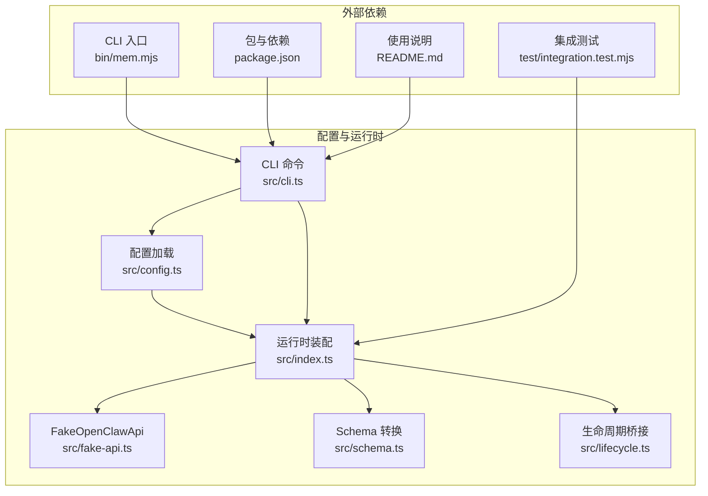
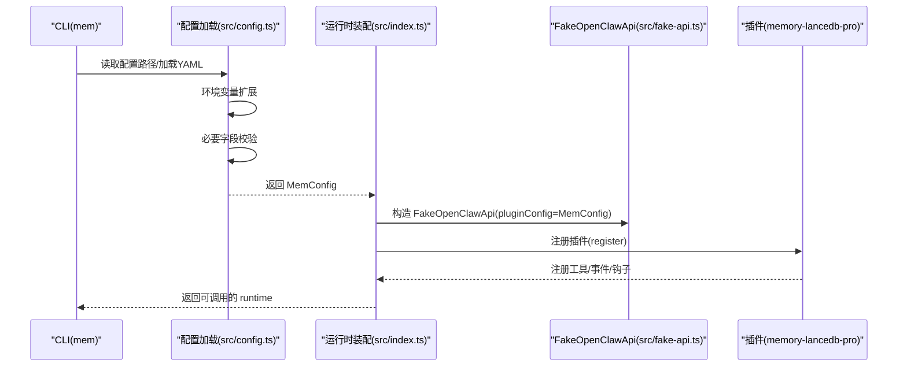
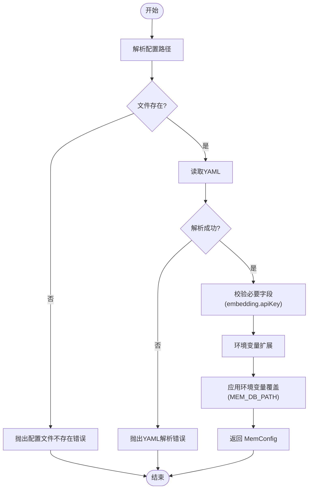
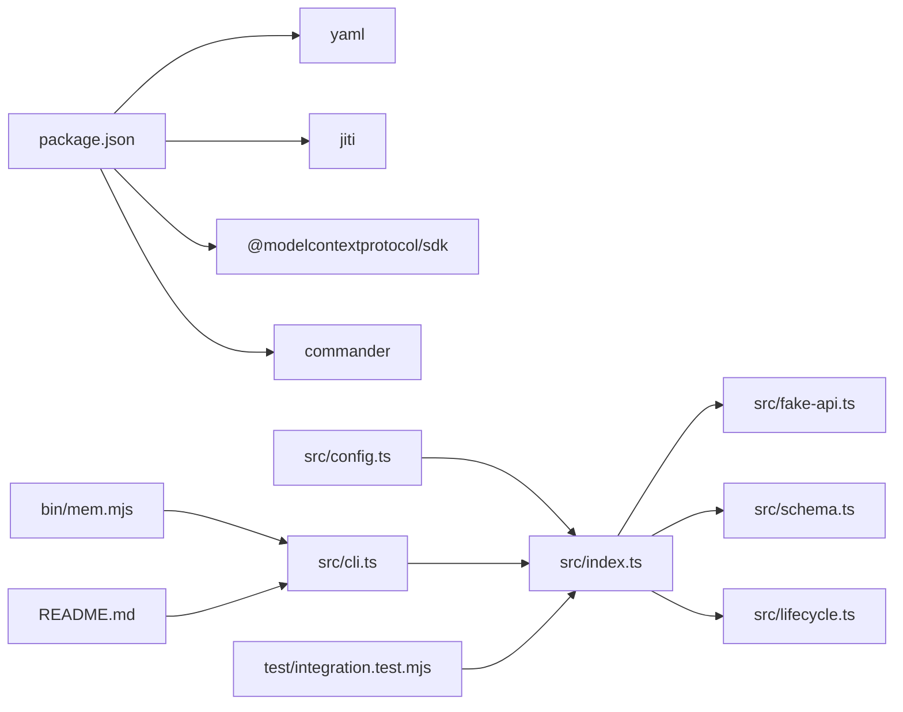

# 配置 API

<cite>
**本文引用的文件**
- [src/config.ts](file://src/config.ts)
- [src/index.ts](file://src/index.ts)
- [src/cli.ts](file://src/cli.ts)
- [src/fake-api.ts](file://src/fake-api.ts)
- [src/schema.ts](file://src/schema.ts)
- [src/lifecycle.ts](file://src/lifecycle.ts)
- [package.json](file://package.json)
- [README.md](file://README.md)
- [bin/mem.mjs](file://bin/mem.mjs)
- [test/integration.test.mjs](file://test/integration.test.mjs)
</cite>

## 目录
1. [简介](#简介)
2. [项目结构](#项目结构)
3. [核心组件](#核心组件)
4. [架构总览](#架构总览)
5. [详细组件分析](#详细组件分析)
6. [依赖分析](#依赖分析)
7. [性能考虑](#性能考虑)
8. [故障排查指南](#故障排查指南)
9. [结论](#结论)
10. [附录](#附录)

## 简介
本文件系统化记录 memory-lancedb-mcp 的配置 API，覆盖 YAML 配置文件的结构、默认值、验证规则、环境变量扩展、路径解析逻辑、继承与覆盖机制，并给出迁移指南、版本兼容性说明、最佳实践与常见错误的解决方案。配置对象 MemConfig 与上游 memory-lancedb-pro 的插件配置 schema 保持高度一致，便于无缝对接。

## 项目结构
配置系统主要由以下模块组成：
- 配置加载与校验：src/config.ts
- 运行时装配与作用域隔离：src/index.ts
- CLI 配置管理与健康检查：src/cli.ts
- FakeOpenClawApi 适配层（路径解析等）：src/fake-api.ts
- JSON Schema 转换（MCP 工具参数导出）：src/schema.ts
- 生命周期桥接（与配置联动）：src/lifecycle.ts
- 包与依赖声明：package.json
- 使用说明与示例：README.md
- CLI 入口：bin/mem.mjs
- 集成测试（验证配置与工具注册）：test/integration.test.mjs

图表来源
- [src/config.ts:1-312](file://src/config.ts#L1-L312)
- [src/index.ts:1-515](file://src/index.ts#L1-L515)
- [src/cli.ts:1-617](file://src/cli.ts#L1-L617)
- [src/fake-api.ts:1-318](file://src/fake-api.ts#L1-L318)
- [src/schema.ts:1-151](file://src/schema.ts#L1-L151)
- [src/lifecycle.ts:1-178](file://src/lifecycle.ts#L1-L178)
- [package.json:1-46](file://package.json#L1-L46)
- [bin/mem.mjs:1-8](file://bin/mem.mjs#L1-L8)
- [README.md:1-738](file://README.md#L1-L738)
- [test/integration.test.mjs:1-131](file://test/integration.test.mjs#L1-L131)

章节来源
- [src/config.ts:1-312](file://src/config.ts#L1-L312)
- [src/index.ts:1-515](file://src/index.ts#L1-L515)
- [src/cli.ts:1-617](file://src/cli.ts#L1-L617)
- [src/fake-api.ts:1-318](file://src/fake-api.ts#L1-L318)
- [src/schema.ts:1-151](file://src/schema.ts#L1-L151)
- [src/lifecycle.ts:1-178](file://src/lifecycle.ts#L1-L178)
- [package.json:1-46](file://package.json#L1-L46)
- [README.md:1-738](file://README.md#L1-L738)
- [bin/mem.mjs:1-8](file://bin/mem.mjs#L1-L8)
- [test/integration.test.mjs:1-131](file://test/integration.test.mjs#L1-L131)

## 核心组件
- MemConfig 接口：定义 YAML 配置的完整结构，包括 scopes、database、embedding、retrieval 等段落字段。
- 配置加载与校验：从 YAML 文件解析、环境变量扩展、必要字段校验、环境变量覆盖。
- 配置初始化：生成默认配置模板文件。
- 配置路径解析：MEM_CONFIG_PATH → ~/.config/memory-mcp/config.yaml → 当前目录 config.yaml → 默认路径。
- 环境变量扩展：对字符串值中的 ${VAR_NAME} 进行递归替换，缺失时发出警告。
- 运行时映射：将 MemConfig 直接透传给插件（与插件 schema 一致）。
- CLI 配置管理：init/show/path/validate/doctor 等命令。

章节来源
- [src/config.ts:23-98](file://src/config.ts#L23-L98)
- [src/config.ts:107-121](file://src/config.ts#L107-L121)
- [src/config.ts:135-157](file://src/config.ts#L135-L157)
- [src/config.ts:167-214](file://src/config.ts#L167-L214)
- [src/config.ts:220-223](file://src/config.ts#L220-L223)
- [src/config.ts:296-311](file://src/config.ts#L296-L311)
- [src/index.ts:207-498](file://src/index.ts#L207-L498)
- [src/cli.ts:367-443](file://src/cli.ts#L367-L443)

## 架构总览
配置在系统中的流转如下：
- CLI 读取配置路径并加载 YAML
- 执行环境变量扩展与必要字段校验
- 将 MemConfig 透传给插件注册流程
- 运行时根据配置控制自动捕获/召回、管理工具开关、会话策略等

图表来源
- [src/cli.ts:114-169](file://src/cli.ts#L114-L169)
- [src/config.ts:167-214](file://src/config.ts#L167-L214)
- [src/index.ts:207-239](file://src/index.ts#L207-L239)
- [src/fake-api.ts:79-90](file://src/fake-api.ts#L79-L90)

## 详细组件分析

### MemConfig 接口与配置段落
- dbPath：数据库存储路径（可使用 ~、绝对路径、相对路径），支持环境变量覆盖。
- embedding：嵌入配置（必需）
  - provider：供应商标识（可选）
  - apiKey：API 密钥（必需，支持数组）
  - model：模型名称（可选）
  - baseURL：API 基础地址（可选）
  - dimensions/requestDimensions/omitDimensions：维度相关参数（可选）
  - taskQuery/taskPassage：任务类型（可选）
  - normalized/chunking：向量化预处理参数（可选）
- llm：LLM 配置（可选，回退到 embedding 配置）
  - auth/apiKey/model/baseURL/timeoutMs：认证与调用参数（可选）
- autoCapture/autoRecall/autoRecallMinLength/autoRecallMaxItems/autoRecallMaxChars/autoRecallTimeoutMs：自动捕获/召回相关开关与阈值（可选）
- captureAssistant/smartExtraction：智能提取开关（可选）
- extractMinMessages/extractMaxChars：智能提取消息窗口与字符上限（可选）
- enableManagementTools/sessionStrategy：管理工具开关与会话策略（可选）
- retrieval：检索配置（可选）
  - mode/vectorWeight/bm25Weight/minScore/hardMinScore：混合检索权重与分数阈值（可选）
  - rerank/rerankProvider/rerankModel/rerankEndpoint/rerankApiKey/rerankTimeoutMs：重排配置（可选）
  - candidatePoolSize/recencyHalfLifeDays/recencyWeight/filterNoise/lengthNormAnchor/timeDecayHalfLifeDays/reinforcementFactor/maxHalfLifeMultiplier：召回与时间衰减相关参数（可选）
- scopes：作用域隔离配置（可选）
  - default：默认作用域（可选）
  - definitions：作用域定义（可选）
  - agentAccess：代理访问控制（可选）
- selfImprovement：自我改进治理（可选）
  - enabled/beforeResetNote/skipSubagentBootstrap/ensureLearningFiles：治理开关（可选）
- 其他扩展段：decay/tier/memoryReflection/admissionControl/memo…（Record<string, unknown>）

章节来源
- [src/config.ts:23-98](file://src/config.ts#L23-L98)
- [src/index.ts:211-227](file://src/index.ts#L211-L227)

### 配置加载与校验流程
- 路径解析顺序：MEM_CONFIG_PATH → ~/.config/memory-mcp/config.yaml → ./config.yaml → 默认路径
- YAML 解析失败或非对象结构将报错
- 必要字段校验：embedding 段必须存在且包含 apiKey
- 环境变量扩展：对字符串值中的 ${VAR_NAME} 进行替换，缺失时发出警告
- 环境变量覆盖：MEM_DB_PATH 覆盖 dbPath
- 返回 MemConfig 并透传给插件

图表来源
- [src/config.ts:107-121](file://src/config.ts#L107-L121)
- [src/config.ts:167-214](file://src/config.ts#L167-L214)
- [src/config.ts:135-157](file://src/config.ts#L135-L157)
- [src/config.ts:208-213](file://src/config.ts#L208-L213)

章节来源
- [src/config.ts:107-121](file://src/config.ts#L107-L121)
- [src/config.ts:135-157](file://src/config.ts#L135-L157)
- [src/config.ts:167-214](file://src/config.ts#L167-L214)
- [src/config.ts:208-213](file://src/config.ts#L208-L213)

### 环境变量扩展机制
- 递归扩展：支持字符串、数组、对象的递归遍历
- 缺失变量：发出警告并替换为空字符串
- 用途：在 YAML 中使用 ${VAR_NAME} 引用环境变量，常用于密钥与敏感配置

章节来源
- [src/config.ts:135-157](file://src/config.ts#L135-L157)

### 配置路径解析逻辑
- 优先级：MEM_CONFIG_PATH > 默认用户配置目录 > 当前目录 config.yaml > 默认路径
- 默认用户配置目录：~/.config/memory-mcp
- 默认配置文件：config.yaml
- 初始化：创建默认模板文件，权限 0600

章节来源
- [src/config.ts:104-121](file://src/config.ts#L104-L121)
- [src/config.ts:296-311](file://src/config.ts#L296-L311)

### 运行时配置映射与作用域隔离
- toPluginConfig：直接透传 MemConfig，与插件 schema 一致
- 作用域隔离：通过 options.scope 覆盖 scopes.default，并注入 agentAccess 与定义，实现项目级隔离
- 作用域注入策略：跨 scope 模式默认写入 global；锁定 scope 模式强制所有操作落到指定 scope

章节来源
- [src/config.ts:220-223](file://src/config.ts#L220-L223)
- [src/index.ts:211-227](file://src/index.ts#L211-L227)
- [src/index.ts:351-385](file://src/index.ts#L351-L385)

### CLI 配置管理命令
- mem config init：创建默认配置文件（可强制覆盖）
- mem config show：显示当前配置（敏感信息掩码）
- mem config path：打印配置文件路径
- mem config validate：校验配置有效性
- mem doctor：综合健康检查（配置文件、解析、API 密钥、插件加载、工具清单）

章节来源
- [src/cli.ts:367-443](file://src/cli.ts#L367-L443)
- [src/cli.ts:445-517](file://src/cli.ts#L445-L517)

### 配置对工具行为的影响
- autoCapture/autoRecall：影响生命周期桥接（自动召回/捕获）的行为开关
- enableManagementTools：决定是否启用管理类工具（如 memory_stats、memory_list 等）
- sessionStrategy：会话策略（MCP 模式下推荐 none）
- retrieval.*：控制混合检索权重、阈值、重排与时间衰减等
- scopes.*：控制作用域隔离与访问控制
- embedding.*：决定向量维度、模型与 API 调用参数

章节来源
- [src/index.ts:207-498](file://src/index.ts#L207-L498)
- [src/lifecycle.ts:52-128](file://src/lifecycle.ts#L52-L128)

### 运行时配置修改的限制
- 配置在 createMemoryRuntime 创建时一次性加载并透传给插件，运行时无法直接修改 MemConfig
- 作用域隔离通过 options.scope 在运行时注入，但不改变已加载的配置对象
- 若需变更配置，需重新创建 runtime 或通过 CLI 重新加载

章节来源
- [src/index.ts:207-239](file://src/index.ts#L207-L239)

## 依赖分析
- 外部依赖
  - yaml：YAML 解析
  - jiti：动态加载 memory-lancedb-pro 源码（无需本地构建）
  - @modelcontextprotocol/sdk：MCP 协议支持
  - commander：CLI 命令行解析
- 内部依赖
  - src/config.ts ← src/index.ts（加载配置、映射）
  - src/index.ts ← src/cli.ts（运行时工厂）
  - src/fake-api.ts ← src/index.ts（适配层）
  - src/schema.ts ← src/index.ts（工具参数 schema 转换）
  - src/lifecycle.ts ← src/index.ts（生命周期桥接）

图表来源
- [package.json:26-31](file://package.json#L26-L31)
- [src/config.ts:14-17](file://src/config.ts#L14-L17)
- [src/index.ts:9-12](file://src/index.ts#L9-L12)
- [src/cli.ts:17-27](file://src/cli.ts#L17-L27)
- [bin/mem.mjs:1-8](file://bin/mem.mjs#L1-L8)
- [README.md:1-738](file://README.md#L1-L738)
- [test/integration.test.mjs:1-131](file://test/integration.test.mjs#L1-L131)

章节来源
- [package.json:1-46](file://package.json#L1-L46)
- [src/config.ts:14-17](file://src/config.ts#L14-L17)
- [src/index.ts:9-12](file://src/index.ts#L9-L12)
- [src/cli.ts:17-27](file://src/cli.ts#L17-L27)
- [bin/mem.mjs:1-8](file://bin/mem.mjs#L1-L8)
- [README.md:1-738](file://README.md#L1-L738)
- [test/integration.test.mjs:1-131](file://test/integration.test.mjs#L1-L131)

## 性能考虑
- 配置文件仅在启动时加载一次，无运行时开销
- 环境变量扩展为轻量递归遍历，对性能影响可忽略
- 建议将敏感配置置于环境变量并通过 ${VAR_NAME} 引用，避免明文写入配置文件

## 故障排查指南
- 配置文件不存在
  - 现象：启动时报“配置文件不存在”
  - 处理：执行 mem config init 创建默认配置，或设置 MEM_CONFIG_PATH 指向有效路径
- YAML 解析失败
  - 现象：解析错误
  - 处理：检查 YAML 语法，确保顶层为对象
- 缺少 embedding.apiKey
  - 现象：缺少必需字段
  - 处理：在配置中设置 apiKey，或通过 ${ENV_VAR} 引用环境变量
- 环境变量未设置
  - 现象：扩展时发出警告并替换为空字符串
  - 处理：设置相应环境变量或在配置中直接填写
- 插件加载失败
  - 现象：无法加载 memory-lancedb-pro
  - 处理：确保已安装依赖，或检查网络与缓存
- 作用域不匹配
  - 现象：锁定 scope 模式下请求其他 scope 被拒绝
  - 处理：统一使用服务端指定的 scope，或在跨 scope 模式下显式传入 scope

章节来源
- [src/config.ts:170-187](file://src/config.ts#L170-L187)
- [src/config.ts:135-157](file://src/config.ts#L135-L157)
- [src/index.ts:357-366](file://src/index.ts#L357-L366)
- [src/cli.ts:445-517](file://src/cli.ts#L445-L517)

## 结论
本配置 API 以 YAML 为中心，结合环境变量扩展与严格的必要字段校验，提供了清晰、可维护、可迁移的配置体系。通过 MemConfig 与插件 schema 的一致映射，实现了零侵入的 MCP 适配。配合 CLI 的配置管理与健康检查命令，开发者可以快速完成部署与运维。

## 附录

### YAML 配置语法与默认值
- 顶层字段：dbPath、embedding（必需）、llm（可选）、autoCapture/autoRecall、smartExtraction、extractMinMessages/extractMaxChars、enableManagementTools、sessionStrategy、retrieval、scopes、selfImprovement 等
- 默认值与行为
  - dbPath：默认存储路径（可使用 ~、绝对/相对路径）
  - embedding.apiKey：必需，支持数组
  - retrieval.mode：默认 hybrid
  - sessionStrategy：默认 none（MCP 模式）
  - scopes.default：默认 global
- 环境变量覆盖
  - MEM_DB_PATH：覆盖 dbPath
  - MEM_CONFIG_PATH：覆盖默认配置路径

章节来源
- [src/config.ts:23-98](file://src/config.ts#L23-L98)
- [src/config.ts:229-290](file://src/config.ts#L229-L290)
- [src/config.ts:208-213](file://src/config.ts#L208-L213)
- [src/config.ts:107-121](file://src/config.ts#L107-L121)

### 验证规则与继承机制
- 必要字段：embedding.apiKey 必须存在
- 继承与回退：llm 段可选，若缺失则回退到 embedding 配置
- 环境变量扩展：对字符串值中的 ${VAR_NAME} 进行替换
- 环境变量覆盖：MEM_DB_PATH 直接覆盖 dbPath

章节来源
- [src/config.ts:192-206](file://src/config.ts#L192-L206)
- [src/config.ts:208-213](file://src/config.ts#L208-L213)

### 配置迁移指南与版本兼容性
- 版本兼容性：本项目通过 jiti 直接加载 memory-lancedb-pro 的 npm 源码，避免本地构建差异
- 迁移建议
  - 从旧版配置迁移到新 schema 时，优先保留 embedding.apiKey 与 model
  - 使用 mem doctor 检查配置与插件加载状态
  - 逐步启用 retrieval 与 scopes 等高级特性
- 注意事项
  - 确保 Node.js 版本满足要求（>=18）
  - 平台原生模块（如 LanceDB）可能需要特定平台构建

章节来源
- [package.json:37-39](file://package.json#L37-L39)
- [src/index.ts:159-184](file://src/index.ts#L159-L184)
- [README.md:132-168](file://README.md#L132-L168)

### 配置示例与最佳实践
- 示例参考
  - README 中提供 OpenAI、SiliconFlow、Ollama 的嵌入配置示例
- 最佳实践
  - 将密钥置于环境变量并通过 ${VAR_NAME} 引用
  - 使用 scopes.default 与 agentAccess 控制项目隔离
  - 在 MCP 模式下将 sessionStrategy 设为 none
  - 合理设置 retrieval 权重与阈值，平衡召回精度与性能
- 常见错误与解决
  - 配置文件路径错误：使用 mem config path 检查路径
  - API 密钥缺失：使用 mem doctor 检查环境变量是否设置
  - 作用域不匹配：统一使用服务端指定的 scope

章节来源
- [README.md:100-125](file://README.md#L100-L125)
- [src/cli.ts:417-443](file://src/cli.ts#L417-L443)
- [src/cli.ts:445-517](file://src/cli.ts#L445-L517)
- [src/index.ts:351-385](file://src/index.ts#L351-L385)