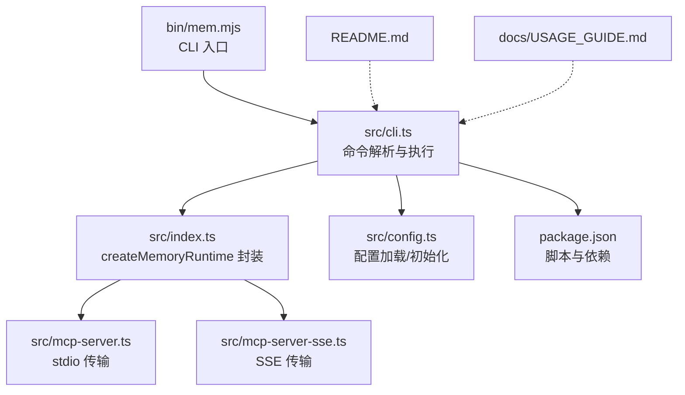
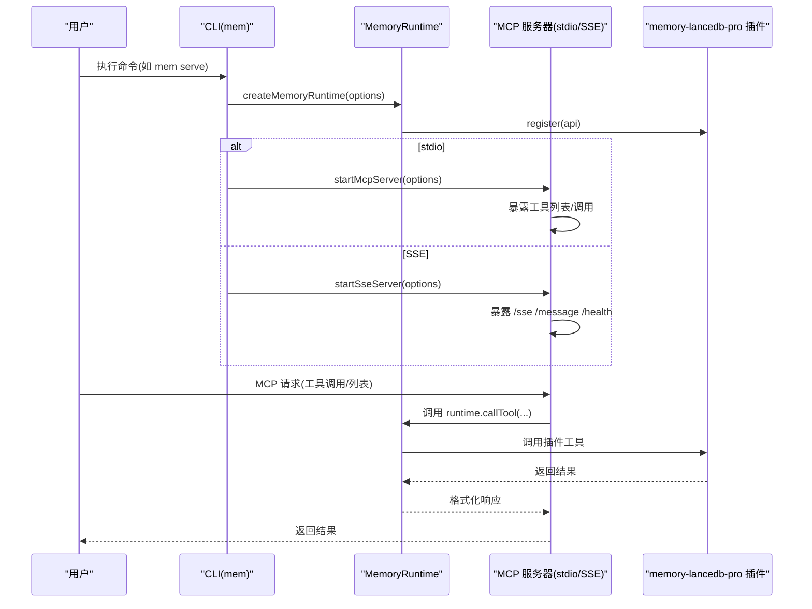
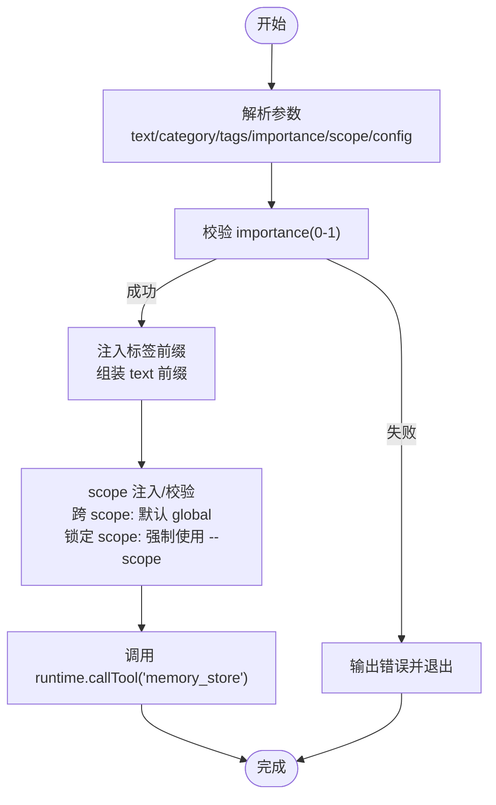
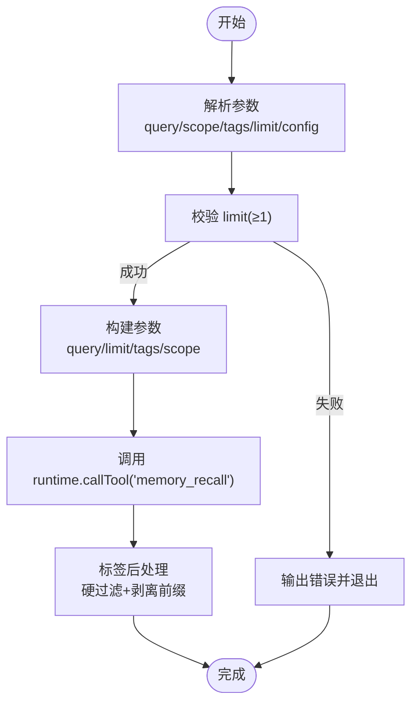
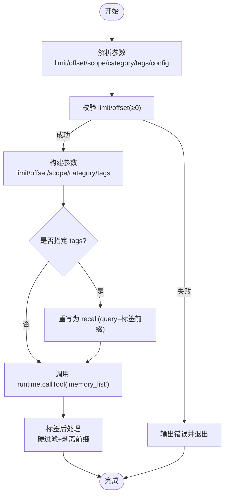
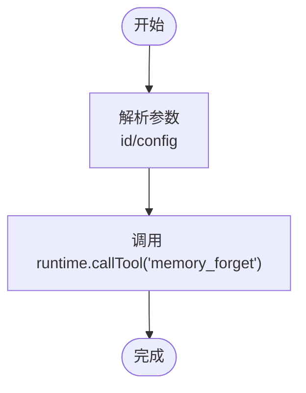
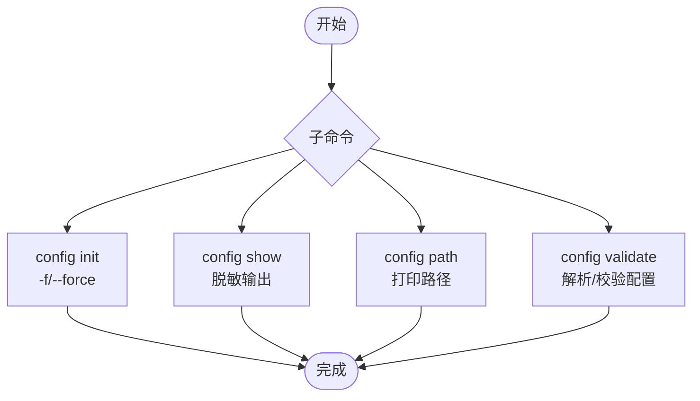
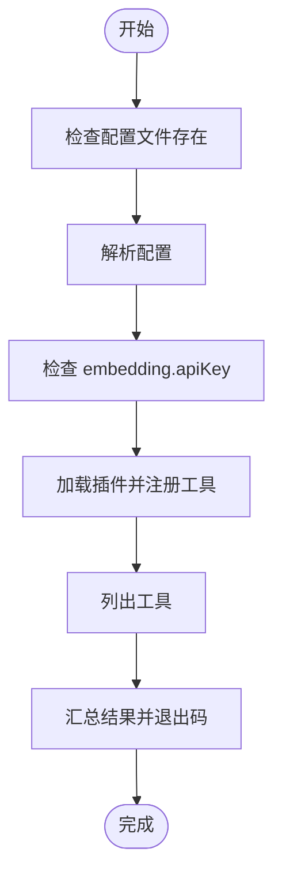
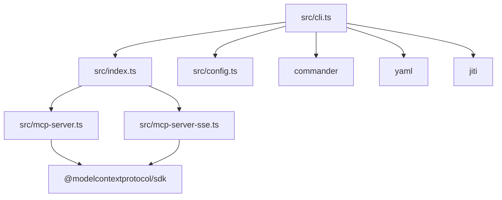

# CLI 工具详解

<cite>
**本文引用的文件**
- [bin/mem.mjs](file://bin/mem.mjs)
- [src/cli.ts](file://src/cli.ts)
- [src/index.ts](file://src/index.ts)
- [src/config.ts](file://src/config.ts)
- [src/mcp-server.ts](file://src/mcp-server.ts)
- [src/mcp-server-sse.ts](file://src/mcp-server-sse.ts)
- [package.json](file://package.json)
- [README.md](file://README.md)
- [docs/USAGE_GUIDE.md](file://docs/USAGE_GUIDE.md)
</cite>

## 目录
1. [简介](#简介)
2. [项目结构](#项目结构)
3. [核心组件](#核心组件)
4. [架构总览](#架构总览)
5. [详细组件分析](#详细组件分析)
6. [依赖分析](#依赖分析)
7. [性能考虑](#性能考虑)
8. [故障排除指南](#故障排除指南)
9. [结论](#结论)
10. [附录](#附录)

## 简介
本文件为 memory-lancedb-mcp 的 CLI 工具“mem”命令的完整参考文档。涵盖：
- mem 命令的所有子命令与参数
- serve 命令的启动参数（--config、--scope、--sse、--port、--host 等）
- 记忆管理命令（store、search、list、delete）的功能与参数组合
- 配置管理命令（config init、show、path、validate）
- 健康检查命令（doctor）
- scope 管理命令（list、delete）
- CLI 与 MCP 服务器的关系
- 不同场景下的工具选择与最佳实践

## 项目结构
该项目采用模块化组织，主要入口与核心逻辑如下：
- CLI 入口：bin/mem.mjs
- CLI 主实现：src/cli.ts
- 运行时与工具封装：src/index.ts
- 配置系统：src/config.ts
- MCP 服务器（stdio）：src/mcp-server.ts
- MCP 服务器（SSE）：src/mcp-server-sse.ts
- 包与脚本：package.json
- 文档：README.md、docs/USAGE_GUIDE.md

图表来源
- [bin/mem.mjs](file://bin/mem.mjs)
- [src/cli.ts](file://src/cli.ts)
- [src/index.ts](file://src/index.ts)
- [src/mcp-server.ts](file://src/mcp-server.ts)
- [src/mcp-server-sse.ts](file://src/mcp-server-sse.ts)
- [src/config.ts](file://src/config.ts)
- [package.json](file://package.json)

章节来源
- [bin/mem.mjs](file://bin/mem.mjs)
- [src/cli.ts](file://src/cli.ts)
- [src/index.ts](file://src/index.ts)
- [src/config.ts](file://src/config.ts)
- [src/mcp-server.ts](file://src/mcp-server.ts)
- [src/mcp-server-sse.ts](file://src/mcp-server-sse.ts)
- [package.json](file://package.json)
- [README.md](file://README.md)
- [docs/USAGE_GUIDE.md](file://docs/USAGE_GUIDE.md)

## 核心组件
- CLI 命令系统：基于 commander，定义 serve、list、search、stats、store、delete、config、doctor、scope 等子命令及参数。
- 运行时封装：createMemoryRuntime 提供统一的工具调用、事件与钩子接口，并注入标签前缀与 scope 注入/校验逻辑。
- 配置系统：支持 YAML 配置文件、环境变量扩展、默认路径解析与初始化。
- MCP 服务器：提供 stdio 与 SSE 两种传输模式，暴露工具列表与工具调用，支持生命周期工具桥接。

章节来源
- [src/cli.ts](file://src/cli.ts)
- [src/index.ts](file://src/index.ts)
- [src/config.ts](file://src/config.ts)
- [src/mcp-server.ts](file://src/mcp-server.ts)
- [src/mcp-server-sse.ts](file://src/mcp-server-sse.ts)

## 架构总览
CLI 与 MCP 服务器的关系：
- CLI 通过 createMemoryRuntime 获取运行时，直接调用工具或启动 MCP 服务器。
- stdio 模式用于本地 MCP 客户端（如 Claude Desktop、Cursor、Cline）。
- SSE 模式用于远程访问或多客户端场景，提供 /sse、/message、/health 端点。

图表来源
- [src/cli.ts](file://src/cli.ts)
- [src/index.ts](file://src/index.ts)
- [src/mcp-server.ts](file://src/mcp-server.ts)
- [src/mcp-server-sse.ts](file://src/mcp-server-sse.ts)

## 详细组件分析

### CLI 命令参考

#### mem serve — 启动 MCP 服务
- 用途：启动 MCP 服务器（默认 stdio，可切换 SSE）。
- 关键参数：
  - -c, --config <path>：指定配置文件路径
  - -s, --scope <scope>：默认 scope（如 project:myapp），用于项目隔离
  - --dry-run：验证配置并列出工具，不启动服务
  - --sse：使用 SSE（HTTP）传输
  - -p, --port <n>：SSE 端口，默认 3100
  - --host <host>：SSE 绑定地址，默认 127.0.0.1
  - -q, --quiet：抑制调试日志
- 使用示例：
  - mem serve
  - mem serve --scope project:myapp
  - mem serve --sse --port 3100 --host 0.0.0.0
  - mem serve --dry-run

章节来源
- [src/cli.ts](file://src/cli.ts)
- [src/mcp-server.ts](file://src/mcp-server.ts)
- [src/mcp-server-sse.ts](file://src/mcp-server-sse.ts)
- [README.md](file://README.md)
- [docs/USAGE_GUIDE.md](file://docs/USAGE_GUIDE.md)

#### mem store — 存储记忆
- 用途：存储一条记忆，支持分类、标签、重要度与目标 scope。
- 关键参数：
  - -c, --category <cat>：分类（preference/fact/decision/entity/other）
  - -t, --tags <tags>：逗号分隔标签（如 profile,project,tech）
  - -i, --importance <n>：重要度 0-1，默认 0.7
  - -s, --scope <scope>：目标 scope
  - --config <path>：配置文件路径
- 行为要点：
  - 标签自动转换为文本前缀“【标签:x,y】”，不影响父项目 schema。
  - 跨 scope 模式下未指定 scope 时，自动写入 global。
- 使用示例：
  - mem store "用户偏好使用 pnpm" -c preference -t tech,tools -i 0.9
  - mem store "项目基于 LanceDB 存储" -c fact --scope myapp

章节来源
- [src/cli.ts](file://src/cli.ts)
- [src/index.ts](file://src/index.ts)
- [README.md](file://README.md)
- [docs/USAGE_GUIDE.md](file://docs/USAGE_GUIDE.md)

#### mem search — 语义搜索
- 用途：混合检索召回记忆（向量 + BM25）。
- 关键参数：
  - -s, --scope <scope>：限定 scope
  - -t, --tags <tags>：标签过滤（逗号分隔）
  - -l, --limit <n>：最大结果数，默认 5，最大 20
  - --json：JSON 输出
  - --config <path>：配置文件路径
- 使用示例：
  - mem search "包管理器偏好" -s myapp -l 10
  - mem search "工程师" -t profile
  - mem search "数据库" -t project --json

章节来源
- [src/cli.ts](file://src/cli.ts)
- [src/index.ts](file://src/index.ts)
- [README.md](file://README.md)
- [docs/USAGE_GUIDE.md](file://docs/USAGE_GUIDE.md)

#### mem list — 列表查看
- 用途：列出最近记忆，支持分页与过滤。
- 关键参数：
  - -s, --scope <scope>：scope 过滤
  - -c, --category <cat>：category 过滤
  - -t, --tags <tags>：标签过滤（逗号分隔）
  - -l, --limit <n>：最大条数，默认 10，最大 50
  - --offset <n>：分页偏移，默认 0
  - --json：JSON 输出
  - --config <path>：配置文件路径
- 使用示例：
  - mem list -s myapp -c preference -l 20
  - mem list -t profile,tech
  - mem list --json

章节来源
- [src/cli.ts](file://src/cli.ts)
- [src/index.ts](file://src/index.ts)
- [README.md](file://README.md)
- [docs/USAGE_GUIDE.md](file://docs/USAGE_GUIDE.md)

#### mem stats — 统计信息
- 用途：显示内存统计。
- 关键参数：
  - -s, --scope <scope>：scope 过滤
  - --json：JSON 输出
  - --config <path>：配置文件路径
- 使用示例：
  - mem stats
  - mem stats --scope test
  - mem stats --json

章节来源
- [src/cli.ts](file://src/cli.ts)
- [src/index.ts](file://src/index.ts)
- [README.md](file://README.md)
- [docs/USAGE_GUIDE.md](file://docs/USAGE_GUIDE.md)

#### mem delete — 删除记忆
- 用途：按 ID 删除记忆。
- 关键参数：
  - --config <path>：配置文件路径
- 使用示例：
  - mem delete <memoryId>

章节来源
- [src/cli.ts](file://src/cli.ts)
- [src/index.ts](file://src/index.ts)
- [README.md](file://README.md)
- [docs/USAGE_GUIDE.md](file://docs/USAGE_GUIDE.md)

#### mem config — 配置管理
- config init
  - -f, --force：覆盖已有配置
  - 用途：创建默认配置文件
- config show
  - 用途：显示当前配置（密钥脱敏）
- config path
  - 用途：显示配置文件路径
- config validate
  - 用途：验证配置文件
- 使用示例：
  - mem config init
  - mem config init --force
  - mem config show
  - mem config path
  - mem config validate

章节来源
- [src/cli.ts](file://src/cli.ts)
- [src/config.ts](file://src/config.ts)
- [README.md](file://README.md)
- [docs/USAGE_GUIDE.md](file://docs/USAGE_GUIDE.md)

#### mem doctor — 健康检查
- 用途：运行健康检查，验证配置、插件加载、工具列表等。
- 关键参数：
  - --config <path>：配置文件路径
  - --mcp：测试 MCP 协议握手
- 使用示例：
  - mem doctor
  - mem doctor --mcp

章节来源
- [src/cli.ts](file://src/cli.ts)
- [README.md](file://README.md)
- [docs/USAGE_GUIDE.md](file://docs/USAGE_GUIDE.md)

#### mem scope — Scope 管理
- scope list
  - 用途：列出所有 scope 及其记忆数量
  - --config <path>：配置文件路径
- scope delete <scope>
  - --yes：跳过确认，直接删除
  - --dry-run：预览将删除的数量，不实际删除
  - --config <path>：配置文件路径
  - 注意：不可删除 global scope
- 使用示例：
  - mem scope list
  - mem scope delete project:old --dry-run
  - mem scope delete project:old --yes

章节来源
- [src/cli.ts](file://src/cli.ts)
- [src/index.ts](file://src/index.ts)
- [README.md](file://README.md)
- [docs/USAGE_GUIDE.md](file://docs/USAGE_GUIDE.md)

### CLI 与 MCP 服务器的关系
- CLI 通过 createMemoryRuntime 获取运行时，既可直接调用工具（如 list/search/stats/store/delete），也可启动 MCP 服务器。
- stdio 模式适合本地 MCP 客户端（Claude Desktop、Cursor、Cline 等）。
- SSE 模式适合远程访问或多客户端场景，提供 /sse、/message、/health 端点。
- --scope 参数决定运行模式：
  - 未指定：跨 scope 模式，可读写任意 scope
  - 指定：锁定 scope 模式，所有操作强制在该 scope 内，拒绝其他 scope 请求

章节来源
- [src/cli.ts](file://src/cli.ts)
- [src/index.ts](file://src/index.ts)
- [src/mcp-server.ts](file://src/mcp-server.ts)
- [src/mcp-server-sse.ts](file://src/mcp-server-sse.ts)
- [README.md](file://README.md)
- [docs/USAGE_GUIDE.md](file://docs/USAGE_GUIDE.md)

### 记忆管理命令的处理流程

#### 存储（store）

图表来源
- [src/cli.ts](file://src/cli.ts)
- [src/index.ts](file://src/index.ts)

#### 搜索（search）

图表来源
- [src/cli.ts](file://src/cli.ts)
- [src/index.ts](file://src/index.ts)

#### 列表（list）

图表来源
- [src/cli.ts](file://src/cli.ts)
- [src/index.ts](file://src/index.ts)

#### 删除（delete）

图表来源
- [src/cli.ts](file://src/cli.ts)
- [src/index.ts](file://src/index.ts)

### 配置管理命令的处理流程

图表来源
- [src/cli.ts](file://src/cli.ts)
- [src/config.ts](file://src/config.ts)

### 健康检查（doctor）

图表来源
- [src/cli.ts](file://src/cli.ts)
- [src/config.ts](file://src/config.ts)
- [src/index.ts](file://src/index.ts)

## 依赖分析
- 外部依赖：
  - @modelcontextprotocol/sdk：MCP 协议实现（stdio/SSE）
  - commander：命令行参数解析
  - yaml：YAML 解析
  - jiti：TS 源码动态加载（无需本地编译）
- 内部模块：
  - src/cli.ts：命令定义与执行
  - src/index.ts：运行时封装与工具调用
  - src/config.ts：配置加载/初始化
  - src/mcp-server.ts：stdio 传输
  - src/mcp-server-sse.ts：SSE 传输

图表来源
- [src/cli.ts](file://src/cli.ts)
- [src/index.ts](file://src/index.ts)
- [src/config.ts](file://src/config.ts)
- [src/mcp-server.ts](file://src/mcp-server.ts)
- [src/mcp-server-sse.ts](file://src/mcp-server-sse.ts)
- [package.json](file://package.json)

章节来源
- [package.json](file://package.json)
- [src/cli.ts](file://src/cli.ts)
- [src/index.ts](file://src/index.ts)
- [src/config.ts](file://src/config.ts)
- [src/mcp-server.ts](file://src/mcp-server.ts)
- [src/mcp-server-sse.ts](file://src/mcp-server-sse.ts)

## 性能考虑
- 标签前缀嵌入与剥离：避免额外字段存储，减少索引复杂度，但检索时依赖 BM25 命中，建议合理使用 tags 与 category 组合。
- 向量 + BM25 混合检索：召回质量与检索权重、最小分数阈值相关，建议根据业务调整 retrieval 配置。
- SSE 模式：多客户端共享同一进程，注意并发与资源占用；生产环境建议配合反向代理与鉴权。
- 跨 scope 模式：未指定 scope 时写入 global，避免写入 agent:system 私有空间；锁定 scope 模式下 ACL 检查严格，拒绝不一致 scope 请求。

[本节为通用指导，不直接分析具体文件]

## 故障排除指南
- 配置文件缺失或解析失败：使用 mem config validate 与 mem doctor 检查。
- API Key 未设置或环境变量未导出：检查配置 embedding.apiKey 与对应环境变量。
- 标签非法字符：normalizeTags 会立即抛错，修正标签字符集。
- Scope 权限拒绝：确认服务端 --scope 与请求 scope 是否一致；跨 scope 模式下可读写任意 scope。
- SSE 端口冲突：调整 --port 或 --host；确保主机未暴露至不受信任网络。
- 插件加载失败：确认 memory-lancedb-pro 已安装且版本兼容。

章节来源
- [src/cli.ts](file://src/cli.ts)
- [src/config.ts](file://src/config.ts)
- [src/index.ts](file://src/index.ts)
- [docs/USAGE_GUIDE.md](file://docs/USAGE_GUIDE.md)

## 结论
mem CLI 提供了从配置管理、健康检查到记忆存储/检索/统计/删除的完整工具链，并通过 --scope 实现多项目隔离。结合 stdio 与 SSE 两种传输模式，既能满足本地 MCP 客户端需求，也能支持远程/多客户端场景。建议在生产环境中配合 SSE + 反向代理与鉴权，并通过 doctor 与 validate 持续监控健康状况。

[本节为总结，不直接分析具体文件]

## 附录

### 常用命令速查
- 启动服务：mem serve、mem serve --sse、mem serve --scope <scope>
- 记忆管理：mem store、mem search、mem list、mem stats、mem delete
- 配置管理：mem config init、mem config show、mem config path、mem config validate
- 健康检查：mem doctor、mem doctor --mcp
- Scope 管理：mem scope list、mem scope delete <scope> [--dry-run] [--yes]

章节来源
- [README.md](file://README.md)
- [docs/USAGE_GUIDE.md](file://docs/USAGE_GUIDE.md)