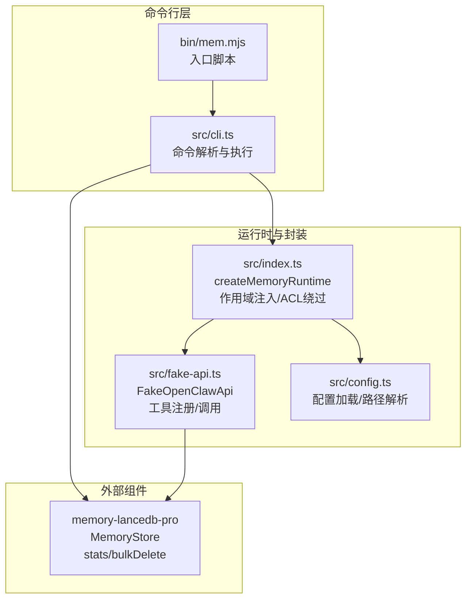
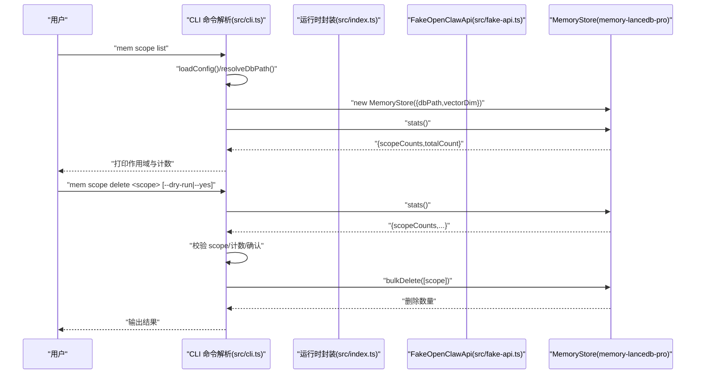
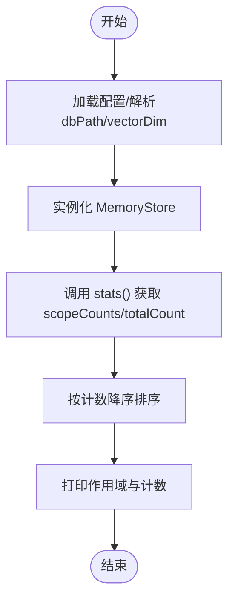
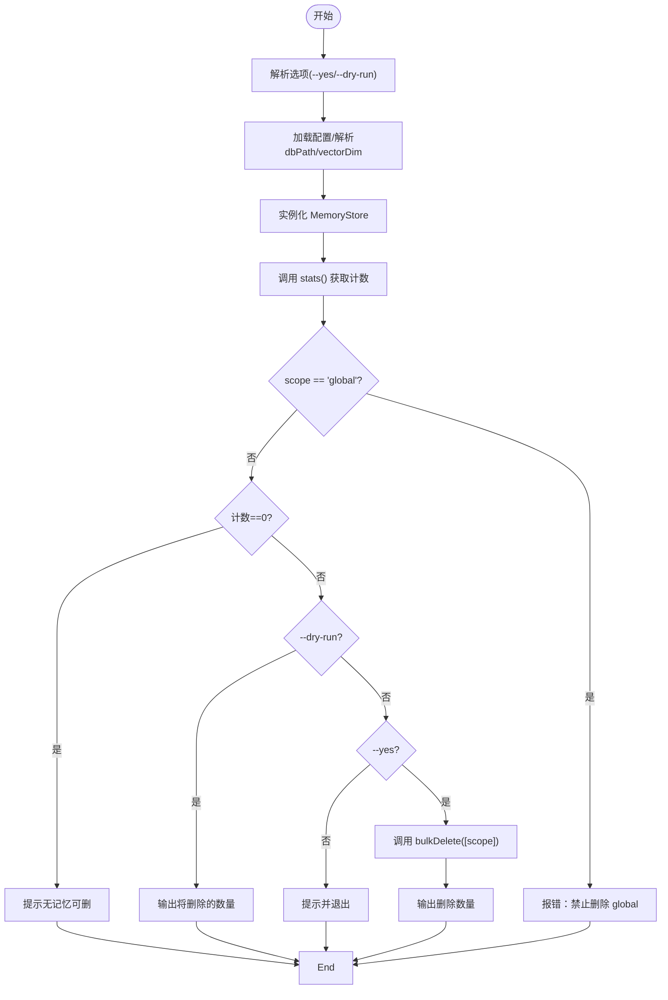
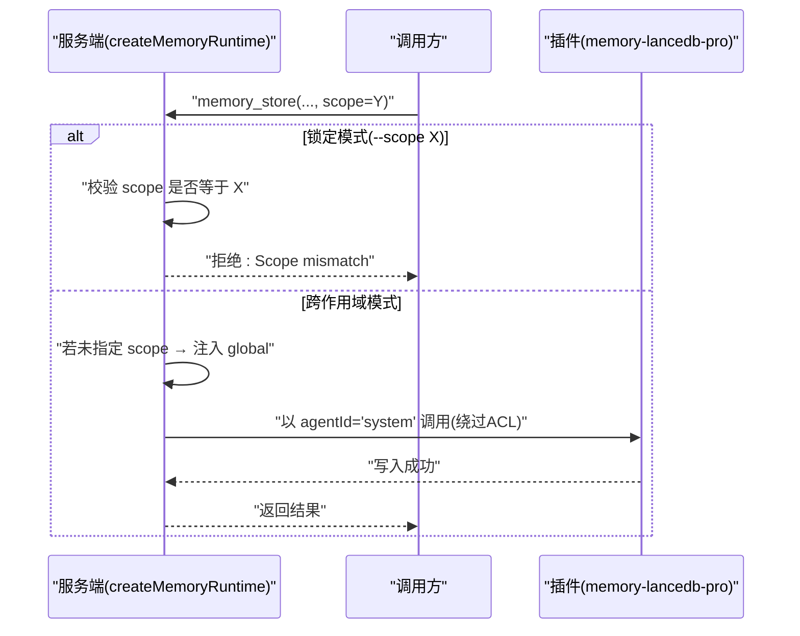
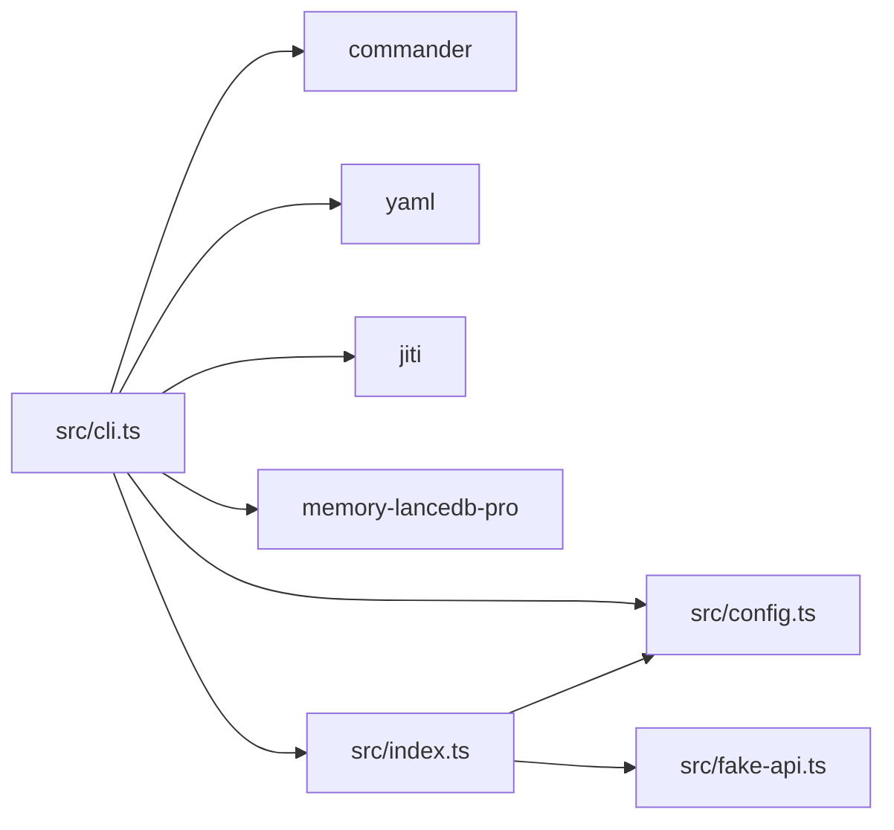

# Scope 管理命令

<cite>
**本文引用的文件**
- [bin/mem.mjs](file://bin/mem.mjs)
- [src/cli.ts](file://src/cli.ts)
- [src/index.ts](file://src/index.ts)
- [src/config.ts](file://src/config.ts)
- [src/fake-api.ts](file://src/fake-api.ts)
- [README.md](file://README.md)
- [docs/USAGE_GUIDE.md](file://docs/USAGE_GUIDE.md)
- [package.json](file://package.json)
</cite>

## 目录
1. [简介](#简介)
2. [项目结构](#项目结构)
3. [核心组件](#核心组件)
4. [架构总览](#架构总览)
5. [详细组件分析](#详细组件分析)
6. [依赖分析](#依赖分析)
7. [性能考量](#性能考量)
8. [故障排除指南](#故障排除指南)
9. [结论](#结论)
10. [附录](#附录)

## 简介
本文件聚焦于 Scope 管理命令，系统性说明以下内容：
- mem scope list：列出所有内存作用域及其计数，展示全局内存统计信息
- mem scope delete：删除特定作用域的所有记忆，支持 --yes 跳过确认、--dry-run 预览删除
- 作用域隔离机制的技术原理与使用场景，包括跨作用域模式与锁定作用域模式的区别
- 作用域命名约定与最佳实践，涵盖项目级隔离与代理级隔离的实现方式
- Scope 管理的实际使用示例与安全注意事项

## 项目结构
该项目是一个 MCP Server 包装器，通过命令行工具 mem 提供对 memory-lancedb-pro 的访问与管理能力。Scope 管理位于 CLI 层，结合运行时封装与外部存储组件完成作用域统计与批量删除。

图表来源
- [src/cli.ts:520-617](file://src/cli.ts#L520-L617)
- [src/index.ts:207-498](file://src/index.ts#L207-L498)
- [src/fake-api.ts:57-318](file://src/fake-api.ts#L57-L318)
- [src/config.ts:167-214](file://src/config.ts#L167-L214)

章节来源
- [src/cli.ts:1-617](file://src/cli.ts#L1-L617)
- [src/index.ts:1-515](file://src/index.ts#L1-L515)
- [src/config.ts:1-312](file://src/config.ts#L1-L312)
- [src/fake-api.ts:1-318](file://src/fake-api.ts#L1-L318)
- [bin/mem.mjs:1-8](file://bin/mem.mjs#L1-L8)
- [package.json:1-46](file://package.json#L1-L46)

## 核心组件
- CLI 命令定义与执行：在命令解析阶段注册 scope list 与 scope delete 子命令，并在执行时加载配置、解析数据库路径、实例化存储组件、调用统计与批量删除接口。
- 运行时封装：createMemoryRuntime 提供作用域注入与 ACL 绕过逻辑，保证跨作用域模式与锁定作用域模式的行为一致且安全。
- 存储抽象：通过动态加载 memory-lancedb-pro 的 MemoryStore，统一调用 stats 与 bulkDelete 接口，实现作用域统计与批量删除。
- 配置系统：负责配置文件路径解析、环境变量展开、默认配置初始化与校验。

章节来源
- [src/cli.ts:520-617](file://src/cli.ts#L520-L617)
- [src/index.ts:207-498](file://src/index.ts#L207-L498)
- [src/config.ts:167-214](file://src/config.ts#L167-L214)

## 架构总览
Scope 管理命令的执行路径如下：
- mem scope list：解析配置 → 实例化 MemoryStore → 调用 stats → 输出作用域与计数
- mem scope delete：解析配置 → 实例化 MemoryStore → 读取统计 → 校验 scope → 可选 dry-run → 确认后批量删除

图表来源
- [src/cli.ts:520-617](file://src/cli.ts#L520-L617)
- [src/index.ts:207-498](file://src/index.ts#L207-L498)
- [src/fake-api.ts:217-235](file://src/fake-api.ts#L217-L235)

## 详细组件分析

### mem scope list：列出所有作用域与计数
- 功能要点
  - 读取配置文件路径，解析数据库路径与向量维度
  - 动态加载 MemoryStore 并实例化
  - 调用 stats 接口获取 scopeCounts 与 totalCount
  - 按计数降序输出作用域列表与总数
- 输出格式
  - 表头：作用域名称与记忆数量列
  - 行：对齐的作用域名称与对应的计数
  - 总结：总记忆数与作用域数量
- 与运行时的关系
  - 该命令使用“系统绕过”agentId（在运行时封装中通过 memory_stats 的特殊调用实现跨作用域统计），因此能返回所有作用域的统计信息，不受当前 server 的 scope 锁定影响

图表来源
- [src/cli.ts:527-562](file://src/cli.ts#L527-L562)
- [src/index.ts:254-311](file://src/index.ts#L254-L311)

章节来源
- [src/cli.ts:527-562](file://src/cli.ts#L527-L562)
- [src/index.ts:254-311](file://src/index.ts#L254-L311)

### mem scope delete：删除特定作用域的所有记忆
- 功能要点
  - 禁止删除 "global" 作用域（系统保留）
  - 读取配置并实例化 MemoryStore
  - 读取统计，计算目标作用域的计数
  - 支持 --dry-run：仅输出将删除的数量，不实际删除
  - 支持 --yes：跳过确认提示，直接删除
  - 实际删除：调用 bulkDelete([scope])，返回删除数量
- 安全与交互
  - 若作用域计数为 0，提示无记忆可删
  - 未带 --yes 时，给出警告并要求确认
  - 删除为不可逆操作，建议先使用 --dry-run 预览

图表来源
- [src/cli.ts:564-610](file://src/cli.ts#L564-L610)

章节来源
- [src/cli.ts:564-610](file://src/cli.ts#L564-L610)

### 作用域隔离机制与两种运行模式
- 跨作用域模式（默认）
  - 服务启动时不带 --scope
  - memory_store 不指定 scope 时自动写入 global
  - memory_recall/list/stats 可跨作用域查询
- 锁定作用域模式
  - 服务启动时带 --scope X
  - 所有操作强制限定在 scope X 内
  - 请求其他 scope 将被拒绝
- 技术原理
  - 基于 scope ACL 的访问控制
  - 运行时封装通过 agentId="system" 绕过 ACL 检查，同时在 wrapper 层强制 normalized.scope 为服务端 scope 值，确保写入与 ACL 检查一致
  - 当调用者显式指定 scope 与服务端不一致时，立即在进入插件前拒绝

图表来源
- [src/index.ts:337-385](file://src/index.ts#L337-L385)
- [src/index.ts:254-311](file://src/index.ts#L254-L311)

章节来源
- [src/index.ts:337-385](file://src/index.ts#L337-L385)
- [README.md:426-498](file://README.md#L426-L498)
- [docs/USAGE_GUIDE.md:423-498](file://docs/USAGE_GUIDE.md#L423-L498)

### 作用域命名约定与最佳实践
- 命名建议
  - 使用清晰的层级命名，如 project:myapp、backend、agent:bot1
  - 避免使用保留字符（如 global），global 为系统保留作用域
- 项目级隔离
  - 通过 --scope project:myapp 启动服务，实现项目间完全隔离
  - 多个项目可并行运行，互不干扰
- 代理级隔离
  - 通过 --scope agent:bot1 启动服务，实现不同代理实例的记忆隔离
- 与标签、分类的组合
  - 可结合 tags 与 category 参数进一步细化检索范围
  - 在跨作用域模式下，memory_list --tags 会被重写为 memory_recall 以实现标签过滤

章节来源
- [README.md:426-498](file://README.md#L426-L498)
- [docs/USAGE_GUIDE.md:423-498](file://docs/USAGE_GUIDE.md#L423-L498)
- [src/index.ts:84-93](file://src/index.ts#L84-L93)

### Scope 管理使用示例与安全注意事项
- 使用示例
  - 列出所有作用域与计数：mem scope list
  - 预览删除范围：mem scope delete project:old --dry-run
  - 确认删除：mem scope delete project:old --yes
- 安全注意事项
  - 禁止删除 global 作用域
  - 删除为不可逆操作，建议先 --dry-run 预览
  - 在锁定作用域模式下，删除仅影响当前服务绑定的 scope
  - 配合 --config 指定配置文件，避免误删生产数据

章节来源
- [src/cli.ts:564-610](file://src/cli.ts#L564-L610)
- [docs/USAGE_GUIDE.md:541-555](file://docs/USAGE_GUIDE.md#L541-L555)

## 依赖分析
- CLI 依赖
  - commander：命令解析与参数处理
  - yaml：配置文件解析与序列化
  - jiti：动态加载 memory-lancedb-pro 源码（开发/生产均可）
- 运行时依赖
  - memory-lancedb-pro：核心存储与检索能力
  - @modelcontextprotocol/sdk：MCP 协议支持
- 配置与路径
  - 配置文件路径解析顺序：MEM_CONFIG_PATH > ~/.config/memory-mcp/config.yaml > ./config.yaml > 默认配置
  - 数据库路径支持 ~/ 与 ~ 的展开

图表来源
- [src/cli.ts:17-27](file://src/cli.ts#L17-L27)
- [package.json:26-31](file://package.json#L26-L31)

章节来源
- [src/cli.ts:17-27](file://src/cli.ts#L17-L27)
- [package.json:26-31](file://package.json#L26-L31)

## 性能考量
- scope list 的统计开销
  - stats() 会扫描数据库并聚合各作用域计数，规模较大时耗时与数据量相关
  - 建议定期清理不再使用的 scope，减少统计与检索负担
- scope delete 的批量删除
  - bulkDelete 会一次性删除目标作用域内所有记忆，底层依赖存储的批量删除能力
  - 大规模删除建议在维护窗口执行，避免影响在线服务

## 故障排除指南
- 配置相关
  - 配置文件不存在：使用 mem config init 创建默认配置
  - API Key 缺失：在配置中设置 embedding.apiKey 或通过环境变量提供
- 权限与作用域
  - Scope mismatch：在锁定模式下，请求的 scope 必须与服务端 --scope 一致
  - Access denied：确认 agentId 的 ACL 中包含目标 scope
- 删除失败
  - global 作用域不可删除：请使用其他方式清理
  - 作用域为空：无需删除，直接忽略

章节来源
- [src/cli.ts:564-610](file://src/cli.ts#L564-L610)
- [docs/USAGE_GUIDE.md:618-666](file://docs/USAGE_GUIDE.md#L618-L666)

## 结论
Scope 管理命令提供了对作用域的可视化与批量治理能力。通过 scope list 可掌握全局记忆分布，通过 scope delete 可安全地清理特定作用域的数据。结合跨作用域与锁定作用域两种模式，可在多项目与多代理场景下实现灵活而安全的记忆隔离。建议在生产环境中谨慎使用删除操作，并配合 --dry-run 与 --config 选项确保操作可控。

## 附录
- 命令速查
  - mem scope list：列出所有作用域与计数
  - mem scope delete <scope> [--dry-run] [--yes]：删除指定作用域的所有记忆
- 相关文档
  - 使用手册：docs/USAGE_GUIDE.md
  - 项目说明：README.md