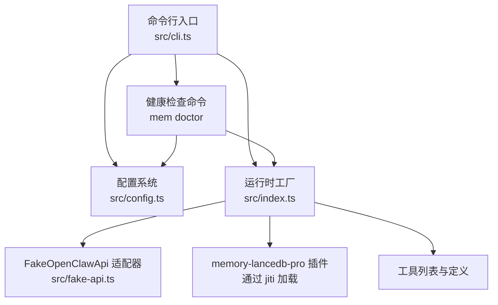
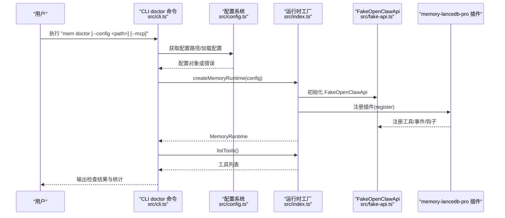
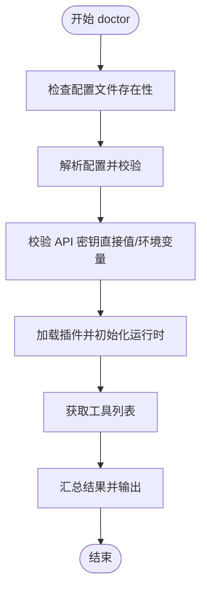
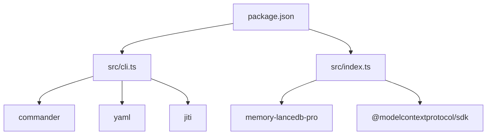

# 健康检查命令

<cite>
**本文引用的文件**
- [bin/mem.mjs](file://bin/mem.mjs)
- [src/cli.ts](file://src/cli.ts)
- [src/config.ts](file://src/config.ts)
- [src/index.ts](file://src/index.ts)
- [src/fake-api.ts](file://src/fake-api.ts)
- [README.md](file://README.md)
- [package.json](file://package.json)
- [docs/USAGE_GUIDE.md](file://docs/USAGE_GUIDE.md)
</cite>

## 目录
1. [简介](#简介)
2. [项目结构](#项目结构)
3. [核心组件](#核心组件)
4. [架构总览](#架构总览)
5. [详细组件分析](#详细组件分析)
6. [依赖分析](#依赖分析)
7. [性能考虑](#性能考虑)
8. [故障排除指南](#故障排除指南)
9. [结论](#结论)
10. [附录](#附录)

## 简介
本文档聚焦于健康检查命令“mem doctor”的完整实现与使用说明，涵盖配置文件存在性检查、配置解析验证、API 密钥有效性检查、插件加载测试与工具列表验证等五个检查步骤，并解释 --config 参数用于指定配置文件路径、--mcp 参数用于测试 MCP 协议握手的作用与意义。文档还提供常见失败原因与解决方案，帮助快速定位并修复配置错误、网络连接问题与权限不足等问题。

## 项目结构
该项目采用命令行入口 + 配置加载 + 插件运行时的分层结构：
- 命令行入口负责解析参数与执行各子命令
- 配置模块负责解析 YAML 配置、环境变量展开与默认路径解析
- 运行时模块负责加载插件、注册工具、事件与钩子，并提供工具调用与生命周期桥接
- FakeOpenClawApi 作为适配器，模拟插件运行时接口，承载工具工厂、事件与钩子注册

图表来源
- [src/cli.ts:449-517](file://src/cli.ts#L449-L517)
- [src/config.ts:167-214](file://src/config.ts#L167-L214)
- [src/index.ts:207-498](file://src/index.ts#L207-L498)
- [src/fake-api.ts:57-317](file://src/fake-api.ts#L57-L317)

章节来源
- [src/cli.ts:105-108](file://src/cli.ts#L105-L108)
- [src/config.ts:107-121](file://src/config.ts#L107-L121)
- [src/index.ts:159-184](file://src/index.ts#L159-L184)
- [src/fake-api.ts:113-127](file://src/fake-api.ts#L113-L127)

## 核心组件
- 命令行入口与 doctor 子命令：负责解析 --config 与 --mcp 参数，执行五步健康检查并输出结果
- 配置系统：解析 YAML、展开环境变量、校验必需字段、提供默认路径
- 运行时工厂：加载插件、注册 FakeOpenClawApi、构建 MemoryRuntime
- FakeOpenClawApi：注册工具、事件与钩子，提供工具调用与定义查询能力
- 插件加载：通过 jiti 直接从 node_modules 加载 memory-lancedb-pro 源码

章节来源
- [src/cli.ts:449-517](file://src/cli.ts#L449-L517)
- [src/config.ts:167-214](file://src/config.ts#L167-L214)
- [src/index.ts:207-498](file://src/index.ts#L207-L498)
- [src/fake-api.ts:113-127](file://src/fake-api.ts#L113-L127)

## 架构总览
mem doctor 的健康检查流程串联了配置加载、API 密钥校验、插件加载与工具列表验证，形成闭环的运行时环境与功能可用性验证。

图表来源
- [src/cli.ts:449-517](file://src/cli.ts#L449-L517)
- [src/config.ts:167-214](file://src/config.ts#L167-L214)
- [src/index.ts:207-498](file://src/index.ts#L207-L498)
- [src/fake-api.ts:217-235](file://src/fake-api.ts#L217-L235)

## 详细组件分析

### 健康检查命令实现（mem doctor）
- 命令定义与参数
  - 子命令：doctor
  - 参数：
    - --config <path>：指定配置文件路径
    - --mcp：测试 MCP 协议握手（在 doctor 中用于扩展性预留）
- 五步检查流程
  1) 配置文件存在性检查：判断配置文件是否存在
  2) 配置解析检查：尝试解析配置并校验必要字段
  3) API 密钥有效性检查：支持直接值或环境变量引用，校验非空与环境变量是否设置
  4) 插件加载测试：通过 createMemoryRuntime 构建运行时并捕获错误
  5) 工具列表验证：调用 listTools 获取工具清单并输出
- 结果统计与退出码：成功/失败计数，失败时退出码为 1

图表来源
- [src/cli.ts:449-517](file://src/cli.ts#L449-L517)

章节来源
- [src/cli.ts:449-517](file://src/cli.ts#L449-L517)

### 配置系统（config.ts）
- 配置路径解析顺序
  - 环境变量 MEM_CONFIG_PATH
  - 默认用户配置目录 ~/.config/memory-mcp/config.yaml
  - 当前目录 config.yaml
  - 默认路径（可能不存在）
- 配置加载与校验
  - 读取 YAML 文件并解析
  - 展开 ${ENV_VAR} 环境变量引用
  - 校验 embedding 与 apiKey 是否存在
  - 支持通过环境变量覆盖 dbPath
- 默认配置模板
  - 提供默认配置模板，包含 dbPath、embedding、llm、autoCapture、autoRecall、smartExtraction、enableManagementTools、sessionStrategy、retrieval、scopes、selfImprovement 等字段

章节来源
- [src/config.ts:107-121](file://src/config.ts#L107-L121)
- [src/config.ts:167-214](file://src/config.ts#L167-L214)
- [src/config.ts:296-311](file://src/config.ts#L296-L311)

### 运行时工厂（index.ts）
- 插件加载
  - 通过 jiti 直接从 node_modules 加载 memory-lancedb-pro 源码
  - 若失败则回退到本地 dist（开发模式）
- FakeOpenClawApi 初始化
  - 将配置转换为插件期望的 pluginConfig
  - 初始化日志与路径解析
- 插件注册
  - 调用插件 register(api) 完成工具、事件与钩子注册
- 工具调用与列表
  - 提供 callTool 与 listTools 能力
  - 注入 tags 参数 schema 与合成 list_scopes 工具

章节来源
- [src/index.ts:159-184](file://src/index.ts#L159-L184)
- [src/index.ts:207-498](file://src/index.ts#L207-L498)

### FakeOpenClawApi（fake-api.ts）
- 工具注册与调用
  - registerTool：注册工具工厂，预览工厂以提取工具名
  - callTool：根据工具名获取工厂并执行
- 事件与钩子
  - on：注册事件处理器
  - registerHook：注册钩子处理器
- CLI 注册
  - registerCli：保存 CLI 实例供复用
- 工具定义查询
  - getToolDefinition/getAllToolDefinitions：用于 doctor 输出工具列表

章节来源
- [src/fake-api.ts:113-127](file://src/fake-api.ts#L113-L127)
- [src/fake-api.ts:217-235](file://src/fake-api.ts#L217-L235)
- [src/fake-api.ts:241-263](file://src/fake-api.ts#L241-L263)

## 依赖分析
- CLI 依赖
  - commander：命令行参数解析
  - yaml：YAML 解析
  - jiti：动态加载插件源码
- 运行时依赖
  - memory-lancedb-pro：核心插件（通过 github release 引用）
  - @modelcontextprotocol/sdk：MCP 协议支持
- 构建与脚本
  - TypeScript 编译与测试脚本

图表来源
- [package.json:26-36](file://package.json#L26-L36)
- [src/cli.ts:17-27](file://src/cli.ts#L17-L27)
- [src/index.ts:12](file://src/index.ts#L12)

章节来源
- [package.json:26-36](file://package.json#L26-L36)
- [src/cli.ts:17-27](file://src/cli.ts#L17-L27)
- [src/index.ts:12](file://src/index.ts#L12)

## 性能考虑
- doctor 健康检查为轻量级流程，主要涉及文件系统访问、YAML 解析与一次插件注册，耗时通常在毫秒级
- 配置解析阶段的环境变量展开与 YAML 解析为 O(n) 时间复杂度，n 为配置项数量
- 插件加载通过 jiti 动态编译，首次加载会有编译开销，后续重复使用缓存

## 故障排除指南
- 配置文件缺失
  - 现象：配置文件未找到
  - 排查：确认 MEM_CONFIG_PATH 环境变量、默认路径 ~/.config/memory-mcp/config.yaml、当前目录 config.yaml 是否存在
  - 解决：使用 mem config init 创建默认配置，或通过 --config 指定路径
- 配置解析错误
  - 现象：YAML 解析失败或配置为空/非对象
  - 排查：检查 YAML 语法、缩进与字段类型
  - 解决：修正 YAML 语法，确保 embedding 与 apiKey 存在
- API 密钥无效
  - 现象：apiKey 缺失、为空或环境变量未设置
  - 排查：确认配置中 apiKey 值或 ${ENV_VAR} 是否正确设置
  - 解决：填写有效 API 密钥或设置对应的环境变量
- 插件加载失败
  - 现象：无法加载 memory-lancedb-pro 插件
  - 排查：确认依赖安装、网络可达性、Node 版本满足要求
  - 解决：执行 npm install，确保内存-lancedb-pro 可用
- 工具列表为空
  - 现象：插件加载成功但工具列表为空
  - 排查：确认插件注册是否正常、事件与钩子是否正确注册
  - 解决：检查插件版本与注册逻辑，必要时升级依赖

章节来源
- [src/cli.ts:449-517](file://src/cli.ts#L449-L517)
- [src/config.ts:167-214](file://src/config.ts#L167-L214)
- [src/index.ts:159-184](file://src/index.ts#L159-L184)
- [docs/USAGE_GUIDE.md:618-666](file://docs/USAGE_GUIDE.md#L618-L666)

## 结论
mem doctor 健康检查命令通过五个关键步骤，全面验证了配置文件完整性、API 凭据有效性、运行时环境准备与功能可用性。结合 --config 与 --mcp 参数，用户可以灵活指定配置路径并预留 MCP 协议握手测试。遇到问题时，可依据本文提供的故障排除指南快速定位并解决配置错误、网络连接问题与权限不足等常见场景。

## 附录
- 使用示例
  - 基本健康检查：mem doctor
  - 指定配置文件：mem doctor --config /path/to/config.yaml
  - 预留 MCP 握手测试：mem doctor --mcp
- 相关文档
  - 使用手册：docs/USAGE_GUIDE.md
  - README：README.md