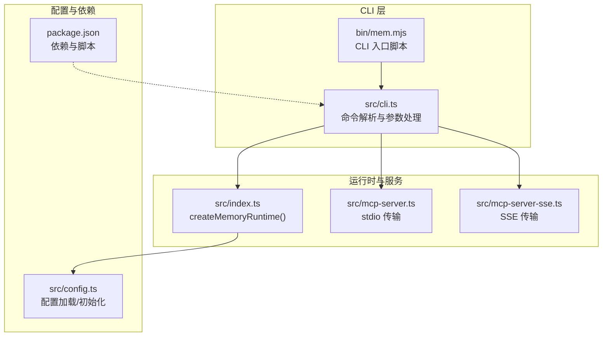
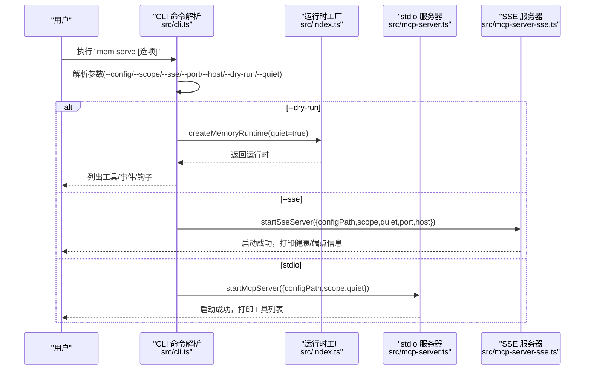

# 服务管理命令

<cite>
**本文引用的文件**
- [bin/mem.mjs](file://bin/mem.mjs)
- [src/cli.ts](file://src/cli.ts)
- [src/index.ts](file://src/index.ts)
- [src/mcp-server.ts](file://src/mcp-server.ts)
- [src/mcp-server-sse.ts](file://src/mcp-server-sse.ts)
- [src/config.ts](file://src/config.ts)
- [package.json](file://package.json)
- [README.md](file://README.md)
- [docs/USAGE_GUIDE.md](file://docs/USAGE_GUIDE.md)
</cite>

## 目录
1. [简介](#简介)
2. [项目结构](#项目结构)
3. [核心组件](#核心组件)
4. [架构总览](#架构总览)
5. [详细组件分析](#详细组件分析)
6. [依赖分析](#依赖分析)
7. [性能考虑](#性能考虑)
8. [故障排除指南](#故障排除指南)
9. [结论](#结论)
10. [附录](#附录)

## 简介
本文档聚焦于服务管理命令“mem serve”的详细使用说明，涵盖参数选项、传输模式对比、项目级内存隔离（--scope）、配置文件路径（--config）、SSE 传输模式（--sse）、HTTP 服务器参数（--port、--host）、配置验证（--dry-run）与日志控制（--quiet）。同时提供 stdio 与 SSE 两种传输模式的对比分析、实际启动示例与常见问题排查建议，帮助开发者快速上手并稳定运行。

## 项目结构
该项目围绕“mem”命令构建，核心入口为 CLI，负责解析参数并启动 MCP 服务（stdio 或 SSE）。服务内部通过运行时工厂函数创建 FakeOpenClawApi，并加载 memory-lancedb-pro 插件，最终暴露一组记忆工具（如 memory_store、memory_recall 等）给 MCP 客户端。

图表来源
- [src/cli.ts:105-169](file://src/cli.ts#L105-L169)
- [src/mcp-server.ts:43-140](file://src/mcp-server.ts#L43-L140)
- [src/mcp-server-sse.ts:57-209](file://src/mcp-server-sse.ts#L57-L209)
- [src/index.ts:207-498](file://src/index.ts#L207-L498)
- [src/config.ts:167-214](file://src/config.ts#L167-L214)
- [bin/mem.mjs:1-8](file://bin/mem.mjs#L1-L8)
- [package.json:10-14](file://package.json#L10-L14)

章节来源
- [src/cli.ts:105-169](file://src/cli.ts#L105-L169)
- [src/mcp-server.ts:43-140](file://src/mcp-server.ts#L43-L140)
- [src/mcp-server-sse.ts:57-209](file://src/mcp-server-sse.ts#L57-L209)
- [src/index.ts:207-498](file://src/index.ts#L207-L498)
- [src/config.ts:167-214](file://src/config.ts#L167-L214)
- [bin/mem.mjs:1-8](file://bin/mem.mjs#L1-L8)
- [package.json:10-14](file://package.json#L10-L14)

## 核心组件
- CLI 命令“serve”
  - 参数：--config、--scope、--dry-run、--sse、--port、--host、--quiet
  - 功能：根据参数选择 stdio 或 SSE 模式启动 MCP 服务；在 dry-run 模式下验证配置并列出工具
- 运行时工厂 createMemoryRuntime
  - 负责加载配置、应用 scope 隔离、创建 FakeOpenClawApi、注册插件并返回统一的运行时对象
- stdio 传输
  - 使用标准输入输出与 MCP 客户端通信，适合本地桌面客户端（如 Claude Desktop、Cursor）
- SSE 传输
  - 通过 HTTP/SSE 暴露 /sse 与 /message 端点，支持远程访问与多客户端场景

章节来源
- [src/cli.ts:114-169](file://src/cli.ts#L114-L169)
- [src/index.ts:207-498](file://src/index.ts#L207-L498)
- [src/mcp-server.ts:43-140](file://src/mcp-server.ts#L43-L140)
- [src/mcp-server-sse.ts:57-209](file://src/mcp-server-sse.ts#L57-L209)

## 架构总览
“mem serve”命令的执行流程如下：

图表来源
- [src/cli.ts:124-169](file://src/cli.ts#L124-L169)
- [src/index.ts:207-242](file://src/index.ts#L207-L242)
- [src/mcp-server.ts:43-140](file://src/mcp-server.ts#L43-L140)
- [src/mcp-server-sse.ts:57-209](file://src/mcp-server-sse.ts#L57-L209)

## 详细组件分析

### mem serve 参数详解
- --config <path>
  - 指定配置文件路径。支持绝对路径或相对路径。若未提供，将按顺序查找环境变量 MEM_CONFIG_PATH、默认用户配置目录、当前目录下的 config.yaml，最后使用默认最小配置。
  - 章节来源
    - [src/cli.ts:117](file://src/cli.ts#L117)
    - [src/config.ts:107-121](file://src/config.ts#L107-L121)
    - [src/config.ts:167-214](file://src/config.ts#L167-L214)
- --scope <scope>
  - 项目级内存隔离。启用后，服务将强制所有操作限定在该 scope 内；请求其他 scope 将被拒绝。未指定时为跨 scope 模式，可读写任意 scope。
  - 章节来源
    - [src/cli.ts:118](file://src/cli.ts#L118)
    - [src/index.ts:212-227](file://src/index.ts#L212-L227)
    - [src/mcp-server.ts:84](file://src/mcp-server.ts#L84)
    - [src/mcp-server-sse.ts:75](file://src/mcp-server-sse.ts#L75)
- --dry-run
  - 验证配置并列出已注册工具、事件与钩子，不启动服务。常用于预检与工具清单核对。
  - 章节来源
    - [src/cli.ts:119](file://src/cli.ts#L119)
    - [src/cli.ts:126-143](file://src/cli.ts#L126-L143)
- --sse
  - 切换为 SSE（HTTP）传输模式，通过 /sse 与 /message 提供 MCP 服务。
  - 章节来源
    - [src/cli.ts:120](file://src/cli.ts#L120)
    - [src/mcp-server-sse.ts:57-209](file://src/mcp-server-sse.ts#L57-L209)
- --port <n>
  - SSE 模式的监听端口，默认 3100。仅在 --sse 生效时使用。
  - 章节来源
    - [src/cli.ts:121](file://src/cli.ts#L121)
    - [src/mcp-server-sse.ts:58](file://src/mcp-server-sse.ts#L58)
- --host <host>
  - SSE 模式的绑定地址，默认 127.0.0.1。仅在 --sse 生效时使用。
  - 章节来源
    - [src/cli.ts:122](file://src/cli.ts#L122)
    - [src/mcp-server-sse.ts:59](file://src/mcp-server-sse.ts#L59)
- --quiet
  - 抑制调试日志输出。stdio 模式默认 quiet=true，SSE 模式默认 quiet=false，可通过 --quiet 覆盖。
  - 章节来源
    - [src/cli.ts:123](file://src/cli.ts#L123)
    - [src/mcp-server.ts:51](file://src/mcp-server.ts#L51)
    - [src/mcp-server-sse.ts:67](file://src/mcp-server-sse.ts#L67)

章节来源
- [src/cli.ts:114-169](file://src/cli.ts#L114-L169)
- [src/mcp-server.ts:43-140](file://src/mcp-server.ts#L43-L140)
- [src/mcp-server-sse.ts:57-209](file://src/mcp-server-sse.ts#L57-L209)
- [src/index.ts:207-242](file://src/index.ts#L207-L242)
- [src/config.ts:107-121](file://src/config.ts#L107-L121)

### stdio vs SSE 传输模式对比
- stdio 模式
  - 优点：与 MCP 客户端（如 Claude Desktop、Cursor）标准对接，无需额外网络配置；日志清晰，便于本地调试。
  - 缺点：仅限本地 stdio 通道，不支持远程访问或多客户端并发。
  - 适用场景：本地开发、桌面客户端集成、单实例部署。
- SSE 模式
  - 优点：通过 HTTP/SSE 暴露端点，支持远程访问、多客户端并发、反向代理与容器化部署。
  - 缺点：需要正确配置 host/port，注意跨域与安全暴露；日志输出在 stderr，需结合健康检查端点监控。
  - 适用场景：Docker/WSL 远程部署、多客户端共享、CI/CD 环境。

章节来源
- [src/mcp-server.ts:35-140](file://src/mcp-server.ts#L35-L140)
- [src/mcp-server-sse.ts:46-209](file://src/mcp-server-sse.ts#L46-L209)
- [README.md:257-276](file://README.md#L257-L276)

### 项目级内存隔离（--scope）
- 跨 scope 模式（默认）
  - 可读写任意 scope；memory_store 不指定 scope 时自动写入 global。
- 锁定 scope 模式（--scope X）
  - 所有操作强制限定在 scope X 内；请求其他 scope 将被拒绝。
- 实现要点
  - 通过 agentId 与 scope ACL 控制访问；在运行时层强制覆盖 scope 并使用系统级绕过 ID 保证 ACL 通过。
- 章节来源
  - [src/index.ts:212-227](file://src/index.ts#L212-L227)
  - [src/index.ts:351-370](file://src/index.ts#L351-L370)
  - [src/mcp-server.ts:84](file://src/mcp-server.ts#L84)
  - [src/mcp-server-sse.ts:75](file://src/mcp-server-sse.ts#L75)
  - [README.md:426-499](file://README.md#L426-L499)

### 配置文件路径（--config）
- 路径解析顺序：MEM_CONFIG_PATH 环境变量 > 默认用户配置目录 > 当前目录 config.yaml > 默认最小配置
- 配置加载与校验：解析 YAML、展开环境变量、校验必需字段（如 embedding.apiKey）
- 章节来源
  - [src/config.ts:107-121](file://src/config.ts#L107-L121)
  - [src/config.ts:167-214](file://src/config.ts#L167-L214)
  - [src/cli.ts:128-132](file://src/cli.ts#L128-L132)

### HTTP 服务器参数（--port、--host）
- SSE 模式下生效，分别控制监听端口与绑定地址
- 章节来源
  - [src/cli.ts:146-157](file://src/cli.ts#L146-L157)
  - [src/mcp-server-sse.ts:58-59](file://src/mcp-server-sse.ts#L58-L59)

### 配置验证与工具列表（--dry-run）
- 在 dry-run 模式下，仅加载运行时并列出工具、事件与钩子，不启动服务
- 章节来源
  - [src/cli.ts:126-143](file://src/cli.ts#L126-L143)

### 日志控制（--quiet）
- stdio 模式默认 quiet=true，SSE 模式默认 quiet=false；可通过 --quiet 覆盖
- 章节来源
  - [src/mcp-server.ts:51](file://src/mcp-server.ts#L51)
  - [src/mcp-server-sse.ts:67](file://src/mcp-server-sse.ts#L67)
  - [src/cli.ts:154-155](file://src/cli.ts#L154-L155)

### 实际启动示例
- stdio 模式（本地 MCP 客户端）
  - mem serve
  - mem serve --scope project:myapp
- SSE 模式（远程/多客户端）
  - mem serve --sse --port 3100 --host 0.0.0.0
  - mem serve --sse --port 3100 --scope project:myapp
- 预检与工具列表
  - mem serve --dry-run
- 章节来源
  - [README.md:284-312](file://README.md#L284-L312)
  - [docs/USAGE_GUIDE.md:49-55](file://docs/USAGE_GUIDE.md#L49-L55)

## 依赖分析
- CLI 依赖
  - commander：命令解析与参数处理
  - yaml：配置文件解析
  - jiti：动态加载 memory-lancedb-pro 源码（无需本地构建）
- 运行时依赖
  - @modelcontextprotocol/sdk：MCP 协议实现（stdio/SSE）
  - memory-lancedb-pro：记忆引擎插件
- 章节来源
  - [package.json:26-31](file://package.json#L26-L31)
  - [src/cli.ts:17-27](file://src/cli.ts#L17-L27)
  - [src/mcp-server.ts:8-13](file://src/mcp-server.ts#L8-L13)
  - [src/mcp-server-sse.ts:11-23](file://src/mcp-server-sse.ts#L11-L23)

## 性能考虑
- SSE 模式下，HTTP 服务器与 SSE 事件流的开销需结合客户端数量评估；建议在生产环境使用反向代理（如 Nginx）与合适的并发配置。
- stdio 模式更适合本地轻量使用，避免网络层抖动带来的延迟。
- 配置与插件加载在启动阶段完成，后续请求主要受嵌入模型与数据库 I/O 影响。

## 故障排除指南
- 启动失败
  - 先运行配置验证与健康检查：mem config validate、mem doctor
  - 检查嵌入 API Key 是否正确、endpoint 是否可达、数据目录权限
- 嵌入模型错误
  - 确认 embedding.model 与 baseUrl 正确；Ollama 本地模型需确保服务已启动
- 召回不准确
  - 优先优化 query 格式（实体名 + 技术术语），提升内容长度与关键词唯一性
- Scope 权限拒绝
  - 若返回“Scope mismatch”，确认服务启动时的 --scope 与请求 scope 一致；跨 scope 模式下可移除 --scope
- SSE 端点不可达
  - 检查 host/port 配置、防火墙与反向代理设置；使用 /health 端点进行健康检查
- 章节来源
  - [docs/USAGE_GUIDE.md:618-666](file://docs/USAGE_GUIDE.md#L618-L666)
  - [README.md:618-666](file://README.md#L618-L666)

## 结论
“mem serve”命令提供了灵活的服务启动方式与强大的项目级内存隔离能力。通过 --config、--scope、--sse、--port、--host、--dry-run、--quiet 等参数，可在本地开发与远程部署之间自由切换，并结合 SSE 模式满足多客户端与容器化需求。建议在生产环境中优先使用 SSE 模式并配合健康检查与反向代理，同时利用 --scope 实现多项目的完全隔离。

## 附录
- CLI 入口脚本
  - bin/mem.mjs：Node CLI 入口，加载构建产物并输出错误信息
  - 章节来源
    - [bin/mem.mjs:1-8](file://bin/mem.mjs#L1-L8)
- 常用命令速查
  - mem serve：启动服务（stdio 默认）
  - mem serve --sse：SSE 模式
  - mem serve --dry-run：验证配置并列出工具
  - mem doctor：健康检查
  - 章节来源
    - [README.md:279-424](file://README.md#L279-L424)
    - [docs/USAGE_GUIDE.md:43-164](file://docs/USAGE_GUIDE.md#L43-L164)