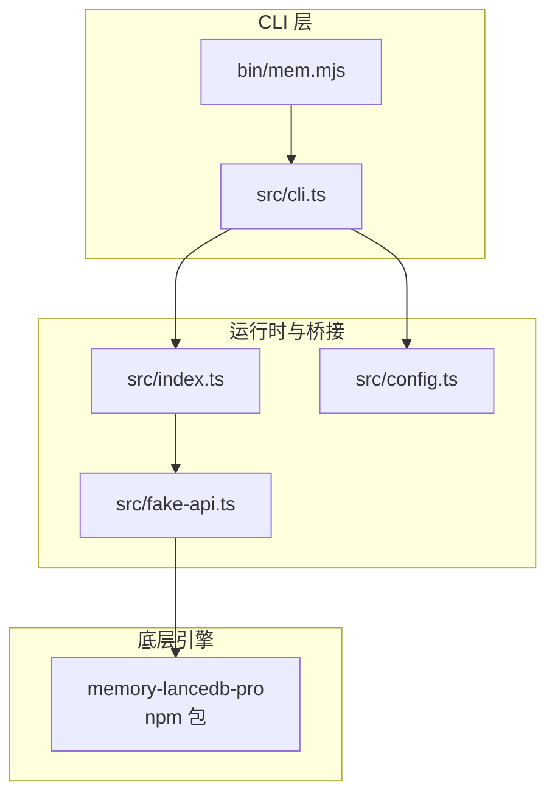
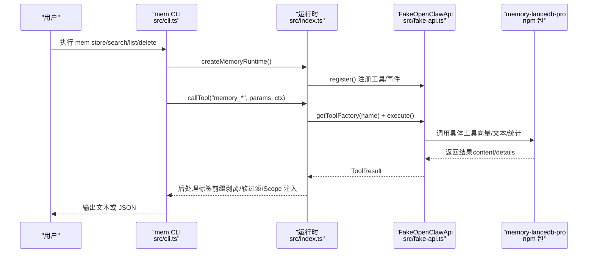
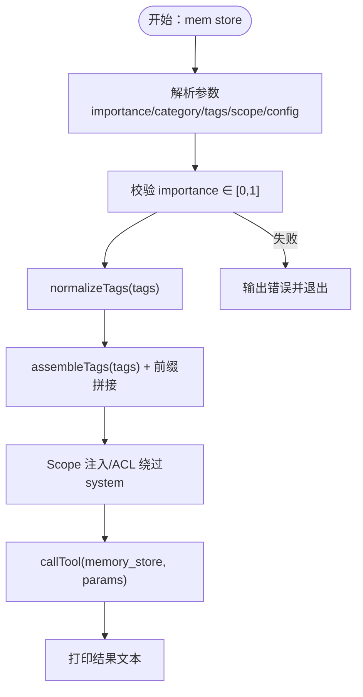
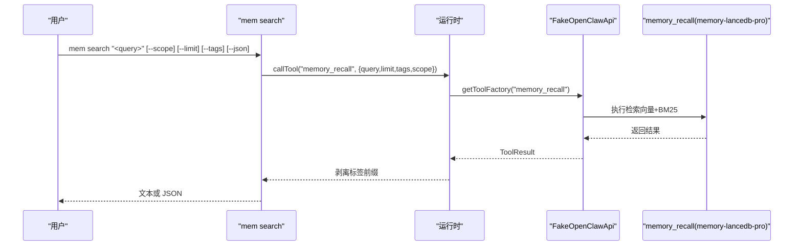
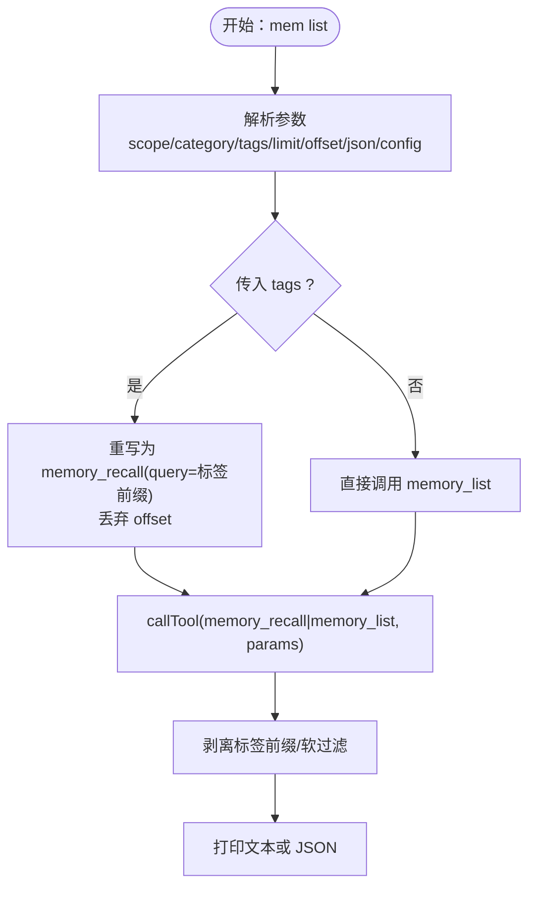
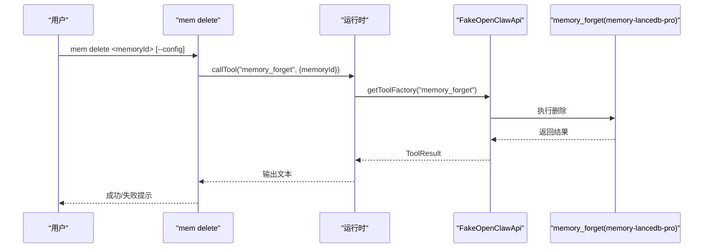
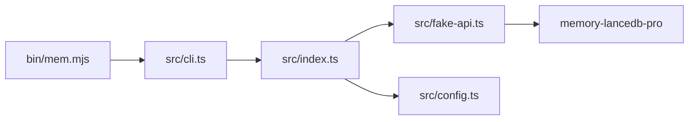

# 记忆管理命令

<cite>
**本文引用的文件**
- [bin/mem.mjs](file://bin/mem.mjs)
- [src/cli.ts](file://src/cli.ts)
- [src/index.ts](file://src/index.ts)
- [src/config.ts](file://src/config.ts)
- [src/fake-api.ts](file://src/fake-api.ts)
- [README.md](file://README.md)
- [docs/USAGE_GUIDE.md](file://docs/USAGE_GUIDE.md)
- [package.json](file://package.json)
- [test/integration.test.mjs](file://test/integration.test.mjs)
</cite>

## 目录
1. [简介](#简介)
2. [项目结构](#项目结构)
3. [核心组件](#核心组件)
4. [架构总览](#架构总览)
5. [详细组件分析](#详细组件分析)
6. [依赖分析](#依赖分析)
7. [性能考虑](#性能考虑)
8. [故障排除指南](#故障排除指南)
9. [结论](#结论)
10. [附录](#附录)

## 简介
本文件为“记忆管理命令”的完整参考文档，聚焦于 mem CLI 的四大核心命令：store、search、list、delete。文档详细说明各命令的参数、行为、最佳实践与输出格式，并解释这些命令如何与底层 memory-lancedb-pro 引擎交互，包括标签系统、Scope 隔离、混合检索（向量+BM25）与生命周期桥接等关键机制。

## 项目结构
- CLI 入口：bin/mem.mjs 将用户调用转发至 dist/cli.js（构建产物）。
- CLI 实现：src/cli.ts 定义 mem serve、mem store、mem search、mem list、mem delete、mem stats、mem scope、mem config、mem doctor 等命令。
- 运行时与插件桥接：src/index.ts 提供 createMemoryRuntime，负责加载 memory-lancedb-pro 插件并通过 FakeOpenClawApi 暴露工具与事件。
- 配置系统：src/config.ts 负责解析 YAML 配置、环境变量展开与默认值。
- 假运行时：src/fake-api.ts 模拟 OpenClaw 插件运行时接口，注册工具、事件与钩子，供 CLI/MCP 使用。
- 文档与示例：README.md 与 docs/USAGE_GUIDE.md 提供命令参考、最佳实践与使用手册。

图表来源
- [bin/mem.mjs:1-8](file://bin/mem.mjs#L1-L8)
- [src/cli.ts:105-617](file://src/cli.ts#L105-L617)
- [src/index.ts:154-184](file://src/index.ts#L154-L184)
- [src/config.ts:107-214](file://src/config.ts#L107-L214)
- [src/fake-api.ts:57-318](file://src/fake-api.ts#L57-L318)

章节来源
- [bin/mem.mjs:1-8](file://bin/mem.mjs#L1-L8)
- [src/cli.ts:105-617](file://src/cli.ts#L105-L617)
- [src/index.ts:154-184](file://src/index.ts#L154-L184)
- [src/config.ts:107-214](file://src/config.ts#L107-L214)
- [src/fake-api.ts:57-318](file://src/fake-api.ts#L57-L318)

## 核心组件
- mem store：将记忆写入底层数据库，支持 importance、category、tags、scope 等参数。
- mem search：混合检索（向量+BM25），支持 scope、limit、tags、--json。
- mem list：列出最近记忆，支持 scope、category、tags、limit、offset、--json。
- mem delete：按 ID 删除记忆。
- 运行时与插件桥接：createMemoryRuntime 负责加载 memory-lancedb-pro 插件，注入 FakeOpenClawApi，统一处理标签前缀、Scope 注入与 ACL 绕过、软过滤与前缀剥离等逻辑。
- 配置系统：支持 YAML 配置、环境变量扩展、默认路径与初始化。

章节来源
- [src/cli.ts:171-364](file://src/cli.ts#L171-L364)
- [src/index.ts:190-498](file://src/index.ts#L190-L498)
- [src/config.ts:107-214](file://src/config.ts#L107-L214)

## 架构总览
mem CLI 通过 createMemoryRuntime 创建运行时，将命令参数标准化后，调用 memory-lancedb-pro 的工具（memory_store、memory_recall、memory_list、memory_forget、memory_stats 等）。标签系统通过“【标签:x,y】”前缀嵌入 text 字段，检索时 BM25 命中前缀，最终在 CLI 层剥离前缀并输出。

图表来源
- [src/cli.ts:171-364](file://src/cli.ts#L171-L364)
- [src/index.ts:248-453](file://src/index.ts#L248-L453)
- [src/fake-api.ts:217-235](file://src/fake-api.ts#L217-L235)
- [src/index.ts:154-184](file://src/index.ts#L154-L184)

## 详细组件分析

### mem store 命令
- 目标：存储一条记忆，支持 importance、category、tags、scope。
- 参数与行为
  - --importance n：0-1，默认 0.7。用于影响检索权重与衰减。
  - --category cat：预定义分类（preference/fact/decision/entity/other）。
  - --tags tags：逗号分隔标签，自动转换为“【标签:x,y】”前缀嵌入 text。
  - --scope scope：目标 scope；跨 scope 模式下未指定时注入默认 scope（如 global）。
  - --config path：指定配置文件路径。
- 标签处理
  - normalizeTags 校验标签合法性，非法字符会抛错。
  - 对 memory_store：将组装后的前缀拼接到 text 前。
  - 对 memory_recall：将前缀拼接到 query 前，便于 BM25 命中。
  - 对 memory_list：当传入 tags 时，重写为 memory_recall(query=前缀)，并丢弃 offset（recall 不支持）。
- 输出
  - 返回工具执行结果（文本片段），CLI 逐条打印。
- 最佳实践
  - 为每条记忆提供清晰的实体名+技术术语，提高召回质量。
  - importance 建议结合内容长度与重要性设定。
  - 使用 tags 精细化分类，便于后续检索过滤。

图表来源
- [src/cli.ts:309-343](file://src/cli.ts#L309-L343)
- [src/index.ts:313-386](file://src/index.ts#L313-L386)
- [src/index.ts:54-59](file://src/index.ts#L54-L59)

章节来源
- [src/cli.ts:309-343](file://src/cli.ts#L309-L343)
- [src/index.ts:313-386](file://src/index.ts#L313-L386)
- [src/index.ts:54-59](file://src/index.ts#L54-L59)
- [README.md:314-331](file://README.md#L314-L331)
- [docs/USAGE_GUIDE.md:69-88](file://docs/USAGE_GUIDE.md#L69-L88)

### mem search 命令
- 目标：混合检索（向量+BM25），返回相关记忆。
- 参数与行为
  - <query>：检索关键词。
  - --scope scope：限定检索范围。
  - --limit n：最大结果数，默认 5，最大 20。
  - --tags tags：逗号分隔标签，作为 BM25 前缀参与检索。
  - --json：输出 JSON 格式。
  - --config path：指定配置文件路径。
- 标签与过滤
  - 传入 tags 时，通过 assembleTags(prefix) 拼接到 query 前，利用 BM25 精确命中标签前缀。
  - 结果展示时剥离“【标签:...】”前缀。
- 输出
  - 默认逐条打印文本；--json 输出完整 JSON。

图表来源
- [src/cli.ts:238-273](file://src/cli.ts#L238-L273)
- [src/index.ts:313-386](file://src/index.ts#L313-L386)
- [src/fake-api.ts:217-235](file://src/fake-api.ts#L217-L235)

章节来源
- [src/cli.ts:238-273](file://src/cli.ts#L238-L273)
- [src/index.ts:313-386](file://src/index.ts#L313-L386)
- [README.md:332-349](file://README.md#L332-L349)
- [docs/USAGE_GUIDE.md:89-105](file://docs/USAGE_GUIDE.md#L89-L105)

### mem list 命令
- 目标：列出最近记忆，支持分页、过滤与 JSON 输出。
- 参数与行为
  - --scope scope：scope 过滤。
  - --category cat：category 过滤。
  - --tags tags：逗号分隔标签，作为软过滤（BM25 加权）。
  - --limit n：最大条数，默认 10，最大 50。
  - --offset n：分页偏移，默认 0。
  - --json：输出 JSON 格式。
  - --config path：指定配置文件路径。
- 标签与分页
  - 当传入 tags 时，运行时将 memory_list 重写为 memory_recall（query=前缀），并丢弃 offset（recall 不支持）。
  - 结果展示时剥离“【标签:...】”前缀。
- 输出
  - 默认逐条打印文本；--json 输出完整 JSON。

图表来源
- [src/cli.ts:175-232](file://src/cli.ts#L175-L232)
- [src/index.ts:313-386](file://src/index.ts#L313-L386)

章节来源
- [src/cli.ts:175-232](file://src/cli.ts#L175-L232)
- [src/index.ts:313-386](file://src/index.ts#L313-L386)
- [README.md:351-370](file://README.md#L351-L370)
- [docs/USAGE_GUIDE.md:106-125](file://docs/USAGE_GUIDE.md#L106-L125)

### mem delete 命令
- 目标：按 ID 删除记忆。
- 参数与行为
  - <id>：记忆 ID（支持 8+ 位前缀）。
  - --config path：指定配置文件路径。
- 输出
  - 返回工具执行结果（文本片段），CLI 逐条打印。

图表来源
- [src/cli.ts:349-364](file://src/cli.ts#L349-L364)
- [src/fake-api.ts:217-235](file://src/fake-api.ts#L217-L235)

章节来源
- [src/cli.ts:349-364](file://src/cli.ts#L349-L364)
- [README.md:383-389](file://README.md#L383-L389)
- [docs/USAGE_GUIDE.md:134-139](file://docs/USAGE_GUIDE.md#L134-L139)

### 标签系统与 Scope 隔离
- 标签系统
  - 存储时：将 tags 转换为“【标签:x,y】”前缀并拼接到 text/query。
  - 检索时：BM25 命中前缀，实现软过滤（加权而非硬排除）。
  - 展示时：剥离前缀，保证输出整洁。
  - 校验：normalizeTags 严格校验字符集，非法字符直接报错。
- Scope 隔离
  - 跨 scope 模式：可读写任意 scope；memory_store 不指定 scope 时注入默认 scope（如 global）。
  - 锁定 scope 模式：--scope X，所有操作强制在 X 内；请求其他 scope 会被拒绝。
  - ACL 绕过：使用 agentId="system" 绕过 ACL 检查，确保写入与访问符合预期。

章节来源
- [src/index.ts:313-450](file://src/index.ts#L313-L450)
- [src/index.ts:42-52](file://src/index.ts#L42-L52)
- [README.md:426-499](file://README.md#L426-L499)
- [docs/USAGE_GUIDE.md:392-421](file://docs/USAGE_GUIDE.md#L392-L421)

## 依赖分析
- CLI 与运行时
  - bin/mem.mjs 作为入口，加载 dist/cli.js。
  - src/cli.ts 定义命令与参数解析，调用 createMemoryRuntime。
- 运行时与插件
  - src/index.ts 通过 jiti 直接加载 memory-lancedb-pro，注册工具与事件。
  - src/fake-api.ts 提供工具工厂、事件与钩子注册，供运行时调用。
- 配置
  - src/config.ts 解析 YAML，支持环境变量展开与默认路径。

图表来源
- [bin/mem.mjs:1-8](file://bin/mem.mjs#L1-L8)
- [src/cli.ts:105-617](file://src/cli.ts#L105-L617)
- [src/index.ts:154-184](file://src/index.ts#L154-L184)
- [src/config.ts:107-214](file://src/config.ts#L107-L214)
- [src/fake-api.ts:57-318](file://src/fake-api.ts#L57-L318)

章节来源
- [package.json:26-31](file://package.json#L26-L31)
- [src/index.ts:154-184](file://src/index.ts#L154-L184)

## 性能考虑
- 检索效率
  - 混合检索（向量+BM25）在召回质量与速度间取得平衡；合理设置 limit，避免过多结果导致解析开销。
  - 使用“实体名+技术术语”构造 query，减少跨句式语义匹配的衰减。
- 标签过滤
  - tags 为软过滤，BM25 加权；如需硬过滤，建议配合 category 或在存储时更明确地组织内容。
- 分页与批量
  - list 支持 offset/limit；当传入 tags 时会重写为 recall，offset 会被丢弃，需在上层控制分页策略。
- 内容长度
  - 记忆内容建议 100+ 字，提升语义召回稳定性。

[本节为通用指导，无需特定文件来源]

## 故障排除指南
- 配置问题
  - 使用 mem config validate 检查配置文件；确认 embedding.apiKey、model、dimensions 等字段。
  - 使用 mem doctor 运行健康检查，验证配置、API Key、插件加载与工具列表。
- API Key 与环境变量
  - 支持 ${ENV_VAR} 语法；若环境变量未设置，doctor 会提示缺失。
- Scope 权限
  - 锁定 scope 模式下，请求的 scope 必须与服务端一致，否则返回“Scope mismatch”。
  - 跨 scope 模式下，memory_store 不指定 scope 会自动写入默认 scope（如 global）。
- 标签校验
  - normalizeTags 对非法字符直接报错；确保标签不含保留字符“【】”，且仅包含允许字符。
- 构建与重启
  - 修改源码后需重新编译（tsc），并重启 MCP 服务；CLI 可直接 node bin/mem.mjs 测试即时生效。

章节来源
- [src/cli.ts:449-517](file://src/cli.ts#L449-L517)
- [src/config.ts:167-214](file://src/config.ts#L167-L214)
- [docs/USAGE_GUIDE.md:618-667](file://docs/USAGE_GUIDE.md#L618-L667)

## 结论
mem CLI 通过统一的运行时与插件桥接，将 memory-lancedb-pro 的强大能力暴露为直观的命令行工具。store/search/list/delete 四大命令覆盖了记忆管理的完整生命周期，结合标签系统与 Scope 隔离，既能满足多项目并行需求，又能提供高质量的混合检索体验。遵循本文的最佳实践与故障排除建议，可稳定高效地使用该工具链。

[本节为总结，无需特定文件来源]

## 附录

### 命令速查与示例路径
- mem store
  - 语法与参数：[README.md:314-331](file://README.md#L314-L331)
  - 使用示例：[docs/USAGE_GUIDE.md:71-78](file://docs/USAGE_GUIDE.md#L71-L78)
- mem search
  - 语法与参数：[README.md:332-349](file://README.md#L332-L349)
  - 使用示例：[docs/USAGE_GUIDE.md:92-95](file://docs/USAGE_GUIDE.md#L92-L95)
- mem list
  - 语法与参数：[README.md:351-370](file://README.md#L351-L370)
  - 使用示例：[docs/USAGE_GUIDE.md:108-114](file://docs/USAGE_GUIDE.md#L108-L114)
- mem delete
  - 语法与参数：[README.md:383-389](file://README.md#L383-L389)
  - 使用示例：[docs/USAGE_GUIDE.md:136-139](file://docs/USAGE_GUIDE.md#L136-L139)

### 与底层引擎交互要点
- 工具调用：通过 FakeOpenClawApi 的 callTool 统一调度 memory_recall/memory_store/memory_list/memory_forget/memory_stats 等工具。
- 标签前缀：在运行时层统一处理“【标签:x,y】”前缀的拼接、软过滤与剥离。
- Scope 注入：根据运行模式（跨 scope/锁定 scope）注入 scope 与 agentId（system 绕过 ACL）。

章节来源
- [src/fake-api.ts:217-235](file://src/fake-api.ts#L217-L235)
- [src/index.ts:313-450](file://src/index.ts#L313-L450)
- [README.md:22-46](file://README.md#L22-L46)