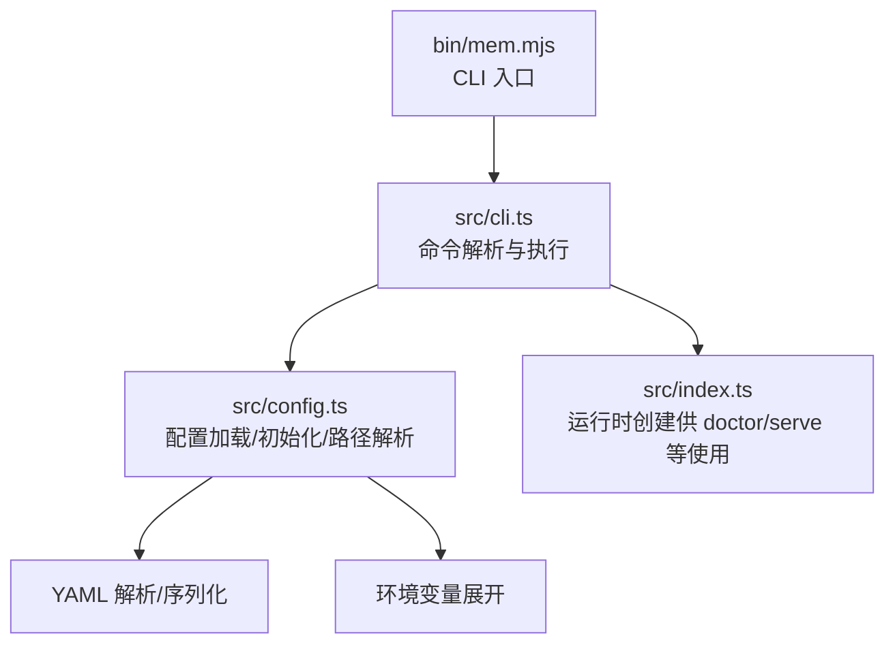
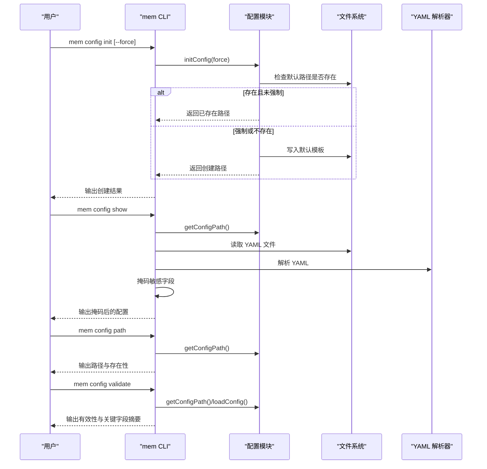
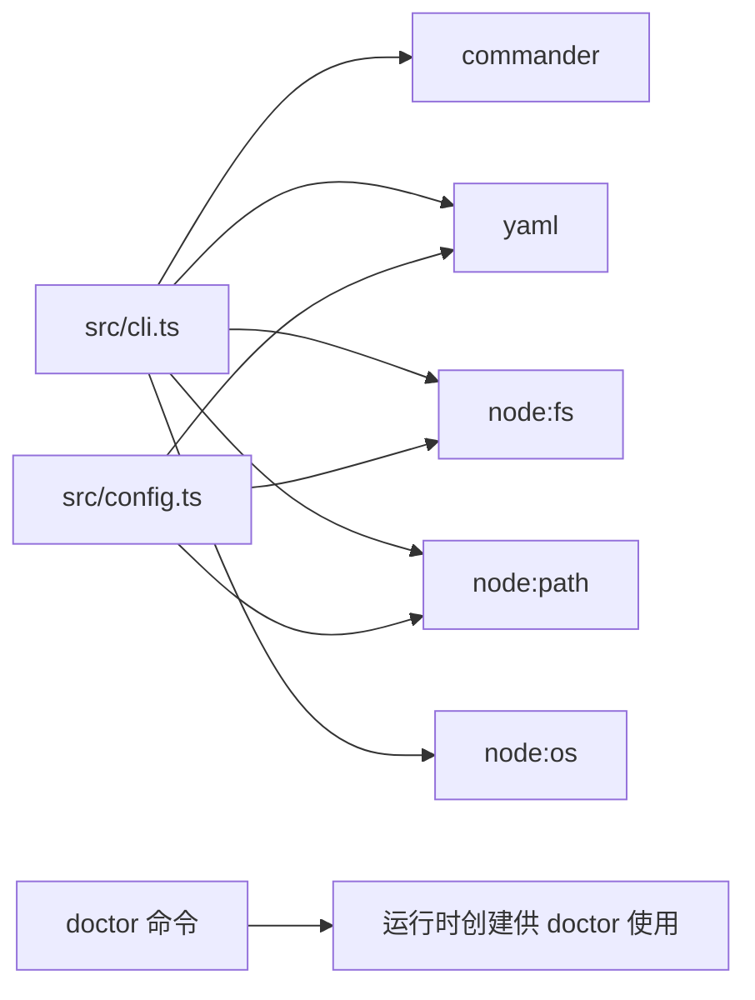

# 配置管理命令

<cite>
**本文引用的文件**
- [cli.ts](file://src/cli.ts)
- [config.ts](file://src/config.ts)
- [mem.mjs](file://bin/mem.mjs)
- [package.json](file://package.json)
- [README.md](file://README.md)
- [USAGE_GUIDE.md](file://docs/USAGE_GUIDE.md)
- [integration.test.mjs](file://test/integration.test.mjs)
</cite>

## 目录
1. [简介](#简介)
2. [项目结构](#项目结构)
3. [核心组件](#核心组件)
4. [架构总览](#架构总览)
5. [详细组件分析](#详细组件分析)
6. [依赖分析](#依赖分析)
7. [性能考虑](#性能考虑)
8. [故障排除指南](#故障排除指南)
9. [结论](#结论)
10. [附录](#附录)

## 简介
本文档聚焦于配置管理命令，系统性说明以下四个命令的行为与用法：
- mem config init：创建默认配置文件，支持 --force 覆盖现有配置
- mem config show：显示当前配置，并对敏感信息进行掩码处理
- mem config path：显示配置文件路径
- mem config validate：验证配置文件的有效性

同时，文档提供配置文件的完整结构说明（嵌入模型、数据库路径、智能提取、自动捕获与召回等），并给出最佳实践与常见示例，帮助用户快速上手并稳定运行。

## 项目结构
配置管理相关代码集中在 CLI 与配置模块中，入口脚本负责解析命令并调用相应逻辑。

图表来源
- [mem.mjs:1-8](file://bin/mem.mjs#L1-L8)
- [cli.ts:105-444](file://src/cli.ts#L105-L444)
- [config.ts:107-214](file://src/config.ts#L107-L214)

章节来源
- [package.json:7-9](file://package.json#L7-L9)
- [cli.ts:105-444](file://src/cli.ts#L105-L444)
- [config.ts:107-214](file://src/config.ts#L107-L214)

## 核心组件
- 配置命令组：mem config init/show/path/validate
- 配置加载与初始化：路径解析、YAML 解析、环境变量展开、默认模板
- 敏感信息掩码：递归识别 apiKey/secret/password 等字段并进行掩码
- 健康检查 doctor：联动配置验证，辅助定位问题

章节来源
- [cli.ts:370-444](file://src/cli.ts#L370-L444)
- [config.ts:107-311](file://src/config.ts#L107-L311)
- [cli.ts:68-103](file://src/cli.ts#L68-L103)

## 架构总览
配置管理命令的调用链如下：

图表来源
- [cli.ts:374-443](file://src/cli.ts#L374-L443)
- [config.ts:107-214](file://src/config.ts#L107-L214)

## 详细组件分析

### mem config init：创建默认配置
- 功能要点
  - 默认路径：用户主目录下的 ~/.config/memory-mcp/config.yaml
  - 若文件已存在，默认不覆盖；可通过 --force 覆盖
  - 创建时设置文件权限为仅所有者可读写
  - 写入默认模板，包含嵌入模型、数据库路径、自动捕获/召回、智能提取等基础配置
- 关键实现
  - 路径解析与目录创建
  - 模板写入
  - 强制覆盖判断
- 使用建议
  - 首次使用前务必执行
  - 修改 API Key 与模型参数后再启动服务

章节来源
- [cli.ts:374-392](file://src/cli.ts#L374-L392)
- [config.ts:296-311](file://src/config.ts#L296-L311)
- [config.ts:229-290](file://src/config.ts#L229-L290)

### mem config show：显示当前配置（含敏感信息掩码）
- 功能要点
  - 读取当前配置文件并解析为结构化对象
  - 递归遍历对象，识别 apiKey/secret/password 等敏感字段
  - 对字符串类型进行“前4后4”或“****”掩码；数组中的字符串逐项掩码
  - 保留环境变量占位符（如 ${OPENAI_API_KEY}）原样输出
  - 以 YAML 格式输出掩码后的配置
- 敏感信息掩码规则
  - 以大小写不敏感的正则匹配字段名后缀：apiKey、secret、password
  - 若值为字符串且以 ${ 开头，则视为环境变量引用，保留原样
  - 若字符串长度大于 8，掩码中间部分；否则显示 “****”
  - 数组中的字符串按相同规则掩码
- 使用建议
  - 将输出结果用于文档或分享时，无需担心泄露真实密钥
  - 若需查看原始密钥，请直接打开配置文件

章节来源
- [cli.ts:394-415](file://src/cli.ts#L394-L415)
- [cli.ts:68-103](file://src/cli.ts#L68-L103)
- [config.ts:135-157](file://src/config.ts#L135-L157)

### mem config path：显示配置文件路径
- 功能要点
  - 解析当前配置文件路径（优先级：环境变量 > 默认路径 > 当前目录）
  - 输出路径与存在性标注
- 优先级说明
  - 环境变量 MEM_CONFIG_PATH
  - 默认路径 ~/.config/memory-mcp/config.yaml
  - 当前目录 config.yaml
- 使用建议
  - 用于定位配置文件位置，便于手动编辑或迁移

章节来源
- [cli.ts:417-424](file://src/cli.ts#L417-L424)
- [config.ts:107-121](file://src/config.ts#L107-L121)

### mem config validate：验证配置文件有效性
- 功能要点
  - 获取配置路径并加载配置
  - 输出有效性与关键字段摘要（嵌入模型、数据库路径、智能提取、自动捕获、自动召回等）
- 校验逻辑
  - 路径存在性检查
  - YAML 解析成功
  - 嵌入配置 section 存在且包含 apiKey
  - 可选：环境变量覆盖（如 MEM_DB_PATH）
- 使用建议
  - 启动服务前先执行，确保配置正确
  - doctor 命令会进一步检查 API Key 是否可用

章节来源
- [cli.ts:426-443](file://src/cli.ts#L426-L443)
- [config.ts:167-214](file://src/config.ts#L167-L214)

### 配置文件结构说明
配置文件采用 YAML 格式，顶层字段与嵌套结构如下（节选）：
- dbPath：数据库存储路径（支持 ~ 展开）
- embedding：嵌入模型配置
  - provider：供应商（可选）
  - apiKey：API 密钥（必填，支持环境变量占位）
  - model：模型名称
  - baseURL：API 地址
  - dimensions/requestDimensions/omitDimensions：维度相关配置
  - taskQuery/taskPassage/normalized/chunking：任务与预处理
- llm：LLM 配置（可选，用于智能提取等）
  - auth/apiKey/model/baseURL/timeoutMs
- autoCapture/autoRecall/autoRecallMinLength/autoRecallMaxItems/autoRecallMaxChars/autoRecallTimeoutMs/captureAssistant：自动捕获与召回控制
- smartExtraction：智能提取开关与最小消息数、最大字符数等
- enableManagementTools：是否启用管理工具
- sessionStrategy：会话策略（MCP 模式推荐 none）
- retrieval：检索配置
  - mode/vectorWeight/bm25Weight/minScore/hardMinScore
  - rerank/rerankProvider/rerankModel/rerankEndpoint/rerankApiKey/rerankTimeoutMs
  - candidatePoolSize/recencyHalfLifeDays/recencyWeight/filterNoise/lengthNormAnchor/timeDecayHalfLifeDays/reinforcementFactor/maxHalfLifeMultiplier
- scopes：作用域隔离
  - default：默认作用域
  - definitions：作用域定义
  - agentAccess：代理访问控制
- selfImprovement：自我改进治理
  - enabled/beforeResetNote/skipSubagentBootstrap/ensureLearningFiles
- 其他：decay/tier/memoryReflection/mdMirror/admissionControl/memoryCompaction/sessionCompression/extractionThrottle/workspaceBoundary 等（按需启用）

章节来源
- [config.ts:23-98](file://src/config.ts#L23-L98)
- [config.ts:229-290](file://src/config.ts#L229-L290)

### 配置文件最佳实践
- API Key 管理
  - 优先使用环境变量占位符（如 ${OPENAI_API_KEY}），避免将真实密钥写入仓库
  - doctor 命令会检查环境变量是否设置
- 模型与维度
  - 若模型自带维度信息，可省略 dimensions；否则需显式指定
  - 不同供应商的 baseURL 与模型名称需匹配
- 自动捕获与召回
  - MCP 模式下建议关闭 autoRecall，由 Agent 显式调用 memory_recall
  - autoCapture 用于在会话结束时自动提取关键信息
- 检索权重
  - hybrid 模式下合理分配 vectorWeight 与 bm25Weight
  - filterNoise/minScore/hardMinScore 控制召回质量
- 作用域隔离
  - 使用 scopes.default 与 scopes.definitions 管理默认与自定义作用域
  - 通过 --scope 参数实现多项目隔离

章节来源
- [README.md:675-714](file://README.md#L675-L714)
- [USAGE_GUIDE.md:140-155](file://docs/USAGE_GUIDE.md#L140-L155)

### 常见配置示例
- OpenAI 示例
  - embedding.apiKey: ${OPENAI_API_KEY}
  - embedding.model: text-embedding-3-small
  - embedding.baseURL: https://api.openai.com/v1
  - embedding.dimensions: 1536
- SiliconFlow 示例
  - embedding.apiKey: ${SILICONFLOW_API_KEY}
  - embedding.model: Qwen/Qwen3-Embedding-8B
  - embedding.baseURL: https://api.siliconflow.cn/v1
  - embedding.dimensions: 4096
- Ollama 本地示例
  - embedding.apiKey: ""（本地无需密钥）
  - embedding.model: nomic-embed-text
  - embedding.baseURL: http://localhost:11434
  - embedding.dimensions: 768

章节来源
- [README.md:100-125](file://README.md#L100-L125)

## 依赖分析
- CLI 依赖
  - commander：命令解析与参数处理
  - yaml：YAML 解析与序列化
  - node:fs/node:path/node:os：文件系统、路径与用户主目录
- 配置模块依赖
  - yaml：YAML 解析
  - node:fs/node:path：文件系统与路径
- 运行时集成
  - doctor 命令会创建运行时实例以验证工具注册情况

图表来源
- [package.json:26-31](file://package.json#L26-L31)
- [cli.ts:17-27](file://src/cli.ts#L17-L27)
- [config.ts:14-17](file://src/config.ts#L14-L17)

章节来源
- [package.json:26-31](file://package.json#L26-L31)
- [cli.ts:17-27](file://src/cli.ts#L17-L27)
- [config.ts:14-17](file://src/config.ts#L14-L17)

## 性能考虑
- 配置文件读取与解析
  - 仅在命令执行时读取一次，开销极小
- 掩码处理
  - 递归遍历对象，时间复杂度与配置层级与键数量线性相关
  - 对字符串掩码采用固定长度切片，常数时间
- 环境变量展开
  - 仅在 loadConfig 中进行，避免重复展开
- 建议
  - 配置文件不宜过大；如需复杂配置，拆分为多个文件并通过工具合并

## 故障排除指南
- 配置文件不存在
  - 现象：mem config show/path/validate 报错
  - 处理：执行 mem config init 创建默认配置
- YAML 解析失败
  - 现象：配置文件格式错误
  - 处理：修正 YAML 语法；使用 validate 命令先行检查
- 缺少嵌入 API Key
  - 现象：doctor 报告缺失或环境变量未设置
  - 处理：在配置中设置 embedding.apiKey，或导出对应环境变量
- 路径解析问题
  - 现象：路径不正确或不存在
  - 处理：使用 mem config path 查看路径；必要时设置 MEM_CONFIG_PATH
- 权限问题
  - 现象：无法写入或读取配置文件
  - 处理：检查文件权限与目录所有权

章节来源
- [cli.ts:394-415](file://src/cli.ts#L394-L415)
- [config.ts:167-214](file://src/config.ts#L167-L214)
- [README.md:618-666](file://README.md#L618-L666)

## 结论
配置管理命令提供了从创建、查看、定位到验证配置的完整闭环。通过默认模板、环境变量占位与敏感信息掩码，用户可以安全、高效地完成配置初始化与日常维护。结合最佳实践与常见示例，可在不同供应商与场景下快速落地。

## 附录
- 命令速查
  - mem config init [--force]
  - mem config show
  - mem config path
  - mem config validate
- 相关命令
  - mem doctor：综合健康检查（包含配置与工具注册）
  - mem serve：启动 MCP 服务（支持 --config 指定配置）

章节来源
- [cli.ts:449-517](file://src/cli.ts#L449-L517)
- [README.md:401-423](file://README.md#L401-L423)