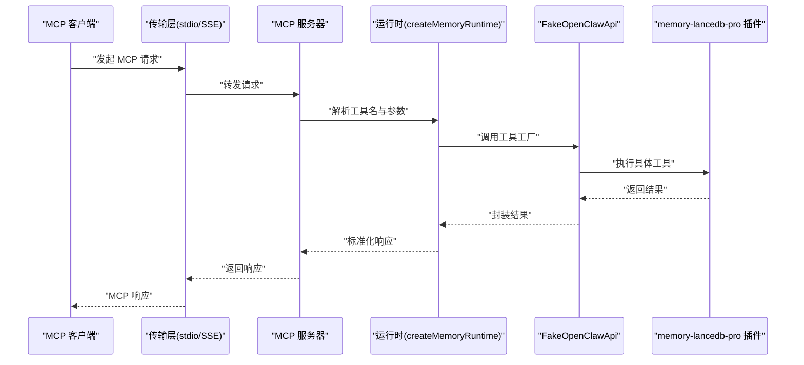
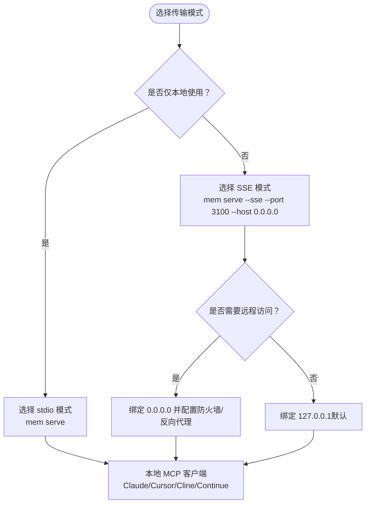
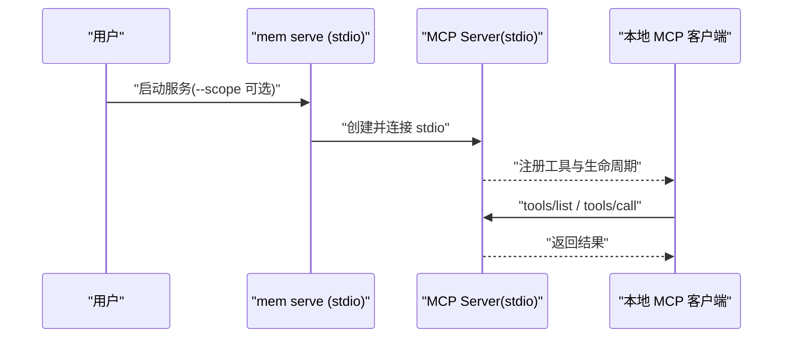
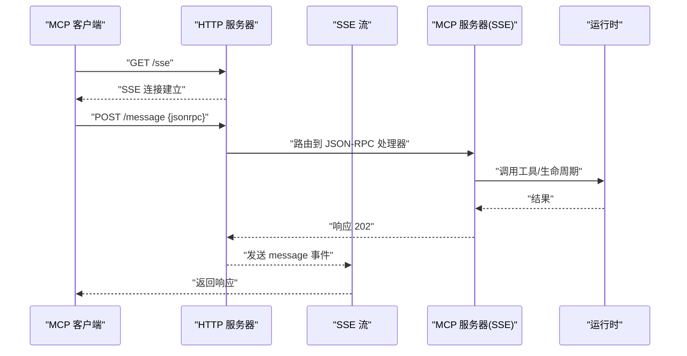
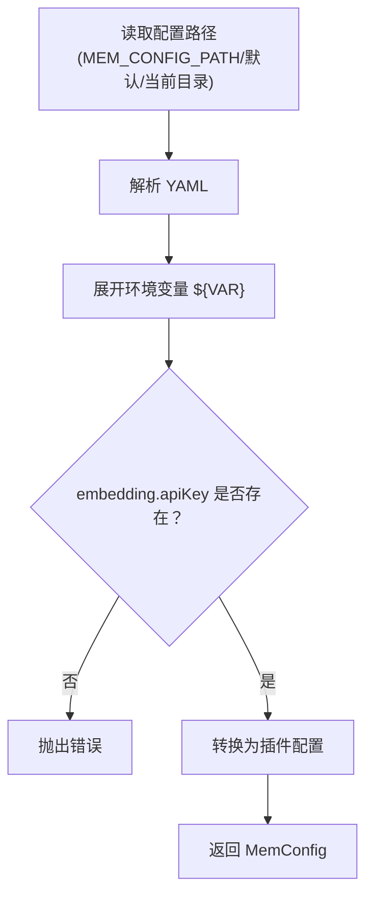
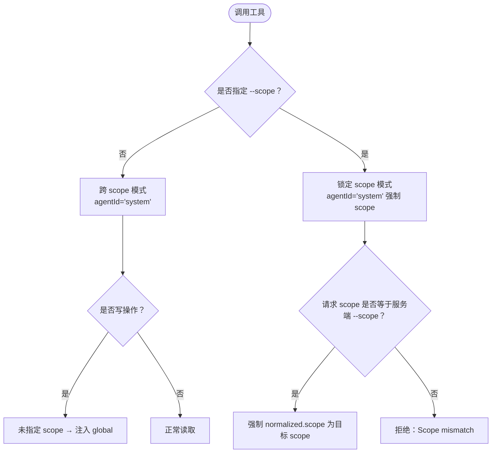
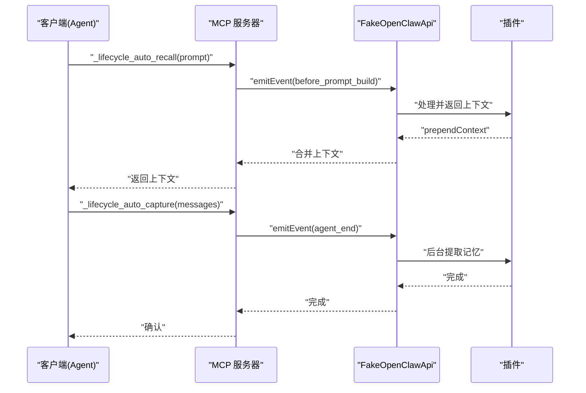
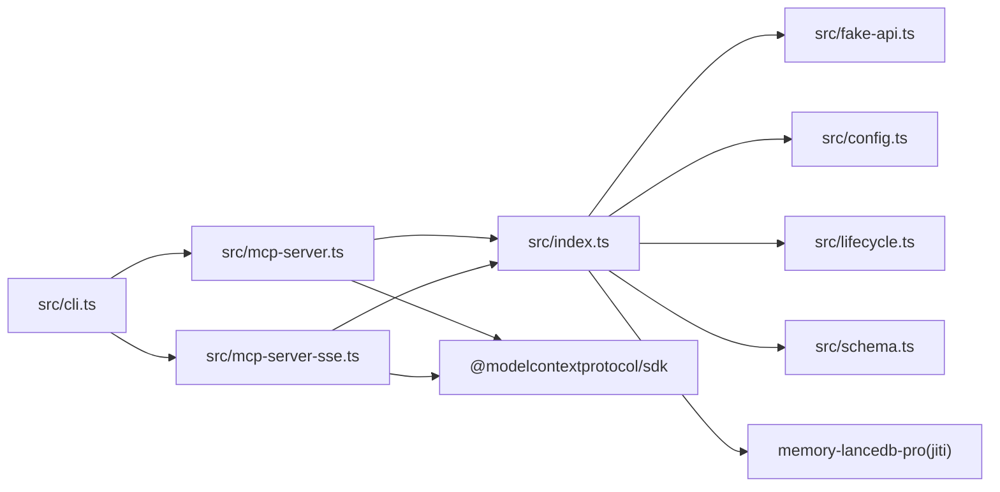

# MCP 服务器

<cite>
**本文引用的文件**
- [README.md](file://README.md)
- [docs/USAGE_GUIDE.md](file://docs/USAGE_GUIDE.md)
- [package.json](file://package.json)
- [bin/mem.mjs](file://bin/mem.mjs)
- [src/index.ts](file://src/index.ts)
- [src/cli.ts](file://src/cli.ts)
- [src/mcp-server.ts](file://src/mcp-server.ts)
- [src/mcp-server-sse.ts](file://src/mcp-server-sse.ts)
- [src/fake-api.ts](file://src/fake-api.ts)
- [src/config.ts](file://src/config.ts)
- [src/lifecycle.ts](file://src/lifecycle.ts)
- [src/schema.ts](file://src/schema.ts)
</cite>

## 目录
1. [简介](#简介)
2. [项目结构](#项目结构)
3. [核心组件](#核心组件)
4. [架构总览](#架构总览)
5. [详细组件分析](#详细组件分析)
6. [依赖分析](#依赖分析)
7. [性能考虑](#性能考虑)
8. [故障排除指南](#故障排除指南)
9. [结论](#结论)
10. [附录](#附录)

## 简介
本项目为 memory-lancedb-pro 的 MCP（Model Context Protocol）包装器，提供持久化长期记忆能力，支持两种传输模式：
- stdio 模式：默认模式，面向本地 MCP 客户端（Claude Desktop、Cursor、Cline、Continue 等）
- SSE 模式：HTTP 流式传输，支持远程访问与多客户端并发

项目通过 FakeOpenClawApi 适配器桥接上游插件，暴露 17 个记忆工具（recall、store、forget、update、stats、list、debug、promote、archive、compact、explain_rank、self-improvement 等），并提供生命周期钩子（自动召回、自动捕获、会话结束）。

## 项目结构
- bin/：CLI 可执行入口
- src/：核心源码
  - index.ts：运行时工厂、标签处理、scope 注入、工具封装
  - cli.ts：mem 命令行工具，包含 serve、list、search、stats、store、delete、config、doctor、scope 等命令
  - mcp-server.ts：stdio 模式 MCP 服务器
  - mcp-server-sse.ts：SSE 模式 MCP 服务器（HTTP + SSE）
  - fake-api.ts：FakeOpenClawApi 适配器，注册工具、事件、钩子、CLI
  - config.ts：配置加载、环境变量展开、默认模板初始化
  - lifecycle.ts：生命周期桥接（before_prompt_build、agent_end、session_end、message_received）
  - schema.ts：TypeBox → JSON Schema 转换器
- docs/：使用手册
- test/：集成测试
- package.json：依赖与脚本

```mermaid
graph TB
subgraph "CLI"
BIN["bin/mem.mjs"]
CLI["src/cli.ts"]
end
subgraph "运行时与适配"
IDX["src/index.ts"]
FAKE["src/fake-api.ts"]
CFG["src/config.ts"]
SCH["src/schema.ts"]
LIFE["src/lifecycle.ts"]
end
subgraph "传输层"
STDIO["src/mcp-server.ts"]
SSE["src/mcp-server-sse.ts"]
end
BIN --> CLI
CLI --> IDX
IDX --> FAKE
IDX --> LIFE
IDX --> CFG
IDX --> SCH
CLI --> STDIO
CLI --> SSE
STDIO --> FAKE
SSE --> FAKE
```

图表来源
- [bin/mem.mjs:1-8](file://bin/mem.mjs#L1-L8)
- [src/cli.ts:1-617](file://src/cli.ts#L1-L617)
- [src/index.ts:1-515](file://src/index.ts#L1-L515)
- [src/fake-api.ts:1-318](file://src/fake-api.ts#L1-L318)
- [src/config.ts:1-312](file://src/config.ts#L1-L312)
- [src/schema.ts:1-151](file://src/schema.ts#L1-L151)
- [src/lifecycle.ts:1-178](file://src/lifecycle.ts#L1-L178)
- [src/mcp-server.ts:1-306](file://src/mcp-server.ts#L1-L306)
- [src/mcp-server-sse.ts:1-405](file://src/mcp-server-sse.ts#L1-L405)

章节来源
- [README.md:1-738](file://README.md#L1-L738)
- [package.json:1-46](file://package.json#L1-L46)

## 核心组件
- 运行时工厂 createMemoryRuntime：加载配置、构建 FakeOpenClawApi、注册插件、注入标签与 scope、暴露工具调用、事件与钩子、CLI 实例
- FakeOpenClawApi：捕获工具工厂、事件处理器、钩子处理器、CLI 注册，统一调用入口
- 生命周期桥接：triggerAutoRecall、triggerAutoCapture、triggerSessionEnd、triggerMessageReceived
- 配置系统：YAML 加载、环境变量展开、默认模板初始化
- 传输层：stdio（StdioServerTransport）与 SSE（HTTP + SSE）

章节来源
- [src/index.ts:190-498](file://src/index.ts#L190-L498)
- [src/fake-api.ts:57-317](file://src/fake-api.ts#L57-L317)
- [src/lifecycle.ts:52-177](file://src/lifecycle.ts#L52-L177)
- [src/config.ts:167-223](file://src/config.ts#L167-L223)

## 架构总览
MCP 客户端通过 stdio 或 SSE 与服务器交互，服务器将请求映射到 FakeOpenClawApi 的工具工厂，最终调用 memory-lancedb-pro 插件完成存储、召回、统计等操作。生命周期钩子在 MCP 模式下由客户端显式触发。



图表来源
- [src/mcp-server.ts:86-124](file://src/mcp-server.ts#L86-L124)
- [src/mcp-server-sse.ts:263-287](file://src/mcp-server-sse.ts#L263-L287)
- [src/index.ts:248-453](file://src/index.ts#L248-L453)
- [src/fake-api.ts:217-235](file://src/fake-api.ts#L217-L235)

## 详细组件分析

### 传输模式对比与选择
- stdio 模式
  - 适用：本地 MCP 客户端（Claude Desktop、Cursor、Cline、Continue）
  - 特点：标准输入输出，无需网络，延迟低，适合单机使用
  - 启动：mem serve（默认）
- SSE 模式
  - 适用：远程访问、多客户端、Docker/WSL、跨网络场景
  - 特点：HTTP + SSE，支持 /sse、/message、/health 端点
  - 启动：mem serve --sse --port 3100 --host 0.0.0.0



图表来源
- [README.md:257-275](file://README.md#L257-L275)
- [src/mcp-server.ts:43-140](file://src/mcp-server.ts#L43-L140)
- [src/mcp-server-sse.ts:57-209](file://src/mcp-server-sse.ts#L57-L209)

章节来源
- [README.md:67-68](file://README.md#L67-L68)
- [README.md:257-275](file://README.md#L257-L275)
- [src/mcp-server.ts:43-140](file://src/mcp-server.ts#L43-L140)
- [src/mcp-server-sse.ts:57-209](file://src/mcp-server-sse.ts#L57-L209)

### stdio 模式（本地客户端集成）
- 启动流程：CLI -> startMcpServer -> 创建 Server + StdioServerTransport -> 注册工具与生命周期 -> 连接 stdio
- 客户端配置要点：
  - Claude Desktop：编辑 claude_desktop_config.json，配置 command、args、env
  - Cursor：在 .cursor/mcp.json 中添加 mcpServers
  - Cline：在 VS Code 插件设置中添加 MCP Server
  - Continue：在 continue/config.json 中配置 mcpServers
- 项目隔离：通过 --scope 参数实现 per-project 隔离；args 中 scope 与值必须拆分为两个元素



图表来源
- [src/mcp-server.ts:43-140](file://src/mcp-server.ts#L43-L140)
- [README.md:173-237](file://README.md#L173-L237)

章节来源
- [README.md:173-237](file://README.md#L173-L237)
- [src/mcp-server.ts:43-140](file://src/mcp-server.ts#L43-L140)

### SSE 模式（HTTP 传输协议）
- 端点：
  - GET /sse：SSE 事件流，客户端连接
  - POST /message：JSON-RPC 消息入口
  - GET /health：健康检查
- 绑定与端口：默认监听 127.0.0.1:3100，可通过 --host 与 --port 配置
- 远程支持：建议在生产环境配合反向代理与鉴权
- 客户端配置：通过 url 指向 http://host:port/sse



图表来源
- [src/mcp-server-sse.ts:82-172](file://src/mcp-server-sse.ts#L82-L172)
- [src/mcp-server-sse.ts:292-330](file://src/mcp-server-sse.ts#L292-L330)

章节来源
- [src/mcp-server-sse.ts:57-209](file://src/mcp-server-sse.ts#L57-L209)
- [README.md:257-275](file://README.md#L257-L275)

### 配置系统与环境变量
- 配置文件：默认位于 ~/.config/memory-mcp/config.yaml，支持 MEM_CONFIG_PATH 覆盖
- 环境变量展开：${VAR} 语法在 YAML 中被替换为进程环境变量
- 默认模板：initConfig 创建最小可用配置（dbPath、embedding、autoCapture、smartExtraction、retrieval、scopes 等）
- 配置验证：doctor 命令检查配置文件存在、解析、API Key、插件加载与工具列表



图表来源
- [src/config.ts:107-214](file://src/config.ts#L107-L214)
- [src/cli.ts:449-517](file://src/cli.ts#L449-L517)

章节来源
- [src/config.ts:167-223](file://src/config.ts#L167-L223)
- [src/cli.ts:370-443](file://src/cli.ts#L370-L443)

### 标签系统与 scope 隔离
- 标签（tags）：通过前缀“【标签:x,y】”嵌入 text，检索时 BM25 命中，展示时自动剥离
- scope 隔离：
  - 跨 scope 模式：默认，可读写任意 scope；store 不指定 scope 自动写入 global
  - 锁定 scope 模式：--scope X，所有操作强制在 X 内；请求其他 scope 拒绝
- 生命周期：在锁定模式下，使用 agentId="system" 绕过 ACL，确保写入 scope 与拒绝不一致 scope



图表来源
- [src/index.ts:337-385](file://src/index.ts#L337-L385)
- [src/mcp-server.ts:84-100](file://src/mcp-server.ts#L84-L100)
- [src/mcp-server-sse.ts:75-76](file://src/mcp-server-sse.ts#L75-L76)

章节来源
- [src/index.ts:313-450](file://src/index.ts#L313-L450)
- [README.md:426-498](file://README.md#L426-L498)

### 生命周期工具（MCP 模式）
- _lifecycle_auto_recall：在发送消息前自动召回相关记忆，返回上下文
- _lifecycle_auto_capture：在会话结束后自动提取记忆
- _lifecycle_session_end：会话结束清理
- 客户端需显式调用这些工具以获得自动记忆能力



图表来源
- [src/mcp-server.ts:235-305](file://src/mcp-server.ts#L235-L305)
- [src/mcp-server-sse.ts:378-404](file://src/mcp-server-sse.ts#L378-L404)
- [src/lifecycle.ts:52-177](file://src/lifecycle.ts#L52-L177)

章节来源
- [src/mcp-server.ts:154-305](file://src/mcp-server.ts#L154-L305)
- [src/mcp-server-sse.ts:336-404](file://src/mcp-server-sse.ts#L336-L404)
- [src/lifecycle.ts:52-177](file://src/lifecycle.ts#L52-L177)

### CLI 命令与工具参考
- mem serve：启动 stdio 或 SSE 服务器，支持 --scope、--dry-run、--sse、--port、--host、--quiet
- mem list/search/stats：跨 scope 模式下使用 agentId="system"，支持 tags 重写为 recall
- mem store/delete：支持 importance、category、tags、scope
- mem config：init/show/path/validate
- mem doctor：健康检查
- mem scope：list/delete（支持 --dry-run、--yes）

章节来源
- [src/cli.ts:114-169](file://src/cli.ts#L114-L169)
- [src/cli.ts:175-343](file://src/cli.ts#L175-L343)
- [src/cli.ts:370-443](file://src/cli.ts#L370-L443)
- [src/cli.ts:449-517](file://src/cli.ts#L449-L517)
- [src/cli.ts:527-610](file://src/cli.ts#L527-L610)

## 依赖分析
- 依赖关系
  - CLI 依赖 mcp-server 与 mcp-server-sse
  - 运行时依赖 FakeOpenClawApi、config、schema、lifecycle
  - 传输层依赖 @modelcontextprotocol/sdk（stdio 与 SSE）
  - 配置系统依赖 YAML 与 jiti（加载上游插件源码）
- 外部依赖
  - memory-lancedb-pro：核心插件（通过 jiti 直接加载）
  - yaml：配置解析
  - commander：CLI 参数解析
  - @modelcontextprotocol/sdk：MCP 协议实现



图表来源
- [src/cli.ts:18-27](file://src/cli.ts#L18-L27)
- [src/mcp-server.ts:8-13](file://src/mcp-server.ts#L8-L13)
- [src/mcp-server-sse.ts:11-23](file://src/mcp-server-sse.ts#L11-L23)
- [src/index.ts:9-12](file://src/index.ts#L9-L12)
- [package.json:26-31](file://package.json#L26-L31)

章节来源
- [package.json:26-31](file://package.json#L26-L31)
- [src/index.ts:159-184](file://src/index.ts#L159-L184)

## 性能考虑
- 模型与嵌入
  - 选择合适维度与模型，避免不必要的重嵌入
  - 智能提取与重排可提升召回质量，但增加计算开销
- 检索权重
  - 调整 vectorWeight 与 bm25Weight，平衡语义与关键词匹配
  - 合理设置 minScore 与 hardMinScore，减少噪声
- 标签与过滤
  - 标签采用 BM25 命中，软过滤；如需硬过滤，结合 category
- SSE 并发
  - SSE 为单连接模型，多客户端建议通过反向代理或多个实例
- 日志与调试
  - stdio 模式默认抑制调试日志，避免污染协议输出
  - SSE 模式可开启调试日志，注意控制台输出

[本节为通用指导，无需特定文件引用]

## 故障排除指南
- 服务启动失败
  - 使用 mem doctor 检查配置文件、解析、API Key、插件加载与工具列表
  - 确认配置文件存在且 embedding.apiKey 正确
- 嵌入模型错误
  - 检查 embedding.model、baseURL、dimensions
  - Ollama 本地需确认服务已启动
- 召回不准确
  - 优化 query 格式（实体名 + 技术术语）
  - 提升记忆内容长度与关键词唯一性
  - 使用 tags 缩小范围
- Scope 权限拒绝
  - 锁定模式下请求 scope 必须与 --scope 一致
  - 跨 scope 模式下 store 未指定 scope 将写入 global
- SSE 远程访问
  - 绑定 0.0.0.0 时需注意网络安全，建议配合反向代理与鉴权
  - /health 端点可用于探活

章节来源
- [src/cli.ts:449-517](file://src/cli.ts#L449-L517)
- [docs/USAGE_GUIDE.md:618-672](file://docs/USAGE_GUIDE.md#L618-L672)

## 结论
本项目通过 stdio 与 SSE 两种传输模式，为本地与远程场景提供 MCP 服务器能力。借助 FakeOpenClawApi 适配器与生命周期桥接，实现了与上游插件的无缝对接。通过 scope 隔离与标签系统，满足多项目、多客户端的长期记忆需求。建议根据使用场景选择合适模式，并结合配置与检索策略优化性能与召回质量。

[本节为总结，无需特定文件引用]

## 附录

### 客户端集成清单
- Claude Desktop
  - 配置文件：claude_desktop_config.json
  - 命令与参数：node /path/to/bin/mem.mjs serve [--scope project:xxx]
  - 环境变量：OPENAI_API_KEY 等
- Cursor
  - 配置文件：.cursor/mcp.json
  - mcpServers 中添加 memory 项
- Cline（VS Code）
  - 在 MCP Server 设置中添加命令与参数
- Continue
  - 在 continue/config.json 中配置 mcpServers

章节来源
- [README.md:173-237](file://README.md#L173-L237)

### CLI 参考（关键参数）
- mem serve
  - -c/--config：配置文件路径
  - -s/--scope：默认 scope
  - --dry-run：验证配置并列出工具
  - --sse：SSE 模式
  - -p/--port：SSE 端口（默认 3100）
  - --host：SSE 主机（默认 127.0.0.1）
  - -q/--quiet：抑制调试日志

章节来源
- [README.md:284-312](file://README.md#L284-L312)
- [src/cli.ts:114-169](file://src/cli.ts#L114-L169)

### 传输协议对比表
- stdio
  - 适用：本地 MCP 客户端
  - 端点：无（标准输入输出）
  - 绑定：无
  - 远程：不支持
  - 优点：低延迟、简单
  - 缺点：仅本地可用
- SSE
  - 适用：远程/多客户端
  - 端点：/sse、/message、/health
  - 绑定：--host 与 --port
  - 远程：支持
  - 优点：可远程访问
  - 缺点：需网络与安全配置

章节来源
- [README.md:67-68](file://README.md#L67-L68)
- [README.md:257-275](file://README.md#L257-L275)
- [src/mcp-server.ts:43-140](file://src/mcp-server.ts#L43-L140)
- [src/mcp-server-sse.ts:57-209](file://src/mcp-server-sse.ts#L57-L209)