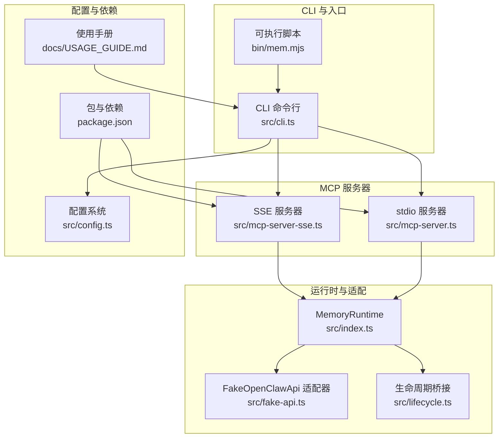
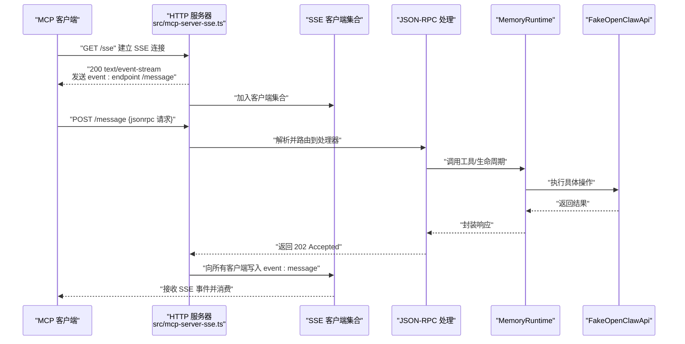
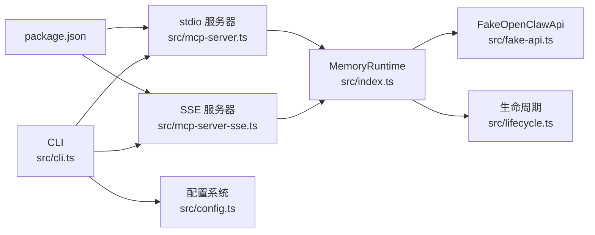
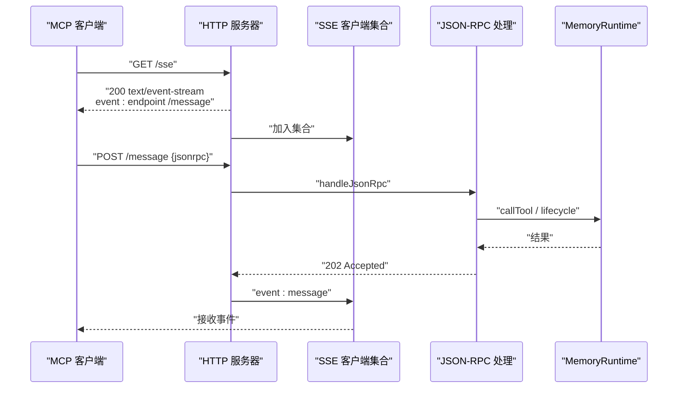

# SSE 模式

<cite>
**本文引用的文件**
- [src/mcp-server-sse.ts](file://src/mcp-server-sse.ts)
- [src/mcp-server.ts](file://src/mcp-server.ts)
- [src/index.ts](file://src/index.ts)
- [src/cli.ts](file://src/cli.ts)
- [src/config.ts](file://src/config.ts)
- [src/lifecycle.ts](file://src/lifecycle.ts)
- [src/fake-api.ts](file://src/fake-api.ts)
- [bin/mem.mjs](file://bin/mem.mjs)
- [package.json](file://package.json)
- [README.md](file://README.md)
- [docs/USAGE_GUIDE.md](file://docs/USAGE_GUIDE.md)
</cite>

## 目录
1. [简介](#简介)
2. [项目结构](#项目结构)
3. [核心组件](#核心组件)
4. [架构总览](#架构总览)
5. [详细组件分析](#详细组件分析)
6. [依赖分析](#依赖分析)
7. [性能考量](#性能考量)
8. [故障排查指南](#故障排查指南)
9. [结论](#结论)
10. [附录](#附录)

## 简介
本节面向希望在远程或多客户端场景下运行 MCP 服务器的用户，系统性阐述 SSE（Server-Sent Events）传输模式的技术原理、配置参数、客户端连接流程、安全考虑、与 stdio 模式的性能差异，以及部署与监控方法。SSE 模式通过 HTTP/1.1 的 Server-Sent Events 实现单向事件推送，结合 JSON-RPC 的消息通道，满足远端访问与多客户端并发连接的需求。

## 项目结构
该项目围绕“MCP 服务器包装器”组织，提供 stdio 与 SSE 两种传输模式，并通过统一的内存运行时（MemoryRuntime）暴露工具与生命周期钩子。SSE 模式的关键入口位于独立模块中，CLI 通过命令行参数选择传输模式。

图表来源
- [src/cli.ts:114-169](file://src/cli.ts#L114-L169)
- [src/mcp-server-sse.ts:57-209](file://src/mcp-server-sse.ts#L57-L209)
- [src/mcp-server.ts:43-140](file://src/mcp-server.ts#L43-L140)
- [src/index.ts:207-498](file://src/index.ts#L207-L498)
- [src/fake-api.ts:57-318](file://src/fake-api.ts#L57-L318)
- [src/lifecycle.ts:52-178](file://src/lifecycle.ts#L52-L178)
- [src/config.ts:167-214](file://src/config.ts#L167-L214)
- [bin/mem.mjs:1-8](file://bin/mem.mjs#L1-L8)
- [package.json:1-46](file://package.json#L1-L46)
- [docs/USAGE_GUIDE.md:47-51](file://docs/USAGE_GUIDE.md#L47-L51)

章节来源
- [src/cli.ts:114-169](file://src/cli.ts#L114-L169)
- [src/mcp-server-sse.ts:57-209](file://src/mcp-server-sse.ts#L57-L209)
- [src/mcp-server.ts:43-140](file://src/mcp-server.ts#L43-L140)
- [src/index.ts:207-498](file://src/index.ts#L207-L498)
- [src/fake-api.ts:57-318](file://src/fake-api.ts#L57-L318)
- [src/lifecycle.ts:52-178](file://src/lifecycle.ts#L52-L178)
- [src/config.ts:167-214](file://src/config.ts#L167-L214)
- [bin/mem.mjs:1-8](file://bin/mem.mjs#L1-L8)
- [package.json:1-46](file://package.json#L1-L46)
- [docs/USAGE_GUIDE.md:47-51](file://docs/USAGE_GUIDE.md#L47-L51)

## 核心组件
- SSE 服务器实现：提供 /sse（SSE 事件流）、/message（JSON-RPC 推送）、/health（健康检查）端点，支持 CORS，跟踪 SSE 客户端集合，将 JSON-RPC 响应通过 SSE 事件推送回客户端。
- stdio 服务器实现：通过标准输入输出与 MCP 客户端交互，适合本地桌面客户端。
- MemoryRuntime：统一的工具注册与调用入口，支持 scope 隔离、标签预处理、生命周期工具桥接。
- FakeOpenClawApi：适配 memory-lancedb-pro 的运行时接口，注册工具、事件与钩子，供 MCP 层调用。
- CLI：解析命令行参数，选择 SSE 或 stdio 模式，传递配置与运行选项。
- 配置系统：加载 YAML 配置，支持环境变量扩展，提供初始化与校验工具。

章节来源
- [src/mcp-server-sse.ts:57-209](file://src/mcp-server-sse.ts#L57-L209)
- [src/mcp-server.ts:43-140](file://src/mcp-server.ts#L43-L140)
- [src/index.ts:207-498](file://src/index.ts#L207-L498)
- [src/fake-api.ts:57-318](file://src/fake-api.ts#L57-L318)
- [src/cli.ts:114-169](file://src/cli.ts#L114-L169)
- [src/config.ts:167-214](file://src/config.ts#L167-L214)

## 架构总览
SSE 模式将 MCP 协议映射到 HTTP/1.1 的 SSE 与 JSON-RPC 之上，客户端通过 /sse 建立长连接，随后通过 /message 发送 JSON-RPC 请求，服务器在 SSE 事件流中推送响应。生命周期工具与工具调用逻辑与 stdio 模式共享，保证行为一致性。

图表来源
- [src/mcp-server-sse.ts:82-172](file://src/mcp-server-sse.ts#L82-L172)
- [src/mcp-server-sse.ts:292-330](file://src/mcp-server-sse.ts#L292-L330)
- [src/index.ts:244-498](file://src/index.ts#L244-L498)
- [src/fake-api.ts:217-235](file://src/fake-api.ts#L217-L235)

## 详细组件分析

### SSE 服务器实现与传输协议
- 端点与协议
  - /sse：建立 SSE 事件流，返回 Content-Type: text/event-stream，发送 event: endpoint 指示 /message 端点。
  - /message：接收 JSON-RPC 请求，解析后调用处理器，返回 202 Accepted，并通过 SSE 将响应事件推送给已连接客户端。
  - /health：返回健康状态，包含服务器名称、版本、工具数量等。
- CORS 支持：设置 Access-Control-Allow-* 头，支持 GET/POST/OPTIONS 方法。
- 客户端管理：维护 Set<ServerResponse>，在连接关闭或错误时清理。
- 传输特性：基于 Node.js http.Server，使用 keep-alive 与 no-cache 策略，符合 SSE 规范。

章节来源
- [src/mcp-server-sse.ts:57-209](file://src/mcp-server-sse.ts#L57-L209)
- [src/mcp-server-sse.ts:82-172](file://src/mcp-server-sse.ts#L82-L172)

### JSON-RPC 处理器与生命周期工具
- 初始化与工具清单：initialize 返回协议版本、能力与服务器信息；tools/list 返回工具定义与生命周期工具。
- 工具调用：tools/call 支持常规工具与生命周期工具（自动召回、自动捕获、会话结束）。
- 生命周期工具：
  - _lifecycle_auto_recall：在提示构建前注入上下文。
  - _lifecycle_auto_capture：在会话结束后提取关键信息。
  - _lifecycle_session_end：清理与收尾。
- 错误处理：对未知方法返回 -32601，解析错误返回 -32700，运行时异常返回 -32603。

章节来源
- [src/mcp-server-sse.ts:231-290](file://src/mcp-server-sse.ts#L231-L290)
- [src/mcp-server-sse.ts:292-330](file://src/mcp-server-sse.ts#L292-L330)
- [src/lifecycle.ts:52-178](file://src/lifecycle.ts#L52-L178)

### MemoryRuntime 与工具调用
- 工具工厂注册：通过 FakeOpenClawApi 注册 14 个核心工具，MCP 层通过 getAllToolDefinitions 获取。
- 标签系统：对 memory_store/memory_recall/memory_list 的标签进行预处理与后处理，自动注入/剥离标签前缀。
- Scope 隔离：支持跨 scope 模式与锁定 scope 模式，通过 agentId 与 ACL 控制访问。
- 生命周期桥接：将 OpenClaw 的 before_prompt_build、agent_end、session_end 映射为 MCP 工具。

章节来源
- [src/index.ts:244-498](file://src/index.ts#L244-L498)
- [src/fake-api.ts:113-263](file://src/fake-api.ts#L113-L263)
- [src/lifecycle.ts:52-178](file://src/lifecycle.ts#L52-L178)

### CLI 与配置
- CLI 选择传输模式：--sse 切换到 SSE，--port/--host 配置端口与绑定地址。
- 配置加载：支持 MEM_CONFIG_PATH 环境变量、用户主目录默认路径与当前目录回退。
- 环境变量扩展：配置中的 ${VAR} 会被进程环境变量替换。

章节来源
- [src/cli.ts:114-169](file://src/cli.ts#L114-L169)
- [src/config.ts:107-214](file://src/config.ts#L107-L214)

### stdio 模式对比
- 传输介质：stdio（标准输入/输出），适合本地桌面客户端（Claude Desktop、Cursor、Cline）。
- 连接模型：单进程内通信，无需网络栈。
- 适用场景：本地开发与集成，无需网络暴露。

章节来源
- [src/mcp-server.ts:43-140](file://src/mcp-server.ts#L43-L140)
- [README.md:67-68](file://README.md#L67-L68)

## 依赖分析
- 外部依赖
  - @modelcontextprotocol/sdk：提供 MCP 协议与传输抽象。
  - memory-lancedb-pro：核心记忆引擎，通过 jiti 直接加载源码。
  - yaml：配置文件解析。
  - commander：CLI 参数解析。
- 内部模块耦合
  - CLI 依赖 SSE/stdio 启动函数与配置系统。
  - SSE/stdio 依赖 MemoryRuntime 与 FakeOpenClawApi。
  - MemoryRuntime 依赖 FakeOpenClawApi 与生命周期模块。

图表来源
- [src/cli.ts:114-169](file://src/cli.ts#L114-L169)
- [src/mcp-server-sse.ts:57-209](file://src/mcp-server-sse.ts#L57-L209)
- [src/mcp-server.ts:43-140](file://src/mcp-server.ts#L43-L140)
- [src/index.ts:207-498](file://src/index.ts#L207-L498)
- [src/fake-api.ts:57-318](file://src/fake-api.ts#L57-L318)
- [src/lifecycle.ts:52-178](file://src/lifecycle.ts#L52-L178)
- [src/config.ts:167-214](file://src/config.ts#L167-L214)
- [package.json:26-31](file://package.json#L26-L31)

章节来源
- [package.json:26-31](file://package.json#L26-L31)
- [src/cli.ts:114-169](file://src/cli.ts#L114-L169)
- [src/mcp-server-sse.ts:57-209](file://src/mcp-server-sse.ts#L57-L209)
- [src/mcp-server.ts:43-140](file://src/mcp-server.ts#L43-L140)
- [src/index.ts:207-498](file://src/index.ts#L207-L498)
- [src/fake-api.ts:57-318](file://src/fake-api.ts#L57-L318)
- [src/lifecycle.ts:52-178](file://src/lifecycle.ts#L52-L178)
- [src/config.ts:167-214](file://src/config.ts#L167-L214)

## 性能考量
- SSE 模式
  - 优点：支持远程访问与多客户端并发连接，便于容器化与反向代理部署。
  - 成本：每个 SSE 客户端维持长连接，服务器需维护客户端集合与事件推送开销。
- stdio 模式
  - 优点：无网络栈开销，进程内通信，延迟更低。
  - 成本：仅限本地使用，不适合远程客户端。
- 资源消耗
  - SSE：CPU/内存随连接数线性增长；I/O 主要为事件推送与 JSON 解析。
  - stdio：CPU/内存占用主要来自工具执行与检索；无网络 I/O。
- 选择建议
  - 本地开发与桌面客户端：优先 stdio。
  - 远程部署、多客户端、容器化：优先 SSE。

章节来源
- [README.md:67-68](file://README.md#L67-L68)

## 故障排查指南
- SSE 端口与主机
  - 确认 --port 与 --host 参数合法且未被占用。
  - 检查防火墙与反向代理配置。
- CORS 与跨域
  - 默认允许 *，如需限制，可在生产环境调整 Access-Control-Allow-*。
- 健康检查
  - 访问 /health 确认服务器状态与工具数量。
- JSON-RPC 错误
  - -32601：方法不存在；-32700：解析错误；-32603：运行时异常。
- Scope 隔离
  - 锁定 scope 模式下，跨 scope 请求会被拒绝；跨 scope 模式下，memory_store 不指定 scope 会写入 global。
- 配置问题
  - 使用 mem doctor 与 mem config validate 校验配置与 API Key。

章节来源
- [src/mcp-server-sse.ts:82-172](file://src/mcp-server-sse.ts#L82-L172)
- [src/mcp-server-sse.ts:292-330](file://src/mcp-server-sse.ts#L292-L330)
- [src/cli.ts:449-517](file://src/cli.ts#L449-L517)
- [docs/USAGE_GUIDE.md:618-666](file://docs/USAGE_GUIDE.md#L618-L666)

## 结论
SSE 模式为 MCP 服务器提供了远程与多客户端支持，通过 HTTP/1.1 的 SSE 与 JSON-RPC 实现稳定的消息通道。结合 MemoryRuntime 的统一工具与生命周期桥接，SSE 模式在安全性、可扩展性与易用性之间取得平衡。对于本地开发与桌面客户端，stdio 模式仍是首选；对于远程部署与容器化场景，SSE 模式更具优势。

## 附录

### SSE 模式配置参数
- --sse：启用 SSE 模式
- --port：SSE 端口，默认 3100
- --host：绑定地址，默认 127.0.0.1
- --scope：项目隔离 scope（可选）
- --config：配置文件路径（可选）

章节来源
- [src/cli.ts:114-169](file://src/cli.ts#L114-L169)
- [README.md:294-296](file://README.md#L294-L296)

### SSE 端点与用途
- GET /sse：建立 SSE 事件流，指示 /message 端点
- POST /message：发送 JSON-RPC 请求，返回 202 Accepted
- GET /health：健康检查

章节来源
- [src/mcp-server-sse.ts:57-209](file://src/mcp-server-sse.ts#L57-L209)

### 客户端连接流程（序列图）

图表来源
- [src/mcp-server-sse.ts:82-172](file://src/mcp-server-sse.ts#L82-L172)
- [src/mcp-server-sse.ts:292-330](file://src/mcp-server-sse.ts#L292-L330)

### 安全考虑
- CORS：默认允许 *，生产环境建议限制来源。
- 认证与授权：SSE 模式未内置认证，建议通过反向代理（如 Nginx/HAProxy）或网关添加鉴权与 TLS。
- 网络暴露：避免将 --host 绑定为 0.0.0.0 于不受信任网络；必要时使用防火墙规则限制访问。
- Scope 隔离：通过 --scope 强制隔离不同项目；跨 scope 模式下注意 agentId 与 ACL 的影响。

章节来源
- [src/mcp-server-sse.ts:83-86](file://src/mcp-server-sse.ts#L83-L86)
- [src/index.ts:351-385](file://src/index.ts#L351-L385)
- [docs/USAGE_GUIDE.md:521-531](file://docs/USAGE_GUIDE.md#L521-L531)

### 部署示例与监控
- 部署示例
  - 本地 SSE：mem serve --sse --port 3100 --host 0.0.0.0
  - 客户端配置：在 MCP 客户端中指向 http://host:port/sse
- 监控方法
  - /health 健康检查
  - 日志：stderr/stdout 输出（stdio 模式）；SSE 模式下通过进程日志与反向代理访问日志
  - 反向代理：Nginx/HAProxy 可提供访问日志、限流与健康探针

章节来源
- [README.md:257-275](file://README.md#L257-L275)
- [src/mcp-server-sse.ts:96-106](file://src/mcp-server-sse.ts#L96-L106)