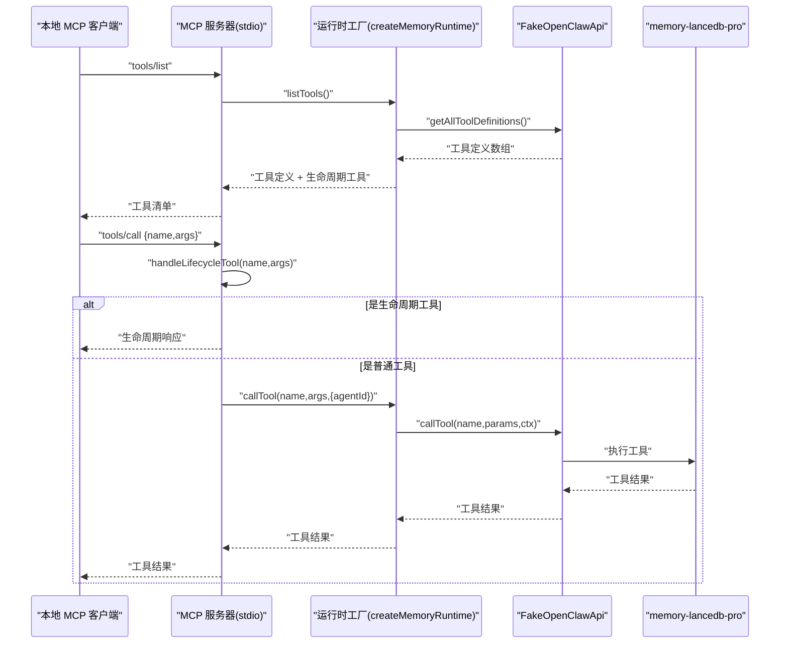
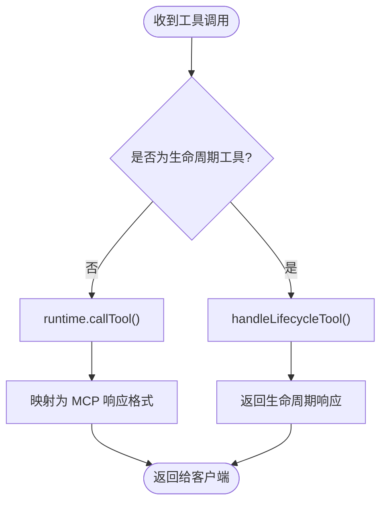
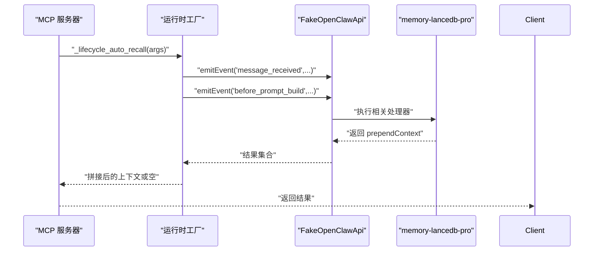
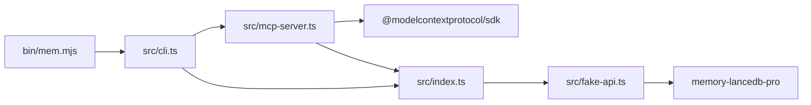

# stdio 模式

<cite>
**本文引用的文件**
- [README.md](file://README.md)
- [docs/USAGE_GUIDE.md](file://docs/USAGE_GUIDE.md)
- [src/index.ts](file://src/index.ts)
- [src/mcp-server.ts](file://src/mcp-server.ts)
- [src/lifecycle.ts](file://src/lifecycle.ts)
- [src/cli.ts](file://src/cli.ts)
- [src/fake-api.ts](file://src/fake-api.ts)
- [package.json](file://package.json)
- [bin/mem.mjs](file://bin/mem.mjs)
</cite>

## 目录
1. [简介](#简介)
2. [项目结构](#项目结构)
3. [核心组件](#核心组件)
4. [架构总览](#架构总览)
5. [详细组件分析](#详细组件分析)
6. [依赖分析](#依赖分析)
7. [性能考虑](#性能考虑)
8. [故障排除指南](#故障排除指南)
9. [结论](#结论)
10. [附录](#附录)

## 简介
本节面向希望在本地 MCP 客户端（如 Claude Desktop、Cursor、Cline、Continue.dev 等）中使用 memory-lancedb-mcp 的用户，系统讲解 stdio 传输模式的工作原理、配置选项与生命周期工具处理机制，并提供错误处理与调试技巧。同时对比 stdio 与 SSE（跨 scope 模式）的区别，指导何时使用 scope 参数进行项目隔离。

## 项目结构
该项目围绕“MCP 服务器 + FakeOpenClawApi 适配 + 生命周期桥接”的架构组织，核心文件职责如下：
- src/index.ts：运行时工厂与工具调用封装、标签处理、scope 注入与 ACL 强制、serverName 构建等
- src/mcp-server.ts：stdio 传输的 MCP 服务器实现，暴露工具与生命周期工具，连接 stdin/stdout
- src/lifecycle.ts：生命周期桥接函数（自动召回、自动捕获、会话结束、消息接收）
- src/cli.ts：mem 命令行入口，解析 serve/list/search/stats 等命令，支持 stdio/SSE
- src/fake-api.ts：模拟 OpenClaw 运行时，注册工具、事件与钩子，供 MCP 层调用
- bin/mem.mjs：CLI 可执行入口，加载 dist/cli.js
- package.json：依赖与构建脚本，声明 MCP SDK、Commander、jiti、memory-lancedb-pro 等

```mermaid
graph TB
subgraph "CLI"
CLI["mem 命令行<br/>src/cli.ts"]
BIN["可执行入口<br/>bin/mem.mjs"]
end
subgraph "MCP 层"
MCP["MCP 服务器(stdio)<br/>src/mcp-server.ts"]
IDX["运行时工厂/工具封装<br/>src/index.ts"]
LIFECYCLE["生命周期桥接<br/>src/lifecycle.ts"]
end
subgraph "运行时适配"
FAKE["FakeOpenClawApi<br/>src/fake-api.ts"]
end
subgraph "外部依赖"
SDK["@modelcontextprotocol/sdk<br/>stdio 传输"]
PROJ["memory-lancedb-pro<br/>父项目"]
end
BIN --> CLI
CLI --> MCP
CLI --> IDX
MCP --> IDX
IDX --> FAKE
FAKE --> PROJ
MCP --> SDK
```

图表来源
- [src/mcp-server.ts:1-306](file://src/mcp-server.ts#L1-L306)
- [src/index.ts:1-515](file://src/index.ts#L1-L515)
- [src/lifecycle.ts:1-178](file://src/lifecycle.ts#L1-L178)
- [src/cli.ts:1-617](file://src/cli.ts#L1-L617)
- [src/fake-api.ts:1-318](file://src/fake-api.ts#L1-L318)
- [package.json:26-32](file://package.json#L26-L32)

章节来源
- [README.md:22-45](file://README.md#L22-L45)
- [package.json:26-32](file://package.json#L26-L32)

## 核心组件
- 运行时工厂 createMemoryRuntime：负责加载配置、注入 scope、创建 FakeOpenClawApi、注册插件、发出 gateway_start 事件、提供工具调用与生命周期事件桥接
- MCP 服务器（stdio）：创建 Server，注册工具与生命周期工具，处理 ListTools/CallTool 请求，连接 StdioServerTransport
- FakeOpenClawApi：捕获工具工厂、事件与钩子，提供 callTool/emitEvent/triggerHook 等运行时 API
- 生命周期桥接：triggerAutoRecall/triggerAutoCapture/triggerSessionEnd/triggerMessageReceived 将 OpenClaw 事件映射为 MCP 工具调用

章节来源
- [src/index.ts:207-498](file://src/index.ts#L207-L498)
- [src/mcp-server.ts:43-140](file://src/mcp-server.ts#L43-L140)
- [src/fake-api.ts:57-317](file://src/fake-api.ts#L57-L317)
- [src/lifecycle.ts:52-153](file://src/lifecycle.ts#L52-L153)

## 架构总览
stdio 模式下，MCP 服务器通过标准输入输出与本地客户端通信，适合 Claude Desktop、Cursor、Cline、Continue.dev 等桌面客户端。服务器启动时根据是否指定 scope 决定 agentId 与 ACL 行为，并在 MCP 协议握手完成后打印启动日志与工具清单。



图表来源
- [src/mcp-server.ts:61-124](file://src/mcp-server.ts#L61-L124)
- [src/index.ts:248-453](file://src/index.ts#L248-L453)
- [src/fake-api.ts:217-235](file://src/fake-api.ts#L217-L235)

## 详细组件分析

### stdio 传输模式工作原理与优势
- 传输通道：StdioServerTransport 通过标准输入输出与本地客户端建立连接，无需网络监听，天然与本地桌面客户端集成
- 无缝集成：本地客户端（Claude Desktop、Cursor、Cline、Continue.dev）直接通过 stdio 发起 MCP 请求，无需额外网络配置
- 日志与调试：stdio 模式下，服务器将启动信息与工具清单输出到标准错误（stderr），避免污染 MCP 协议流

章节来源
- [src/mcp-server.ts:127-140](file://src/mcp-server.ts#L127-L140)
- [README.md:67-68](file://README.md#L67-L68)

### 配置选项：serverName、serverVersion 与 scope
- serverName：服务器显示名称，可附加当前激活的 scope，便于区分同一机器上的多个实例
- serverVersion：服务器版本号，默认 0.1.0
- scope：项目隔离参数，当指定 --scope 时，服务器进入锁定模式，所有工具调用强制落到该 scope，且 agentId 使用系统绕过 ID 以通过 ACL 检查

章节来源
- [src/mcp-server.ts:28-33](file://src/mcp-server.ts#L28-L33)
- [src/mcp-server.ts:44-46](file://src/mcp-server.ts#L44-L46)
- [src/index.ts:150-152](file://src/index.ts#L150-L152)
- [src/index.ts:351-370](file://src/index.ts#L351-L370)

### 生命周期工具处理机制
stdio 模式下，服务器在 tools/list 中合并普通工具与三条生命周期工具：
- _lifecycle_auto_recall：在 prompt 构建前自动召回相关记忆，返回可前置到对话上下文的文本
- _lifecycle_auto_capture：在对话回合或会话结束后自动提取关键信息并异步写入记忆
- _lifecycle_session_end：会话结束时触发清理与状态刷新

服务器在收到工具调用时，优先尝试匹配生命周期工具，若命中则直接处理并返回；否则转交运行时工厂进行工具调用。



图表来源
- [src/mcp-server.ts:86-124](file://src/mcp-server.ts#L86-L124)
- [src/mcp-server.ts:235-305](file://src/mcp-server.ts#L235-L305)

章节来源
- [src/mcp-server.ts:154-233](file://src/mcp-server.ts#L154-L233)
- [src/mcp-server.ts:235-305](file://src/mcp-server.ts#L235-L305)
- [src/lifecycle.ts:52-153](file://src/lifecycle.ts#L52-L153)

### 生命周期工具实现细节
- _lifecycle_auto_recall：先触发 message_received 缓存原始消息，再触发 before_prompt_build 获取可前置上下文
- _lifecycle_auto_capture：触发 agent_end，异步提取对话要点并写入记忆
- _lifecycle_session_end：触发 session_end，清理挂起状态



图表来源
- [src/mcp-server.ts:240-270](file://src/mcp-server.ts#L240-L270)
- [src/lifecycle.ts:52-91](file://src/lifecycle.ts#L52-L91)

章节来源
- [src/mcp-server.ts:240-270](file://src/mcp-server.ts#L240-L270)
- [src/lifecycle.ts:52-91](file://src/lifecycle.ts#L52-L91)

### 与跨 scope 模式的区别与使用建议
- 跨 scope 模式（默认，不指定 --scope）：可读写任意 scope；memory_store 不指定 scope 时自动写入 global；适合多项目共享与统一管理
- 锁定 scope 模式（指定 --scope X）：所有操作强制限定在 X 内；请求其他 scope 会被拒绝；适合单项目强隔离
- SSE 远程模式：支持跨网络访问，同样可结合 --scope 使用

章节来源
- [README.md:426-498](file://README.md#L426-L498)
- [docs/USAGE_GUIDE.md:423-498](file://docs/USAGE_GUIDE.md#L423-L498)

## 依赖分析
- @modelcontextprotocol/sdk：提供 MCP 协议实现与 stdio 传输
- memory-lancedb-pro：核心记忆引擎，通过 jiti 直接从 npm 加载源码
- jiti：TypeScript 源码按需编译加载
- Commander：CLI 命令解析与参数处理



图表来源
- [src/mcp-server.ts:8-22](file://src/mcp-server.ts#L8-L22)
- [src/index.ts:9-12](file://src/index.ts#L9-L12)
- [src/fake-api.ts:13-14](file://src/fake-api.ts#L13-L14)
- [src/cli.ts:17-27](file://src/cli.ts#L17-L27)
- [package.json:26-31](file://package.json#L26-L31)

章节来源
- [package.json:26-31](file://package.json#L26-L31)

## 性能考虑
- stdio 模式无网络开销，延迟低，适合本地快速迭代
- 标签过滤在召回阶段通过 BM25 加权实现软过滤，必要时可配合 category 与 limit 控制结果规模
- 自动捕获采用异步 fire-and-forget，不影响主流程响应时间

## 故障排除指南
- 服务器启动日志
  - stdio 模式启动后会将“MCP Server started”等信息输出到 stderr，避免污染 MCP 协议流
  - 若未看到日志，检查是否使用了 --quiet 抑制调试输出
- 连接问题排查
  - 确认本地客户端已正确配置 stdio 模式（command/args/env）
  - 使用 mem doctor 进行健康检查，验证配置文件、API Key、插件加载与工具清单
  - 使用 mem serve --dry-run 预检配置与工具清单
- Scope 权限拒绝
  - 若返回“Scope mismatch”，确认服务端 --scope 与请求 scope 是否一致
  - 锁定模式下，请求其他 scope 将被拒绝
- 标签与内容校验
  - 标签包含非法字符会立即报错，避免写入破坏前缀结构
- 常见问题
  - 源码修改后需重新编译并重启服务
  - WSL 环境下可直接调用 tsc 编译

章节来源
- [src/mcp-server.ts:130-139](file://src/mcp-server.ts#L130-L139)
- [src/cli.ts:449-517](file://src/cli.ts#L449-L517)
- [docs/USAGE_GUIDE.md:618-667](file://docs/USAGE_GUIDE.md#L618-L667)

## 结论
stdio 模式通过标准输入输出与本地 MCP 客户端无缝集成，适合桌面端快速开发与调试。借助 serverName、serverVersion 与 scope 参数，可在同一台机器上区分多个实例并实现项目级强隔离。生命周期工具桥接使自动召回与自动捕获在 MCP 环境中可被显式触发，提升用户体验。配合 CLI doctor 与 dry-run 等工具，可高效定位配置与连接问题。

## 附录
- 客户端配置示例（Claude Desktop/Cursor/Cline/Continue.dev）与 SSE 模式配置详见使用手册与 README
- CLI 命令参考与 Scope 管理详见 docs/USAGE_GUIDE.md 与 README