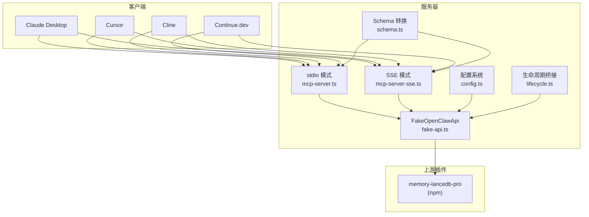
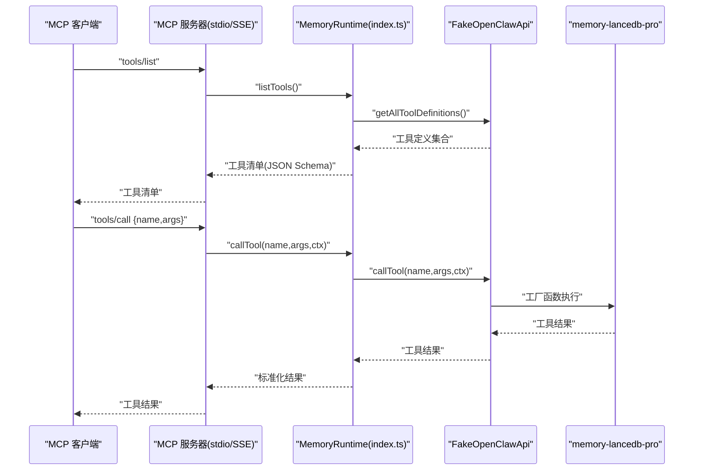
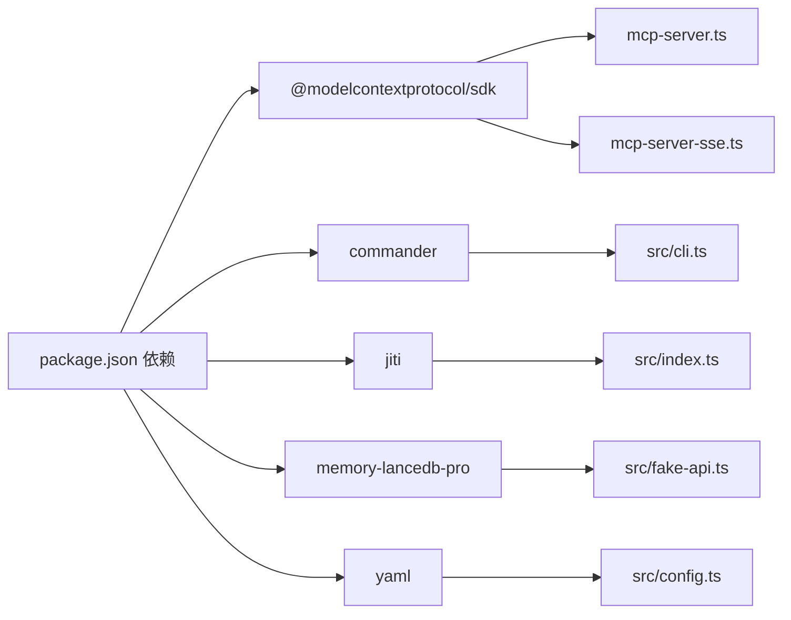

# 客户端集成指南

<cite>
**本文引用的文件**
- [README.md](file://README.md)
- [docs/USAGE_GUIDE.md](file://docs/USAGE_GUIDE.md)
- [package.json](file://package.json)
- [bin/mem.mjs](file://bin/mem.mjs)
- [src/index.ts](file://src/index.ts)
- [src/cli.ts](file://src/cli.ts)
- [src/mcp-server.ts](file://src/mcp-server.ts)
- [src/mcp-server-sse.ts](file://src/mcp-server-sse.ts)
- [src/fake-api.ts](file://src/fake-api.ts)
- [src/config.ts](file://src/config.ts)
- [src/schema.ts](file://src/schema.ts)
- [src/lifecycle.ts](file://src/lifecycle.ts)
</cite>

## 目录
1. [简介](#简介)
2. [项目结构](#项目结构)
3. [核心组件](#核心组件)
4. [架构总览](#架构总览)
5. [详细组件分析](#详细组件分析)
6. [依赖关系分析](#依赖关系分析)
7. [性能考量](#性能考量)
8. [故障排查指南](#故障排查指南)
9. [结论](#结论)
10. [附录](#附录)

## 简介
本指南面向希望在多种 MCP 客户端中集成 memory-lancedb-mcp 的开发者与使用者，涵盖：
- 在 Claude Desktop、Cursor、Cline、Continue.dev 等主流客户端中配置 stdio 与 SSE 两种传输模式
- 客户端与服务器的握手与工具发现机制
- 工具调用流程与生命周期桥接
- 连接稳定性、超时与重连建议
- 常见问题排查与调试技巧

## 项目结构
该项目围绕“MCP 服务器”与“CLI 命令行工具”展开，核心文件如下：
- 服务器层：stdio 与 SSE 两种传输模式的 MCP 服务器实现
- 运行时与适配：FakeOpenClawApi 将上游插件的工具与事件桥接到 MCP
- 配置系统：YAML 配置解析与环境变量扩展
- CLI：mem 命令行工具，支持 serve/list/search/stats 等子命令
- 文档：README 与使用手册，包含客户端配置示例与最佳实践

图表来源
- [src/mcp-server.ts:1-306](file://src/mcp-server.ts#L1-L306)
- [src/mcp-server-sse.ts:1-405](file://src/mcp-server-sse.ts#L1-L405)
- [src/fake-api.ts:1-318](file://src/fake-api.ts#L1-L318)
- [src/config.ts:1-312](file://src/config.ts#L1-L312)
- [src/schema.ts:1-151](file://src/schema.ts#L1-L151)
- [src/lifecycle.ts:1-178](file://src/lifecycle.ts#L1-L178)

章节来源
- [README.md:1-738](file://README.md#L1-L738)
- [docs/USAGE_GUIDE.md:1-672](file://docs/USAGE_GUIDE.md#L1-L672)
- [package.json:1-46](file://package.json#L1-L46)

## 核心组件
- MCP 服务器（stdio/SSE）：负责工具发现与调用、生命周期工具映射、传输层连接
- FakeOpenClawApi：适配器，捕获上游插件注册的工具、事件与钩子，供 MCP 使用
- 配置系统：YAML 配置加载、环境变量扩展、默认模板初始化
- Schema 转换：将 TypeBox 参数 schema 转换为 MCP 兼容的 JSON Schema
- 生命周期桥接：将 OpenClaw 的 before_prompt_build/agent_end 等事件映射为 MCP 工具
- CLI：mem 命令行工具，支持 serve/list/search/stats 等

章节来源
- [src/index.ts:1-515](file://src/index.ts#L1-L515)
- [src/mcp-server.ts:1-306](file://src/mcp-server.ts#L1-L306)
- [src/mcp-server-sse.ts:1-405](file://src/mcp-server-sse.ts#L1-L405)
- [src/fake-api.ts:1-318](file://src/fake-api.ts#L1-L318)
- [src/config.ts:1-312](file://src/config.ts#L1-L312)
- [src/schema.ts:1-151](file://src/schema.ts#L1-L151)
- [src/lifecycle.ts:1-178](file://src/lifecycle.ts#L1-L178)
- [src/cli.ts:1-617](file://src/cli.ts#L1-L617)

## 架构总览
memory-lancedb-mcp 通过 FakeOpenClawApi 将 memory-lancedb-pro 的工具与事件桥接至 MCP 协议。服务器层（stdio/SSE）负责：
- 工具发现：tools/list 返回工具清单（含生命周期工具）
- 工具调用：tools/call 将请求转发给 FakeOpenClawApi，再由插件执行
- 生命周期工具：_lifecycle_auto_recall/_lifecycle_auto_capture/_lifecycle_session_end
- 传输层：stdio（本地客户端）与 SSE（HTTP，远程/多客户端）

图表来源
- [src/mcp-server.ts:60-124](file://src/mcp-server.ts#L60-L124)
- [src/mcp-server-sse.ts:246-287](file://src/mcp-server-sse.ts#L246-L287)
- [src/index.ts:455-498](file://src/index.ts#L455-L498)
- [src/fake-api.ts:213-235](file://src/fake-api.ts#L213-L235)

## 详细组件分析

### MCP 服务器（stdio 模式）
- 传输：StdioServerTransport
- 工具发现：ListToolsRequestSchema，返回工具清单与生命周期工具
- 工具调用：CallToolRequestSchema，封装为 MCP 响应
- 生命周期工具：_lifecycle_auto_recall/_lifecycle_auto_capture/_lifecycle_session_end
- 默认 agentId：未指定 scope 时为 "system"（跨 scope 模式），指定 scope 时为该 scope 值

章节来源
- [src/mcp-server.ts:1-306](file://src/mcp-server.ts#L1-L306)

### MCP 服务器（SSE 模式）
- 传输：HTTP + Server-Sent Events
- 端点：
  - GET /sse：SSE 事件流，告知客户端消息端点
  - POST /message：JSON-RPC 消息通道
  - GET /health：健康检查
- 生命周期工具：与 stdio 模式一致
- 默认 agentId：同 stdio

章节来源
- [src/mcp-server-sse.ts:1-405](file://src/mcp-server-sse.ts#L1-L405)

### FakeOpenClawApi 适配器
- 注册工具：registerTool 捕获工具工厂
- 事件系统：on 注册事件处理器，emitEvent 触发事件
- 钩子系统：registerHook 注册钩子，triggerHook 触发
- 工具调用：callTool 通过工厂创建工具并执行
- CLI 注册：registerCli 暴露 CLI 实例

章节来源
- [src/fake-api.ts:1-318](file://src/fake-api.ts#L1-L318)

### 配置系统
- 配置路径解析：支持 MEM_CONFIG_PATH、默认用户目录、当前目录
- 环境变量扩展：${VAR} 语法替换
- 默认模板：包含 dbPath、embedding、autoCapture/autoRecall、retrieval、scopes 等
- 转换：toPluginConfig 直接透传 YAML 结构为插件配置

章节来源
- [src/config.ts:1-312](file://src/config.ts#L1-L312)

### Schema 转换
- 将 TypeBox schema 清洗为标准 JSON Schema，保证 MCP 兼容
- 处理 properties、required、items、oneOf/anyOf/allOf 等

章节来源
- [src/schema.ts:1-151](file://src/schema.ts#L1-L151)

### 生命周期桥接
- triggerAutoRecall：before_prompt_build 事件，返回可前置到提示的上下文
- triggerAutoCapture：agent_end 事件，后台提取记忆
- triggerSessionEnd：session_end 事件，清理挂起状态
- triggerMessageReceived：缓存用户消息，供 auto-recall 聚合逻辑使用

章节来源
- [src/lifecycle.ts:1-178](file://src/lifecycle.ts#L1-L178)

### CLI（mem 命令）
- serve：启动 stdio 或 SSE 服务器，支持 dry-run、scope、port/host、quiet
- list/search/stats/store/delete：内存管理与查询
- config：初始化/显示/路径/验证
- doctor：健康检查（含 MCP 握手）
- scope：列出与删除 scope

章节来源
- [src/cli.ts:1-617](file://src/cli.ts#L1-L617)
- [bin/mem.mjs:1-8](file://bin/mem.mjs#L1-L8)

## 依赖关系分析

图表来源
- [package.json:26-31](file://package.json#L26-L31)
- [src/mcp-server.ts:8-13](file://src/mcp-server.ts#L8-L13)
- [src/mcp-server-sse.ts:11-15](file://src/mcp-server-sse.ts#L11-L15)
- [src/index.ts](file://src/index.ts#L12)
- [src/fake-api.ts:1-318](file://src/fake-api.ts#L1-L318)
- [src/config.ts:1-312](file://src/config.ts#L1-L312)
- [src/cli.ts:17-27](file://src/cli.ts#L17-L27)

章节来源
- [package.json:1-46](file://package.json#L1-L46)

## 性能考量
- SSE 模式适合远程/多客户端场景，stdio 更适合本地客户端
- 工具调用链路中，FakeOpenClawApi 仅做适配与桥接，性能瓶颈主要在上游插件与嵌入/检索
- 建议：
  - 合理设置检索权重与阈值，减少无关结果
  - 控制单次召回数量（limit），避免过多上下文影响响应时间
  - 使用 SSE 时，注意网络延迟与并发客户端数量

[本节为通用指导，不直接分析具体文件]

## 故障排查指南

### 客户端配置与握手
- stdio 模式：客户端通过命令行启动服务器，标准输入输出进行 MCP 协议通信
- SSE 模式：客户端通过 URL 指向 /sse，服务器返回 /message 作为消息端点
- 工具发现：客户端首次连接会请求 tools/list，服务器返回工具清单（含生命周期工具）
- 生命周期工具：_lifecycle_auto_recall/_lifecycle_auto_capture/_lifecycle_session_end

章节来源
- [src/mcp-server.ts:60-124](file://src/mcp-server.ts#L60-L124)
- [src/mcp-server-sse.ts:108-172](file://src/mcp-server-sse.ts#L108-L172)
- [src/lifecycle.ts:52-153](file://src/lifecycle.ts#L52-L153)

### 常见问题与解决
- 连接失败
  - 检查配置文件存在与可读性，使用 mem doctor 验证
  - 确认 API Key 与嵌入模型 endpoint 可达
  - stdio 模式下，确保客户端正确启动服务器进程
  - SSE 模式下，确认端口与主机绑定正确，防火墙放行
- 工具不可用
  - 使用 mem serve --dry-run 预检工具清单
  - 检查插件加载是否成功（doctor）
- 权限问题（Scope）
  - 锁定 scope 模式下，请求的 scope 必须与服务器 --scope 一致
  - 跨 scope 模式下，memory_store 不指定 scope 会写入 global
- 标签过滤
  - list+tags 会被重写为 recall(query=前缀)，过滤为软过滤（BM25 加权）
- 日志与调试
  - stdio 模式下，stderr 输出启动与警告信息
  - SSE 模式下，控制台输出监听地址与工具数
  - 使用 --quiet 抑制调试日志，便于生产环境

章节来源
- [docs/USAGE_GUIDE.md:618-672](file://docs/USAGE_GUIDE.md#L618-L672)
- [src/mcp-server.ts:130-140](file://src/mcp-server.ts#L130-L140)
- [src/mcp-server-sse.ts:174-209](file://src/mcp-server-sse.ts#L174-L209)
- [src/cli.ts:449-517](file://src/cli.ts#L449-L517)

## 结论
memory-lancedb-mcp 通过统一的 MCP 服务器抽象，将 memory-lancedb-pro 的强大记忆能力暴露给多种客户端。通过 stdio 与 SSE 两种传输模式，既满足本地客户端的低延迟需求，也支持远程/多客户端场景。结合 FakeOpenClawApi 的适配与生命周期桥接，开发者可以灵活地在不同客户端中启用自动召回与自动捕获，构建更智能的长期记忆系统。

[本节为总结性内容，不直接分析具体文件]

## 附录

### 客户端配置要点与最佳实践

- Claude Desktop
  - stdio：在配置文件中添加 mcpServers，command 指向 node，args 指向 bin/mem.mjs serve，env 注入 API Key
  - SSE：通过 url 指向 http://host:port/sse
  - 多项目：为每个项目配置独立的 mcpServers 条目，args 中 --scope 与值必须拆分为两个元素
- Cursor
  - 在 .cursor/mcp.json 中添加 mcpServers，配置与 Claude 类似
- Cline（VS Code 插件）
  - 在 MCP Server 设置中添加 command/args/env
- Continue.dev
  - 在 .continue/config.json 的 mcpServers 中添加 name/type/stdio/command/args/env

章节来源
- [README.md:171-276](file://README.md#L171-L276)
- [docs/USAGE_GUIDE.md:520-539](file://docs/USAGE_GUIDE.md#L520-L539)

### 传输模式选择
- stdio（本地客户端首选）
  - 优点：低延迟、简单稳定
  - 适用：Claude Desktop、Cursor、Cline、Continue.dev 本地模式
- SSE（远程/多客户端）
  - 优点：跨网络、多客户端共享
  - 适用：WSL/Docker/远程服务器场景
  - 注意：SSE 模式下建议限定 host 与 scope，避免暴露敏感数据

章节来源
- [README.md:257-276](file://README.md#L257-L276)
- [src/mcp-server-sse.ts:57-76](file://src/mcp-server-sse.ts#L57-L76)

### 工具发现与调用流程
- 工具发现：客户端首次连接时请求 tools/list，服务器返回工具清单（含生命周期工具）
- 工具调用：客户端发送 tools/call，服务器将请求转交给 FakeOpenClawApi，再由插件执行
- 生命周期工具：客户端可主动调用 _lifecycle_auto_recall/_lifecycle_auto_capture/_lifecycle_session_end

章节来源
- [src/mcp-server.ts:60-124](file://src/mcp-server.ts#L60-L124)
- [src/mcp-server-sse.ts:246-287](file://src/mcp-server-sse.ts#L246-L287)
- [src/lifecycle.ts:52-153](file://src/lifecycle.ts#L52-L153)

### 连接稳定性、超时与重连
- stdio：进程内通信，稳定性高；如客户端断开，重启客户端重新握手
- SSE：建议：
  - 为 /message 设置合理的超时与重试策略
  - 使用 /health 健康检查端点监控服务状态
  - 多客户端场景下，注意并发与资源占用

章节来源
- [src/mcp-server-sse.ts:96-172](file://src/mcp-server-sse.ts#L96-L172)
- [src/mcp-server-sse.ts:192-209](file://src/mcp-server-sse.ts#L192-L209)

### 调试技巧与日志分析
- 使用 mem doctor 进行健康检查，验证配置、API Key、插件加载与工具清单
- stdio 模式下关注 stderr 输出的启动与警告信息
- SSE 模式下关注控制台输出的监听地址与工具数量
- 使用 --quiet 抑制调试日志，便于生产环境观察

章节来源
- [src/cli.ts:449-517](file://src/cli.ts#L449-L517)
- [src/mcp-server.ts:130-140](file://src/mcp-server.ts#L130-L140)
- [src/mcp-server-sse.ts:174-190](file://src/mcp-server-sse.ts#L174-L190)