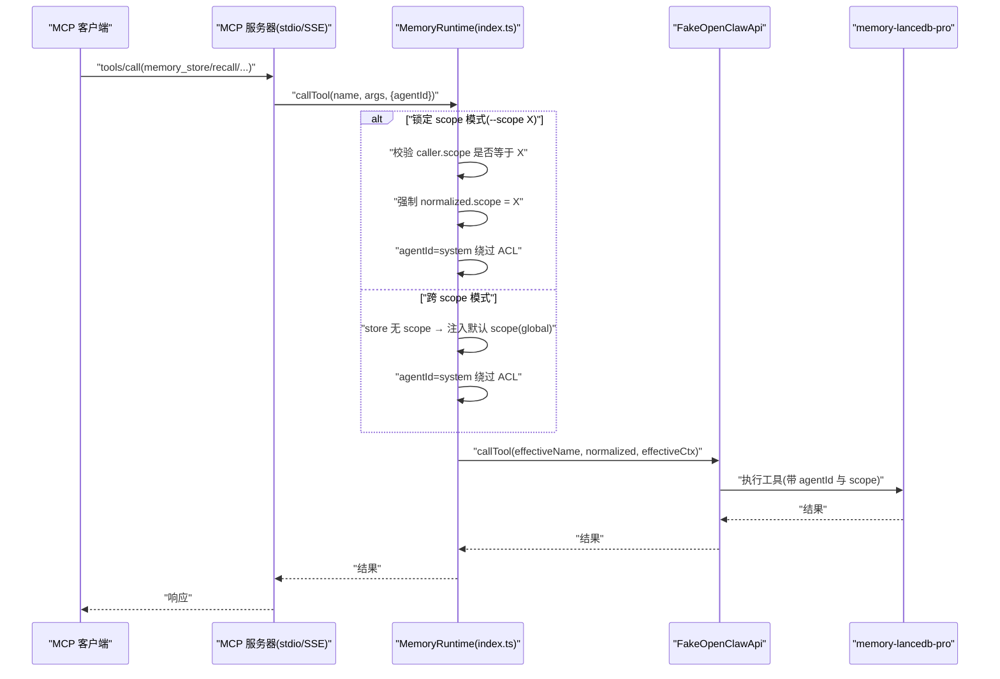
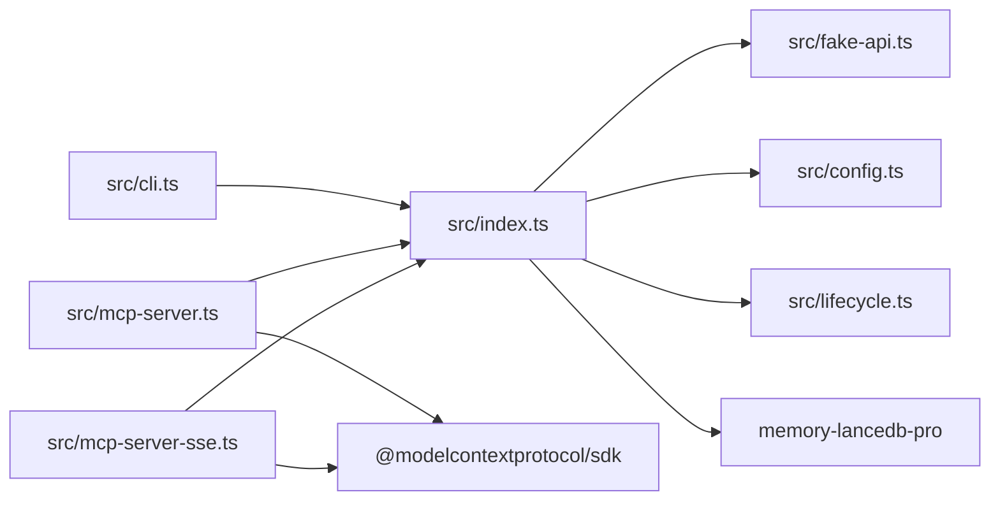

# 多项目隔离

<cite>
**本文引用的文件**
- [README.md](file://README.md)
- [docs/USAGE_GUIDE.md](file://docs/USAGE_GUIDE.md)
- [src/index.ts](file://src/index.ts)
- [src/cli.ts](file://src/cli.ts)
- [src/config.ts](file://src/config.ts)
- [src/fake-api.ts](file://src/fake-api.ts)
- [src/mcp-server.ts](file://src/mcp-server.ts)
- [src/mcp-server-sse.ts](file://src/mcp-server-sse.ts)
- [src/lifecycle.ts](file://src/lifecycle.ts)
- [bin/mem.mjs](file://bin/mem.mjs)
- [package.json](file://package.json)
- [test/integration.test.mjs](file://test/integration.test.mjs)
</cite>

## 目录
1. [简介](#简介)
2. [项目结构](#项目结构)
3. [核心组件](#核心组件)
4. [架构总览](#架构总览)
5. [详细组件分析](#详细组件分析)
6. [依赖分析](#依赖分析)
7. [性能考量](#性能考量)
8. [故障排除指南](#故障排除指南)
9. [结论](#结论)
10. [附录](#附录)

## 简介
本项目为 AI 应用提供持久化长期记忆的 MCP Server，支持“多项目隔离”和“跨 scope 模式/锁定 scope 模式”两种运行模式，并通过 ACL（访问控制列表）实现基于 scope 的强隔离。本文档围绕 Scope 概念、ACL 隔离机制、两种运行模式的行为差异与使用场景、agentId='system' 绕过机制、normalized.scope 强制设置、ACL 访问控制实现与安全考虑、多项目客户端配置示例、Scope 管理命令与最佳实践展开，帮助开发者在本地或远程环境中安全、稳定地为不同项目提供独立的记忆空间。

## 项目结构
该项目采用模块化组织，核心入口与运行时封装在 src 目录，CLI 命令在 bin 目录，文档在 docs 目录，测试位于 test 目录。整体结构如下：

```mermaid
graph TB
subgraph "CLI"
BIN["bin/mem.mjs"]
CLI["src/cli.ts"]
end
subgraph "运行时与桥接"
IDX["src/index.ts"]
FAKE["src/fake-api.ts"]
CFG["src/config.ts"]
LIFE["src/lifecycle.ts"]
end
subgraph "MCP 传输层"
STDIO["src/mcp-server.ts"]
SSE["src/mcp-server-sse.ts"]
end
subgraph "外部依赖"
SDK["@modelcontextprotocol/sdk"]
MLPRO["memory-lancedb-pro"]
end
BIN --> CLI
CLI --> IDX
IDX --> FAKE
IDX --> CFG
IDX --> LIFE
STDIO --> IDX
SSE --> IDX
STDIO --> SDK
SSE --> SDK
IDX --> MLPRO
```

图表来源
- [bin/mem.mjs](file://bin/mem.mjs)
- [src/cli.ts](file://src/cli.ts)
- [src/index.ts](file://src/index.ts)
- [src/mcp-server.ts](file://src/mcp-server.ts)
- [src/mcp-server-sse.ts](file://src/mcp-server-sse.ts)
- [src/config.ts](file://src/config.ts)
- [src/fake-api.ts](file://src/fake-api.ts)
- [src/lifecycle.ts](file://src/lifecycle.ts)

章节来源
- [package.json](file://package.json)
- [README.md](file://README.md)

## 核心组件
- 运行时工厂 createMemoryRuntime：负责加载配置、构建 FakeOpenClawApi、注册插件、暴露工具与生命周期事件，并在工具调用时注入 scope 与 agentId，实现跨 scope 与锁定 scope 的差异化行为。
- FakeOpenClawApi：模拟 OpenClaw 插件运行时，注册工具、事件与钩子，提供 callTool、emitEvent、triggerHook 等能力。
- MCP 服务器（stdio/SSE）：将运行时暴露为 MCP 服务，Stdio 用于本地客户端，SSE 用于远程/多客户端场景。
- CLI：提供 mem 命令族，包括 serve、list、search、stats、store、delete、config、doctor、scope 等，支持 dry-run、SSE、scope 等参数。
- 配置系统：解析 YAML 配置，支持环境变量扩展，映射到插件期望的配置结构。
- 标签系统：对 tags 参数进行规范化与前缀嵌入，实现软过滤与展示剥离。

章节来源
- [src/index.ts](file://src/index.ts)
- [src/fake-api.ts](file://src/fake-api.ts)
- [src/mcp-server.ts](file://src/mcp-server.ts)
- [src/mcp-server-sse.ts](file://src/mcp-server-sse.ts)
- [src/cli.ts](file://src/cli.ts)
- [src/config.ts](file://src/config.ts)

## 架构总览
下图展示了从 MCP 客户端到插件的调用链，以及跨 scope 与锁定 scope 的注入逻辑与 ACL 绕过机制。



图表来源
- [src/mcp-server.ts](file://src/mcp-server.ts)
- [src/mcp-server-sse.ts](file://src/mcp-server-sse.ts)
- [src/index.ts](file://src/index.ts)
- [src/fake-api.ts](file://src/fake-api.ts)

## 详细组件分析

### Scope 概念与 ACL 隔离机制
- Scope 是记忆的命名空间，用于将不同项目/任务/会话的记忆彼此隔离。插件基于 scope ACL 进行访问控制。
- 在跨 scope 模式下，agentId 默认为 "system"，该 ID 被视为系统级绕过 ID，isAccessible() 对任意有效 scope 返回 true，从而允许跨 scope 读写。
- 在锁定 scope 模式下，服务端将 agentId 设为 "system"，同时在 wrapper 层强制 normalized.scope 为服务端 --scope 值，确保写入与 ACL 检查一致；若调用方显式指定的 scope 与服务端不一致，则在进入插件前被拒绝。

章节来源
- [src/index.ts](file://src/index.ts)
- [src/mcp-server.ts](file://src/mcp-server.ts)
- [src/mcp-server-sse.ts](file://src/mcp-server-sse.ts)
- [README.md](file://README.md)

### 两种运行模式的区别与行为
- 跨 scope 模式（默认）
  - 行为：可读写任意 scope；memory_store 不指定 scope 时自动写入默认 scope（如 global）。
  - 适用：需要跨项目检索或统一管理的场景。
- 锁定 scope 模式（--scope X）
  - 行为：所有操作强制限定在 scope X 内；请求其他 scope 会被拒绝。
  - 适用：单项目专用、生产环境隔离、多客户端共享同一实例但各自独立记忆空间。

章节来源
- [README.md](file://README.md)
- [docs/USAGE_GUIDE.md](file://docs/USAGE_GUIDE.md)
- [src/index.ts](file://src/index.ts)

### agentId='system' 绕过机制与 normalized.scope 强制设置
- 绕过机制：在锁定模式下，wrapper 将 effectiveCtx.agentId 设为 "system"，使 isSystemBypassId("system") 为真，从而通过 ACL 检查。
- 强制设置：当服务端存在 --scope X 时，wrapper 将 normalized.scope 强制设为 X，确保写入与 ACL 一致，且拒绝与 X 不一致的 scope 请求。
- 跨 scope 模式：memory_store 无 scope 时注入默认 scope（如 global），避免写入 agent:system 私有空间。

章节来源
- [src/index.ts](file://src/index.ts)
- [src/mcp-server.ts](file://src/mcp-server.ts)
- [src/mcp-server-sse.ts](file://src/mcp-server-sse.ts)

### ACL 访问控制的具体实现与安全考虑
- 实现要点
  - 插件侧维护 scope ACL，限制 agentId 对各 scope 的访问。
  - wrapper 通过 agentId="system" 绕过 ACL，结合 normalized.scope 强制，保证“系统级访问 + 正确写入”的一致性。
  - 跨 scope 模式下，memory_store 默认写入 global，避免写入 agent:system 私有空间。
- 安全考虑
  - 锁定模式下，拒绝任何与服务端 scope 不一致的请求，防止越权写入。
  - SSE 模式下，若未指定 --scope，会打印警告，提示跨 scope 可见性与暴露风险，建议限制 host 与网络访问。
  - Scope 管理命令支持预览删除（--dry-run）与确认删除（--yes），避免误删。

章节来源
- [src/index.ts](file://src/index.ts)
- [src/mcp-server.ts](file://src/mcp-server.ts)
- [src/mcp-server-sse.ts](file://src/mcp-server-sse.ts)
- [src/cli.ts](file://src/cli.ts)

### 两种运行模式的配置示例与实际使用案例
- 跨 scope 模式（stdio）
  - 启动：mem serve
  - 写入：mem store "通用知识" → 写入 global
  - 搜索：mem search "架构设计" → 跨 scope 搜索；mem search "架构设计" --scope project:alpha → 仅搜索 project:alpha
- 锁定 scope 模式（stdio）
  - 启动：mem serve --scope project:myapp
  - 写入：mem store "项目A信息" → 写入 project:myapp；mem store "其他信息" --scope global → 拒绝
  - 搜索：mem search "架构" → 仅返回 project:myapp 的记忆
- 锁定 scope + SSE 远程模式
  - 启动：mem serve --sse --port 3100 --scope project:myapp
  - 客户端配置：使用 URL 模式指向 http://host:3100/sse

章节来源
- [README.md](file://README.md)
- [docs/USAGE_GUIDE.md](file://docs/USAGE_GUIDE.md)
- [src/cli.ts](file://src/cli.ts)

### 多项目客户端配置示例
- 为不同项目配置独立的 MCP 服务器实例，args 中 "--scope" 与值必须作为两个独立元素，不能合并为 "--scope myapp"。
- 示例（Claude Desktop/Cursor/Cline 等）：
  - 项目 A：args: ["/path/to/bin/mem.mjs", "serve", "--scope", "project:myapp"]
  - 项目 B：args: ["/path/to/bin/mem.mjs", "serve", "--scope", "backend"]

章节来源
- [README.md](file://README.md)
- [docs/USAGE_GUIDE.md](file://docs/USAGE_GUIDE.md)

### Scope 管理命令与最佳实践
- 列出 scope：mem scope list
- 预览删除：mem scope delete project:old --dry-run
- 确认删除：mem scope delete project:old --yes
- 最佳实践
  - 删除前务必使用 --dry-run 预览范围
  - 生产环境建议使用锁定 scope 模式，并限制 SSE host 与网络暴露
  - 跨 scope 模式下，memory_store 不指定 scope 会写入 global，避免写入 agent:system 私有空间

章节来源
- [src/cli.ts](file://src/cli.ts)
- [README.md](file://README.md)
- [docs/USAGE_GUIDE.md](file://docs/USAGE_GUIDE.md)

## 依赖分析
- 外部依赖
  - @modelcontextprotocol/sdk：提供 MCP 协议的 server 与 transport（stdio/SSE）
  - memory-lancedb-pro：核心记忆引擎，提供 14 个工具与生命周期事件
  - yaml：解析配置文件
  - jiti：直接从 node_modules 加载 TypeScript 源码，无需本地构建
- 内部模块耦合
  - CLI 依赖运行时工厂与配置系统
  - MCP 服务器依赖运行时工厂与生命周期桥接
  - 运行时工厂依赖 FakeOpenClawApi 与配置系统



图表来源
- [src/cli.ts](file://src/cli.ts)
- [src/mcp-server.ts](file://src/mcp-server.ts)
- [src/mcp-server-sse.ts](file://src/mcp-server-sse.ts)
- [src/index.ts](file://src/index.ts)
- [src/fake-api.ts](file://src/fake-api.ts)
- [src/config.ts](file://src/config.ts)
- [src/lifecycle.ts](file://src/lifecycle.ts)

章节来源
- [package.json](file://package.json)

## 性能考量
- 标签过滤采用软过滤（BM25 加权），在 list+tags 时会重写为 recall(query=prefix)，以确保标签前缀命中；结果中再做硬过滤与头部计数修正，平衡召回质量与性能。
- SSE 模式下，响应通过 SSE 流发送，避免 HTTP 响应体阻塞；注意客户端连接管理与优雅关闭。
- 跨 scope 模式下，memory_store 默认注入 global，减少不必要的 ACL 检查；锁定模式下，ACL 检查与 scope 强制在 wrapper 层完成，避免进入插件前的无效调用。

章节来源
- [src/index.ts](file://src/index.ts)
- [src/mcp-server-sse.ts](file://src/mcp-server-sse.ts)

## 故障排除指南
- 服务启动失败
  - 使用 mem doctor 与 mem config validate 检查配置与 API Key
  - 确认 embedding.model 与 baseURL 正确，Ollama 本地需确认服务已启动
- 召回结果不准确
  - 优先使用“实体名 + 技术术语”格式构造 query
  - 增加记忆内容长度与关键词唯一性
  - 使用 tags 参数缩小范围
- Scope 权限拒绝
  - 若返回“Scope mismatch”，确认服务启动时的 --scope 与请求 scope 一致
  - 若返回“Access denied”，确认请求 scope 在当前 agentId 的 ACL 中
- SSE 跨 scope 可见性
  - 未指定 --scope 时会打印警告，建议限制 host 与网络暴露

章节来源
- [docs/USAGE_GUIDE.md](file://docs/USAGE_GUIDE.md)
- [src/cli.ts](file://src/cli.ts)
- [src/mcp-server.ts](file://src/mcp-server.ts)
- [src/mcp-server-sse.ts](file://src/mcp-server-sse.ts)

## 结论
本项目通过“跨 scope 模式”与“锁定 scope 模式”两种运行方式，结合 ACL 与 agentId='system' 绕过机制，实现了灵活而安全的多项目记忆隔离。wrapper 在工具调用前注入 scope 与 agentId，既满足跨项目检索需求，又能在锁定模式下严格限制访问范围。配合 CLI 的 Scope 管理命令与 SSE 远程模式，可在本地与远程环境中为不同项目提供独立的记忆空间，满足多样化应用场景的安全与性能要求。

## 附录
- CLI 命令参考与示例：详见 docs/USAGE_GUIDE.md 与 README.md
- 配置文件模板与环境变量：详见 src/config.ts 与 README.md
- 测试用例：integration.test.mjs 验证工具注册与生命周期事件

章节来源
- [docs/USAGE_GUIDE.md](file://docs/USAGE_GUIDE.md)
- [README.md](file://README.md)
- [src/config.ts](file://src/config.ts)
- [test/integration.test.mjs](file://test/integration.test.mjs)