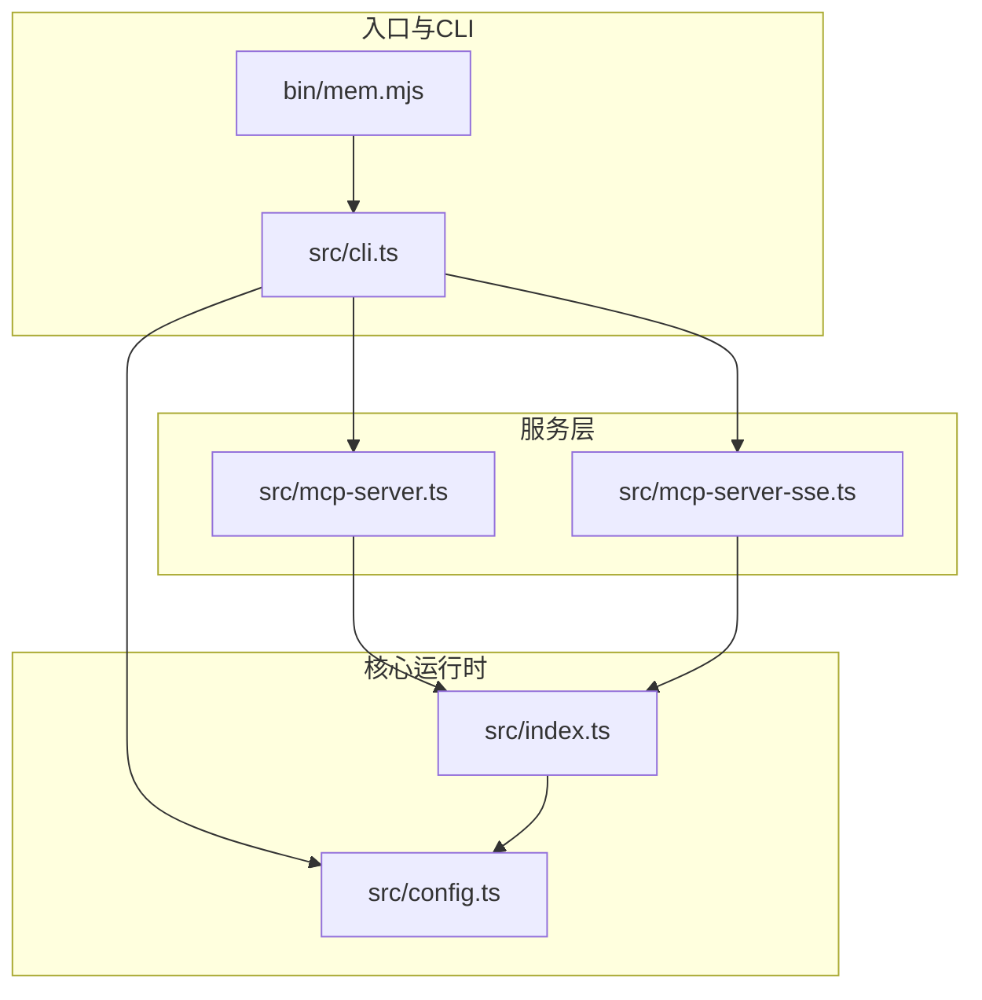
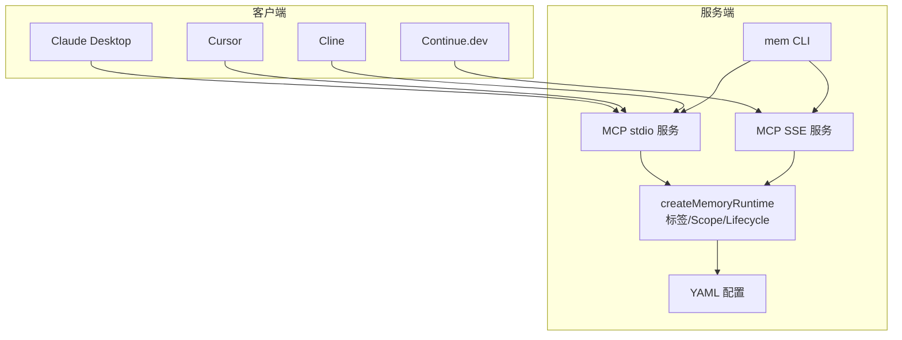
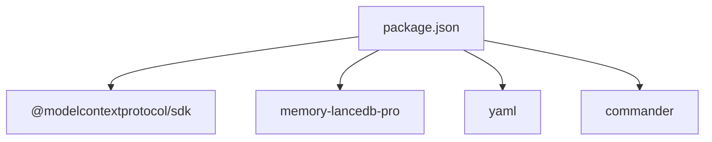

# 主要客户端配置

<cite>
**本文引用的文件**
- [README.md](file://README.md)
- [docs/USAGE_GUIDE.md](file://docs/USAGE_GUIDE.md)
- [package.json](file://package.json)
- [src/index.ts](file://src/index.ts)
- [src/mcp-server.ts](file://src/mcp-server.ts)
- [src/mcp-server-sse.ts](file://src/mcp-server-sse.ts)
- [src/config.ts](file://src/config.ts)
- [src/cli.ts](file://src/cli.ts)
- [bin/mem.mjs](file://bin/mem.mjs)
- [test/integration.test.mjs](file://test/integration.test.mjs)
</cite>

## 目录
1. [简介](#简介)
2. [项目结构](#项目结构)
3. [核心组件](#核心组件)
4. [架构总览](#架构总览)
5. [详细组件分析](#详细组件分析)
6. [依赖分析](#依赖分析)
7. [性能考虑](#性能考虑)
8. [故障排查指南](#故障排查指南)
9. [结论](#结论)
10. [附录](#附录)

## 简介
本指南面向希望在主流 AI 客户端（Claude Desktop、Cursor、Cline、Continue.dev）中集成 memory-lancedb-mcp 的用户，提供从安装、配置到连接测试与多客户端场景管理的完整操作手册。项目支持两种 MCP 传输模式：
- stdio 模式：适合本地客户端（Claude Desktop、Cursor、Cline 等）
- SSE 模式：适合远程访问与多客户端共享（Continue.dev）

此外，项目提供多项目隔离（Scope）能力，既可在单实例中区分不同项目，也可通过多个服务实例实现强隔离。

## 项目结构
该项目采用“入口脚本 + 服务层 + 配置层 + CLI”的分层组织方式：
- 入口脚本：bin/mem.mjs 将 CLI 命令映射到 dist/cli.js
- CLI 层：src/cli.ts 定义 mem 命令族（serve、list、search、stats、config、doctor、scope 等）
- 服务层：src/mcp-server.ts（stdio）与 src/mcp-server-sse.ts（SSE）分别实现 MCP 服务
- 配置层：src/config.ts 负责 YAML 配置解析、环境变量展开与默认值
- 核心运行时：src/index.ts 提供 createMemoryRuntime、标签处理、Scope 注入与生命周期桥接

图表来源
- [bin/mem.mjs:1-8](file://bin/mem.mjs#L1-L8)
- [src/cli.ts:1-617](file://src/cli.ts#L1-L617)
- [src/mcp-server.ts:1-306](file://src/mcp-server.ts#L1-L306)
- [src/mcp-server-sse.ts:1-405](file://src/mcp-server-sse.ts#L1-L405)
- [src/index.ts:1-515](file://src/index.ts#L1-L515)
- [src/config.ts:1-312](file://src/config.ts#L1-L312)

章节来源
- [package.json:1-46](file://package.json#L1-L46)
- [README.md:1-738](file://README.md#L1-L738)

## 核心组件
- 配置系统（YAML + 环境变量）
  - 默认配置路径：~/.config/memory-mcp/config.yaml
  - 支持 ${ENV_VAR} 语法展开
  - 关键节：embedding、storagePath、defaultScope、smartExtraction 等
- MCP 服务（stdio）
  - 通过 StdioServerTransport 与客户端通信
  - 暴露工具集与生命周期工具
- MCP 服务（SSE）
  - 提供 /sse（SSE 流）与 /message（JSON-RPC）端点
  - 适合远程/多客户端场景
- CLI 命令
  - mem serve：启动 stdio 或 SSE 服务
  - mem list/search/stats/store/delete：内存管理与检索
  - mem config：初始化/显示/校验配置
  - mem doctor：健康检查
  - mem scope：Scope 列表与删除

章节来源
- [src/config.ts:1-312](file://src/config.ts#L1-L312)
- [src/mcp-server.ts:1-306](file://src/mcp-server.ts#L1-L306)
- [src/mcp-server-sse.ts:1-405](file://src/mcp-server-sse.ts#L1-L405)
- [src/cli.ts:1-617](file://src/cli.ts#L1-L617)
- [README.md:171-276](file://README.md#L171-L276)

## 架构总览
memory-lancedb-mcp 通过 FakeOpenClawApi 包装 memory-lancedb-pro 的工具，并将其注册到 MCP 服务中。CLI 与 MCP 服务共享同一运行时，确保行为一致。

图表来源
- [src/mcp-server.ts:1-306](file://src/mcp-server.ts#L1-L306)
- [src/mcp-server-sse.ts:1-405](file://src/mcp-server-sse.ts#L1-L405)
- [src/index.ts:1-515](file://src/index.ts#L1-L515)
- [src/config.ts:1-312](file://src/config.ts#L1-L312)
- [src/cli.ts:1-617](file://src/cli.ts#L1-L617)

## 详细组件分析

### 配置系统与 YAML 格式
- 默认配置文件路径：~/.config/memory-mcp/config.yaml
- 支持环境变量展开：${ENV_VAR}
- 关键字段
  - embedding.apiKey：必填
  - embedding.model/baseURL/dimensions：嵌入模型与端点
  - storagePath：数据库存储路径
  - defaultScope：默认 Scope
  - smartExtraction：智能提取开关与模型
- 初始化
  - mem config init：创建默认配置文件
  - mem config show：显示配置（密钥脱敏）
  - mem config path/validate：查看路径与校验

章节来源
- [src/config.ts:1-312](file://src/config.ts#L1-L312)
- [src/cli.ts:367-444](file://src/cli.ts#L367-L444)
- [README.md:675-714](file://README.md#L675-L714)

### stdio 模式（本地客户端）
- 传输：StdioServerTransport
- 启动：mem serve（默认）
- 适用客户端：Claude Desktop、Cursor、Cline
- 优势：零网络开销，延迟低
- 注意：跨 Scope 模式下 agentId="system"，锁定 Scope 模式下 agentId=scope

章节来源
- [src/mcp-server.ts:1-306](file://src/mcp-server.ts#L1-L306)
- [README.md:171-208](file://README.md#L171-L208)

### SSE 模式（远程/多客户端）
- 传输：HTTP + SSE
- 端点
  - GET /sse：SSE 事件流
  - POST /message：JSON-RPC 请求
  - GET /health：健康检查
- 启动：mem serve --sse --port 3100 --host 0.0.0.0
- 适用客户端：Continue.dev（通过 URL 配置）

章节来源
- [src/mcp-server-sse.ts:1-405](file://src/mcp-server-sse.ts#L1-L405)
- [README.md:257-276](file://README.md#L257-L276)

### 多项目隔离（Scope）与生命周期
- Scope 注入
  - 跨 Scope 模式：默认写入 global，可跨 scope 检索
  - 锁定 Scope 模式：强制所有操作限定在 --scope 内，拒绝不一致请求
- 生命周期工具
  - _lifecycle_auto_recall：会话前自动召回
  - _lifecycle_auto_capture：会话后自动提取
  - _lifecycle_session_end：会话结束清理
- 标签系统
  - 通过 text 前缀【标签:x,y】嵌入，不修改父项目 schema
  - recall/list 时自动剥离前缀，支持软过滤

章节来源
- [src/index.ts:1-515](file://src/index.ts#L1-L515)
- [README.md:426-544](file://README.md#L426-L544)

### 客户端配置清单与示例

#### Claude Desktop
- 配置文件位置（macOS）
  - ~/Library/Application Support/Claude/claude_desktop_config.json
- stdio 配置要点
  - command：node
  - args：指向 bin/mem.mjs serve
  - env：嵌入 API Key
- 启用项目隔离
  - args 中将 --scope 与其值拆分为两个元素（如 ["--scope", "project:myapp"]）
- SSE 配置要点
  - 在 mcpServers.memory 中使用 url 指向 http://host:port/sse

章节来源
- [README.md:173-208](file://README.md#L173-L208)

#### Cursor
- 配置文件位置
  - .cursor/mcp.json
- 配置要点
  - mcpServers.memory：包含 command、args、env
  - args 中将 --scope 与其值拆分为两个元素

章节来源
- [README.md:209-225](file://README.md#L209-L225)

#### Cline（VS Code 插件）
- 配置要点
  - 在 MCP Server 设置中添加
  - command 指向 bin/mem.mjs
  - args 中包含 serve 与 --scope（如适用）
  - env 中包含嵌入 API Key

章节来源
- [README.md:227-237](file://README.md#L227-L237)

#### Continue.dev
- 配置位置
  - .continue/config.json
- stdio 配置要点
  - mcpServers：数组，包含 name、type(stdio)、command、args、env
- SSE 配置要点
  - type 可省略（默认 stdio），或显式指定
  - url 指向 http://host:port/sse

章节来源
- [README.md:239-255](file://README.md#L239-L255)

### 传输模式差异与选择
- stdio
  - 本地进程间通信，延迟低，适合本地客户端
  - args 中 --scope 与值必须拆分为两个元素
- SSE
  - HTTP + SSE，适合远程/多客户端
  - 客户端通过 url 指向 /sse
  - 注意主机绑定与网络安全（host 与防火墙）

章节来源
- [README.md:257-276](file://README.md#L257-L276)
- [src/mcp-server.ts:1-306](file://src/mcp-server.ts#L1-L306)
- [src/mcp-server-sse.ts:1-405](file://src/mcp-server-sse.ts#L1-L405)

### 连接测试与常见问题排查
- 健康检查
  - mem doctor：检查配置文件、解析、API Key、插件加载与工具列表
- MCP 协议握手
  - mem doctor --mcp：测试握手
- 常见问题
  - 配置缺失：mem config init 与 mem config validate
  - API Key 未设置：检查环境变量或配置文件
  - Scope 不匹配：确认服务端 --scope 与客户端请求一致
  - 标签白名单：需重启服务后生效

章节来源
- [src/cli.ts:445-517](file://src/cli.ts#L445-L517)
- [docs/USAGE_GUIDE.md:618-667](file://docs/USAGE_GUIDE.md#L618-L667)

### 多客户端场景下的配置管理策略与最佳实践
- 多项目隔离
  - 通过多个服务实例分别绑定不同 --scope
  - args 中 --scope 与其值必须拆分为两个元素
- SSE 远程模式
  - 为每个项目启动独立 SSE 服务（不同端口）
  - 客户端通过 url 指向对应 /sse
- 安全与隔离
  - 锁定 Scope 模式下，拒绝跨 Scope 请求
  - SSE 模式下注意 host 绑定与网络暴露风险
- 配置复用
  - 使用环境变量（如 OPENAI_API_KEY）在各客户端共享
  - 通过 MEM_CONFIG_PATH 指定统一配置路径

章节来源
- [README.md:500-531](file://README.md#L500-L531)
- [docs/USAGE_GUIDE.md:520-540](file://docs/USAGE_GUIDE.md#L520-L540)

## 依赖分析
- 运行时依赖
  - @modelcontextprotocol/sdk：MCP 协议实现
  - memory-lancedb-pro：核心记忆引擎（通过 jiti 直接加载）
  - yaml：YAML 解析
  - commander：CLI 参数解析
- 开发依赖
  - typescript、@sinclair/typebox 等

图表来源
- [package.json:26-31](file://package.json#L26-L31)

章节来源
- [package.json:1-46](file://package.json#L1-L46)

## 性能考虑
- SSE 模式
  - 适合远程/多客户端，但存在网络延迟
  - 建议合理设置 limit 与 tags 以减少响应体积
- stdio 模式
  - 本地通信，延迟更低
  - 适合本地开发与高频交互
- Scope 与标签
  - 合理使用 tags 与 category 可降低检索成本
  - 避免过长 text 导致嵌入与检索开销增大

## 故障排查指南
- 服务启动失败
  - mem doctor：检查配置、API Key、插件加载
- 嵌入模型错误
  - 确认 embedding.model 与 baseURL 正确
  - Ollama 本地需确认服务已启动
- 召回不准确
  - 使用“实体名 + 技术术语”格式构造 query
  - 增加记忆内容长度与关键词密度
- Scope 权限拒绝
  - 确认服务端 --scope 与客户端请求一致
  - 跨 Scope 模式下，memory_store 不指定 scope 会写入 global

章节来源
- [docs/USAGE_GUIDE.md:618-667](file://docs/USAGE_GUIDE.md#L618-L667)

## 结论
memory-lancedb-mcp 为 AI 客户端提供了稳定、可扩展的记忆服务。通过 stdio 与 SSE 两种传输模式，既能满足本地低延迟需求，也能支持远程与多客户端场景。结合 Scope 隔离与标签系统，可在多项目环境中实现精细化的记忆管理与安全隔离。建议在生产环境中优先采用 SSE + 锁定 Scope 的组合，并通过 mem doctor 与 CLI 命令进行持续健康检查与配置管理。

## 附录
- CLI 命令速查
  - mem serve：启动 stdio 或 SSE 服务
  - mem list/search/stats/store/delete：内存管理与检索
  - mem config init/show/path/validate：配置管理
  - mem doctor：健康检查
  - mem scope list/delete：Scope 管理

章节来源
- [src/cli.ts:111-611](file://src/cli.ts#L111-L611)
- [docs/USAGE_GUIDE.md:43-164](file://docs/USAGE_GUIDE.md#L43-L164)