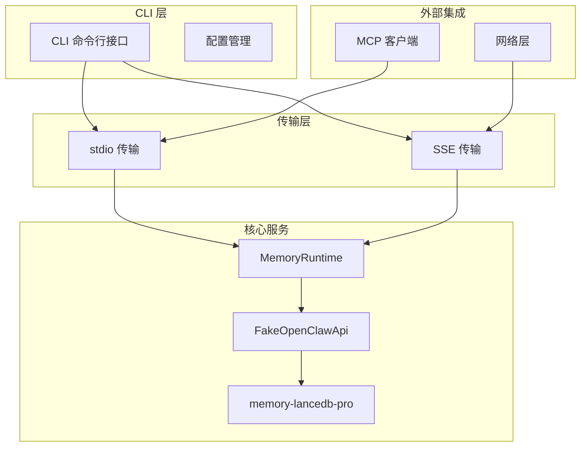
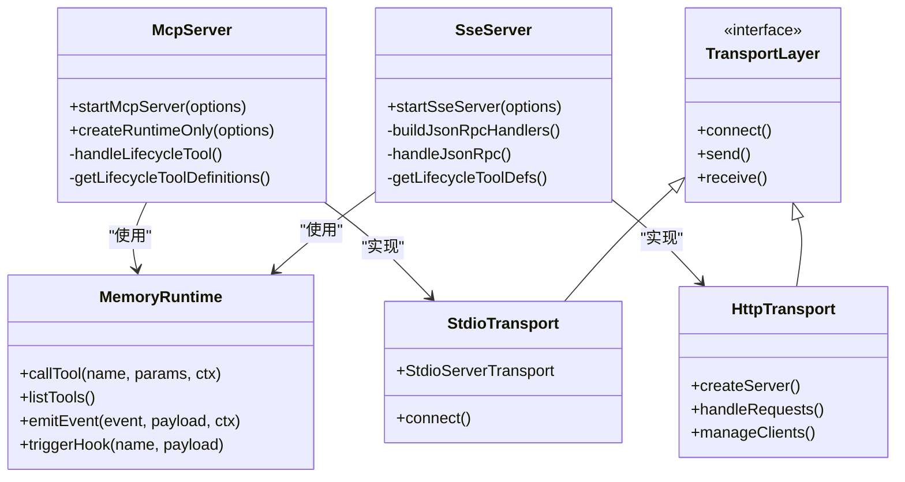
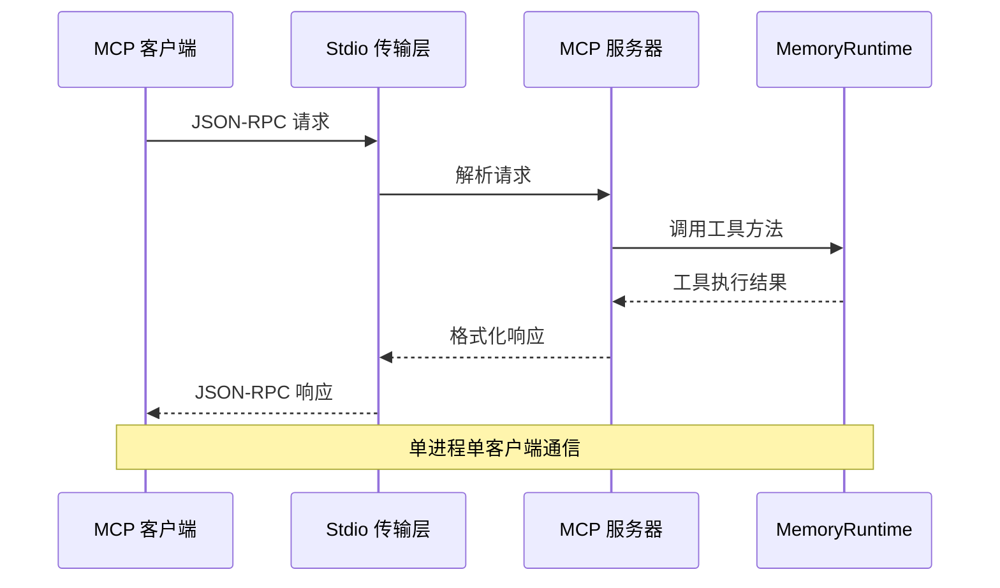
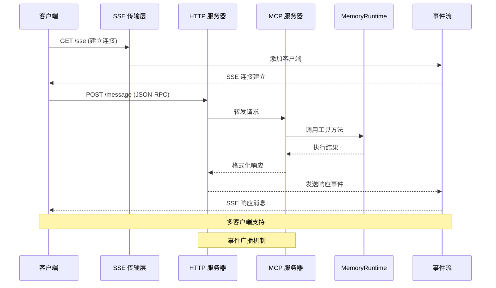
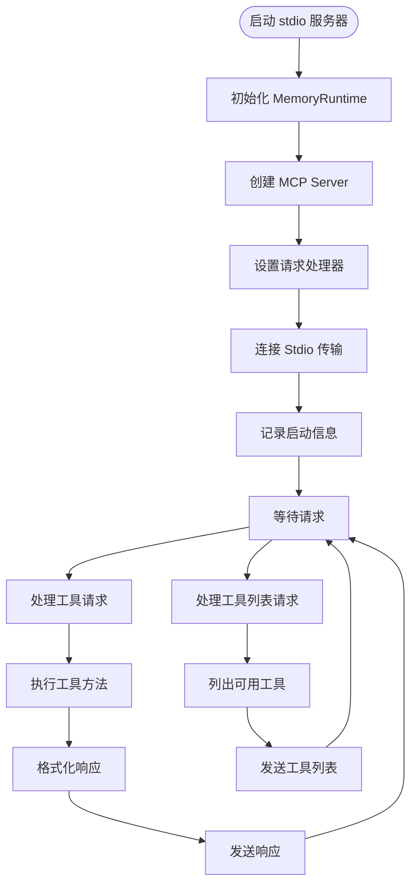
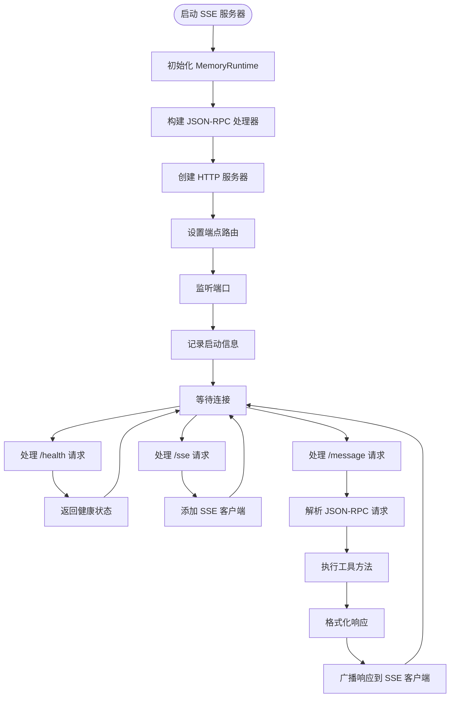
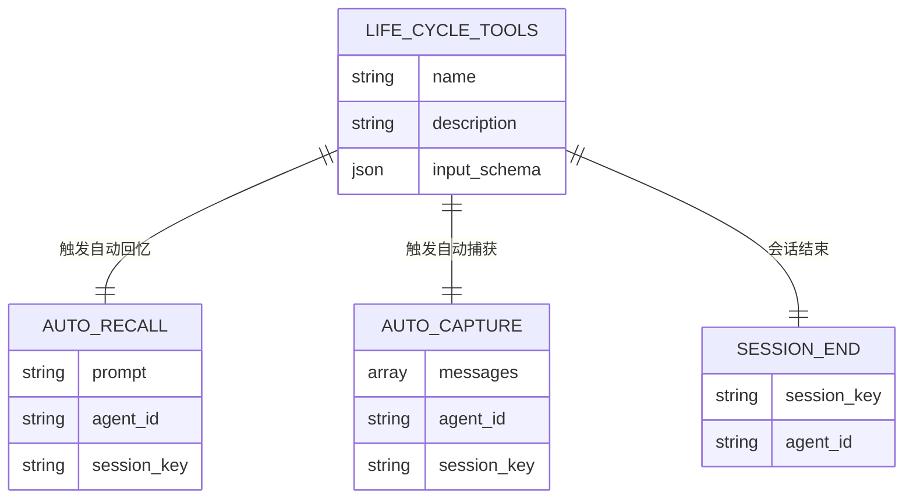
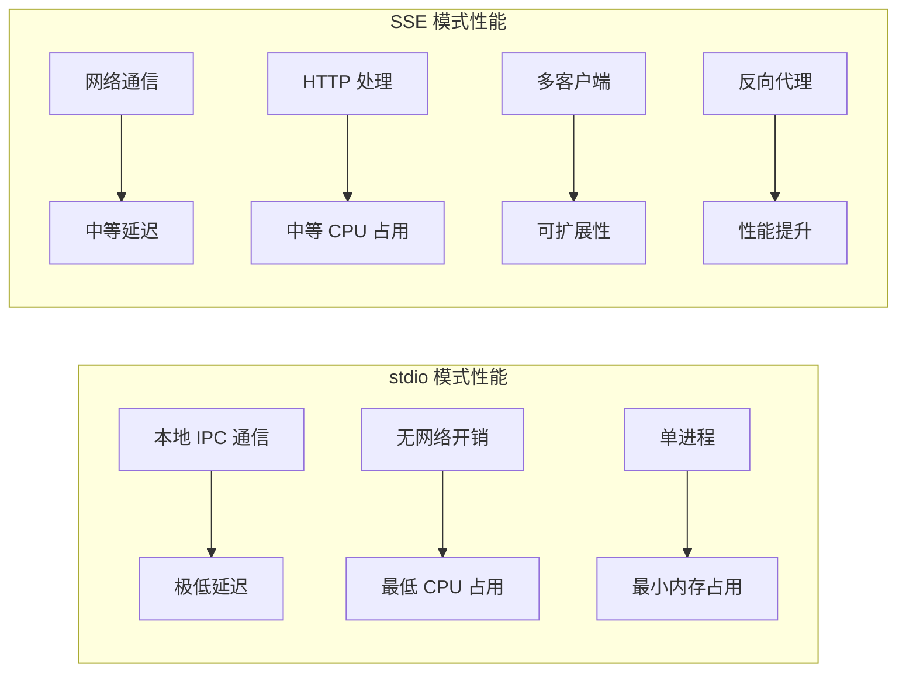
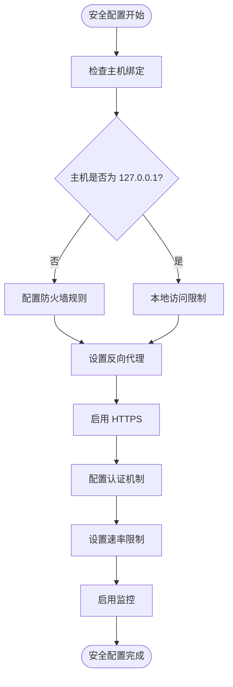

# 传输模式对比

<cite>
**本文档引用的文件**
- [src/mcp-server.ts](file://src/mcp-server.ts)
- [src/mcp-server-sse.ts](file://src/mcp-server-sse.ts)
- [src/cli.ts](file://src/cli.ts)
- [src/config.ts](file://src/config.ts)
- [src/index.ts](file://src/index.ts)
- [src/lifecycle.ts](file://src/lifecycle.ts)
- [bin/mem.mjs](file://bin/mem.mjs)
- [package.json](file://package.json)
- [README.md](file://README.md)
</cite>

## 目录
1. [简介](#简介)
2. [项目结构概览](#项目结构概览)
3. [核心组件对比](#核心组件对比)
4. [架构概览](#架构概览)
5. [详细组件分析](#详细组件分析)
6. [配置差异详解](#配置差异详解)
7. [性能对比分析](#性能对比分析)
8. [安全考虑](#安全考虑)
9. [故障排除指南](#故障排除指南)
10. [监控建议](#监控建议)
11. [结论](#结论)

## 简介

memory-lancedb-mcp 提供了两种传输模式来支持不同的使用场景：

- **stdio 模式**：标准输入输出传输，专为本地 MCP 客户端设计
- **SSE 模式**：服务器发送事件传输，支持远程连接和多客户端

这两种模式都基于相同的内存管理核心，但在部署方式、性能特征和安全考虑方面存在显著差异。

## 项目结构概览



**图表来源**
- [src/cli.ts:105-169](file://src/cli.ts#L105-L169)
- [src/mcp-server.ts:43-140](file://src/mcp-server.ts#L43-L140)
- [src/mcp-server-sse.ts:57-209](file://src/mcp-server-sse.ts#L57-L209)

## 核心组件对比

### 传输模式对比矩阵

| 特性 | stdio 模式 | SSE 模式 |
|------|------------|----------|
| **传输协议** | 标准输入输出 | HTTP + Server-Sent Events |
| **部署位置** | 本地进程 | 网络服务 |
| **客户端类型** | 本地 MCP 客户端 | 远程/多客户端 |
| **端口绑定** | 无端口需求 | TCP 端口 (默认 3100) |
| **主机绑定** | 无主机绑定 | 可配置主机地址 |
| **并发支持** | 单客户端 | 多客户端支持 |
| **远程访问** | 不支持 | 支持 |
| **反向代理** | 不需要 | 推荐使用 |
| **安全控制** | 本地权限 | 网络安全 |

### 核心架构差异



**图表来源**
- [src/mcp-server.ts:28-148](file://src/mcp-server.ts#L28-L148)
- [src/mcp-server-sse.ts:31-209](file://src/mcp-server-sse.ts#L31-L209)
- [src/index.ts:95-498](file://src/index.ts#L95-L498)

## 架构概览

### stdio 模式架构

stdio 模式采用传统的 MCP 协议，通过标准输入输出进行通信：



**图表来源**
- [src/mcp-server.ts:127-140](file://src/mcp-server.ts#L127-L140)
- [src/mcp-server.ts:86-124](file://src/mcp-server.ts#L86-L124)

### SSE 模式架构

SSE 模式提供 HTTP 服务，支持多客户端连接：



**图表来源**
- [src/mcp-server-sse.ts:109-172](file://src/mcp-server-sse.ts#L109-L172)
- [src/mcp-server-sse.ts:129-167](file://src/mcp-server-sse.ts#L129-L167)

## 详细组件分析

### stdio 服务器实现

stdio 服务器使用 Model Context Protocol SDK 的 StdioServerTransport：



**图表来源**
- [src/mcp-server.ts:43-140](file://src/mcp-server.ts#L43-L140)
- [src/mcp-server.ts:61-77](file://src/mcp-server.ts#L61-L77)

### SSE 服务器实现

SSE 服务器提供完整的 HTTP 服务端点：



**图表来源**
- [src/mcp-server-sse.ts:57-209](file://src/mcp-server-sse.ts#L57-L209)
- [src/mcp-server-sse.ts:82-172](file://src/mcp-server-sse.ts#L82-L172)

## 配置差异详解

### 命令行参数对比

| 参数 | stdio 模式 | SSE 模式 | 说明 |
|------|------------|----------|------|
| `--sse` | ❌ 不支持 | ✅ 支持 | 切换到 SSE 模式 |
| `--port` | ❌ 无意义 | ✅ 3100 (默认) | SSE 端口号 |
| `--host` | ❌ 无意义 | ✅ 127.0.0.1 (默认) | 绑定主机地址 |
| `--scope` | ✅ 支持 | ✅ 支持 | 项目隔离作用域 |
| `--config` | ✅ 支持 | ✅ 支持 | 配置文件路径 |
| `--quiet` | ✅ 支持 | ✅ 支持 | 抑制调试日志 |

### 配置文件差异

#### stdio 模式配置特点
- 无网络配置需求
- 本地权限控制
- 简化的启动流程
- 更低的资源消耗

#### SSE 模式配置特点
- 需要端口和主机配置
- 支持跨网络访问
- 多客户端连接管理
- 需要考虑网络安全

### 端口和主机绑定

#### SSE 端口配置
- **默认端口**：3100
- **有效范围**：1-65535
- **验证逻辑**：启动时进行端口有效性检查

#### 主机绑定配置
- **默认绑定**：127.0.0.1 (本地回环)
- **生产环境**：0.0.0.0 (所有接口)
- **安全考虑**：生产环境建议使用防火墙限制

### 生命周期工具支持

两种模式都支持相同的生命周期工具：



**图表来源**
- [src/mcp-server.ts:154-233](file://src/mcp-server.ts#L154-L233)
- [src/mcp-server-sse.ts:336-376](file://src/mcp-server-sse.ts#L336-L376)

## 性能对比分析

### 性能特征对比

| 方面 | stdio 模式 | SSE 模式 |
|------|------------|----------|
| **启动时间** | 极快 (直接进程启动) | 较慢 (端口绑定 + 服务器启动) |
| **内存占用** | 最小 (单进程) | 中等 (HTTP 服务器) |
| **CPU 占用** | 最低 (无网络开销) | 中等 (网络处理) |
| **延迟** | 最低 (本地 IPC) | 中等 (网络往返) |
| **吞吐量** | 有限 (单客户端) | 较高 (多客户端) |
| **扩展性** | 有限 | 良好 |

### 性能优化建议

#### stdio 模式优化
- 使用 `--quiet` 参数减少日志开销
- 合理设置 `--scope` 避免不必要的跨作用域检查
- 在本地开发环境中使用 stdio 模式

#### SSE 模式优化
- 使用反向代理 (Nginx/Apache) 提升并发处理能力
- 配置适当的超时和连接池设置
- 实施适当的缓存策略
- 使用负载均衡器支持水平扩展

### 性能影响因素



## 安全考虑

### stdio 模式安全特性
- **本地访问**：仅限本地进程访问
- **权限控制**：操作系统级文件描述符权限
- **数据隔离**：进程间天然隔离
- **审计简单**：日志集中管理

### SSE 模式安全风险
- **网络暴露**：可能被网络上的恶意客户端访问
- **认证缺失**：默认无内置认证机制
- **授权复杂**：需要实现细粒度访问控制
- **中间人攻击**：网络传输可能被拦截

### 安全加固建议

#### 生产环境部署
1. **使用反向代理**
   - Nginx/Apache 作为 SSL 终止点
   - 实现基本认证和速率限制
   
2. **网络隔离**
   - 使用防火墙限制访问源
   - 部署在专用 VPC 或容器网络中
   
3. **访问控制**
   - 实现 API 密钥认证
   - 添加请求签名验证
   - 配置 CORS 策略

#### 配置安全


**图表来源**
- [src/mcp-server-sse.ts:174-190](file://src/mcp-server-sse.ts#L174-L190)
- [src/mcp-server-sse.ts:82-92](file://src/mcp-server-sse.ts#L82-L92)

## 故障排除指南

### 常见问题诊断

#### stdio 模式问题
1. **启动失败**
   - 检查 Node.js 版本要求 (≥18.0.0)
   - 验证配置文件路径正确性
   - 确认嵌入 API 密钥有效

2. **工具不可用**
   - 使用 `--dry-run` 参数验证配置
   - 检查 `doctor` 命令输出
   - 验证内存-lancedb-pro 插件安装

#### SSE 模式问题
1. **端口占用**
   ```bash
   # 检查端口占用
   netstat -tulpn | grep 3100
   
   # 更换端口
   mem serve --sse --port 3101
   ```

2. **无法访问**
   - 检查防火墙设置
   - 验证主机绑定配置
   - 确认反向代理正常运行

### 调试工具

#### 健康检查
```bash
# 基础健康检查
mem doctor

# MCP 协议握手测试
mem doctor --mcp

# 配置验证
mem config validate
```

#### 日志分析
- **stdio 模式**：stderr 输出调试信息
- **SSE 模式**：控制台输出启动信息和警告

### 性能监控

#### 关键指标
1. **连接指标**
   - 当前连接数
   - 连接成功率
   - 连接断开率

2. **响应指标**
   - 平均响应时间
   - 95th 百分位延迟
   - 错误率统计

3. **资源指标**
   - CPU 使用率
   - 内存占用
   - 磁盘 I/O

## 监控建议

### 基础监控

#### stdio 模式监控
```bash
# 监控进程状态
ps aux | grep mem

# 查看日志
tail -f /var/log/syslog | grep mem

# 监控资源使用
top -p $(pgrep -f "mem serve")
```

#### SSE 模式监控
```bash
# 监控端口状态
netstat -tulpn | grep :3100

# 查看 HTTP 服务器日志
tail -f /var/log/nginx/error.log

# 监控连接数
ss -s
```

### 高级监控

#### APM 工具集成
1. **Prometheus 指标**
   - 自定义指标收集
   - 健康检查端点
   - 性能基准测试

2. **分布式追踪**
   - 跨服务请求追踪
   - 性能瓶颈识别
   - 错误根因分析

#### 告警配置
- **连接数告警**：超过阈值触发
- **响应时间告警**：延迟异常检测
- **错误率告警**：异常错误模式
- **资源告警**：CPU/内存/磁盘使用

## 结论

memory-lancedb-mcp 的两种传输模式各有优势：

### 选择指导原则

#### 选择 stdio 模式当：
- 使用本地 MCP 客户端 (Claude Desktop, Cursor, Cline)
- 开发和测试环境
- 资源受限的环境
- 简单的部署需求

#### 选择 SSE 模式当：
- 需要远程访问
- 多客户端场景
- 生产环境部署
- 需要反向代理支持
- 容器化部署

### 最佳实践建议

1. **开发阶段**：使用 stdio 模式，便于快速迭代
2. **测试阶段**：使用 SSE 模式，模拟生产环境
3. **生产阶段**：使用 SSE 模式 + 反向代理 + 安全加固
4. **性能优化**：根据使用场景选择合适的传输模式
5. **监控告警**：建立完善的监控体系

两种模式都提供了相同的核心功能，关键在于根据具体使用场景选择最适合的部署方式。无论选择哪种模式，都应该遵循安全最佳实践，特别是在生产环境中部署 SSE 模式时。