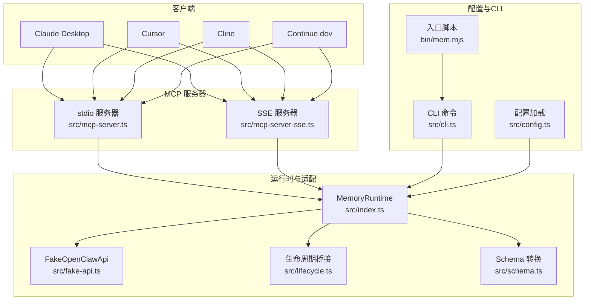
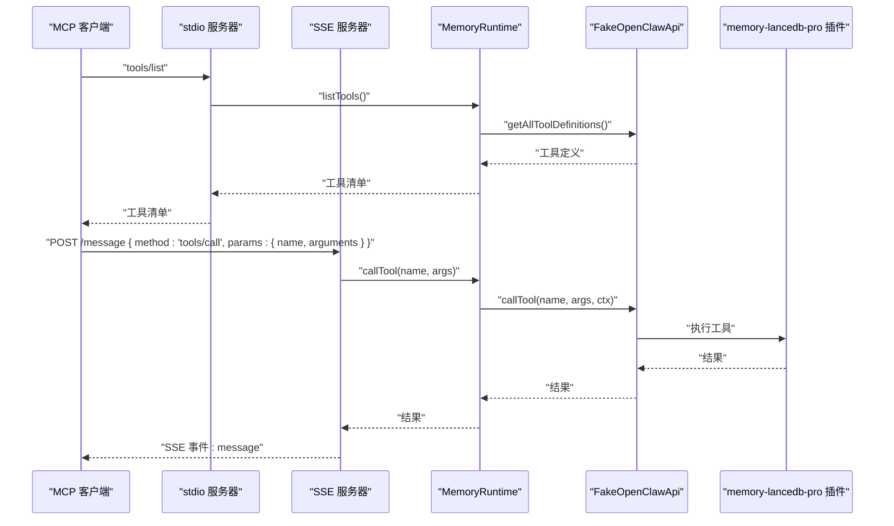
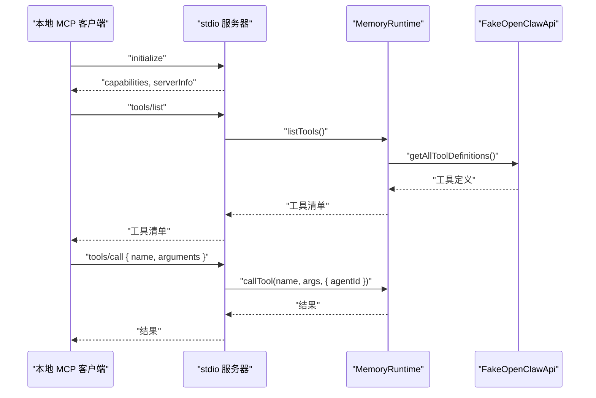
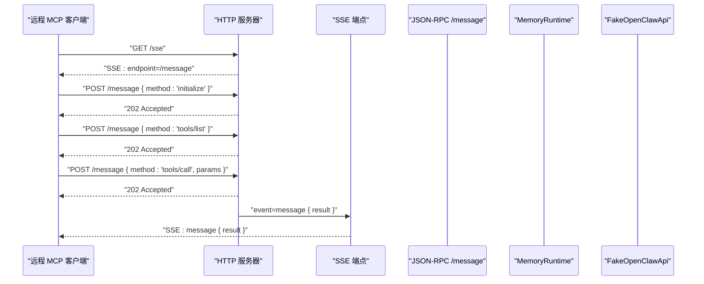
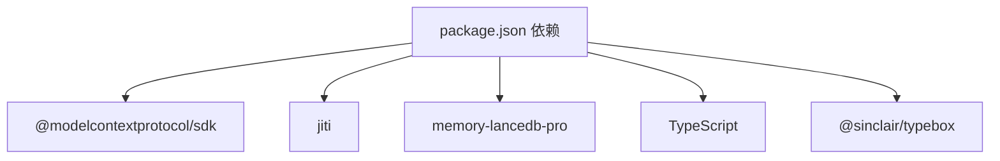

# 客户端集成

<cite>
**本文引用的文件**
- [README.md](file://README.md)
- [package.json](file://package.json)
- [src/index.ts](file://src/index.ts)
- [src/mcp-server.ts](file://src/mcp-server.ts)
- [src/mcp-server-sse.ts](file://src/mcp-server-sse.ts)
- [src/config.ts](file://src/config.ts)
- [src/cli.ts](file://src/cli.ts)
- [src/fake-api.ts](file://src/fake-api.ts)
- [src/lifecycle.ts](file://src/lifecycle.ts)
- [src/schema.ts](file://src/schema.ts)
- [bin/mem.mjs](file://bin/mem.mjs)
- [docs/USAGE_GUIDE.md](file://docs/USAGE_GUIDE.md)
- [test/integration.test.mjs](file://test/integration.test.mjs)
</cite>

## 目录
1. [简介](#简介)
2. [项目结构](#项目结构)
3. [核心组件](#核心组件)
4. [架构总览](#架构总览)
5. [详细组件分析](#详细组件分析)
6. [依赖分析](#依赖分析)
7. [性能考虑](#性能考虑)
8. [故障排除指南](#故障排除指南)
9. [结论](#结论)
10. [附录](#附录)

## 简介
本指南面向需要在 Claude Desktop、Cursor、Cline、Continue.dev 等主流 MCP 客户端中集成 memory-lancedb-mcp 的开发者与运维人员。文档涵盖：
- stdio 与 SSE 两种传输模式的客户端配置差异与选择建议
- 不同客户端的 MCP 服务器配置文件格式与参数设置
- 多客户端场景下的配置管理策略
- 客户端连接测试与故障排除方法
- 客户端与服务器的通信协议与消息格式
- 自定义 MCP 客户端开发指南与最佳实践

## 项目结构
该项目围绕“MCP 服务器桥接”展开，核心模块如下：
- 服务器层：提供 stdio 与 SSE 两种传输模式的 MCP 服务器
- 运行时层：封装 memory-lancedb-pro 插件，提供工具注册、生命周期桥接与配置解析
- CLI 层：提供 mem 命令，支持服务启动、工具调用、配置管理与健康检查
- 配置层：YAML 配置文件解析与环境变量扩展
- 适配层：FakeOpenClawApi 将插件接口适配为 MCP 可用的工具与事件系统

图表来源
- [src/mcp-server.ts:1-306](file://src/mcp-server.ts#L1-L306)
- [src/mcp-server-sse.ts:1-405](file://src/mcp-server-sse.ts#L1-L405)
- [src/index.ts:1-515](file://src/index.ts#L1-L515)
- [src/fake-api.ts:1-318](file://src/fake-api.ts#L1-L318)
- [src/lifecycle.ts:1-178](file://src/lifecycle.ts#L1-L178)
- [src/schema.ts:1-151](file://src/schema.ts#L1-L151)
- [src/config.ts:1-312](file://src/config.ts#L1-L312)
- [src/cli.ts:1-617](file://src/cli.ts#L1-L617)
- [bin/mem.mjs:1-8](file://bin/mem.mjs#L1-L8)

章节来源
- [README.md:1-738](file://README.md#L1-L738)
- [package.json:1-46](file://package.json#L1-L46)

## 核心组件
- MemoryRuntime：统一的运行时工厂，负责加载配置、创建 FakeOpenClawApi、注册插件、暴露工具调用与生命周期事件，并支持标签预处理与作用域注入
- FakeOpenClawApi：适配层，捕获插件注册的工具、事件与钩子，供 MCP 服务器使用
- MCP 服务器（stdio/SSE）：分别通过标准输入输出与 HTTP SSE 通道暴露工具与生命周期事件
- CLI（mem）：命令行入口，支持服务启动、工具调用、配置管理与健康检查
- 配置系统：YAML 配置文件解析、环境变量扩展、默认配置模板与初始化

章节来源
- [src/index.ts:1-515](file://src/index.ts#L1-L515)
- [src/fake-api.ts:1-318](file://src/fake-api.ts#L1-L318)
- [src/mcp-server.ts:1-306](file://src/mcp-server.ts#L1-L306)
- [src/mcp-server-sse.ts:1-405](file://src/mcp-server-sse.ts#L1-L405)
- [src/cli.ts:1-617](file://src/cli.ts#L1-L617)
- [src/config.ts:1-312](file://src/config.ts#L1-L312)

## 架构总览
客户端通过 stdio 或 SSE 与 MCP 服务器交互。stdio 适合本地桌面客户端（Claude Desktop、Cursor、Cline），SSE 适合远程或多客户端场景（Continue.dev、Docker/WSL 环境）。

图表来源
- [src/mcp-server.ts:1-306](file://src/mcp-server.ts#L1-L306)
- [src/mcp-server-sse.ts:1-405](file://src/mcp-server-sse.ts#L1-L405)
- [src/index.ts:1-515](file://src/index.ts#L1-L515)
- [src/fake-api.ts:1-318](file://src/fake-api.ts#L1-L318)

## 详细组件分析

### stdio 传输模式（本地客户端）
- 适用场景：Claude Desktop、Cursor、Cline 等本地桌面 MCP 客户端
- 启动方式：mem serve（默认 stdio）
- 关键特性：
  - 通过标准输入输出与客户端交换 MCP 协议消息
  - 默认抑制调试日志，避免污染 stdio
  - 支持跨 scope 模式与锁定 scope 模式
  - 自动注入生命周期工具（_lifecycle_auto_recall、_lifecycle_auto_capture、_lifecycle_session_end）

图表来源
- [src/mcp-server.ts:1-306](file://src/mcp-server.ts#L1-L306)
- [src/index.ts:1-515](file://src/index.ts#L1-L515)

章节来源
- [src/mcp-server.ts:1-306](file://src/mcp-server.ts#L1-L306)
- [src/index.ts:1-515](file://src/index.ts#L1-L515)

### SSE 传输模式（远程/多客户端）
- 适用场景：Continue.dev、Docker/WSL、远程服务器等需要 HTTP 访问的场景
- 启动方式：mem serve --sse
- 关键特性：
  - 暴露 /sse（SSE 事件流）与 /message（JSON-RPC）端点
  - 支持跨 scope 模式与锁定 scope 模式
  - 提供 /health 健康检查端点
  - 单客户端 stdio-like 会话下，响应通过 SSE 发送给首个连接的客户端

图表来源
- [src/mcp-server-sse.ts:1-405](file://src/mcp-server-sse.ts#L1-L405)
- [src/index.ts:1-515](file://src/index.ts#L1-L515)

章节来源
- [src/mcp-server-sse.ts:1-405](file://src/mcp-server-sse.ts#L1-L405)
- [src/index.ts:1-515](file://src/index.ts#L1-L515)

### 客户端配置与参数设置
- Claude Desktop
  - 配置文件位置：~/Library/Application Support/Claude/claude_desktop_config.json（macOS）
  - 关键字段：mcpServers.memory.{command,args,env}
  - 项目隔离：args 中 --scope 与值必须拆分为两个数组元素
- Cursor
  - 配置文件：.cursor/mcp.json
  - 关键字段：mcpServers.memory.{command,args,env}
- Cline（VS Code 插件）
  - 配置字段：mcpServers.memory.{command,args,env}
- Continue.dev
  - 配置文件：.continue/config.json
  - 关键字段：mcpServers[].{name,type,command,args,env}
  - type 可设为 "stdio"（默认）或 "sse"（URL 模式）
- SSE 模式（远程/多客户端）
  - 服务端：mem serve --sse --port 3100 --host 0.0.0.0
  - 客户端：mcpServers.memory.url=http://host:port/sse

章节来源
- [README.md:171-531](file://README.md#L171-L531)
- [docs/USAGE_GUIDE.md:508-518](file://docs/USAGE_GUIDE.md#L508-L518)

### 多客户端场景下的配置管理策略
- 为不同项目/租户提供独立的 MCP 服务器实例
- 使用 --scope 参数实现项目级内存隔离
- SSE 模式下通过不同端口或域名区分不同实例
- 使用环境变量隔离不同环境（开发/测试/生产）

章节来源
- [README.md:500-531](file://README.md#L500-L531)
- [docs/USAGE_GUIDE.md:520-539](file://docs/USAGE_GUIDE.md#L520-L539)

### 客户端连接测试与故障排除
- 健康检查：mem doctor
- 配置验证：mem config validate
- 工具列表预览：mem serve --dry-run
- SSE 健康端点：/health
- 常见问题：
  - 配置文件缺失或 apiKey 未设置
  - LanceDB 原生模块安装问题（Linux/WSL）
  - Scope 权限拒绝（锁定 scope 模式下请求的 scope 必须与服务端一致）

章节来源
- [src/cli.ts:448-517](file://src/cli.ts#L448-L517)
- [src/mcp-server-sse.ts:96-106](file://src/mcp-server-sse.ts#L96-L106)
- [docs/USAGE_GUIDE.md:618-666](file://docs/USAGE_GUIDE.md#L618-L666)

### 通信协议与消息格式
- stdio 模式：遵循 MCP 协议的请求/响应格式，工具列表与调用通过标准输入输出传递
- SSE 模式：通过 /message 端点接收 JSON-RPC 方法调用，响应通过 SSE 事件 message 推送
- 生命周期工具：_lifecycle_auto_recall、_lifecycle_auto_capture、_lifecycle_session_end
- 工具输入参数：由 TypeBox schema 转换为 JSON Schema，MCP tools/list 返回

章节来源
- [src/mcp-server.ts:1-306](file://src/mcp-server.ts#L1-L306)
- [src/mcp-server-sse.ts:1-405](file://src/mcp-server-sse.ts#L1-L405)
- [src/schema.ts:1-151](file://src/schema.ts#L1-L151)
- [src/lifecycle.ts:1-178](file://src/lifecycle.ts#L1-L178)

### 自定义 MCP 客户端开发指南与最佳实践
- 选择传输模式：本地桌面优先 stdio；远程/多客户端使用 SSE
- 配置管理：使用环境变量与 YAML 配置分离敏感信息
- 生命周期集成：在发送用户提示前调用 _lifecycle_auto_recall，在会话结束时调用 _lifecycle_session_end
- 标签与过滤：利用 tags 参数进行软过滤，结合 category 与 limit 控制召回质量
- 错误处理：捕获 Scope mismatch、Access denied 等错误并引导用户修正

章节来源
- [src/index.ts:1-515](file://src/index.ts#L1-L515)
- [src/lifecycle.ts:1-178](file://src/lifecycle.ts#L1-L178)
- [docs/USAGE_GUIDE.md:392-421](file://docs/USAGE_GUIDE.md#L392-L421)

## 依赖分析
- 运行时依赖：@modelcontextprotocol/sdk（MCP 协议实现）、jiti（TS 直接加载）、memory-lancedb-pro（父项目）
- 开发依赖：TypeScript、@sinclair/typebox（schema 定义）
- CLI 与入口：bin/mem.mjs 作为 CLI 入口，调用 dist/cli.js

图表来源
- [package.json:26-31](file://package.json#L26-L31)

章节来源
- [package.json:1-46](file://package.json#L1-L46)

## 性能考虑
- stdio 模式：低延迟，适合本地客户端；避免在 stdio 中输出调试日志
- SSE 模式：支持多客户端并发，注意资源清理与优雅关闭
- 标签过滤：通过 BM25 前缀命中实现软过滤，必要时结合 category 与 limit
- Scope 隔离：锁定模式下 ACL 检查与 agentId 绕过逻辑减少不必要的访问开销

## 故障排除指南
- 启动失败：运行 mem doctor，检查配置文件存在性与 apiKey 设置
- 嵌入模型错误：核对 embedding.model 与 baseURL
- 召回不准确：优化 query 格式，增加内容长度与关键词唯一性
- Scope 权限：确认请求的 scope 与服务端 --scope 一致；跨 scope 模式下 memory_store 不指定 scope 会写入 global

章节来源
- [src/cli.ts:448-517](file://src/cli.ts#L448-L517)
- [docs/USAGE_GUIDE.md:618-666](file://docs/USAGE_GUIDE.md#L618-L666)

## 结论
memory-lancedb-mcp 提供了稳定、可扩展的 MCP 服务器实现，支持本地与远程多种客户端场景。通过 stdio 与 SSE 两种传输模式，结合标签系统与 Scope 隔离，能够满足从个人助手到企业级应用的多样化需求。建议在生产环境中优先使用 SSE 并配合环境变量与配置文件进行安全与可维护性管理。

## 附录
- 客户端配置示例与参数说明详见 README 与使用手册
- CLI 命令参考与健康检查工具详见 docs/USAGE_GUIDE.md 与 src/cli.ts

章节来源
- [README.md:171-531](file://README.md#L171-L531)
- [docs/USAGE_GUIDE.md:1-672](file://docs/USAGE_GUIDE.md#L1-L672)
- [src/cli.ts:1-617](file://src/cli.ts#L1-L617)