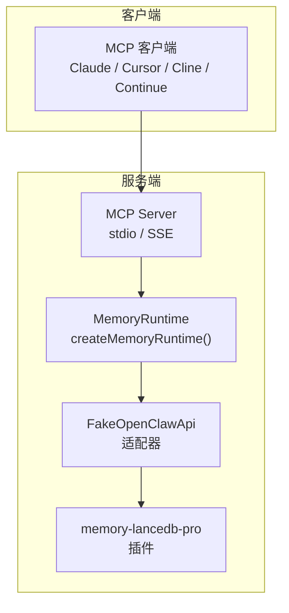
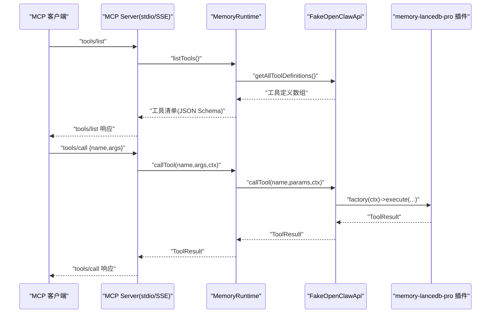
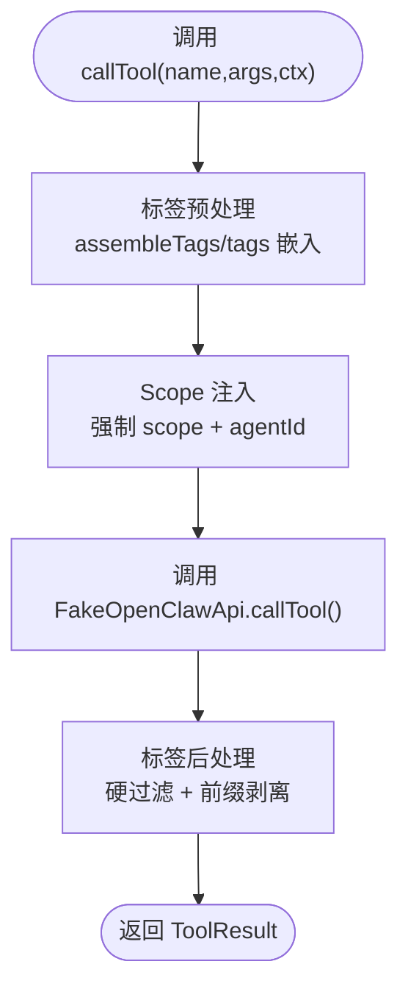
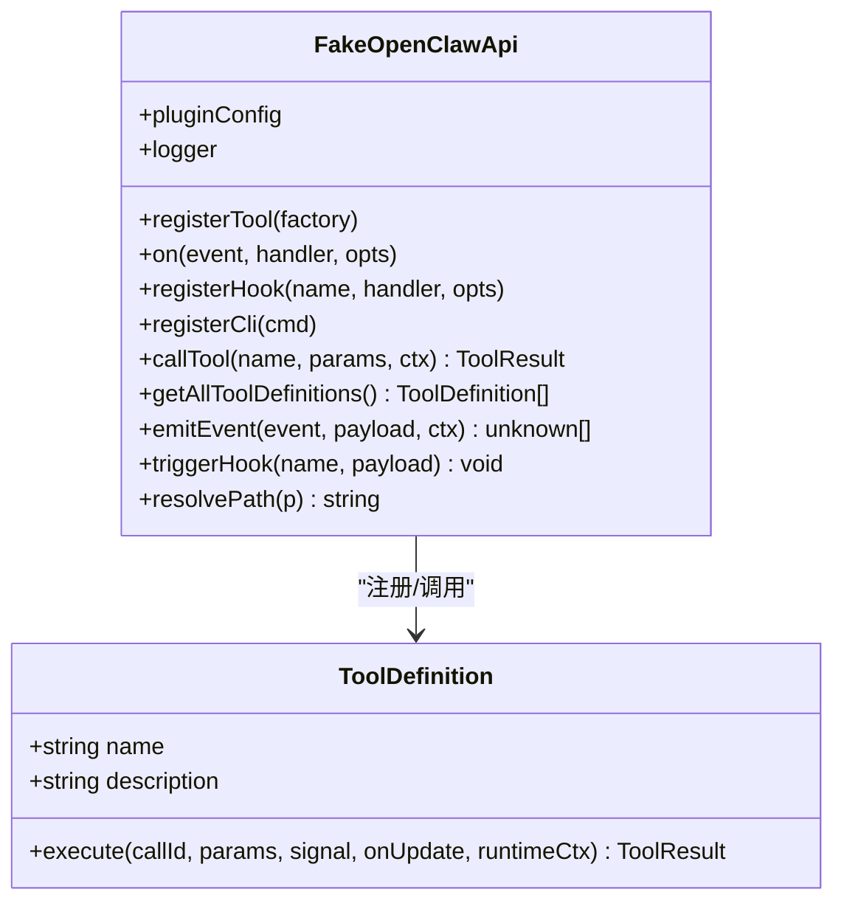
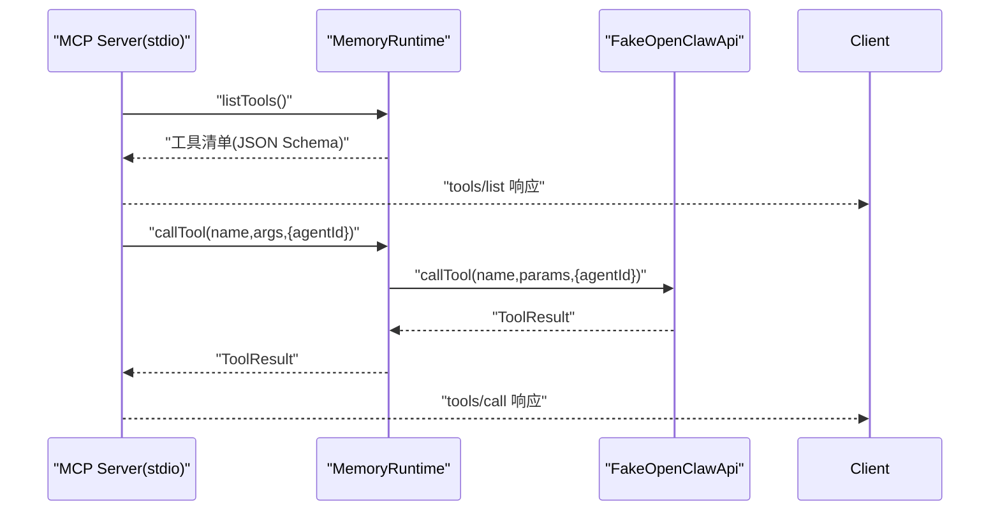
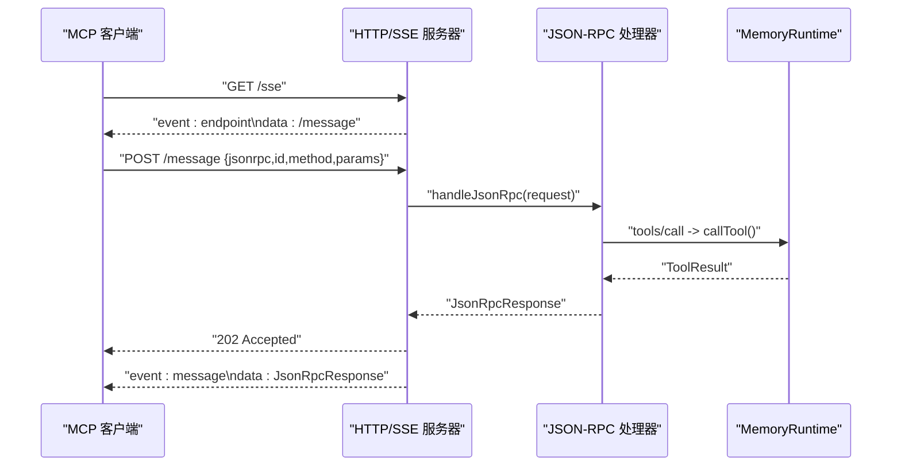
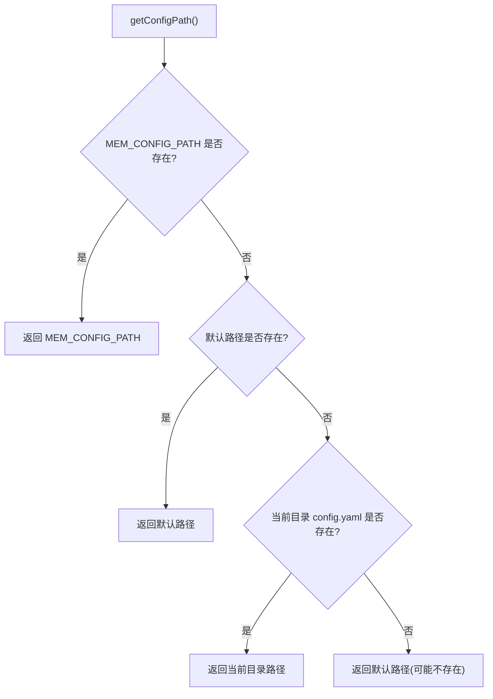
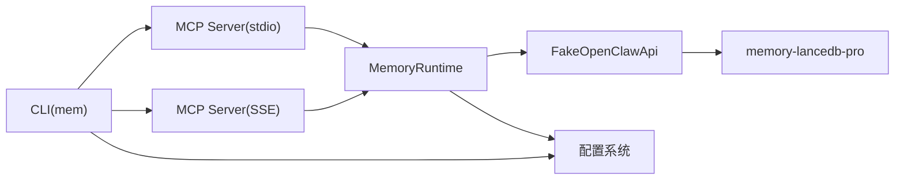

# 自定义客户端开发

<cite>
**本文引用的文件**
- [README.md](file://README.md)
- [package.json](file://package.json)
- [src/index.ts](file://src/index.ts)
- [src/mcp-server.ts](file://src/mcp-server.ts)
- [src/mcp-server-sse.ts](file://src/mcp-server-sse.ts)
- [src/fake-api.ts](file://src/fake-api.ts)
- [src/config.ts](file://src/config.ts)
- [src/schema.ts](file://src/schema.ts)
- [src/lifecycle.ts](file://src/lifecycle.ts)
- [src/cli.ts](file://src/cli.ts)
- [bin/mem.mjs](file://bin/mem.mjs)
- [test/integration.test.mjs](file://test/integration.test.mjs)
- [docs/USAGE_GUIDE.md](file://docs/USAGE_GUIDE.md)
</cite>

## 目录
1. [简介](#简介)
2. [项目结构](#项目结构)
3. [核心组件](#核心组件)
4. [架构总览](#架构总览)
5. [详细组件分析](#详细组件分析)
6. [依赖分析](#依赖分析)
7. [性能考虑](#性能考虑)
8. [故障排除指南](#故障排除指南)
9. [结论](#结论)
10. [附录](#附录)

## 简介
本指南面向希望基于 MCP（Model Context Protocol）协议开发自定义客户端的工程师。项目提供了 memory-lancedb-mcp 的完整实现，将 memory-lancedb-pro 的 17 个记忆工具桥接到 MCP 协议，并支持 stdio（本地）与 SSE（HTTP）两种传输模式。文档将从协议通信机制、消息格式、事件处理、连接建立、工具调用与响应处理等方面，系统讲解如何实现自定义 MCP 客户端，并给出架构设计原则、最佳实践、认证与错误处理策略、扩展与第三方工具集成建议，以及调试技巧。

## 项目结构
该项目采用“包装器 + 插件”的架构：通过 FakeOpenClawApi 适配 memory-lancedb-pro 的插件接口，再由 MCP Server 将工具暴露给客户端。CLI 提供命令行入口，支持本地 stdio 与远程 SSE 两种运行模式。

图表来源
- [src/mcp-server.ts:43-140](file://src/mcp-server.ts#L43-L140)
- [src/mcp-server-sse.ts:57-209](file://src/mcp-server-sse.ts#L57-L209)
- [src/index.ts:207-498](file://src/index.ts#L207-L498)
- [src/fake-api.ts:57-317](file://src/fake-api.ts#L57-L317)

章节来源
- [README.md:22-45](file://README.md#L22-L45)
- [src/index.ts:1-515](file://src/index.ts#L1-L515)
- [src/mcp-server.ts:1-306](file://src/mcp-server.ts#L1-L306)
- [src/mcp-server-sse.ts:1-405](file://src/mcp-server-sse.ts#L1-L405)
- [src/fake-api.ts:1-318](file://src/fake-api.ts#L1-L318)
- [src/cli.ts:1-617](file://src/cli.ts#L1-L617)

## 核心组件
- MemoryRuntime：封装配置加载、插件注册、工具调用、事件与钩子触发、生命周期桥接等能力。提供统一的工具调用入口与工具清单导出。
- FakeOpenClawApi：最小化实现 OpenClaw 插件 API，捕获工具工厂、事件处理器、钩子与 CLI 实例，供 MCP Server 使用。
- MCP Server（stdio/SSE）：根据传输类型创建 MCP Server，注册工具与生命周期工具，处理 ListToolsRequest 与 CallToolRequest。
- 配置系统：YAML 配置解析、环境变量扩展、默认配置初始化。
- Schema 转换：将 TypeBox schema 转换为 MCP 兼容的 JSON Schema。
- CLI：提供 mem 命令，支持 serve、list/search/stats/store/delete/config/doctor/scope 等子命令。

章节来源
- [src/index.ts:95-498](file://src/index.ts#L95-L498)
- [src/fake-api.ts:57-317](file://src/fake-api.ts#L57-L317)
- [src/mcp-server.ts:28-148](file://src/mcp-server.ts#L28-L148)
- [src/mcp-server-sse.ts:31-209](file://src/mcp-server-sse.ts#L31-L209)
- [src/config.ts:23-223](file://src/config.ts#L23-L223)
- [src/schema.ts:16-150](file://src/schema.ts#L16-L150)
- [src/cli.ts:17-617](file://src/cli.ts#L17-L617)

## 架构总览
MCP 客户端通过 stdio 或 SSE 与服务端交互。stdio 模式适合本地客户端（如 Claude Desktop、Cursor、Cline），SSE 模式适合远程或多客户端场景。服务端加载 MemoryRuntime，注册工具与生命周期工具，将工具调用映射为插件执行，并将结果转换为 MCP 响应格式。

图表来源
- [src/mcp-server.ts:61-124](file://src/mcp-server.ts#L61-L124)
- [src/mcp-server-sse.ts:246-287](file://src/mcp-server-sse.ts#L246-L287)
- [src/index.ts:248-453](file://src/index.ts#L248-L453)
- [src/fake-api.ts:217-235](file://src/fake-api.ts#L217-L235)

## 详细组件分析

### MemoryRuntime（运行时）
- 职责
  - 加载配置并注入 scope 隔离策略
  - 初始化 FakeOpenClawApi 并注册插件
  - 暴露工具调用、工具清单、事件与钩子触发、生命周期桥接、CLI 实例获取
- 关键特性
  - 标签预处理与后处理：对 memory_store/memory_recall/memory_list 的 tags 参数进行前缀嵌入与结果剥离
  - Scope 注入：当服务端指定 --scope 时，强制所有操作进入该 scope，并使用系统级 agentId 绕过 ACL
  - 合成工具：list_scopes 列出所有 scope 及其记忆数量
- 错误处理
  - Scope 不匹配时直接返回错误文本
  - 工具不存在或调用异常时返回标准化错误响应

图表来源
- [src/index.ts:313-453](file://src/index.ts#L313-L453)

章节来源
- [src/index.ts:207-498](file://src/index.ts#L207-L498)

### FakeOpenClawApi（适配器）
- 职责
  - 注册工具工厂、事件与钩子
  - 提供工具调用、工具定义查询、事件与钩子触发
  - 路径解析、日志记录
- 与插件交互
  - 通过工厂函数创建工具定义与执行器，调用 execute 执行插件逻辑
- 生命周期桥接
  - 通过 emitEvent 触发 before_prompt_build、agent_end、session_end 等事件

图表来源
- [src/fake-api.ts:57-317](file://src/fake-api.ts#L57-L317)

章节来源
- [src/fake-api.ts:57-317](file://src/fake-api.ts#L57-L317)

### MCP Server（stdio）
- 职责
  - 创建 Server，注册 tools/list 与 tools/call 处理器
  - 将 MemoryRuntime.listTools() 与生命周期工具合并返回
  - 将工具调用结果映射为 MCP 响应格式
- 传输与日志
  - 使用 StdioServerTransport，stderr 输出启动与警告信息
  - 跨 scope 模式下打印 agentId="system" 的警告

图表来源
- [src/mcp-server.ts:61-124](file://src/mcp-server.ts#L61-L124)

章节来源
- [src/mcp-server.ts:43-140](file://src/mcp-server.ts#L43-L140)

### MCP Server（SSE）
- 职责
  - 提供 /sse 与 /message 端点，遵循 MCP SSE 规范
  - JSON-RPC 方法映射：initialize、tools/list、tools/call
  - SSE 事件：endpoint（/message）、message（响应）
- 传输与健康检查
  - /health 健康检查
  - 支持 CORS 与优雅关闭

图表来源
- [src/mcp-server-sse.ts:82-172](file://src/mcp-server-sse.ts#L82-L172)
- [src/mcp-server-sse.ts:292-330](file://src/mcp-server-sse.ts#L292-L330)

章节来源
- [src/mcp-server-sse.ts:57-209](file://src/mcp-server-sse.ts#L57-L209)

### 配置系统
- 配置加载顺序：MEM_CONFIG_PATH > ~/.config/memory-mcp/config.yaml > ./config.yaml > 默认配置
- 环境变量扩展：${VAR} 语法，未设置时发出警告
- 默认模板：包含 dbPath、embedding、autoCapture/autoRecall、smartExtraction、retrieval、scopes 等关键字段
- CLI 配置命令：init/show/path/validate

图表来源
- [src/config.ts:107-121](file://src/config.ts#L107-L121)

章节来源
- [src/config.ts:167-223](file://src/config.ts#L167-L223)

### Schema 转换
- 将 TypeBox schema 清洗为 MCP 兼容的 JSON Schema
- 处理 properties、required、items、oneOf/anyOf/allOf 等字段
- 确保顶层为 object 类型

章节来源
- [src/schema.ts:45-150](file://src/schema.ts#L45-L150)

### 生命周期桥接
- 提供 triggerAutoRecall、triggerAutoCapture、triggerSessionEnd、triggerMessageReceived
- 将 OpenClaw 生命周期事件映射为可调用的 MCP 工具
- 支持 agentId 与 sessionKey 上下文

章节来源
- [src/lifecycle.ts:52-177](file://src/lifecycle.ts#L52-L177)

### CLI（mem 命令）
- serve：启动 stdio 或 SSE 服务器，支持 --scope、--dry-run、--sse、--port/--host、--quiet
- list/search/stats/store/delete：对工具调用进行封装，统一 agentId="system" 以绕过 ACL
- config：init/show/path/validate
- doctor：健康检查
- scope：list/delete

章节来源
- [src/cli.ts:114-617](file://src/cli.ts#L114-L617)
- [bin/mem.mjs:1-8](file://bin/mem.mjs#L1-L8)

## 依赖分析
- 依赖关系
  - MemoryRuntime 依赖 FakeOpenClawApi 与配置系统
  - MCP Server 依赖 MemoryRuntime
  - CLI 依赖 MCP Server 与配置系统
- 外部依赖
  - @modelcontextprotocol/sdk：MCP 协议实现
  - memory-lancedb-pro：记忆引擎插件
  - yaml、commander、jiti

图表来源
- [src/cli.ts:18-27](file://src/cli.ts#L18-L27)
- [src/mcp-server.ts:8-15](file://src/mcp-server.ts#L8-L15)
- [src/mcp-server-sse.ts:11-25](file://src/mcp-server-sse.ts#L11-L25)
- [src/index.ts:9-12](file://src/index.ts#L9-L12)
- [package.json:26-32](file://package.json#L26-L32)

章节来源
- [package.json:1-46](file://package.json#L1-L46)

## 性能考虑
- 检索性能
  - 混合检索（向量 + BM25）与权重配置影响召回质量与速度
  - 合理设置 limit、filterNoise、minScore 等参数
- IO 与并发
  - SSE 模式支持多客户端，注意资源与连接数控制
  - stdio 模式单进程内核，适合本地客户端
- 内存与缓存
  - 标签前缀嵌入与剥离为纯文本处理，开销较小
  - 建议在客户端侧缓存工具清单与常用上下文

[本节为通用指导，无需具体文件引用]

## 故障排除指南
- 配置问题
  - 配置文件缺失或解析失败：使用 mem doctor 与 mem config validate
  - API Key 未设置或环境变量未导出：检查 embedding.apiKey 与对应环境变量
- 服务启动失败
  - stdio 模式：检查 stderr 输出的启动与警告信息
  - SSE 模式：确认端口与主机绑定，查看 /health 状态
- 工具调用错误
  - Scope 不匹配：服务端 --scope 与请求 scope 不一致时会被拒绝
  - 工具不存在或参数错误：检查 tools/list 返回的 JSON Schema
- 标签校验失败
  - normalizeTags 对非法字符立即抛错，需修正标签格式

章节来源
- [src/cli.ts:454-517](file://src/cli.ts#L454-L517)
- [src/mcp-server.ts:130-139](file://src/mcp-server.ts#L130-L139)
- [src/mcp-server-sse.ts:174-190](file://src/mcp-server-sse.ts#L174-L190)
- [src/index.ts:41-52](file://src/index.ts#L41-L52)

## 结论
本项目为自定义 MCP 客户端开发提供了完整的参考实现：从协议通信、消息格式、事件处理到连接建立、工具调用与响应处理，均已在 stdio 与 SSE 两种传输模式下得到验证。通过 MemoryRuntime、FakeOpenClawApi 与 MCP Server 的清晰分层，开发者可以快速扩展工具、集成第三方能力，并在多项目隔离、标签系统、生命周期桥接等方面获得生产级实践指导。

[本节为总结，无需具体文件引用]

## 附录

### MCP 协议要点与消息格式
- 工具清单
  - tools/list 返回工具数组，包含 name、description、inputSchema
  - inputSchema 由 TypeBox schema 转换而来
- 工具调用
  - tools/call 请求包含 name 与 arguments
  - 响应包含 content 数组，元素为 { type, text }，text 为字符串
- SSE 规范
  - endpoint 事件提供 /message URL
  - message 事件承载 JSON-RPC 响应
  - 通知（无 id）需静默处理

章节来源
- [src/mcp-server.ts:61-124](file://src/mcp-server.ts#L61-L124)
- [src/mcp-server-sse.ts:109-172](file://src/mcp-server-sse.ts#L109-L172)
- [src/mcp-server-sse.ts:292-330](file://src/mcp-server-sse.ts#L292-L330)
- [src/schema.ts:16-150](file://src/schema.ts#L16-L150)

### 连接建立与握手
- stdio
  - 使用 StdioServerTransport，服务端 connect 后开始监听
  - 启动日志输出到 stderr，工具列表输出到 stdout
- SSE
  - /sse 提供 endpoint 事件
  - /message 接收 JSON-RPC 请求并返回 202
  - /health 提供健康检查

章节来源
- [src/mcp-server.ts:127-128](file://src/mcp-server.ts#L127-L128)
- [src/mcp-server-sse.ts:109-172](file://src/mcp-server-sse.ts#L109-L172)

### 工具调用与响应处理
- 工具调用
  - MemoryRuntime.callTool 统一入口，支持标签预处理/后处理、Scope 注入、生命周期工具处理
  - MCP Server 将 ToolResult 映射为 MCP 响应
- 生命周期工具
  - _lifecycle_auto_recall/_lifecycle_auto_capture/_lifecycle_session_end
  - 通过 FakeOpenClawApi.emitEvent 触发

章节来源
- [src/index.ts:248-453](file://src/index.ts#L248-L453)
- [src/mcp-server.ts:86-124](file://src/mcp-server.ts#L86-L124)
- [src/mcp-server-sse.ts:263-287](file://src/mcp-server-sse.ts#L263-L287)

### 认证与错误处理策略
- 认证
  - 通过配置文件 embedding.apiKey 与环境变量扩展实现
  - CLI 提供 config show 与 doctor 健康检查
- 错误处理
  - 工具调用异常返回包含 isError 标记的响应
  - Scope 不匹配与未知工具等场景返回明确错误文本
  - SSE JSON-RPC 400/404 状态码与错误对象

章节来源
- [src/config.ts:167-223](file://src/config.ts#L167-L223)
- [src/cli.ts:394-443](file://src/cli.ts#L394-L443)
- [src/mcp-server.ts:117-123](file://src/mcp-server.ts#L117-L123)
- [src/mcp-server-sse.ts:158-166](file://src/mcp-server-sse.ts#L158-L166)
- [src/mcp-server-sse.ts:310-329](file://src/mcp-server-sse.ts#L310-L329)

### 架构设计原则与最佳实践
- 分层解耦
  - MemoryRuntime 与 MCP Server 解耦，便于替换传输层
  - FakeOpenClawApi 作为适配层，屏蔽插件差异
- 可观测性
  - 通过 CLI 与日志输出启动与健康状态
  - SSE 模式提供 /health 与事件流监控
- 可扩展性
  - 通过 registerTool/registerHook/on 扩展工具与事件
  - 支持多项目隔离与标签系统
- 安全性
  - SSE 模式需结合反向代理与访问控制
  - 跨 scope 模式下谨慎授予 agentId="system" 权限

章节来源
- [src/index.ts:207-498](file://src/index.ts#L207-L498)
- [src/fake-api.ts:113-160](file://src/fake-api.ts#L113-L160)
- [src/mcp-server-sse.ts:174-190](file://src/mcp-server-sse.ts#L174-L190)

### 代码示例与调试技巧
- 示例路径
  - 启动服务：mem serve [--sse] [--scope] [--port] [--host]
  - 搜索记忆：mem search "<query>" [--limit] [--tags]
  - 列表查看：mem list [--limit] [--offset] [--tags]
  - 存储记忆：mem store "<text>" [--category] [--tags] [--importance] [--scope]
  - 健康检查：mem doctor [--mcp]
- 调试技巧
  - 使用 --dry-run 验证配置与工具清单
  - stdio 模式下观察 stderr 输出
  - SSE 模式下使用浏览器或 curl 测试 /sse 与 /message
  - 使用 list_scopes 与 scope list 查看 scope 状态

章节来源
- [src/cli.ts:114-617](file://src/cli.ts#L114-L617)
- [docs/USAGE_GUIDE.md:43-164](file://docs/USAGE_GUIDE.md#L43-L164)

### 扩展与第三方工具集成
- 工具扩展
  - 通过 registerTool 注册新的工具工厂
  - 使用 extractInputSchema 生成 MCP 兼容的 inputSchema
- 第三方集成
  - 通过 FakeOpenClawApi.registerHook/on 注入事件与钩子
  - 通过 CLI 与配置系统集成外部服务

章节来源
- [src/fake-api.ts:113-160](file://src/fake-api.ts#L113-L160)
- [src/schema.ts:136-150](file://src/schema.ts#L136-L150)
- [src/cli.ts:370-443](file://src/cli.ts#L370-L443)