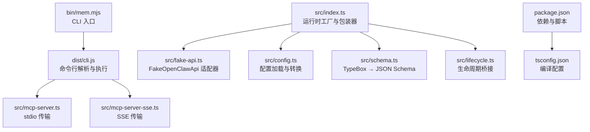
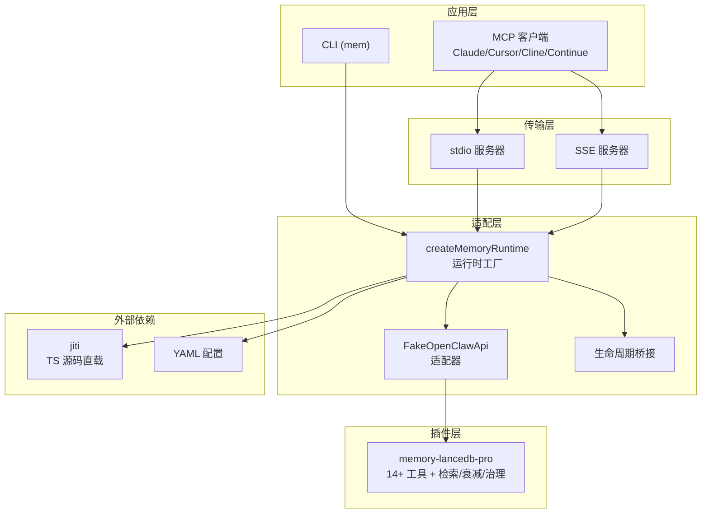
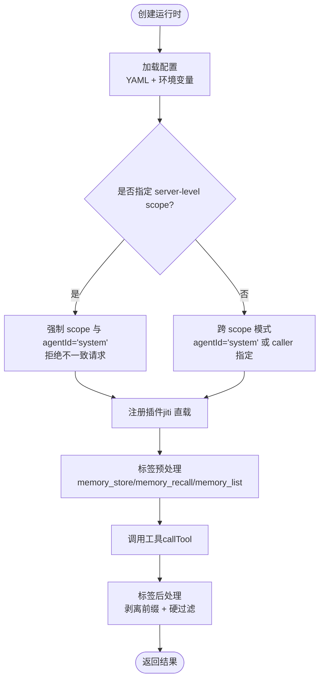
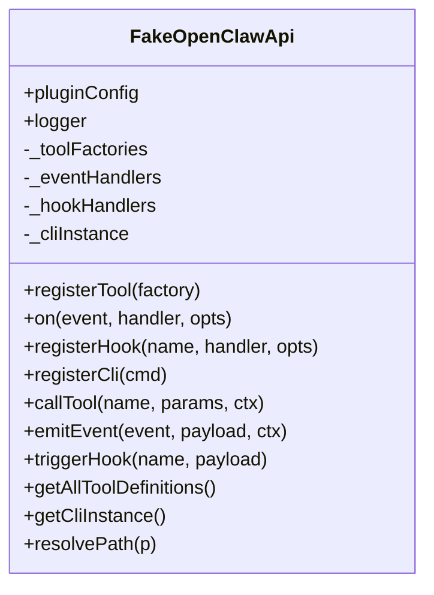
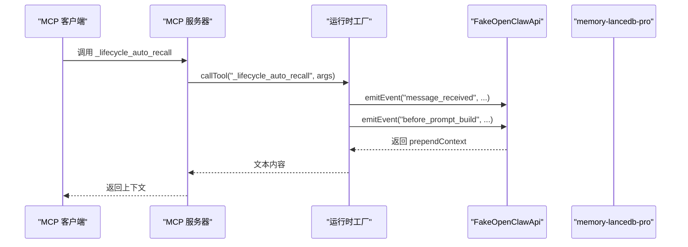
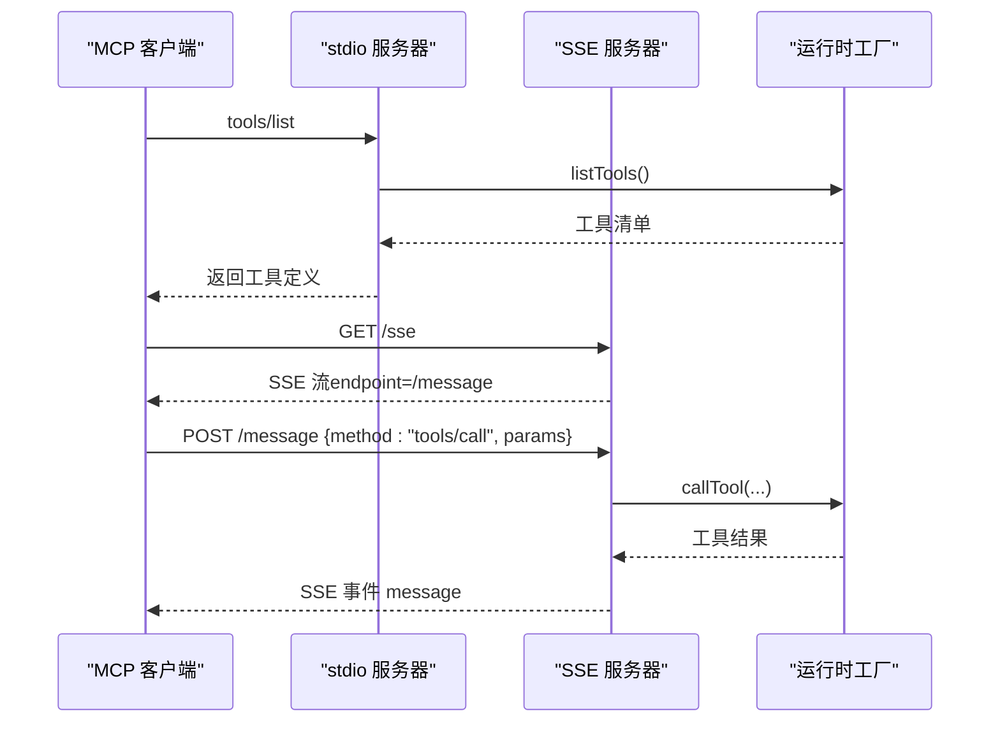
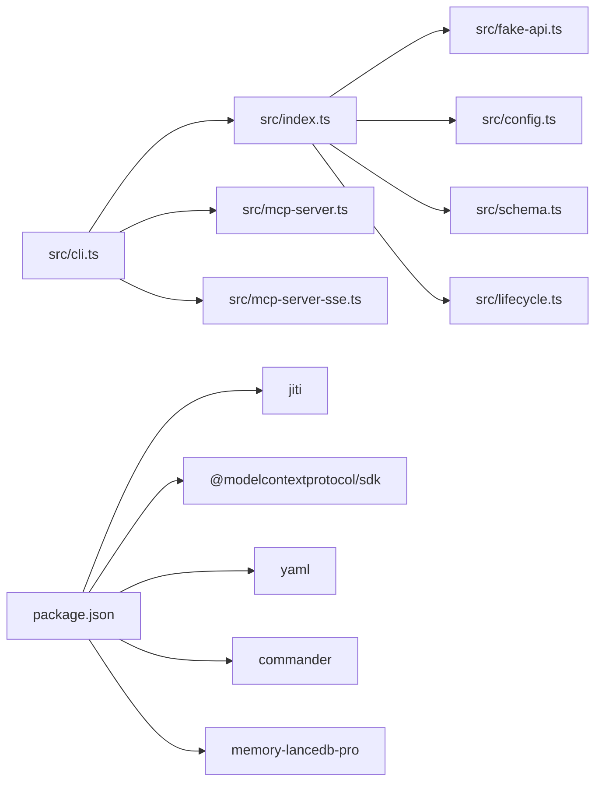

# 开发者指南

<cite>
**本文引用的文件**
- [README.md](file://README.md)
- [package.json](file://package.json)
- [tsconfig.json](file://tsconfig.json)
- [src/index.ts](file://src/index.ts)
- [src/cli.ts](file://src/cli.ts)
- [src/mcp-server.ts](file://src/mcp-server.ts)
- [src/mcp-server-sse.ts](file://src/mcp-server-sse.ts)
- [src/fake-api.ts](file://src/fake-api.ts)
- [src/config.ts](file://src/config.ts)
- [src/schema.ts](file://src/schema.ts)
- [src/lifecycle.ts](file://src/lifecycle.ts)
- [bin/mem.mjs](file://bin/mem.mjs)
- [test/integration.test.mjs](file://test/integration.test.mjs)
- [docs/USAGE_GUIDE.md](file://docs/USAGE_GUIDE.md)
</cite>

## 目录
1. [简介](#简介)
2. [项目结构](#项目结构)
3. [核心组件](#核心组件)
4. [架构总览](#架构总览)
5. [详细组件分析](#详细组件分析)
6. [依赖分析](#依赖分析)
7. [性能考虑](#性能考虑)
8. [故障排除指南](#故障排除指南)
9. [结论](#结论)
10. [附录](#附录)

## 简介
本项目为 memory-lancedb-pro 的 MCP 适配器，通过 jiti 直接加载 npm 包中的 TypeScript 源码，零侵入地桥接 Model Context Protocol（MCP），提供持久化长期记忆能力。核心特性包括：
- 17 个记忆工具（recall、store、forget、update、stats、list、debug、promote、archive、compact、explain_rank、self-improvement 等）
- 多项目隔离（--scope）
- 智能生命周期桥接（before_prompt_build、agent_end）
- 双传输模式（stdio、SSE）
- 零配置开箱即用，支持 YAML 配置与环境变量扩展
- CLI 管理工具（mem 命令）

## 项目结构
项目采用“入口 + 模块化”的组织方式，核心源码位于 src/，构建产物输出至 dist/，CLI 入口位于 bin/，测试位于 test/，使用手册位于 docs/。

图表来源
- [bin/mem.mjs](file://bin/mem.mjs)
- [src/index.ts](file://src/index.ts)
- [src/cli.ts](file://src/cli.ts)
- [src/mcp-server.ts](file://src/mcp-server.ts)
- [src/mcp-server-sse.ts](file://src/mcp-server-sse.ts)
- [src/fake-api.ts](file://src/fake-api.ts)
- [src/config.ts](file://src/config.ts)
- [src/schema.ts](file://src/schema.ts)
- [src/lifecycle.ts](file://src/lifecycle.ts)
- [package.json](file://package.json)
- [tsconfig.json](file://tsconfig.json)

章节来源
- [README.md](file://README.md)
- [package.json](file://package.json)
- [tsconfig.json](file://tsconfig.json)

## 核心组件
- 运行时工厂 createMemoryRuntime：负责加载配置、创建 FakeOpenClawApi、注册插件、注入标签与 Scope 处理逻辑，并提供工具调用、事件发射、钩子触发、CLI 实例导出等能力。
- FakeOpenClawApi：最小化适配器，捕获插件注册的工具、事件与钩子，并提供统一的 callTool、emitEvent、triggerHook 等接口。
- 配置系统：YAML 配置加载、环境变量扩展、默认值与校验、插件配置映射。
- Schema 转换：将 TypeBox 参数 schema 转换为 MCP 所需的 JSON Schema。
- 生命周期桥接：将 OpenClaw 的 before_prompt_build、agent_end 等事件映射为 MCP 可调用工具。
- MCP 服务器：stdio 与 SSE 两种传输模式，统一暴露工具与生命周期工具。
- CLI：mem 命令集合，覆盖服务启动、存储/召回/列表/统计、配置管理、健康检查、Scope 管理等。

章节来源
- [src/index.ts](file://src/index.ts)
- [src/fake-api.ts](file://src/fake-api.ts)
- [src/config.ts](file://src/config.ts)
- [src/schema.ts](file://src/schema.ts)
- [src/lifecycle.ts](file://src/lifecycle.ts)
- [src/mcp-server.ts](file://src/mcp-server.ts)
- [src/mcp-server-sse.ts](file://src/mcp-server-sse.ts)
- [src/cli.ts](file://src/cli.ts)

## 架构总览
整体架构围绕“运行时工厂 + FakeOpenClawApi 适配器 + MCP 服务器”展开，通过 jiti 直接加载 memory-lancedb-pro 的 TypeScript 源码，实现零修改接入。

图表来源
- [src/index.ts](file://src/index.ts)
- [src/fake-api.ts](file://src/fake-api.ts)
- [src/mcp-server.ts](file://src/mcp-server.ts)
- [src/mcp-server-sse.ts](file://src/mcp-server-sse.ts)
- [src/lifecycle.ts](file://src/lifecycle.ts)
- [README.md](file://README.md)

## 详细组件分析

### 运行时工厂与包装器（createMemoryRuntime）
- 职责
  - 加载 YAML 配置，支持环境变量扩展与默认值
  - 可选注入 server-level scope，实现多项目隔离
  - 创建 FakeOpenClawApi，注册插件（memory-lancedb-pro）
  - 注入标签预处理/后处理逻辑（memory_store/memory_recall/memory_list）
  - 注入 Scope 强制与拒绝逻辑（锁定模式下拒绝不一致 scope）
  - 暴露工具调用、事件发射、钩子触发、CLI 实例导出
- 关键流程
  - 标签处理：对 tag-aware 工具在调用前组装“【标签:x,y】”前缀，调用后剥离前缀并硬过滤匹配标签
  - Scope 处理：根据是否指定 server-level scope 决定 agentId 与 normalized.scope，拒绝不一致请求
  - 工具列表：合并插件工具与合成工具（如 list_scopes），并注入 tags 参数到相关工具的 inputSchema
- 优势
  - 零侵入：不修改父项目一行代码
  - 可组合：生命周期工具与常规工具统一暴露
  - 可观测：提供事件/钩子注册与查询

图表来源
- [src/index.ts](file://src/index.ts)

章节来源
- [src/index.ts](file://src/index.ts)

### FakeOpenClawApi 适配器
- 职责
  - 捕获插件注册的工具工厂、事件处理器、钩子处理器与 CLI 实例
  - 提供统一的 callTool、emitEvent、triggerHook、getToolDefinitions 等接口
  - 路径解析（支持 ~、相对路径、绝对路径）
- 设计要点
  - 工具工厂以 Map 存储，按名称检索
  - 事件/钩子按名称维护数组，支持优先级排序
  - 日志级别可抑制，便于 MCP 传输不污染协议输出

图表来源
- [src/fake-api.ts](file://src/fake-api.ts)

章节来源
- [src/fake-api.ts](file://src/fake-api.ts)

### 配置系统（YAML + 环境变量）
- 职责
  - 解析 YAML 配置，支持 ${ENV_VAR} 语法
  - 默认路径优先级：MEM_CONFIG_PATH > ~/.config/memory-mcp/config.yaml > ./config.yaml
  - 校验必需字段（如 embedding.apiKey），并提供默认模板初始化
  - 将 MemConfig 映射为插件期望的 pluginConfig
- 关键点
  - 环境变量扩展递归应用于对象结构
  - 支持 MEM_DB_PATH 等环境变量覆盖

章节来源
- [src/config.ts](file://src/config.ts)
- [README.md](file://README.md)

### Schema 转换（TypeBox → JSON Schema）
- 职责
  - 将 memory-lancedb-pro 使用的 TypeBox schema 转换为 MCP 所需的 JSON Schema
  - 清理 TypeBox 内部属性，保留 required、enum、items、oneOf/anyOf/allOf 等
- 用途
  - MCP tools/list 返回的 inputSchema 必须为标准 JSON Schema

章节来源
- [src/schema.ts](file://src/schema.ts)

### 生命周期桥接（before_prompt_build、agent_end 等）
- 职责
  - 将 OpenClaw 的生命周期事件映射为 MCP 工具（_lifecycle_auto_recall、_lifecycle_auto_capture、_lifecycle_session_end）
  - 提供 triggerAutoRecall、triggerAutoCapture、triggerSessionEnd 等函数，供 MCP 服务器与 CLI 使用
- 行为
  - auto-recall：缓存消息、触发 before_prompt_build，返回可前置到 prompt 的上下文
  - auto-capture：在会话结束或指定时机触发 agent_end，异步提取记忆
  - session_end：清理挂起状态

图表来源
- [src/mcp-server.ts](file://src/mcp-server.ts)
- [src/lifecycle.ts](file://src/lifecycle.ts)
- [src/index.ts](file://src/index.ts)

章节来源
- [src/lifecycle.ts](file://src/lifecycle.ts)
- [src/mcp-server.ts](file://src/mcp-server.ts)

### MCP 服务器（stdio 与 SSE）
- stdio 模式
  - 使用 @modelcontextprotocol/sdk 的 StdioServerTransport
  - 默认 agentId 为 "system"（跨 scope 模式），或使用 server-level scope（锁定模式）
  - 统一暴露工具与生命周期工具
- SSE 模式
  - 提供 /sse（SSE 流）与 /message（JSON-RPC）端点
  - 支持健康检查 /health
  - 与 stdio 模式共享生命周期工具定义与处理逻辑

图表来源
- [src/mcp-server.ts](file://src/mcp-server.ts)
- [src/mcp-server-sse.ts](file://src/mcp-server-sse.ts)

章节来源
- [src/mcp-server.ts](file://src/mcp-server.ts)
- [src/mcp-server-sse.ts](file://src/mcp-server-sse.ts)

### CLI（mem 命令）
- 职责
  - 服务启动：mem serve（stdio/SSE）、--scope、--dry-run、--sse、--port/--host、--quiet
  - 记忆操作：mem store、mem search、mem list、mem stats、mem delete
  - 配置管理：mem config init/show/path/validate
  - 健康检查：mem doctor
  - Scope 管理：mem scope list/delete
- 设计要点
  - 与运行时工厂解耦，通过 createMemoryRuntime 获取 runtime
  - SSE 模式下使用 startSseServer，stdio 模式下使用 startMcpServer
  - doctor 命令串联配置校验、插件加载、工具列表检查

章节来源
- [src/cli.ts](file://src/cli.ts)
- [bin/mem.mjs](file://bin/mem.mjs)

## 依赖分析
- 运行时依赖
  - @modelcontextprotocol/sdk：MCP 协议实现与传输（stdio/SSE）
  - jiti：直接加载 npm 包中的 TypeScript 源码
  - yaml：YAML 解析与序列化
  - commander：CLI 命令解析
  - memory-lancedb-pro：核心记忆引擎（通过 npm 安装）
- 开发依赖
  - typescript、@sinclair/typebox：类型与 schema 转换
- 构建与脚本
  - tsc：TypeScript 编译
  - node --test：集成测试

图表来源
- [src/index.ts](file://src/index.ts)
- [src/cli.ts](file://src/cli.ts)
- [package.json](file://package.json)

章节来源
- [package.json](file://package.json)

## 性能考虑
- jiti 直载的优势
  - 避免本地二次编译，减少构建时间与磁盘占用
  - 在开发阶段可直接使用 npm 包源码，提升迭代效率
- 传输模式选择
  - stdio：本地 MCP 客户端（Claude Desktop、Cursor、Cline）首选，延迟低
  - SSE：远程/多客户端场景，注意网络与并发控制
- Scope 与 ACL
  - 锁定模式下使用 agentId="system" 绕过 ACL，减少权限检查开销
  - 跨 scope 模式下，memory_store 默认注入 global，避免写入 agent:system 私有空间
- 标签过滤
  - memory_list+tags 重写为 memory_recall，利用 BM25 命中标签前缀，提高召回准确性
  - 后处理阶段硬过滤匹配标签，避免噪声结果
- 嵌入与检索
  - 建议合理设置 retrieval.vectorWeight/bm25Weight、minScore、candidatePoolSize 等参数
  - 标签与分类结合使用，减少检索噪声

[本节为通用性能建议，不直接分析具体文件]

## 故障排除指南
- 配置问题
  - 配置文件不存在或解析失败：使用 mem config validate 与 mem doctor
  - API Key 缺失或环境变量未设置：检查 embedding.apiKey 与对应环境变量
- 构建与运行
  - CLI 无法加载：确保已执行 npm run build，dist/ 存在
  - WSL 构建失败：使用 node node_modules/typescript/bin/tsc -p tsconfig.json
- 服务启动
  - stdio 模式：注意跨 scope 模式下 agentId="system" 的含义
  - SSE 模式：确认 host/port 未被占用，且未暴露至不受信任网络
- Scope 权限
  - Scope mismatch：锁定模式下请求的 scope 必须与服务端一致
  - Access denied：检查当前 agentId 的 ACL 与 scope 定义
- 召回质量
  - query 格式不佳：采用“实体名 + 技术术语”策略
  - 内容过短：建议每条记忆至少 100-200 字
  - 标签过滤软过滤：如需硬排除，结合 category 使用

章节来源
- [docs/USAGE_GUIDE.md](file://docs/USAGE_GUIDE.md)
- [src/cli.ts](file://src/cli.ts)
- [src/mcp-server.ts](file://src/mcp-server.ts)
- [src/mcp-server-sse.ts](file://src/mcp-server-sse.ts)

## 结论
本项目通过 jiti 直载与 FakeOpenClawApi 适配器，实现了对 memory-lancedb-pro 的零侵入 MCP 桥接，提供了稳定、可扩展的记忆服务。其模块化设计使得扩展新工具、新增传输模式、引入新生命周期事件变得简单。建议在生产环境中优先使用 stdio 模式，配合严格的 scope 隔离与健康检查流程，确保服务稳定性与安全性。

[本节为总结性内容，不直接分析具体文件]

## 附录

### 扩展开发指南
- 添加新的 MCP 工具
  - 在 memory-lancedb-pro 中注册新工具（通过插件 API）
  - 运行时工厂会自动捕获并暴露工具；如需注入参数（如 tags），可在 listTools 时合并 inputSchema
  - 若需生命周期工具，参考 _lifecycle_auto_recall/_lifecycle_auto_capture 的定义与处理逻辑
- 扩展开放接口
  - SSE 模式：在 mcp-server-sse.ts 中扩展 JSON-RPC 方法或端点
  - stdio 模式：在 mcp-server.ts 中扩展请求处理器
  - 事件与钩子：通过 FakeOpenClawApi 的 on/registerHook 注册，供 MCP 服务器统一暴露
- 调试方法
  - 使用 --quiet 控制日志级别，stdio 模式下建议抑制调试日志以免污染协议输出
  - doctor 命令串联配置、插件加载、工具列表检查
  - 使用 --dry-run 验证配置与工具列表
- 测试策略
  - 集成测试覆盖：模块导出、工具注册数量、JSON Schema 合法性、事件/钩子注册、路径解析
  - 建议在 CI 中增加端到端测试（启动服务、调用工具、关闭服务）
- 代码贡献
  - 使用 npm run dev 进行热编译
  - 使用 npm run build 生成 dist/ 产物
  - 使用 npm test 运行集成测试
  - 提交前确保通过 doctor 与测试

章节来源
- [src/index.ts](file://src/index.ts)
- [src/mcp-server.ts](file://src/mcp-server.ts)
- [src/mcp-server-sse.ts](file://src/mcp-server-sse.ts)
- [src/fake-api.ts](file://src/fake-api.ts)
- [test/integration.test.mjs](file://test/integration.test.mjs)

### jiti 直接加载 TypeScript 源码机制与优势
- 机制
  - 通过 createJiti(import.meta.url) 创建 jiti 实例
  - 直接 require(memory-lancedb-pro) 或 require("memory-lancedb-pro/src/store")，由 jiti 在运行时编译 TS 源码
  - 开发模式下可回退到本地 dist（兼容本地开发）
- 优势
  - 零本地构建：无需克隆父项目并手动 tsc
  - 快速迭代：直接使用 npm 包源码，减少构建与发布周期
  - 一致性：确保与 npm 发布版本一致的源码行为

章节来源
- [src/index.ts](file://src/index.ts)
- [src/cli.ts](file://src/cli.ts)
- [README.md](file://README.md)

### API 参考与内部接口
- 运行时接口
  - createMemoryRuntime(options)：创建 MemoryRuntime
  - MemoryRuntime.callTool(name, params, ctx?)：调用工具
  - MemoryRuntime.listTools()：列出工具（含生命周期工具）
  - MemoryRuntime.emitEvent(event, payload?, ctx?)：发射事件
  - MemoryRuntime.triggerHook(name, payload?)：触发钩子
  - MemoryRuntime.getCliInstance()：获取 CLI 实例
- 适配器接口
  - FakeOpenClawApi.registerTool(factory)：注册工具
  - FakeOpenClawApi.on(event, handler, opts?)：注册事件
  - FakeOpenClawApi.registerHook(name, handler, opts?)：注册钩子
  - FakeOpenClawApi.registerCli(cmd)：注册 CLI
  - FakeOpenClawApi.callTool(name, params, ctx?)：调用工具
  - FakeOpenClawApi.emitEvent(event, payload, ctx?)：发射事件
  - FakeOpenClawApi.triggerHook(name, payload)：触发钩子
- 生命周期工具
  - _lifecycle_auto_recall：自动召回
  - _lifecycle_auto_capture：自动捕获
  - _lifecycle_session_end：会话结束
- CLI 命令
  - mem serve、mem store、mem search、mem list、mem stats、mem delete、mem config、mem doctor、mem scope

章节来源
- [src/index.ts](file://src/index.ts)
- [src/fake-api.ts](file://src/fake-api.ts)
- [src/lifecycle.ts](file://src/lifecycle.ts)
- [src/mcp-server.ts](file://src/mcp-server.ts)
- [src/mcp-server-sse.ts](file://src/mcp-server-sse.ts)
- [src/cli.ts](file://src/cli.ts)
- [docs/USAGE_GUIDE.md](file://docs/USAGE_GUIDE.md)