# 扩展开发

<cite>
**本文档引用的文件**
- [README.md](file://README.md)
- [package.json](file://package.json)
- [src/index.ts](file://src/index.ts)
- [src/config.ts](file://src/config.ts)
- [src/schema.ts](file://src/schema.ts)
- [src/fake-api.ts](file://src/fake-api.ts)
- [src/cli.ts](file://src/cli.ts)
- [src/lifecycle.ts](file://src/lifecycle.ts)
- [src/mcp-server.ts](file://src/mcp-server.ts)
- [src/mcp-server-sse.ts](file://src/mcp-server-sse.ts)
- [test/integration.test.mjs](file://test/integration.test.mjs)
- [bin/mem.mjs](file://bin/mem.mjs)
- [tsconfig.json](file://tsconfig.json)
</cite>

## 目录
1. [简介](#简介)
2. [项目结构](#项目结构)
3. [核心组件](#核心组件)
4. [架构概览](#架构概览)
5. [详细组件分析](#详细组件分析)
6. [扩展开发指南](#扩展开发指南)
7. [工具定义与参数验证](#工具定义与参数验证)
8. [配置系统扩展](#配置系统扩展)
9. [自定义标签系统](#自定义标签系统)
10. [生命周期管理](#生命周期管理)
11. [与 memory-lancedb-pro 插件集成](#与-memory-lancedb-pro-插件集成)
12. [调试与测试](#调试与测试)
13. [性能考虑](#性能考虑)
14. [故障排除](#故障排除)
15. [版本管理与向后兼容性](#版本管理与向后兼容性)
16. [结论](#结论)

## 简介

memory-lancedb-mcp 是一个基于 Model Context Protocol (MCP) 的 AI 应用长期记忆管理解决方案。该项目为 AI 应用提供持久化的长期记忆，支持语义检索、多项目隔离、自动分类与衰减等功能。项目的核心能力来自 memory-lancedb-pro，这是一个由 CortexReach 团队开源的 LanceDB 向量记忆引擎。

该项目提供了 17 个记忆工具，支持多项目隔离、智能生命周期桥接、双传输模式（stdio 和 SSE）、零侵入性设计等特性。通过 FakeOpenClawApi 实现了 memory-lancedb-pro 所需的运行时接口，实现了对父项目的零修改集成。

## 项目结构

项目采用模块化的 TypeScript 架构，主要文件组织如下：

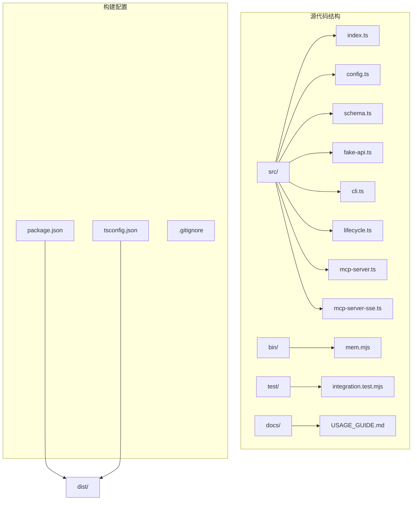

**图表来源**
- [src/index.ts:1-515](file://src/index.ts#L1-L515)
- [src/config.ts:1-312](file://src/config.ts#L1-L312)
- [src/cli.ts:1-617](file://src/cli.ts#L1-L617)

**章节来源**
- [package.json:1-46](file://package.json#L1-L46)
- [tsconfig.json:1-20](file://tsconfig.json#L1-L20)

## 核心组件

### 主要架构组件

项目的核心架构围绕以下几个关键组件构建：

1. **MemoryRuntime** - 主要的运行时工厂函数，负责创建和管理整个内存系统
2. **FakeOpenClawApi** - 模拟 OpenClaw 运行时接口的适配器
3. **配置系统** - 支持 YAML 配置文件和环境变量扩展
4. **MCP 服务器层** - 提供 stdio 和 SSE 两种传输模式
5. **生命周期桥接** - 将 OpenClaw 生命周期事件转换为 MCP 可用的工具

### 关键接口定义

```mermaid
classDiagram
class MemoryRuntime {
+api : FakeOpenClawApi
+config : MemConfig
+callTool(name, params, ctx) Promise~ToolResult~
+listTools() ToolInfo[]
+emitEvent(event, payload, ctx) Promise~unknown[]~
+triggerHook(name, payload) Promise~void~
+getCliInstance() unknown
}
class FakeOpenClawApi {
+pluginConfig : Record~string, unknown~
+logger : Logger
+registerTool(factory) void
+on(event, handler, opts) void
+registerHook(name, handler, opts) void
+registerCli(cmd) void
+callTool(name, params, ctx) Promise~ToolResult~
+getAllToolDefinitions() ToolDefinition[]
+emitEvent(event, payload, ctx) Promise~unknown[]~
+triggerHook(name, payload) Promise~void~
}
class ToolDefinition {
+name : string
+label? : string
+description : string
+parameters : unknown
+execute(callId, params, signal, onUpdate, runtimeCtx) Promise~ToolResult~
}
class ToolResult {
+content : {type : string, text : string}[]
+details? : Record~string, unknown~
}
MemoryRuntime --> FakeOpenClawApi : "uses"
FakeOpenClawApi --> ToolDefinition : "manages"
ToolDefinition --> ToolResult : "produces"
```

**图表来源**
- [src/index.ts:95-122](file://src/index.ts#L95-L122)
- [src/fake-api.ts:20-37](file://src/fake-api.ts#L20-L37)
- [src/fake-api.ts:28-31](file://src/fake-api.ts#L28-L31)

**章节来源**
- [src/index.ts:95-134](file://src/index.ts#L95-L134)
- [src/fake-api.ts:57-90](file://src/fake-api.ts#L57-L90)

## 架构概览

项目采用分层架构设计，实现了清晰的关注点分离：

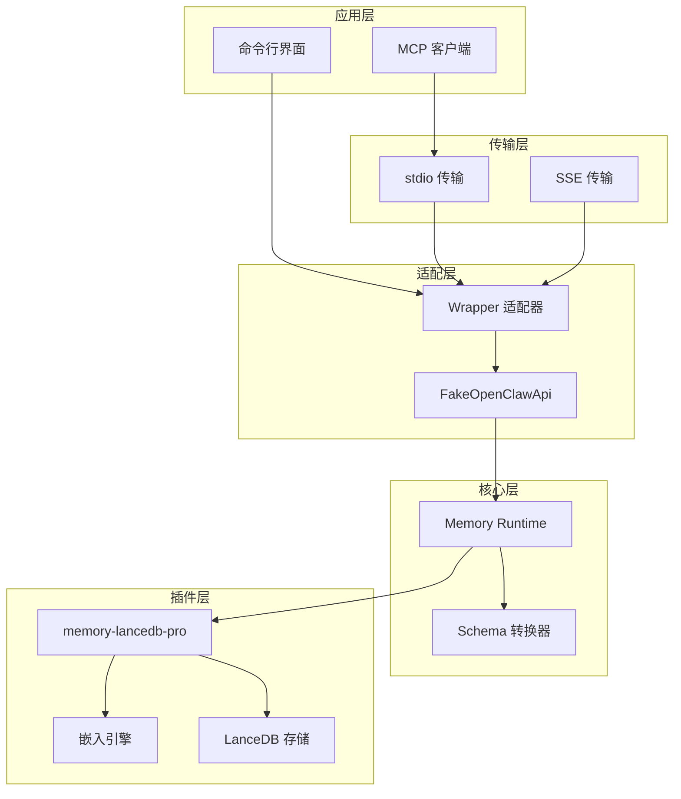

**图表来源**
- [src/mcp-server.ts:8-23](file://src/mcp-server.ts#L8-L23)
- [src/mcp-server-sse.ts:11-24](file://src/mcp-server-sse.ts#L11-L24)
- [src/index.ts:159-184](file://src/index.ts#L159-L184)

## 详细组件分析

### MemoryRuntime 组件

MemoryRuntime 是整个系统的核心工厂类，负责协调各个组件的工作：

#### 核心功能特性

1. **插件加载** - 通过 jiti 直接从 npm 包加载 memory-lancedb-pro
2. **配置管理** - 支持 YAML 配置文件和环境变量扩展
3. **工具注册** - 自动注册 14 个核心记忆工具
4. **标签系统** - 实现自定义标签的预处理和后处理
5. **作用域隔离** - 支持多项目隔离和访问控制

#### 工具调用流程

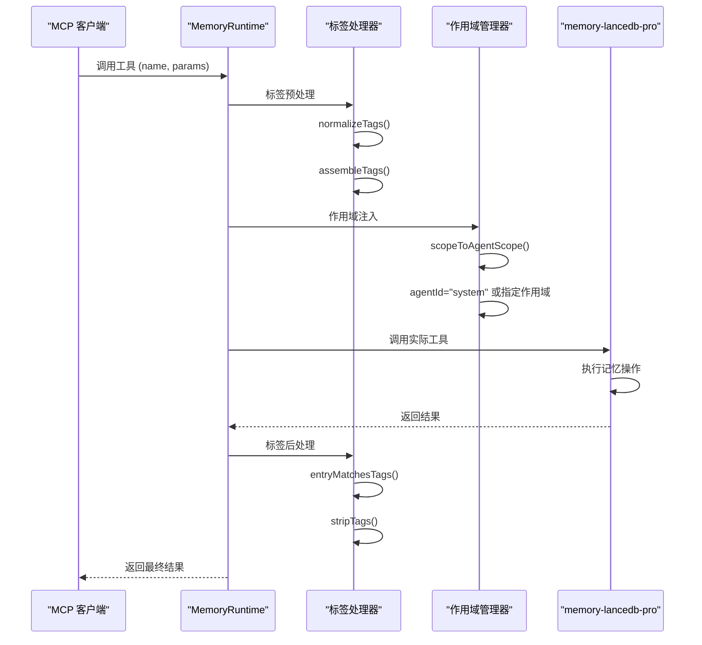

**图表来源**
- [src/index.ts:248-453](file://src/index.ts#L248-L453)

**章节来源**
- [src/index.ts:207-498](file://src/index.ts#L207-L498)

### FakeOpenClawApi 组件

FakeOpenClawApi 实现了 memory-lancedb-pro 所需的最小运行时接口：

#### 关键特性

1. **工具工厂管理** - 注册和管理 14 个核心工具工厂
2. **事件系统** - 实现事件监听和钩子注册
3. **CLI 集成** - 提供命令行界面实例
4. **路径解析** - 处理配置文件和数据库路径

#### 事件处理机制

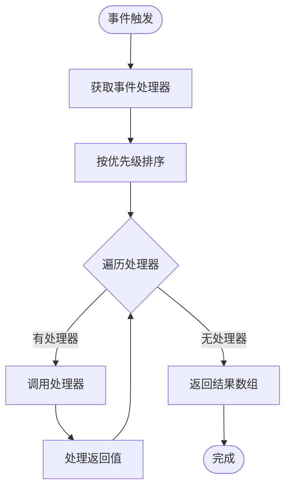

**图表来源**
- [src/fake-api.ts:269-287](file://src/fake-api.ts#L269-L287)

**章节来源**
- [src/fake-api.ts:57-318](file://src/fake-api.ts#L57-L318)

### 配置系统

配置系统提供了灵活的配置管理机制：

#### 配置层次结构

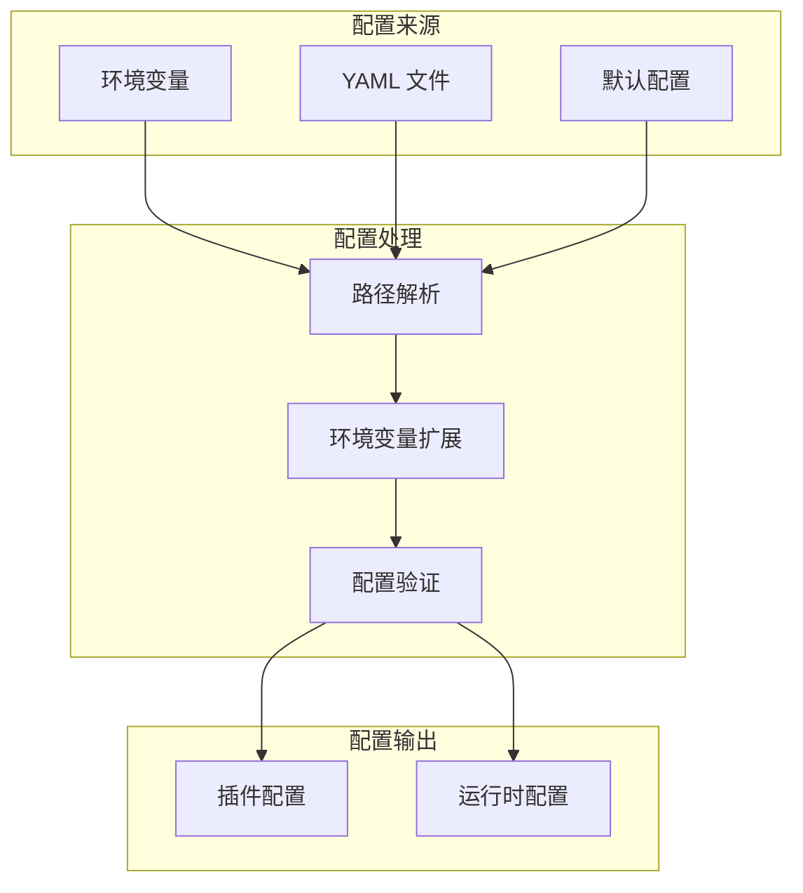

**图表来源**
- [src/config.ts:107-214](file://src/config.ts#L107-L214)

**章节来源**
- [src/config.ts:167-214](file://src/config.ts#L167-L214)

## 扩展开发指南

### 添加新 MCP 工具

要在现有系统中添加新的 MCP 工具，需要遵循以下步骤：

#### 步骤 1：创建工具工厂

```typescript
// 在 memory-lancedb-pro 中创建新的工具工厂
function createNewToolFactory(ctx: ToolCallContext): ToolDefinition {
  return {
    name: "new_memory_tool",
    description: "描述新工具的功能",
    parameters: TypeBoxSchema, // 使用 TypeBox 定义参数
    execute: async (callId, params, signal, onUpdate, runtimeCtx) => {
      // 实现工具逻辑
      return {
        content: [{ type: "text", text: "执行结果" }]
      };
    }
  };
}
```

#### 步骤 2：注册工具到 FakeOpenClawApi

```typescript
// 在 FakeOpenClawApi 中注册新工具
api.registerTool(createNewToolFactory);
```

#### 步骤 3：更新 MemoryRuntime

```typescript
// 在 MemoryRuntime 中确保新工具被正确暴露
const tools = runtime.listTools();
// 新工具会自动出现在工具列表中
```

### 扩展现有功能

#### 扩展标签系统

要扩展现有的标签系统，可以：

1. **修改标签白名单**：更新允许的字符集
2. **添加标签验证规则**：实现更严格的验证逻辑
3. **扩展标签处理逻辑**：添加新的标签处理功能

```typescript
// 扩展标签字符集
const EXTENDED_TAG_CHAR_WHITELIST = /^[\w\-:/.\u4e00-\u9fff,#]+$/u;

// 添加新的标签处理函数
function advancedTagProcessing(tags: string): string {
  // 实现高级标签处理逻辑
  return processedTags;
}
```

#### 修改作用域管理

```typescript
// 扩展作用域定义
const extendedScopes = {
  definitions: {
    ...existingDefinitions,
    "custom-scope": {
      description: "自定义作用域描述"
    }
  },
  agentAccess: {
    ...existingAccess,
    "custom-scope": ["global", "agent:custom"]
  }
};
```

### 工具注册最佳实践

#### 工具定义规范

```typescript
interface ToolDefinition {
  name: string;           // 工具名称
  description: string;     // 工具描述
  parameters: unknown;     // TypeBox 参数定义
  execute: Function;       // 执行函数
}

interface ToolCallContext {
  agentId?: string;       // 代理标识符
  sessionKey?: string;    // 会话密钥
}
```

#### 参数验证机制

```typescript
// 使用 TypeBox 进行参数验证
const toolSchema = Type.Object({
  text: Type.String({ minLength: 1 }),
  importance: Type.Number({ minimum: 0, maximum: 1 })
});

// 转换为 JSON Schema
const jsonSchema = typeboxToJsonSchema(toolSchema);
```

**章节来源**
- [src/schema.ts:45-151](file://src/schema.ts#L45-L151)
- [src/index.ts:313-453](file://src/index.ts#L313-L453)

## 工具定义与参数验证

### TypeBox 到 JSON Schema 转换

项目使用 @sinclair/typebox 来定义工具参数，并将其转换为 MCP 协议所需的 JSON Schema：

#### 转换过程

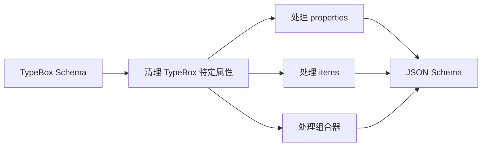

**图表来源**
- [src/schema.ts:57-130](file://src/schema.ts#L57-L130)

#### 参数验证规则

1. **必需参数**：通过 TypeBox 的 Optional 包装器识别
2. **类型验证**：支持字符串、数字、布尔值等基本类型
3. **范围验证**：支持最小值、最大值、长度限制等
4. **枚举验证**：支持预定义值集合

**章节来源**
- [src/schema.ts:16-151](file://src/schema.ts#L16-L151)

### 工具参数验证机制

#### 标准化标签处理

```typescript
// 标签标准化流程
function normalizeTags(tags: string | undefined): string {
  if (!tags || !tags.trim()) return "";
  
  // 去除空白字符
  const normalized = tags.trim().replace(/，/g, ",");
  
  // 验证字符集
  if (!TAG_CHAR_WHITELIST.test(normalized)) {
    throw new Error("无效的标签值");
  }
  
  return normalized;
}
```

#### 标签前缀处理

```typescript
// 标签前缀组装
function assembleTags(tags: string | undefined): string {
  const normalized = normalizeTags(tags);
  if (!normalized) return "";
  return `【标签:${normalized}】 `;
}

// 标签前缀剥离
function stripTags(text: string): string {
  return text.replace(TAG_PREFIX_RE, "");
}
```

**章节来源**
- [src/index.ts:41-82](file://src/index.ts#L41-L82)

## 配置系统扩展

### 配置文件结构

配置系统支持多种配置来源，按优先级顺序处理：

#### 配置优先级

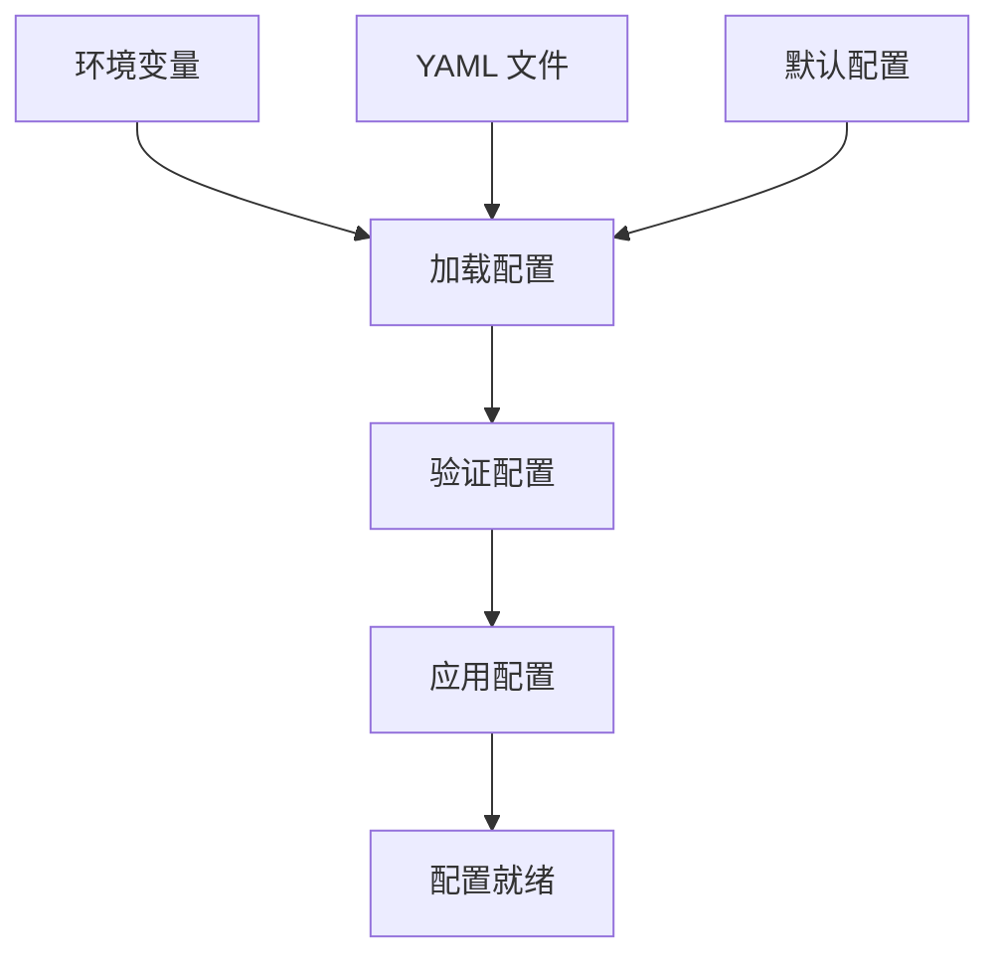

**图表来源**
- [src/config.ts:107-214](file://src/config.ts#L107-L214)

#### 环境变量扩展

```typescript
// 环境变量扩展机制
function expandEnvVars(value: unknown): unknown {
  if (typeof value === "string") {
    return value.replace(/\$\{([^}]+)\}/g, (_match, varName) => {
      return process.env[varName.trim()] || "";
    });
  }
  // 递归处理对象和数组
  return processValue(value);
}
```

### 扩展配置选项

#### 添加新的配置项

```typescript
// 在 MemConfig 接口中添加新配置
interface MemConfig {
  // ... 现有配置
  customFeature?: boolean;
  customSettings?: {
    option1?: string;
    option2?: number;
  };
}

// 在配置映射中处理新配置
function toPluginConfig(config: MemConfig): Record<string, unknown> {
  return {
    ...config,
    customFeature: config.customFeature ?? false,
    customSettings: {
      option1: config.customSettings?.option1 ?? "default",
      option2: config.customSettings?.option2 ?? 0
    }
  };
}
```

**章节来源**
- [src/config.ts:23-98](file://src/config.ts#L23-L98)
- [src/config.ts:220-223](file://src/config.ts#L220-L223)

## 自定义标签系统

### 标签系统架构

标签系统提供了灵活的自定义分类机制：

#### 标签处理流程

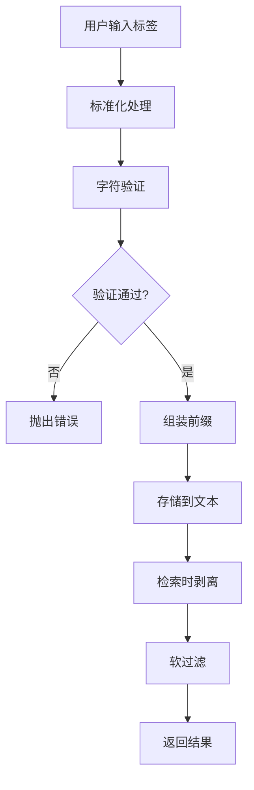

**图表来源**
- [src/index.ts:41-82](file://src/index.ts#L41-L82)

#### 标签验证规则

1. **允许的字符**：字母、数字、下划线、连字符、冒号、斜杠、点号、CJK 字符
2. **分隔符**：逗号用于分隔多个标签
3. **禁止字符**：方括号、空格、表情符号等
4. **长度限制**：单个标签长度不超过 100 字符

### 标签处理实现

#### 标签预处理

```typescript
// 标签预处理逻辑
if (TAG_AWARE_TOOLS.has(effectiveName) && typeof normalized.tags === "string") {
  const tags = normalized.tags as string;
  const prefix = assembleTags(tags);
  delete normalized.tags;
  
  if (prefix) {
    if (effectiveName === "memory_store") {
      normalized.text = prefix + (normalized.text || "");
    } else if (effectiveName === "memory_recall") {
      normalized.query = prefix + (normalized.query || "");
    } else if (effectiveName === "memory_list") {
      // 列表操作重写为回忆操作
      effectiveName = "memory_recall";
      normalized.query = prefix;
      delete normalized.offset;
    }
  }
}
```

#### 标签后处理

```typescript
// 标签后处理逻辑
if (TAG_AWARE_TOOLS.has(name) && result.content) {
  const requestedTags = typeof params.tags === "string" ? normalizeTags(params.tags as string) : "";
  if (requestedTags && name !== "memory_store") {
    // 硬过滤：只保留匹配标签的结果
    const requestedTokens = requestedTags.split(",").map((t) => t.trim()).filter(Boolean);
    // 实现硬过滤逻辑...
  }
  
  // 剥离标签前缀
  for (const item of result.content) {
    if (typeof item.text === "string") {
      item.text = stripTags(item.text);
    }
  }
}
```

**章节来源**
- [src/index.ts:84-93](file://src/index.ts#L84-L93)
- [src/index.ts:313-453](file://src/index.ts#L313-L453)

## 生命周期管理

### 生命周期事件桥接

项目实现了 OpenClaw 生命周期事件到 MCP 工具的桥接：

#### 生命周期工具定义

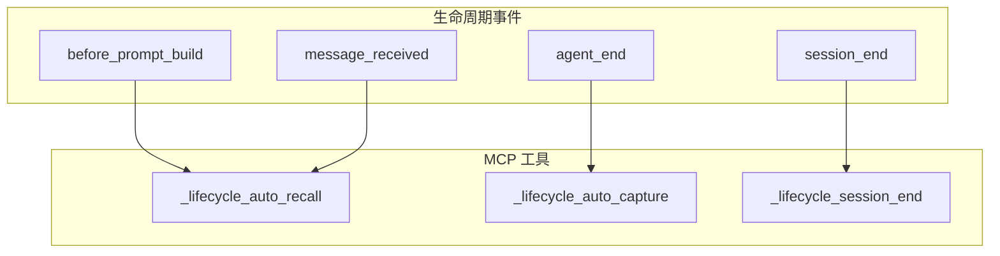

**图表来源**
- [src/lifecycle.ts:52-91](file://src/lifecycle.ts#L52-L91)
- [src/mcp-server.ts:154-233](file://src/mcp-server.ts#L154-L233)

#### 自动回忆流程

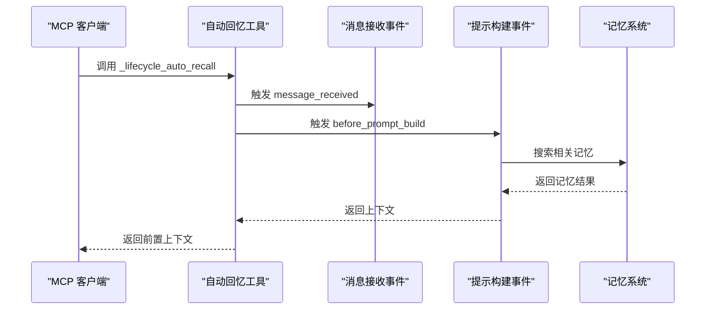

**图表来源**
- [src/lifecycle.ts:52-91](file://src/lifecycle.ts#L52-L91)

#### 自动捕获流程

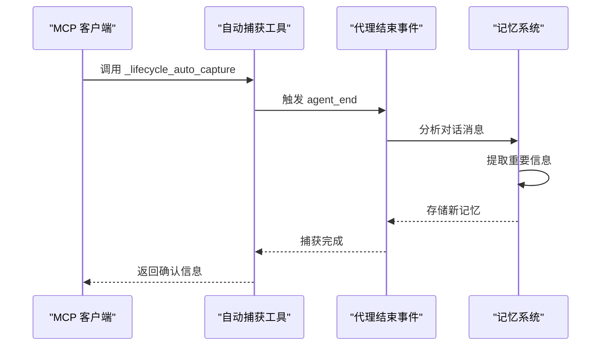

**图表来源**
- [src/lifecycle.ts:109-128](file://src/lifecycle.ts#L109-L128)

**章节来源**
- [src/lifecycle.ts:1-178](file://src/lifecycle.ts#L1-L178)
- [src/mcp-server.ts:235-305](file://src/mcp-server.ts#L235-L305)

## 与 memory-lancedb-pro 插件集成

### 插件加载机制

项目通过 jiti 实现了对 memory-lancedb-pro 的无缝集成：

#### 插件加载流程

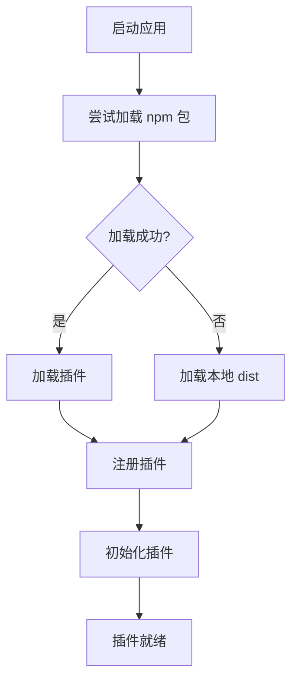

**图表来源**
- [src/index.ts:159-184](file://src/index.ts#L159-L184)

#### 插件注册过程

```typescript
// 插件注册实现
async function loadPlugin(): Promise<{ register: (api: unknown) => void }> {
  try {
    const jiti = createJiti(import.meta.url);
    let mod: Record<string, unknown>;
    
    // 优先从 npm 加载
    try {
      mod = jiti("memory-lancedb-pro") as Record<string, unknown>;
    } catch {
      // 回退到本地 dist
      mod = await import("../../dist/index.js") as Record<string, unknown>;
    }
    
    const plugin = (mod.default || mod) as { register: (api: unknown) => void };
    return plugin;
  } catch (err) {
    throw new Error(`插件加载失败: ${err}`);
  }
}
```

### 运行时适配

#### FakeOpenClawApi 实现

```typescript
// FakeOpenClawApi 关键实现
export class FakeOpenClawApi {
  constructor(options: FakeApiOptions) {
    this.pluginConfig = options.pluginConfig;
    this._homeDir = options.homeDir || homedir();
    
    // 设置日志级别
    const quiet = options.quiet ?? false;
    this.logger = {
      debug: quiet ? () => {} : console.debug,
      info: console.info,
      warn: console.warn,
      error: console.error
    };
  }
  
  // 工具调用实现
  async callTool(
    name: string,
    params: Record<string, unknown>,
    ctx: ToolCallContext = {}
  ): Promise<ToolResult> {
    const factory = this._toolFactories.get(name);
    if (!factory) {
      throw new Error(`未知工具: ${name}`);
    }
    
    const toolCtx: ToolCallContext = {
      agentId: ctx.agentId ?? "main",
      sessionKey: ctx.sessionKey ?? `session-${Date.now()}`
    };
    
    const def = factory(toolCtx);
    const callId = crypto.randomUUID();
    return def.execute(callId, params, undefined, undefined, toolCtx);
  }
}
```

**章节来源**
- [src/index.ts:159-184](file://src/index.ts#L159-L184)
- [src/fake-api.ts:79-90](file://src/fake-api.ts#L79-L90)
- [src/fake-api.ts:217-235](file://src/fake-api.ts#L217-L235)

## 调试与测试

### 调试技巧

#### 日志系统

项目实现了多层次的日志系统：

```typescript
// 日志配置
const logger = {
  debug: quiet ? () => {} : (...args: unknown[]) => console.debug("[mem:debug]", ...args),
  info: (...args: unknown[]) => console.info("[mem:info]", ...args),
  warn: (...args: unknown[]) => console.warn("[mem:warn]", ...args),
  error: (...args: unknown[]) => console.error("[mem:error]", ...args),
};
```

#### 健康检查

```typescript
// 健康检查实现
program
  .command("doctor")
  .description("运行健康检查")
  .option("--config <path>", "配置文件路径")
  .option("--mcp", "测试 MCP 协议握手")
  .action(async (opts) => {
    // 检查配置文件
    const config = loadConfig(opts.config);
    
    // 检查插件加载
    const runtime = await createMemoryRuntime({ config, quiet: true });
    const tools = runtime.listTools();
    
    // 检查工具列表
    console.log(`✅ 工具: ${tools.map(t => t.name).join(", ")}`);
  });
```

### 测试策略

#### 集成测试

```typescript
// 集成测试示例
describe("memory-lancedb-mcp integration", async () => {
  it("应该注册 14 个工具", async () => {
    const runtime = await mod.createMemoryRuntime({
      config: {
        embedding: {
          apiKey: "test-key",
          model: "text-embedding-3-small",
          dimensions: 1536,
        },
        enableManagementTools: true,
      },
      quiet: true,
    });

    const tools = runtime.listTools();
    assert.ok(tools.length >= 14, `期望 >= 14 个工具, 得到 ${tools.length}`);
  });
});
```

#### 测试最佳实践

1. **模拟外部依赖**：使用测试替身模拟嵌入 API
2. **配置隔离**：为每个测试使用独立的配置
3. **状态清理**：确保测试之间没有状态污染
4. **错误场景测试**：覆盖各种错误情况

**章节来源**
- [test/integration.test.mjs:9-131](file://test/integration.test.mjs#L9-L131)
- [src/cli.ts:449-517](file://src/cli.ts#L449-L517)

## 性能考虑

### 性能优化策略

#### 内存管理

1. **懒加载**：插件通过 jiti 按需加载
2. **缓存机制**：工具定义和配置结果缓存
3. **连接池**：数据库连接池管理

#### 并发处理

```typescript
// 并发工具调用处理
async function concurrentToolCalls(
  toolCalls: Array<{name: string, params: Record<string, unknown>}>,
  maxConcurrent: number
): Promise<ToolResult[]> {
  const results: ToolResult[] = [];
  
  for (let i = 0; i < toolCalls.length; i += maxConcurrent) {
    const batch = toolCalls.slice(i, i + maxConcurrent);
    const batchResults = await Promise.all(
      batch.map(call => runtime.callTool(call.name, call.params))
    );
    results.push(...batchResults);
  }
  
  return results;
}
```

#### 缓存策略

1. **工具定义缓存**：避免重复解析 TypeBox 模式
2. **配置缓存**：缓存已解析的配置文件
3. **结果缓存**：对频繁查询的结果进行缓存

## 故障排除

### 常见问题解决

#### 配置问题

```typescript
// 配置文件不存在错误处理
function loadConfig(configPath?: string): MemConfig {
  const path = configPath || getConfigPath();
  
  if (!existsSync(path)) {
    throw new Error(
      `配置文件不存在: ${path}\n` +
      `运行 'mem config init' 创建默认配置，或设置 MEM_CONFIG_PATH 环境变量。`
    );
  }
  
  // ... 其他配置加载逻辑
}
```

#### 插件加载失败

```typescript
// 插件加载错误处理
try {
  const plugin = jiti("memory-lancedb-pro");
} catch (err) {
  throw new Error(
    `无法加载 memory-lancedb-pro 插件。\n` +
    `安装插件: npm install memory-lancedb-pro@beta\n` +
    `原始错误: ${err}`
  );
}
```

#### 标签验证错误

```typescript
// 标签验证错误处理
function normalizeTags(tags: string | undefined): string {
  if (!tags || !tags.trim()) return "";
  
  const normalized = tags.trim().replace(/，/g, ",");
  
  if (!TAG_CHAR_WHITELIST.test(normalized)) {
    throw new Error(
      `无效的标签值: ${JSON.stringify(tags)}. ` +
      `标签只能包含字母、数字、'_', '-', ':', '/', '.', CJK 字符, ` +
      `以及逗号作为分隔符。方括号和空格等保留字符不允许。`
    );
  }
  
  return normalized;
}
```

### 调试工具

#### 详细日志

```typescript
// 详细调试信息
console.debug(`[mem:debug] 工具调用: ${name}`, {
  params: sanitizedParams,
  context: effectiveCtx,
  agentId: effectiveCtx.agentId
});
```

#### 性能监控

```typescript
// 性能监控实现
function monitorPerformance<T>(operation: string, fn: () => T): T {
  const start = Date.now();
  try {
    const result = fn();
    const end = Date.now();
    console.debug(`[mem:perf] ${operation}: ${end - start}ms`);
    return result;
  } catch (error) {
    const end = Date.now();
    console.error(`[mem:perf] ${operation} 失败: ${end - start}ms`, error);
    throw error;
  }
}
```

**章节来源**
- [src/config.ts:170-214](file://src/config.ts#L170-L214)
- [src/index.ts:44-51](file://src/index.ts#L44-L51)
- [src/cli.ts:449-517](file://src/cli.ts#L449-L517)

## 版本管理与向后兼容性

### 版本管理策略

#### 语义化版本控制

项目采用语义化版本控制（SemVer）：

- **主版本**：重大变更，可能破坏向后兼容性
- **次版本**：新增功能，向后兼容
- **修订版本**：错误修复，向后兼容

#### 向后兼容性保证

```typescript
// 向后兼容性检查
function checkCompatibility(currentVersion: string, expectedVersion: string): boolean {
  const current = parseVersion(currentVersion);
  const expected = parseVersion(expectedVersion);
  
  // 检查主版本是否兼容
  if (current.major !== expected.major) {
    return false;
  }
  
  // 检查次版本兼容性
  if (current.minor < expected.minor) {
    return false;
  }
  
  return true;
}
```

### 升级指南

#### 从旧版本升级

1. **备份配置文件**：升级前备份所有配置
2. **检查依赖**：确保依赖版本符合要求
3. **测试环境**：在测试环境中验证升级
4. **逐步迁移**：分步迁移配置和数据

#### 兼容性变更

```typescript
// 兼容性变更处理
function handleCompatibilityChanges(config: MemConfig): MemConfig {
  const updatedConfig = { ...config };
  
  // 处理废弃的配置项
  if (updatedConfig.oldSetting) {
    updatedConfig.newSetting = updatedConfig.oldSetting;
    delete updatedConfig.oldSetting;
  }
  
  // 添加默认值
  if (!updatedConfig.newFeature) {
    updatedConfig.newFeature = true;
  }
  
  return updatedConfig;
}
```

### 发布流程

#### 构建流程

```typescript
// 构建脚本
const buildScripts = {
  build: "tsc",
  dev: "tsc --watch",
  start: "node dist/cli.js serve",
  test: "node --test test/*.test.mjs"
};
```

#### 发布准备

1. **更新版本号**：根据变更类型更新版本号
2. **更新文档**：更新所有相关文档
3. **运行测试**：确保所有测试通过
4. **打包发布**：创建发布包

**章节来源**
- [package.json:1-46](file://package.json#L1-L46)
- [tsconfig.json:1-20](file://tsconfig.json#L1-L20)

## 结论

memory-lancedb-mcp 提供了一个强大而灵活的扩展框架，支持开发者轻松添加新的 MCP 工具、扩展现有功能、实现自定义标签系统、扩展配置选项等。通过清晰的架构设计、完善的生命周期管理和强大的插件集成机制，该项目为 AI 应用的长期记忆管理提供了坚实的基础。

### 主要优势

1. **零侵入性**：通过 FakeOpenClawApi 实现对父项目的零修改集成
2. **灵活扩展**：支持自定义工具、标签、配置等扩展点
3. **多传输模式**：同时支持 stdio 和 SSE 两种传输模式
4. **完整生命周期**：提供从开发到部署的完整工具链
5. **强类型支持**：使用 TypeScript 提供完整的类型安全

### 最佳实践建议

1. **遵循现有模式**：参考现有的工具定义和实现模式
2. **保持向后兼容**：确保新功能不影响现有功能
3. **充分测试**：为新功能编写完整的测试用例
4. **文档完善**：为新功能编写详细的使用文档
5. **性能优化**：关注新功能的性能影响并进行优化

通过遵循这些指导原则和最佳实践，开发者可以有效地扩展 memory-lancedb-mcp，构建更加丰富和强大的 AI 应用长期记忆系统。