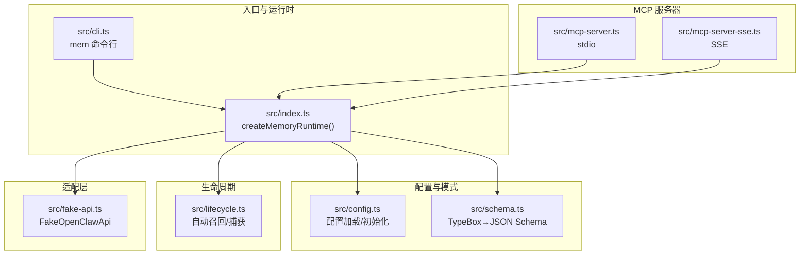
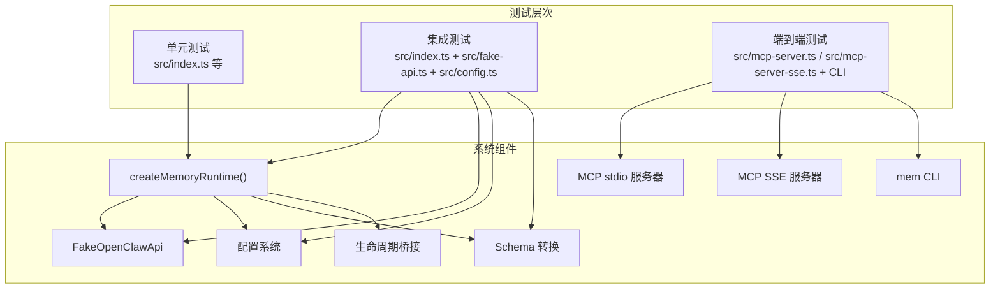
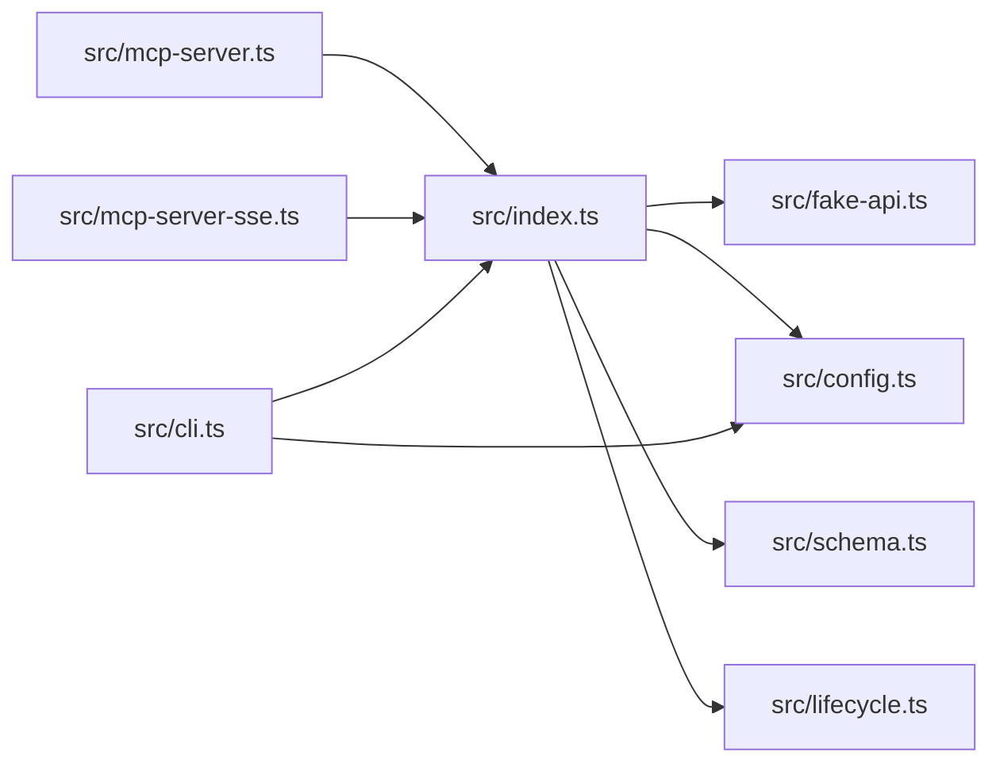

# 测试策略

<cite>
**本文引用的文件**
- [package.json](file://package.json)
- [README.md](file://README.md)
- [test/integration.test.mjs](file://test/integration.test.mjs)
- [src/index.ts](file://src/index.ts)
- [src/cli.ts](file://src/cli.ts)
- [src/fake-api.ts](file://src/fake-api.ts)
- [src/config.ts](file://src/config.ts)
- [src/schema.ts](file://src/schema.ts)
- [src/lifecycle.ts](file://src/lifecycle.ts)
- [src/mcp-server.ts](file://src/mcp-server.ts)
- [src/mcp-server-sse.ts](file://src/mcp-server-sse.ts)
</cite>

## 目录
1. [简介](#简介)
2. [项目结构](#项目结构)
3. [核心组件](#核心组件)
4. [架构总览](#架构总览)
5. [详细组件分析](#详细组件分析)
6. [依赖分析](#依赖分析)
7. [性能考虑](#性能考虑)
8. [故障排查指南](#故障排查指南)
9. [结论](#结论)
10. [附录](#附录)

## 简介
本测试策略文档面向 memory-lancedb-mcp 项目，围绕单元测试、集成测试与端到端测试的设计原则，结合现有测试用例与源码结构，给出测试用例编写规范、测试数据准备与环境搭建、自动化测试与持续集成配置建议、性能与压力测试方法、测试覆盖率与质量度量标准、测试驱动开发（TDD）应用、测试报告生成与分析方法，以及测试环境隔离与数据清理策略。目标是帮助开发者在不引入外部测试框架的前提下，建立稳定可靠的测试体系，并逐步扩展到更完善的测试生态。

## 项目结构
该项目采用 TypeScript 源码与 Node.js 测试脚本并存的结构，核心模块包括：
- 入口与运行时：src/index.ts、src/cli.ts
- MCP 服务器：src/mcp-server.ts（stdio）、src/mcp-server-sse.ts（SSE）
- 配置与模式转换：src/config.ts、src/schema.ts
- 生命周期桥接：src/lifecycle.ts
- 假装 OpenClaw API 适配层：src/fake-api.ts
- 测试：test/integration.test.mjs（Node.js 内置测试）

图表来源
- [src/index.ts:1-515](file://src/index.ts#L1-L515)
- [src/cli.ts:1-617](file://src/cli.ts#L1-L617)
- [src/mcp-server.ts:1-306](file://src/mcp-server.ts#L1-L306)
- [src/mcp-server-sse.ts:1-405](file://src/mcp-server-sse.ts#L1-L405)
- [src/config.ts:1-312](file://src/config.ts#L1-L312)
- [src/schema.ts:1-151](file://src/schema.ts#L1-L151)
- [src/lifecycle.ts:1-178](file://src/lifecycle.ts#L1-L178)
- [src/fake-api.ts:1-318](file://src/fake-api.ts#L1-L318)

章节来源
- [package.json:1-46](file://package.json#L1-L46)
- [README.md:1-738](file://README.md#L1-L738)

## 核心组件
- createMemoryRuntime：主工厂函数，负责加载配置、创建 FakeOpenClawApi、注册插件、构建运行时对象，暴露工具调用、事件发射、钩子触发与 CLI 实例。
- FakeOpenClawApi：模拟 OpenClaw 插件运行时，注册工具、事件与钩子，提供工具调用、事件发射、钩子触发与 CLI 注册。
- 配置系统：从 YAML 文件加载配置，支持环境变量扩展、默认路径解析与初始化。
- 模式转换：将 TypeBox schema 转换为 MCP 兼容的 JSON Schema。
- 生命周期桥接：将 OpenClaw 生命周期事件映射为可调用的工具，支持自动召回与自动捕获。
- MCP 服务器：stdio 与 SSE 两种传输模式，统一暴露工具与生命周期工具，处理请求与响应格式。

章节来源
- [src/index.ts:190-498](file://src/index.ts#L190-L498)
- [src/fake-api.ts:57-317](file://src/fake-api.ts#L57-L317)
- [src/config.ts:167-214](file://src/config.ts#L167-L214)
- [src/schema.ts:45-150](file://src/schema.ts#L45-L150)
- [src/lifecycle.ts:52-177](file://src/lifecycle.ts#L52-L177)
- [src/mcp-server.ts:43-140](file://src/mcp-server.ts#L43-L140)
- [src/mcp-server-sse.ts:57-209](file://src/mcp-server-sse.ts#L57-L209)

## 架构总览
下图展示了测试策略与系统各层的关系：测试覆盖单元、集成与端到端三个层次，分别针对核心逻辑、组件交互与真实运行时。

图表来源
- [src/index.ts:190-498](file://src/index.ts#L190-L498)
- [src/fake-api.ts:57-317](file://src/fake-api.ts#L57-L317)
- [src/config.ts:167-214](file://src/config.ts#L167-L214)
- [src/schema.ts:45-150](file://src/schema.ts#L45-L150)
- [src/lifecycle.ts:52-177](file://src/lifecycle.ts#L52-L177)
- [src/mcp-server.ts:43-140](file://src/mcp-server.ts#L43-L140)
- [src/mcp-server-sse.ts:57-209](file://src/mcp-server-sse.ts#L57-L209)
- [src/cli.ts:105-617](file://src/cli.ts#L105-L617)

## 详细组件分析

### 单元测试设计与实践
- 目标：验证核心函数与纯逻辑的正确性，如配置加载、Schema 转换、标签规范化、作用域注入与重写、生命周期工具调用等。
- 关键测试点：
  - 配置加载与环境变量展开：确保配置文件存在、必需字段齐全、环境变量替换正确。
  - Schema 转换：TypeBox 到 JSON Schema 的转换结果符合 MCP 要求。
  - 标签规范化与注入：标签字符串的合法性校验、前缀组装、检索时的硬过滤与结果剥离。
  - 作用域注入与 ACL：跨作用域与锁定作用域模式下的参数重写、agentId 选择与错误返回。
  - 生命周期工具：自动召回与自动捕获的事件发射顺序与返回值。
- 测试数据准备：
  - 使用最小化配置对象，避免真实嵌入 API 密钥。
  - 使用简短、明确的输入参数组合，覆盖正常与异常分支。
- 断言策略：
  - 对返回结构进行断言（如工具数量、Schema 结构、事件集合）。
  - 对错误路径进行断言（如 scope 不匹配、非法标签、未知工具）。
- 复杂度与性能：
  - 单元测试应避免 IO 与外部依赖，关注算法复杂度与边界条件。
  - 对正则与字符串处理进行充分覆盖，确保标签解析与剥离的健壮性。

章节来源
- [src/config.ts:167-214](file://src/config.ts#L167-L214)
- [src/schema.ts:45-150](file://src/schema.ts#L45-L150)
- [src/index.ts:41-82](file://src/index.ts#L41-L82)
- [src/index.ts:313-452](file://src/index.ts#L313-L452)
- [src/lifecycle.ts:52-177](file://src/lifecycle.ts#L52-L177)

### 集成测试设计与实践
- 目标：验证组件协作与运行时装配的正确性，如 createMemoryRuntime 的装配流程、工具注册、事件与钩子注册、JSON Schema 生成。
- 关键测试点：
  - 模块导出完整性：确保 createMemoryRuntime、FakeOpenClawApi、loadConfig、typeboxToJsonSchema、生命周期触发器等导出可用。
  - 运行时创建：配置有效时能创建运行时并访问 api 与 config。
  - 工具注册：工具数量与名称满足预期，包含管理类工具与自我改进工具。
  - JSON Schema：工具输入模式为对象类型，必要参数存在。
  - 生命周期事件与钩子：事件与钩子注册成功。
  - FakeOpenClawApi 路径解析：~、绝对路径与相对路径解析正确。
- 测试数据准备：
  - 使用最小配置对象，开启管理工具与自动功能，避免真实嵌入 API。
- 断言策略：
  - 对工具列表长度与名称进行断言。
  - 对输入 Schema 的 type、properties、required 进行断言。
  - 对事件与钩子集合进行断言。
- 复杂度与性能：
  - 集成测试应尽量减少外部依赖，关注装配流程与契约一致性。

章节来源
- [test/integration.test.mjs:1-131](file://test/integration.test.mjs#L1-L131)
- [src/index.ts:190-498](file://src/index.ts#L190-L498)
- [src/fake-api.ts:57-317](file://src/fake-api.ts#L57-L317)

### 端到端测试设计与实践
- 目标：验证 MCP 服务器（stdio 与 SSE）与 CLI 的完整工作流，包括工具列表、工具调用、生命周期工具、健康检查与配置管理。
- 关键测试点：
  - stdio 模式：启动服务器、列出工具、调用工具、生命周期工具调用。
  - SSE 模式：HTTP 端点、SSE 连接、消息转发、健康检查。
  - CLI：serve 命令的 dry-run、--scope、--sse、--port、--host；list/search/stats/store/delete/config/doctor/scope 等命令。
- 测试数据准备：
  - 使用最小配置文件，设置嵌入 API 密钥占位或环境变量。
  - 准备测试数据库目录与权限，避免真实生产数据。
- 断言策略：
  - 对工具列表、事件与钩子集合进行断言。
  - 对工具调用返回内容进行断言（文本类型、结构化详情）。
  - 对 CLI 输出与退出码进行断言。
- 复杂度与性能：
  - 端到端测试应关注协议兼容性与传输稳定性，避免长时阻塞。

章节来源
- [src/mcp-server.ts:43-140](file://src/mcp-server.ts#L43-L140)
- [src/mcp-server-sse.ts:57-209](file://src/mcp-server-sse.ts#L57-L209)
- [src/cli.ts:105-617](file://src/cli.ts#L105-L617)

### 测试用例编写规范与最佳实践
- 命名规范：描述性命名，清晰表达被测场景与期望结果。
- 结构规范：每个测试文件聚焦单一主题，使用 describe/it 分层组织。
- 断言规范：优先断言结果结构与契约，其次断言错误信息与异常路径。
- 数据准备：使用最小化、可重复的数据，避免外部依赖与副作用。
- 边界与异常：覆盖空值、非法字符、越界参数、缺失字段等异常路径。
- 可维护性：测试用例应易于阅读与修改，避免过度耦合具体实现细节。

章节来源
- [test/integration.test.mjs:1-131](file://test/integration.test.mjs#L1-L131)

### 测试数据准备与测试环境搭建
- 配置文件：使用默认配置模板或最小化配置，确保嵌入 API 密钥占位或环境变量存在。
- 数据库路径：使用临时目录或隔离路径，避免与生产数据冲突。
- 环境变量：设置 MEM_CONFIG_PATH、嵌入 API 密钥等环境变量。
- 传输模式：根据测试目标选择 stdio 或 SSE，SSE 需要指定端口与主机。
- 权限与安全：SSE 模式下注意主机绑定与访问控制，避免暴露到不受信任网络。

章节来源
- [src/config.ts:296-311](file://src/config.ts#L296-L311)
- [src/config.ts:107-121](file://src/config.ts#L107-L121)
- [src/mcp-server-sse.ts:57-209](file://src/mcp-server-sse.ts#L57-L209)
- [src/cli.ts:105-617](file://src/cli.ts#L105-L617)

### 自动化测试流程与持续集成配置
- 测试脚本：使用 Node.js 内置测试脚本，通过 npm test 调用。
- CI 配置建议：
  - 安装依赖与编译（tsc）。
  - 设置环境变量（嵌入 API 密钥、MEM_CONFIG_PATH）。
  - 运行测试（npm test），记录失败与退出码。
  - 可选：生成测试报告（如 JUnit XML）供 CI 平台消费。
- 注意事项：CI 环境中避免真实嵌入 API 调用，使用占位或禁用相关功能。

章节来源
- [package.json:10-14](file://package.json#L10-L14)
- [README.md:716-727](file://README.md#L716-L727)

### 性能测试与压力测试方法
- 性能测试：
  - 工具调用吞吐：批量执行工具调用，统计平均耗时与 P95/P99。
  - Schema 转换性能：对大量工具的输入模式进行转换，评估转换开销。
  - 标签处理性能：对大量标签字符串进行规范化、组装与剥离，评估正则与字符串处理成本。
- 压力测试：
  - 并发工具调用：模拟多客户端并发调用，观察服务器稳定性与资源占用。
  - SSE 并发：多客户端连接与消息发送，评估连接数与内存占用。
  - 配置加载压力：频繁切换配置文件与环境变量，评估解析与展开性能。
- 监控指标：
  - CPU、内存、文件句柄、网络连接数。
  - 请求延迟、错误率、超时比例。
  - 日志级别与告警阈值。

[本节为通用指导，不直接分析具体文件]

### 测试覆盖率分析与质量度量标准
- 覆盖率指标：
  - 语句覆盖率：核心逻辑与分支覆盖。
  - 分支覆盖率：异常路径与边界条件覆盖。
  - 函数/方法覆盖率：关键函数与工具调用路径覆盖。
- 质量度量：
  - 测试通过率、失败率、重试率。
  - 测试执行时间、平均耗时、最长耗时。
  - 代码变更与测试回归率。
- 报告与可视化：
  - 生成测试报告（如 JUnit XML、HTML 报告）。
  - 在 CI 中展示覆盖率趋势与缺陷分布。

[本节为通用指导，不直接分析具体文件]

### 测试驱动开发（TDD）应用
- TDD 流程：
  - 编写失败的单元测试（描述新功能或修复）。
  - 编写最小实现通过测试。
  - 重构与优化，保持测试通过。
- 适用场景：
  - 新增工具或工具参数的输入校验。
  - 新增配置项或配置解析逻辑。
  - 生命周期工具的新增或修改。
- 回归保障：
  - 保持既有测试通过，防止回归。
  - 对关键路径增加边界与异常测试。

[本节为通用指导，不直接分析具体文件]

### 测试报告生成与分析方法
- 报告格式：建议生成 JUnit XML 与 HTML 报告，便于 CI 平台展示。
- 分析维度：
  - 通过/失败/跳过统计。
  - 失败用例的堆栈与断言信息。
  - 性能回归与异常用例定位。
- 持续改进：
  - 基于报告识别薄弱环节，补充测试用例。
  - 优化慢用例与不稳定用例。

[本节为通用指导，不直接分析具体文件]

### 测试环境隔离与数据清理策略
- 环境隔离：
  - 使用独立配置文件与数据库路径，避免共享状态。
  - 使用临时目录与随机端口，避免端口冲突。
  - 使用不同的 agentId 与 scope，隔离作用域数据。
- 数据清理：
  - 测试结束后删除临时配置文件与数据库目录。
  - SSE 服务器关闭时清理客户端连接与资源。
  - CLI 的 doctor 与 scope 命令可用于验证与清理。

章节来源
- [src/mcp-server-sse.ts:192-209](file://src/mcp-server-sse.ts#L192-L209)
- [src/cli.ts:527-610](file://src/cli.ts#L527-L610)

## 依赖分析
- 组件耦合：
  - createMemoryRuntime 依赖 FakeOpenClawApi、配置系统、Schema 转换与生命周期模块。
  - MCP 服务器依赖运行时与生命周期工具定义。
  - CLI 依赖运行时与配置系统，提供健康检查与作用域管理。
- 外部依赖：
  - @modelcontextprotocol/sdk：MCP 协议实现。
  - yaml：配置文件解析。
  - jiti：从 npm 包加载 TypeScript 源文件。
- 循环依赖：
  - 当前模块间无明显循环依赖，结构清晰。

图表来源
- [src/index.ts:190-498](file://src/index.ts#L190-L498)
- [src/fake-api.ts:57-317](file://src/fake-api.ts#L57-L317)
- [src/config.ts:167-214](file://src/config.ts#L167-L214)
- [src/schema.ts:45-150](file://src/schema.ts#L45-L150)
- [src/lifecycle.ts:52-177](file://src/lifecycle.ts#L52-L177)
- [src/mcp-server.ts:43-140](file://src/mcp-server.ts#L43-L140)
- [src/mcp-server-sse.ts:57-209](file://src/mcp-server-sse.ts#L57-L209)
- [src/cli.ts:105-617](file://src/cli.ts#L105-L617)

## 性能考虑
- 工具调用路径：尽量减少不必要的对象复制与序列化，优先使用轻量结构。
- 正则与字符串处理：对标签解析与剥离使用预编译正则，避免重复编译。
- 并发与资源：SSE 模式下注意连接数与内存占用，及时清理无效连接。
- 配置解析：缓存解析后的配置对象，避免重复解析与展开。

[本节为通用指导，不直接分析具体文件]

## 故障排查指南
- 配置问题：
  - 配置文件不存在或解析失败：检查 MEM_CONFIG_PATH、默认路径与文件权限。
  - 嵌入 API 密钥缺失：确保配置中 apiKey 存在或环境变量已设置。
- 工具调用失败：
  - 未知工具：确认工具名称与注册列表一致。
  - 参数缺失：检查输入 Schema 的 required 字段。
- 作用域问题：
  - scope 不匹配：锁定作用域模式下，请求的目标 scope 必须与服务器一致。
- 传输问题：
  - stdio 模式：检查 MCP 客户端是否正确连接。
  - SSE 模式：检查端口绑定、CORS 与客户端连接状态。

章节来源
- [src/config.ts:167-214](file://src/config.ts#L167-L214)
- [src/fake-api.ts:217-235](file://src/fake-api.ts#L217-L235)
- [src/index.ts:351-367](file://src/index.ts#L351-L367)
- [src/mcp-server.ts:126-140](file://src/mcp-server.ts#L126-L140)
- [src/mcp-server-sse.ts:174-190](file://src/mcp-server-sse.ts#L174-L190)

## 结论
本测试策略文档基于现有测试用例与源码结构，提出了覆盖单元、集成与端到端的测试方案，并给出了测试数据准备、环境搭建、自动化流程、性能与压力测试、覆盖率与质量度量、TDD 应用、报告生成与分析、以及环境隔离与数据清理的实践建议。建议在现有 Node.js 内置测试基础上，逐步引入更完善的测试工具与报告系统，持续提升测试质量与稳定性。

## 附录
- 测试用例参考路径：
  - [integration.test.mjs:1-131](file://test/integration.test.mjs#L1-L131)
- 关键实现参考路径：
  - [createMemoryRuntime:207-498](file://src/index.ts#L207-L498)
  - [FakeOpenClawApi:57-317](file://src/fake-api.ts#L57-317)
  - [配置加载:167-214](file://src/config.ts#L167-214)
  - [Schema 转换:45-150](file://src/schema.ts#L45-150)
  - [生命周期工具:52-177](file://src/lifecycle.ts#L52-177)
  - [MCP stdio 服务器:43-140](file://src/mcp-server.ts#L43-140)
  - [MCP SSE 服务器:57-209](file://src/mcp-server-sse.ts#L57-209)
  - [CLI 命令:105-617](file://src/cli.ts#L105-617)