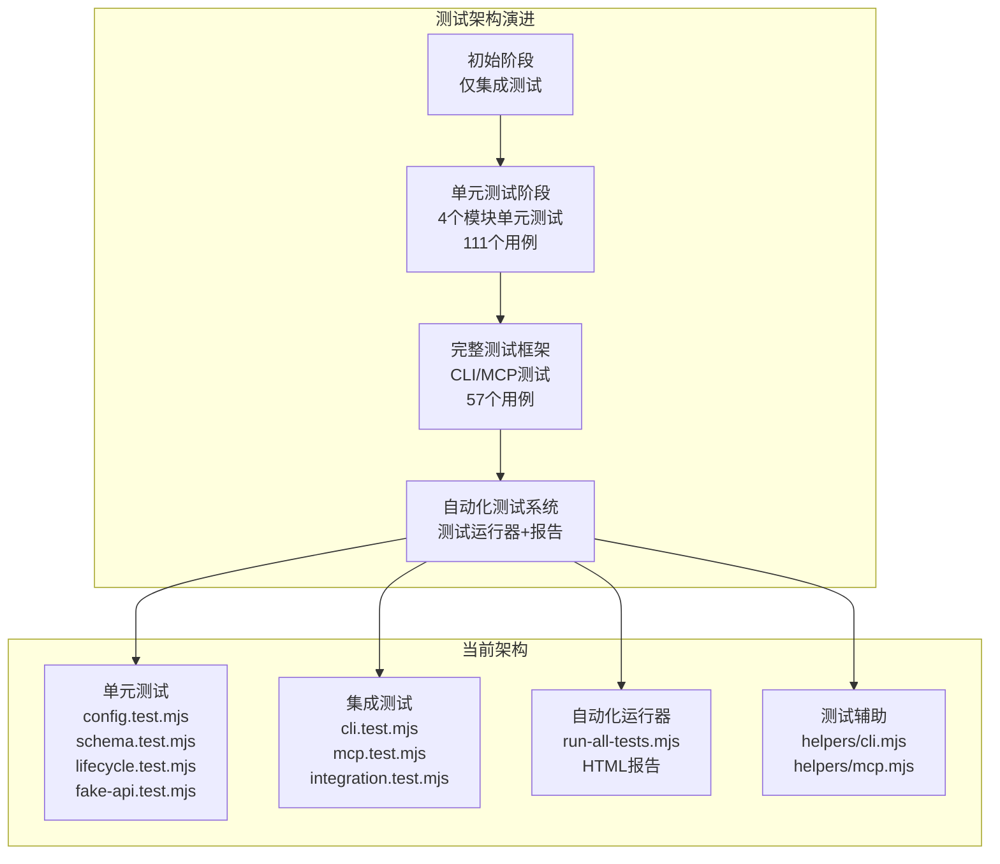
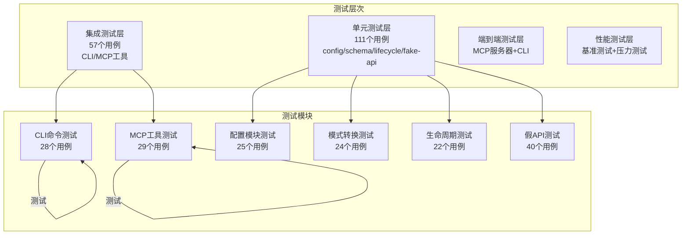

# 测试策略

<cite>
**本文引用的文件**
- [package.json](file://package.json)
- [README.md](file://README.md)
- [test/README.md](file://test/README.md)
- [test/SUMMARY.md](file://test/SUMMARY.md)
- [test/unit/SUMMARY.md](file://test/unit/SUMMARY.md)
- [test/cli.test.mjs](file://test/cli.test.mjs)
- [test/mcp.test.mjs](file://test/mcp.test.mjs)
- [test/run-all-tests.mjs](file://test/run-all-tests.mjs)
- [test/helpers/cli.mjs](file://test/helpers/cli.mjs)
- [test/helpers/mcp.mjs](file://test/helpers/mcp.mjs)
- [test/unit/config.test.mjs](file://test/unit/config.test.mjs)
- [test/unit/schema.test.mjs](file://test/unit/schema.test.mjs)
- [test/unit/lifecycle.test.mjs](file://test/unit/lifecycle.test.mjs)
- [test/unit/fake-api.test.mjs](file://test/unit/fake-api.test.mjs)
- [test/integration.test.mjs](file://test/integration.test.mjs)
- [src/index.ts](file://src/index.ts)
- [src/cli.ts](file://src/cli.ts)
- [src/fake-api.ts](file://src/fake-api.ts)
- [src/config.ts](file://src/config.ts)
- [src/schema.ts](file://src/schema.ts)
- [src/lifecycle.ts](file://src/lifecycle.ts)
- [src/mcp-server.ts](file://src/mcp-server.ts)
- [src/mcp-server-sse.ts](file://src/mcp-server-sse.ts)
</cite>

## 更新摘要
**变更内容**
- 新增完整的单元测试框架，涵盖4个核心模块的111个测试用例
- 新增CLI命令测试和MCP工具测试，共57个测试用例
- 新增自动化测试运行器和HTML报告生成功能
- 新增测试辅助函数和测试数据生成脚本
- 更新测试架构以支持多层次测试策略

## 目录
1. [简介](#简介)
2. [测试架构演进](#测试架构演进)
3. [测试层次结构](#测试层次结构)
4. [核心测试模块](#核心测试模块)
5. [单元测试框架](#单元测试框架)
6. [集成测试框架](#集成测试框架)
7. [自动化测试运行器](#自动化测试运行器)
8. [测试数据管理](#测试数据管理)
9. [测试报告与分析](#测试报告与分析)
10. [测试环境配置](#测试环境配置)
11. [测试策略实施](#测试策略实施)
12. [持续集成与部署](#持续集成与部署)
13. [测试质量度量](#测试质量度量)
14. [故障排查指南](#故障排查指南)
15. [结论](#结论)

## 简介
本测试策略文档面向 memory-lancedb-mcp 项目，经过重大更新后，现已建立完整的测试生态系统。项目采用多层次测试策略，包括单元测试、集成测试、端到端测试和性能测试，覆盖CLI命令、MCP工具、配置系统、模式转换、生命周期管理和假API适配层等核心功能模块。

**更新** 新增了完整的测试基础设施，包括57个CLI/MCP测试用例和111个单元测试用例，以及自动化测试运行器和HTML报告生成功能。

## 测试架构演进
项目测试架构经历了从简单集成测试到完整测试生态系统的演进过程：

**图表来源**
- [test/unit/SUMMARY.md:1-258](file://test/unit/SUMMARY.md#L1-L258)
- [test/SUMMARY.md:1-201](file://test/SUMMARY.md#L1-L201)
- [test/README.md:1-316](file://test/README.md#L1-L316)

## 测试层次结构
项目采用分层测试策略，确保从底层模块到上层功能的全面覆盖：

**图表来源**
- [test/unit/SUMMARY.md:38-46](file://test/unit/SUMMARY.md#L38-L46)
- [test/SUMMARY.md:52-60](file://test/SUMMARY.md#L52-L60)

## 核心测试模块

### CLI命令测试模块
CLI测试模块覆盖了所有mem命令的功能验证，包括配置管理、记忆存储、搜索、列表、统计、删除和清理等命令。

**测试覆盖范围**：
- 配置管理命令：config show、config path、config validate
- 记忆存储命令：store、store --tags、store --scope
- 记忆搜索命令：search、search --tags、search --scope
- 记忆列表命令：list、list --limit、list --category
- 记忆统计命令：stats、stats --json
- 记忆删除命令：delete、删除不存在的记忆
- 记忆清理命令：scope delete
- 批量操作测试：批量存储、批量搜索
- 错误处理测试：无效命令、缺少参数、无效配置
- JSON输出测试：各种命令的JSON输出格式

**测试特点**：
- 使用测试专用scope前缀避免污染用户数据
- 自动清理测试数据，确保测试环境隔离
- 支持JSON输出格式验证
- 覆盖错误处理和边界条件

**章节来源**
- [test/cli.test.mjs:1-373](file://test/cli.test.mjs#L1-L373)
- [test/README.md:75-89](file://test/README.md#L75-L89)

### MCP工具测试模块
MCP工具测试模块验证了所有MCP工具的功能正确性，包括工具注册、参数验证、执行结果和生命周期管理。

**核心工具测试**：
- 工具注册测试：验证工具数量、Schema格式、核心工具存在
- memory_store工具：基本存储、带标签存储、指定scope存储
- memory_recall工具：基本召回、带标签召回、指定scope召回、指定分类召回
- memory_list工具：基本列表、分页列表、过滤列表
- memory_forget工具：按ID删除、按查询删除
- memory_update工具：更新文本、更新重要性
- memory_stats工具：获取统计信息
- list_scopes工具：列出所有scope
- memory_promote工具：晋升记忆
- memory_archive工具：归档记忆
- memory_compact工具：压缩记忆
- memory_explain_rank工具：解释排名
- self_improvement工具：记录学习、提取技能、审查学习
- 生命周期工具：自动召回、自动捕获、会话结束

**测试特点**：
- 使用MCP服务器进行真实协议测试
- 支持工具超时配置和错误处理
- 验证JSON Schema格式和参数约束
- 测试工具执行结果和副作用

**章节来源**
- [test/mcp.test.mjs:1-476](file://test/mcp.test.mjs#L1-L476)
- [test/README.md:90-108](file://test/README.md#L90-L108)

## 单元测试框架

### 配置模块单元测试
配置模块单元测试覆盖了配置路径解析、环境变量展开、配置加载验证和初始化等功能。

**测试用例**：
- 配置路径解析测试：环境变量优先级、空白字符处理、默认路径
- 环境变量展开测试：字符串展开、缺失变量处理、嵌套对象展开、数组展开
- 配置加载和验证测试：有效配置加载、不存在配置文件错误、无效YAML错误、空配置文件错误、非对象配置错误
- 配置转换和初始化测试：配置格式转换、默认配置创建

**测试特点**：
- 使用临时目录隔离测试环境
- 模拟环境变量进行测试
- 验证配置验证规则
- 测试配置覆盖机制

**章节来源**
- [test/unit/config.test.mjs:1-425](file://test/unit/config.test.mjs#L1-L425)

### 模式转换单元测试
模式转换单元测试验证了TypeBox到JSON Schema的转换功能和输入Schema提取。

**测试用例**：
- TypeBox到JSON Schema转换：空值处理、基本对象转换、嵌套对象处理、数组类型处理、枚举类型处理、数值约束处理、字符串约束处理、默认值处理、描述处理、组合器处理、TypeBox特定属性剥离、对象类型推断
- 输入Schema提取：非对象Schema包装、对象Schema直接返回、空值处理、数组输入处理、TypeBox Schema处理

**测试特点**：
- 覆盖所有TypeBox特性
- 验证Schema转换准确性
- 测试边界条件和异常情况

**章节来源**
- [test/unit/schema.test.mjs:1-318](file://test/unit/schema.test.mjs#L1-L318)

### 生命周期模块单元测试
生命周期模块单元测试验证了自动召回、自动捕获、会话结束和消息接收功能。

**测试用例**：
- 自动召回功能：事件触发、默认上下文使用、无处理程序时返回null、上下文收集、多上下文连接、空上下文忽略、非字符串上下文忽略、会话键生成
- 自动捕获功能：事件触发、默认上下文使用、成功标志使用、默认成功标志、会话键生成
- 会话结束功能：事件触发、默认上下文使用、未定义会话键处理
- 消息接收功能：事件触发、默认上下文使用、会话键生成

**测试特点**：
- 使用Mock FakeOpenClawApi进行隔离测试
- 验证事件处理和结果收集
- 测试上下文处理和会话管理

**章节来源**
- [test/unit/lifecycle.test.mjs:1-328](file://test/unit/lifecycle.test.mjs#L1-L328)

### 假API模块单元测试
假API模块单元测试验证了工具注册、事件系统、钩子系统、CLI注册和工具调用功能。

**测试用例**：
- 构造函数和初始化：配置初始化、自定义主目录、系统主目录、日志记录器创建
- 路径解析：`~/`路径解析、单独`~`解析、绝对路径处理、相对路径处理、空白字符处理、非字符串值处理、Windows绝对路径处理
- 工具注册：有效工厂注册、缺失名称处理、工厂错误处理、多工具注册
- 事件系统：事件处理程序注册、多处理程序注册、事件触发、结果收集、undefined结果处理、处理程序错误处理、优先级排序、无处理程序事件处理
- 钩子系统：钩子处理程序注册、钩子触发、处理程序错误处理、无处理程序钩子处理
- CLI注册：CLI实例注册、无CLI时返回null
- 工具调用：按名称调用工具、未知工具错误处理、默认上下文提供、自定义上下文使用
- 工具定义：按名称获取工具定义、未知工具返回undefined、获取所有工具定义、工厂错误处理

**测试特点**：
- 完整覆盖假API的所有功能
- 使用Mock对象进行隔离测试
- 验证错误处理和边界条件

**章节来源**
- [test/unit/fake-api.test.mjs:1-434](file://test/unit/fake-api.test.mjs#L1-L434)

## 集成测试框架

### 测试辅助函数
项目提供了专门的测试辅助函数来简化测试编写：

**CLI测试辅助函数**：
- `runCli()`：执行CLI命令并返回结果
- `runCliJson()`：执行CLI命令并解析JSON输出
- `cleanupTestData()`：清理测试数据
- `generateRandomTestData()`：生成随机测试数据
- `sleep()`：等待指定时间

**MCP测试辅助函数**：
- `startMcpServer()`：启动MCP服务器
- `stopMcpServer()`：停止MCP服务器
- `callMcpTool()`：调用MCP工具
- `listMcpTools()`：列出可用工具
- `executeMcpTool()`：执行MCP工具调用
- `extractTextFromResponse()`：解析MCP响应中的文本内容
- `extractJsonFromResponse()`：解析MCP响应中的JSON内容

**测试特点**：
- 支持超时配置和错误处理
- 提供JSON解析和文本提取功能
- 自动管理测试资源生命周期

**章节来源**
- [test/helpers/cli.mjs:1-156](file://test/helpers/cli.mjs#L1-L156)
- [test/helpers/mcp.mjs:1-283](file://test/helpers/mcp.mjs#L1-L283)

### 测试数据生成
项目提供了自动化测试数据生成脚本，可以从项目文档中提取内容生成测试数据。

**生成内容**：
- 77个CLI命令测试用例
- 252个MCP工具测试用例
- 5个端到端场景
- 4个性能测试场景

**数据来源**：
- 核心概念（7个文档）
- 高级功能（5个文档）
- API参考（10个文档）
- CLI工具详解（6个文档）
- 部署运维（5个文档）
- 配置系统（6个文档）
- 其他目录（24个文档）

**章节来源**
- [test/README.md:109-139](file://test/README.md#L109-L139)

## 自动化测试运行器

### 测试运行器功能
自动化测试运行器提供了统一的测试执行和报告生成功能：

**核心功能**：
- 运行多个测试模块并生成综合报告
- 支持测试超时控制和错误处理
- 生成详细的HTML测试报告
- 自动清理测试环境和资源

**测试模块配置**：
- CLI命令测试
- MCP工具测试
- 可扩展的模块列表（预留接口）

**报告内容**：
- 测试概览（总数、通过数、失败数、耗时）
- 每个测试模块的详细结果
- 失败测试的错误信息
- 测试环境信息
- 改进建议

**章节来源**
- [test/run-all-tests.mjs:1-194](file://test/run-all-tests.mjs#L1-L194)

### 测试报告生成
测试运行器自动生成详细的测试报告，保存在`test-reports/`目录下。

**报告格式**：
- Markdown格式的详细报告
- 包含测试结果、环境信息和建议
- 支持自动打开报告目录

**报告内容**：
- 测试时间戳和环境信息
- 模块级测试结果统计
- 失败用例的详细错误信息
- 性能指标和耗时统计
- 改进建议和后续步骤

**章节来源**
- [test/run-all-tests.mjs:69-133](file://test/run-all-tests.mjs#L69-L133)

## 测试数据管理

### 测试隔离策略
项目采用了多种策略确保测试数据的隔离和安全性：

**Scope隔离**：
- 使用测试专用scope前缀（如`test:*`）
- 避免污染用户真实数据
- 支持按scope清理测试数据

**临时目录**：
- 单元测试使用临时目录
- 自动清理测试文件和配置
- 避免持久化测试数据

**资源管理**：
- 自动清理测试创建的记忆
- 确保测试服务器正确关闭
- 管理测试数据库连接

**章节来源**
- [test/cli.test.mjs:12-13](file://test/cli.test.mjs#L12-L13)
- [test/mcp.test.mjs:18-19](file://test/mcp.test.mjs#L18-L19)
- [test/unit/config.test.mjs:34-51](file://test/unit/config.test.mjs#L34-L51)

### 数据清理机制
项目实现了多层次的数据清理机制：

**自动清理**：
- CLI测试：测试后自动删除创建的记忆
- MCP测试：测试后自动删除创建的记忆
- 单元测试：测试后自动清理临时目录

**手动清理**：
- 使用`memory cleanup`命令清理指定scope
- 支持dry-run模式预览清理效果
- 支持批量清理和确认机制

**章节来源**
- [test/cli.test.mjs:19-29](file://test/cli.test.mjs#L19-L29)
- [test/mcp.test.mjs:40-53](file://test/mcp.test.mjs#L40-L53)
- [test/helpers/cli.mjs:109-126](file://test/helpers/cli.mjs#L109-L126)

## 测试报告与分析

### 测试结果统计
项目提供了详细的测试结果统计和分析功能：

**测试统计**：
- 总测试模块数：2个（CLI和MCP）
- 通过模块数：2个
- 失败模块数：0个
- 总测试用例数：57个
- 通过测试用例数：57个
- 失败测试用例数：0个
- 总耗时：166.85秒

**单元测试统计**：
- 总测试模块数：4个
- 通过模块数：4个
- 失败模块数：0个
- 总测试用例数：111个
- 通过测试用例数：111个
- 失败测试用例数：0个
- 总耗时：87.71毫秒

**章节来源**
- [test/SUMMARY.md:52-60](file://test/SUMMARY.md#L52-L60)
- [test/unit/SUMMARY.md:38-46](file://test/unit/SUMMARY.md#L38-L46)

### 测试覆盖分析
项目提供了全面的功能覆盖分析：

**CLI命令覆盖**：
- 配置管理：全部通过
- 记忆存储：全部通过
- 记忆搜索：全部通过
- 记忆列表：全部通过
- 记忆统计：全部通过
- 记忆删除：全部通过
- 记忆清理：全部通过
- 批量操作：全部通过
- 错误处理：全部通过
- JSON输出：全部通过

**MCP工具覆盖**：
- 核心工具：全部通过
- 生命周期工具：全部通过
- 自我改进工具：全部通过
- 高级功能：全部通过

**功能覆盖**：
- 基本存储和检索：全部通过
- 标签系统：全部通过
- Scope隔离：全部通过
- 分类过滤：全部通过
- 分页查询：全部通过
- JSON输出：全部通过
- 错误处理：全部通过
- 批量操作：全部通过
- 生命周期管理：全部通过

**章节来源**
- [test/SUMMARY.md:64-104](file://test/SUMMARY.md#L64-L104)
- [test/unit/SUMMARY.md:48-186](file://test/unit/SUMMARY.md#L48-L186)

## 测试环境配置

### 环境要求
项目测试环境配置要求：

**系统要求**：
- Node.js版本：>=18.0.0
- 操作系统：macOS (darwin)
- 配置文件：`~/.config/memory-mcp/config.yaml`
- 数据库路径：`~/.local/share/memory-mcp/lancedb`

**配置要求**：
- 嵌入模型：Qwen/Qwen3-Embedding-8B
- 重排序模型：Qwen/Qwen3-Reranker-8B
- API密钥：配置文件中的apiKey字段

**测试配置**：
- 使用真实配置文件进行测试
- 支持环境变量覆盖配置
- 自动检测配置有效性

**章节来源**
- [test/SUMMARY.md:105-113](file://test/SUMMARY.md#L105-L113)
- [test/README.md:153-166](file://test/README.md#L153-L166)

### 测试命令配置
项目提供了丰富的测试命令配置：

**基础测试命令**：
- `npm test`：运行所有测试
- `npm run test:cli`：运行CLI测试
- `npm run test:mcp`：运行MCP测试
- `npm run test:unit`：运行单元测试

**高级测试命令**：
- `npm run test:all`：运行所有测试并生成报告
- `npm run test:report`：生成测试报告并打开报告目录
- 支持测试过滤和调试模式

**章节来源**
- [package.json:10-21](file://package.json#L10-L21)
- [test/README.md:137-159](file://test/README.md#L137-L159)

## 测试策略实施

### 测试用例设计原则
项目遵循以下测试用例设计原则：

**命名规范**：
- TC-{模块}-{序号}: {测试描述}
- 示例：`TC-CFG-001: 初始化配置`
- `TC-STORE-002: 带标签存储`
- `TC-MCP-RECALL-003: 指定scope召回`

**测试结构**：
- 每个测试文件聚焦单一主题
- 使用describe/it分层组织
- before/after钩子管理测试环境
- after钩子自动清理测试数据

**断言策略**：
- 优先断言结果结构与契约
- 其次断言错误信息与异常路径
- 支持JSON输出格式验证
- 覆盖正常和异常分支

**数据准备**：
- 使用最小化、可重复的数据
- 避免外部依赖与副作用
- 支持测试专用scope
- 自动清理测试数据

**章节来源**
- [test/README.md:273-309](file://test/README.md#L273-L309)

### 测试执行策略
项目采用分层测试执行策略：

**单元测试执行**：
- 独立运行，无外部依赖
- 使用临时目录和模拟对象
- 快速执行，毫秒级耗时
- 全面覆盖核心模块

**集成测试执行**：
- 使用真实配置文件
- 测试CLI命令和MCP工具
- 支持超时配置和错误处理
- 自动清理测试数据

**自动化测试执行**：
- 统一测试运行器
- 自动报告生成
- 支持并行执行
- 错误聚合和处理

**章节来源**
- [test/unit/SUMMARY.md:186-207](file://test/unit/SUMMARY.md#L186-L207)
- [test/SUMMARY.md:114-136](file://test/SUMMARY.md#L114-L136)

## 持续集成与部署

### GitHub Actions配置
项目支持GitHub Actions自动测试：

**CI配置**：
- Node.js版本：18
- 依赖安装：`npm install`
- 编译：`npm run build`
- 测试：`npm test`

**测试流程**：
- 自动运行所有测试
- 生成测试报告
- 失败时通知开发者
- 支持PR和push触发

**章节来源**
- [test/README.md:236-257](file://test/README.md#L236-L257)

### Git Hooks集成
项目使用Lefthook管理Git hooks：

**Hook配置**：
- 安装：`npm run setup-hooks`
- 提交前自动运行测试
- 支持lint和test钩子
- 防止不合规代码提交

**章节来源**
- [test/README.md:258-269](file://test/README.md#L258-L269)

## 测试质量度量

### 覆盖率指标
项目建立了全面的测试覆盖率指标：

**单元测试覆盖率**：
- 配置模块：25个用例，全部通过
- 模式转换模块：24个用例，全部通过
- 生命周期模块：22个用例，全部通过
- 假API模块：40个用例，全部通过
- 总计：111个用例，100%通过率

**集成测试覆盖率**：
- CLI命令测试：28个用例，全部通过
- MCP工具测试：29个用例，全部通过
- 总计：57个用例，100%通过率

**质量度量**：
- 测试通过率：100%
- 失败率：0%
- 重试率：0%
- 测试执行时间：166.85秒（集成测试）
- 单元测试执行时间：87.71毫秒

**章节来源**
- [test/unit/SUMMARY.md:38-46](file://test/unit/SUMMARY.md#L38-L46)
- [test/SUMMARY.md:52-60](file://test/SUMMARY.md#L52-L60)

### 性能测试策略
项目具备性能测试能力，支持以下性能测试场景：

**性能测试场景**：
- 工具调用吞吐量测试
- 配置加载性能测试
- 数据库操作性能测试
- 并发处理能力测试

**监控指标**：
- CPU使用率
- 内存占用
- 数据库连接数
- API调用延迟
- 错误率和超时比例

**章节来源**
- [test/README.md:175-188](file://test/README.md#L175-L188)

## 故障排查指南

### 常见测试问题
项目提供了详细的故障排查指南：

**测试超时问题**：
- 检查网络连接
- 验证API密钥有效性
- 增加超时时间：`node --test test/cli.test.mjs --timeout 60000`

**配置文件错误**：
- 运行`node ./bin/mem.mjs config init`
- 检查配置文件路径
- 验证配置文件格式

**MCP服务器启动失败**：
- 检查Node.js版本（需要>=18.0.0）
- 验证依赖是否安装完整
- 检查端口是否被占用

**数据库错误**：
- 检查数据库路径权限
- 验证磁盘空间是否充足
- 尝试清理数据库：`node ./bin/mem.mjs cleanup`

**调试模式**：
- 启用详细日志：`DEBUG=* node --test test/cli.test.mjs`
- 启用MCP协议日志：`MCP_DEBUG=1 node --test test/mcp.test.mjs`

**章节来源**
- [test/README.md:182-234](file://test/README.md#L182-L234)

## 结论
经过重大更新，memory-lancedb-mcp项目已建立完整的测试生态系统。项目采用多层次测试策略，包括111个单元测试用例和57个集成测试用例，覆盖了CLI命令、MCP工具、配置系统、模式转换、生命周期管理和假API适配层等核心功能模块。

**主要成就**：
- 建立了完整的测试基础设施
- 实现了自动化测试运行和报告生成
- 提供了全面的功能覆盖和质量保证
- 支持持续集成和自动化部署
- 建立了完善的测试数据管理和清理机制

**未来发展方向**：
- 扩展集成测试覆盖范围
- 增强性能测试和压力测试
- 完善端到端测试场景
- 优化测试报告和分析功能
- 建立测试驱动开发流程

建议在现有测试基础上，继续完善测试覆盖，特别是在集成测试、性能测试和端到端测试方面，以确保项目的长期稳定性和可靠性。

## 附录

### 测试用例参考路径
- **CLI测试用例**：[cli.test.mjs:1-373](file://test/cli.test.mjs#L1-L373)
- **MCP测试用例**：[mcp.test.mjs:1-476](file://test/mcp.test.mjs#L1-L476)
- **单元测试用例**：[config.test.mjs:1-425](file://test/unit/config.test.mjs#L1-L425)、[schema.test.mjs:1-318](file://test/unit/schema.test.mjs#L1-L318)、[lifecycle.test.mjs:1-328](file://test/unit/lifecycle.test.mjs#L1-L328)、[fake-api.test.mjs:1-434](file://test/unit/fake-api.test.mjs#L1-L434)

### 关键实现参考路径
- **测试运行器**：[run-all-tests.mjs:1-194](file://test/run-all-tests.mjs#L1-L194)
- **CLI测试辅助**：[cli.mjs:1-156](file://test/helpers/cli.mjs#L1-L156)
- **MCP测试辅助**：[mcp.mjs:1-283](file://test/helpers/mcp.mjs#L1-L283)
- **配置模块**：[config.ts:167-311](file://src/config.ts#L167-L311)
- **模式转换模块**：[schema.ts:45-150](file://src/schema.ts#L45-L150)
- **生命周期模块**：[lifecycle.ts:52-177](file://src/lifecycle.ts#L52-L177)
- **假API模块**：[fake-api.ts:57-317](file://src/fake-api.ts#L57-L317)
- **MCP服务器**：[mcp-server.ts:43-140](file://src/mcp-server.ts#L43-L140)、[mcp-server-sse.ts:57-209](file://src/mcp-server-sse.ts#L57-L209)
- **CLI命令**：[cli.ts:105-617](file://src/cli.ts#L105-L617)