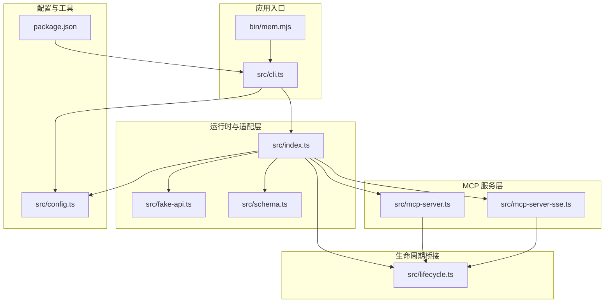
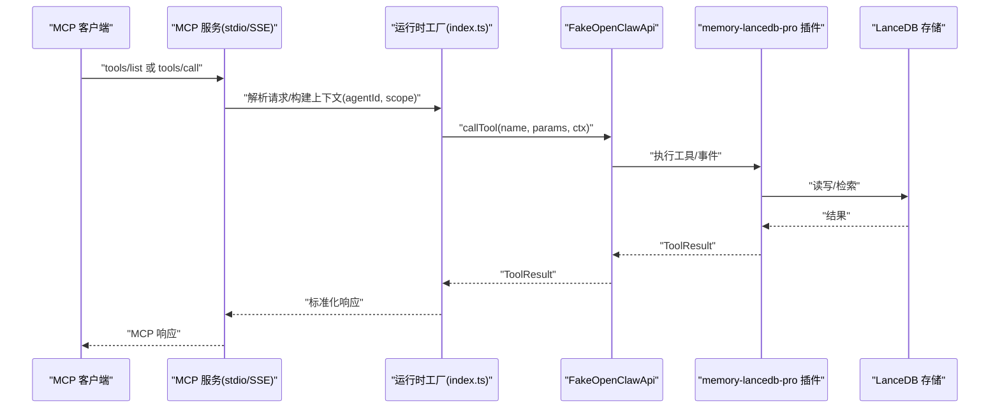
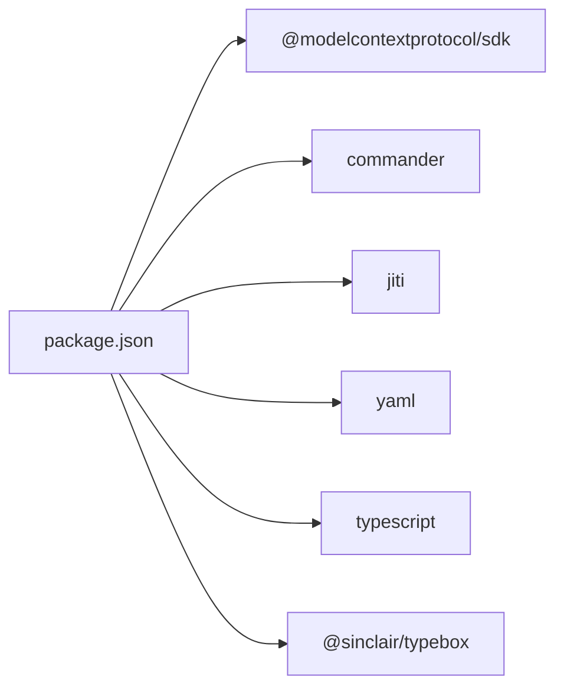

# 调试与故障排除

<cite>
**本文引用的文件**
- [README.md](file://README.md)
- [docs/USAGE_GUIDE.md](file://docs/USAGE_GUIDE.md)
- [package.json](file://package.json)
- [src/index.ts](file://src/index.ts)
- [src/cli.ts](file://src/cli.ts)
- [src/config.ts](file://src/config.ts)
- [src/fake-api.ts](file://src/fake-api.ts)
- [src/mcp-server.ts](file://src/mcp-server.ts)
- [src/mcp-server-sse.ts](file://src/mcp-server-sse.ts)
- [src/lifecycle.ts](file://src/lifecycle.ts)
- [src/schema.ts](file://src/schema.ts)
- [bin/mem.mjs](file://bin/mem.mjs)
- [test/integration.test.mjs](file://test/integration.test.mjs)
</cite>

## 目录
1. [简介](#简介)
2. [项目结构](#项目结构)
3. [核心组件](#核心组件)
4. [架构总览](#架构总览)
5. [详细组件分析](#详细组件分析)
6. [依赖分析](#依赖分析)
7. [性能考虑](#性能考虑)
8. [故障排除指南](#故障排除指南)
9. [结论](#结论)
10. [附录](#附录)

## 简介
本指南聚焦于调试与故障排除，围绕 memory-lancedb-mcp 的运行时、配置、日志、传输层、生命周期钩子、CLI 命令与测试等方面，提供系统化的诊断思路、工具使用方法、常见错误与解决方案、性能优化策略、单元与集成测试编写要点，以及生产环境监控与应急处理建议。目标是帮助开发者快速定位问题、验证修复，并在生产环境中稳定运行。

## 项目结构
该项目采用“包装器 + 父项目插件”的架构：通过 jiti 直接加载 memory-lancedb-pro 的 TypeScript 源码，实现零修改适配 MCP 协议；同时提供 CLI、stdio 与 SSE 两种传输模式的服务端，以及 FakeOpenClawApi 适配层。

图表来源
- [bin/mem.mjs:1-8](file://bin/mem.mjs#L1-L8)
- [src/cli.ts:1-617](file://src/cli.ts#L1-L617)
- [src/index.ts:1-515](file://src/index.ts#L1-L515)
- [src/fake-api.ts:1-318](file://src/fake-api.ts#L1-L318)
- [src/mcp-server.ts:1-306](file://src/mcp-server.ts#L1-L306)
- [src/mcp-server-sse.ts:1-405](file://src/mcp-server-sse.ts#L1-L405)
- [src/lifecycle.ts:1-178](file://src/lifecycle.ts#L1-L178)
- [src/config.ts:1-312](file://src/config.ts#L1-L312)
- [package.json:1-46](file://package.json#L1-L46)

章节来源
- [README.md:1-738](file://README.md#L1-L738)
- [docs/USAGE_GUIDE.md:1-672](file://docs/USAGE_GUIDE.md#L1-L672)
- [package.json:1-46](file://package.json#L1-L46)

## 核心组件
- 运行时工厂与包装器：负责加载配置、构建 FakeOpenClawApi、注册插件、注入标签与 Scope 处理逻辑、暴露工具列表与生命周期钩子。
- FakeOpenClawApi 适配层：模拟 OpenClaw 插件运行时接口，捕获工具、事件与钩子，统一调用入口。
- MCP 服务层：stdio 与 SSE 两种传输模式，将工具与生命周期映射为 MCP 协议请求/响应。
- 配置系统：YAML 配置解析、环境变量扩展、默认路径与初始化。
- CLI：mem 命令集合，包含服务启动、工具调用、配置管理、健康检查、Scope 管理等。
- 生命周期桥接：将 before_prompt_build、agent_end、message_received、session_end 等事件映射为可调用的工具。
- 类型转换：TypeBox → JSON Schema，保证 MCP 工具列表输出兼容。

章节来源
- [src/index.ts:190-498](file://src/index.ts#L190-L498)
- [src/fake-api.ts:57-317](file://src/fake-api.ts#L57-L317)
- [src/mcp-server.ts:43-140](file://src/mcp-server.ts#L43-L140)
- [src/mcp-server-sse.ts:57-209](file://src/mcp-server-sse.ts#L57-L209)
- [src/config.ts:167-214](file://src/config.ts#L167-L214)
- [src/cli.ts:105-617](file://src/cli.ts#L105-L617)
- [src/lifecycle.ts:52-177](file://src/lifecycle.ts#L52-L177)
- [src/schema.ts:45-150](file://src/schema.ts#L45-L150)

## 架构总览
MCP 客户端通过 stdio 或 SSE 发起请求，服务端解析为工具调用或生命周期事件，运行时工厂根据 Scope 注入 agentId 与 scope，FakeOpenClawApi 调用插件工具，最终返回 MCP 格式响应。配置系统贯穿加载、校验与环境变量替换。

图表来源
- [src/mcp-server.ts:86-124](file://src/mcp-server.ts#L86-L124)
- [src/mcp-server-sse.ts:263-287](file://src/mcp-server-sse.ts#L263-L287)
- [src/index.ts:248-453](file://src/index.ts#L248-L453)
- [src/fake-api.ts:217-235](file://src/fake-api.ts#L217-L235)

## 详细组件分析

### 运行时工厂与包装器（createMemoryRuntime）
职责与关键点
- 加载配置（支持 MEM_CONFIG_PATH、默认路径、当前目录回退、环境变量扩展）。
- 根据 scope 注入 scopes.definitions 与 agentAccess，实现跨 scope 与锁定 scope 两种模式。
- 构建 FakeOpenClawApi，注册插件，触发 gateway_start。
- 工具调用前进行标签预处理（assembleTags）、Scope 注入（effectiveCtx、scope 强制、ACL bypass）、结果后处理（硬过滤 + 前缀剥离）。
- 注入 synthetic 工具 list_scopes，聚合配置与实际统计。
- 暴露 listTools（含 tags 参数注入）、emitEvent、triggerHook、getCliInstance。

调试要点
- 配置路径与环境变量：确认 MEM_CONFIG_PATH 是否覆盖默认路径；检查环境变量是否设置。
- Scope 注入：锁定模式下 agentId="system" 且 normalized.scope 强制为服务端 scope；跨 scope 模式下 memory_store 未指定 scope 自动注入 global。
- 标签处理：normalizeTags 严格校验，非法字符会抛错；list+tags 会重写为 recall(query=prefix) 以实现 BM25 命中。

章节来源
- [src/index.ts:207-498](file://src/index.ts#L207-L498)
- [src/config.ts:167-214](file://src/config.ts#L167-L214)
- [src/index.ts:313-450](file://src/index.ts#L313-L450)

### FakeOpenClawApi 适配层
职责与关键点
- 注册工具工厂、事件处理器、钩子处理器、CLI 实例。
- callTool 统一执行入口，构造 toolCtx（agentId/sessionKey），调用工厂产出的工具定义。
- emitEvent/triggerHook 模拟 OpenClaw 事件/钩子，支持排序与错误降级。
- 日志接口：debug/info/warn/error，支持 quiet 控制。

调试要点
- 工具注册：registerTool 预览工厂以提取工具名，缺失 name 将被忽略并记录警告。
- 事件/钩子：handler 抛错会被捕获并记录警告，不影响其他处理器。
- 路径解析：resolvePath 支持 ~、相对路径与绝对路径，便于定位配置与数据目录。

章节来源
- [src/fake-api.ts:57-317](file://src/fake-api.ts#L57-L317)

### MCP 服务层（stdio 与 SSE）
职责与关键点
- stdio：StdioServerTransport，工具列表与调用映射，错误封装为 MCP 响应。
- SSE：HTTP + SSE，/sse 事件流、/message JSON-RPC、/health 健康检查；支持多客户端连接与优雅关闭。
- 生命周期工具：_lifecycle_auto_recall/_lifecycle_auto_capture/_lifecycle_session_end，分别映射 message_received → before_prompt_build → prependContext，agent_end → auto-capture，session_end → 清理。

调试要点
- stdio 模式默认抑制 debug 日志，避免污染协议输出。
- SSE 模式未指定 scope 时会发出跨 scope 警告，注意 host 绑定与网络暴露风险。
- SSE 客户端连接池与消息推送：单客户端场景下响应通过第一个 SSE 客户端返回。

章节来源
- [src/mcp-server.ts:43-140](file://src/mcp-server.ts#L43-L140)
- [src/mcp-server-sse.ts:57-209](file://src/mcp-server-sse.ts#L57-L209)
- [src/lifecycle.ts:52-177](file://src/lifecycle.ts#L52-L177)

### 配置系统
职责与关键点
- 配置路径解析顺序：MEM_CONFIG_PATH > ~/.config/memory-mcp/config.yaml > ./config.yaml > 默认最小配置。
- 环境变量展开：${VAR} 语法，未设置时记录警告并替换为空字符串。
- 初始化模板：包含 dbPath、embedding、llm、autoCapture/autoRecall、smartExtraction、retrieval、scopes、selfImprovement 等。
- 校验：embedding.apiKey 必填；缺失时报错并指导初始化。

调试要点
- doctor 命令：检查配置文件存在、解析、API Key、插件加载与工具列表。
- 环境变量：确认 OPENAI_API_KEY/SILICONFLOW_API_KEY 等是否正确设置。

章节来源
- [src/config.ts:107-214](file://src/config.ts#L107-L214)
- [src/cli.ts:449-517](file://src/cli.ts#L449-L517)

### CLI（mem 命令）
职责与关键点
- serve：启动 stdio 或 SSE 服务，支持 dry-run、scope、quiet、port/host 等参数。
- list/search/stats/store/delete：调用 runtime 工具，支持 tags、limit、offset、category、scope 等过滤。
- config：init/show/path/validate。
- doctor：综合健康检查。
- scope：list/delete（支持 dry-run 与 --yes 确认）。

调试要点
- 退出码：命令失败时返回非零，便于脚本判断。
- secret 脱敏：maskSecrets 在 show 中对敏感字段进行掩码显示。
- 路径解析：resolveDbPath 将 ~/ 转换为主目录，避免权限问题。

章节来源
- [src/cli.ts:105-617](file://src/cli.ts#L105-L617)
- [bin/mem.mjs:1-8](file://bin/mem.mjs#L1-L8)

### 生命周期桥接
职责与关键点
- triggerAutoRecall：触发 before_prompt_build，收集 prependContext，支持 ephemeral 上下文。
- triggerAutoCapture：触发 agent_end，后台提取记忆。
- triggerSessionEnd：触发 session_end，清理状态。
- triggerMessageReceived：缓存原始消息，供 auto-recall gating 使用。

调试要点
- 事件顺序：message_received → before_prompt_build → prependContext；agent_end → auto-capture。
- 上下文字段：agentId、sessionKey、sessionId、channelId。

章节来源
- [src/lifecycle.ts:52-177](file://src/lifecycle.ts#L52-L177)

### 类型转换（TypeBox → JSON Schema）
职责与关键点
- 清洗 TypeBox schema，去除内部符号与扩展属性，保留标准 JSON Schema 字段。
- 递归处理 properties/items/oneOf/anyOf/allOf。
- extractInputSchema 确保顶层为 object 类型。

调试要点
- MCP 工具列表输出依赖此转换，schema 不合法会导致工具定义异常。

章节来源
- [src/schema.ts:45-150](file://src/schema.ts#L45-L150)

## 依赖分析
- 运行时依赖：@modelcontextprotocol/sdk（MCP 协议）、commander（CLI）、jiti（TS 直载）、yaml（配置解析）。
- 开发依赖：@sinclair/typebox（TypeBox schema）、typescript。
- 与父项目：memory-lancedb-pro 通过 jiti 直接加载源码，避免本地构建。

图表来源
- [package.json:26-36](file://package.json#L26-L36)

章节来源
- [package.json:1-46](file://package.json#L1-L46)

## 性能考虑
- 检索性能
  - 混合检索（向量 + BM25）与 RRF 融合，合理设置 retrieval.vectorWeight/bm25Weight 与 minScore/hardMinScore。
  - 建议使用“实体名 + 技术术语”构造 query，提高召回质量与稳定性。
  - tags 作为软过滤，可结合 category 与 limit 控制结果规模。
- 存储与写入
  - memory_store 建议内容长度≥100 字，提升语义匹配效果。
  - importance 评分影响权重与衰减策略，合理标注核心信息。
- SSE 与并发
  - SSE 模式支持多客户端，注意 host 绑定与网络暴露风险；生产环境建议反向代理 + 认证。
- 资源与内存
  - LanceDB 原生模块在不同平台（Linux x64、ARM64、WSL）需正确安装对应模块；WSL 下可手动安装 Linux 原生模块。
  - 平台特定：Linux 需要 AVX2；ARM64 需确保原生模块匹配；macOS 默认无需额外操作。

章节来源
- [docs/USAGE_GUIDE.md:317-381](file://docs/USAGE_GUIDE.md#L317-L381)
- [README.md:132-167](file://README.md#L132-L167)

## 故障排除指南

### 1. 服务启动失败
- 步骤
  - 验证配置：mem config validate
  - 查看配置文件与 API Key：mem config show
  - 运行健康检查：mem doctor
- 常见原因
  - 配置文件不存在或解析失败
  - embedding.apiKey 缺失或环境变量未设置
  - 嵌入模型 endpoint 不可达
  - 数据目录权限不足或 LanceDB 原生模块缺失

章节来源
- [src/cli.ts:449-517](file://src/cli.ts#L449-L517)
- [src/config.ts:167-214](file://src/config.ts#L167-L214)
- [docs/USAGE_GUIDE.md:618-631](file://docs/USAGE_GUIDE.md#L618-L631)

### 2. 嵌入模型错误
- 检查
  - embedding.model 是否有效
  - OpenAI 兼容接口 baseURL 是否正确
  - Ollama 本地模型服务是否启动
- 建议
  - 使用 doctor --mcp 测试 MCP 协议握手
  - 在 CLI 中使用 --quiet 抑制调试日志，聚焦错误信息

章节来源
- [docs/USAGE_GUIDE.md:638-643](file://docs/USAGE_GUIDE.md#L638-L643)
- [src/mcp-server.ts:117-123](file://src/mcp-server.ts#L117-L123)

### 3. 召回结果不准确
- 排查优先级
  - query 格式：使用“实体名 + 技术术语”
  - 内容丰富度：记忆长度≥100 字
  - 关键词唯一性：避免过于泛化的术语
  - 标签辅助：使用 tags 参数缩小范围
- 工具
  - mem search --tags 与 --limit 组合
  - mem list --category 与 --tags

章节来源
- [docs/USAGE_GUIDE.md:317-381](file://docs/USAGE_GUIDE.md#L317-L381)

### 4. Scope 权限拒绝
- 现象
  - Scope mismatch：服务端锁定 scope 与请求 scope 不一致
  - Access denied to scope：ACL 检查失败
- 处理
  - 确认服务启动时 --scope 值
  - 使用 mem scope list 查看可用 scope
  - 跨 scope 模式下 memory_store 不指定 scope 会自动写入 global

章节来源
- [src/index.ts:351-367](file://src/index.ts#L351-L367)
- [docs/USAGE_GUIDE.md:653-666](file://docs/USAGE_GUIDE.md#L653-L666)

### 5. 标签校验与过滤异常
- 现象
  - Invalid tag value：标签包含不允许字符（如 】、空格、emoji）
  - list+tags 过滤不生效：wrapper 将其重写为 recall(query=prefix)
- 处理
  - 修正标签字符集：字母、数字、_、-、:、/、.、CJK
  - 使用 search 或 recall 显式传入 tags，确保 BM25 命中

章节来源
- [src/index.ts:41-52](file://src/index.ts#L41-L52)
- [src/index.ts:326-335](file://src/index.ts#L326-L335)

### 6. SSE 与 stdio 传输问题
- SSE
  - 未指定 scope 会发出跨 scope 警告，注意 host 绑定与网络暴露
  - /health 健康检查端点可用于探活
- stdio
  - 默认抑制 debug 日志，避免污染协议输出
  - 使用 --quiet 抑制日志，--dry-run 预览工具列表

章节来源
- [src/mcp-server-sse.ts:174-190](file://src/mcp-server-sse.ts#L174-L190)
- [src/mcp-server.ts:130-140](file://src/mcp-server.ts#L130-L140)

### 7. 平台与原生模块问题
- Linux x64：需要 AVX2，否则报 Illegal instruction
- WSL：npm 可能检测为 Windows，需手动安装 Linux 原生模块
- macOS：默认无需额外操作
- ARM64：确保使用 ARM64 原生模块，必要时重建

章节来源
- [README.md:132-167](file://README.md#L132-L167)

### 8. 日志分析与问题定位
- 日志来源
  - FakeOpenClawApi.logger：[mem:debug/info/warn/error]
  - stdio 模式默认抑制 debug；SSE 模式可开启 quiet 控制
- 定位技巧
  - 使用 --dry-run 验证配置与工具列表
  - doctor 命令汇总检查结果，失败时返回非零退出码
  - mem config show 输出中敏感字段掩码显示，便于分享

章节来源
- [src/fake-api.ts:84-89](file://src/fake-api.ts#L84-L89)
- [src/mcp-server.ts:49-52](file://src/mcp-server.ts#L49-L52)
- [src/cli.ts:397-415](file://src/cli.ts#L397-L415)

### 9. 配置问题诊断与修复
- 诊断
  - mem doctor：检查配置文件、解析、API Key、插件加载与工具列表
  - mem config path：确认配置文件路径
  - mem config validate：验证关键字段
- 修复
  - mem config init --force：覆盖现有配置
  - 设置环境变量：OPENAI_API_KEY/SILICONFLOW_API_KEY 等
  - 修改 ~/.config/memory-mcp/config.yaml 或通过 MEM_CONFIG_PATH 指定

章节来源
- [src/cli.ts:449-517](file://src/cli.ts#L449-L517)
- [src/config.ts:296-311](file://src/config.ts#L296-L311)

### 10. 单元测试与集成测试
- 目标
  - 验证运行时创建、工具注册、JSON Schema 转换、事件/钩子注册、路径解析
- 运行
  - npm test：执行 test/integration.test.mjs
- 建议
  - 在 CI 中加入 doctor 与 serve --dry-run 预检
  - 针对标签校验、Scope 注入、SSE/stdio 传输增加测试用例

章节来源
- [test/integration.test.mjs:1-131](file://test/integration.test.mjs#L1-L131)
- [package.json:14](file://package.json#L14)

### 11. 内存泄漏与资源管理
- 建议
  - SSE 模式优雅关闭：SIGINT/SIGTERM 时关闭 HTTP 与客户端连接
  - 定期清理旧 scope：mem scope delete --dry-run 预览后再 --yes 执行
  - 监控数据目录大小与权限，避免磁盘占满
- 注意
  - 仅在开发/测试环境使用 --dry-run 预览删除范围

章节来源
- [src/mcp-server-sse.ts:192-209](file://src/mcp-server-sse.ts#L192-L209)
- [src/cli.ts:564-610](file://src/cli.ts#L564-L610)

### 12. 生产环境监控与告警
- 健康检查
  - /health 端点返回 server/version/tools 数量
- 建议指标
  - 工具调用成功率与延迟
  - 检索命中率与平均返回条数
  - 数据库大小与写入速率
- 告警
  - doctor 失败、/health 不可用、工具调用错误率上升
  - 建议在反向代理层配置超时与重试策略

章节来源
- [src/mcp-server-sse.ts:96-106](file://src/mcp-server-sse.ts#L96-L106)

### 13. 社区支持与问题反馈
- 文档与使用手册
  - docs/USAGE_GUIDE.md 提供 CLI、Scope、召回最佳实践与故障排除
- 仓库与许可
  - 项目基于 MIT 许可，遵循 README.md 中的使用说明与平台注意事项

章节来源
- [docs/USAGE_GUIDE.md:1-27](file://docs/USAGE_GUIDE.md#L1-L27)
- [README.md:731-738](file://README.md#L731-L738)

### 14. 故障恢复与应急处理流程
- 快速恢复
  - doctor 检查配置与插件加载
  - 重启 MCP 服务（stdio/SSE）
  - 清理无效 scope 或重建数据目录
- 应急
  - 降级：关闭 SSE，回退 stdio
  - 限流：降低 limit、禁用 rerank 或调整 minScore
  - 备份：定期导出配置与数据目录快照

章节来源
- [src/cli.ts:449-517](file://src/cli.ts#L449-L517)
- [src/mcp-server.ts:130-140](file://src/mcp-server.ts#L130-L140)

## 结论
本指南从运行时、适配层、服务层、配置与 CLI、生命周期、类型转换六个维度梳理了调试与故障排除的关键点，并结合平台差异、性能优化与测试实践给出系统化建议。建议在开发与生产环境中持续运行 doctor 与 /health 探针，配合日志与指标监控，形成闭环的可观测性体系。

## 附录

### A. 常用命令速查
- 启动服务：mem serve [--sse] [--port] [--host] [--scope] [--dry-run] [--quiet]
- 工具调用：mem search/list/stats/store/delete [--tags] [--limit] [--offset] [--category]
- 配置管理：mem config init/show/path/validate
- 健康检查：mem doctor [--mcp]
- Scope 管理：mem scope list/delete --dry-run/--yes

章节来源
- [docs/USAGE_GUIDE.md:43-164](file://docs/USAGE_GUIDE.md#L43-L164)
- [src/cli.ts:105-617](file://src/cli.ts#L105-L617)