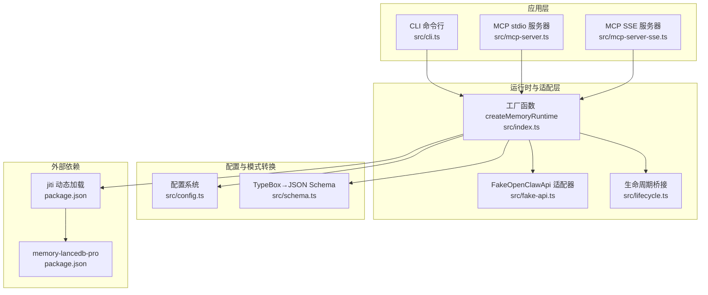
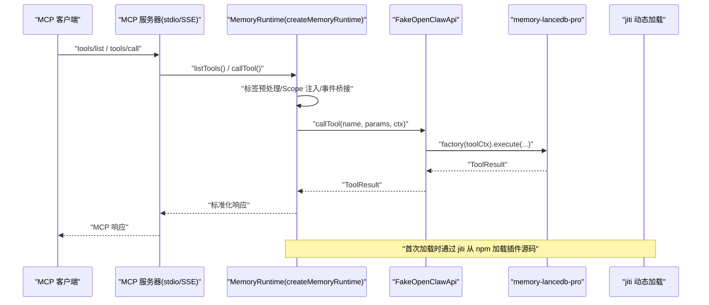
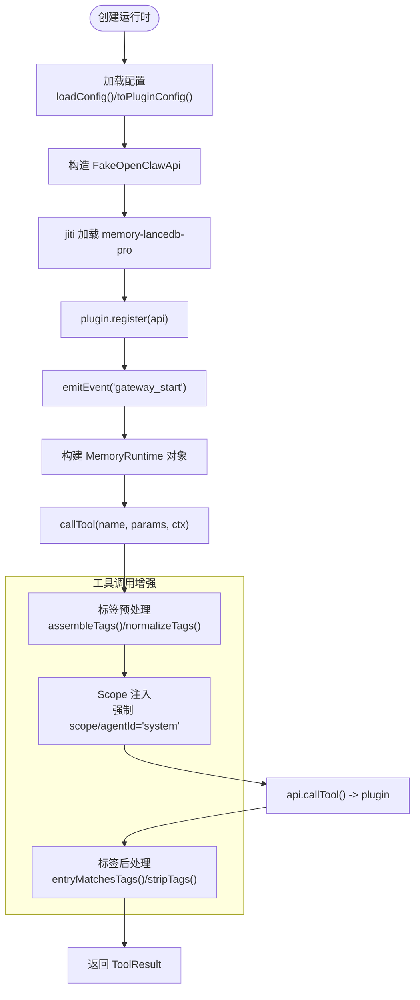
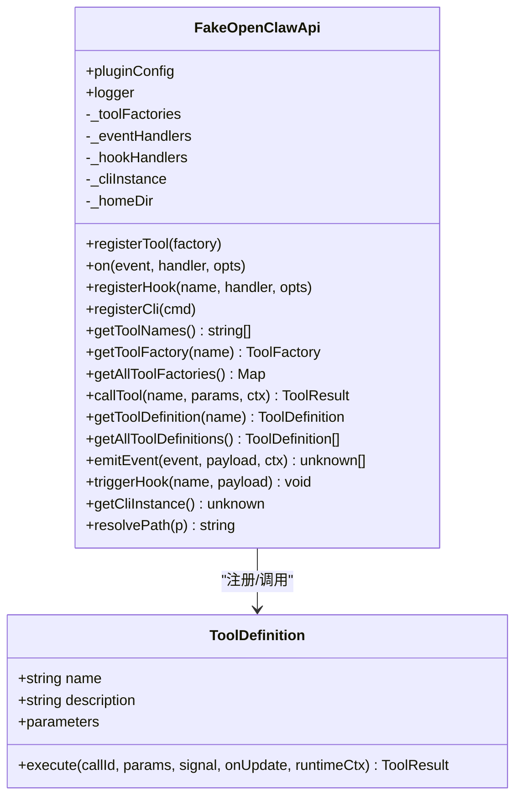
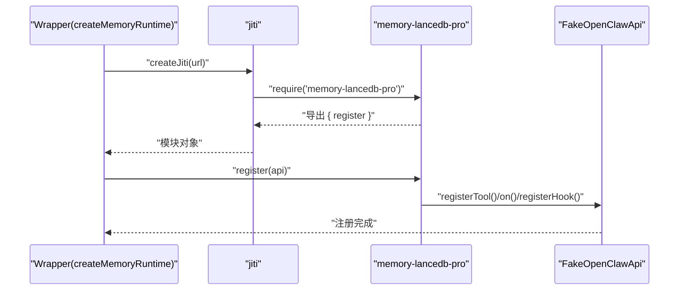
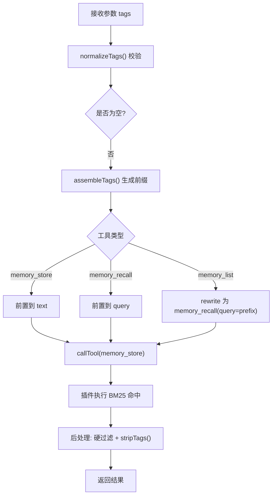
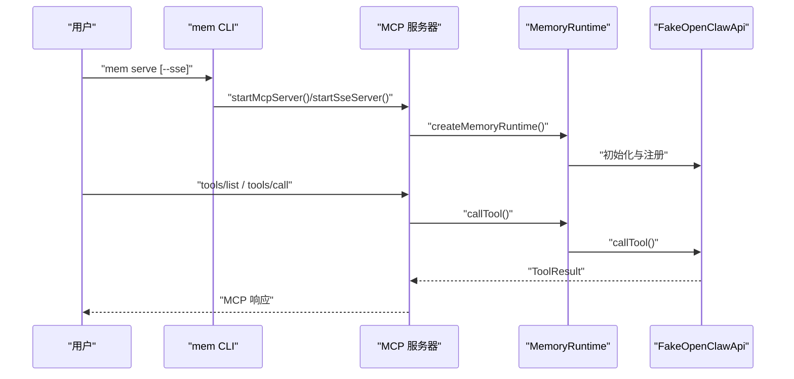
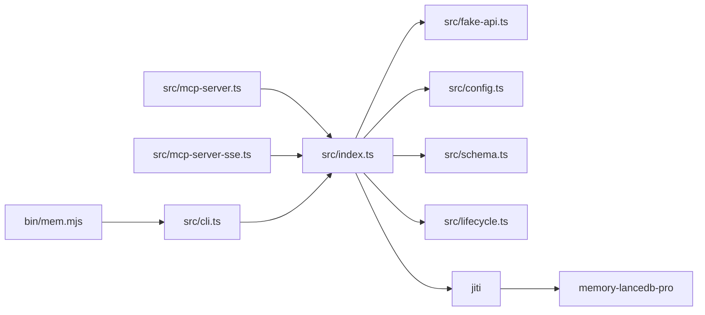

# 项目架构

<cite>
**本文引用的文件**
- [src/index.ts](file://src/index.ts)
- [src/fake-api.ts](file://src/fake-api.ts)
- [src/cli.ts](file://src/cli.ts)
- [src/config.ts](file://src/config.ts)
- [src/schema.ts](file://src/schema.ts)
- [src/lifecycle.ts](file://src/lifecycle.ts)
- [src/mcp-server.ts](file://src/mcp-server.ts)
- [src/mcp-server-sse.ts](file://src/mcp-server-sse.ts)
- [bin/mem.mjs](file://bin/mem.mjs)
- [package.json](file://package.json)
- [README.md](file://README.md)
- [test/integration.test.mjs](file://test/integration.test.mjs)
- [docs/USAGE_GUIDE.md](file://docs/USAGE_GUIDE.md)
</cite>

## 目录
1. [简介](#简介)
2. [项目结构](#项目结构)
3. [核心组件](#核心组件)
4. [架构总览](#架构总览)
5. [详细组件分析](#详细组件分析)
6. [依赖分析](#依赖分析)
7. [性能考虑](#性能考虑)
8. [故障排除指南](#故障排除指南)
9. [结论](#结论)
10. [附录](#附录)

## 简介
本项目为 memory-lancedb-pro 的 MCP（Model Context Protocol）包装器，通过 FakeOpenClawApi 适配器与 jiti 直接加载机制，将 memory-lancedb-pro 的 14 个核心记忆工具无缝暴露为 MCP 服务，并提供 CLI 管理工具与生命周期桥接。项目强调“零修改”接入父项目，支持 stdio 与 SSE 两种传输模式，提供多项目隔离（Scope）与标签（Tags）增强检索能力。

## 项目结构
项目采用按职责分层的模块化组织：
- 入口与工厂：src/index.ts 提供 createMemoryRuntime 工厂函数与运行时封装
- 适配器：src/fake-api.ts 实现 FakeOpenClawApi，模拟 OpenClaw 运行时接口
- 配置与模式转换：src/config.ts、src/schema.ts 提供 YAML 配置解析与 TypeBox 到 JSON Schema 的转换
- 生命周期桥接：src/lifecycle.ts 将 OpenClaw 生命周期事件映射为 MCP 工具
- MCP 服务：src/mcp-server.ts（stdio）、src/mcp-server-sse.ts（SSE）分别实现两种传输
- CLI：src/cli.ts 提供 mem 命令行工具，bin/mem.mjs 为可执行入口
- 测试与文档：test/integration.test.mjs、docs/USAGE_GUIDE.md、README.md

图表来源
- [src/index.ts:190-498](file://src/index.ts#L190-L498)
- [src/fake-api.ts:57-317](file://src/fake-api.ts#L57-L317)
- [src/cli.ts:17-27](file://src/cli.ts#L17-L27)
- [src/mcp-server.ts:43-140](file://src/mcp-server.ts#L43-L140)
- [src/mcp-server-sse.ts:57-209](file://src/mcp-server-sse.ts#L57-L209)
- [src/config.ts:220-223](file://src/config.ts#L220-L223)
- [src/schema.ts:45-150](file://src/schema.ts#L45-L150)
- [package.json:26-31](file://package.json#L26-L31)

章节来源
- [src/index.ts:190-498](file://src/index.ts#L190-L498)
- [src/fake-api.ts:57-317](file://src/fake-api.ts#L57-L317)
- [src/cli.ts:17-27](file://src/cli.ts#L17-L27)
- [src/mcp-server.ts:43-140](file://src/mcp-server.ts#L43-L140)
- [src/mcp-server-sse.ts:57-209](file://src/mcp-server-sse.ts#L57-L209)
- [src/config.ts:220-223](file://src/config.ts#L220-L223)
- [src/schema.ts:45-150](file://src/schema.ts#L45-L150)
- [package.json:26-31](file://package.json#L26-L31)

## 核心组件
- createMemoryRuntime 工厂函数：负责加载配置、构建 FakeOpenClawApi、注册 memory-lancedb-pro 插件、注入标签与 Scope 处理逻辑，并提供统一的工具调用、事件与钩子接口。
- FakeOpenClawApi 适配器：实现最小化的 OpenClaw 运行时接口，捕获工具工厂、事件与钩子处理器，以及 CLI 注册实例，供 MCP 服务器与 CLI 使用。
- 配置系统：解析 YAML 配置，支持环境变量扩展，提供 toPluginConfig 映射。
- TypeBox→JSON Schema 转换：将插件侧 TypeBox schema 转换为 MCP 所需的 JSON Schema。
- 生命周期桥接：将 before_prompt_build、agent_end 等事件映射为 MCP 工具，支持自动召回与自动捕获。
- MCP 服务器：stdio 与 SSE 两种传输，统一暴露工具列表与调用，处理生命周期工具。
- CLI：mem 命令行工具，支持 serve、list、search、stats、store、delete、config、doctor、scope 等子命令。

章节来源
- [src/index.ts:95-134](file://src/index.ts#L95-L134)
- [src/fake-api.ts:57-317](file://src/fake-api.ts#L57-L317)
- [src/config.ts:23-98](file://src/config.ts#L23-L98)
- [src/schema.ts:16-33](file://src/schema.ts#L16-L33)
- [src/lifecycle.ts:19-36](file://src/lifecycle.ts#L19-L36)
- [src/mcp-server.ts:28-33](file://src/mcp-server.ts#L28-L33)
- [src/mcp-server-sse.ts:31-40](file://src/mcp-server-sse.ts#L31-L40)
- [src/cli.ts:105-616](file://src/cli.ts#L105-L616)

## 架构总览
项目采用“适配器 + 工厂 + 插件注册”的架构模式：
- 通过 FakeOpenClawApi 适配器对接 memory-lancedb-pro 的运行时接口，实现零侵入接入。
- 通过 jiti 直接从 npm 包加载 TypeScript 源码，避免本地构建与发布。
- 通过 createMemoryRuntime 工厂函数集中初始化配置、Scope 注入、标签预处理与后处理、事件与钩子桥接。
- MCP 服务器与 CLI 通过统一的 MemoryRuntime 接口访问工具与生命周期能力。

图表来源
- [src/index.ts:207-498](file://src/index.ts#L207-L498)
- [src/fake-api.ts:217-235](file://src/fake-api.ts#L217-L235)
- [src/mcp-server.ts:61-124](file://src/mcp-server.ts#L61-L124)
- [src/mcp-server-sse.ts:247-287](file://src/mcp-server-sse.ts#L247-L287)
- [src/index.ts:159-184](file://src/index.ts#L159-L184)

章节来源
- [src/index.ts:207-498](file://src/index.ts#L207-L498)
- [src/fake-api.ts:217-235](file://src/fake-api.ts#L217-L235)
- [src/mcp-server.ts:61-124](file://src/mcp-server.ts#L61-L124)
- [src/mcp-server-sse.ts:247-287](file://src/mcp-server-sse.ts#L247-L287)
- [src/index.ts:159-184](file://src/index.ts#L159-L184)

## 详细组件分析

### createMemoryRuntime 工厂函数
设计理念与实现要点：
- 配置加载与合并：支持外部配置对象或配置文件路径，必要时注入 Scope 定义与代理访问控制，实现项目级隔离。
- FakeOpenClawApi 初始化：将 MemConfig 转换为插件期望的 pluginConfig，并构造 API 实例。
- 插件加载与注册：通过 jiti 直接从 npm 包加载 memory-lancedb-pro 源码，fallback 至本地 dist，确保开发与生产环境兼容。
- 工具调用增强：在 callTool 中实现标签前缀注入、Scope 强制与 ACL 绕过、跨 scope 模式下的默认 Scope 注入、标签后处理与硬过滤。
- 生命周期事件：启动时触发 gateway_start，便于插件执行自动整理等任务。
- 工具列表增强：为 tag-aware 工具注入 tags 参数 schema，并提供 list_scopes 合并统计工具。

图表来源
- [src/index.ts:207-498](file://src/index.ts#L207-L498)
- [src/index.ts:159-184](file://src/index.ts#L159-L184)
- [src/fake-api.ts:217-235](file://src/fake-api.ts#L217-L235)

章节来源
- [src/index.ts:207-498](file://src/index.ts#L207-L498)
- [src/index.ts:159-184](file://src/index.ts#L159-L184)

### FakeOpenClawApi 适配器
架构模式与职责：
- 适配器模式：实现最小化的 OpenClawPluginApi 接口，捕获工具工厂、事件与钩子处理器，以及 CLI 注册实例。
- 工具注册：registerTool 捕获工厂，支持预览以提取工具名，便于后续 listTools 与 callTool。
- 事件与钩子：on/registerHook 分别注册事件与钩子处理器，支持优先级排序与异步执行。
- CLI 注册：registerCli 保存 CLI 实例，供上层复用。
- 工具调用：callTool 通过工厂生成工具定义并执行，支持 agentId 与 sessionKey 默认值。
- 路径解析：resolvePath 支持 ~、绝对路径与相对路径解析，便于插件读取配置与数据文件。

图表来源
- [src/fake-api.ts:57-317](file://src/fake-api.ts#L57-L317)

章节来源
- [src/fake-api.ts:57-317](file://src/fake-api.ts#L57-L317)

### memory-lancedb-pro 插件集成与 jiti 直接加载机制
- 零构建接入：通过 jiti.createJiti 动态加载 memory-lancedb-pro 的 TypeScript 源码，无需本地构建 dist。
- 开发与生产兼容：优先尝试 npm 包源码，失败时回退至本地 dist，满足开发与部署需求。
- 插件注册：调用 plugin.register(api)，将 14 个工具与生命周期事件注入 FakeOpenClawApi。

图表来源
- [src/index.ts:159-184](file://src/index.ts#L159-L184)

章节来源
- [src/index.ts:159-184](file://src/index.ts#L159-L184)

### 标签（Tags）系统与 Scope 隔离
- 标签前缀：通过 normalizeTags/assembleTags 将 tags 注入到 text/query 前缀，利用 BM25 命中标签前缀，实现软过滤。
- 标签后处理：在 recall/list 结果中硬过滤匹配的条目，并剥离前缀，保证展示干净文本。
- Scope 注入：跨 scope 模式下，未指定 scope 的 store 自动注入默认 scope；锁定 scope 模式下，强制所有操作限定在服务端 scope，并通过 agentId="system" 绕过 ACL 检查。

图表来源
- [src/index.ts:313-452](file://src/index.ts#L313-L452)

章节来源
- [src/index.ts:313-452](file://src/index.ts#L313-L452)

### MCP 服务器与 CLI 交互
- stdio 模式：通过 @modelcontextprotocol/sdk 的 StdioServerTransport 启动，统一处理 tools/list 与 tools/call，支持生命周期工具。
- SSE 模式：自定义 HTTP/SSE 传输，暴露 /sse 与 /message 端点，支持健康检查与消息转发。
- CLI：mem 命令行工具，支持 serve、list、search、stats、store、delete、config、doctor、scope 等子命令，内部复用 createMemoryRuntime。

图表来源
- [src/mcp-server.ts:43-140](file://src/mcp-server.ts#L43-L140)
- [src/mcp-server-sse.ts:57-209](file://src/mcp-server-sse.ts#L57-L209)
- [src/cli.ts:105-616](file://src/cli.ts#L105-L616)

章节来源
- [src/mcp-server.ts:43-140](file://src/mcp-server.ts#L43-L140)
- [src/mcp-server-sse.ts:57-209](file://src/mcp-server-sse.ts#L57-L209)
- [src/cli.ts:105-616](file://src/cli.ts#L105-L616)

## 依赖分析
- 外部依赖：@modelcontextprotocol/sdk（MCP 协议实现）、commander（CLI）、jiti（TS 源码动态加载）、yaml（配置解析）、memory-lancedb-pro（核心记忆引擎）。
- 内部依赖：src/index.ts 依赖 src/fake-api.ts、src/config.ts、src/schema.ts、src/lifecycle.ts；MCP 服务器依赖 src/index.ts；CLI 依赖 src/cli.ts 与 src/index.ts；SSE 服务器依赖 src/index.ts。

图表来源
- [src/index.ts:9-12](file://src/index.ts#L9-L12)
- [src/mcp-server.ts:14-22](file://src/mcp-server.ts#L14-L22)
- [src/mcp-server-sse.ts:16-23](file://src/mcp-server-sse.ts#L16-L23)
- [src/cli.ts:20-27](file://src/cli.ts#L20-L27)
- [bin/mem.mjs:3](file://bin/mem.mjs#L3)
- [package.json:26-31](file://package.json#L26-L31)

章节来源
- [src/index.ts:9-12](file://src/index.ts#L9-L12)
- [src/mcp-server.ts:14-22](file://src/mcp-server.ts#L14-L22)
- [src/mcp-server-sse.ts:16-23](file://src/mcp-server-sse.ts#L16-L23)
- [src/cli.ts:20-27](file://src/cli.ts#L20-L27)
- [bin/mem.mjs:3](file://bin/mem.mjs#L3)
- [package.json:26-31](file://package.json#L26-L31)

## 性能考虑
- jiti 动态加载：首次加载时存在冷启动开销，但避免了本地构建与发布流程，提升迭代效率。
- 标签过滤：BM25 软过滤 + 后处理硬过滤，平衡召回质量与准确性；建议合理使用 tags 与 category 组合减少无效匹配。
- Scope 注入：锁定模式下通过 agentId="system" 绕过 ACL，避免重复检查；跨 scope 模式下默认 global 注入避免写入私有空间。
- SSE 传输：HTTP/SSE 适合远程或多客户端场景，注意客户端连接管理与资源释放。

## 故障排除指南
- 配置文件缺失：检查 MEM_CONFIG_PATH 或默认路径 ~/.config/memory-mcp/config.yaml 是否存在。
- API Key 未设置：确认 embedding.apiKey 或环境变量已正确配置。
- 插件加载失败：确保 memory-lancedb-pro 已安装，或检查本地 dist 是否存在。
- Scope 权限拒绝：锁定模式下请求的 scope 必须与服务端一致，否则返回 scope mismatch。
- SSE 模式暴露风险：未加 scope 且绑定到外网地址时，所有 scope 均可被访问，需谨慎配置 host/port。

章节来源
- [src/config.ts:167-214](file://src/config.ts#L167-L214)
- [src/index.ts:159-184](file://src/index.ts#L159-L184)
- [src/mcp-server-sse.ts:176-183](file://src/mcp-server-sse.ts#L176-L183)
- [docs/USAGE_GUIDE.md:618-666](file://docs/USAGE_GUIDE.md#L618-L666)

## 结论
本项目通过 FakeOpenClawApi 适配器与 jiti 直接加载机制，实现了对 memory-lancedb-pro 的零修改接入，结合 createMemoryRuntime 工厂函数提供的标签与 Scope 增强、生命周期桥接与多传输模式支持，形成了稳定、可扩展且易于维护的 MCP 记忆服务框架。架构决策强调“零侵入、可移植、易扩展”，为多项目长期记忆管理提供了可靠基础。

## 附录
- 架构演进历史与未来规划
  - 当前版本：v0.1.0，支持 stdio 与 SSE、多项目隔离、标签系统、生命周期桥接。
  - 未来规划（概念性）：支持更多传输协议（WebSocket/IPC）、增强 ACL 策略、引入缓存与批处理优化、可视化管理面板、插件生态扩展点。