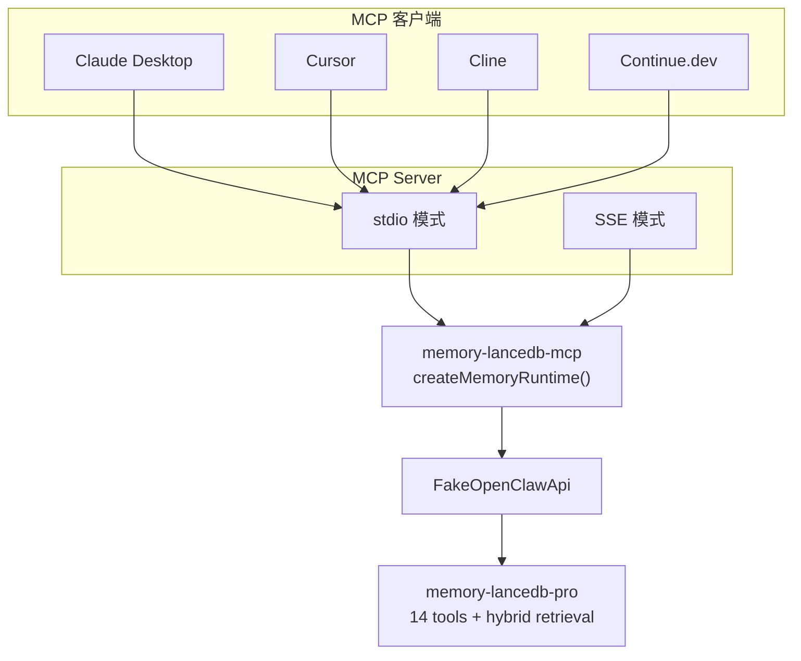
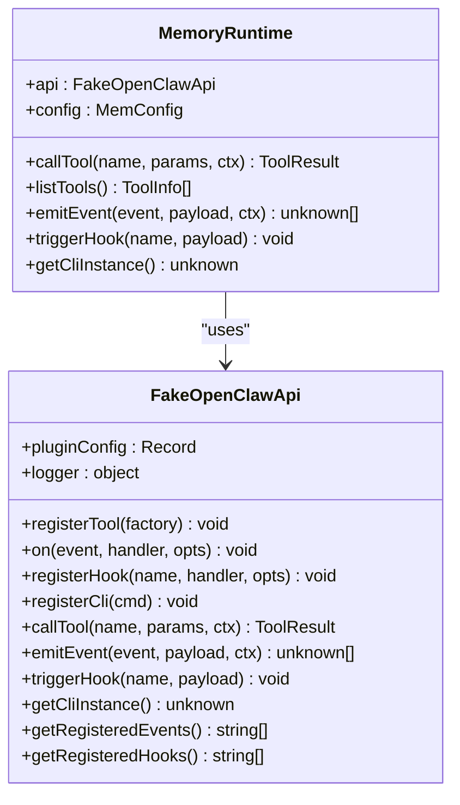
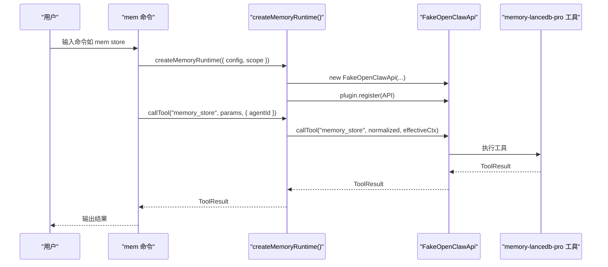
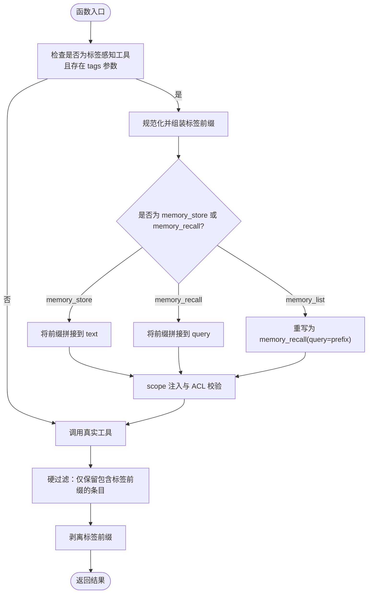
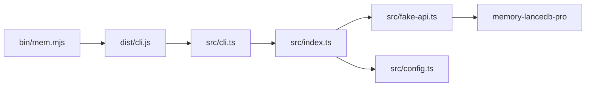

# 快速开始

<cite>
**本文引用的文件**
- [README.md](file://README.md)
- [docs/USAGE_GUIDE.md](file://docs/USAGE_GUIDE.md)
- [package.json](file://package.json)
- [bin/mem.mjs](file://bin/mem.mjs)
- [src/index.ts](file://src/index.ts)
- [src/cli.ts](file://src/cli.ts)
- [src/config.ts](file://src/config.ts)
- [src/mcp-server.ts](file://src/mcp-server.ts)
- [src/mcp-server-sse.ts](file://src/mcp-server-sse.ts)
- [src/fake-api.ts](file://src/fake-api.ts)
- [src/schema.ts](file://src/schema.ts)
- [test/integration.test.mjs](file://test/integration.test.mjs)
</cite>

## 目录
1. [简介](#简介)
2. [项目结构](#项目结构)
3. [核心组件](#核心组件)
4. [架构总览](#架构总览)
5. [详细组件分析](#详细组件分析)
6. [依赖分析](#依赖分析)
7. [性能考虑](#性能考虑)
8. [故障排除指南](#故障排除指南)
9. [结论](#结论)
10. [附录](#附录)

## 简介
memory-lancedb-mcp 是面向 AI 应用的 MCP Server，提供持久化长期记忆能力。它基于 memory-lancedb-pro 的向量记忆引擎，通过 MCP 协议桥接，支持语义检索、多项目隔离、自动分类与衰减，并提供 CLI 管理工具与双传输模式（stdio/SSE）。

- 支持的 MCP 客户端：Claude Desktop、Cursor、Cline、Continue.dev 等
- 支持的嵌入提供商：OpenAI、SiliconFlow、Ollama 等
- 提供 17 个记忆工具（recall、store、forget、update、stats、list、debug、promote、archive、compact、explain_rank、self-improvement 等）
- 多项目隔离：通过 --scope 参数按项目隔离记忆
- 双传输模式：stdio（本地客户端）与 SSE（HTTP，远程/多客户端）

**章节来源**
- [README.md:11-21](file://README.md#L11-L21)

## 项目结构
- bin/mem.mjs：CLI 入口，调用 dist/cli.js
- src/index.ts：主入口，创建 MemoryRuntime，封装标签与 scope 注入、生命周期桥接
- src/cli.ts：mem 命令行实现，提供 serve、store、search、list、stats、scope、config、doctor 等子命令
- src/config.ts：配置加载与初始化，支持 YAML、环境变量扩展
- src/mcp-server.ts：stdio 模式 MCP 服务器
- src/mcp-server-sse.ts：SSE 模式 MCP 服务器（HTTP）
- src/fake-api.ts：模拟 OpenClaw 运行时接口，注册工具、事件、钩子、CLI
- src/schema.ts：TypeBox → JSON Schema 转换器
- test/integration.test.mjs：集成测试，验证工具注册与事件钩子

```mermaid
graph TB
subgraph "CLI"
BIN["bin/mem.mjs"]
CLI["src/cli.ts"]
end
subgraph "MCP Server"
STDIO["src/mcp-server.ts"]
SSE["src/mcp-server-sse.ts"]
end
subgraph "Runtime"
IDX["src/index.ts"]
FAKE["src/fake-api.ts"]
SCHEMA["src/schema.ts"]
end
CFG["src/config.ts"]
BIN --> CLI
CLI --> IDX
IDX --> FAKE
IDX --> CFG
CLI --> STDIO
CLI --> SSE
STDIO --> FAKE
SSE --> FAKE
IDX --> SCHEMA
```

**图表来源**
- [bin/mem.mjs:1-8](file://bin/mem.mjs#L1-L8)
- [src/cli.ts:1-617](file://src/cli.ts#L1-L617)
- [src/index.ts:1-515](file://src/index.ts#L1-L515)
- [src/mcp-server.ts:1-306](file://src/mcp-server.ts#L1-L306)
- [src/mcp-server-sse.ts:1-405](file://src/mcp-server-sse.ts#L1-L405)
- [src/fake-api.ts:1-318](file://src/fake-api.ts#L1-L318)
- [src/schema.ts:1-151](file://src/schema.ts#L1-L151)
- [src/config.ts:1-312](file://src/config.ts#L1-L312)

**章节来源**
- [README.md:72-87](file://README.md#L72-L87)
- [package.json:1-46](file://package.json#L1-L46)

## 核心组件
- MemoryRuntime：封装 createMemoryRuntime，负责配置加载、FakeOpenClawApi 初始化、插件注册、工具调用、事件与钩子、CLI 实例导出
- FakeOpenClawApi：模拟 OpenClaw 运行时，注册 14 个工具、事件与钩子，暴露 callTool、emitEvent、triggerHook、getCliInstance 等
- CLI 命令体系：mem serve、store、search、list、stats、scope、config、doctor
- 配置系统：YAML 文件 + 环境变量扩展，支持 dbPath、embedding、retrieval、scopes 等
- MCP 服务器：stdio（默认）与 SSE（HTTP）两种传输模式

**章节来源**
- [src/index.ts:190-498](file://src/index.ts#L190-L498)
- [src/fake-api.ts:57-317](file://src/fake-api.ts#L57-L317)
- [src/cli.ts:105-617](file://src/cli.ts#L105-L617)
- [src/config.ts:167-223](file://src/config.ts#L167-L223)

## 架构总览
memory-lancedb-mcp 将 memory-lancedb-pro 的工具通过 FakeOpenClawApi 注册到 MCP 服务器，支持 stdio（本地客户端）与 SSE（HTTP）两种传输。CLI 通过 createMemoryRuntime 直接调用工具，同时提供健康检查与 scope 管理。



**图表来源**
- [README.md:22-45](file://README.md#L22-L45)
- [src/mcp-server.ts:43-140](file://src/mcp-server.ts#L43-L140)
- [src/mcp-server-sse.ts:57-209](file://src/mcp-server-sse.ts#L57-L209)
- [src/index.ts:159-184](file://src/index.ts#L159-L184)

## 详细组件分析

### 环境要求与安装
- Node.js ≥ 18、Git
- 安装：克隆仓库、执行 npm install 与 tsc 编译
- 无需手动克隆父项目，通过 jiti 直接从 node_modules/memory-lancedb-pro 加载源码

**章节来源**
- [README.md:74-87](file://README.md#L74-L87)
- [package.json:37-39](file://package.json#L37-L39)

### 配置初始化与 API 密钥设置
- 初始化配置：mem config init，生成 ~/.config/memory-mcp/config.yaml
- 支持 OpenAI、SiliconFlow、Ollama 等嵌入提供商
- 环境变量扩展：${OPENAI_API_KEY}、${SILICONFLOW_API_KEY} 等
- 默认配置包含 dbPath、embedding、retrieval、scopes 等

**章节来源**
- [README.md:91-126](file://README.md#L91-L126)
- [src/config.ts:107-125](file://src/config.ts#L107-L125)
- [src/config.ts:229-290](file://src/config.ts#L229-L290)

### CLI 使用示例
- 启动服务：mem serve（stdio，默认）或 mem serve --sse（SSE）
- 存储记忆：mem store "<text>" --category --tags --importance --scope
- 语义搜索：mem search "<query>" --scope --tags --limit --json
- 列表查看：mem list --scope --category --tags --limit --offset --json
- 统计信息：mem stats --scope --json
- 删除记忆：mem delete <uuid>
- Scope 管理：mem scope list、mem scope delete <scope> --yes/--dry-run
- 配置管理：mem config init/show/path/validate
- 健康检查：mem doctor [--mcp]

**章节来源**
- [README.md:279-424](file://README.md#L279-L424)
- [docs/USAGE_GUIDE.md:43-164](file://docs/USAGE_GUIDE.md#L43-L164)

### MCP 客户端集成（Claude Desktop、Cursor、Cline）
- Claude Desktop：编辑 claude_desktop_config.json，配置 mcpServers.memory
- Cursor：在 .cursor/mcp.json 中添加 mcpServers
- Cline：在 VS Code 插件设置中添加 MCP Server
- Continue.dev：在 .continue/config.json 中配置 mcpServers
- SSE 模式：mem serve --sse --port 3100 --host 0.0.0.0，客户端使用 url 指向 http://host:port/sse

**章节来源**
- [README.md:171-276](file://README.md#L171-L276)

### 多项目隔离（Scope）
- 跨 scope 模式：mem serve（不指定 --scope），可读写任意 scope；memory_store 不指定 scope → 写入 global
- 锁定 scope 模式：mem serve --scope X，所有操作强制锁定在 X；请求其他 scope → 拒绝
- wrapper 层通过 agentId="system" 绕过 ACL，强制将 normalized.scope 设为服务端 scope 值
- 支持 SSE 远程模式 + scope

**章节来源**
- [README.md:426-498](file://README.md#L426-L498)
- [src/index.ts:337-385](file://src/index.ts#L337-L385)

### 生命周期桥接
- _lifecycle_auto_recall：自动召回（before_prompt_build）
- _lifecycle_auto_capture：自动捕获（agent_end）
- _lifecycle_session_end：会话结束清理
- stdio 与 SSE 两种传输均支持生命周期工具

**章节来源**
- [src/mcp-server.ts:154-305](file://src/mcp-server.ts#L154-L305)
- [src/mcp-server-sse.ts:336-404](file://src/mcp-server-sse.ts#L336-L404)

### 标签系统（Tags）
- 标签前缀：【标签:x,y】 嵌入到 text，不修改父项目 schema
- 存储时：将 tags 参数规范化并拼接到 text 前缀
- 检索时：BM25 命中前缀，结果展示时剥离前缀
- 标签白名单校验：仅允许字母、数字、_、-、:、/、.、CJK，禁止【、】、空格、emoji 等

**章节来源**
- [src/index.ts:18-52](file://src/index.ts#L18-L52)
- [src/index.ts:313-335](file://src/index.ts#L313-L335)
- [src/index.ts:389-450](file://src/index.ts#L389-L450)
- [docs/USAGE_GUIDE.md:392-421](file://docs/USAGE_GUIDE.md#L392-L421)

### 类图：MemoryRuntime 与 FakeOpenClawApi


**图表来源**
- [src/index.ts:95-115](file://src/index.ts#L95-L115)
- [src/fake-api.ts:57-317](file://src/fake-api.ts#L57-L317)

### 序列图：CLI 命令到工具调用


**图表来源**
- [src/cli.ts:174-343](file://src/cli.ts#L174-L343)
- [src/index.ts:207-453](file://src/index.ts#L207-L453)
- [src/fake-api.ts:217-235](file://src/fake-api.ts#L217-L235)

### 流程图：标签预处理与后处理


**图表来源**
- [src/index.ts:313-450](file://src/index.ts#L313-L450)

## 依赖分析
- 依赖关系：bin/mem.mjs → dist/cli.js → src/cli.ts → src/index.ts → src/fake-api.ts → memory-lancedb-pro（通过 jiti）
- CLI 命令与 MCP 服务器解耦：CLI 直接使用 createMemoryRuntime，MCP 服务器通过 FakeOpenClawApi 暴露工具
- 配置系统：YAML 文件 + 环境变量扩展，支持 dbPath、embedding、retrieval、scopes 等



**图表来源**
- [bin/mem.mjs:1-8](file://bin/mem.mjs#L1-L8)
- [src/cli.ts:17-27](file://src/cli.ts#L17-L27)
- [src/index.ts:9-12](file://src/index.ts#L9-L12)

**章节来源**
- [package.json:26-31](file://package.json#L26-L31)
- [src/config.ts:167-214](file://src/config.ts#L167-L214)

## 性能考虑
- 混合检索：向量 + BM25，RRF 融合，召回多条记忆
- Weibull 衰减：自然淡化老旧记忆，保持新鲜度
- 标签前缀：BM25 精确命中，减少噪声
- SSE 模式：适合远程/多客户端场景，注意 host 绑定与安全暴露

[本节为通用指导，无需具体文件分析]

## 故障排除指南
- 配置文件缺失：mem config init 或设置 MEM_CONFIG_PATH
- API Key 无效：mem config show/validate，检查环境变量是否设置
- 构建失败：WSL 下使用 node node_modules/typescript/bin/tsc -p tsconfig.json
- 召回不准确：优化 query（实体名 + 技术术语），增加记忆长度，使用 tags
- Scope 权限拒绝：确认服务端 --scope 与请求 scope 一致，或移除 --scope 使用跨 scope 模式

**章节来源**
- [docs/USAGE_GUIDE.md:618-667](file://docs/USAGE_GUIDE.md#L618-L667)
- [README.md:132-168](file://README.md#L132-L168)

## 结论
memory-lancedb-mcp 提供了开箱即用的长期记忆能力，支持多项目隔离、标签系统、生命周期桥接与双传输模式。通过简单的安装与配置，即可在多种 MCP 客户端中使用丰富的记忆工具，实现越用越懂的个性化体验。

[本节为总结，无需具体文件分析]

## 附录

### 平台特定说明
- Linux x64：LanceDB 需要 AVX2，必要时使用 AVX-only 构建或 ARM64 兼容版本
- WSL：可能缺少 Linux 原生模块，需手动安装 @lancedb/lancedb-linux-x64-gnu
- macOS：无需额外操作
- ARM64：确保使用 ARM64 原生模块，如遇问题执行 npm rebuild @lancedb/lancedb

**章节来源**
- [README.md:132-168](file://README.md#L132-L168)

### 开发与测试
- 开发模式：npm run dev（热编译）
- 构建：npm run build
- 运行测试：npm test
- 集成测试：验证工具注册、事件钩子、路径解析等

**章节来源**
- [README.md:716-727](file://README.md#L716-L727)
- [test/integration.test.mjs:1-131](file://test/integration.test.mjs#L1-L131)