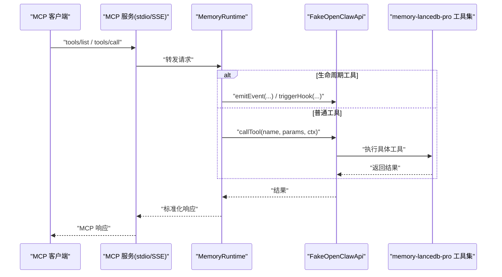
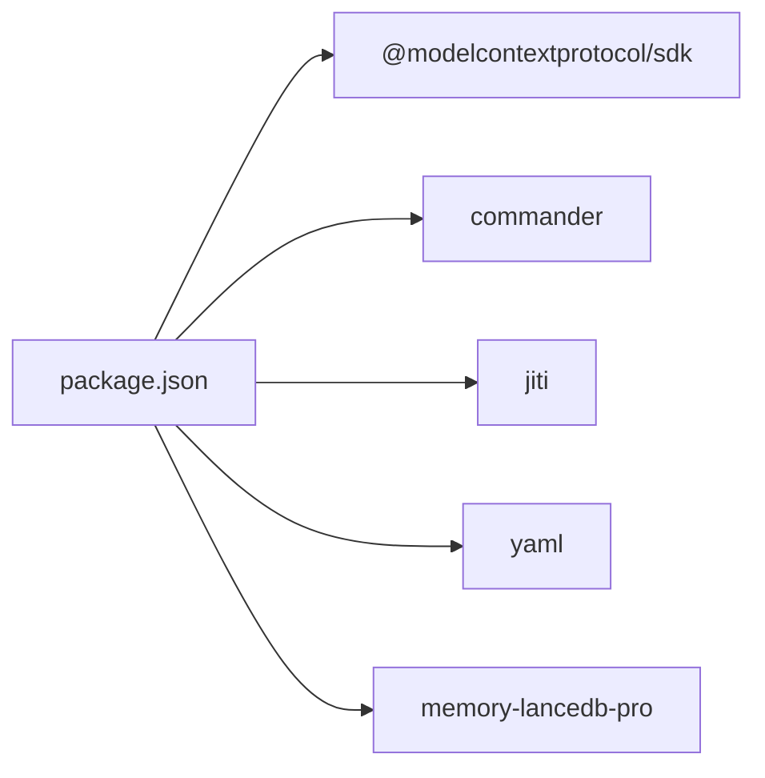

# 故障排除

<cite>
**本文引用的文件**
- [README.md](file://README.md)
- [docs/USAGE_GUIDE.md](file://docs/USAGE_GUIDE.md)
- [package.json](file://package.json)
- [tsconfig.json](file://tsconfig.json)
- [src/index.ts](file://src/index.ts)
- [src/cli.ts](file://src/cli.ts)
- [src/config.ts](file://src/config.ts)
- [src/fake-api.ts](file://src/fake-api.ts)
- [src/mcp-server.ts](file://src/mcp-server.ts)
- [src/mcp-server-sse.ts](file://src/mcp-server-sse.ts)
- [src/lifecycle.ts](file://src/lifecycle.ts)
- [bin/mem.mjs](file://bin/mem.mjs)
- [test/integration.test.mjs](file://test/integration.test.mjs)
</cite>

## 目录
1. [简介](#简介)
2. [项目结构](#项目结构)
3. [核心组件](#核心组件)
4. [架构总览](#架构总览)
5. [详细组件分析](#详细组件分析)
6. [依赖分析](#依赖分析)
7. [性能考虑](#性能考虑)
8. [故障排除指南](#故障排除指南)
9. [结论](#结论)
10. [附录](#附录)

## 简介
本指南面向使用 memory-lancedb-mcp 的开发者与运维人员，聚焦“如何快速定位并解决常见问题”。内容涵盖：
- 常见问题与解决方案
- 错误代码与含义解释
- 调试技巧与诊断工具使用
- 日志分析与问题定位
- 性能问题排查与优化
- 平台特定问题（Linux、WSL、macOS、ARM64）
- 配置问题诊断与修复
- 网络连接问题排查
- 社区支持与预防性维护建议

## 项目结构
该项目围绕“MCP 服务 + CLI + 配置 + 生命周期桥接”组织，核心入口为 CLI 命令“mem”，通过内存运行时（MemoryRuntime）桥接 memory-lancedb-pro 的工具集，并支持 stdio 与 SSE 两种传输模式。

```mermaid
graph TB
subgraph "CLI"
BIN["bin/mem.mjs"]
CLI["src/cli.ts"]
end
subgraph "运行时与桥接"
IDX["src/index.ts"]
FAKE["src/fake-api.ts"]
CFG["src/config.ts"]
end
subgraph "MCP 传输层"
STDIO["src/mcp-server.ts"]
SSE["src/mcp-server-sse.ts"]
end
subgraph "生命周期"
LIFE["src/lifecycle.ts"]
end
BIN --> CLI
CLI --> IDX
IDX --> FAKE
IDX --> CFG
IDX --> LIFE
IDX --> STDIO
IDX --> SSE
```

图表来源
- [bin/mem.mjs:1-8](file://bin/mem.mjs#L1-L8)
- [src/cli.ts:1-617](file://src/cli.ts#L1-L617)
- [src/index.ts:1-515](file://src/index.ts#L1-L515)
- [src/fake-api.ts:1-318](file://src/fake-api.ts#L1-L318)
- [src/config.ts:1-312](file://src/config.ts#L1-L312)
- [src/mcp-server.ts:1-306](file://src/mcp-server.ts#L1-L306)
- [src/mcp-server-sse.ts:1-405](file://src/mcp-server-sse.ts#L1-L405)
- [src/lifecycle.ts:1-178](file://src/lifecycle.ts#L1-L178)

章节来源
- [package.json:1-46](file://package.json#L1-L46)
- [tsconfig.json:1-20](file://tsconfig.json#L1-L20)
- [README.md:1-738](file://README.md#L1-L738)

## 核心组件
- CLI 命令行入口与子命令解析（mem serve/list/search/stats/store/delete/config/doctor/scope）
- 内存运行时工厂（createMemoryRuntime）：加载配置、构建 FakeOpenClawApi、注册插件、注入标签与 Scope 处理逻辑
- FakeOpenClawApi：模拟插件运行时接口，承载工具注册、事件与钩子、CLI 注册、日志输出
- MCP 服务：stdio 与 SSE 两种传输，统一暴露工具与生命周期工具
- 生命周期桥接：将 before_prompt_build、agent_end、message_received、session_end 等事件映射为可调用工具
- 配置系统：YAML 配置加载、环境变量扩展、默认路径解析、初始化模板

章节来源
- [src/cli.ts:1-617](file://src/cli.ts#L1-L617)
- [src/index.ts:1-515](file://src/index.ts#L1-L515)
- [src/fake-api.ts:1-318](file://src/fake-api.ts#L1-L318)
- [src/mcp-server.ts:1-306](file://src/mcp-server.ts#L1-L306)
- [src/mcp-server-sse.ts:1-405](file://src/mcp-server-sse.ts#L1-L405)
- [src/lifecycle.ts:1-178](file://src/lifecycle.ts#L1-L178)
- [src/config.ts:1-312](file://src/config.ts#L1-L312)

## 架构总览
MCP 服务通过 stdio 或 SSE 将 memory-lancedb-pro 的工具暴露给客户端；Wrapper 在运行时完成：
- 配置加载与环境变量展开
- 标签前缀注入与结果剥离
- Scope 强制与 ACL 拒绝
- 生命周期事件到工具的桥接



图表来源
- [src/mcp-server.ts:1-306](file://src/mcp-server.ts#L1-L306)
- [src/mcp-server-sse.ts:1-405](file://src/mcp-server-sse.ts#L1-L405)
- [src/index.ts:1-515](file://src/index.ts#L1-L515)
- [src/fake-api.ts:1-318](file://src/fake-api.ts#L1-L318)

## 详细组件分析

### CLI 与健康检查
- 命令体系：serve、list、search、stats、store、delete、config、doctor、scope
- doctor：检查配置文件存在、解析、API Key、插件加载、工具清单
- doctor --mcp：可选进行 MCP 协议握手测试（在使用手册中有说明）

章节来源
- [src/cli.ts:1-617](file://src/cli.ts#L1-L617)
- [docs/USAGE_GUIDE.md:618-667](file://docs/USAGE_GUIDE.md#L618-L667)

### 内存运行时与标签/Scope 处理
- 标签处理：normalizeTags、assembleTags、stripTags、entryMatchesTags、list_scopes 合并定义与统计
- Scope 处理：当服务端指定 --scope 时，强制所有请求进入该 scope，并以“system”绕过 ACL；跨 scope 模式下 store 不指定 scope 自动写入 global
- 工具注入：为 memory_store/memory_recall/memory_list 注入 tags 参数 schema

章节来源
- [src/index.ts:1-515](file://src/index.ts#L1-L515)

### FakeOpenClawApi（运行时适配）
- 工具注册与调用：registerTool/getToolFactory/callTool
- 事件与钩子：on/registerHook/emitEvent/triggerHook
- CLI 注册：registerCli
- 日志：debug/info/warn/error
- 路径解析：resolvePath

章节来源
- [src/fake-api.ts:1-318](file://src/fake-api.ts#L1-L318)

### MCP 服务（stdio 与 SSE）
- stdio：StdioServerTransport，stderr 输出启动日志与警告（跨 scope 模式）
- SSE：StreamableHTTPServerTransport（SDK v1.x），/sse 与 /message 两个端点，/health 健康检查
- 生命周期工具：_lifecycle_auto_recall/_lifecycle_auto_capture/_lifecycle_session_end

章节来源
- [src/mcp-server.ts:1-306](file://src/mcp-server.ts#L1-L306)
- [src/mcp-server-sse.ts:1-405](file://src/mcp-server-sse.ts#L1-L405)

### 生命周期桥接
- triggerAutoRecall：before_prompt_build 事件，返回 prependContext
- triggerAutoCapture：agent_end 事件，后台提取记忆
- triggerSessionEnd：session_end 事件，清理状态
- triggerMessageReceived：message_received 事件，缓存原始消息

章节来源
- [src/lifecycle.ts:1-178](file://src/lifecycle.ts#L1-L178)

### 配置系统
- 路径解析：MEM_CONFIG_PATH > ~/.config/memory-mcp/config.yaml > ./config.yaml > 默认
- 环境变量展开：${VAR} 递归展开，缺失时警告并替换为空
- 初始化模板：包含 dbPath、embedding、llm、autoCapture/autoRecall、retrieval、scopes、selfImprovement 等

章节来源
- [src/config.ts:1-312](file://src/config.ts#L1-L312)

## 依赖分析
- 运行时依赖：@modelcontextprotocol/sdk（MCP 协议）、commander（CLI）、jiti（TS 直载）、yaml（配置解析）、memory-lancedb-pro（父项目）
- 开发依赖：typescript、@sinclair/typebox
- 构建与脚本：tsc、dev、start、test



图表来源
- [package.json:1-46](file://package.json#L1-L46)

章节来源
- [package.json:1-46](file://package.json#L1-L46)

## 性能考虑
- 检索权重与候选池：retrieval.vectorWeight/bm25Weight/candidatePoolSize/minScore 等
- 自动提取与压缩：smartExtraction、memory_compaction
- 标签软过滤：BM25 命中标签前缀，非硬排除，建议结合 category 与 limit 控制结果规模
- SSE 模式：多客户端共享单实例，注意并发与资源占用

章节来源
- [src/config.ts:1-312](file://src/config.ts#L1-L312)
- [src/mcp-server-sse.ts:1-405](file://src/mcp-server-sse.ts#L1-L405)

## 故障排除指南

### 一、服务启动失败
- 症状：启动时报错或无法连接
- 排查步骤
  1) 验证配置文件存在与可解析
     - 使用 doctor 检查配置文件路径与解析
     - 使用 config validate 校验关键字段
  2) 检查 API Key 与环境变量
     - doctor 会检查 embedding.apiKey 是否存在或通过环境变量注入
     - 若为 ${VAR}，确认对应环境变量已导出
  3) 插件加载与工具清单
     - doctor 会尝试加载插件并列出工具数量
     - 若失败，检查依赖安装与 Node 版本要求
  4) 传输模式
     - stdio：确认 MCP 客户端已正确配置命令与参数
     - SSE：确认端口与主机绑定，注意跨 scope 模式下的安全风险

章节来源
- [src/cli.ts:449-517](file://src/cli.ts#L449-L517)
- [src/config.ts:167-214](file://src/config.ts#L167-L214)
- [src/mcp-server.ts:126-140](file://src/mcp-server.ts#L126-L140)
- [src/mcp-server-sse.ts:174-209](file://src/mcp-server-sse.ts#L174-L209)

### 二、嵌入模型错误
- 症状：调用工具时报嵌入相关错误
- 排查步骤
  1) 确认 embedding.model 指向有效模型
  2) OpenAI 兼容接口需核对 baseURL
  3) Ollama 本地需确认服务已启动且端口可达
  4) 检查网络连通性与代理设置

章节来源
- [docs/USAGE_GUIDE.md:638-643](file://docs/USAGE_GUIDE.md#L638-L643)
- [src/config.ts:167-214](file://src/config.ts#L167-L214)

### 三、召回结果不准确
- 症状：召回命中率低或排序不合理
- 排查步骤
  1) query 格式：优先使用“实体名 + 技术术语”
  2) 内容丰富度：每条记忆至少 100+ 字
  3) 关键词唯一性：确保 query 中术语在其他记忆中不泛滥
  4) 标签辅助：使用 tags 参数缩小范围（软过滤，可叠加 category 与 limit）

章节来源
- [docs/USAGE_GUIDE.md:317-390](file://docs/USAGE_GUIDE.md#L317-L390)
- [src/index.ts:313-452](file://src/index.ts#L313-L452)

### 四、Scope 权限拒绝
- 症状：返回“Scope mismatch”或“Access denied to scope”
- 排查步骤
  1) 确认服务启动时的 --scope 值
  2) 请求的 scope 必须与服务端一致，否则被拒绝
  3) 跨 scope 模式下，memory_store 不指定 scope 会自动写入 global
  4) 使用 mem scope list 查看可用 scope 与数量

章节来源
- [src/index.ts:337-385](file://src/index.ts#L337-L385)
- [docs/USAGE_GUIDE.md:653-666](file://docs/USAGE_GUIDE.md#L653-L666)

### 五、标签校验失败
- 症状：传入非法标签字符时报错“Invalid tag value”
- 排查步骤
  1) 标签名仅允许字母、数字、_、-、:、/、. 与中文字符，逗号为分隔符
  2) 明确禁止使用“【”、“】”等前缀边界字符
  3) 修改后需重新编译并重启服务（CLI 直接调用即时生效）

章节来源
- [src/index.ts:31-52](file://src/index.ts#L31-L52)
- [docs/USAGE_GUIDE.md:612-615](file://docs/USAGE_GUIDE.md#L612-L615)

### 六、CLI 与源码修改未生效
- 症状：修改 src/ 后重启服务或客户端仍无变化
- 排查步骤
  1) 确认已执行 tsc 编译生成 dist/
  2) 重启 MCP 服务与客户端
  3) CLI 可直接 node bin/mem.mjs 测试即时效果

章节来源
- [docs/USAGE_GUIDE.md:570-583](file://docs/USAGE_GUIDE.md#L570-L583)
- [tsconfig.json:1-20](file://tsconfig.json#L1-L20)

### 七、WSL 构建问题
- 症状：npm run build 失败（tsc）
- 解决方案：使用 node node_modules/typescript/bin/tsc -p tsconfig.json

章节来源
- [docs/USAGE_GUIDE.md:584-591](file://docs/USAGE_GUIDE.md#L584-L591)

### 八、Git GPG 签名失败
- 症状：终端无 GUI 时 GPG 签名报错
- 解决方案：使用 --no-gpg-sign 提交

章节来源
- [docs/USAGE_GUIDE.md:592-599](file://docs/USAGE_GUIDE.md#L592-L599)

### 九、默认返回条数与 limit
- 症状：memory_recall 默认返回较少
- 解决方案：显式设置 limit（最大 20）

章节来源
- [docs/USAGE_GUIDE.md:600-607](file://docs/USAGE_GUIDE.md#L600-L607)

### 十、SSE 远程访问安全
- 症状：跨 scope 模式下暴露所有 scope
- 解决方案：使用 --scope 锁定单一 scope，并限制 host 仅本地或受信网络

章节来源
- [src/mcp-server-sse.ts:176-184](file://src/mcp-server-sse.ts#L176-L184)
- [docs/USAGE_GUIDE.md:500-519](file://docs/USAGE_GUIDE.md#L500-L519)

### 十一、日志与调试
- stdio 模式：stderr 输出启动日志与跨 scope 警告
- SSE 模式：stderr 输出启动信息与健康检查端点
- doctor：集中输出检查结果与失败计数
- 日志级别：quiet 可抑制调试日志

章节来源
- [src/mcp-server.ts:130-140](file://src/mcp-server.ts#L130-L140)
- [src/mcp-server-sse.ts:174-190](file://src/mcp-server-sse.ts#L174-L190)
- [src/cli.ts:449-517](file://src/cli.ts#L449-L517)
- [src/fake-api.ts:84-89](file://src/fake-api.ts#L84-L89)

### 十二、网络连接问题排查
- stdio：确认 MCP 客户端已正确配置命令与参数
- SSE：检查 /health、/sse、/message 端点可达性，确认 CORS 与反向代理配置
- 端口冲突：更换 --port 或 --host

章节来源
- [src/mcp-server.ts:126-140](file://src/mcp-server.ts#L126-L140)
- [src/mcp-server-sse.ts:82-172](file://src/mcp-server-sse.ts#L82-L172)

### 十三、平台特定问题
- Linux x64：LanceDB 需要 AVX2，如报“Illegal instruction”，使用 AVX-only 构建或 ARM64 兼容版本；必要时安装 @lancedb/lancedb-linux-x64-gnu
- WSL：npm 可能检测为 Windows 平台导致缺少 Linux 原生模块，需手动安装对应模块
- macOS：无需额外操作，原生模块自动安装
- ARM64：确保使用 ARM64 原生模块，如遇问题执行 npm rebuild @lancedb/lancedb

章节来源
- [README.md:132-168](file://README.md#L132-L168)

### 十四、配置问题诊断与修复
- 配置路径：MEM_CONFIG_PATH > ~/.config/memory-mcp/config.yaml > ./config.yaml
- 环境变量：${VAR} 递归展开，缺失时警告并置空
- 初始化：mem config init 创建默认模板
- 显示与验证：mem config show（脱敏）、mem config validate

章节来源
- [src/config.ts:107-121](file://src/config.ts#L107-L121)
- [src/config.ts:135-157](file://src/config.ts#L135-L157)
- [src/config.ts:296-311](file://src/config.ts#L296-L311)
- [src/cli.ts:370-443](file://src/cli.ts#L370-L443)

### 十五、社区支持与获取帮助
- 使用手册与 CLI 参考：docs/USAGE_GUIDE.md
- 项目 README：包含安装、配置、客户端配置与平台说明
- 问题反馈：根据 README 中的链接与社区渠道提交

章节来源
- [README.md:1-738](file://README.md#L1-L738)
- [docs/USAGE_GUIDE.md:1-672](file://docs/USAGE_GUIDE.md#L1-L672)

### 十六、预防性维护与最佳实践
- 定期运行 doctor，关注失败计数
- 使用 --scope 锁定项目，避免跨 scope 模式下的误操作
- 记忆内容丰富度与关键词策略，提升召回质量
- 标签命名严格遵循白名单，避免非法字符
- SSE 模式下限制 host 与端口，必要时配合反向代理与鉴权

章节来源
- [src/cli.ts:449-517](file://src/cli.ts#L449-L517)
- [docs/USAGE_GUIDE.md:268-390](file://docs/USAGE_GUIDE.md#L268-L390)
- [src/index.ts:31-52](file://src/index.ts#L31-L52)

## 结论
本指南提供了从配置、传输、生命周期到平台差异的全链路故障排除方法。建议在日常运维中：
- 将 doctor 作为每日健康检查的起点
- 使用 --scope 与 SSE 的安全配置
- 依据召回最佳实践优化 query 与内容
- 严格遵守标签与配置规范，减少运行时错误

## 附录

### A. 常见错误与含义对照
- Scope mismatch：服务端与请求的 scope 不一致，被拒绝
- Access denied to scope：ACL 拒绝访问指定 scope
- Unknown tool：工具名不存在，检查 tools/list 输出
- Invalid tag value：标签包含非法字符
- Config file not found：配置文件不存在或路径错误
- Embedding API key missing：缺少或未设置 API Key
- Plugin load failed：插件加载失败，检查依赖与 Node 版本

章节来源
- [src/index.ts:351-367](file://src/index.ts#L351-L367)
- [src/fake-api.ts:222-225](file://src/fake-api.ts#L222-L225)
- [src/config.ts:170-214](file://src/config.ts#L170-L214)
- [src/cli.ts:449-517](file://src/cli.ts#L449-L517)

### B. 调试技巧与诊断工具
- doctor：集中检查配置、API Key、插件加载与工具清单
- stdio/SSE 启动日志：stderr 输出启动信息与警告
- quiet：抑制调试日志，便于生产环境稳定输出
- SSE /health：快速判断服务可用性

章节来源
- [src/cli.ts:449-517](file://src/cli.ts#L449-L517)
- [src/mcp-server.ts:130-140](file://src/mcp-server.ts#L130-L140)
- [src/mcp-server-sse.ts:96-106](file://src/mcp-server-sse.ts#L96-L106)