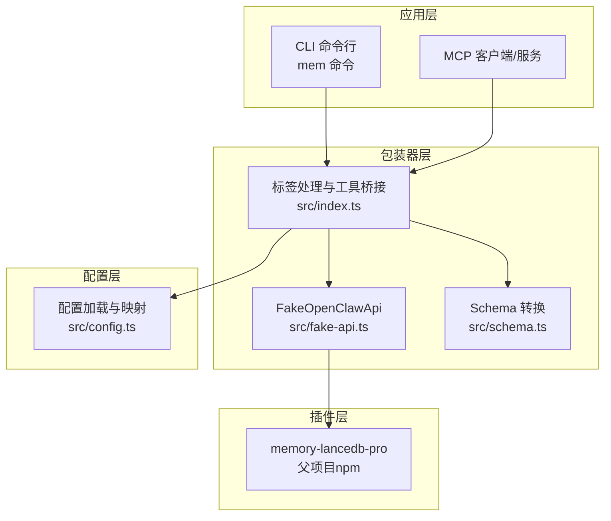
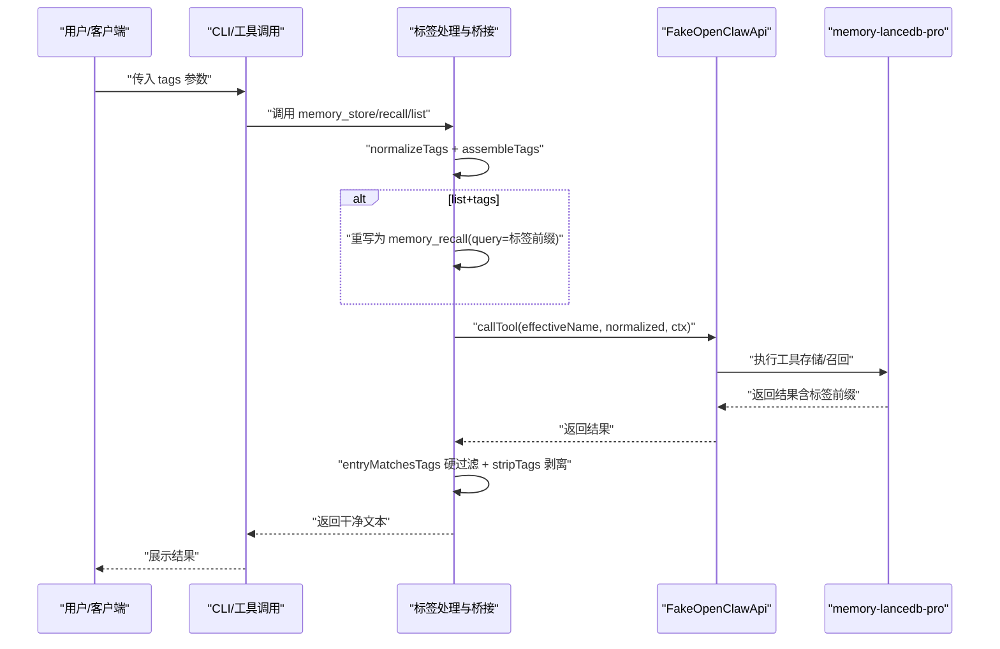
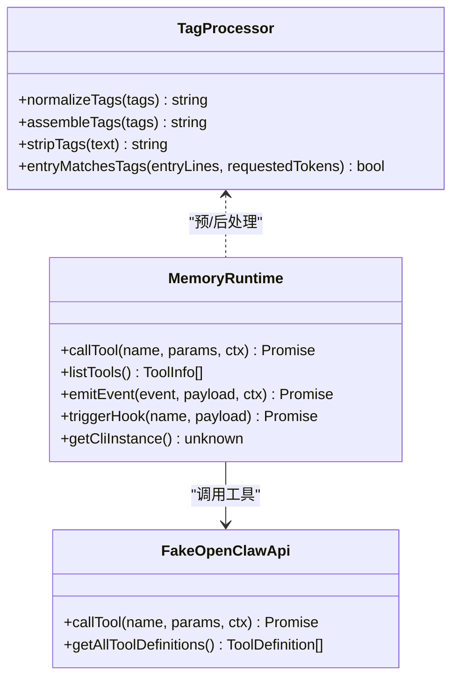
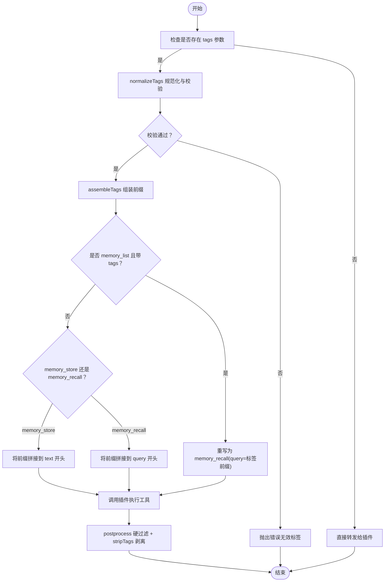
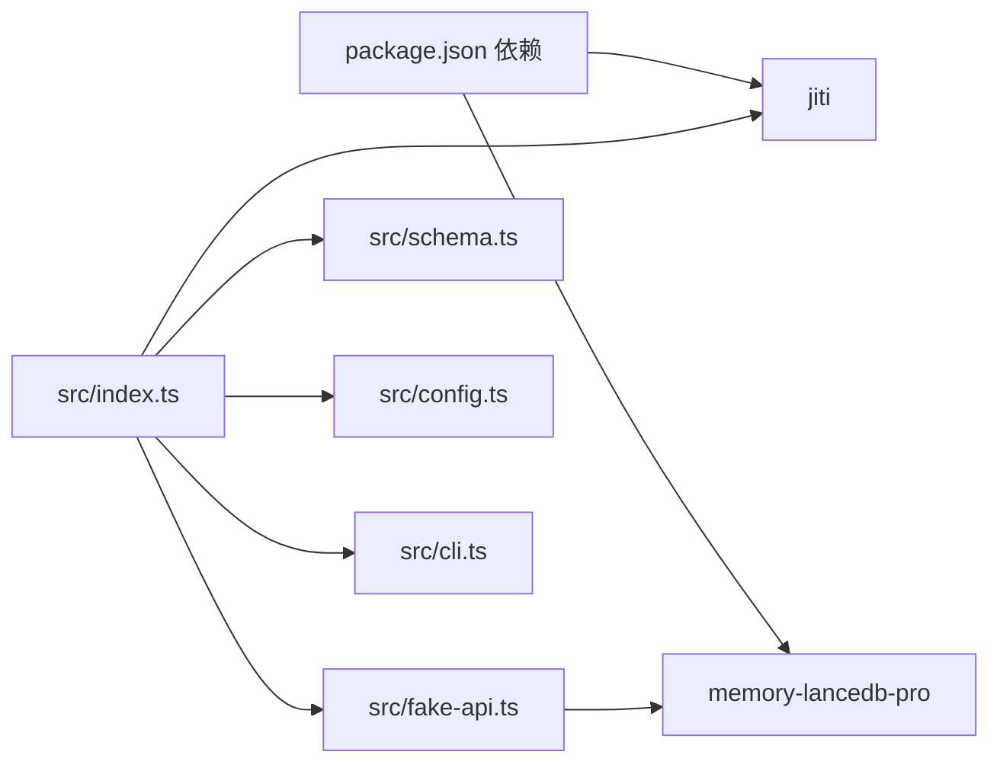

# 标签系统

<cite>
**本文引用的文件**
- [src/index.ts](file://src/index.ts)
- [src/cli.ts](file://src/cli.ts)
- [src/fake-api.ts](file://src/fake-api.ts)
- [src/config.ts](file://src/config.ts)
- [src/schema.ts](file://src/schema.ts)
- [README.md](file://README.md)
- [docs/USAGE_GUIDE.md](file://docs/USAGE_GUIDE.md)
- [package.json](file://package.json)
- [test/integration.test.mjs](file://test/integration.test.mjs)
</cite>

## 目录
1. [简介](#简介)
2. [项目结构](#项目结构)
3. [核心组件](#核心组件)
4. [架构总览](#架构总览)
5. [详细组件分析](#详细组件分析)
6. [依赖分析](#依赖分析)
7. [性能考量](#性能考量)
8. [故障排除指南](#故障排除指南)
9. [结论](#结论)
10. [附录](#附录)

## 简介
本文件系统性阐述标签（Tags）在 memory-lancedb-mcp 中的设计与实现，重点覆盖：
- 标签前缀嵌入机制：如何将标签以“文本前缀”的形式写入 text 字段，并在检索时通过 BM25 自然命中。
- 标签命名规则与字符限制：允许与禁止的字符集合，以及校验逻辑。
- 存储与查询策略：写入时嵌入、查询时剥离、软过滤与硬过滤的协同。
- 检索策略：BM25 如何自然命中标签前缀，以及软过滤的边界。
- 最佳实践与常见场景：如何高效使用标签，避免误用导致的检索异常。
- 扩展性与兼容性：与父项目 memory-lancedb-pro 的零侵入集成，以及与 MCP 工具的契约扩展。
- 实际使用示例与故障排除：结合 CLI 与 README 的示例，给出排障思路。

## 项目结构
本项目围绕“标签系统”这一核心能力，主要涉及以下模块：
- 标签处理与工具桥接：在入口模块中完成标签的规范化、前缀组装、查询重写、结果后处理（剥离前缀）。
- CLI 与工具契约：CLI 将用户输入转换为工具调用，工具调用经由 FakeOpenClawApi 注入标签前缀并转发给插件。
- 配置与类型转换：配置解析、TypeBox 到 JSON Schema 的转换，保证 MCP 工具列表的 schema 与参数描述一致。
- 文档与使用指南：README 与 USAGE_GUIDE 提供了标签使用示例、约束与最佳实践。

图表来源
- [src/index.ts:190-498](file://src/index.ts#L190-L498)
- [src/cli.ts:105-617](file://src/cli.ts#L105-L617)
- [src/fake-api.ts:57-318](file://src/fake-api.ts#L57-L318)
- [src/config.ts:167-223](file://src/config.ts#L167-L223)
- [src/schema.ts:45-151](file://src/schema.ts#L45-L151)

章节来源
- [src/index.ts:190-498](file://src/index.ts#L190-L498)
- [src/cli.ts:105-617](file://src/cli.ts#L105-L617)
- [src/fake-api.ts:57-318](file://src/fake-api.ts#L57-L318)
- [src/config.ts:167-223](file://src/config.ts#L167-L223)
- [src/schema.ts:45-151](file://src/schema.ts#L45-L151)

## 核心组件
- 标签规范化与校验：对用户输入的标签字符串执行去空白、全半角逗号转换、字符白名单校验，非法字符直接抛错。
- 标签前缀组装：将规范化后的标签拼接为“【标签:x,y】 ”前缀，写入 text/query。
- 查询重写：当 memory_list 且带 tags 时，重写为 memory_recall(query=前缀)，确保 BM25 能命中标签前缀。
- 结果后处理：对 recall/list 返回内容进行硬过滤（仅保留包含标签前缀的条目），并剥离前缀，保证展示干净文本。
- 工具 schema 注入：为支持标签的工具（memory_store/recall/list）注入 tags 参数描述，便于 MCP 客户端与工具列表展示。

章节来源
- [src/index.ts:33-64](file://src/index.ts#L33-L64)
- [src/index.ts:84-93](file://src/index.ts#L84-L93)
- [src/index.ts:313-335](file://src/index.ts#L313-L335)
- [src/index.ts:389-450](file://src/index.ts#L389-L450)

## 架构总览
标签系统在整体架构中的位置如下：
- 输入阶段：用户通过 CLI 或 MCP 工具调用传递 tags 参数。
- 预处理阶段：包装器对 tags 进行规范化与前缀组装，必要时重写工具调用（list+tags → recall）。
- 存储阶段：text 字段写入“【标签:x,y】 原始内容”，不改变父项目的 schema。
- 检索阶段：BM25 对 query 中的标签前缀进行精确匹配；返回结果经硬过滤与前缀剥离。
- 输出阶段：返回干净的文本内容，供 MCP 客户端与 AI 助手消费。

图表来源
- [src/index.ts:313-335](file://src/index.ts#L313-L335)
- [src/index.ts:389-450](file://src/index.ts#L389-L450)
- [src/fake-api.ts:217-235](file://src/fake-api.ts#L217-L235)

章节来源
- [src/index.ts:313-335](file://src/index.ts#L313-L335)
- [src/index.ts:389-450](file://src/index.ts#L389-L450)
- [src/fake-api.ts:217-235](file://src/fake-api.ts#L217-L235)

## 详细组件分析

### 标签前缀嵌入机制
- 嵌入位置：写入时将“【标签:x,y】 ”前缀拼接到 text/query 开头，不引入新的 metadata 字段。
- 命名与分隔：标签以逗号分隔，支持字母、数字、下划线、连字符、冒号、斜杠、点号、中文字符。
- 前缀语法：使用全角中文符号“【标签:…】”作为边界，避免与普通文本混淆。
- 查询命中：BM25 对 query 中的标签前缀进行全文检索，天然命中标签前缀，无需额外索引。
- 展示剥离：返回结果中自动剥离前缀，确保用户与 AI 助手看到干净文本。

章节来源
- [src/index.ts:18-31](file://src/index.ts#L18-L31)
- [src/index.ts:54-59](file://src/index.ts#L54-L59)
- [src/index.ts:61-64](file://src/index.ts#L61-L64)
- [README.md:643-671](file://README.md#L643-L671)
- [docs/USAGE_GUIDE.md:394-410](file://docs/USAGE_GUIDE.md#L394-L410)

### 标签命名规则与字符限制
- 允许字符：字母、数字、下划线、连字符、冒号、斜杠、点号、CJK 中文字符、逗号（分隔符）。
- 明确禁止：全角中文符号“【”、“】”（前缀边界）、空格、emoji、其他标点。
- 校验策略：去首尾空白、全角逗号转半角、去除内部空白、白名单正则校验，非法字符抛错。
- 语义说明：README 与 USAGE_GUIDE 明确指出“保留字符【】是前缀语法的边界，禁止用于标签名”。

章节来源
- [src/index.ts:33-52](file://src/index.ts#L33-L52)
- [README.md:663-671](file://README.md#L663-L671)
- [docs/USAGE_GUIDE.md:411-419](file://docs/USAGE_GUIDE.md#L411-L419)

### 存储与查询策略
- 存储策略：memory_store 时将标签前缀拼接到 text 开头；memory_recall 时将标签前缀拼接到 query 开头。
- 查询重写：memory_list+tags 重写为 memory_recall(query=标签前缀)，确保 BM25 能命中标签前缀。
- 硬过滤与软过滤：BM25 为软过滤（加权靠前），包装器在 postprocess 阶段做硬过滤，仅保留包含标签前缀的条目，然后剥离前缀。
- 结果格式：返回文本块中包含“Found N memories:”头部，硬过滤后会更新头部计数。

章节来源
- [src/index.ts:313-335](file://src/index.ts#L313-L335)
- [src/index.ts:389-450](file://src/index.ts#L389-L450)
- [docs/USAGE_GUIDE.md:382-389](file://docs/USAGE_GUIDE.md#L382-L389)

### 检索策略与 BM25 命中
- BM25 命中原理：query 中的“【标签:xxx】”前缀通过 BM25 全文检索精确匹配，边界使用“【】”降低误匹配概率。
- 软过滤行为：标签过滤为软过滤（加权靠前），如需硬排除，可配合 category 参数使用。
- 查询重写：list+tags → recall(query=标签前缀)，确保检索链路一致。

章节来源
- [docs/USAGE_GUIDE.md:403-405](file://docs/USAGE_GUIDE.md#L403-L405)
- [docs/USAGE_GUIDE.md:382-389](file://docs/USAGE_GUIDE.md#L382-L389)
- [src/index.ts:327-333](file://src/index.ts#L327-L333)

### 工具桥接与参数注入
- 支持工具：memory_store、memory_recall、memory_list。
- 参数注入：为上述工具注入 tags 参数描述，便于 MCP 工具列表展示与客户端使用。
- 调用约定：AI 助手直接传 tags 参数，包装器自动处理前缀嵌入与重写。

章节来源
- [src/index.ts:84-93](file://src/index.ts#L84-L93)
- [README.md:657-661](file://README.md#L657-L661)

### CLI 与标签处理
- CLI 层：CLI 将用户输入的 tags 转换为 tagPrefix（调用 normalizeTags + assembleTags），并在 memory_recall 中直接使用 query=tagPrefix。
- 与包装器一致性：CLI 与包装器共享相同的标签规范化与前缀组装逻辑，保证行为一致。

章节来源
- [src/cli.ts:57-62](file://src/cli.ts#L57-L62)
- [src/cli.ts:199-214](file://src/cli.ts#L199-L214)

### 类图：标签处理与工具桥接

图表来源
- [src/index.ts:33-82](file://src/index.ts#L33-L82)
- [src/index.ts:244-498](file://src/index.ts#L244-L498)
- [src/fake-api.ts:217-263](file://src/fake-api.ts#L217-L263)

章节来源
- [src/index.ts:33-82](file://src/index.ts#L33-L82)
- [src/index.ts:244-498](file://src/index.ts#L244-L498)
- [src/fake-api.ts:217-263](file://src/fake-api.ts#L217-L263)

### 流程图：标签前缀嵌入与剥离

图表来源
- [src/index.ts:313-335](file://src/index.ts#L313-L335)
- [src/index.ts:389-450](file://src/index.ts#L389-L450)

章节来源
- [src/index.ts:313-335](file://src/index.ts#L313-L335)
- [src/index.ts:389-450](file://src/index.ts#L389-L450)

## 依赖分析
- 外部依赖：memory-lancedb-pro 作为 npm 包被包装器通过 jiti 直接加载，实现零修改集成。
- 内部依赖：包装器依赖 FakeOpenClawApi 提供工具注册与调用；依赖 schema.ts 将 TypeBox schema 转换为 JSON Schema；依赖 config.ts 提供配置加载与映射。
- 工具契约：包装器通过 FakeOpenClawApi 的工具工厂注册机制，将 14 个工具暴露给 MCP 服务；同时为支持标签的工具注入 tags 参数描述。

图表来源
- [package.json:26-31](file://package.json#L26-L31)
- [src/index.ts:159-184](file://src/index.ts#L159-L184)
- [src/fake-api.ts:113-127](file://src/fake-api.ts#L113-L127)
- [src/schema.ts:45-52](file://src/schema.ts#L45-L52)
- [src/config.ts:220-223](file://src/config.ts#L220-L223)

章节来源
- [package.json:26-31](file://package.json#L26-L31)
- [src/index.ts:159-184](file://src/index.ts#L159-L184)
- [src/fake-api.ts:113-127](file://src/fake-api.ts#L113-L127)
- [src/schema.ts:45-52](file://src/schema.ts#L45-L52)
- [src/config.ts:220-223](file://src/config.ts#L220-L223)

## 性能考量
- 前缀嵌入与 BM25 命中：标签前缀以固定格式嵌入 text/query，BM25 可直接命中，无需额外索引字段，减少写入开销与维护成本。
- 硬过滤与软过滤：BM25 软过滤加权靠前，包装器硬过滤确保最终结果符合标签要求，避免过多非匹配条目影响用户体验。
- 查询重写：list+tags → recall(query=标签前缀) 保证检索链路统一，避免重复扫描与不一致行为。
- 展示剥离：仅在返回前剥离前缀，不影响检索性能，且保证用户侧显示干净文本。

[本节为通用性能讨论，不直接分析具体文件]

## 故障排除指南
- 标签非法字符错误：当标签包含“【”、“】”、空格、emoji 或其他不在白名单内的字符时，包装器会抛出“Invalid tag value: …”错误。请检查标签字符串，确保仅使用允许字符。
- list+tags 未生效：请确认是否使用了 memory_recall(query=标签前缀) 的等价行为；包装器会将 list+tags 重写为 recall，确保 BM25 命中。
- 结果中仍有非匹配条目：这是 BM25 软过滤的特性；如需硬排除，请配合 category 参数使用。
- CLI 与包装器行为不一致：CLI 与包装器共享相同的 normalizeTags/assembleTags 逻辑；若行为不一致，请检查是否直接调用了 CLI（即时生效）还是通过 MCP 服务（需重启生效）。
- 配置与密钥问题：若服务启动失败，请先运行 doctor 与 config validate，确认 embedding.apiKey、模型与 endpoint 正确。

章节来源
- [src/index.ts:44-50](file://src/index.ts#L44-L50)
- [src/index.ts:327-333](file://src/index.ts#L327-L333)
- [docs/USAGE_GUIDE.md:612-615](file://docs/USAGE_GUIDE.md#L612-L615)
- [docs/USAGE_GUIDE.md:638-666](file://docs/USAGE_GUIDE.md#L638-L666)

## 结论
标签系统通过“文本前缀嵌入 + BM25 精确命中 + 硬过滤剥离”的设计，实现了低成本、高可用的多标签分类与检索。其零侵入地集成到 memory-lancedb-pro，既保持了父项目的 schema 不变，又为 MCP 工具提供了灵活的标签参数。遵循命名规则与最佳实践，可显著提升检索准确性与用户体验。

[本节为总结性内容，不直接分析具体文件]

## 附录

### 实际使用示例
- 存储带标签的记忆：使用 CLI 的 store 命令传入 tags 参数，包装器会自动将“【标签:…】 ”前缀嵌入 text。
- 语义检索并过滤标签：使用 search 命令传入 tags 参数，包装器会将标签前缀拼接到 query 并通过 BM25 命中。
- 列表查看并过滤标签：使用 list 命令传入 tags 参数，包装器会将其重写为 recall(query=标签前缀)。

章节来源
- [README.md:314-370](file://README.md#L314-L370)
- [docs/USAGE_GUIDE.md:69-163](file://docs/USAGE_GUIDE.md#L69-L163)

### 最佳实践
- 标签命名：尽量使用语义明确、唯一的标签，避免过长或重复；支持中文与分层命名（如 ns:foo、ver/1.0）。
- 内容长度：建议每条记忆至少 100-200 字，提升语义检索稳定性。
- 查询构造：优先使用“实体名 + 技术术语 + 关键细节”的格式，提高命中率。
- 标签过滤：如需硬排除，配合 category 参数使用；如需软过滤，直接使用 tags 参数。

章节来源
- [docs/USAGE_GUIDE.md:299-314](file://docs/USAGE_GUIDE.md#L299-L314)
- [docs/USAGE_GUIDE.md:317-390](file://docs/USAGE_GUIDE.md#L317-L390)