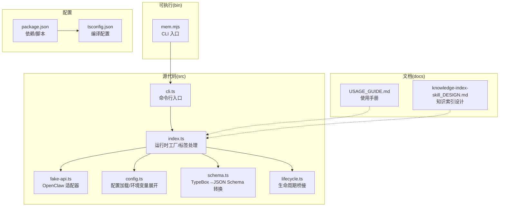
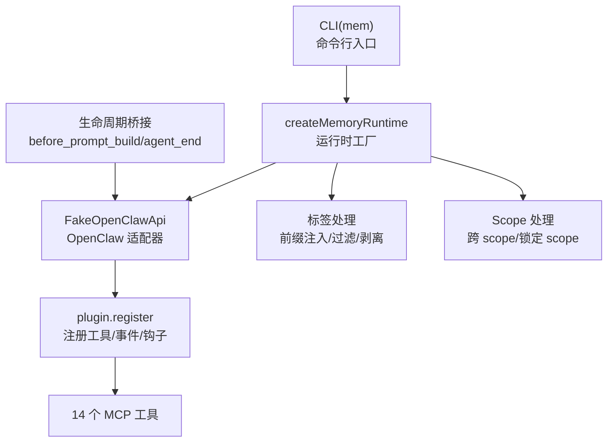
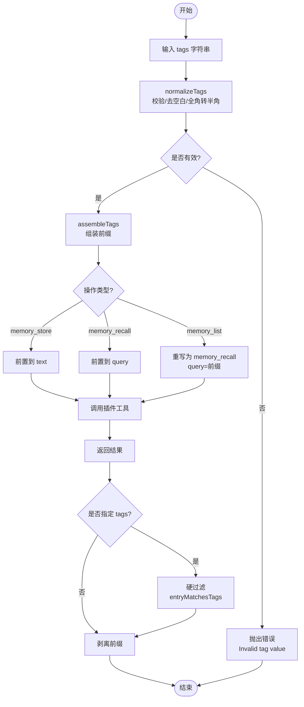
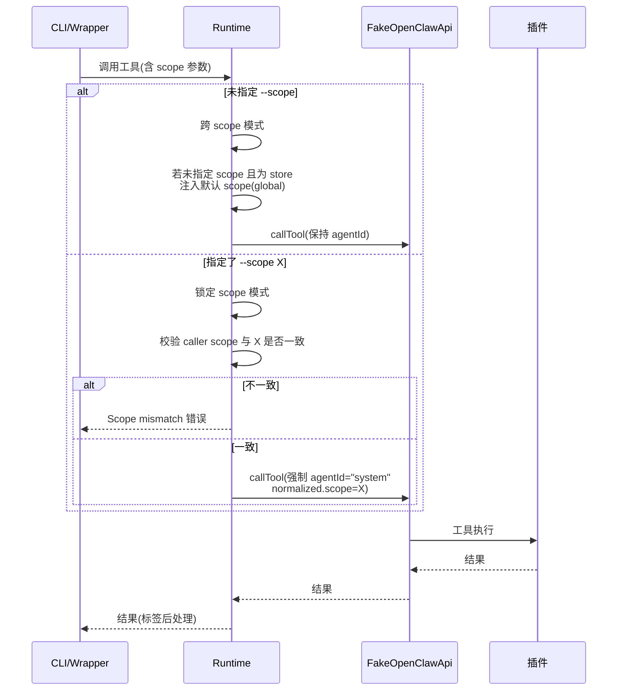
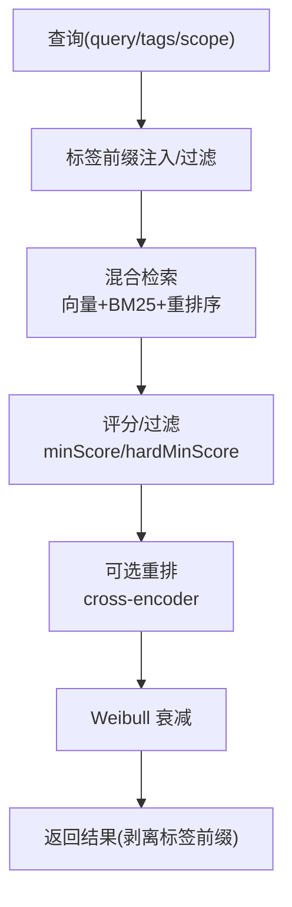
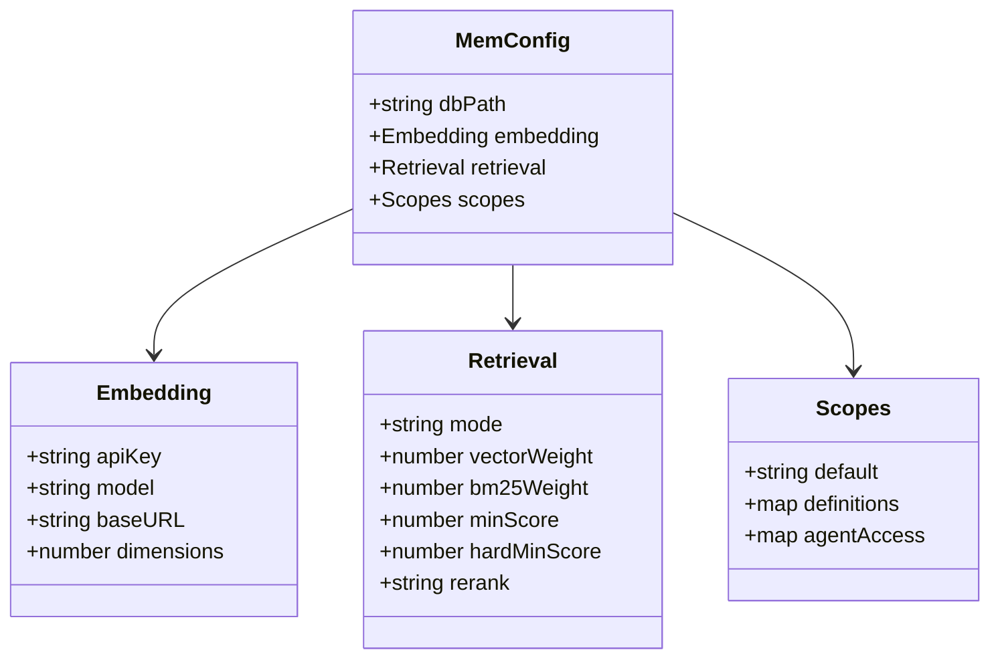
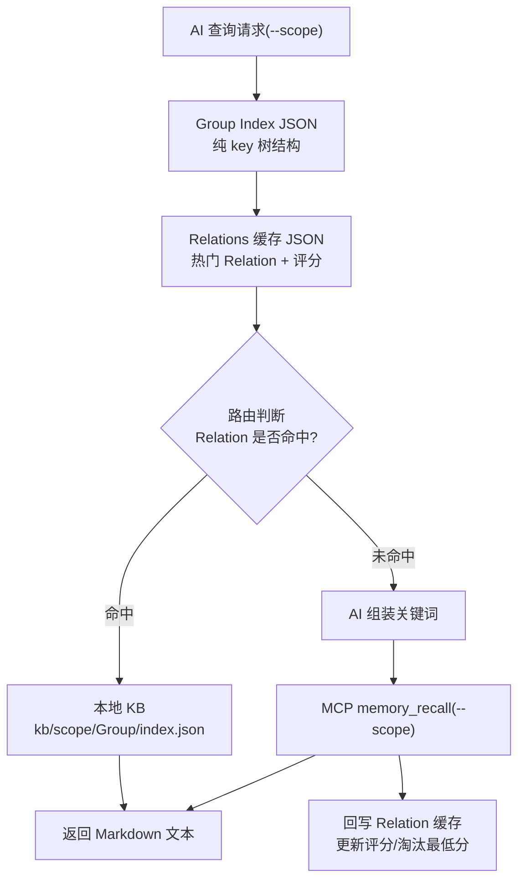
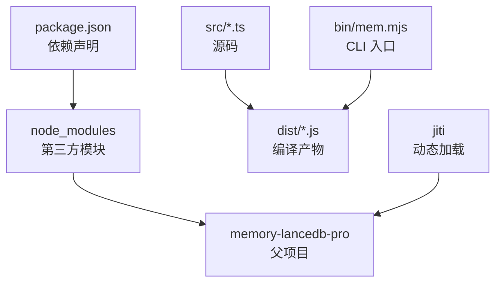

# LanceDB 向量存储

<cite>
**本文档引用的文件**
- [README.md](file://README.md)
- [docs/USAGE_GUIDE.md](file://docs/USAGE_GUIDE.md)
- [package.json](file://package.json)
- [tsconfig.json](file://tsconfig.json)
- [src/index.ts](file://src/index.ts)
- [src/fake-api.ts](file://src/fake-api.ts)
- [src/config.ts](file://src/config.ts)
- [src/schema.ts](file://src/schema.ts)
- [src/cli.ts](file://src/cli.ts)
- [src/lifecycle.ts](file://src/lifecycle.ts)
- [bin/mem.mjs](file://bin/mem.mjs)
- [test/integration.test.mjs](file://test/integration.test.mjs)
- [docs/knowledge-index-skill_DESIGN.md](file://docs/knowledge-index-skill_DESIGN.md)
</cite>

## 目录
1. [简介](#简介)
2. [项目结构](#项目结构)
3. [核心组件](#核心组件)
4. [架构总览](#架构总览)
5. [详细组件分析](#详细组件分析)
6. [依赖关系分析](#依赖关系分析)
7. [性能考量](#性能考量)
8. [故障排除指南](#故障排除指南)
9. [结论](#结论)
10. [附录](#附录)

## 简介
本项目为基于 memory-lancedb-pro 的 MCP Server 包装器，提供持久化长期记忆能力，支持语义检索、多项目隔离、自动分类与衰减、智能提取等功能。系统通过标签前缀嵌入实现结构化与语义检索的结合，并提供混合检索（向量 + BM25）与 Weibull 衰减等企业级记忆管理能力。

- 核心能力来自 memory-lancedb-pro，提供混合检索、Weibull 衰减、智能提取等
- 通过 FakeOpenClawApi 适配 OpenClaw 插件运行时接口，零侵入地桥接父项目
- 支持 stdio 与 SSE 两种传输模式，满足本地与远程客户端需求
- 提供标签系统：通过文本前缀【标签:x,y】嵌入，不修改父项目 TypeBox schema

**章节来源**
- [README.md:1-738](file://README.md#L1-L738)
- [docs/USAGE_GUIDE.md:1-672](file://docs/USAGE_GUIDE.md#L1-L672)

## 项目结构
项目采用模块化组织，核心文件分布如下：
- src/：TypeScript 源码，包含运行时工厂、FakeOpenClawApi 适配器、配置加载、Schema 转换、CLI 入口、生命周期桥接
- bin/：CLI 可执行入口
- test/：集成测试
- docs/：使用手册与知识索引设计文档
- package.json/tsconfig.json：依赖与编译配置

**图表来源**
- [src/index.ts:1-515](file://src/index.ts#L1-L515)
- [src/fake-api.ts:1-318](file://src/fake-api.ts#L1-L318)
- [src/config.ts:1-312](file://src/config.ts#L1-L312)
- [src/schema.ts:1-151](file://src/schema.ts#L1-L151)
- [src/cli.ts:1-617](file://src/cli.ts#L1-L617)
- [src/lifecycle.ts:1-178](file://src/lifecycle.ts#L1-L178)
- [bin/mem.mjs:1-8](file://bin/mem.mjs#L1-L8)
- [package.json:1-46](file://package.json#L1-L46)
- [tsconfig.json:1-20](file://tsconfig.json#L1-L20)

**章节来源**
- [package.json:1-46](file://package.json#L1-L46)
- [tsconfig.json:1-20](file://tsconfig.json#L1-L20)

## 核心组件
- 运行时工厂 createMemoryRuntime：加载配置、创建 FakeOpenClawApi、注册插件、注入标签与 Scope 处理、暴露工具调用与事件系统
- FakeOpenClawApi：最小化实现 OpenClawPluginApi，捕获工具工厂、事件与钩子、CLI 实例
- 配置系统：YAML 配置加载、环境变量展开、默认配置模板
- Schema 转换：TypeBox schema → JSON Schema，兼容 MCP 协议
- CLI：mem 命令行工具，支持 serve/list/search/stats/store/delete/config/doctor/scope 等
- 生命周期桥接：before_prompt_build/agent_end/message_received 等事件封装

**章节来源**
- [src/index.ts:190-498](file://src/index.ts#L190-L498)
- [src/fake-api.ts:57-317](file://src/fake-api.ts#L57-L317)
- [src/config.ts:167-311](file://src/config.ts#L167-L311)
- [src/schema.ts:45-151](file://src/schema.ts#L45-L151)
- [src/cli.ts:105-617](file://src/cli.ts#L105-L617)
- [src/lifecycle.ts:52-178](file://src/lifecycle.ts#L52-L178)

## 架构总览
系统通过 jiti 直接从 node_modules/memory-lancedb-pro 加载 TypeScript 源文件，零额外编译步骤。核心流程：
- CLI 启动 → createMemoryRuntime → FakeOpenClawApi.register → plugin.register → 注册 14 个工具
- 工具调用前进行标签前缀注入与 Scope 注入，调用后进行标签过滤与前缀剥离
- 事件系统支持自动召回与自动捕获，生命周期桥接 MCP 与 OpenClaw

**图表来源**
- [src/cli.ts:105-169](file://src/cli.ts#L105-L169)
- [src/index.ts:207-238](file://src/index.ts#L207-L238)
- [src/fake-api.ts:113-127](file://src/fake-api.ts#L113-L127)
- [src/lifecycle.ts:52-128](file://src/lifecycle.ts#L52-L128)

**章节来源**
- [README.md:22-45](file://README.md#L22-L45)
- [src/index.ts:159-184](file://src/index.ts#L159-L184)

## 详细组件分析

### 标签前缀嵌入系统
标签系统通过文本前缀【标签:x,y】实现结构化与语义检索的结合：
- 存储时：normalizeTags 校验与规范化，assembleTags 组装前缀，memory_store/memory_recall 前缀注入
- 检索时：BM25 自然命中标签前缀，memory_recall 返回结果中自动剥离前缀
- 列表时：memory_list 重写为 memory_recall，实现标签过滤（软过滤）

**图表来源**
- [src/index.ts:41-82](file://src/index.ts#L41-L82)
- [src/index.ts:317-335](file://src/index.ts#L317-L335)
- [src/index.ts:390-450](file://src/index.ts#L390-L450)

**章节来源**
- [src/index.ts:41-82](file://src/index.ts#L41-L82)
- [src/index.ts:317-335](file://src/index.ts#L317-L335)
- [src/index.ts:390-450](file://src/index.ts#L390-L450)
- [docs/USAGE_GUIDE.md:392-421](file://docs/USAGE_GUIDE.md#L392-L421)

### Scope 多项目隔离
Scope 隔离通过 agentId 与 ACL 实现：
- 跨 scope 模式：默认可读写任意 scope，memory_store 不指定 scope 自动写入 global
- 锁定 scope 模式：--scope X 强制所有操作限定在 X 内，拒绝其他 scope 请求
- 隔离原理：使用 agentId="system" 绕过 ACL，强制 normalized.scope 为服务端值

**图表来源**
- [src/index.ts:337-385](file://src/index.ts#L337-L385)
- [src/index.ts:351-369](file://src/index.ts#L351-L369)

**章节来源**
- [src/index.ts:337-385](file://src/index.ts#L337-L385)
- [README.md:426-498](file://README.md#L426-L498)
- [docs/USAGE_GUIDE.md:423-565](file://docs/USAGE_GUIDE.md#L423-L565)

### 混合检索与向量嵌入
系统基于 memory-lancedb-pro 的混合检索能力：
- 检索模式：hybrid（向量 + BM25），支持权重配置与重排序
- Weibull 衰减：记忆随时间衰减，保持新鲜度
- 智能提取：LLM 驱动的自动记忆提取与分类
- 标签过滤：软过滤（BM25 加权），可配合 category 实现硬过滤

**图表来源**
- [src/index.ts:317-335](file://src/index.ts#L317-L335)
- [src/index.ts:390-450](file://src/index.ts#L390-L450)
- [src/config.ts:57-77](file://src/config.ts#L57-L77)

**章节来源**
- [src/config.ts:57-77](file://src/config.ts#L57-L77)
- [docs/USAGE_GUIDE.md:317-390](file://docs/USAGE_GUIDE.md#L317-L390)

### 数据模型与存储格式
- 配置模型：MemConfig，包含 dbPath、embedding、retrieval、scopes 等字段
- 工具 Schema：TypeBox schema → JSON Schema，兼容 MCP 协议
- CLI 命令：serve/list/search/stats/store/delete/config/doctor/scope
- 生命周期事件：before_prompt_build、agent_end、message_received 等

**图表来源**
- [src/config.ts:23-98](file://src/config.ts#L23-L98)

**章节来源**
- [src/config.ts:23-98](file://src/config.ts#L23-L98)
- [src/schema.ts:45-151](file://src/schema.ts#L45-L151)
- [src/cli.ts:105-617](file://src/cli.ts#L105-L617)

### 知识索引 SKILL 设计（扩展能力）
项目还包含知识索引 SKILL 设计，提供三层文件系统（Group 树索引 → Relations 缓存 → 本地 KB），支持：
- 快速路径：本地 JSON 命中（<10ms）
- 检索路径：关键词组装 → 记忆系统语义检索
- 外部知识库导入：预扫描生成摘要+关键词 → 摘要向量化 → 原文导入本地 KB
- Scope 隔离：贯穿索引、缓存、本地 KB 全链路

**图表来源**
- [docs/knowledge-index-skill_DESIGN.md:132-185](file://docs/knowledge-index-skill_DESIGN.md#L132-L185)
- [docs/knowledge-index-skill_DESIGN.md:220-281](file://docs/knowledge-index-skill_DESIGN.md#L220-L281)

**章节来源**
- [docs/knowledge-index-skill_DESIGN.md:128-217](file://docs/knowledge-index-skill_DESIGN.md#L128-L217)
- [docs/knowledge-index-skill_DESIGN.md:220-281](file://docs/knowledge-index-skill_DESIGN.md#L220-L281)

## 依赖关系分析
- 依赖管理：package.json 指定 @modelcontextprotocol/sdk、commander、jiti、memory-lancedb-pro、yaml 等
- 编译配置：tsconfig.json 使用 NodeNext 模块解析，输出到 dist 目录
- 运行时加载：jiti 直接从 node_modules 加载 memory-lancedb-pro 源码，无需本地编译

**图表来源**
- [package.json:26-31](file://package.json#L26-L31)
- [tsconfig.json:2-16](file://tsconfig.json#L2-L16)
- [src/index.ts:159-184](file://src/index.ts#L159-L184)

**章节来源**
- [package.json:26-31](file://package.json#L26-L31)
- [tsconfig.json:2-16](file://tsconfig.json#L2-L16)
- [src/index.ts:159-184](file://src/index.ts#L159-L184)

## 性能考量
- 标签过滤为软过滤，BM25 加权而非硬排除，可与 category 参数配合实现硬过滤
- 混合检索支持向量与 BM25 权重配置，合理设置 minScore/hardMinScore 控制召回质量
- Scope 隔离避免跨 scope 查询开销，锁定模式下 ACL 绕过减少鉴权成本
- CLI 与 MCP 服务均从 dist 加载，避免重复编译开销

**章节来源**
- [docs/USAGE_GUIDE.md:382-390](file://docs/USAGE_GUIDE.md#L382-L390)
- [src/config.ts:57-77](file://src/config.ts#L57-L77)
- [README.md:566-672](file://README.md#L566-L672)

## 故障排除指南
- 配置文件缺失：运行 mem doctor 检查配置文件路径与解析
- API Key 问题：检查 embedding.apiKey 是否设置或通过环境变量提供
- 嵌入模型错误：确认 model/baseURL 正确，Ollama 本地需确保服务启动
- 召回结果不准确：优先检查 query 格式（实体名 + 技术术语），记忆内容长度与关键词唯一性
- Scope 权限拒绝：确认服务启动时 --scope 与请求 scope 一致，跨 scope 模式下 ACL 限制

**章节来源**
- [src/cli.ts:449-517](file://src/cli.ts#L449-L517)
- [docs/USAGE_GUIDE.md:618-667](file://docs/USAGE_GUIDE.md#L618-L667)

## 结论
本项目通过零侵入的方式桥接 memory-lancedb-pro，提供稳定的 MCP 服务与 CLI 工具，支持标签前缀嵌入、Scope 隔离与混合检索等核心能力。结合知识索引 SKILL 设计，可在大型项目中实现快速路径与检索路径的协同，提升检索效率与准确性。建议在生产环境中合理配置检索权重与过滤参数，并通过 Scope 隔离保障多项目数据安全。

## 附录
- 使用手册与最佳实践详见 docs/USAGE_GUIDE.md
- 端到端测试覆盖工具注册、Schema 转换、生命周期事件等关键路径

**章节来源**
- [docs/USAGE_GUIDE.md:1-672](file://docs/USAGE_GUIDE.md#L1-L672)
- [test/integration.test.mjs:9-131](file://test/integration.test.mjs#L9-L131)