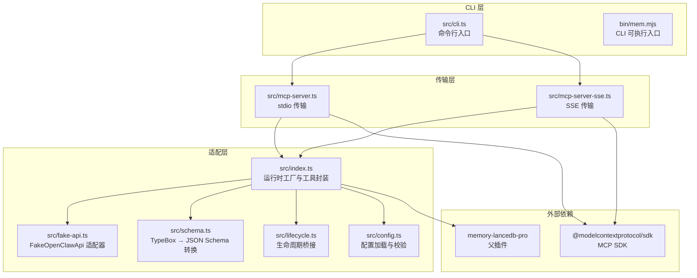
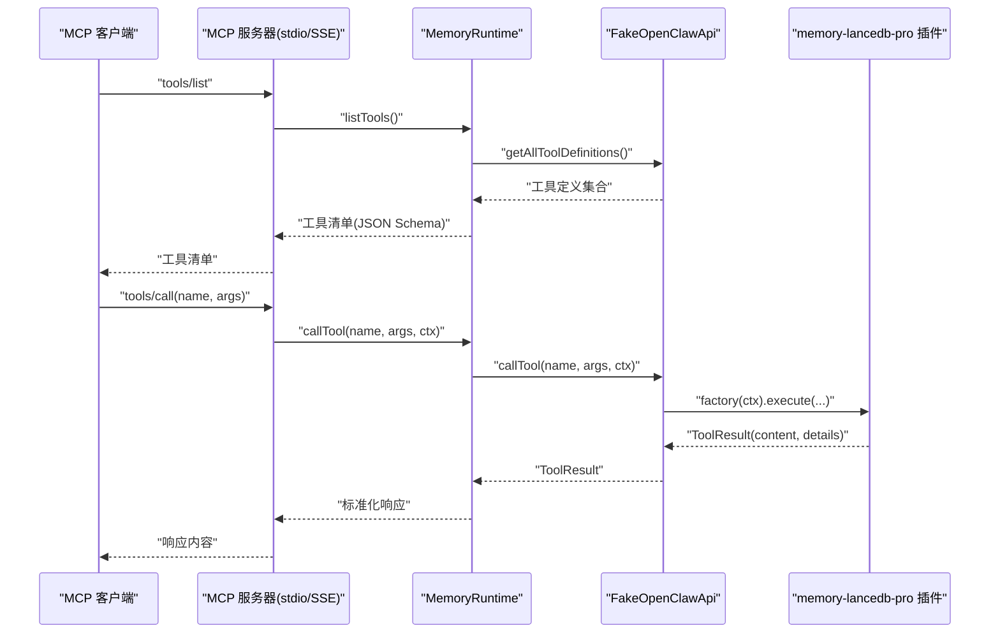
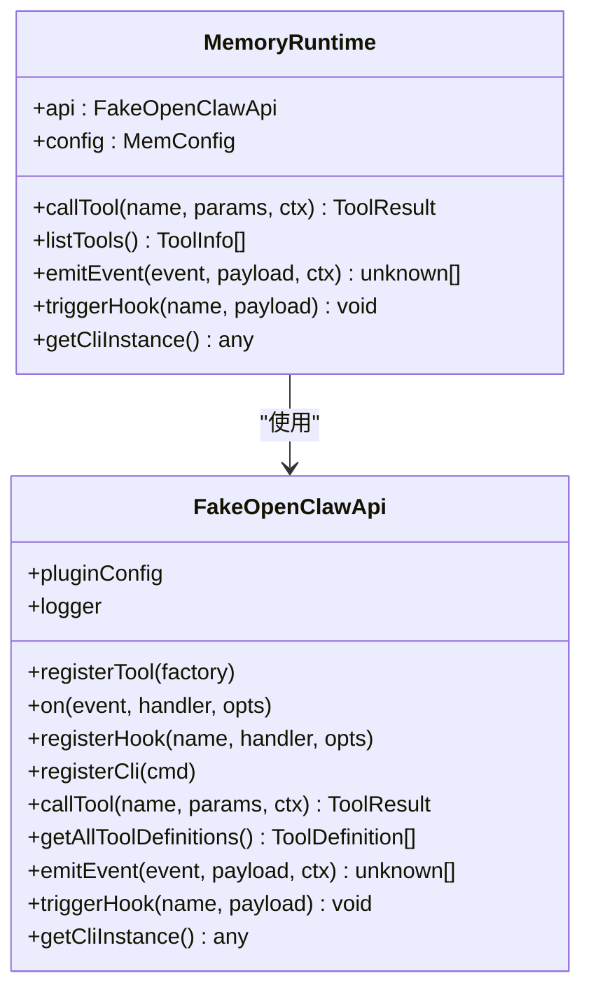
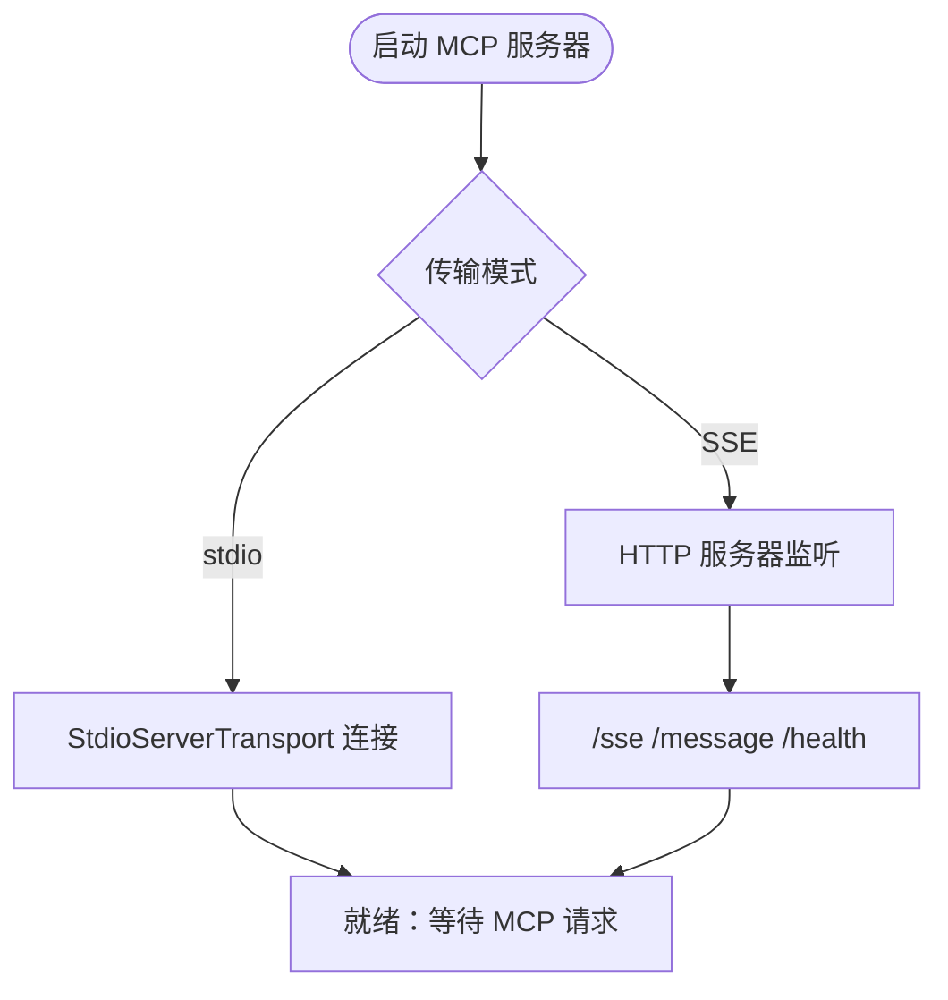
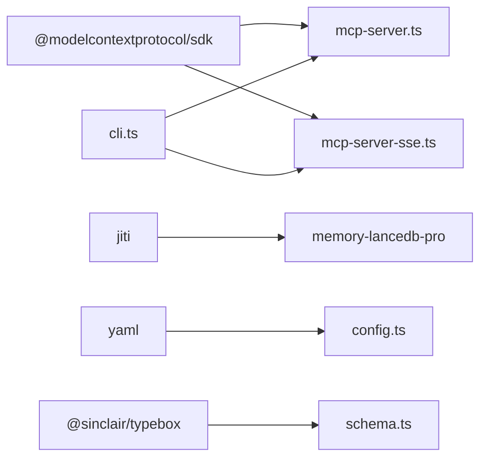
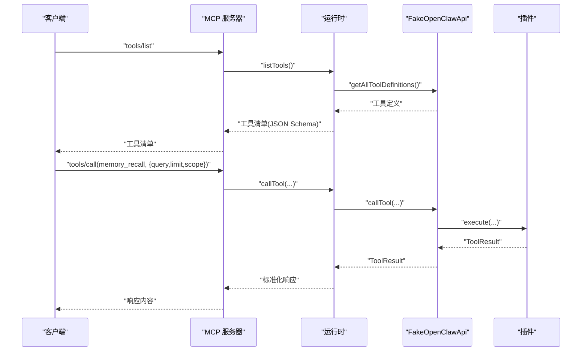

# MCP 协议基础

<cite>
**本文引用的文件**
- [README.md](file://README.md)
- [package.json](file://package.json)
- [src/index.ts](file://src/index.ts)
- [src/mcp-server.ts](file://src/mcp-server.ts)
- [src/mcp-server-sse.ts](file://src/mcp-server-sse.ts)
- [src/fake-api.ts](file://src/fake-api.ts)
- [src/config.ts](file://src/config.ts)
- [src/lifecycle.ts](file://src/lifecycle.ts)
- [src/schema.ts](file://src/schema.ts)
- [src/cli.ts](file://src/cli.ts)
- [bin/mem.mjs](file://bin/mem.mjs)
- [test/integration.test.mjs](file://test/integration.test.mjs)
</cite>

## 目录
1. [简介](#简介)
2. [项目结构](#项目结构)
3. [核心组件](#核心组件)
4. [架构总览](#架构总览)
5. [详细组件分析](#详细组件分析)
6. [依赖关系分析](#依赖关系分析)
7. [性能考量](#性能考量)
8. [故障排查指南](#故障排查指南)
9. [结论](#结论)
10. [附录](#附录)

## 简介
本文件面向希望理解 MCP（Model Context Protocol）协议及其在记忆管理中的应用的开发者。memory-lancedb-mcp 将 memory-lancedb-pro 的记忆能力通过 MCP 协议桥接，提供标准的工具调用、事件传递与生命周期管理能力，并支持两种传输模式：stdio（本地 MCP 客户端）与 SSE（HTTP，远程/多客户端）。本文将从协议原理、设计目标、标准化通信、生命周期管理、传输模式差异与适用场景、协议交互示例与最佳实践等方面进行系统性说明。

## 项目结构
该项目采用“适配层 + 业务插件”的分层设计：
- 适配层负责将 memory-lancedb-pro 的插件 API 适配为 MCP 协议所需的工具与事件接口
- 传输层分别提供 stdio 与 SSE 两种 MCP 传输
- CLI 层提供命令行入口与健康检查、配置管理、工具演示等功能
- 配置层负责 YAML 配置解析与环境变量扩展

图表来源
- [src/index.ts:1-515](file://src/index.ts#L1-L515)
- [src/mcp-server.ts:1-306](file://src/mcp-server.ts#L1-L306)
- [src/mcp-server-sse.ts:1-405](file://src/mcp-server-sse.ts#L1-L405)
- [src/fake-api.ts:1-318](file://src/fake-api.ts#L1-L318)
- [src/schema.ts:1-151](file://src/schema.ts#L1-L151)
- [src/lifecycle.ts:1-178](file://src/lifecycle.ts#L1-L178)
- [src/config.ts:1-312](file://src/config.ts#L1-L312)
- [src/cli.ts:1-617](file://src/cli.ts#L1-L617)
- [bin/mem.mjs:1-8](file://bin/mem.mjs#L1-L8)

章节来源
- [README.md:22-45](file://README.md#L22-L45)
- [package.json:1-46](file://package.json#L1-L46)

## 核心组件
- 运行时工厂与工具封装：负责加载配置、构建 FakeOpenClawApi、注册插件、暴露工具清单与调用、生命周期事件与钩子、CLI 实例等
- FakeOpenClawApi 适配器：模拟 OpenClaw 插件运行时接口，捕获工具工厂、事件处理器与钩子，供 MCP 层使用
- JSON Schema 转换：将 TypeBox 参数 schema 转换为 MCP 所需的 JSON Schema
- 生命周期桥接：将 OpenClaw 的 before_prompt_build、agent_end、session_end 等事件映射为 MCP 可调用的工具
- 配置系统：支持 YAML 配置文件、环境变量扩展、默认路径与初始化
- 传输层：stdio 与 SSE 两种 MCP 传输实现
- CLI：命令行入口，提供 serve、list、search、stats、scope、config、doctor 等命令

章节来源
- [src/index.ts:95-134](file://src/index.ts#L95-L134)
- [src/fake-api.ts:57-317](file://src/fake-api.ts#L57-L317)
- [src/schema.ts:39-150](file://src/schema.ts#L39-L150)
- [src/lifecycle.ts:52-177](file://src/lifecycle.ts#L52-L177)
- [src/config.ts:167-223](file://src/config.ts#L167-L223)
- [src/mcp-server.ts:43-140](file://src/mcp-server.ts#L43-L140)
- [src/mcp-server-sse.ts:57-209](file://src/mcp-server-sse.ts#L57-L209)
- [src/cli.ts:105-617](file://src/cli.ts#L105-L617)

## 架构总览
MCP 协议通过标准的工具清单与调用请求实现客户端与服务器之间的标准化通信。memory-lancedb-mcp 的架构要点：
- 工具清单：MCP tools/list 返回工具定义（含名称、描述、输入 JSON Schema）
- 工具调用：MCP tools/call 接收参数并返回内容数组（text/image/resource）
- 事件与钩子：通过 FakeOpenClawApi 注册事件与钩子，生命周期工具在 MCP 中以工具形式暴露
- 传输抽象：stdio 与 SSE 两种传输，统一使用 MCP SDK 的请求处理器与响应格式

图表来源
- [src/mcp-server.ts:61-124](file://src/mcp-server.ts#L61-L124)
- [src/mcp-server-sse.ts:247-287](file://src/mcp-server-sse.ts#L247-L287)
- [src/index.ts:248-453](file://src/index.ts#L248-L453)
- [src/fake-api.ts:217-235](file://src/fake-api.ts#L217-L235)

## 详细组件分析

### 运行时工厂与工具封装（MemoryRuntime）
- 负责加载配置、构建 FakeOpenClawApi、注册插件、暴露工具清单与调用、生命周期事件与钩子、CLI 实例
- 支持标签增强：对 memory_store/memory_recall/memory_list 的 tags 参数进行预处理与后处理，保证检索与显示的一致性
- 支持作用域隔离：根据服务端 scope 强制所有操作进入指定 scope，并在跨 scope 模式下使用系统代理 agentId

图表来源
- [src/index.ts:95-134](file://src/index.ts#L95-L134)
- [src/fake-api.ts:57-317](file://src/fake-api.ts#L57-L317)

章节来源
- [src/index.ts:207-498](file://src/index.ts#L207-L498)

### FakeOpenClawApi 适配器
- 捕获插件注册的工具工厂、事件与钩子，提供统一的 callTool、emitEvent、triggerHook 接口
- 路径解析与日志记录，便于在 MCP 环境中调试

章节来源
- [src/fake-api.ts:57-317](file://src/fake-api.ts#L57-L317)

### JSON Schema 转换（TypeBox → JSON Schema）
- 将 TypeBox 参数 schema 清洗为 MCP 所需的 JSON Schema，确保 top-level 为 object 类型
- 处理 properties、required、items、oneOf/anyOf/allOf 等字段

章节来源
- [src/schema.ts:39-150](file://src/schema.ts#L39-L150)

### 生命周期桥接（before_prompt_build、agent_end、session_end）
- 将 OpenClaw 的生命周期事件映射为 MCP 工具：_lifecycle_auto_recall、_lifecycle_auto_capture、_lifecycle_session_end
- 支持消息接收缓存、前置上下文拼接、后台自动提取等

章节来源
- [src/lifecycle.ts:52-177](file://src/lifecycle.ts#L52-L177)
- [src/mcp-server.ts:154-233](file://src/mcp-server.ts#L154-L233)
- [src/mcp-server-sse.ts:336-376](file://src/mcp-server-sse.ts#L336-L376)

### 配置系统
- 支持多级配置路径解析（环境变量覆盖、默认位置、当前目录回退）
- YAML 解析与环境变量扩展（${VAR}），必要字段校验
- 默认配置模板与初始化命令

章节来源
- [src/config.ts:107-223](file://src/config.ts#L107-L223)
- [src/cli.ts:370-443](file://src/cli.ts#L370-L443)

### 传输层：stdio 与 SSE
- stdio：默认 MCP 传输，适合本地客户端（Claude Desktop、Cursor、Cline 等）
- SSE：HTTP 传输，支持远程访问与多客户端，提供 /sse、/message、/health 端点

图表来源
- [src/mcp-server.ts:127-140](file://src/mcp-server.ts#L127-L140)
- [src/mcp-server-sse.ts:82-190](file://src/mcp-server-sse.ts#L82-L190)

章节来源
- [src/mcp-server.ts:43-140](file://src/mcp-server.ts#L43-L140)
- [src/mcp-server-sse.ts:57-209](file://src/mcp-server-sse.ts#L57-L209)

### CLI 与命令参考
- serve：启动 MCP 服务器（stdio 或 SSE），支持 scope、config、dry-run、quiet 等选项
- list/search/stats：内存查询与统计
- scope：scope 列表与批量删除
- config：初始化、显示、路径、验证
- doctor：健康检查（配置、API key、插件加载、工具清单）

章节来源
- [src/cli.ts:114-617](file://src/cli.ts#L114-L617)
- [bin/mem.mjs:1-8](file://bin/mem.mjs#L1-L8)

## 依赖关系分析
- 依赖 MCP SDK 提供的标准传输与请求/响应模型
- 通过 jiti 直接从 npm 加载 memory-lancedb-pro 的 TypeScript 源码，零侵入
- YAML 解析与类型转换（TypeBox → JSON Schema）
- 命令行解析与健康检查

图表来源
- [package.json:26-31](file://package.json#L26-L31)
- [src/mcp-server.ts:8-15](file://src/mcp-server.ts#L8-L15)
- [src/mcp-server-sse.ts:11-25](file://src/mcp-server-sse.ts#L11-L25)
- [src/config.ts:17-27](file://src/config.ts#L17-L27)
- [src/schema.ts:10-10](file://src/schema.ts#L10-L10)
- [src/cli.ts:17-27](file://src/cli.ts#L17-L27)

章节来源
- [package.json:26-31](file://package.json#L26-L31)

## 性能考量
- 检索与排序：混合检索（向量 + BM25）与重排策略影响延迟与准确性，建议根据场景调整权重与候选池大小
- 自动衰减与压缩：定期 compact 与去重可降低存储膨胀，提高检索效率
- SSE 并发：SSE 模式允许多客户端并发，需关注资源占用与限流策略
- 日志与调试：开发阶段开启详细日志有助于定位问题，生产环境建议关闭或降级

## 故障排查指南
- 配置文件缺失或解析失败：使用 doctor 命令检查配置路径、解析与 API key 状态
- 插件加载失败：确认 memory-lancedb-pro 是否正确安装，以及 jiti 能否加载源码
- 工具清单为空：检查 enableManagementTools、autoRecall/autoCapture 等开关是否正确
- SSE 端口冲突：修改 --port 或 --host，或停止占用进程
- 权限与作用域：跨 scope 模式下，写入未显式指定 scope 时会注入默认 scope，避免写入系统私有空间

章节来源
- [src/cli.ts:449-517](file://src/cli.ts#L449-L517)
- [src/mcp-server.ts:132-138](file://src/mcp-server.ts#L132-L138)
- [src/mcp-server-sse.ts:176-183](file://src/mcp-server-sse.ts#L176-L183)

## 结论
memory-lancedb-mcp 通过 MCP 协议实现了与 AI 助手生态的标准化对接，提供稳定的工具调用、事件传递与生命周期管理能力。其双传输模式满足本地与远程场景需求，配合标签与作用域隔离机制，能够灵活支撑多项目、多客户端的记忆管理需求。开发者可据此快速集成长期记忆能力，提升 AI 助手的个性化与一致性。

## 附录

### MCP 协议交互示例（概念流程）
- 客户端请求工具清单：tools/list → 服务器返回工具定义（含 JSON Schema）
- 客户端调用工具：tools/call(memory_recall, { query, limit, scope }) → 返回检索结果
- 生命周期工具：_lifecycle_auto_recall → 返回前置上下文；_lifecycle_auto_capture → 触发后台提取；_lifecycle_session_end → 清理状态

图表来源
- [src/mcp-server.ts:61-124](file://src/mcp-server.ts#L61-L124)
- [src/index.ts:248-453](file://src/index.ts#L248-L453)
- [src/fake-api.ts:217-235](file://src/fake-api.ts#L217-L235)

### 最佳实践
- 传输模式选择：本地客户端优先使用 stdio；远程或多客户端使用 SSE，并注意安全与限流
- 作用域隔离：生产环境建议固定 --scope，避免跨 scope 写入带来的权限与数据泄露风险
- 标签系统：合理使用 tags 进行细粒度过滤，避免非法字符导致的前缀结构破坏
- 生命周期：在 prompt 构建前调用自动召回，在会话结束时调用自动捕获，确保上下文与记忆的同步
- 健康检查：定期使用 doctor 命令验证配置与插件加载状态

章节来源
- [README.md:426-544](file://README.md#L426-L544)
- [src/cli.ts:449-517](file://src/cli.ts#L449-L517)
- [src/lifecycle.ts:52-177](file://src/lifecycle.ts#L52-L177)