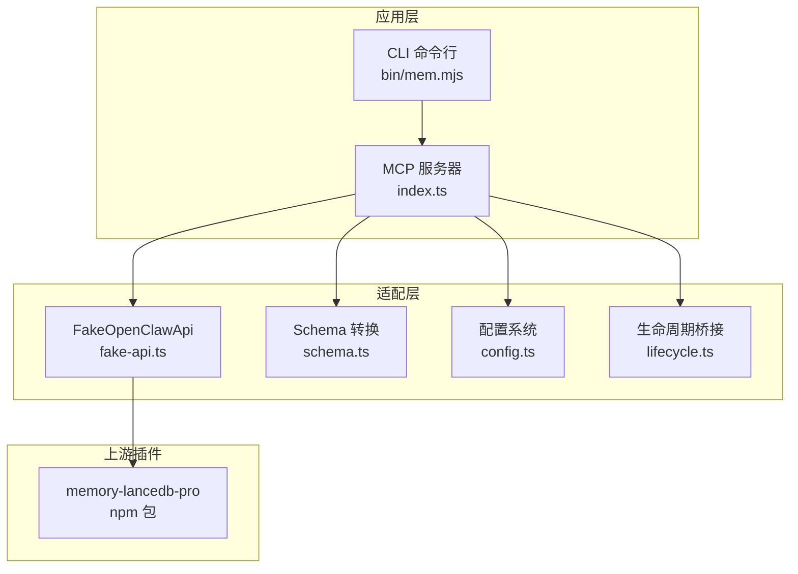
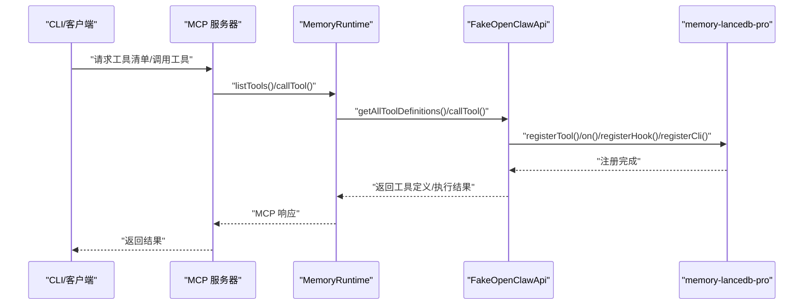
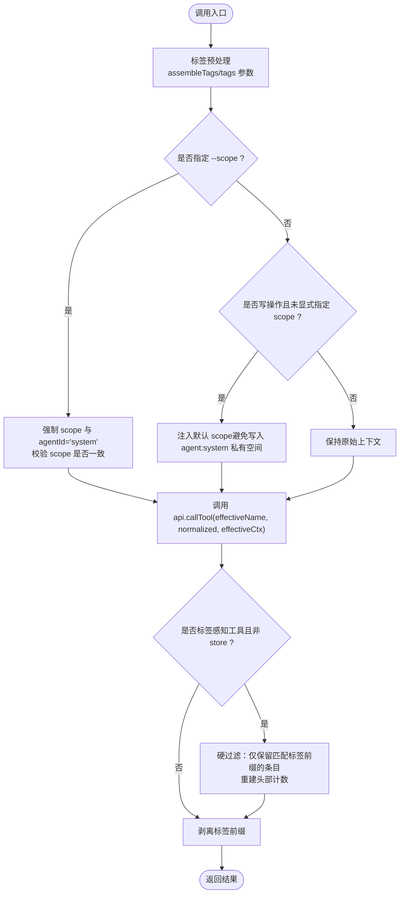
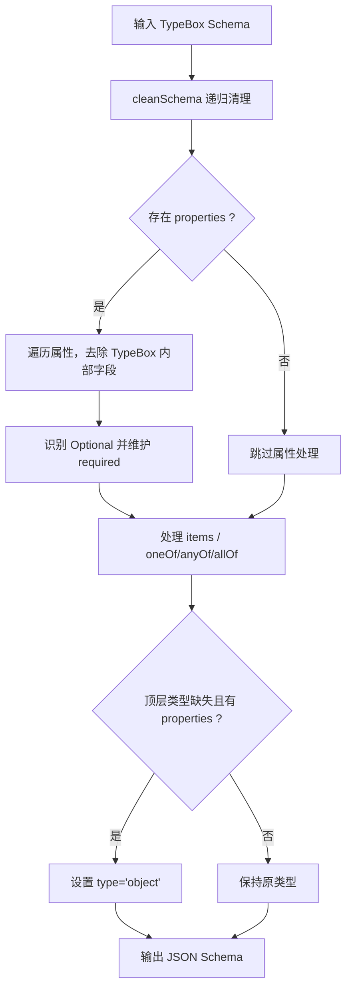
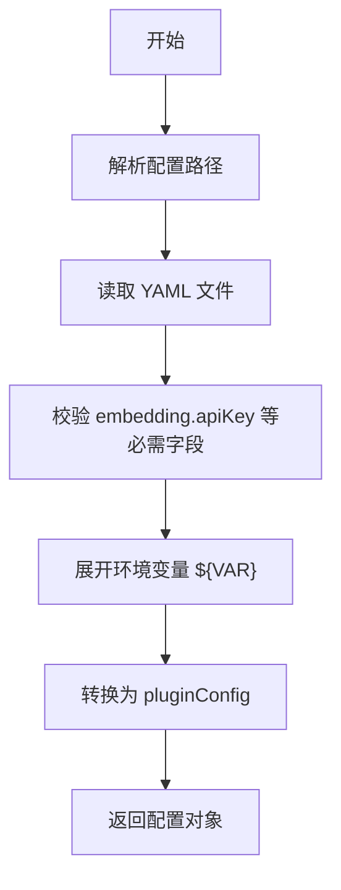
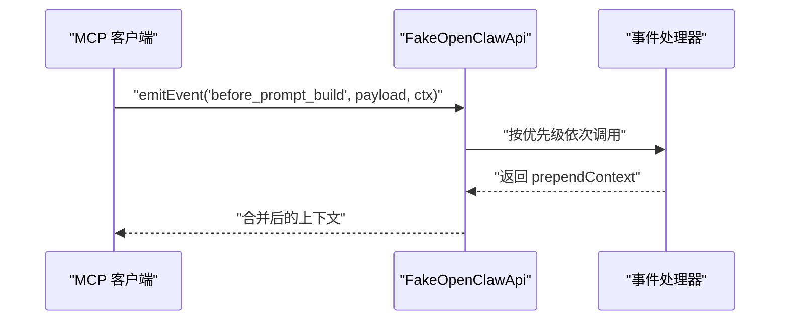
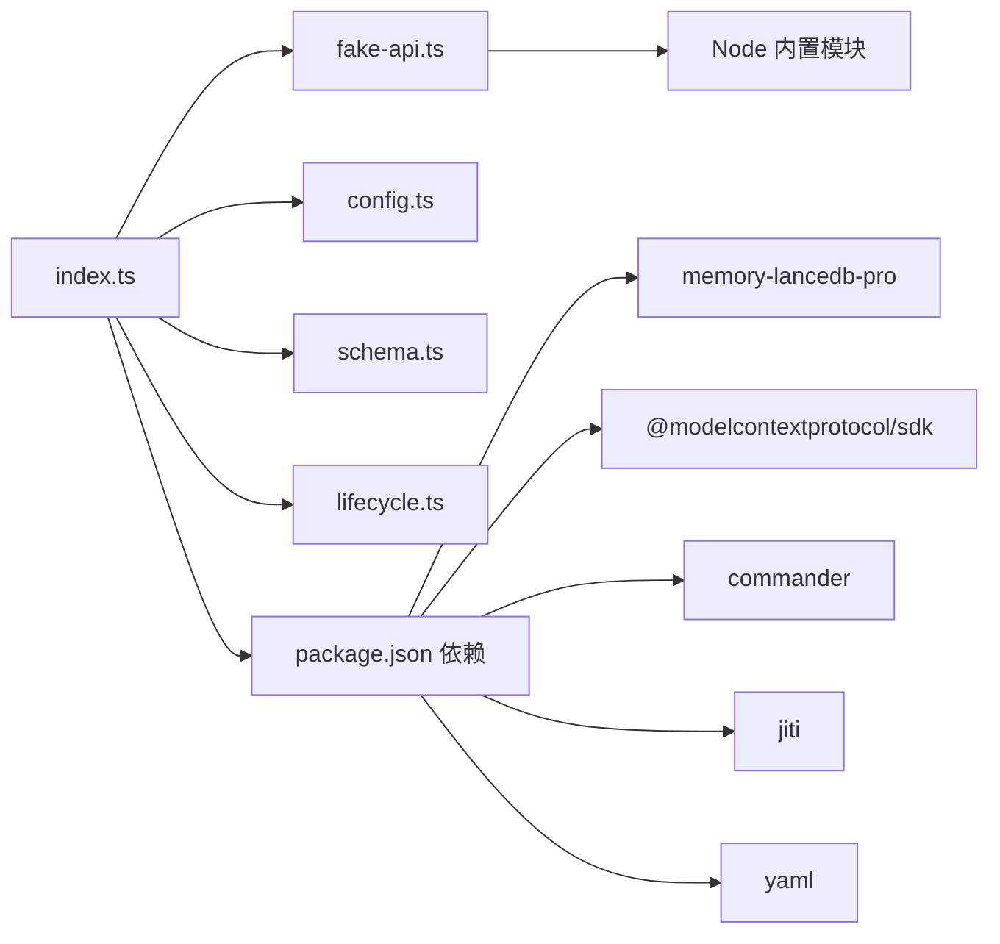

# OpenClaw 适配器

<cite>
**本文引用的文件**
- [src/fake-api.ts](file://src/fake-api.ts)
- [src/index.ts](file://src/index.ts)
- [src/schema.ts](file://src/schema.ts)
- [src/config.ts](file://src/config.ts)
- [src/lifecycle.ts](file://src/lifecycle.ts)
- [package.json](file://package.json)
- [README.md](file://README.md)
- [test/integration.test.mjs](file://test/integration.test.mjs)
- [bin/mem.mjs](file://bin/mem.mjs)
</cite>

## 目录
1. [简介](#简介)
2. [项目结构](#项目结构)
3. [核心组件](#核心组件)
4. [架构总览](#架构总览)
5. [详细组件分析](#详细组件分析)
6. [依赖关系分析](#依赖关系分析)
7. [性能考量](#性能考量)
8. [故障排查指南](#故障排查指南)
9. [结论](#结论)
10. [附录](#附录)

## 简介
本文件面向开发者，系统性阐述 FakeOpenClawApi 适配器的设计与实现，解释其如何将 memory-lancedb-pro 的插件接口无缝桥接到 MCP（Model Context Protocol）服务层。FakeOpenClawApi 作为“最小运行时”模拟器，负责：
- 接收并注册 14 个工具工厂（tool factories）
- 注册事件处理器与钩子（hooks）
- 暴露 CLI 命令实例
- 将上述能力转交给 MCP Server 层，供工具清单、调用、事件与钩子触发使用

同时，文档还覆盖：
- OpenClaw 运行时环境的设计理念与在项目中的作用
- FakeOpenClawApi 作为适配层，如何将 memory-lancedb-pro 的接口转换为符合 OpenClaw 规范的 API
- 适配器的架构设计、核心方法实现与与上游插件的交互机制
- 工具调用上下文、结果处理与错误管理的实现细节
- 适配器扩展指南与自定义实现示例

## 项目结构
该项目采用“适配器 + 插件桥接”的分层架构：
- 顶层入口负责加载配置、创建 FakeOpenClawApi、注册插件，并构建 MemoryRuntime 供 MCP Server/CLI 使用
- FakeOpenClawApi 作为适配层，实现 OpenClaw 插件 SDK 的最小接口集合
- schema.ts 负责将 TypeBox 参数 schema 转换为 MCP 所需的 JSON Schema
- lifecycle.ts 提供 MCP 友好的生命周期事件封装，便于在 MCP 客户端中触发自动召回与自动捕获
- config.ts 提供配置解析与环境变量扩展
- test/integration.test.mjs 用于验证适配器与插件的集成效果



图表来源
- [src/index.ts:154-184](file://src/index.ts#L154-L184)
- [src/fake-api.ts:57-317](file://src/fake-api.ts#L57-L317)
- [src/schema.ts:39-151](file://src/schema.ts#L39-L151)
- [src/config.ts:167-214](file://src/config.ts#L167-L214)
- [src/lifecycle.ts:52-177](file://src/lifecycle.ts#L52-L177)

章节来源
- [src/index.ts:154-184](file://src/index.ts#L154-L184)
- [src/fake-api.ts:57-317](file://src/fake-api.ts#L57-L317)
- [src/schema.ts:39-151](file://src/schema.ts#L39-L151)
- [src/config.ts:167-214](file://src/config.ts#L167-L214)
- [src/lifecycle.ts:52-177](file://src/lifecycle.ts#L52-L177)

## 核心组件
- FakeOpenClawApi：适配层核心，实现 OpenClaw 插件 SDK 的最小接口，捕获工具工厂、事件与钩子，并提供工具调用、事件发射、钩子触发与 CLI 实例导出
- MemoryRuntime：顶层运行时对象，封装工具调用、事件发射、钩子触发、CLI 获取与工具清单导出，内置标签预处理、作用域注入与后处理逻辑
- Schema 转换器：将 TypeBox schema 转换为 MCP 所需的 JSON Schema
- 配置系统：解析 YAML 配置，支持环境变量扩展与默认路径
- 生命周期桥接：将 OpenClaw 生命周期事件映射为 MCP 可调用的操作

章节来源
- [src/fake-api.ts:57-317](file://src/fake-api.ts#L57-L317)
- [src/index.ts:95-122](file://src/index.ts#L95-L122)
- [src/schema.ts:39-151](file://src/schema.ts#L39-L151)
- [src/config.ts:167-214](file://src/config.ts#L167-L214)
- [src/lifecycle.ts:52-177](file://src/lifecycle.ts#L52-L177)

## 架构总览
FakeOpenClawApi 的职责是“最小运行时”，它只实现插件注册所需的必要接口，从而让 memory-lancedb-pro 在 MCP 环境中正常工作。整体流程如下：
- 创建 FakeOpenClawApi 并传入插件配置
- 通过 jiti 直接从 npm 加载 memory-lancedb-pro 的 TypeScript 源码并调用其 register(api)
- 插件内部注册 14 个工具工厂、若干事件与钩子
- MCP Server 通过 MemoryRuntime 获取工具清单、调用工具、触发事件与钩子、获取 CLI 实例



图表来源
- [src/index.ts:207-498](file://src/index.ts#L207-L498)
- [src/fake-api.ts:113-160](file://src/fake-api.ts#L113-L160)
- [src/index.ts:159-184](file://src/index.ts#L159-L184)

章节来源
- [src/index.ts:207-498](file://src/index.ts#L207-L498)
- [src/fake-api.ts:113-160](file://src/fake-api.ts#L113-L160)
- [src/index.ts:159-184](file://src/index.ts#L159-L184)

## 详细组件分析

### FakeOpenClawApi 适配器
FakeOpenClawApi 是适配层的核心，负责：
- 工具注册：捕获工具工厂，按名称索引，支持预览工厂以提取工具名
- 事件系统：注册事件处理器，按优先级排序并异步执行
- 钩子系统：注册钩子处理器，按注册顺序异步触发
- CLI 注册：保存 CLI 命令实例，供上层复用
- 工具调用：根据名称获取工厂，构造上下文，调用工具执行函数
- 路径解析：支持 ~、绝对路径与相对路径解析，统一到用户主目录
- 配置与运行时属性：提供 config 与 runtime 属性以满足插件需求

```mermaid
classDiagram
class FakeOpenClawApi {
+pluginConfig : Record<string, unknown>
+logger : Logger
-_toolFactories : Map<string, ToolFactory>
-_eventHandlers : Map<string, EventHandler[]>
-_hookHandlers : Map<string, EventHandler[]>
-_cliInstance : unknown
-_homeDir : string
+constructor(options)
+resolvePath(p) : string
+registerTool(factory) : void
+on(event, handler, opts?) : void
+registerHook(name, handler, opts?) : void
+registerCli(cmd) : void
+registerMemoryRuntime(obj) : void
+registerMemoryCapability(obj) : void
+registerService(obj) : void
+get runtime()
+get config()
+getToolNames() : string[]
+getToolFactory(name) : ToolFactory
+getAllToolFactories() : Map<string, ToolFactory>
+callTool(name, params, ctx?) : Promise<ToolResult>
+getToolDefinition(name) : ToolDefinition
+getAllToolDefinitions() : ToolDefinition[]
+emitEvent(event, payload, ctx?) : Promise<unknown[]>
+triggerHook(name, payload?) : Promise<void>
+getCliInstance() : unknown
+getRegisteredEvents() : string[]
+getRegisteredHooks() : string[]
}
class ToolDefinition {
+name : string
+label? : string
+description : string
+parameters : unknown
+execute(callId, params, signal?, onUpdate?, runtimeCtx?) : Promise<ToolResult>
}
class ToolResult {
+content : Array<{type : string, text : string}>
+details? : Record<string, unknown>
}
class ToolCallContext {
+agentId? : string
+sessionKey? : string
}
FakeOpenClawApi --> ToolDefinition : "使用"
FakeOpenClawApi --> ToolResult : "返回"
FakeOpenClawApi --> ToolCallContext : "构造"
```

图表来源
- [src/fake-api.ts:57-317](file://src/fake-api.ts#L57-L317)
- [src/fake-api.ts:20-36](file://src/fake-api.ts#L20-L36)

章节来源
- [src/fake-api.ts:57-317](file://src/fake-api.ts#L57-L317)

### MemoryRuntime 运行时
MemoryRuntime 是对外暴露的高层运行时对象，封装：
- 工具调用：内置标签预处理、作用域注入与后处理逻辑
- 事件与钩子：委托给 FakeOpenClawApi
- CLI 实例：委托给 FakeOpenClawApi
- 工具清单：从 FakeOpenClawApi 获取工具定义并注入标签参数



图表来源
- [src/index.ts:248-453](file://src/index.ts#L248-L453)

章节来源
- [src/index.ts:248-453](file://src/index.ts#L248-L453)

### Schema 转换器
TypeBox → JSON Schema 的转换器负责：
- 清理 TypeBox 特有的内部符号与扩展字段
- 递归处理 properties、items、oneOf/anyOf/allOf
- 推断缺失的类型（如 object）
- 确保 MCP 所需的顶层对象类型



图表来源
- [src/schema.ts:57-130](file://src/schema.ts#L57-L130)

章节来源
- [src/schema.ts:57-130](file://src/schema.ts#L57-L130)

### 配置系统
配置系统负责：
- 解析 YAML 文件，支持环境变量扩展
- 默认路径解析：MEM_CONFIG_PATH > ~/.config/memory-mcp/config.yaml > ./config.yaml
- 将配置转换为插件期望的 pluginConfig 格式



图表来源
- [src/config.ts:107-214](file://src/config.ts#L107-L214)

章节来源
- [src/config.ts:107-214](file://src/config.ts#L107-L214)

### 生命周期桥接
生命周期桥接将 OpenClaw 的 before_prompt_build、agent_end、session_end、message_received 等事件映射为 MCP 可调用的操作：
- triggerAutoRecall：在发送提示前自动召回相关记忆，返回可前置的上下文
- triggerAutoCapture：在代理结束时自动提取记忆
- triggerSessionEnd：会话清理
- triggerMessageReceived：缓存用户消息用于召回门控逻辑



图表来源
- [src/lifecycle.ts:52-91](file://src/lifecycle.ts#L52-L91)
- [src/fake-api.ts:269-287](file://src/fake-api.ts#L269-L287)

章节来源
- [src/lifecycle.ts:52-91](file://src/lifecycle.ts#L52-L91)
- [src/fake-api.ts:269-287](file://src/fake-api.ts#L269-L287)

## 依赖关系分析
- 依赖关系
  - index.ts 依赖 fake-api.ts、config.ts、schema.ts、lifecycle.ts
  - fake-api.ts 无外部依赖，仅使用 Node 内置模块
  - schema.ts 依赖 @sinclair/typebox（开发期）
  - config.ts 依赖 yaml
  - package.json 声明对 memory-lancedb-pro 的依赖
- 外部集成点
  - jiti：动态加载 memory-lancedb-pro 的 TypeScript 源码
  - @modelcontextprotocol/sdk：MCP 协议实现
  - commander：CLI 命令行框架



图表来源
- [src/index.ts:9-12](file://src/index.ts#L9-L12)
- [package.json:26-36](file://package.json#L26-L36)

章节来源
- [src/index.ts:9-12](file://src/index.ts#L9-L12)
- [package.json:26-36](file://package.json#L26-L36)

## 性能考量
- 工具调用链路
  - 工具工厂预览仅用于提取名称，避免不必要的初始化开销
  - 工具调用时才创建具体工具定义，减少内存占用
- 事件与钩子
  - 事件按优先级排序，钩子按注册顺序触发，避免阻塞主流程
- Schema 转换
  - 递归清理与属性扫描为线性复杂度，对工具数量呈线性增长
- 配置加载
  - YAML 解析与环境变量展开为一次性开销，后续复用配置对象

[本节为通用性能讨论，不直接分析具体文件]

## 故障排查指南
- 插件加载失败
  - 现象：无法加载 memory-lancedb-pro
  - 排查：确认已安装 memory-lancedb-pro@beta；检查 jiti 加载路径
  - 参考
    - [src/index.ts:159-184](file://src/index.ts#L159-L184)
- 工具未注册或名称不匹配
  - 现象：调用工具时报未知工具
  - 排查：确认插件已正确注册工具；检查工具名称大小写与拼写
  - 参考
    - [src/fake-api.ts:113-127](file://src/fake-api.ts#L113-L127)
    - [src/fake-api.ts:217-235](file://src/fake-api.ts#L217-L235)
- 作用域冲突
  - 现象：指定 scope 与服务端 scope 不一致被拒绝
  - 排查：在锁定 scope 模式下，请求的 scope 必须与服务端一致
  - 参考
    - [src/index.ts:351-367](file://src/index.ts#L351-L367)
- 标签处理异常
  - 现象：标签非法字符导致错误
  - 排查：检查标签字符集是否符合白名单；确认标签前缀格式
  - 参考
    - [src/index.ts:41-52](file://src/index.ts#L41-L52)
    - [src/index.ts:317-335](file://src/index.ts#L317-L335)
- 日志与调试
  - 现象：难以定位问题
  - 排查：开启 quiet=false 查看 debug/info/warn/error 日志
  - 参考
    - [src/fake-api.ts:84-89](file://src/fake-api.ts#L84-L89)

章节来源
- [src/index.ts:159-184](file://src/index.ts#L159-L184)
- [src/fake-api.ts:113-127](file://src/fake-api.ts#L113-L127)
- [src/fake-api.ts:217-235](file://src/fake-api.ts#L217-L235)
- [src/index.ts:351-367](file://src/index.ts#L351-L367)
- [src/index.ts:41-52](file://src/index.ts#L41-L52)
- [src/index.ts:317-335](file://src/index.ts#L317-L335)
- [src/fake-api.ts:84-89](file://src/fake-api.ts#L84-L89)

## 结论
FakeOpenClawApi 通过“最小运行时”策略，成功将 memory-lancedb-pro 的插件接口桥接至 MCP 服务层。其核心价值在于：
- 保持零修改原则：不改动上游插件一行代码
- 明确适配边界：仅实现插件注册所需接口
- 丰富扩展能力：工具、事件、钩子、CLI 的统一导出
- 友好集成体验：MCP Server 与 CLI 可直接使用

该适配器模式在项目架构中扮演“协议适配器”的角色，既保证了与上游插件的兼容性，又为 MCP 生态提供了标准化的工具与事件接口。

[本节为总结性内容，不直接分析具体文件]

## 附录

### OpenClaw 运行时设计理念与作用
- 设计理念
  - 通过最小运行时接口，屏蔽插件对具体平台的依赖
  - 将插件能力抽象为工具、事件与钩子三类接口
  - 保持插件的可移植性与可替换性
- 在项目中的作用
  - 作为 memory-lancedb-pro 的“运行时容器”，使其能在 MCP 环境中注册并运行
  - 提供统一的工具调用、事件与钩子接口，供 MCP Server 与 CLI 使用

章节来源
- [src/fake-api.ts:1-11](file://src/fake-api.ts#L1-L11)
- [README.md:22-45](file://README.md#L22-L45)

### FakeOpenClawApi 与上游插件的交互机制
- 插件注册
  - 通过 jiti 直接加载 memory-lancedb-pro 的 TypeScript 源码
  - 调用插件的 register(api) 方法，传入 FakeOpenClawApi 实例
- 工具注册
  - 插件内部调用 api.registerTool(factory)，FakeOpenClawApi 保存工厂并预览以提取名称
- 事件与钩子
  - 插件调用 api.on() 与 api.registerHook() 注册处理器，FakeOpenClawApi 保存并按优先级/顺序执行
- CLI 注册
  - 插件调用 api.registerCli(cmd)，FakeOpenClawApi 保存 CLI 实例供上层复用

章节来源
- [src/index.ts:159-184](file://src/index.ts#L159-L184)
- [src/fake-api.ts:113-160](file://src/fake-api.ts#L113-L160)
- [src/fake-api.ts:133-151](file://src/fake-api.ts#L133-L151)
- [src/fake-api.ts:157-160](file://src/fake-api.ts#L157-L160)

### 工具调用上下文、结果处理与错误管理
- 上下文
  - 通过 ToolCallContext 注入 agentId 与 sessionKey，默认 agentId="main"，sessionKey 为时间戳
  - 在锁定 scope 模式下，强制使用 agentId="system" 以绕过 ACL 检查
- 结果处理
  - 工具返回 ToolResult，包含 content 与 details
  - 标签感知工具在返回后进行硬过滤与前缀剥离
- 错误管理
  - 工具工厂预览失败时记录警告
  - 事件与钩子处理器异常被捕获并记录警告，不影响整体流程

章节来源
- [src/fake-api.ts:227-235](file://src/fake-api.ts#L227-L235)
- [src/index.ts:349-385](file://src/index.ts#L349-L385)
- [src/index.ts:390-450](file://src/index.ts#L390-L450)
- [src/fake-api.ts:124-127](file://src/fake-api.ts#L124-L127)
- [src/fake-api.ts:282-284](file://src/fake-api.ts#L282-L284)
- [src/fake-api.ts:297-299](file://src/fake-api.ts#L297-L299)

### 适配器扩展指南与自定义实现示例
- 扩展点
  - 新增工具：在插件中调用 api.registerTool(factory) 注册新工具工厂
  - 新增事件：在插件中调用 api.on(event, handler, opts) 注册事件处理器
  - 新增钩子：在插件中调用 api.registerHook(name, handler, opts) 注册钩子处理器
  - CLI 扩展：在插件中调用 api.registerCli(cmd) 注册 CLI 实例
- 自定义实现示例
  - 工具工厂示例：参考插件中工具工厂的定义与 execute 函数签名
  - 事件处理器示例：参考生命周期桥接中的事件处理模式
  - 钩子处理器示例：参考插件中钩子注册与触发的实现

章节来源
- [src/fake-api.ts:113-160](file://src/fake-api.ts#L113-L160)
- [src/fake-api.ts:133-151](file://src/fake-api.ts#L133-L151)
- [src/fake-api.ts:157-160](file://src/fake-api.ts#L157-L160)
- [src/lifecycle.ts:52-91](file://src/lifecycle.ts#L52-L91)

### CLI 与入口
- CLI 入口
  - bin/mem.mjs 作为命令行入口，加载 dist/cli.js
- 典型使用
  - 初始化配置、启动 MCP 服务、执行工具与管理命令

章节来源
- [bin/mem.mjs:1-8](file://bin/mem.mjs#L1-L8)
- [README.md:279-424](file://README.md#L279-L424)