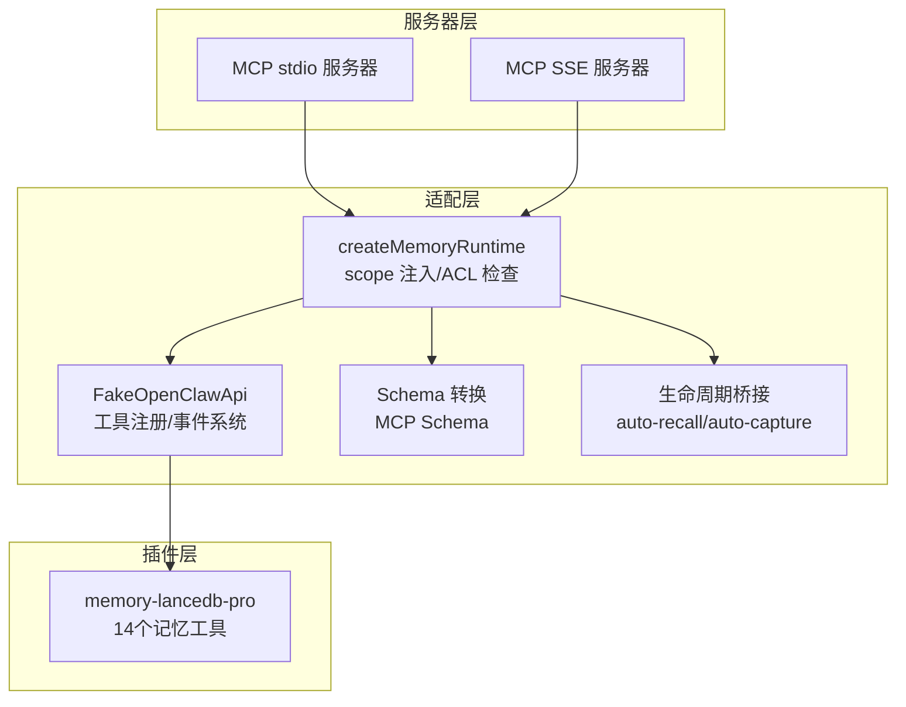
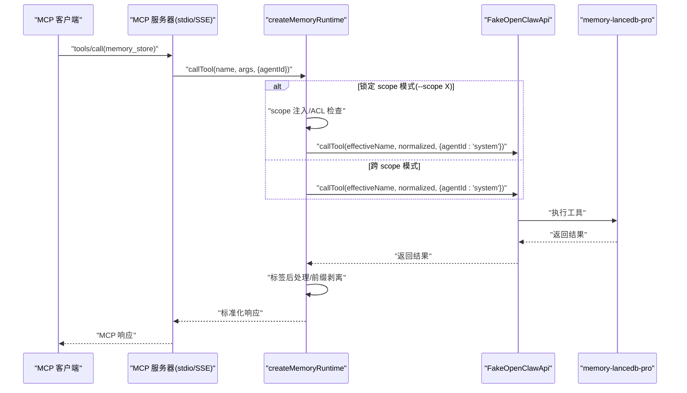
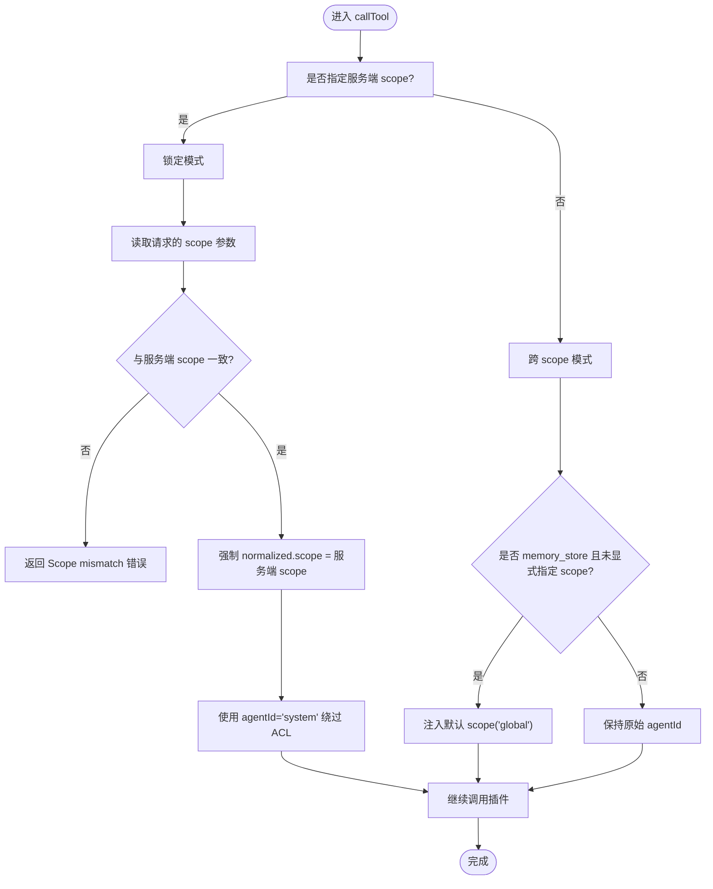
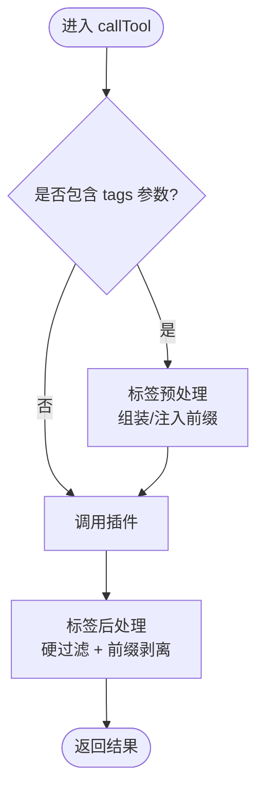
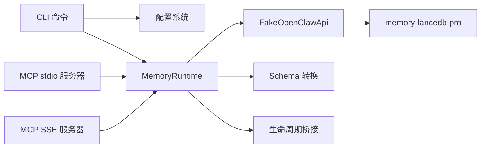

# Scope 隔离机制

<cite>
**本文引用的文件**
- [src/index.ts](file://src/index.ts)
- [src/config.ts](file://src/config.ts)
- [src/fake-api.ts](file://src/fake-api.ts)
- [src/mcp-server.ts](file://src/mcp-server.ts)
- [src/mcp-server-sse.ts](file://src/mcp-server-sse.ts)
- [src/cli.ts](file://src/cli.ts)
- [src/lifecycle.ts](file://src/lifecycle.ts)
- [src/schema.ts](file://src/schema.ts)
- [README.md](file://README.md)
</cite>

## 目录
1. [简介](#简介)
2. [项目结构](#项目结构)
3. [核心组件](#核心组件)
4. [架构总览](#架构总览)
5. [详细组件分析](#详细组件分析)
6. [依赖分析](#依赖分析)
7. [性能考虑](#性能考虑)
8. [故障排查指南](#故障排查指南)
9. [结论](#结论)
10. [附录](#附录)

## 简介
本文件围绕 Scope 隔离机制展开，系统性阐述多项目隔离的设计原理与实现方式，重点覆盖：
- 基于 agentId 的访问控制与 ACL 系统
- 跨 scope 模式与锁定 scope 模式的差异与使用场景
- scope 配置管理、权限继承与安全边界
- scope 注入、ACL 检查与访问控制的具体实现流程
- 最佳实践与安全建议

Scope 隔离通过“服务端 scope 注入 + agentId 绕过 + wrapper 层 ACL 检查”三段式实现，既保证了跨 scope 模式下的灵活查询，又在锁定模式下严格限制操作范围，防止越权访问。

## 项目结构
该项目采用“适配层 + 插件层”的分层架构：
- 适配层负责 MCP 协议桥接、工具注入、标签前缀处理、scope 注入与 ACL 检查
- 插件层（memory-lancedb-pro）提供具体的记忆工具与底层存储
- 服务器层（stdio/SSE）对外暴露 MCP 接口
- CLI 层提供配置管理与 scope 管理命令

图表来源
- [src/index.ts:207-498](file://src/index.ts#L207-L498)
- [src/fake-api.ts:57-317](file://src/fake-api.ts#L57-L317)
- [src/mcp-server.ts:43-140](file://src/mcp-server.ts#L43-L140)
- [src/mcp-server-sse.ts:57-209](file://src/mcp-server-sse.ts#L57-L209)

章节来源
- [src/index.ts:13-515](file://src/index.ts#L13-L515)
- [src/mcp-server.ts:1-306](file://src/mcp-server.ts#L1-L306)
- [src/mcp-server-sse.ts:1-405](file://src/mcp-server-sse.ts#L1-L405)

## 核心组件
- createMemoryRuntime：主工厂函数，负责加载配置、注入 scope、注册插件、构建运行时对象，并实现工具调用的预处理/后处理逻辑（标签前缀、scope 注入、ACL 检查、结果过滤与剥离）
- FakeOpenClawApi：适配器，封装插件所需的工具注册、事件系统、钩子、CLI 注册等接口
- MCP 服务器（stdio/SSE）：将运行时暴露为 MCP 服务，设置默认 agentId（跨 scope 模式为 "system"，锁定模式为服务端 scope），并将请求转发给运行时
- CLI：提供配置初始化、健康检查、scope 管理、工具调用等命令
- 配置系统：解析 YAML 配置，支持环境变量扩展，提供 scopes.default、scopes.definitions、scopes.agentAccess 等字段
- 标签系统：将 tags 以“【标签:x,y】”前缀嵌入文本，便于检索与过滤

章节来源
- [src/index.ts:207-498](file://src/index.ts#L207-L498)
- [src/fake-api.ts:57-317](file://src/fake-api.ts#L57-L317)
- [src/mcp-server.ts:43-140](file://src/mcp-server.ts#L43-L140)
- [src/mcp-server-sse.ts:57-209](file://src/mcp-server-sse.ts#L57-L209)
- [src/cli.ts:1-617](file://src/cli.ts#L1-L617)
- [src/config.ts:23-98](file://src/config.ts#L23-L98)

## 架构总览
Scope 隔离的关键在于三层协作：
- 服务器层：根据是否指定 --scope 决定默认 agentId（跨 scope 模式为 "system"，锁定模式为服务端 scope）
- 适配层：在工具调用前执行 scope 注入与 ACL 检查；在工具调用后执行标签过滤与前缀剥离
- 插件层：基于 scope ACL 控制访问，配合 isSystemBypassId("system") 使 "system" agentId 跳过 ACL 检查

图表来源
- [src/mcp-server.ts:86-124](file://src/mcp-server.ts#L86-L124)
- [src/mcp-server-sse.ts:262-287](file://src/mcp-server-sse.ts#L262-L287)
- [src/index.ts:337-453](file://src/index.ts#L337-L453)

## 详细组件分析

### 1) Scope 注入与 ACL 检查（wrapper 层）
- 作用：在工具调用前，根据服务端 scope 与请求参数决定是否注入 scope，以及是否允许继续调用
- 关键点：
  - 锁定模式：当 options.scope 存在时，所有请求的 normalized.scope 强制设为服务端 scope；若请求显式指定 scope 且与服务端不一致，则直接返回“Scope mismatch”
  - 跨 scope 模式：仅对 memory_store 且未显式指定 scope 的请求自动注入默认 scope（默认 "global"），其余请求保持原样
  - agentId 绕过：锁定模式下统一使用 agentId="system"，使 isSystemBypassId("system") 使 isAccessible() 返回 true，从而绕过 ACL 检查

图表来源
- [src/index.ts:337-385](file://src/index.ts#L337-L385)

章节来源
- [src/index.ts:337-385](file://src/index.ts#L337-L385)
- [README.md:426-499](file://README.md#L426-L499)

### 2) 标签系统与标签前缀处理
- 标签前缀：将 tags 以“【标签:x,y】”形式嵌入 text/query 字段，便于检索命中
- 标签过滤：在非存储类工具调用后，对结果进行硬过滤，仅保留包含相应标签前缀的条目
- 标签剥离：在返回给客户端前，剥离标签前缀，保持对外展示整洁

图表来源
- [src/index.ts:313-453](file://src/index.ts#L313-L453)

章节来源
- [src/index.ts:313-453](file://src/index.ts#L313-L453)

### 3) 服务器层默认 agentId 策略
- stdio 模式：默认 agentId = 服务端 scope（锁定模式）或 "system"（跨 scope 模式）
- SSE 模式：与 stdio 一致，通过 defaultAgentId 决定是否绕过 ACL
- 服务器警告：未指定 --scope 时，明确提示处于跨 scope 模式，所有 scope（包括其他 agent 的私有记忆）均可被访问

章节来源
- [src/mcp-server.ts:84-139](file://src/mcp-server.ts#L84-L139)
- [src/mcp-server-sse.ts:75-189](file://src/mcp-server-sse.ts#L75-L189)

### 4) 配置系统与 scope 管理
- 配置文件：支持 MEM_CONFIG_PATH 环境变量覆盖，默认位于 ~/.config/memory-mcp/config.yaml
- scopes 字段：
  - default：默认 scope（默认 "global"）
  - definitions：scope 定义（可用于 UI 展示与统计）
  - agentAccess：每个 scope 的 ACL（agentId 列表），用于控制哪些 agentId 可访问该 scope
- CLI scope 管理：提供 list/delete 等命令，支持预览删除与强制删除

章节来源
- [src/config.ts:80-98](file://src/config.ts#L80-L98)
- [src/config.ts:281-290](file://src/config.ts#L281-L290)
- [src/cli.ts:523-610](file://src/cli.ts#L523-L610)

### 5) 生命周期桥接与安全边界
- 生命周期工具：_lifecycle_auto_recall/_lifecycle_auto_capture/_lifecycle_session_end
- 安全边界：wrapper 通过 agentId 控制访问范围；跨 scope 模式下使用 "system" 绕过 ACL，锁定模式下强制注入 scope 并使用 "system" 绕过 ACL，确保越权请求在进入插件前被拒绝

章节来源
- [src/lifecycle.ts:19-178](file://src/lifecycle.ts#L19-L178)
- [src/index.ts:337-385](file://src/index.ts#L337-L385)

## 依赖分析
- 适配层依赖插件层提供的工具与事件系统
- 服务器层依赖适配层提供的 MemoryRuntime
- CLI 依赖适配层与配置系统
- FakeOpenClawApi 作为适配器，承载工具注册、事件与钩子、CLI 注册等职责

图表来源
- [src/cli.ts:1-617](file://src/cli.ts#L1-L617)
- [src/index.ts:207-498](file://src/index.ts#L207-L498)
- [src/fake-api.ts:57-317](file://src/fake-api.ts#L57-L317)
- [src/mcp-server.ts:43-140](file://src/mcp-server.ts#L43-L140)
- [src/mcp-server-sse.ts:57-209](file://src/mcp-server-sse.ts#L57-L209)

章节来源
- [src/index.ts:207-498](file://src/index.ts#L207-L498)
- [src/fake-api.ts:57-317](file://src/fake-api.ts#L57-L317)
- [src/mcp-server.ts:1-306](file://src/mcp-server.ts#L1-L306)
- [src/mcp-server-sse.ts:1-405](file://src/mcp-server-sse.ts#L1-L405)
- [src/cli.ts:1-617](file://src/cli.ts#L1-L617)

## 性能考虑
- 标签前缀处理：在存储/召回时进行前缀拼接与剥离，属于常数时间开销，对整体性能影响较小
- ACL 检查前置：在 wrapper 层提前拒绝不一致 scope 的请求，避免无效的插件调用
- 跨 scope 模式下的统计：list_scopes 使用 "system" agentId 获取跨 scope 统计，避免重复扫描
- SSE 模式：单客户端场景下仅向首个 SSE 客户端发送响应，减少不必要的广播

## 故障排查指南
- Scope mismatch 错误：当锁定模式下请求的 scope 与服务端不一致时触发。解决方法：确保请求 scope 与 --scope 一致，或在跨 scope 模式下调用
- 跨 scope 模式风险：未指定 --scope 时，agentId="system" 会使所有 scope 可见。建议生产环境始终指定 --scope
- 标签非法字符：标签内容包含保留字符或非法字符时会抛错，避免破坏前缀结构
- 配置文件缺失：未找到配置文件时会提示初始化；确保 MEM_CONFIG_PATH 或默认路径存在

章节来源
- [src/index.ts:357-366](file://src/index.ts#L357-L366)
- [src/mcp-server.ts:132-138](file://src/mcp-server.ts#L132-L138)
- [src/mcp-server-sse.ts:176-183](file://src/mcp-server-sse.ts#L176-L183)
- [src/index.ts:41-52](file://src/index.ts#L41-L52)
- [src/config.ts:170-214](file://src/config.ts#L170-L214)

## 结论
Scope 隔离通过“服务端 scope 注入 + agentId 绕过 + wrapper 层 ACL 检查”的组合拳，实现了灵活与安全的双重目标：
- 跨 scope 模式：适合开发/调试与多项目并存场景，提供灵活的查询与管理能力
- 锁定 scope 模式：适合生产环境，严格限制操作范围，防止越权访问
- 标签系统：在不修改插件 schema 的前提下，提供强大的多维过滤能力
- 配置与 CLI：提供完善的配置管理与 scope 管理工具，便于运维与审计

## 附录

### A. 跨 scope 模式 vs 锁定 scope 模式对比
- 跨 scope 模式
  - 默认 agentId："system"
  - memory_store 未指定 scope → 自动注入默认 scope（默认 "global"）
  - 可读写任意 scope
- 锁定 scope 模式
  - 默认 agentId：服务端 scope
  - 所有请求强制注入服务端 scope
  - 显式指定其他 scope → 拒绝（Scope mismatch）

章节来源
- [README.md:426-499](file://README.md#L426-L499)
- [src/mcp-server.ts:84-139](file://src/mcp-server.ts#L84-L139)
- [src/mcp-server-sse.ts:75-189](file://src/mcp-server-sse.ts#L75-L189)

### B. 最佳实践与安全建议
- 生产环境务必指定 --scope，避免跨 scope 模式带来的安全风险
- 使用标签系统进行细粒度过滤，避免在插件层引入复杂 schema
- 定期使用 mem scope list 与 mem scope delete 管理 scope，谨慎删除
- 在 SSE 模式下，确保 host 与网络访问控制，避免暴露给不受信任的网络
- 使用 CLI doctor 进行健康检查，确保配置与 API Key 正确

章节来源
- [README.md:426-499](file://README.md#L426-L499)
- [src/cli.ts:449-517](file://src/cli.ts#L449-L517)
- [src/mcp-server-sse.ts:176-183](file://src/mcp-server-sse.ts#L176-L183)