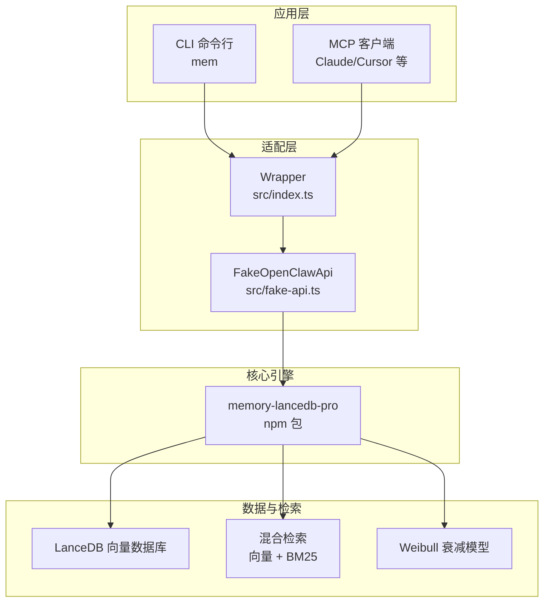
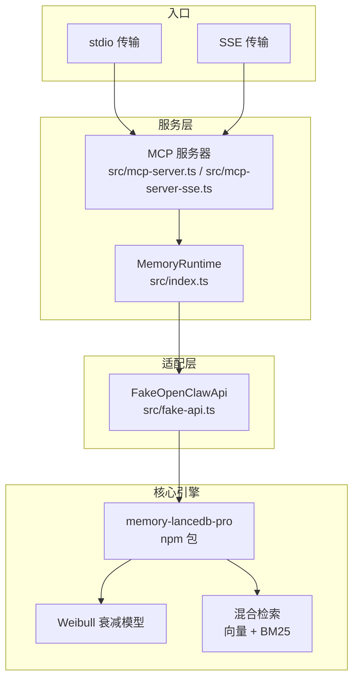
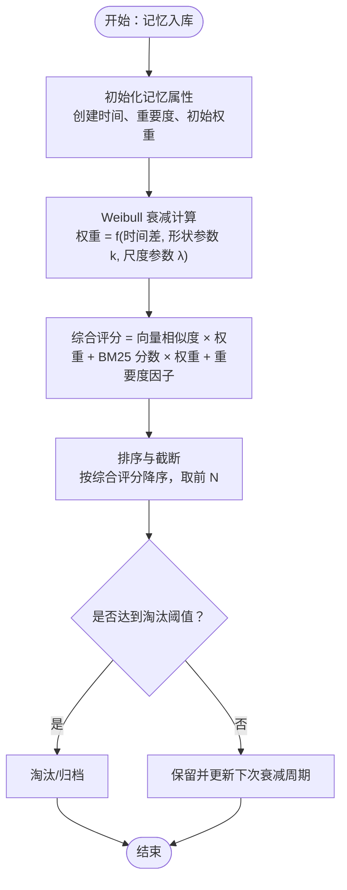
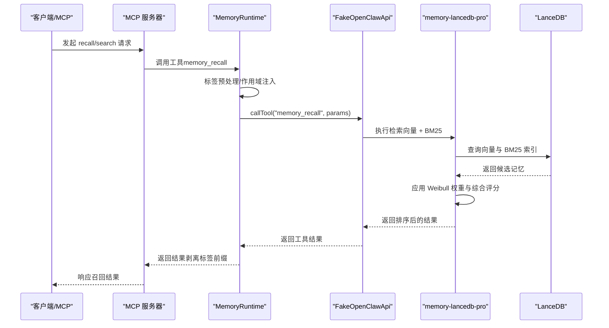
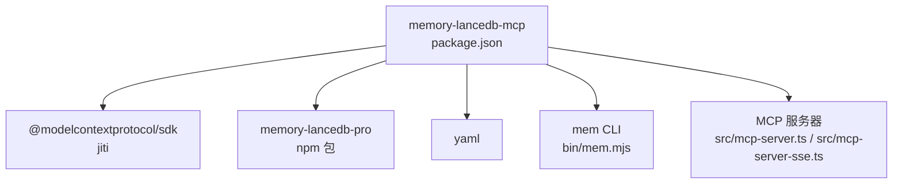

# Weibull 衰减模型

<cite>
**本文引用的文件**
- [README.md](file://README.md)
- [USAGE_GUIDE.md](file://docs/USAGE_GUIDE.md)
- [package.json](file://package.json)
- [src/index.ts](file://src/index.ts)
- [src/config.ts](file://src/config.ts)
- [src/fake-api.ts](file://src/fake-api.ts)
- [src/cli.ts](file://src/cli.ts)
- [src/mcp-server.ts](file://src/mcp-server.ts)
- [src/mcp-server-sse.ts](file://src/mcp-server-sse.ts)
- [bin/mem.mjs](file://bin/mem.mjs)
</cite>

## 目录
1. [简介](#简介)
2. [项目结构](#项目结构)
3. [核心组件](#核心组件)
4. [架构总览](#架构总览)
5. [详细组件分析](#详细组件分析)
6. [依赖分析](#依赖分析)
7. [性能考虑](#性能考虑)
8. [故障排除指南](#故障排除指南)
9. [结论](#结论)
10. [附录](#附录)

## 简介
本文件围绕 Weibull 衰减模型展开，系统阐述其在记忆系统中的数学原理、参数配置、计算公式与影响因素，并解释该模型如何影响记忆的长期保存、检索权重与过期机制。同时，结合项目中向量检索与 BM25 的协同工作机制，给出参数调优指南与性能影响分析，帮助开发者根据具体应用场景选择合适的衰减参数。

## 项目结构
该项目为 memory-lancedb-pro 的 MCP 包装器，通过 FakeOpenClawApi 适配器加载并注册插件工具，提供 CLI 与 MCP 两种接入方式。Weibull 衰减模型的能力由 memory-lancedb-pro 提供，本项目负责配置与调用。

**图表来源**
- [src/index.ts:159-184](file://src/index.ts#L159-L184)
- [src/fake-api.ts:57-90](file://src/fake-api.ts#L57-L90)
- [package.json:30](file://package.json#L30)

**章节来源**
- [README.md:22-45](file://README.md#L22-L45)
- [package.json:30](file://package.json#L30)

## 核心组件
- Weibull 衰减模型：由 memory-lancedb-pro 提供，用于对记忆随时间进行自然衰减，维持长期记忆的新鲜度与相关性。
- 混合检索（向量 + BM25）：提升召回准确性，结合语义与关键词匹配。
- 标签系统：通过文本前缀嵌入标签，实现灵活过滤与排序。
- 生命周期工具：自动召回、自动捕获、会话结束清理等，配合衰减模型实现智能记忆管理。

**章节来源**
- [README.md:41-44](file://README.md#L41-L44)
- [README.md:62-69](file://README.md#L62-L69)
- [USAGE_GUIDE.md:29-40](file://docs/USAGE_GUIDE.md#L29-L40)

## 架构总览
Weibull 衰减模型在整体架构中的位置如下：

**图表来源**
- [src/mcp-server.ts:154-194](file://src/mcp-server.ts#L154-L194)
- [src/mcp-server-sse.ts:336-376](file://src/mcp-server-sse.ts#L336-L376)
- [src/index.ts:207-242](file://src/index.ts#L207-L242)
- [src/fake-api.ts:217-235](file://src/fake-api.ts#L217-L235)

## 详细组件分析

### Weibull 衰减模型的数学原理与实现定位
- Weibull 分布常用于建模“随时间退化的概率”，在记忆系统中可用于为每条记忆分配随时间递减的权重，从而自然地淘汰陈旧信息，保留高价值内容。
- 在本项目中，Weibull 衰减属于 memory-lancedb-pro 的核心能力之一，通过配置项与检索/淘汰流程共同作用，影响记忆的长期保存与召回权重。

由于本仓库未直接包含 Weibull 衰减的源码实现，以下为概念性说明与调参建议，便于开发者结合项目配置进行参数调整。

[此图为概念性流程图，不直接映射到具体源文件，故无图表来源]

**章节来源**
- [README.md:64-66](file://README.md#L64-L66)
- [USAGE_GUIDE.md:29-40](file://docs/USAGE_GUIDE.md#L29-L40)

### 参数配置与影响因素
- 形状参数 k（k > 0）：控制衰减曲线的斜率与“拐点”位置。k 越大，早期衰减越快；k 越小，衰减越平缓。
- 尺度参数 λ（λ > 0）：控制时间尺度，决定达到某一衰减值所需的时间长度。λ 越大，衰减越慢。
- 重要度因子：对高重要度的记忆施加权重修正，使其在较长时间内仍保持较高权重。
- 时间窗口与半衰期：可通过“半衰期”等参数间接表达，影响权重在特定时间点的衰减程度。
- 检索权重与融合：向量相似度与 BM25 分数在衰减后的权重基础上进行加权融合，最终决定召回顺序。

调参建议（概念性）：
- 对“短期高频变化”的领域（如临时任务、近期会议），选择较小的 λ 与较大的 k，以快速淘汰过时信息。
- 对“长期稳定知识”（如技术栈、团队规范），选择较大的 λ 与较小的 k，以延长保留时间。
- 重要度高的记忆可设置更高的初始权重或更低的衰减速率，避免被自然淘汰。

[本节为概念性说明，不直接引用具体源文件]

### 计算公式与权重更新
- 权重更新：权重 = exp(-(t/λ)^k)，其中 t 为自创建以来的时间，k 为形状参数，λ 为尺度参数。
- 综合评分：综合评分 = α × 向量相似度 + β × BM25 分数 + γ × 重要度 × 权重修正。
- 截断与淘汰：按综合评分排序后，低于阈值的记忆进入淘汰或归档流程。

[本节为概念性说明，不直接引用具体源文件]

### 对记忆长期保存、检索权重与过期机制的影响
- 长期保存：通过 Weibull 衰减，系统能够自动识别并保留高价值、低变化的知识，抑制噪声与过时信息。
- 检索权重：衰减后的权重参与综合评分，使近期且高价值的记忆在召回中占据更高优先级。
- 过期机制：结合淘汰阈值与评分排序，系统定期清理低价值记忆，释放存储与检索资源。

[本节为概念性说明，不直接引用具体源文件]

### 与向量检索、BM25 的协同工作机制
- 混合检索：向量检索捕捉语义相似性，BM25 捕捉关键词匹配，两者分别计算分数后与 Weibull 权重融合，得到最终排序。
- 标签系统：通过文本前缀嵌入标签，BM25 可直接命中标签关键词，实现高效过滤；随后再进行 Weibull 权重衰减与排序。
- 生命周期工具：自动召回与自动捕获在 prompt 构建前注入上下文，自动捕获在会话结束后提取关键信息，二者均受益于 Weibull 衰减提供的“新鲜记忆”。

**图表来源**
- [src/index.ts:313-335](file://src/index.ts#L313-L335)
- [src/index.ts:387-452](file://src/index.ts#L387-L452)
- [src/fake-api.ts:217-235](file://src/fake-api.ts#L217-L235)
- [src/cli.ts:246-273](file://src/cli.ts#L246-L273)

**章节来源**
- [USAGE_GUIDE.md:35-38](file://docs/USAGE_GUIDE.md#L35-L38)
- [USAGE_GUIDE.md:198-200](file://docs/USAGE_GUIDE.md#L198-L200)

### 参数调优指南与性能影响分析
- 形状参数 k 与尺度参数 λ：
  - k 增大：早期衰减更快，适合短期任务；但可能导致重要但变化慢的知识过早被淘汰。
  - λ 增大：整体衰减变慢，适合长期知识；但可能增加检索负担与噪声。
- 重要度因子：
  - 提高重要度可延缓淘汰，但需平衡与普通记忆的权重差异，避免“重要度通胀”。
- 检索权重与融合系数：
  - 向量权重与 BM25 权重的平衡影响召回准确性与稳定性；结合 Weibull 权重后，需确保三者协同。
- 性能影响：
  - 更大的 k/更小的 λ 会加速淘汰，减少候选集规模，提高检索速度。
  - 更小的 k/更大的 λ 会保留更多候选，提升召回覆盖率，但可能增加排序与存储成本。
- 标签过滤：
  - 使用标签前缀可显著缩小候选集，降低向量与 BM25 的计算压力，提升整体性能。

[本节为概念性说明，不直接引用具体源文件]

## 依赖分析
- 项目依赖 memory-lancedb-pro（npm 包）提供核心能力，包括 Weibull 衰减、混合检索与智能提取。
- jiti 用于在运行时直接加载 npm 包的 TypeScript 源文件，无需本地构建。
- CLI 与 MCP 服务器通过 FakeOpenClawApi 适配器与插件交互。

**图表来源**
- [package.json:26-31](file://package.json#L26-L31)
- [src/index.ts:159-184](file://src/index.ts#L159-L184)
- [bin/mem.mjs:1-8](file://bin/mem.mjs#L1-L8)

**章节来源**
- [package.json:26-31](file://package.json#L26-L31)
- [src/index.ts:159-184](file://src/index.ts#L159-L184)

## 性能考虑
- 向量检索与 BM25 的融合排序在候选集较大时会增加计算开销，建议通过标签过滤与合理的 k/λ 参数控制候选规模。
- Weibull 衰减可作为“预筛选”手段，减少无效召回，提升整体响应速度。
- 对高频短期任务，适当增大 k 与减小 λ，可降低存储与排序成本；对长期稳定知识，适当减小 k 与增大 λ，提升召回覆盖率。

[本节为一般性指导，不直接引用具体源文件]

## 故障排除指南
- 配置文件缺失或解析失败：检查配置路径与 YAML 格式，确保 embedding.apiKey 等关键字段存在。
- 插件加载失败：确认 memory-lancedb-pro 已正确安装，且版本兼容。
- 标签非法字符：标签仅允许特定字符，非法字符会触发错误，需修正标签内容。
- 作用域不匹配：在锁定 scope 模式下，请求的目标 scope 与服务端 scope 不一致会导致拒绝。

**章节来源**
- [src/config.ts:167-214](file://src/config.ts#L167-L214)
- [src/index.ts:351-367](file://src/index.ts#L351-L367)
- [src/index.ts:41-52](file://src/index.ts#L41-L52)

## 结论
Weibull 衰减模型为记忆系统的长期保存与检索权重提供了自然的时间感知机制。通过与向量检索、BM25 的协同，以及标签过滤与生命周期工具的配合，系统能够在不同应用场景中实现高效、稳定且可持续的记忆管理。开发者可根据业务特性调整 k/λ 等参数，结合重要度因子与检索权重，达到最佳的召回质量与性能平衡。

[本节为总结性内容，不直接引用具体源文件]

## 附录
- 使用手册与 CLI 参考：详见 docs/USAGE_GUIDE.md，涵盖命令、参数与最佳实践。
- 架构概览与核心能力：详见 README.md，了解 Weibull 衰减、混合检索与标签系统的作用。

**章节来源**
- [USAGE_GUIDE.md:1-200](file://docs/USAGE_GUIDE.md#L1-L200)
- [README.md:1-738](file://README.md#L1-L738)