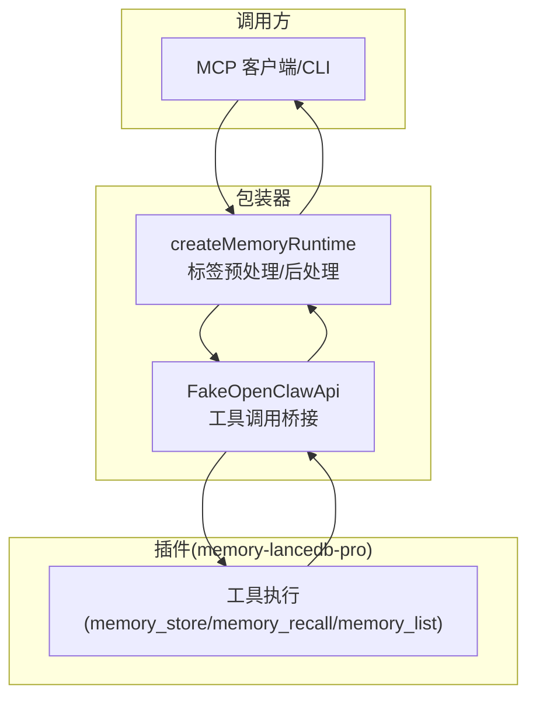
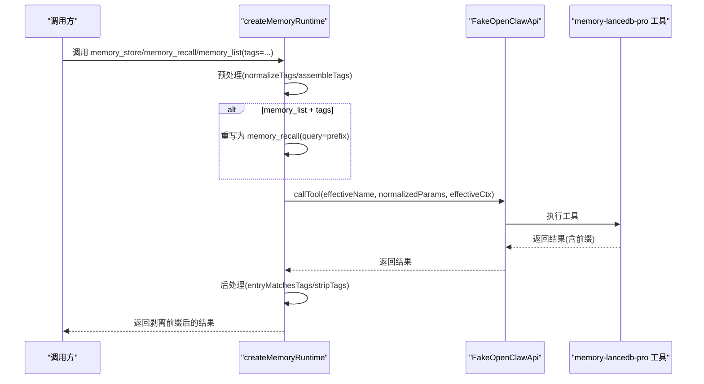
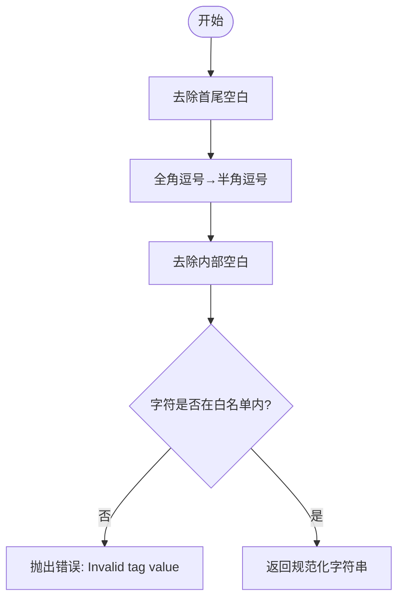
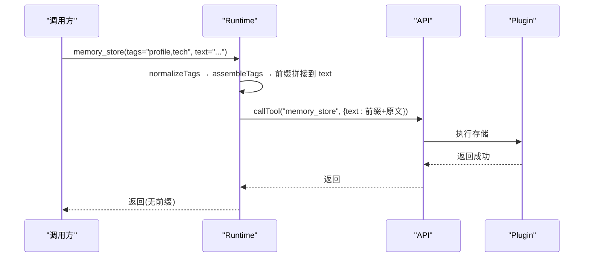
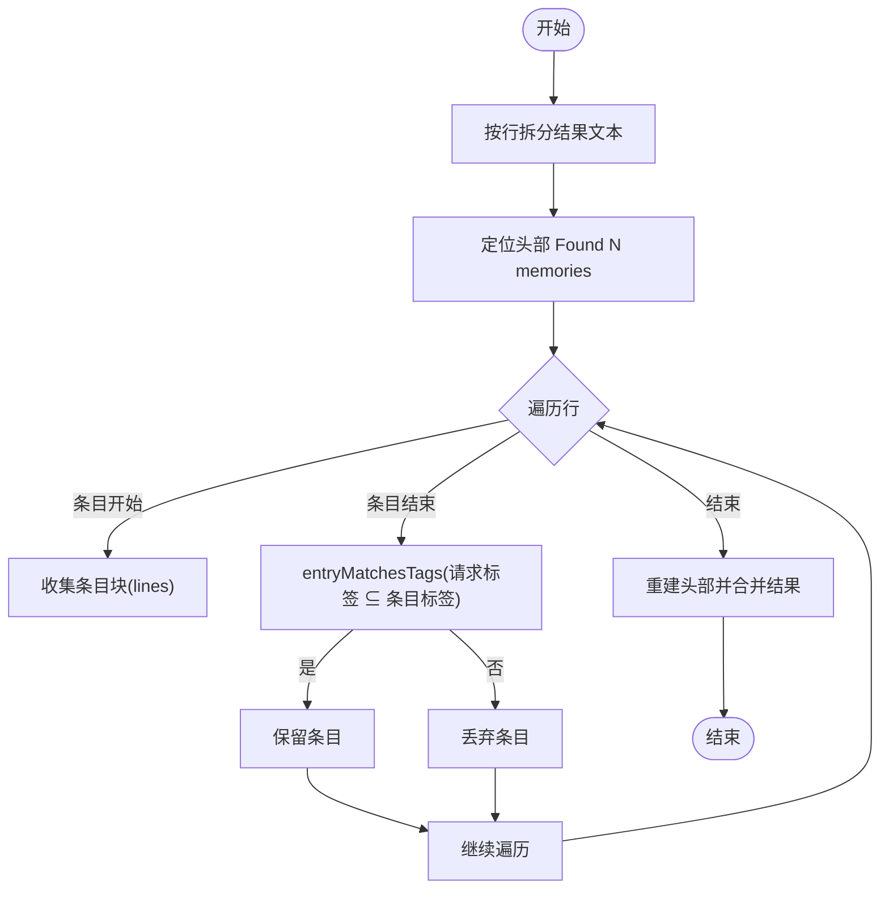
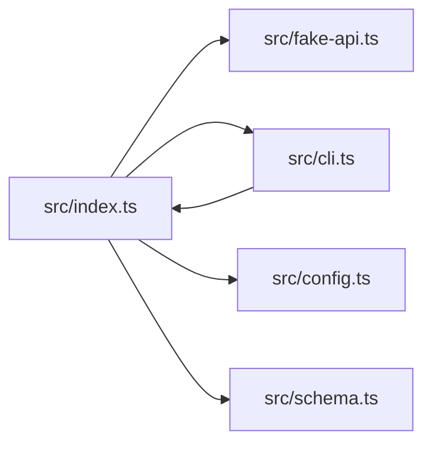

# 标签系统

<cite>
**本文引用的文件**
- [src/index.ts](file://src/index.ts)
- [src/cli.ts](file://src/cli.ts)
- [src/fake-api.ts](file://src/fake-api.ts)
- [src/config.ts](file://src/config.ts)
- [src/schema.ts](file://src/schema.ts)
- [README.md](file://README.md)
- [docs/USAGE_GUIDE.md](file://docs/USAGE_GUIDE.md)
- [package.json](file://package.json)
</cite>

## 目录
1. [简介](#简介)
2. [项目结构](#项目结构)
3. [核心组件](#核心组件)
4. [架构总览](#架构总览)
5. [详细组件分析](#详细组件分析)
6. [依赖分析](#依赖分析)
7. [性能考量](#性能考量)
8. [故障排除指南](#故障排除指南)
9. [结论](#结论)
10. [附录](#附录)

## 简介
本文件面向开发者，系统化阐述标签系统的设计理念、实现原理与最佳实践。标签系统通过“文本前缀嵌入”的方式，将多标签信息以非侵入的方式融入记忆存储与检索流程，既不修改父项目的 TypeBox schema，又能在检索阶段通过 BM25 精确命中标签前缀，实现语义过滤与内容组织的双重目标。本文涵盖：
- 标签规范化与白名单校验
- 标签前缀嵌入与剥离
- 标签检索策略与匹配算法
- 参数注入、后处理与硬过滤机制
- 安全与字符限制
- 最佳实践、命名规范与管理策略

## 项目结构
标签系统位于主包装器入口文件中，围绕三个关键流程展开：
- 参数预处理：将用户传入的 tags 参数转换为文本前缀，并注入到 memory_store/memory_recall/memory_list 的请求中
- 标签匹配：在检索结果中识别并硬过滤包含目标标签的条目
- 展示剥离：在返回给调用方前，自动剥离标签前缀，保证用户体验

图表来源
- [src/index.ts:313-453](file://src/index.ts#L313-L453)
- [src/fake-api.ts:217-235](file://src/fake-api.ts#L217-L235)

章节来源
- [src/index.ts:18-93](file://src/index.ts#L18-L93)
- [src/cli.ts:57-62](file://src/cli.ts#L57-L62)

## 核心组件
- 标签规范化与白名单校验：统一去除空白、半角/全角逗号转换、严格字符白名单校验，非法字符直接抛错
- 标签前缀组装与剥离：将规范化后的标签组装为固定格式的文本前缀；检索后自动剥离
- 标签匹配算法：对检索结果条目进行逐条匹配，支持“请求标签集合”在“条目标签集合”上的包含关系
- 参数注入与重写：将 tags 注入到 text/query 中；当 list+tags 时重写为 recall(query=prefix)
- 后处理硬过滤：对 recall/list 结果进行二次硬过滤，补偿 BM25 的软过滤特性

章节来源
- [src/index.ts:33-82](file://src/index.ts#L33-L82)
- [src/index.ts:313-453](file://src/index.ts#L313-L453)

## 架构总览
标签系统在调用链中的位置如下：

图表来源
- [src/index.ts:313-453](file://src/index.ts#L313-L453)
- [src/fake-api.ts:217-235](file://src/fake-api.ts#L217-L235)

## 详细组件分析

### 标签规范化与白名单校验
- 规范化步骤
  - 去除首尾空白
  - 全角逗号转半角逗号
  - 去除内部空白
  - 严格字符白名单校验，非法字符直接抛错
- 白名单字符
  - 字母、数字
  - 下划线(_)、连字符(-)、冒号(:)、斜杠(/)、点(.)
  - CJK 中文字符（\u4e00-\u9fff）
  - 逗号(,)作为分隔符
- 禁止字符
  - “【”、“】”（前缀语法边界，禁止出现在标签名中）
  - 空格、emoji、其他标点

图表来源
- [src/index.ts:33-52](file://src/index.ts#L33-L52)

章节来源
- [src/index.ts:33-52](file://src/index.ts#L33-L52)
- [README.md:663-671](file://README.md#L663-L671)
- [docs/USAGE_GUIDE.md:411-419](file://docs/USAGE_GUIDE.md#L411-L419)

### 标签前缀嵌入与剥离
- 嵌入
  - 将规范化后的标签组装为固定格式的文本前缀，注入到 memory_store 的 text 或 memory_recall 的 query
  - 当 list+tags 时，重写为 recall(query=prefix)，确保 BM25 能命中前缀
- 剥离
  - 在返回给调用方前，自动剥离前缀，保证展示干净文本

图表来源
- [src/index.ts:313-335](file://src/index.ts#L313-L335)
- [src/index.ts:389-450](file://src/index.ts#L389-L450)

章节来源
- [src/index.ts:55-64](file://src/index.ts#L55-L64)
- [src/index.ts:313-335](file://src/index.ts#L313-L335)
- [src/index.ts:389-450](file://src/index.ts#L389-L450)

### 标签检索策略与匹配算法
- 检索策略
  - 通过 BM25 对 query 中的标签前缀进行精确命中，实现语义过滤
  - 由于使用全角中文符号“【】”作为边界，误匹配概率极低
- 匹配算法
  - 对每个检索条目，提取其标签集合
  - 判断请求标签集合是否为条目标签集合的子集（支持子集匹配）
  - 若满足则保留，否则丢弃
- 硬过滤补偿
  - 由于 BM25 为软过滤，返回结果中仍可能包含不匹配条目
  - 包装器在后处理阶段进行硬过滤，确保最终结果严格符合请求标签

图表来源
- [src/index.ts:389-450](file://src/index.ts#L389-L450)
- [src/index.ts:66-82](file://src/index.ts#L66-L82)

章节来源
- [src/index.ts:66-82](file://src/index.ts#L66-L82)
- [src/index.ts:389-450](file://src/index.ts#L389-L450)
- [docs/USAGE_GUIDE.md:382-389](file://docs/USAGE_GUIDE.md#L382-L389)

### 参数注入、后处理与匹配算法的技术细节
- 参数注入
  - 仅对 memory_store/memory_recall/memory_list 生效
  - 将 tags 从参数中移除，组装前缀并注入到 text 或 query
  - list+tags 重写为 recall(query=prefix)，并丢弃 offset（recall 不支持）
- 后处理
  - 硬过滤：仅保留包含请求标签集合的条目
  - 剥离：对返回文本中的标签前缀进行剥离
  - 重写头部：根据保留条目数量重写“Found N memories”头部
- 匹配算法
  - 将请求 tags 拆分为标签令牌集合
  - 对每个条目，提取其标签令牌集合
  - 判断请求令牌集合是否全部存在于条目标签令牌集合中

章节来源
- [src/index.ts:84-93](file://src/index.ts#L84-L93)
- [src/index.ts:313-335](file://src/index.ts#L313-L335)
- [src/index.ts:389-450](file://src/index.ts#L389-L450)
- [src/index.ts:66-82](file://src/index.ts#L66-L82)

### 标签白名单机制、字符限制与安全考虑
- 白名单机制
  - 严格的字符白名单，禁止使用“【”、“】”等前缀边界字符
  - 禁止空格、emoji、其他标点，避免误匹配与前缀结构破坏
- 字符限制
  - 标签名仅允许字母、数字、下划线、连字符、冒号、斜杠、点、CJK 中文字符
  - 逗号用于分隔多个标签
- 安全考虑
  - 非法字符直接抛错，不静默入库，避免破坏前缀结构导致检索/剥离异常
  - 前缀采用全角中文符号“【】”，降低误匹配风险
  - 包装器在返回前剥离前缀，防止标签前缀泄露到用户可见内容

章节来源
- [src/index.ts:18-31](file://src/index.ts#L18-L31)
- [src/index.ts:33-52](file://src/index.ts#L33-L52)
- [README.md:663-671](file://README.md#L663-L671)
- [docs/USAGE_GUIDE.md:411-419](file://docs/USAGE_GUIDE.md#L411-L419)

### 标签使用的最佳实践、命名规范与管理策略
- 命名规范
  - 使用字母、数字、下划线、连字符、冒号、斜杠、点、CJK 中文字符
  - 使用逗号分隔多个标签
  - 明确禁止使用“【”、“】”、空格、emoji、其他标点
- 最佳实践
  - 标签用于语义过滤与内容组织，建议结合 category 与 scope 使用
  - 在存储时一次性提供完整标签，避免后续频繁更新
  - 在检索时使用“实体名 + 技术术语”的 query，提高召回准确性
- 管理策略
  - 使用 CLI 的 list/search/stats 等工具进行标签过滤与统计
  - 通过 scope 实现多项目隔离，避免标签冲突
  - 定期使用 doctor 命令进行健康检查，确保配置与 API Key 正确

章节来源
- [docs/USAGE_GUIDE.md:299-314](file://docs/USAGE_GUIDE.md#L299-L314)
- [docs/USAGE_GUIDE.md:392-421](file://docs/USAGE_GUIDE.md#L392-L421)
- [README.md:639-671](file://README.md#L639-L671)

## 依赖分析
标签系统与以下模块存在直接依赖关系：
- createMemoryRuntime：封装标签预处理、重写与后处理逻辑
- FakeOpenClawApi：提供工具调用桥接，承载标签注入后的请求转发
- CLI：提供 list/search 等命令，其中 list 命令在 --tags 时重写为 recall

图表来源
- [src/index.ts:10-11](file://src/index.ts#L10-L11)
- [src/cli.ts:20-21](file://src/cli.ts#L20-L21)

章节来源
- [src/index.ts:10-11](file://src/index.ts#L10-L11)
- [src/cli.ts:20-21](file://src/cli.ts#L20-L21)

## 性能考量
- 前缀嵌入不引入额外索引字段，减少元数据开销
- BM25 对标签前缀的精确命中，避免全表扫描
- 硬过滤在内存中进行，对小规模结果集影响有限
- 建议合理控制标签数量与长度，避免 query 过长影响检索效率

## 故障排除指南
- 标签非法字符错误
  - 现象：传入包含“【”、“】”、空格、emoji 等字符时报错
  - 处理：修正标签字符，遵循白名单规范
- 列表过滤无效
  - 现象：memory_list --tags 未按预期过滤
  - 处理：确认 CLI 已将 list+tags 重写为 recall(query=prefix)
- 前缀残留
  - 现象：返回结果中仍有标签前缀
  - 处理：确认后处理阶段已剥离前缀
- 配置与 API Key
  - 现象：服务启动失败或检索异常
  - 处理：使用 doctor 命令检查配置与 API Key

章节来源
- [src/index.ts:33-52](file://src/index.ts#L33-L52)
- [src/cli.ts:199-214](file://src/cli.ts#L199-L214)
- [src/index.ts:389-450](file://src/index.ts#L389-L450)
- [docs/USAGE_GUIDE.md:618-666](file://docs/USAGE_GUIDE.md#L618-L666)

## 结论
标签系统通过“文本前缀嵌入 + BM25 精确命中 + 硬过滤剥离”的组合，实现了低成本、高精度的语义过滤与内容组织。其设计强调安全性（白名单校验）、可维护性（非侵入 schema）、可扩展性（支持多标签与子集匹配），并提供了完善的 CLI 与 MCP 工具支持。遵循本文的最佳实践与命名规范，可有效提升检索质量与系统稳定性。

## 附录
- 相关工具与命令
  - mem store/list/search/stats/scope/config/doctor
- 相关配置
  - embedding、retrieval、scopes 等配置项

章节来源
- [src/cli.ts:105-617](file://src/cli.ts#L105-L617)
- [src/config.ts:23-98](file://src/config.ts#L23-L98)
- [package.json:10-46](file://package.json#L10-L46)