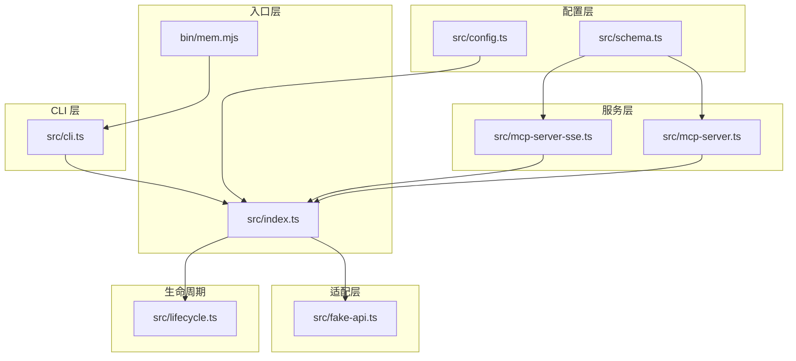
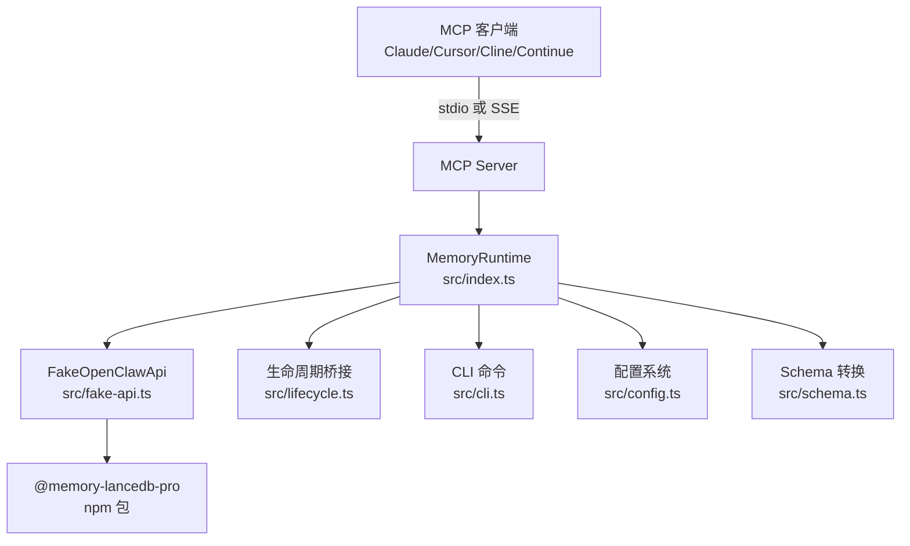
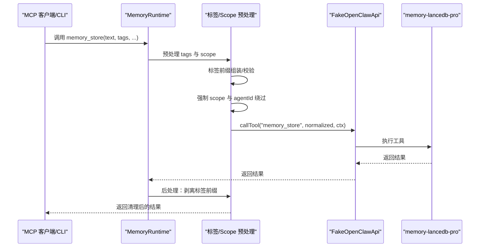
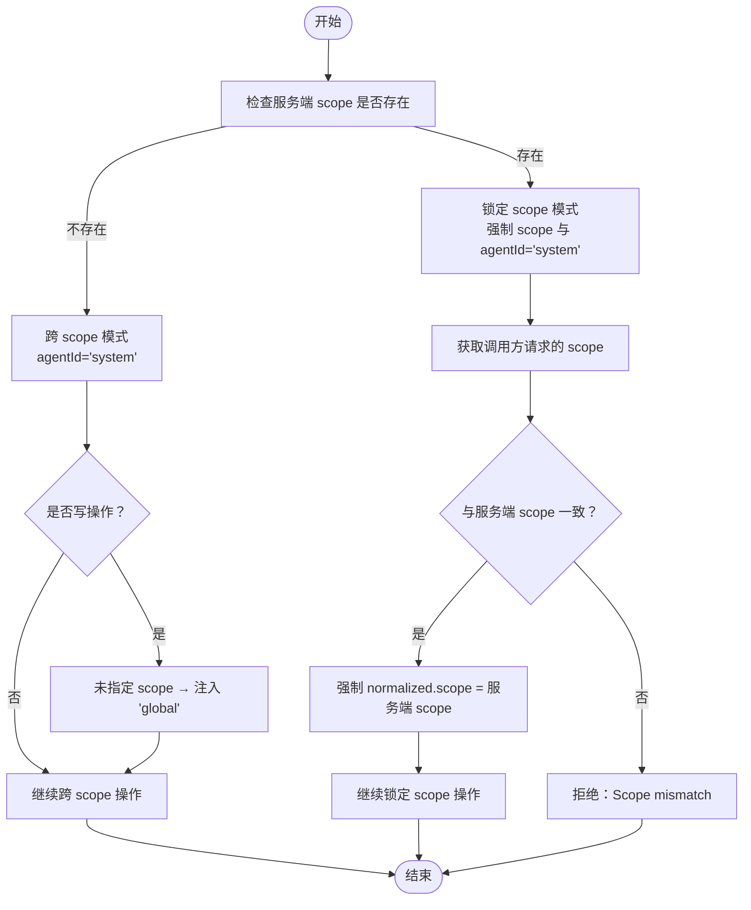
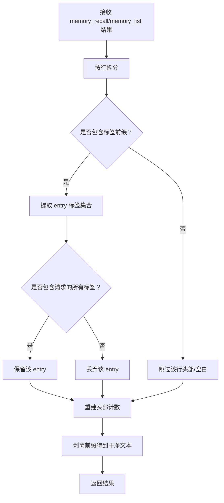
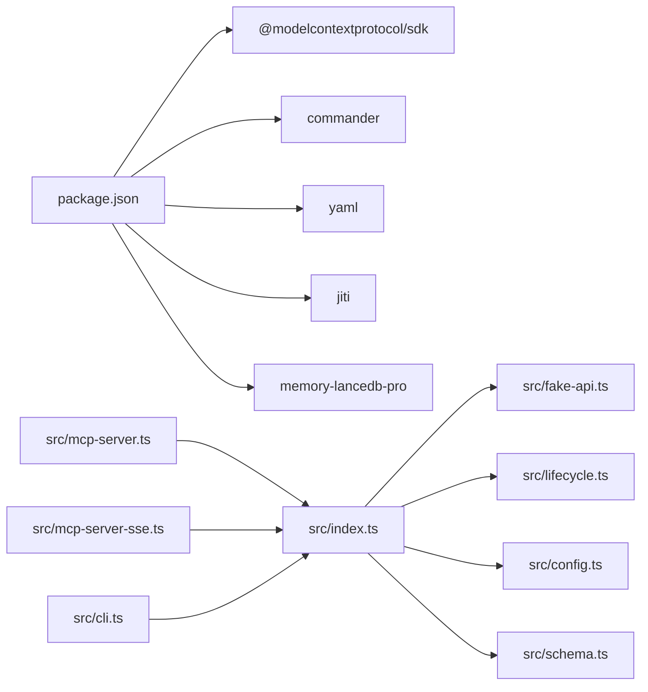

# 核心概念

<cite>
**本文引用的文件**
- [README.md](file://README.md)
- [docs/USAGE_GUIDE.md](file://docs/USAGE_GUIDE.md)
- [package.json](file://package.json)
- [src/index.ts](file://src/index.ts)
- [src/fake-api.ts](file://src/fake-api.ts)
- [src/mcp-server.ts](file://src/mcp-server.ts)
- [src/mcp-server-sse.ts](file://src/mcp-server-sse.ts)
- [src/cli.ts](file://src/cli.ts)
- [src/config.ts](file://src/config.ts)
- [src/schema.ts](file://src/schema.ts)
- [src/lifecycle.ts](file://src/lifecycle.ts)
- [bin/mem.mjs](file://bin/mem.mjs)
</cite>

## 目录
1. [简介](#简介)
2. [项目结构](#项目结构)
3. [核心组件](#核心组件)
4. [架构总览](#架构总览)
5. [详细组件解析](#详细组件解析)
6. [依赖关系分析](#依赖关系分析)
7. [性能考量](#性能考量)
8. [故障排查指南](#故障排查指南)
9. [结论](#结论)
10. [附录](#附录)

## 简介
本项目为 memory-lancedb-pro 的 MCP（Model Context Protocol）桥接包装器，提供零侵入地将 LanceDB 向量记忆引擎接入 MCP 生态的能力。核心特性包括：
- 17 个记忆工具（recall、store、forget、update、stats、list、debug、promote、archive、compact、explain_rank、self-improvement 等）
- 多项目 Scope 隔离与 ACL 访问控制
- 双传输模式：stdio（本地 MCP 客户端）与 SSE（HTTP，远程/多客户端）
- 标签系统：通过文本前缀嵌入实现“软过滤”检索
- 混合检索：向量 + BM25，支持 Weibull 衰减与智能提取
- 零配置默认可用，高级选项全部 YAML 化

## 项目结构
该项目采用“入口层 + 适配层 + 服务层 + CLI 层”的分层组织：
- 入口层：bin/mem.mjs、src/index.ts
- 适配层：src/fake-api.ts（模拟 OpenClaw 运行时接口）
- 服务层：src/mcp-server.ts（stdio）、src/mcp-server-sse.ts（SSE）
- CLI 层：src/cli.ts（mem 命令）
- 配置层：src/config.ts（YAML 配置加载与映射）
- 模式转换：src/schema.ts（TypeBox → JSON Schema）
- 生命周期桥接：src/lifecycle.ts（before_prompt_build、agent_end 等）

图表来源
- [bin/mem.mjs:1-8](file://bin/mem.mjs#L1-L8)
- [src/index.ts:1-515](file://src/index.ts#L1-L515)
- [src/fake-api.ts:1-318](file://src/fake-api.ts#L1-L318)
- [src/mcp-server.ts:1-306](file://src/mcp-server.ts#L1-L306)
- [src/mcp-server-sse.ts:1-405](file://src/mcp-server-sse.ts#L1-L405)
- [src/cli.ts:1-617](file://src/cli.ts#L1-L617)
- [src/config.ts:1-312](file://src/config.ts#L1-L312)
- [src/schema.ts:1-151](file://src/schema.ts#L1-L151)
- [src/lifecycle.ts:1-178](file://src/lifecycle.ts#L1-L178)

章节来源
- [README.md:22-45](file://README.md#L22-L45)
- [package.json:1-46](file://package.json#L1-L46)

## 核心组件
- FakeOpenClawApi：实现最小化的 OpenClaw 插件运行时接口，捕获工具工厂、事件处理器、钩子与 CLI 实例，供 MCP 服务层使用。
- MemoryRuntime：封装 createMemoryRuntime 工厂函数，负责加载配置、注册 FakeOpenClawApi、加载 memory-lancedb-pro 插件、注入标签与 Scope 预处理/后处理逻辑、暴露工具调用、事件发射、钩子触发与 CLI 实例。
- MCP Server（stdio/SSE）：基于 @modelcontextprotocol/sdk，将 MemoryRuntime 暴露为 MCP 工具与生命周期事件，支持 stdio 与 SSE 两种传输。
- CLI（mem）：提供 serve、store、search、list、stats、scope、config、doctor 等命令，统一跨 scope 模式与锁定 scope 模式的工具行为。
- 配置系统：YAML 配置文件加载、环境变量展开、pluginConfig 映射。
- 模式转换：TypeBox Schema → JSON Schema，满足 MCP 协议要求。
- 生命周期桥接：triggerAutoRecall、triggerAutoCapture、triggerSessionEnd、triggerMessageReceived，将 OpenClaw 生命周期事件映射为 MCP 可调用工具。

章节来源
- [src/fake-api.ts:57-318](file://src/fake-api.ts#L57-L318)
- [src/index.ts:207-498](file://src/index.ts#L207-L498)
- [src/mcp-server.ts:43-140](file://src/mcp-server.ts#L43-L140)
- [src/mcp-server-sse.ts:57-209](file://src/mcp-server-sse.ts#L57-L209)
- [src/cli.ts:105-617](file://src/cli.ts#L105-L617)
- [src/config.ts:167-223](file://src/config.ts#L167-L223)
- [src/schema.ts:45-150](file://src/schema.ts#L45-L150)
- [src/lifecycle.ts:52-178](file://src/lifecycle.ts#L52-L178)

## 架构总览
整体架构围绕“MCP Server + FakeOpenClawApi + memory-lancedb-pro 插件”展开。Wrapper 通过 jiti 直接从 npm 包加载插件源码，零修改接入。MCP Server 既支持本地 stdio，也支持远程 SSE。CLI 与 MCP Server 共享同一 MemoryRuntime，确保行为一致。

图表来源
- [README.md:24-44](file://README.md#L24-L44)
- [src/index.ts:159-184](file://src/index.ts#L159-L184)
- [src/mcp-server.ts:55-58](file://src/mcp-server.ts#L55-L58)
- [src/mcp-server-sse.ts:11-16](file://src/mcp-server-sse.ts#L11-L16)
- [src/fake-api.ts:113-127](file://src/fake-api.ts#L113-L127)

## 详细组件解析

### Model Context Protocol（MCP）协议与在项目中的应用
- 协议能力：MCP Server 暴露 tools/list 与 tools/call，支持生命周期工具（_lifecycle_auto_recall、_lifecycle_auto_capture、_lifecycle_session_end）。
- 传输模式：stdio（默认，本地 MCP 客户端）与 SSE（HTTP，远程/多客户端）。SSE 通过 /sse 与 /message 端点实现。
- 工具定义：MemoryRuntime.listTools() 将插件工具与自定义 list_scopes 合并，并注入 tags 参数到 tag-aware 工具。
- 生命周期桥接：MCP 客户端可主动触发 before_prompt_build 与 agent_end，Wrapper 通过 FakeOpenClawApi.emitEvent 触发插件侧事件，实现自动召回与自动捕获。

章节来源
- [src/mcp-server.ts:61-77](file://src/mcp-server.ts#L61-L77)
- [src/mcp-server.ts:86-124](file://src/mcp-server.ts#L86-L124)
- [src/mcp-server-sse.ts:246-287](file://src/mcp-server-sse.ts#L246-L287)
- [src/index.ts:455-495](file://src/index.ts#L455-L495)
- [src/lifecycle.ts:52-178](file://src/lifecycle.ts#L52-L178)

### OpenClaw 运行时环境与 FakeOpenClawApi 适配器
- 适配器职责：FakeOpenClawApi 实现 registerTool、on、registerHook、registerCli 等接口，捕获工具工厂与事件钩子，供 MCP Server 使用。
- 运行时属性：提供 runtime、config 等只读属性，便于兼容性。
- 日志与路径：提供 logger 与 resolvePath，支持 ~ 与相对路径解析。
- 事件系统：emitEvent 按优先级排序执行事件处理器，返回非 undefined 的结果集合；registerHook 注册钩子处理器。

章节来源
- [src/fake-api.ts:57-318](file://src/fake-api.ts#L57-L318)

### LanceDB 向量存储与混合检索（向量 + BM25）
- 混合检索：配置中 retrieval.mode=hybrid，默认向量权重 0.7、BM25 权重 0.3，支持 minScore、hardMinScore、filterNoise 等参数。
- Weibull 衰减：通过 recencyHalfLifeDays、timeDecayHalfLifeDays 等参数控制时间衰减，结合智能提取与治理系统维持记忆新鲜度。
- 检索链路：MCP 工具调用经 MemoryRuntime 预处理（标签前缀注入、Scope 强制与 ACL 绕过），最终由插件执行 hybrid 检索与重排。

章节来源
- [src/config.ts:268-280](file://src/config.ts#L268-L280)
- [src/config.ts:70-77](file://src/config.ts#L70-L77)
- [src/index.ts:313-335](file://src/index.ts#L313-L335)

### Scope 隔离机制与 ACL 访问控制
- 两种运行模式：
  - 跨 scope 模式：默认，agentId="system"，可读写任意 scope；memory_store 不指定 scope 自动写入 global。
  - 锁定 scope 模式：--scope X，所有操作强制锁定在 X；调用者指定 scope 与服务端不一致时直接拒绝。
- ACL 绕过：Wrapper 使用 agentId="system" 绕过 isSystemBypassId("system") 的 ACL 检查，确保服务端 scope 值被强制应用。
- list_scopes：通过 memory_stats.scopeCounts 合并配置定义与实际存在的 scope，返回结构化列表。

章节来源
- [src/index.ts:207-242](file://src/index.ts#L207-L242)
- [src/index.ts:244-311](file://src/index.ts#L244-L311)
- [src/index.ts:337-385](file://src/index.ts#L337-L385)
- [src/mcp-server.ts:84-85](file://src/mcp-server.ts#L84-L85)
- [README.md:426-498](file://README.md#L426-L498)

### 标签系统：前缀嵌入与检索策略
- 前缀嵌入：tags 以“【标签:x,y】”前缀嵌入 text，不修改父项目 TypeBox schema。
- 检索策略：BM25 自然命中标签前缀，无需额外索引；wrapper 在返回时剥离前缀，保证展示干净文本。
- 软过滤：tags 参数为软过滤（加权而非硬排除），memory_list 通过重写为 memory_recall 实现标签过滤。
- 命名约束：仅允许字母、数字、_、-、:、/、.、CJK，禁止使用“【”、“】”，非法字符即时拒绝。

章节来源
- [src/index.ts:18-52](file://src/index.ts#L18-L52)
- [src/index.ts:313-335](file://src/index.ts#L313-L335)
- [src/index.ts:389-450](file://src/index.ts#L389-L450)
- [docs/USAGE_GUIDE.md:392-421](file://docs/USAGE_GUIDE.md#L392-L421)

### Weibull 衰减模型与智能提取
- Weibull 衰减：通过 recencyHalfLifeDays、timeDecayHalfLifeDays 控制记忆随时间衰减的速度，结合智能提取与治理系统，实现长期记忆的自然更新。
- 智能提取：smartExtraction 开关与相关参数控制 LLM 驱动的记忆抽取与分类，支持自动捕获与后台处理。

章节来源
- [src/config.ts:70-77](file://src/config.ts#L70-L77)
- [src/config.ts:52-56](file://src/config.ts#L52-L56)
- [src/lifecycle.ts:109-128](file://src/lifecycle.ts#L109-L128)

### 工具调用与预/后处理流程（内存存储）

图表来源
- [src/index.ts:313-335](file://src/index.ts#L313-L335)
- [src/index.ts:389-450](file://src/index.ts#L389-L450)
- [src/fake-api.ts:217-235](file://src/fake-api.ts#L217-L235)

### Scope 隔离与 ACL 拒绝流程

图表来源
- [src/index.ts:337-385](file://src/index.ts#L337-L385)
- [README.md:471-478](file://README.md#L471-L478)

### 标签过滤与结果剥离流程

图表来源
- [src/index.ts:389-450](file://src/index.ts#L389-L450)

## 依赖关系分析
- 依赖关系概览：
  - @modelcontextprotocol/sdk：MCP 协议实现与传输层（stdio/SSE）
  - memory-lancedb-pro：核心记忆引擎（通过 jiti 直接加载 npm 源码）
  - commander：CLI 命令行框架
  - yaml：YAML 配置解析
  - jiti：TypeScript 源码动态加载
- 关键耦合点：
  - MemoryRuntime 依赖 FakeOpenClawApi 与插件 register() 接口
  - MCP Server 依赖 MemoryRuntime.listTools()/callTool()
  - CLI 与 MCP Server 共享 MemoryRuntime，确保行为一致
  - Schema 转换层将 TypeBox schema 转为 JSON Schema

图表来源
- [package.json:26-31](file://package.json#L26-L31)
- [src/index.ts:9-12](file://src/index.ts#L9-L12)
- [src/mcp-server.ts:8-15](file://src/mcp-server.ts#L8-L15)
- [src/mcp-server-sse.ts:11-23](file://src/mcp-server-sse.ts#L11-L23)
- [src/cli.ts:17-27](file://src/cli.ts#L17-L27)

章节来源
- [package.json:26-31](file://package.json#L26-L31)
- [src/index.ts:9-12](file://src/index.ts#L9-L12)

## 性能考量
- 混合检索权重：向量权重 0.7、BM25 权重 0.3，结合 minScore 与 hardMinScore 过滤噪声，减少无效召回。
- 时间衰减：recencyHalfLifeDays 与 timeDecayHalfLifeDays 控制记忆新鲜度，避免过时信息主导检索。
- 智能提取：smartExtraction 降低重复与冗余记忆，提高检索效率。
- SSE 模式：适合远程/多客户端场景，注意跨 scope 模式下 agentId="system" 的可见性与安全性。

## 故障排查指南
- 配置文件缺失或解析失败：使用 mem doctor 与 mem config validate 检查配置路径、API Key、模型与端点。
- API Key 问题：确认环境变量或 YAML 中 embedding.apiKey 设置正确。
- 插件加载失败：确保已安装 memory-lancedb-pro@beta，且 jiti 能正确加载 npm 源码。
- Scope 权限拒绝：检查服务端 --scope 与请求 scope 是否一致；跨 scope 模式下 memory_store 默认写入 global。
- 标签白名单校验：normalizeTags 校验在重新编译后生效，需重启 MCP 服务；CLI 直接调用即时生效。
- SSE 安全：跨 scope 模式下 host 未受信任网络保护时，建议使用 --scope 锁定或反向代理加固。

章节来源
- [src/cli.ts:449-517](file://src/cli.ts#L449-L517)
- [src/config.ts:167-214](file://src/config.ts#L167-L214)
- [README.md:620-667](file://README.md#L620-L667)

## 结论
memory-lancedb-mcp 通过 FakeOpenClawApi 与 MemoryRuntime 将 memory-lancedb-pro 的强大能力无缝接入 MCP 生态，提供稳定、可扩展、可配置的记忆服务。其标签系统、Scope 隔离与 ACL、混合检索与 Weibull 衰减共同构成企业级长期记忆管理的基础。对于初学者，建议从 CLI 与 stdio 模式入手；对于高级用户，可利用 SSE、Scope 锁定与智能提取等高级特性构建多项目、多客户端的长期记忆系统。

## 附录
- 使用手册与 CLI 参考：详见 docs/USAGE_GUIDE.md
- MCP 客户端配置示例：README.md 与 USAGE_GUIDE.md 提供 Claude、Cursor、Cline、Continue、VS Code 插件等配置片段
- 配置模板：src/config.ts 提供默认 YAML 模板与环境变量展开