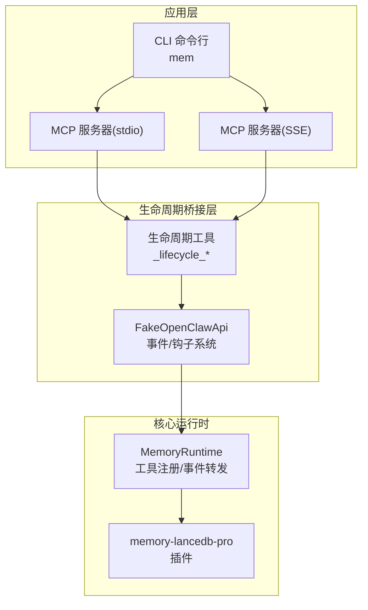
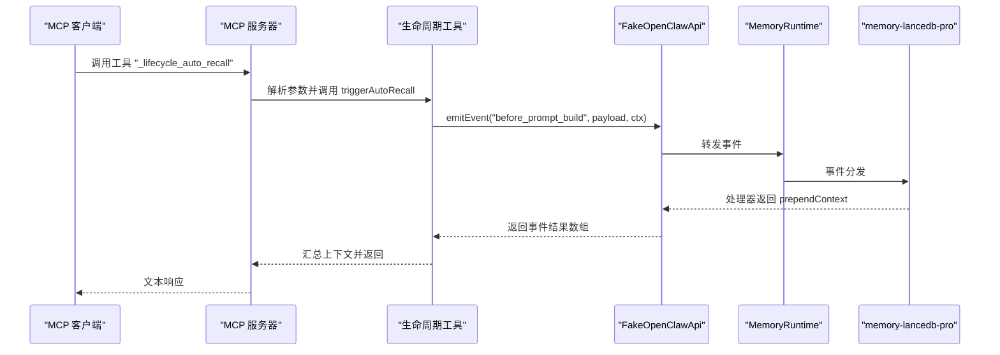
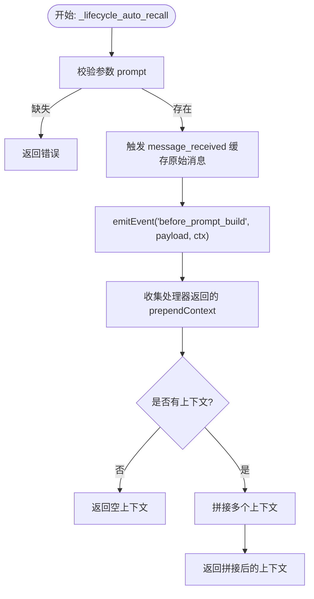
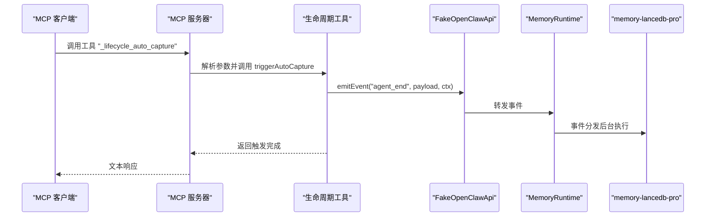
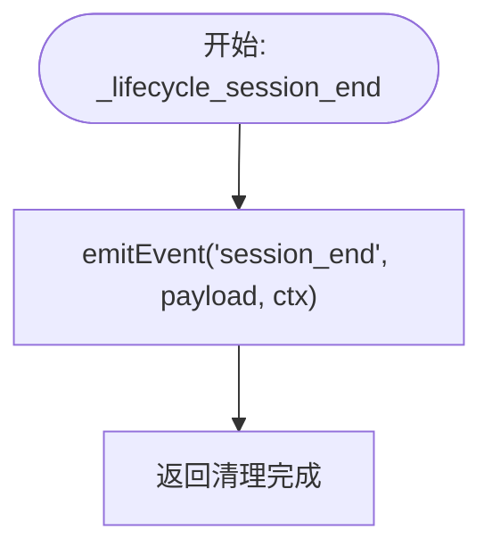
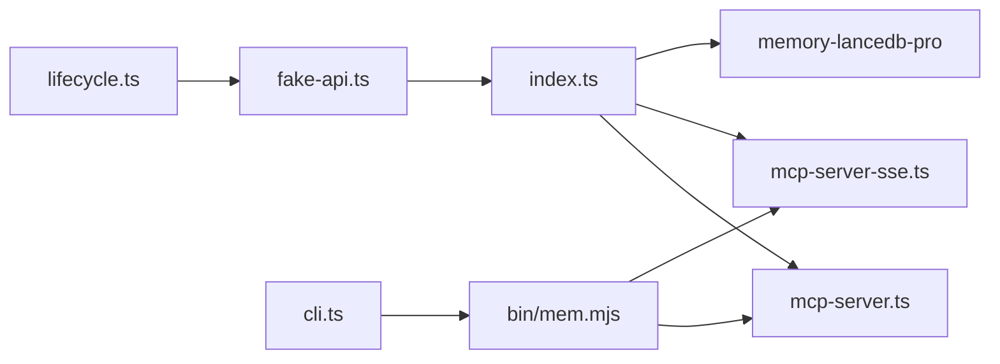

# 生命周期管理

<cite>
**本文引用的文件**
- [src/lifecycle.ts](file://src/lifecycle.ts)
- [src/mcp-server.ts](file://src/mcp-server.ts)
- [src/mcp-server-sse.ts](file://src/mcp-server-sse.ts)
- [src/index.ts](file://src/index.ts)
- [src/fake-api.ts](file://src/fake-api.ts)
- [src/config.ts](file://src/config.ts)
- [src/schema.ts](file://src/schema.ts)
- [src/cli.ts](file://src/cli.ts)
- [bin/mem.mjs](file://bin/mem.mjs)
- [README.md](file://README.md)
- [package.json](file://package.json)
- [test/integration.test.mjs](file://test/integration.test.mjs)
</cite>

## 目录
1. [简介](#简介)
2. [项目结构](#项目结构)
3. [核心组件](#核心组件)
4. [架构总览](#架构总览)
5. [详细组件分析](#详细组件分析)
6. [依赖关系分析](#依赖关系分析)
7. [性能考量](#性能考量)
8. [故障排查指南](#故障排查指南)
9. [结论](#结论)
10. [附录](#附录)

## 简介
本文件系统性阐述生命周期管理的设计与实现，重点覆盖以下主题：
- 自动召回机制（before_prompt_build）与自动捕获机制（agent_end）的工作原理与触发时机
- 会话管理流程与事件处理机制
- 生命周期工具（_lifecycle_auto_recall、_lifecycle_auto_capture、_lifecycle_session_end）的功能与实现细节
- 与 MCP 服务器的集成方式与事件传递机制
- 生命周期事件的监控与调试方法
- 生命周期管理的最佳实践与性能优化建议
- 生命周期机制对记忆质量与系统性能的影响

## 项目结构
该项目围绕“生命周期桥接”与“MCP 服务器”两大核心展开，通过 FakeOpenClawApi 将 memory-lancedb-pro 的事件系统桥接到 MCP 协议中，提供两类传输模式：stdio（默认）与 SSE（HTTP），并暴露三个生命周期工具供外部调用。

图表来源
- [src/mcp-server.ts:43-140](file://src/mcp-server.ts#L43-L140)
- [src/mcp-server-sse.ts:57-209](file://src/mcp-server-sse.ts#L57-L209)
- [src/lifecycle.ts:52-153](file://src/lifecycle.ts#L52-L153)
- [src/fake-api.ts:269-301](file://src/fake-api.ts#L269-L301)
- [src/index.ts:207-498](file://src/index.ts#L207-L498)

章节来源
- [src/mcp-server.ts:1-140](file://src/mcp-server.ts#L1-L140)
- [src/mcp-server-sse.ts:1-209](file://src/mcp-server-sse.ts#L1-L209)
- [src/lifecycle.ts:1-178](file://src/lifecycle.ts#L1-L178)
- [src/fake-api.ts:1-318](file://src/fake-api.ts#L1-L318)
- [src/index.ts:1-515](file://src/index.ts#L1-L515)
- [README.md:22-45](file://README.md#L22-L45)

## 核心组件
- 生命周期工具集合
  - _lifecycle_auto_recall：在构建提示前触发 before_prompt_build，执行自动召回并返回可前置的上下文
  - _lifecycle_auto_capture：在会话结束或回合结束后触发 agent_end，执行自动捕获并异步提取记忆
  - _lifecycle_session_end：触发 session_end，用于清理挂起状态
- MCP 服务器（stdio/SSE）
  - 注册生命周期工具，并在 tools/call 时根据工具名分派到对应的生命周期处理逻辑
  - 将生命周期事件通过 FakeOpenClawApi.emitEvent 转发给插件注册的事件处理器
- FakeOpenClawApi
  - 实现事件系统（on）与钩子系统（registerHook），负责收集并排序事件处理器，按优先级顺序执行
  - 提供工具调用桥接（callTool），以及事件发射（emitEvent）与钩子触发（triggerHook）
- MemoryRuntime
  - 创建 FakeOpenClawApi，加载插件，注册工具与事件，提供统一的工具调用与事件发射接口
  - 在锁定 scope 模式下，强制 agentId 与 scope，保证跨 scope 隔离

章节来源
- [src/lifecycle.ts:52-153](file://src/lifecycle.ts#L52-L153)
- [src/mcp-server.ts:154-305](file://src/mcp-server.ts#L154-L305)
- [src/mcp-server-sse.ts:336-404](file://src/mcp-server-sse.ts#L336-L404)
- [src/fake-api.ts:133-301](file://src/fake-api.ts#L133-L301)
- [src/index.ts:207-498](file://src/index.ts#L207-L498)

## 架构总览
生命周期管理在 MCP 模式下的工作流如下：
- 客户端通过 MCP 工具调用生命周期工具
- MCP 服务器解析参数并调用生命周期函数
- 生命周期函数构造事件负载与上下文，通过 FakeOpenClawApi.emitEvent 触发相应事件
- 插件注册的事件处理器（如 before_prompt_build、agent_end、session_end）按优先级执行
- 处理器返回结果（如 prependContext）或触发后台任务（如自动捕获）

图表来源
- [src/mcp-server.ts:235-270](file://src/mcp-server.ts#L235-L270)
- [src/lifecycle.ts:52-91](file://src/lifecycle.ts#L52-L91)
- [src/fake-api.ts:269-287](file://src/fake-api.ts#L269-L287)
- [src/index.ts:484-490](file://src/index.ts#L484-L490)

## 详细组件分析

### 自动召回机制（before_prompt_build）
- 触发时机
  - 在发送用户提示前，调用 _lifecycle_auto_recall
  - 该工具会先触发 message_received，缓存原始消息，再触发 before_prompt_build
- 处理流程
  - 构造事件负载（prompt/content/sessionKey）与上下文（agentId/sessionKey/sessionId/channelId）
  - 通过 FakeOpenClawApi.emitEvent 触发事件
  - 收集所有处理器返回的 prependContext，拼接为最终上下文
  - 若无匹配记忆，返回空上下文
- 关键实现要点
  - 事件负载包含 sessionKey，便于后续会话关联
  - prependContext 作为“临时上下文”，ephemeral 标记表明不应持久化

图表来源
- [src/mcp-server.ts:241-270](file://src/mcp-server.ts#L241-L270)
- [src/lifecycle.ts:52-91](file://src/lifecycle.ts#L52-L91)

章节来源
- [src/lifecycle.ts:52-91](file://src/lifecycle.ts#L52-L91)
- [src/mcp-server.ts:241-270](file://src/mcp-server.ts#L241-L270)

### 自动捕获机制（agent_end）
- 触发时机
  - 在一次对话回合或会话结束后，调用 _lifecycle_auto_capture
- 处理流程
  - 构造事件负载（success/messages/sessionKey）与上下文（agentId/sessionKey/sessionId）
  - 通过 FakeOpenClawApi.emitEvent 触发 agent_end
  - 采用 fire-and-forget 模式，立即返回，后台异步提取记忆
- 关键实现要点
  - success 参数用于指示执行是否成功
  - 消息数组支持 role/system/user/assistant 等类型

图表来源
- [src/mcp-server.ts:272-289](file://src/mcp-server.ts#L272-L289)
- [src/lifecycle.ts:109-128](file://src/lifecycle.ts#L109-L128)

章节来源
- [src/lifecycle.ts:109-128](file://src/lifecycle.ts#L109-L128)
- [src/mcp-server.ts:272-289](file://src/mcp-server.ts#L272-L289)

### 会话结束与清理（session_end）
- 触发时机
  - 当会话结束或需要清理挂起状态时，调用 _lifecycle_session_end
- 处理流程
  - 构造事件负载（sessionKey）与上下文（agentId/sessionKey/sessionId）
  - 通过 FakeOpenClawApi.emitEvent 触发 session_end
  - 用于刷新挂起状态，确保资源释放与一致性

图表来源
- [src/mcp-server.ts:291-300](file://src/mcp-server.ts#L291-L300)
- [src/lifecycle.ts:138-153](file://src/lifecycle.ts#L138-L153)

章节来源
- [src/lifecycle.ts:138-153](file://src/lifecycle.ts#L138-L153)
- [src/mcp-server.ts:291-300](file://src/mcp-server.ts#L291-L300)

### MCP 服务器与生命周期工具注册
- stdio 模式
  - 在 ListToolsRequest 中合并常规工具与生命周期工具定义
  - 在 CallToolRequest 中识别生命周期工具名并分派到 handleLifecycleTool
- SSE 模式
  - 在 tools/list 与 tools/call 中同样注册生命周期工具定义与处理逻辑
- 生命周期工具定义
  - _lifecycle_auto_recall：要求 prompt，可选 agentId、sessionKey
  - _lifecycle_auto_capture：要求 messages（非空数组），可选 agentId、sessionKey
  - _lifecycle_session_end：可选 sessionKey、agentId

章节来源
- [src/mcp-server.ts:154-233](file://src/mcp-server.ts#L154-L233)
- [src/mcp-server.ts:235-305](file://src/mcp-server.ts#L235-L305)
- [src/mcp-server-sse.ts:336-376](file://src/mcp-server-sse.ts#L336-L376)
- [src/mcp-server-sse.ts:378-404](file://src/mcp-server-sse.ts#L378-L404)

### FakeOpenClawApi 事件系统与执行顺序
- 事件注册与排序
  - 通过 on 注册事件处理器，按 opts.priority 升序排序
  - emitEvent 依次调用处理器，收集返回值（undefined 被忽略）
- 钩子系统
  - registerHook 注册钩子处理器，triggerHook 顺序触发
- 工具调用桥接
  - callTool 通过工厂函数创建工具定义并执行，支持 ToolCallContext（agentId/sessionKey）

章节来源
- [src/fake-api.ts:133-301](file://src/fake-api.ts#L133-L301)

### MemoryRuntime 与作用域隔离
- 创建与初始化
  - 加载配置，必要时覆盖 scopes 定义与 agentAccess，实现项目级隔离
  - 初始化 FakeOpenClawApi 并注册插件
  - 发射 gateway_start 事件以触发自动整理等
- 工具调用与标签预处理
  - 对 memory_recall/memory_list/memory_store 等工具进行标签前缀嵌入与过滤
  - 在锁定 scope 模式下，强制 agentId="system" 以绕过 ACL 检查，确保写入目标 scope
- 生命周期工具导出
  - 通过 re-export 将生命周期工具暴露给上层使用

章节来源
- [src/index.ts:207-498](file://src/index.ts#L207-L498)

## 依赖关系分析
- 外部依赖
  - @modelcontextprotocol/sdk：MCP 协议实现（stdio/SSE）
  - memory-lancedb-pro：核心记忆引擎与事件处理器
  - jiti：动态加载父项目源码（无需本地构建）
- 内部模块耦合
  - lifecycle.ts 依赖 FakeOpenClawApi 接口
  - mcp-server.ts 与 mcp-server-sse.ts 依赖 lifecycle.ts 与 index.ts
  - fake-api.ts 为事件系统核心，被 index.ts 与 mcp-server* 调用
  - cli.ts 通过入口脚本 bin/mem.mjs 启动服务

图表来源
- [src/lifecycle.ts:13-13](file://src/lifecycle.ts#L13-L13)
- [src/fake-api.ts:57-90](file://src/fake-api.ts#L57-L90)
- [src/index.ts:9-11](file://src/index.ts#L9-L11)
- [src/mcp-server.ts:8-22](file://src/mcp-server.ts#L8-L22)
- [src/mcp-server-sse.ts:11-23](file://src/mcp-server-sse.ts#L11-L23)
- [src/cli.ts:17-27](file://src/cli.ts#L17-L27)
- [bin/mem.mjs:1-8](file://bin/mem.mjs#L1-L8)

章节来源
- [package.json:26-31](file://package.json#L26-L31)
- [src/mcp-server.ts:1-140](file://src/mcp-server.ts#L1-L140)
- [src/mcp-server-sse.ts:1-209](file://src/mcp-server-sse.ts#L1-L209)
- [src/index.ts:1-515](file://src/index.ts#L1-L515)

## 性能考量
- 自动召回
  - 事件负载包含 sessionKey，有助于减少无关检索
  - prependContext 拼接可能带来额外字符串处理开销，建议控制上下文长度
- 自动捕获
  - 采用 fire-and-forget 模式，避免阻塞主流程
  - 捕获过程可能涉及 LLM 智能提取，建议合理设置阈值（如最小消息数、最大字符数）
- 事件排序
  - 事件处理器按 priority 升序执行，优先级低的处理器先执行，避免昂贵操作阻塞
- 作用域隔离
  - 锁定 scope 模式下强制 agentId="system" 绕过 ACL，减少权限判断开销
- SSE 模式
  - 单客户端场景下，响应通过 SSE 流推送，避免 HTTP 响应体占用

章节来源
- [src/lifecycle.ts:52-91](file://src/lifecycle.ts#L52-L91)
- [src/lifecycle.ts:109-128](file://src/lifecycle.ts#L109-L128)
- [src/fake-api.ts:269-287](file://src/fake-api.ts#L269-L287)
- [src/index.ts:337-385](file://src/index.ts#L337-L385)
- [src/mcp-server-sse.ts:146-157](file://src/mcp-server-sse.ts#L146-L157)

## 故障排查指南
- 配置验证
  - 使用 mem doctor 检查配置文件是否存在、解析是否正确、API Key 是否有效
- 生命周期事件注册
  - 通过测试用例可验证事件是否注册（before_prompt_build、agent_end、message_received）
- 日志与调试
  - FakeOpenClawApi 提供 debug/info/warn/error 日志接口，可通过 quiet 控制输出
  - MCP 服务器启动时会打印工具清单与警告信息（如跨 scope 模式）
- 常见问题
  - 未设置 scope：stdio 模式会提示跨 scope 模式警告；SSE 模式会提示主机暴露风险
  - 参数缺失：生命周期工具会返回错误信息（如缺少 prompt 或 messages）

章节来源
- [src/cli.ts:449-517](file://src/cli.ts#L449-L517)
- [test/integration.test.mjs:96-117](file://test/integration.test.mjs#L96-L117)
- [src/fake-api.ts:82-90](file://src/fake-api.ts#L82-L90)
- [src/mcp-server.ts:130-139](file://src/mcp-server.ts#L130-L139)
- [src/mcp-server-sse.ts:174-189](file://src/mcp-server-sse.ts#L174-L189)

## 结论
生命周期管理通过 MCP 工具将 OpenClaw 的 before_prompt_build 与 agent_end 事件桥接至外部客户端，实现了：
- 明确的触发时机与参数契约
- 可观测的事件处理与优先级排序
- 与作用域隔离的无缝集成
- SSE/stdio 双传输模式的灵活部署

在实践中，建议：
- 明确区分“显式召回”与“自动召回”策略
- 合理配置自动捕获阈值，平衡质量与性能
- 在生产环境使用 SSE 时，务必限制主机与端口，避免未授权访问
- 通过 doctor 与日志持续监控生命周期事件的执行情况

## 附录

### 生命周期工具参考
- _lifecycle_auto_recall
  - 输入：prompt（必填），agentId（可选），sessionKey（可选）
  - 输出：prependContext 文本或“无相关记忆”
- _lifecycle_auto_capture
  - 输入：messages（必填，非空数组），agentId（可选），sessionKey（可选）
  - 输出：触发完成提示（后台异步提取）
- _lifecycle_session_end
  - 输入：sessionKey（可选），agentId（可选）
  - 输出：会话结束提示（清理挂起状态）

章节来源
- [src/mcp-server.ts:154-233](file://src/mcp-server.ts#L154-L233)
- [src/mcp-server-sse.ts:336-376](file://src/mcp-server-sse.ts#L336-L376)

### 配置与作用域
- autoRecall/autoCapture：控制是否启用自动召回/捕获
- sessionStrategy："none" 推荐用于 MCP 模式
- scopes：通过 --scope 实现项目级隔离，强制 agentId="system" 绕过 ACL

章节来源
- [src/config.ts:249-265](file://src/config.ts#L249-L265)
- [src/index.ts:337-385](file://src/index.ts#L337-L385)