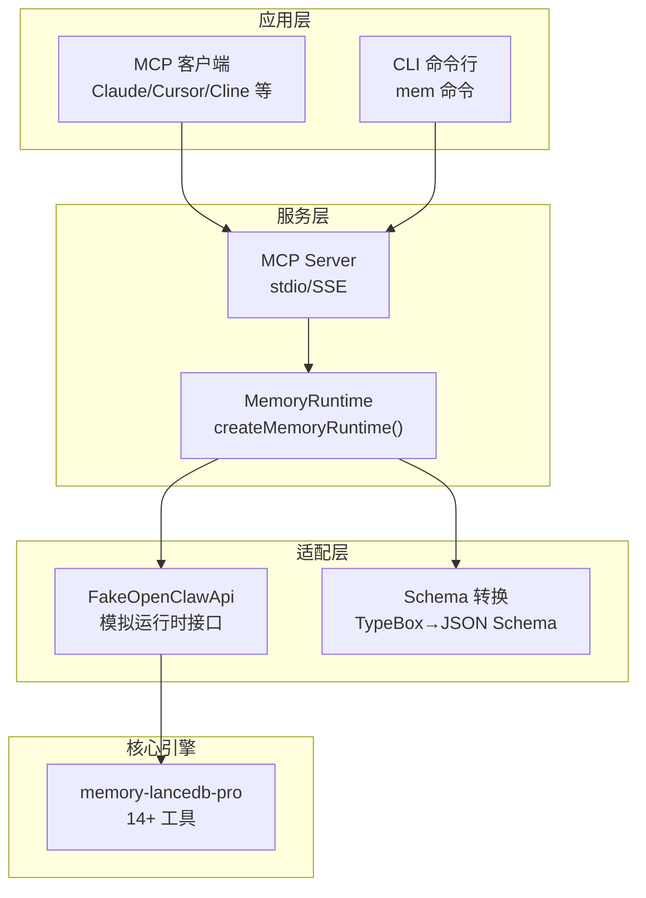
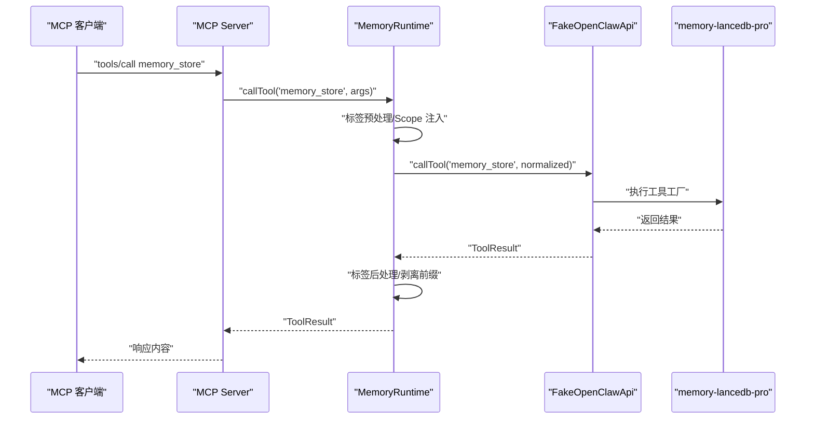
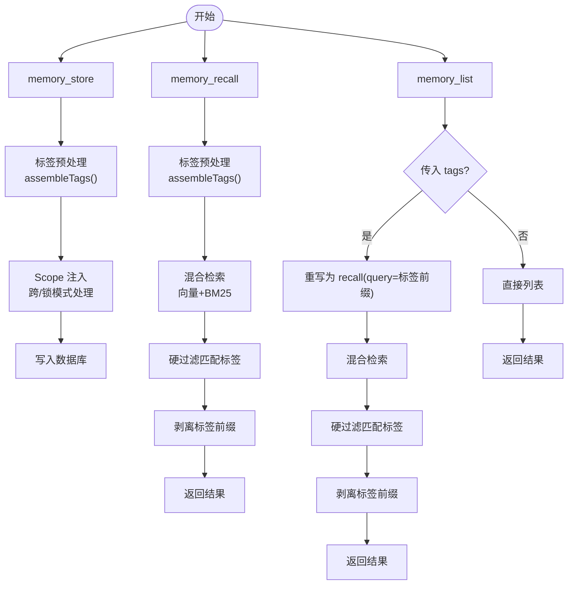
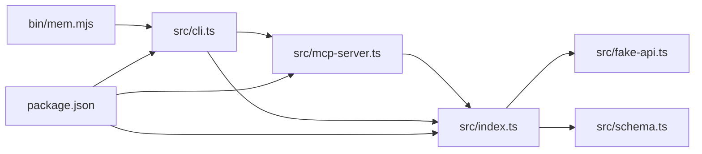

# 核心记忆工具

<cite>
**本文引用的文件**
- [README.md](file://README.md)
- [USAGE_GUIDE.md](file://docs/USAGE_GUIDE.md)
- [package.json](file://package.json)
- [tsconfig.json](file://tsconfig.json)
- [src/index.ts](file://src/index.ts)
- [src/fake-api.ts](file://src/fake-api.ts)
- [src/schema.ts](file://src/schema.ts)
- [src/cli.ts](file://src/cli.ts)
- [src/mcp-server.ts](file://src/mcp-server.ts)
- [bin/mem.mjs](file://bin/mem.mjs)
- [test/integration.test.mjs](file://test/integration.test.mjs)
</cite>

## 目录
1. [简介](#简介)
2. [项目结构](#项目结构)
3. [核心组件](#核心组件)
4. [架构总览](#架构总览)
5. [详细组件分析](#详细组件分析)
6. [依赖分析](#依赖分析)
7. [性能考量](#性能考量)
8. [故障排除指南](#故障排除指南)
9. [结论](#结论)
10. [附录](#附录)

## 简介
本项目为 AI 应用提供持久化长期记忆的 MCP Server，基于 memory-lancedb-pro 的向量记忆引擎，通过 MCP 协议暴露 17 个工具，其中核心记忆工具包括：memory_store（存储记忆）、memory_recall（语义检索）、memory_list（列表查看）、memory_forget（删除记忆）、memory_update（更新记忆）、memory_stats（统计信息）。这些工具支持标签系统、Scope 多项目隔离、智能生命周期桥接（自动召回/捕获）等能力，既可用于本地 MCP 客户端（stdio），也可通过 SSE 模式支持远程/多客户端。

## 项目结构
- 核心入口与运行时：src/index.ts 提供 createMemoryRuntime 工厂函数，负责加载配置、创建 FakeOpenClawApi、注册插件、暴露工具调用与事件钩子。
- MCP 服务层：src/mcp-server.ts 将工具暴露为 MCP Server，支持 stdio 与 SSE 两种传输。
- CLI：src/cli.ts 提供 mem 命令行工具，支持 serve/list/search/stats/store/delete/config/doctor/scope 等命令。
- 类型转换：src/schema.ts 将 TypeBox Schema 转换为 MCP 所需的 JSON Schema。
- 假装 OpenClaw 运行时：src/fake-api.ts 模拟 memory-lancedb-pro 所需的运行时接口，捕获工具工厂、事件与钩子。
- 文档：README.md 与 docs/USAGE_GUIDE.md 提供功能说明、参数参考、最佳实践与故障排除。
- 构建与测试：package.json 定义构建脚本与依赖；tsconfig.json 配置 TypeScript 编译；test/integration.test.mjs 验证工具注册与 JSON Schema 有效性。

图表来源
- [src/mcp-server.ts:43-140](file://src/mcp-server.ts#L43-L140)
- [src/index.ts:207-498](file://src/index.ts#L207-L498)
- [src/fake-api.ts:57-318](file://src/fake-api.ts#L57-L318)
- [src/schema.ts:45-151](file://src/schema.ts#L45-L151)

章节来源
- [README.md:11-45](file://README.md#L11-L45)
- [src/index.ts:159-184](file://src/index.ts#L159-L184)
- [src/mcp-server.ts:43-140](file://src/mcp-server.ts#L43-L140)
- [src/cli.ts:105-169](file://src/cli.ts#L105-L169)

## 核心组件
- MemoryRuntime：封装工具调用、事件与钩子，提供 listTools、callTool、emitEvent、triggerHook 等能力；支持标签预处理/后处理、Scope 注入与 ACL 检查、合成工具 list_scopes。
- FakeOpenClawApi：模拟 memory-lancedb-pro 的运行时接口，注册工具工厂、事件与钩子，提供 callTool/getToolDefinitions 等。
- Schema 转换：将 TypeBox Schema 清洗为 MCP 兼容的 JSON Schema，确保 tools/list 返回的参数定义符合 MCP 规范。
- MCP Server：将工具暴露为 MCP Server，支持 stdio 与 SSE；处理 tools/list 与 tools/call 请求，映射返回格式。
- CLI：提供 mem 命令行工具，支持 serve、list、search、stats、store、delete、config、doctor、scope 等命令。

章节来源
- [src/index.ts:95-134](file://src/index.ts#L95-L134)
- [src/fake-api.ts:20-51](file://src/fake-api.ts#L20-L51)
- [src/schema.ts:45-151](file://src/schema.ts#L45-L151)
- [src/mcp-server.ts:28-148](file://src/mcp-server.ts#L28-L148)
- [src/cli.ts:105-617](file://src/cli.ts#L105-L617)

## 架构总览
memory-lancedb-mcp 通过 jiti 直接从 node_modules 加载 memory-lancedb-pro 的 TypeScript 源文件，零修改地桥接其 14+ 工具。Wrapper 在运行时注入标签前缀、Scope 强制与 ACL 检查，并将 TypeBox Schema 转换为 MCP JSON Schema。MCP Server 与 CLI 分别面向远程客户端与本地运维。

图表来源
- [src/mcp-server.ts:86-124](file://src/mcp-server.ts#L86-L124)
- [src/index.ts:248-453](file://src/index.ts#L248-L453)
- [src/fake-api.ts:217-235](file://src/fake-api.ts#L217-L235)

## 详细组件分析

### memory_store（存储记忆）
- 作用：将一段文本作为记忆写入，支持分类、标签、重要度与 Scope。
- 输入参数
  - text（必需）：记忆内容
  - category（可选）：偏好/preference、事实/fact、决策/decision、实体/entity、反思/reflection、其他/other
  - tags（可选）：逗号分隔标签，存储时自动嵌入“【标签:x,y】”前缀
  - importance（可选）：0-1，默认 0.7
  - scope（可选）：目标 Scope，默认 agent scope
- 处理逻辑
  - 标签预处理：对 tags 进行规范化与校验，组装“【标签:...】”前缀并注入 text/query
  - Scope 注入：跨 scope 模式下未指定 scope 时自动注入默认 scope（如 global），锁定模式下强制覆盖为服务端 scope，并使用系统级 agentId 绕过 ACL
  - 结果后处理：对返回内容剥离标签前缀
- 输出格式：ToolResult，content 为文本数组，details 可携带额外统计信息
- 最佳实践
  - 记忆内容建议 100-200 字以上，包含唯一标识性关键词
  - 使用 tags 精细化分类，避免使用保留字符“【】”
  - 重要度 importance 用于影响检索权重与衰减策略
- 典型调用示例（MCP）
  - {"text": "用户偏好 pnpm", "category": "preference", "importance": 0.9, "tags": "技术栈,包管理器"}
- 典型调用示例（CLI）
  - mem store "用户偏好 pnpm" -c preference -t tech,tools -i 0.9

章节来源
- [src/index.ts:313-386](file://src/index.ts#L313-L386)
- [src/index.ts:322-324](file://src/index.ts#L322-L324)
- [src/cli.ts:309-343](file://src/cli.ts#L309-L343)
- [README.md:552-561](file://README.md#L552-L561)
- [USAGE_GUIDE.md:169-196](file://USAGE_GUIDE.md#L169-L196)

### memory_recall（语义检索）
- 作用：基于向量 + BM25 的混合检索召回相关记忆，支持 limit、scope、category、tags 过滤。
- 输入参数
  - query（必需）：检索关键词
  - limit（可选）：最大结果数，默认 3，最大 20
  - scope（可选）：限定 Scope
  - category（可选）：限定分类
  - tags（可选）：标签过滤（逗号分隔）
- 处理逻辑
  - 标签预处理：将 tags 嵌入 query 前缀，利用 BM25 精确命中标签
  - 结果后处理：硬过滤匹配标签的条目，剥离标签前缀，重建头部计数
- 输出格式：ToolResult，content 为文本数组，展示“Found N memories:”列表
- 最佳实践
  - query 构造遵循“实体名 + 技术术语 + 关键细节”，避免纯自然疑问句
  - 使用 tags 实现软过滤（加权靠前），必要时配合 category 硬过滤
- 典型调用示例（MCP）
  - {"query": "TypeScript Rust 全栈架构师", "limit": 5, "tags": "技术栈"}
- 典型调用示例（CLI）
  - mem search "TypeScript Rust 全栈架构师" -l 5 -t tech

章节来源
- [src/index.ts:313-450](file://src/index.ts#L313-L450)
- [src/cli.ts:238-273](file://src/cli.ts#L238-L273)
- [README.md:562-571](file://README.md#L562-L571)
- [USAGE_GUIDE.md:198-218](file://USAGE_GUIDE.md#L198-L218)

### memory_list（列表查看）
- 作用：按分页与过滤条件列出记忆，支持 limit、offset、scope、category、tags。
- 输入参数
  - limit（可选）：最大条数，默认 10，最大 50
  - offset（可选）：分页偏移，默认 0
  - scope（可选）：限定 Scope
  - category（可选）：限定分类
  - tags（可选）：标签过滤（逗号分隔）
- 处理逻辑
  - 标签过滤：当传入 tags 时，将 list+tags 请求重写为 recall(query=前缀)，以实现 BM25 命中标签的效果
  - 结果后处理：剥离标签前缀，重建头部计数
- 输出格式：ToolResult，content 为文本数组
- 最佳实践
  - tags 在 list 中为软过滤，如需硬过滤请配合 category
  - 使用 limit/offset 实现分页浏览
- 典型调用示例（MCP）
  - {"limit": 20, "offset": 10, "tags": "用户画像,技术栈"}
- 典型调用示例（CLI）
  - mem list -l 20 --offset 10 -t profile,tech

章节来源
- [src/index.ts:326-335](file://src/index.ts#L326-L335)
- [src/index.ts:390-450](file://src/index.ts#L390-L450)
- [src/cli.ts:175-232](file://src/cli.ts#L175-L232)
- [README.md:572-581](file://README.md#L572-L581)
- [USAGE_GUIDE.md:220-231](file://USAGE_GUIDE.md#L220-L231)

### memory_forget（删除记忆）
- 作用：删除指定记忆，支持按 ID 或通过 query 搜索后选择删除。
- 输入参数
  - memoryId（二选一）：记忆 ID（完整 UUID 或 8+ 位前缀）
  - query（二选一）：搜索查询，返回候选后选择删除
  - scope（可选）：限定 Scope
- 处理逻辑
  - 当传入 query 时，先召回候选，再根据 memoryId 删除
  - 删除操作受 Scope 与 ACL 限制
- 输出格式：ToolResult，content 为文本数组
- 最佳实践
  - 删除前先用 recall 或 list 确认 ID
  - 在锁定模式下，只能删除当前服务端 scope 的记忆
- 典型调用示例（MCP）
  - {"memoryId": "abcd1234..."}
  - {"query": "旧的测试数据"}

章节来源
- [src/cli.ts:349-364](file://src/cli.ts#L349-L364)
- [README.md:582-588](file://README.md#L582-L588)
- [USAGE_GUIDE.md:232-244](file://USAGE_GUIDE.md#L232-L244)

### memory_update（更新记忆）
- 作用：更新已有记忆，可修改 text、category、importance。修改 text 会触发重新嵌入。
- 输入参数
  - memoryId（必需）：记忆 ID
  - text（可选）：新文本内容
  - category（可选）：新分类
  - importance（可选）：新重要度
  - scope（可选）：限定 Scope
- 处理逻辑
  - 通过 recall 定位目标记忆，再执行更新
  - 更新 text 会触发重新嵌入与索引更新
- 输出格式：ToolResult，content 为文本数组
- 最佳实践
  - 更新前先用 recall 确认 ID 与当前内容
  - 重要度 importance 会影响检索权重与衰减
- 典型调用示例（MCP）
  - {"memoryId": "abcd1234...", "text": "更新后的描述", "importance": 0.8}

章节来源
- [README.md:589-597](file://README.md#L589-L597)
- [USAGE_GUIDE.md:245-255](file://USAGE_GUIDE.md#L245-L255)

### memory_stats（统计信息）
- 作用：返回 Scope 分布、分类分布、检索模式状态等统计信息。
- 输入参数
  - scope（可选）：限定 Scope
- 输出格式：ToolResult，content 为文本数组，details 可包含结构化统计
- 最佳实践
  - 用于监控与运维，结合 scope 参数查看特定项目统计
- 典型调用示例（MCP）
  - {"scope": "project:myapp"}
- 典型调用示例（CLI）
  - mem stats --scope project:myapp

章节来源
- [src/cli.ts:279-303](file://src/cli.ts#L279-L303)
- [README.md:598-602](file://README.md#L598-L602)
- [USAGE_GUIDE.md:256-264](file://USAGE_GUIDE.md#L256-L264)

### Scope 与标签系统
- Scope（作用域/项目隔离）
  - 跨 scope 模式：可读写任意 Scope；memory_store 不指定 scope 时自动写入 global
  - 锁定 scope 模式：所有操作强制限定在服务端 --scope 内；请求其他 Scope 会被拒绝
  - ACL 绕过：使用系统级 agentId 绕过 ACL 检查，确保写入正确 Scope
- 标签（Tags）
  - 前缀嵌入：存储时将 tags 组装为“【标签:x,y】”前缀注入 text
  - BM25 命中：召回时通过 BM25 精确匹配标签前缀
  - 展示剥离：返回结果自动剥离标签前缀，保持干净显示
  - 校验规则：仅允许字母、数字、_、-、:、/、.、CJK 字符与逗号，禁止使用“【】”

章节来源
- [src/index.ts:18-64](file://src/index.ts#L18-L64)
- [src/index.ts:313-450](file://src/index.ts#L313-L450)
- [README.md:634-672](file://README.md#L634-L672)
- [USAGE_GUIDE.md:392-421](file://USAGE_GUIDE.md#L392-L421)

### 工具依赖关系与典型工作流
- 工具依赖
  - memory_recall 与 memory_list 共享标签预处理与后处理逻辑
  - memory_store 与 memory_recall 共享标签前缀注入
  - memory_list 在传入 tags 时重写为 recall 调用
  - list_scopes 合成工具依赖 memory_stats 获取 scopeCounts
- 典型工作流
  - 存储：memory_store → 标签预处理 → Scope 注入 → 写入数据库
  - 检索：memory_recall → 标签前缀注入 → 混合检索 → 硬过滤 + 剥离前缀 → 返回
  - 列表：memory_list → tags 重写为 recall → BM25 命中 → 硬过滤 + 剥离前缀 → 返回
  - 删除/更新：定位目标 → 执行删除/更新 → 索引更新
  - 统计：memory_stats → 跨 Scope 统计 → 返回结构化统计

图表来源
- [src/index.ts:313-450](file://src/index.ts#L313-L450)
- [src/index.ts:248-311](file://src/index.ts#L248-L311)

## 依赖分析
- 外部依赖
  - @modelcontextprotocol/sdk：MCP 协议实现，支持 stdio/SSE 传输
  - jiti：动态加载 memory-lancedb-pro 的 TypeScript 源文件
  - yaml：解析与序列化配置文件
  - commander：CLI 命令行解析
- 内部模块耦合
  - src/index.ts 依赖 src/fake-api.ts、src/schema.ts，负责工具注册、标签与 Scope 处理、Schema 转换
  - src/mcp-server.ts 依赖 src/index.ts，提供 MCP Server 桥接
  - src/cli.ts 依赖 src/index.ts 与 src/mcp-server.ts，提供命令行入口
  - bin/mem.mjs 为 CLI 入口脚本，指向 dist/cli.js

图表来源
- [package.json:26-31](file://package.json#L26-L31)
- [src/index.ts:9-11](file://src/index.ts#L9-L11)
- [src/mcp-server.ts:14-22](file://src/mcp-server.ts#L14-L22)
- [src/cli.ts:17-27](file://src/cli.ts#L17-L27)
- [bin/mem.mjs:3](file://bin/mem.mjs#L3)

章节来源
- [package.json:26-31](file://package.json#L26-L31)
- [src/index.ts:9-11](file://src/index.ts#L9-L11)
- [src/mcp-server.ts:14-22](file://src/mcp-server.ts#L14-L22)
- [src/cli.ts:17-27](file://src/cli.ts#L17-L27)

## 性能考量
- 检索性能
  - 混合检索（向量 + BM25）在召回质量与速度间取得平衡；合理设置 limit 与 tags 可减少无关结果，提高命中效率
  - 标签前缀通过 BM25 精确命中，避免全表扫描
- 写入性能
  - 重要度 importance 与分类 category 有助于后续检索与排序，减少无效写入
  - 标签规范化与校验在写入前完成，避免重复与错误
- 存储与索引
  - LanceDB 向量索引与元数据索引配合，支持高效检索
  - Scope 隔离减少不必要的扫描范围
- 并发与传输
  - stdio 模式适合本地客户端，SSE 模式支持远程/多客户端，需关注网络延迟与并发连接数

## 故障排除指南
- 配置问题
  - 确认配置文件存在且可解析，API Key 正确（支持环境变量）
  - 使用 mem doctor 进行健康检查，验证配置与工具注册
- Scope 权限
  - 锁定模式下，请求的 scope 必须与服务端 --scope 一致，否则返回 Scope mismatch
  - 跨 scope 模式下，memory_store 不指定 scope 会自动写入 global
- 标签校验
  - 非法标签字符会立即报错，避免破坏前缀结构
- CLI 与 MCP 生效
  - 修改源码后需重新编译（tsc），MCP 服务需重启生效
- 常见错误
  - “Unknown tool: ...”：工具名拼写错误或未注册
  - “Scope mismatch”：锁定模式下请求了不一致的 scope
  - “Invalid tag value”：标签包含不允许的字符

章节来源
- [src/cli.ts:449-517](file://src/cli.ts#L449-L517)
- [src/index.ts:351-367](file://src/index.ts#L351-L367)
- [USAGE_GUIDE.md:618-667](file://USAGE_GUIDE.md#L618-L667)

## 结论
memory-lancedb-mcp 通过零修改桥接 memory-lancedb-pro，提供稳定可靠的 MCP 工具集。核心记忆工具围绕标签与 Scope 两大特性展开，既保证了灵活性（跨 scope 模式），又提供了强隔离（锁定 scope 模式）。配合混合检索与智能生命周期桥接，能够满足复杂 AI 应用对长期记忆的需求。建议在生产环境中结合 CLI 与 MCP 客户端，遵循最佳实践与故障排除指南，确保稳定性与可维护性。

## 附录
- 安装与初始化
  - 安装依赖并编译：npm install && npx tsc
  - 初始化配置：node ./bin/mem.mjs config init
- 启动服务
  - 本地 stdio：mem serve
  - SSE 远程：mem serve --sse --port 3100 --host 0.0.0.0
  - 锁定 scope：mem serve --scope project:myapp
- 常用命令
  - mem store/list/search/stats/store/delete/config/doctor/scope

章节来源
- [README.md:80-131](file://README.md#L80-L131)
- [README.md:284-312](file://README.md#L284-L312)
- [USAGE_GUIDE.md:43-164](file://USAGE_GUIDE.md#L43-L164)