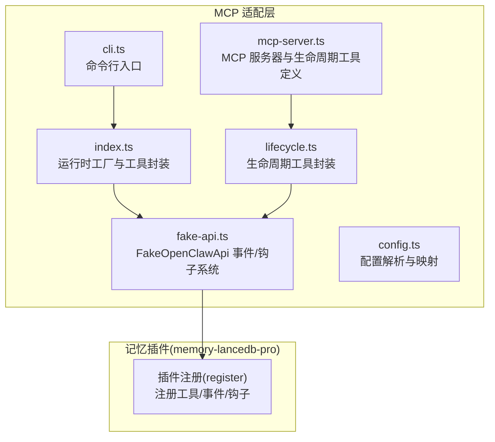
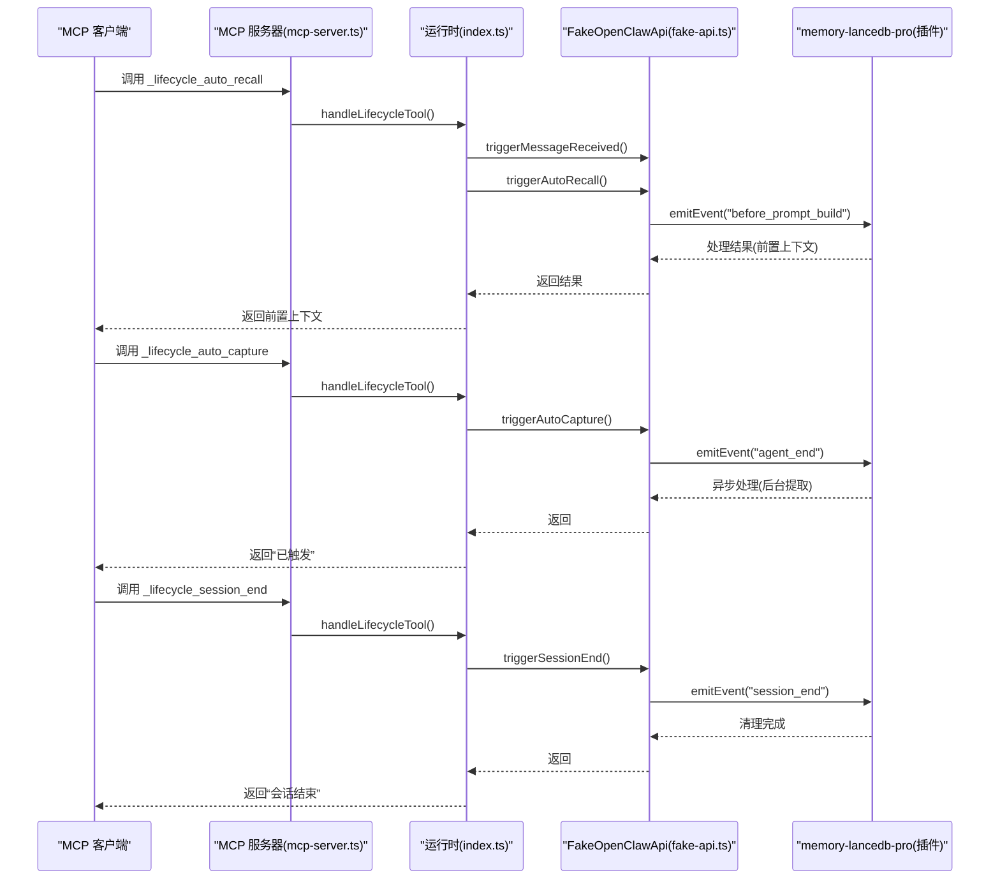
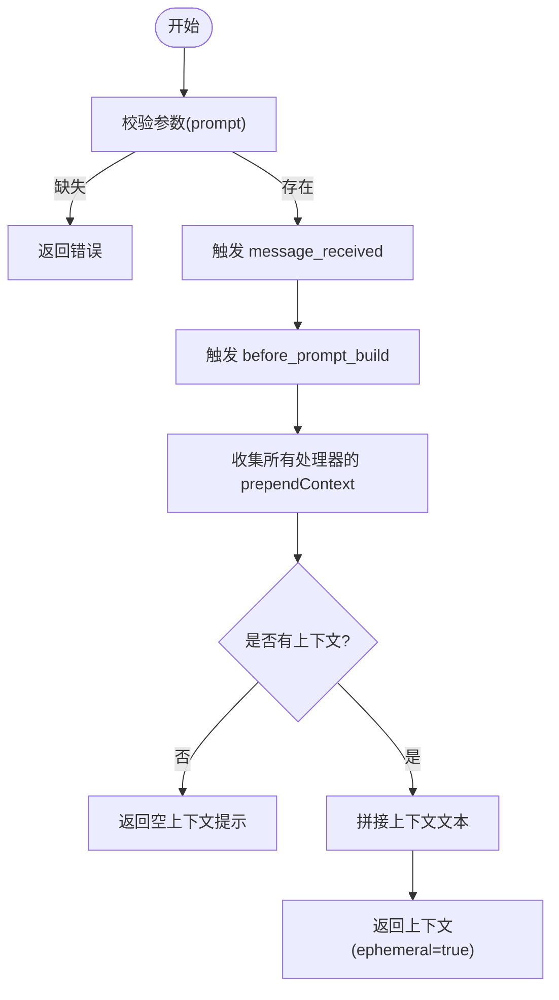
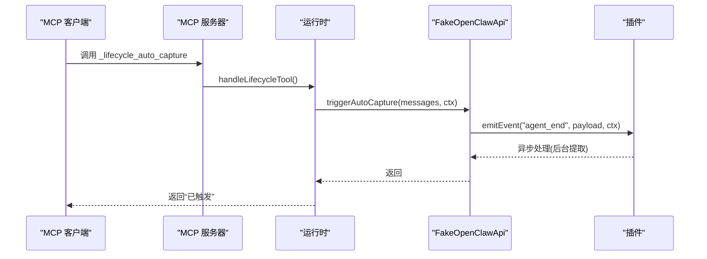
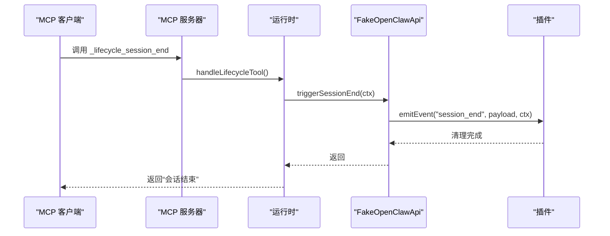
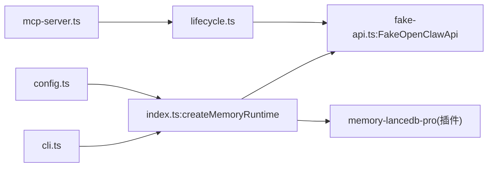

# 生命周期工具

<cite>
**本文引用的文件**
- [src/lifecycle.ts](file://src/lifecycle.ts)
- [src/index.ts](file://src/index.ts)
- [src/mcp-server.ts](file://src/mcp-server.ts)
- [src/fake-api.ts](file://src/fake-api.ts)
- [src/config.ts](file://src/config.ts)
- [src/cli.ts](file://src/cli.ts)
- [test/integration.test.mjs](file://test/integration.test.mjs)
- [README.md](file://README.md)
- [package.json](file://package.json)
- [bin/mem.mjs](file://bin/mem.mjs)
</cite>

## 目录
1. [简介](#简介)
2. [项目结构](#项目结构)
3. [核心组件](#核心组件)
4. [架构总览](#架构总览)
5. [详细组件分析](#详细组件分析)
6. [依赖分析](#依赖分析)
7. [性能考虑](#性能考虑)
8. [故障排查指南](#故障排查指南)
9. [结论](#结论)
10. [附录](#附录)

## 简介
本文件聚焦于生命周期工具，涵盖三个核心工具：
- _lifecycle_auto_recall（自动召回）
- _lifecycle_auto_capture（自动捕获）
- _lifecycle_session_end（会话结束）

它们与 OpenClaw 生命周期事件深度集成，实现记忆的自动化管理。文档详细说明触发条件、执行策略、时机选择与清理流程，并提供配置方法与自定义扩展指南（如何添加新的生命周期钩子）。

## 项目结构
该项目围绕“MCP 适配层 + 记忆插件”构建，生命周期工具位于适配层，通过 FakeOpenClawApi 将 OpenClaw 事件桥接到 memory-lancedb-pro 插件，从而实现自动召回、自动捕获与会话清理。

图表来源
- [src/index.ts:190-498](file://src/index.ts#L190-L498)
- [src/lifecycle.ts:1-178](file://src/lifecycle.ts#L1-L178)
- [src/mcp-server.ts:154-305](file://src/mcp-server.ts#L154-L305)
- [src/fake-api.ts:57-317](file://src/fake-api.ts#L57-L317)
- [src/config.ts:220-223](file://src/config.ts#L220-L223)

章节来源
- [src/index.ts:190-498](file://src/index.ts#L190-L498)
- [src/lifecycle.ts:1-178](file://src/lifecycle.ts#L1-L178)
- [src/mcp-server.ts:154-305](file://src/mcp-server.ts#L154-L305)
- [src/fake-api.ts:57-317](file://src/fake-api.ts#L57-L317)
- [src/config.ts:220-223](file://src/config.ts#L220-L223)

## 核心组件
- 生命周期工具封装（lifecycle.ts）
  - triggerAutoRecall：触发 before_prompt_build 事件，收集前置上下文
  - triggerAutoCapture：触发 agent_end 事件，后台提取记忆
  - triggerSessionEnd：触发 session_end 事件，清理挂起状态
  - triggerMessageReceived：触发 message_received 事件，缓存原始消息
- MCP 服务器（mcp-server.ts）
  - 暴露 _lifecycle_auto_recall、_lifecycle_auto_capture、_lifecycle_session_end 为 MCP 工具
  - 在工具调用时按顺序触发 message_received → before_prompt_build → agent_end → session_end
- FakeOpenClawApi（fake-api.ts）
  - 提供 emitEvent、registerHook、on 等事件/钩子系统，承载插件注册与事件派发
- 配置系统（config.ts）
  - autoRecall、autoCapture、sessionStrategy 等影响生命周期行为
- 运行时工厂（index.ts）
  - 创建 FakeOpenClawApi，加载插件，初始化 gateway_start 事件，暴露工具与事件接口

章节来源
- [src/lifecycle.ts:52-153](file://src/lifecycle.ts#L52-L153)
- [src/mcp-server.ts:154-305](file://src/mcp-server.ts#L154-L305)
- [src/fake-api.ts:269-301](file://src/fake-api.ts#L269-L301)
- [src/config.ts:45-56](file://src/config.ts#L45-L56)
- [src/index.ts:207-242](file://src/index.ts#L207-L242)

## 架构总览
生命周期工具通过 MCP 服务器对外暴露，内部通过 FakeOpenClawApi 将事件派发给插件。插件根据配置决定是否启用自动召回与自动捕获，并在合适的生命周期节点执行记忆提取与注入。

图表来源
- [src/mcp-server.ts:235-305](file://src/mcp-server.ts#L235-L305)
- [src/lifecycle.ts:52-153](file://src/lifecycle.ts#L52-L153)
- [src/fake-api.ts:269-287](file://src/fake-api.ts#L269-L287)

## 详细组件分析

### _lifecycle_auto_recall（自动召回）
- 触发顺序
  - 先触发 message_received，缓存原始用户消息，用于后续召回策略的门控逻辑
  - 再触发 before_prompt_build，执行自动召回，收集前置上下文
- 触发条件
  - 显式调用 _lifecycle_auto_recall 工具，要求提供 prompt
  - 插件侧的自动召回开关（autoRecall）通常在 OpenClaw 环境下生效；在 MCP 模式下推荐由 Agent 显式调用 memory_recall
- 召回策略
  - 从事件处理器收集 prependContext，拼接为最终上下文文本
  - 若无相关记忆，返回空上下文提示
- 关键参数
  - prompt：用户提示词
  - agentId、sessionKey：用于事件上下文与会话跟踪

图表来源
- [src/mcp-server.ts:240-270](file://src/mcp-server.ts#L240-L270)
- [src/lifecycle.ts:52-91](file://src/lifecycle.ts#L52-L91)

章节来源
- [src/mcp-server.ts:240-270](file://src/mcp-server.ts#L240-L270)
- [src/lifecycle.ts:52-91](file://src/lifecycle.ts#L52-L91)

### _lifecycle_auto_capture（自动捕获）
- 触发顺序
  - 调用 _lifecycle_auto_capture，立即触发 agent_end 事件
- 触发条件
  - 显式调用 _lifecycle_auto_capture 工具，要求提供非空 messages 数组
- 捕获机制
  - 事件派发给插件，插件在后台异步提取关键信息并写入记忆
  - 函数本身采用 fire-and-forget 模式，立即返回
- 关键参数
  - messages：对话消息数组（role/content）
  - agentId、sessionKey：事件上下文

图表来源
- [src/mcp-server.ts:272-289](file://src/mcp-server.ts#L272-L289)
- [src/lifecycle.ts:109-128](file://src/lifecycle.ts#L109-L128)

章节来源
- [src/mcp-server.ts:272-289](file://src/mcp-server.ts#L272-L289)
- [src/lifecycle.ts:109-128](file://src/lifecycle.ts#L109-L128)

### _lifecycle_session_end（会话结束）
- 触发顺序
  - 调用 _lifecycle_session_end，触发 session_end 事件
- 触发条件
  - 显式调用 _lifecycle_session_end 工具，可选提供 sessionKey
- 清理与保存流程
  - 插件侧处理 session_end 事件，刷新挂起状态，完成必要的收尾
- 关键参数
  - sessionKey、agentId：事件上下文

图表来源
- [src/mcp-server.ts:291-300](file://src/mcp-server.ts#L291-L300)
- [src/lifecycle.ts:138-153](file://src/lifecycle.ts#L138-L153)

章节来源
- [src/mcp-server.ts:291-300](file://src/mcp-server.ts#L291-L300)
- [src/lifecycle.ts:138-153](file://src/lifecycle.ts#L138-L153)

### 与 OpenClaw 生命周期事件的集成
- before_prompt_build：在构建提示前触发，用于自动召回并返回前置上下文
- agent_end：在代理执行结束后触发，用于自动捕获并提取关键信息
- session_end：在会话结束时触发，用于清理挂起状态
- message_received：在用户消息到达时触发，缓存原始消息，为召回策略提供门控依据

章节来源
- [src/lifecycle.ts:52-91](file://src/lifecycle.ts#L52-L91)
- [src/lifecycle.ts:109-128](file://src/lifecycle.ts#L109-L128)
- [src/lifecycle.ts:138-153](file://src/lifecycle.ts#L138-L153)
- [src/lifecycle.ts:159-177](file://src/lifecycle.ts#L159-L177)
- [test/integration.test.mjs:96-117](file://test/integration.test.mjs#L96-L117)

## 依赖分析
- 运行时工厂 createMemoryRuntime
  - 初始化 FakeOpenClawApi，加载插件，发出 gateway_start 事件
  - 暴露 callTool、listTools、emitEvent、triggerHook 等接口
- FakeOpenClawApi
  - 注册工具、事件与钩子，提供 emitEvent、triggerHook 等能力
- MCP 服务器
  - 注册生命周期工具定义，处理生命周期工具调用
- 配置系统
  - autoRecall、autoCapture、sessionStrategy 等影响生命周期行为

图表来源
- [src/index.ts:207-242](file://src/index.ts#L207-L242)
- [src/fake-api.ts:57-317](file://src/fake-api.ts#L57-L317)
- [src/lifecycle.ts:1-178](file://src/lifecycle.ts#L1-L178)
- [src/mcp-server.ts:154-305](file://src/mcp-server.ts#L154-L305)
- [src/config.ts:220-223](file://src/config.ts#L220-L223)

章节来源
- [src/index.ts:207-242](file://src/index.ts#L207-L242)
- [src/fake-api.ts:57-317](file://src/fake-api.ts#L57-L317)
- [src/lifecycle.ts:1-178](file://src/lifecycle.ts#L1-L178)
- [src/mcp-server.ts:154-305](file://src/mcp-server.ts#L154-L305)
- [src/config.ts:220-223](file://src/config.ts#L220-L223)

## 性能考虑
- 自动捕获采用 fire-and-forget 模式，避免阻塞主流程
- 自动召回聚合多个处理器的上下文，注意上下文长度与拼接开销
- 会话结束事件用于清理挂起状态，减少内存占用
- 配置项 sessionStrategy 建议在 MCP 模式下设为“none”，避免不必要的会话管理开销

## 故障排查指南
- 工具调用失败
  - 检查参数完整性（如 _lifecycle_auto_recall 的 prompt、_lifecycle_auto_capture 的 messages）
  - 确认插件已正确加载与注册
- 事件未触发
  - 确认插件已注册相应事件处理器（before_prompt_build、agent_end、session_end）
  - 检查配置中 autoRecall、autoCapture 是否开启
- 日志定位
  - FakeOpenClawApi 提供 debug/info/warn/error 日志接口，可在 quiet 模式下关闭调试输出

章节来源
- [src/mcp-server.ts:240-300](file://src/mcp-server.ts#L240-L300)
- [src/fake-api.ts:84-89](file://src/fake-api.ts#L84-L89)
- [test/integration.test.mjs:96-117](file://test/integration.test.mjs#L96-L117)

## 结论
生命周期工具通过 MCP 服务器对外暴露，内部借助 FakeOpenClawApi 将 OpenClaw 生命周期事件桥接到 memory-lancedb-pro 插件，实现自动召回、自动捕获与会话清理。在 MCP 模式下，推荐由 Agent 显式调用生命周期工具，结合配置项实现稳定、可控的记忆自动化管理。

## 附录

### 生命周期事件配置方法
- autoRecall：控制是否启用自动召回（MCP 模式下建议显式调用）
- autoCapture：控制是否启用自动捕获
- sessionStrategy：会话策略（MCP 模式建议“none”）
- retrieval.*：检索权重、阈值等参数，影响召回质量

章节来源
- [src/config.ts:45-77](file://src/config.ts#L45-L77)
- [README.md:698-704](file://README.md#L698-L704)

### 自定义扩展指南：添加新的生命周期钩子
- 步骤
  - 在插件侧注册新钩子（registerHook），定义钩子名称与处理函数
  - 在 FakeOpenClawApi 中通过 triggerHook(name, payload) 触发
  - 在 MCP 服务器中新增工具定义与处理逻辑，或在应用层直接调用 triggerHook
- 注意事项
  - 保持钩子名称与插件侧一致
  - 事件/钩子的上下文（agentId、sessionKey 等）需与现有生命周期工具一致，便于统一管理

章节来源
- [src/fake-api.ts:292-301](file://src/fake-api.ts#L292-L301)
- [src/mcp-server.ts:154-233](file://src/mcp-server.ts#L154-L233)
- [src/index.ts:488-490](file://src/index.ts#L488-L490)