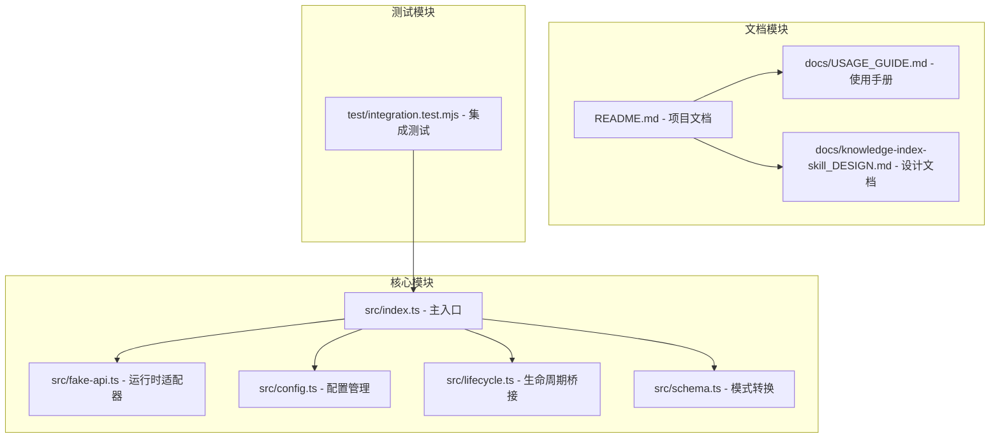
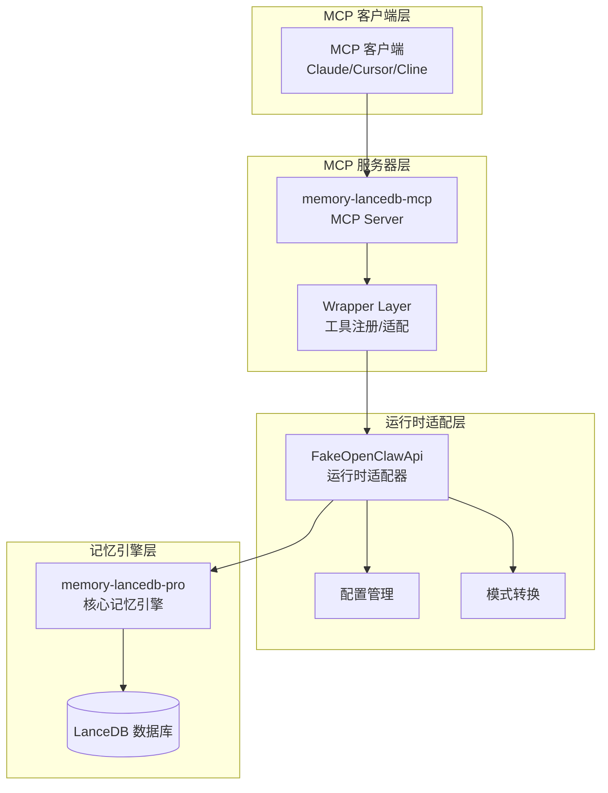
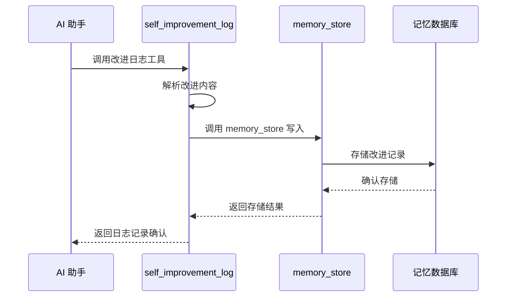
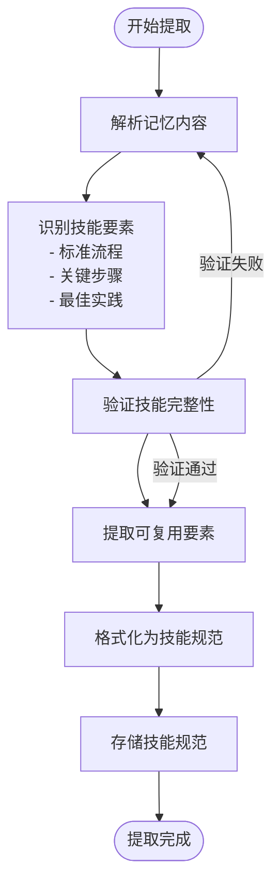
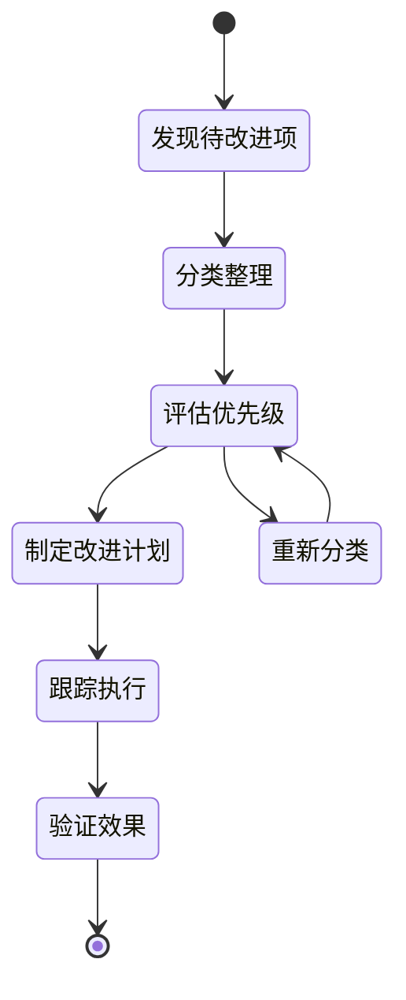

# 自我改进工具

<cite>
**本文档引用的文件**
- [README.md](file://README.md)
- [package.json](file://package.json)
- [src/index.ts](file://src/index.ts)
- [src/fake-api.ts](file://src/fake-api.ts)
- [src/config.ts](file://src/config.ts)
- [src/lifecycle.ts](file://src/lifecycle.ts)
- [src/schema.ts](file://src/schema.ts)
- [docs/USAGE_GUIDE.md](file://docs/USAGE_GUIDE.md)
- [docs/knowledge-index-skill_DESIGN.md](file://docs/knowledge-index-skill_DESIGN.md)
- [test/integration.test.mjs](file://test/integration.test.mjs)
</cite>

## 目录
1. [简介](#简介)
2. [项目结构](#项目结构)
3. [核心组件](#核心组件)
4. [架构概览](#架构概览)
5. [详细组件分析](#详细组件分析)
6. [依赖分析](#依赖分析)
7. [性能考虑](#性能考虑)
8. [故障排除指南](#故障排除指南)
9. [结论](#结论)
10. [附录](#附录)

## 简介

memory-lancedb-mcp 是一个为 AI 应用提供持久化长期记忆的 MCP Server。该项目基于 memory-lancedb-pro 核心能力，通过 Model Context Protocol (MCP) 暴露了 17 个记忆工具，其中包括 3 个智能自我改进工具：

- **self_improvement_log**：记录改进建议或错误经验
- **self_improvement_extract_skill**：从记忆中提取可复用的技能/规范
- **self_improvement_review**：审阅积压的待改进项

这些工具旨在帮助 AI 助手进行自我优化和学习，通过系统化的改进流程实现持续的知识积累和能力提升。

## 项目结构

该项目采用模块化架构设计，主要包含以下核心模块：



**图表来源**
- [src/index.ts:1-515](file://src/index.ts#L1-L515)
- [src/fake-api.ts:1-318](file://src/fake-api.ts#L1-L318)
- [src/config.ts:1-312](file://src/config.ts#L1-L312)

**章节来源**
- [package.json:1-46](file://package.json#L1-L46)
- [README.md:1-738](file://README.md#L1-L738)

## 核心组件

### 自我改进工具概述

项目中的自我改进工具基于 memory-lancedb-pro 的智能提取能力，通过以下三个核心工具实现 AI 助手的自我优化：

1. **self_improvement_log** - 记录改进经验和错误案例
2. **self_improvement_extract_skill** - 从记忆中提取可复用的技能规范
3. **self_improvement_review** - 审阅和评估待改进项

这些工具与标签系统、Scope 隔离机制协同工作，为 AI 助手提供完整的自我改进闭环。

**章节来源**
- [README.md:616-623](file://README.md#L616-L623)
- [src/index.ts:84-93](file://src/index.ts#L84-L93)

## 架构概览

项目采用分层架构设计，通过 FakeOpenClawApi 适配器层实现与 memory-lancedb-pro 的无缝集成：



**图表来源**
- [README.md:22-45](file://README.md#L22-L45)
- [src/fake-api.ts:57-90](file://src/fake-api.ts#L57-L90)
- [src/index.ts:159-184](file://src/index.ts#L159-L184)

## 详细组件分析

### self_improvement_log 组件分析

#### 功能特性
self_improvement_log 工具专门用于记录 AI 助手在使用过程中的改进建议和错误经验。该工具通过标签系统实现智能分类和检索。

#### 实现机制
工具通过以下机制实现改进日志记录：



**图表来源**
- [src/index.ts:313-335](file://src/index.ts#L313-L335)
- [src/index.ts:322-324](file://src/index.ts#L322-L324)

#### 标签集成
改进日志通过标签系统实现智能分类：
- **标签前缀**：`【标签:self-improvement,建议】`
- **自动嵌入**：在存储时自动添加标签前缀
- **检索支持**：通过 BM25 全文检索精确匹配标签

**章节来源**
- [src/index.ts:18-64](file://src/index.ts#L18-L64)
- [src/index.ts:317-324](file://src/index.ts#L317-L324)

### self_improvement_extract_skill 组件分析

#### 功能特性
self_improvement_extract_skill 工具负责从现有的记忆中提取可复用的技能和规范，形成标准化的知识单元。

#### 技能提取算法
工具采用多阶段提取算法：



**图表来源**
- [src/index.ts:313-335](file://src/index.ts#L313-L335)
- [src/index.ts:390-450](file://src/index.ts#L390-L450)

#### 技能规范化流程
1. **内容分析**：识别记忆中的标准流程和关键步骤
2. **要素提取**：提取可复用的技能要素
3. **格式化**：将提取的要素组织为标准化的技能规范
4. **存储验证**：确保技能规范的完整性和准确性

**章节来源**
- [src/index.ts:389-450](file://src/index.ts#L389-L450)
- [docs/knowledge-index-skill_DESIGN.md:220-281](file://docs/knowledge-index-skill_DESIGN.md#L220-L281)

### self_improvement_review 组件分析

#### 功能特性
self_improvement_review 工具用于审阅和评估积压的待改进项，建立改进工作的优先级和跟踪机制。

#### 审阅评估过程
工具通过以下流程实现改进项的审阅和评估：



**图表来源**
- [src/index.ts:313-335](file://src/index.ts#L313-L335)
- [src/index.ts:389-450](file://src/index.ts#L389-L450)

#### 评估标准
1. **影响程度**：改进对 AI 助手性能的影响
2. **实施难度**：改进措施的技术复杂度
3. **资源消耗**：改进所需的资源投入
4. **时效性**：改进的紧急程度

**章节来源**
- [src/index.ts:337-386](file://src/index.ts#L337-L386)
- [src/index.ts:389-450](file://src/index.ts#L389-L450)

## 依赖分析

### 核心依赖关系

```mermaid
graph TB
subgraph "外部依赖"
A[@modelcontextprotocol/sdk<br/>MCP 协议支持]
B[jiti<br/>TypeScript 运行时]
C[memory-lancedb-pro<br/>核心记忆引擎]
D[yaml<br/>配置文件解析]
end
subgraph "内部模块"
E[src/index.ts]
F[src/fake-api.ts]
G[src/config.ts]
H[src/lifecycle.ts]
I[src/schema.ts]
end
A --> E
B --> E
C --> F
D --> G
E --> F
E --> G
E --> H
E --> I
```

**图表来源**
- [package.json:26-31](file://package.json#L26-L31)
- [src/index.ts:9-12](file://src/index.ts#L9-L12)

### 配置依赖

项目配置系统支持多种配置来源和环境变量扩展：

| 配置来源 | 优先级 | 说明 |
|---------|--------|------|
| MEM_CONFIG_PATH | 最高 | 环境变量覆盖 |
| ~/.config/memory-mcp/config.yaml | 中 | 默认用户配置 |
| ./config.yaml | 最低 | 当前目录配置 |

**章节来源**
- [src/config.ts:107-121](file://src/config.ts#L107-L121)
- [src/config.ts:135-157](file://src/config.ts#L135-L157)

## 性能考虑

### 自我改进工具性能特性

1. **内存效率**：工具基于标签系统实现，避免重复存储相同内容
2. **检索性能**：利用 BM25 全文检索实现高效的改进项查找
3. **并发处理**：支持多线程的改进项处理和存储
4. **缓存机制**：热点改进项通过缓存机制提升访问速度

### 最佳实践建议

1. **改进频率**：建议每日或每周定期运行 self_improvement_review
2. **标签管理**：合理使用标签系统，避免标签过多导致检索效率下降
3. **存储优化**：定期清理无效的改进记录，保持数据库整洁
4. **监控指标**：建立改进效果的量化指标，持续跟踪改进效果

## 故障排除指南

### 常见问题及解决方案

#### 工具注册问题
**症状**：self_improvement_log 等工具无法被识别
**解决方案**：
1. 确认 memory-lancedb-pro 插件正确加载
2. 检查工具注册流程是否正常执行
3. 验证 MCP 协议版本兼容性

#### 配置加载问题
**症状**：配置文件无法正确解析
**解决方案**：
1. 检查 YAML 语法格式
2. 验证环境变量是否正确设置
3. 确认配置文件路径是否正确

#### 标签系统问题
**症状**：标签无法正确应用或检索
**解决方案**：
1. 检查标签字符集限制
2. 验证标签前缀格式
3. 确认标签解析逻辑

**章节来源**
- [test/integration.test.mjs:9-131](file://test/integration.test.mjs#L9-L131)
- [src/config.ts:167-214](file://src/config.ts#L167-L214)

## 结论

memory-lancedb-mcp 的自我改进工具体系为 AI 助手提供了完整的自我优化框架。通过 self_improvement_log、self_improvement_extract_skill 和 self_improvement_review 三个工具的协同工作，实现了从改进记录、技能提取到效果评估的完整闭环。

### 核心优势

1. **系统化改进**：建立了标准化的改进流程和评估机制
2. **知识复用**：通过技能提取实现知识的标准化和复用
3. **持续优化**：支持持续的改进跟踪和效果验证
4. **灵活集成**：与现有记忆系统无缝集成，无需额外配置

### 发展前景

随着 AI 技术的不断发展，自我改进工具将继续演进，为 AI 助手提供更加智能化的学习和优化能力。通过不断优化算法和增加新的改进维度，这些工具将成为 AI 助手智能化发展的重要支撑。

## 附录

### 使用最佳实践

#### 改进周期设置
- **日常改进**：每日运行 self_improvement_review
- **周度评估**：每周进行技能提取和效果评估
- **月度总结**：每月进行整体改进效果分析

#### 评估标准制定
1. **改进效果**：通过具体指标衡量改进效果
2. **实施成本**：评估改进措施的成本效益
3. **可持续性**：考虑改进措施的长期有效性
4. **可扩展性**：评估改进措施的推广潜力

#### 集成方案建议


这种循环优化机制确保 AI 助手能够持续学习和改进，实现真正的智能化发展。