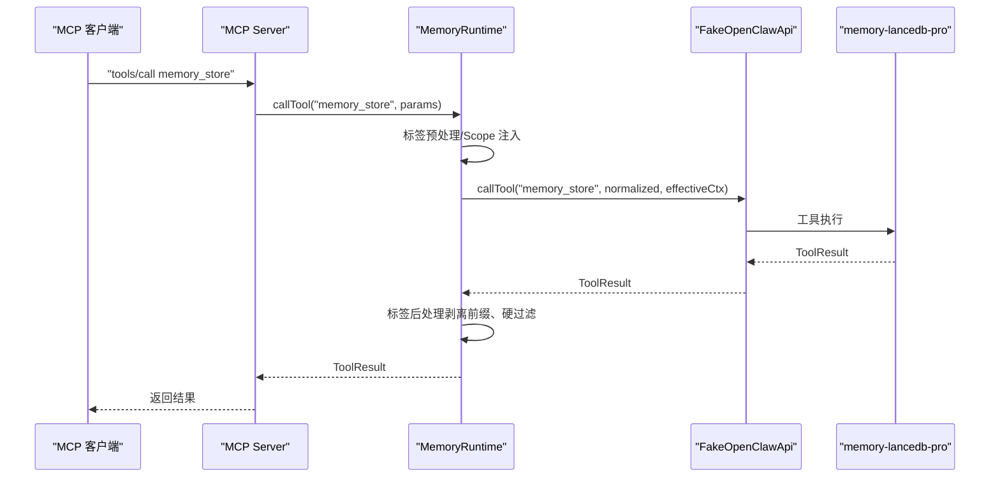
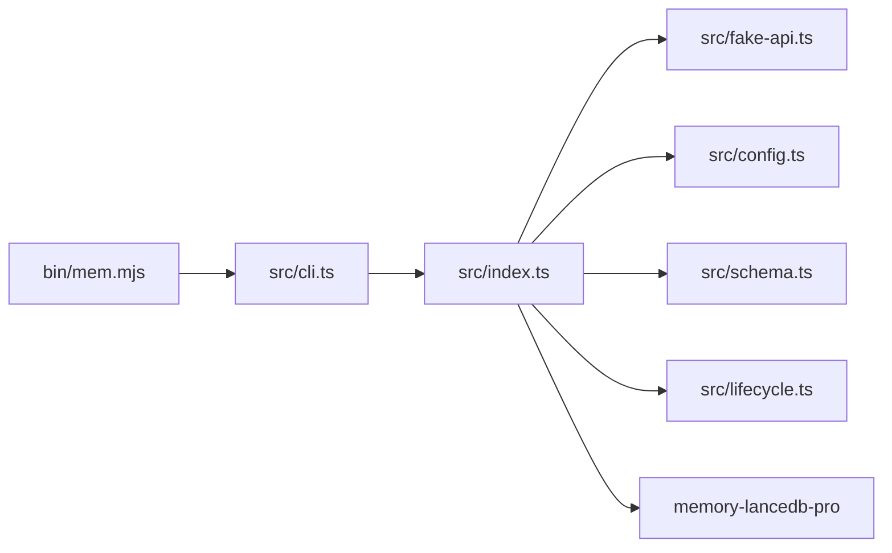

# 记忆管理工具集

<cite>
**本文引用的文件**
- [README.md](file://README.md)
- [USAGE_GUIDE.md](file://docs/USAGE_GUIDE.md)
- [package.json](file://package.json)
- [src/index.ts](file://src/index.ts)
- [src/fake-api.ts](file://src/fake-api.ts)
- [src/config.ts](file://src/config.ts)
- [src/schema.ts](file://src/schema.ts)
- [src/lifecycle.ts](file://src/lifecycle.ts)
- [src/cli.ts](file://src/cli.ts)
- [bin/mem.mjs](file://bin/mem.mjs)
- [test/integration.test.mjs](file://test/integration.test.mjs)
</cite>

## 目录
1. [简介](#简介)
2. [项目结构](#项目结构)
3. [核心组件](#核心组件)
4. [架构总览](#架构总览)
5. [详细组件分析](#详细组件分析)
6. [依赖关系分析](#依赖关系分析)
7. [性能考量](#性能考量)
8. [故障排除指南](#故障排除指南)
9. [结论](#结论)
10. [附录](#附录)

## 简介
本项目为 AI 应用提供持久化长期记忆的 MCP Server 封装，基于 memory-lancedb-pro 的能力，通过 17 个 MCP 工具实现“存储/召回/治理/自我改进/生命周期”一体化记忆管理。工具按功能分为五类：
- 核心记忆工具：memory_store、memory_recall、memory_list、memory_forget、memory_update、memory_stats
- 高级治理工具：memory_debug、memory_promote、memory_archive、memory_compact、memory_explain_rank
- 自我改进工具：self_improvement_log、self_improvement_extract_skill、self_improvement_review
- 生命周期工具：_lifecycle_auto_recall、_lifecycle_auto_capture、_lifecycle_session_end
- Scope 管理工具：list_scopes（合成工具）

这些工具通过 FakeOpenClawApi 注册到插件中，再由 MCP Server 暴露给客户端（如 Claude、Cursor、Cline 等），支持 stdio 与 SSE 两种传输模式。

## 项目结构
- bin/mem.mjs：CLI 入口，加载 dist/cli.js
- src/cli.ts：CLI 命令实现（serve、list、search、stats、store、delete、config、doctor、scope）
- src/index.ts：主入口，创建 MemoryRuntime，负责工具注册、标签预处理/后处理、Scope 注入、Synthetic 工具 list_scopes
- src/fake-api.ts：FakeOpenClawApi 适配器，注册工具工厂、事件与钩子，提供 callTool、emitEvent、triggerHook 等
- src/config.ts：配置加载与转换，支持 YAML、环境变量展开、默认配置初始化
- src/schema.ts：TypeBox → JSON Schema 转换器，供 MCP tools/list 输出
- src/lifecycle.ts：生命周期桥接，将 OpenClaw 事件映射为 MCP 可调用的工具
- docs/USAGE_GUIDE.md：使用手册，包含 CLI 与 MCP 工具参考、最佳实践
- README.md：项目说明、特性、安装与配置、MCP 客户端配置、工具参考

```mermaid
graph TB
subgraph "CLI"
BIN["bin/mem.mjs"]
CLI["src/cli.ts"]
end
subgraph "MCP Server"
IDX["src/index.ts"]
FAKE["src/fake-api.ts"]
LIFE["src/lifecycle.ts"]
end
subgraph "配置与模式"
CFG["src/config.ts"]
SCH["src/schema.ts"]
end
subgraph "外部依赖"
PARENT["memory-lancedb-pro<br/>通过 jiti 加载"]
end
BIN --> CLI
CLI --> IDX
IDX --> FAKE
IDX --> LIFE
IDX --> CFG
IDX --> SCH
FAKE --> PARENT
```

图表来源
- [bin/mem.mjs:1-8](file://bin/mem.mjs#L1-L8)
- [src/cli.ts:1-617](file://src/cli.ts#L1-L617)
- [src/index.ts:1-515](file://src/index.ts#L1-L515)
- [src/fake-api.ts:1-318](file://src/fake-api.ts#L1-L318)
- [src/config.ts:1-312](file://src/config.ts#L1-L312)
- [src/schema.ts:1-151](file://src/schema.ts#L1-L151)

章节来源
- [README.md:1-738](file://README.md#L1-L738)
- [USAGE_GUIDE.md:1-672](file://docs/USAGE_GUIDE.md#L1-L672)
- [package.json:1-46](file://package.json#L1-L46)

## 核心组件
- MemoryRuntime：封装 FakeOpenClawApi 与配置，提供 callTool、listTools、emitEvent、triggerHook、getCliInstance 等能力；负责标签预处理/后处理、Scope 注入、Synthetic 工具 list_scopes
- FakeOpenClawApi：注册工具工厂、事件与钩子，提供 callTool、emitEvent、triggerHook、getToolDefinitions 等
- 配置系统：YAML 配置加载、环境变量展开、默认配置模板、路径解析
- Schema 转换：TypeBox → JSON Schema，保证 MCP tools/list 输出符合协议
- 生命周期桥接：将 before_prompt_build、agent_end、session_end、message_received 映射为可调用工具

章节来源
- [src/index.ts:95-498](file://src/index.ts#L95-L498)
- [src/fake-api.ts:57-317](file://src/fake-api.ts#L57-L317)
- [src/config.ts:23-311](file://src/config.ts#L23-L311)
- [src/schema.ts:16-150](file://src/schema.ts#L16-L150)
- [src/lifecycle.ts:19-177](file://src/lifecycle.ts#L19-L177)

## 架构总览
MCP Server 通过 createMemoryRuntime 初始化，加载 YAML 配置，构建 FakeOpenClawApi，调用 memory-lancedb-pro 的 register 注册 14 个核心工具，再将工具与事件暴露给 MCP 客户端。Wrapper 层还注入标签参数、Scope 注入、Synthetic 工具 list_scopes，并提供生命周期桥接工具。



图表来源
- [src/index.ts:248-453](file://src/index.ts#L248-L453)
- [src/fake-api.ts:217-235](file://src/fake-api.ts#L217-L235)
- [src/lifecycle.ts:52-91](file://src/lifecycle.ts#L52-L91)

## 详细组件分析

### 核心记忆工具

#### memory_store（存储记忆）
- 功能：将带标签与分类的记忆写入数据库，支持 importance、scope、tags
- 输入参数
  - text（必需）：记忆内容
  - category（可选）：preference/fact/decision/entity/reflection/other
  - importance（可选）：0-1，默认 0.7
  - scope（可选）：目标 scope
  - tags（可选）：逗号分隔标签
- 处理逻辑
  - 标签预处理：将 tags 转换为规范化字符串并嵌入 text 前缀
  - Scope 注入：跨 scope 模式下未指定 scope 时注入默认 scope；锁定 scope 模式下强制覆盖为服务端 scope
  - 调用插件工具执行存储
  - 标签后处理：剥离返回结果中的标签前缀
- 使用示例
  - CLI：mem store "用户偏好使用 pnpm" -c preference -t tech,tools -i 0.9
  - MCP：传入 { text, category, importance, tags }
- 最佳实践
  - 每条记忆至少 100-200 字，包含唯一实体名与技术术语
  - importance 与分类合理设置，便于后续召回与治理
  - 使用 tags 进行软过滤，结合 category 与 limit 控制召回质量

章节来源
- [src/index.ts:313-386](file://src/index.ts#L313-L386)
- [src/index.ts:322-324](file://src/index.ts#L322-L324)
- [src/index.ts:351-370](file://src/index.ts#L351-L370)
- [src/index.ts:444-449](file://src/index.ts#L444-L449)
- [src/cli.ts:309-343](file://src/cli.ts#L309-L343)
- [USAGE_GUIDE.md:169-196](file://docs/USAGE_GUIDE.md#L169-L196)

#### memory_recall（语义召回）
- 功能：混合检索（向量 + BM25），返回相关记忆
- 输入参数
  - query（必需）：搜索关键词
  - limit（可选）：最大结果数（默认 3，最大 20）
  - scope（可选）：限定 scope
  - category（可选）：限定分类
  - tags（可选）：标签过滤（软过滤，加权）
- 处理逻辑
  - 标签预处理：将 tags 嵌入 query 前缀，利用 BM25 命中标签前缀
  - Scope 注入：锁定模式下强制 scope
  - 调用插件工具执行召回
  - 标签后处理：剥离返回结果中的标签前缀
- 使用示例
  - CLI：mem search "TypeScript Rust 全栈架构师" --limit 5 --tags tech
  - MCP：传入 { query, limit, tags }
- 最佳实践
  - query 采用“实体名 + 技术术语 + 关键细节”的构造方式
  - 优先使用 tags 与 category 进行软/硬过滤，控制召回质量

章节来源
- [src/index.ts:313-335](file://src/index.ts#L313-L335)
- [src/index.ts:390-450](file://src/index.ts#L390-L450)
- [src/cli.ts:238-273](file://src/cli.ts#L238-L273)
- [USAGE_GUIDE.md:198-218](file://docs/USAGE_GUIDE.md#L198-L218)

#### memory_list（列表查看）
- 功能：分页列出记忆，支持 scope、category、tags、limit、offset
- 输入参数
  - limit（可选）：最大条数（默认 10，最大 50）
  - offset（可选）：分页偏移（默认 0）
  - scope（可选）：限定 scope
  - category（可选）：限定分类
  - tags（可选）：标签过滤（软过滤）
- 处理逻辑
  - 标签预处理：当传入 tags 时，将请求重写为 memory_recall（嵌入标签前缀），以实现标签过滤
  - Scope 注入：锁定模式下强制 scope
  - 调用插件工具执行列表
  - 标签后处理：剥离返回结果中的标签前缀
- 使用示例
  - CLI：mem list --category decision --tags profile,tech --limit 20 --offset 10
  - MCP：传入 { limit, offset, tags }
- 最佳实践
  - tags 与 category 组合使用，提高筛选精度
  - limit 与 offset 控制输出规模，避免一次性过多

章节来源
- [src/index.ts:326-333](file://src/index.ts#L326-L333)
- [src/index.ts:390-450](file://src/index.ts#L390-L450)
- [src/cli.ts:175-232](file://src/cli.ts#L175-L232)
- [USAGE_GUIDE.md:220-231](file://docs/USAGE_GUIDE.md#L220-L231)

#### memory_forget（删除记忆）
- 功能：支持按 memoryId 或 query 模式删除记忆
- 输入参数
  - memoryId（二选一）：记忆 ID（完整 UUID 或 8+ 位前缀）
  - query（二选一）：搜索查询，返回候选后选择删除
  - scope（可选）：限定 scope
- 处理逻辑
  - Scope 注入：锁定模式下强制 scope
  - 调用插件工具执行删除
- 使用示例
  - CLI：mem delete <memoryId>
  - MCP：传入 { memoryId } 或 { query }
- 最佳实践
  - 优先使用 memoryId 精确删除
  - 使用 query 模式时，先用 recall 确认候选

章节来源
- [src/cli.ts:349-364](file://src/cli.ts#L349-L364)
- [USAGE_GUIDE.md:232-244](file://docs/USAGE_GUIDE.md#L232-L244)

#### memory_update（更新记忆）
- 功能：更新已有记忆，支持 text、category、importance
- 输入参数
  - memoryId（必需）：记忆 ID
  - text（可选）：新文本内容（触发重新嵌入）
  - category（可选）：新分类
  - importance（可选）：新重要度
- 处理逻辑
  - Scope 注入：锁定模式下强制 scope
  - 调用插件工具执行更新
- 使用示例
  - CLI：mem store ...（先存储）→ mem list → 选择 memoryId → 使用 memory_update 更新
  - MCP：传入 { memoryId, text, category, importance }
- 最佳实践
  - 更新 text 会触发重新嵌入，注意成本与时效性

章节来源
- [USAGE_GUIDE.md:245-255](file://docs/USAGE_GUIDE.md#L245-L255)

#### memory_stats（统计信息）
- 功能：返回 scope 分布、category 分布、检索模式状态等统计
- 输入参数
  - scope（可选）：限定 scope
- 处理逻辑
  - Scope 注入：锁定模式下强制 scope
  - 调用插件工具执行统计
- 使用示例
  - CLI：mem stats --scope project:myapp
  - MCP：传入 { scope }
- 最佳实践
  - 用于监控与治理，定期检查 scope 与类别分布

章节来源
- [src/cli.ts:279-303](file://src/cli.ts#L279-L303)
- [USAGE_GUIDE.md:256-264](file://docs/USAGE_GUIDE.md#L256-L264)

### 高级治理工具
- memory_debug：检索链路追踪与排名解释，辅助定位召回问题
- memory_promote：提升为治理记忆（高优先级，不会被衰减淘汰）
- memory_archive：归档（保留但排除召回）
- memory_compact：去重并压缩记忆
- memory_explain_rank：解释记忆排名的原因

使用建议
- 在召回质量不佳时，先用 memory_debug 与 memory_explain_rank 分析
- 对关键记忆使用 memory_promote 提升优先级
- 定期执行 memory_compact 去重与压缩
- 使用 memory_archive 将不再参与召回的历史记录归档

章节来源
- [README.md:604-615](file://README.md#L604-L615)
- [USAGE_GUIDE.md:167-264](file://docs/USAGE_GUIDE.md#L167-L264)

### 自我改进工具
- self_improvement_log：记录改进建议或错误经验
- self_improvement_extract_skill：从记忆提取可复用的技能/规范
- self_improvement_review：审阅积压的待改进项

使用建议
- 将每次交互中的问题与改进点记录到 self_improvement_log
- 定期使用 self_improvement_extract_skill 提炼可复用的知识
- 使用 self_improvement_review 审视与推进改进计划

章节来源
- [README.md:616-623](file://README.md#L616-L623)
- [USAGE_GUIDE.md:167-264](file://docs/USAGE_GUIDE.md#L167-L264)

### 生命周期工具（内部）
- _lifecycle_auto_recall：自动召回（prompt 构建前注入上下文）
- _lifecycle_auto_capture：自动捕获（agent 结束后提取关键信息）
- _lifecycle_session_end：会话清理和收尾

使用建议
- 通常无需手动调用，由 MCP 客户端在生命周期事件触发时自动调用
- 可通过 triggerAutoRecall/triggerAutoCapture/triggerSessionEnd 在应用侧主动触发

章节来源
- [src/lifecycle.ts:52-177](file://src/lifecycle.ts#L52-L177)
- [README.md:624-633](file://README.md#L624-L633)

### Scope 与 Category 参数
- memory_store、memory_recall、memory_list、memory_stats 均支持 scope 与 category 参数
- 当服务以锁定 scope 模式运行时，所有操作强制限定在该 scope 内，跨 scope 请求会被拒绝

章节来源
- [README.md:634-637](file://README.md#L634-L637)
- [src/index.ts:351-370](file://src/index.ts#L351-L370)

### Tags 标签系统
- 存储机制：tags 以“【标签:x,y】”前缀嵌入 text 字段，不修改父项目 TypeBox schema
- 检索机制：BM25 自然命中标签前缀，结果展示时自动剥离前缀
- 命名约束：仅允许字母、数字、_、-、:、/、.、CJK 字符，逗号为分隔符；禁止使用【、】等保留字符
- 硬过滤：wrapper 对召回结果进行硬过滤，仅保留包含请求标签的条目

章节来源
- [README.md:639-672](file://README.md#L639-L672)
- [src/index.ts:41-52](file://src/index.ts#L41-L52)
- [src/index.ts:55-64](file://src/index.ts#L55-L64)
- [src/index.ts:72-82](file://src/index.ts#L72-L82)
- [src/index.ts:317-335](file://src/index.ts#L317-L335)
- [src/index.ts:390-450](file://src/index.ts#L390-L450)

## 依赖关系分析
- 依赖关系
  - bin/mem.mjs 依赖 dist/cli.js
  - src/cli.ts 依赖 src/mcp-server.ts 与 src/mcp-server-sse.ts
  - src/index.ts 依赖 src/fake-api.ts、src/config.ts、src/schema.ts
  - src/index.ts 通过 jiti 直接加载 memory-lancedb-pro 的 register
  - src/lifecycle.ts 依赖 src/fake-api.ts
  - package.json 指定 @modelcontextprotocol/sdk、commander、jiti、memory-lancedb-pro、yaml



图表来源
- [bin/mem.mjs:1-8](file://bin/mem.mjs#L1-L8)
- [src/cli.ts:1-617](file://src/cli.ts#L1-L617)
- [src/index.ts:1-515](file://src/index.ts#L1-L515)
- [src/fake-api.ts:1-318](file://src/fake-api.ts#L1-L318)
- [src/config.ts:1-312](file://src/config.ts#L1-L312)
- [src/schema.ts:1-151](file://src/schema.ts#L1-L151)
- [src/lifecycle.ts:1-178](file://src/lifecycle.ts#L1-L178)
- [package.json:26-31](file://package.json#L26-L31)

章节来源
- [package.json:26-31](file://package.json#L26-L31)

## 性能考量
- 标签前缀嵌入与剥离：在存储与召回时增加少量文本处理开销，但显著提升检索精度
- Scope 注入：锁定模式下强制 scope 与 agentId="system" 绕过 ACL，避免重复检查
- 列表与召回的 limit 控制：合理设置 limit 与 offset，避免一次性返回过多数据
- 智能提取与去重：memory_compact 与 smartExtraction 可减少冗余，提升检索效率
- 混合检索权重：vectorWeight 与 bm25Weight 的平衡影响召回速度与准确性

## 故障排除指南
- 服务启动失败
  - 检查配置文件是否存在与可解析
  - 确认 embedding.apiKey 是否存在或通过环境变量设置
  - 使用 mem doctor 进行健康检查
- 嵌入模型错误
  - 确认 embedding.model 与 baseURL 正确
  - 对于本地 Ollama，确认服务已启动
- 召回结果不准确
  - 优化 query 构造，采用“实体名 + 技术术语 + 关键细节”
  - 提升记忆内容长度至 100+ 字
  - 使用 tags 与 category 进行过滤
- Scope 权限拒绝
  - 锁定 scope 模式下，请求的 scope 必须与服务端一致
  - 跨 scope 模式下，memory_store 不指定 scope 会自动写入 global

章节来源
- [USAGE_GUIDE.md:618-666](file://docs/USAGE_GUIDE.md#L618-L666)

## 结论
本记忆管理工具集通过 17 个 MCP 工具实现了从存储、召回、治理到自我改进与生命周期管理的完整闭环。Wrapper 层在不修改父项目源码的前提下，提供了标签系统、Scope 隔离、生命周期桥接与 JSON Schema 转换等增强能力。结合 CLI 与 MCP 客户端，可灵活应用于多种 AI 应用场景，实现越用越懂的个性化体验。

## 附录

### 工具清单与分类
- 核心记忆工具：memory_store、memory_recall、memory_list、memory_forget、memory_update、memory_stats
- 高级治理工具：memory_debug、memory_promote、memory_archive、memory_compact、memory_explain_rank
- 自我改进工具：self_improvement_log、self_improvement_extract_skill、self_improvement_review
- 生命周期工具：_lifecycle_auto_recall、_lifecycle_auto_capture、_lifecycle_session_end
- Scope 管理工具：list_scopes（合成工具）

章节来源
- [README.md:548-633](file://README.md#L548-L633)
- [USAGE_GUIDE.md:167-264](file://docs/USAGE_GUIDE.md#L167-L264)