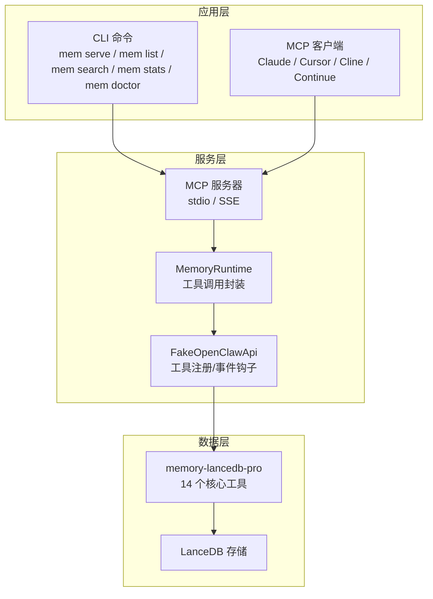
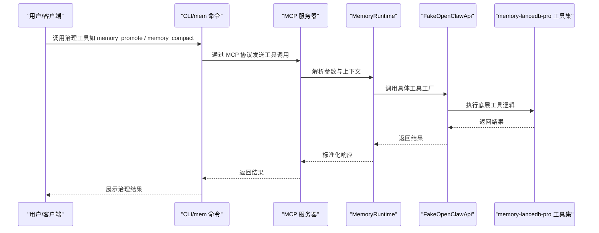
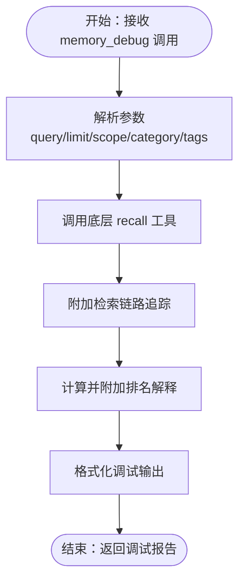
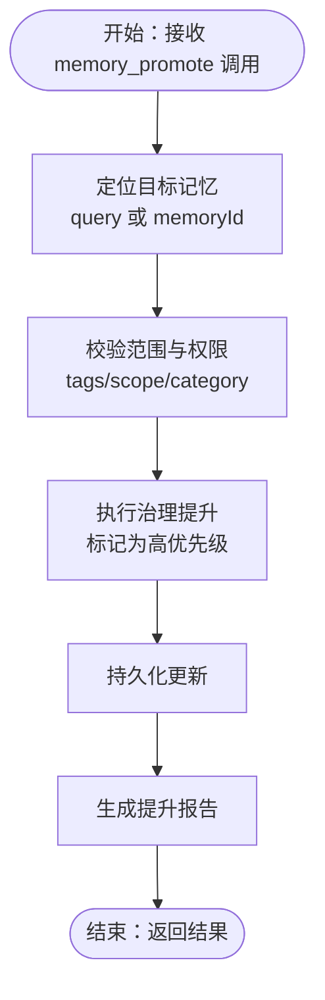
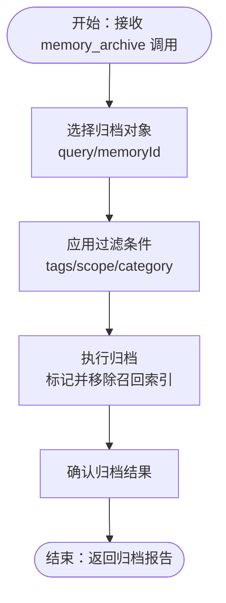
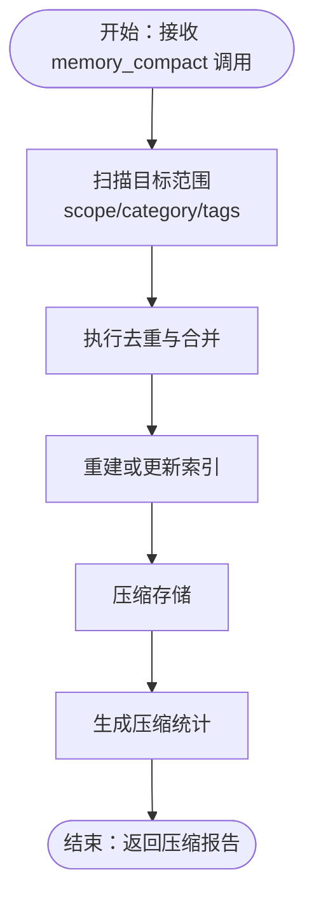
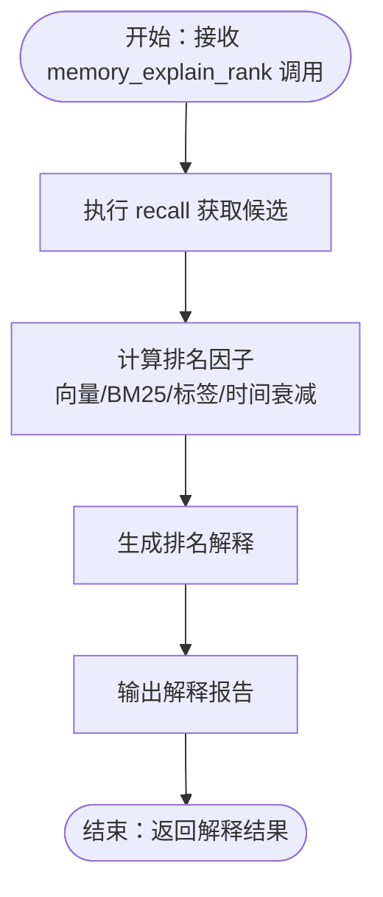
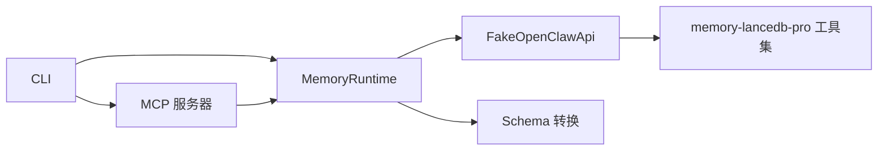

# 高级治理工具

<cite>
**本文引用的文件**
- [README.md](file://README.md)
- [docs/USAGE_GUIDE.md](file://docs/USAGE_GUIDE.md)
- [src/index.ts](file://src/index.ts)
- [src/cli.ts](file://src/cli.ts)
- [src/fake-api.ts](file://src/fake-api.ts)
- [src/schema.ts](file://src/schema.ts)
- [package.json](file://package.json)
</cite>

## 目录
1. [简介](#简介)
2. [项目结构](#项目结构)
3. [核心组件](#核心组件)
4. [架构总览](#架构总览)
5. [详细组件分析](#详细组件分析)
6. [依赖分析](#依赖分析)
7. [性能考虑](#性能考虑)
8. [故障排除指南](#故障排除指南)
9. [结论](#结论)
10. [附录](#附录)

## 简介
本文件面向高级治理场景，系统化梳理并深度解析五个治理工具：memory_debug（调试信息）、memory_promote（提升优先级）、memory_archive（归档处理）、memory_compact（压缩整理）、memory_explain_rank（排名解释）。文档结合仓库现有资料，给出各工具的功能定位、使用场景、参数要点、执行流程与故障排除建议，并提供可视化图示帮助理解。

## 项目结构
该项目围绕 memory-lancedb-pro 的 MCP 包装实现，提供 CLI 命令与 MCP 工具，支持 stdio 与 SSE 两种传输模式，内置标签系统与 Scope 隔离能力。高级治理工具属于 MCP 工具集的一部分，通过 FakeOpenClawApi 注册并暴露给 MCP 客户端。

图表来源
- [src/cli.ts:105-169](file://src/cli.ts#L105-L169)
- [src/index.ts:207-498](file://src/index.ts#L207-L498)
- [src/fake-api.ts:57-318](file://src/fake-api.ts#L57-L318)

章节来源
- [README.md:22-46](file://README.md#L22-L46)
- [src/cli.ts:105-169](file://src/cli.ts#L105-L169)
- [src/index.ts:207-498](file://src/index.ts#L207-L498)
- [src/fake-api.ts:57-318](file://src/fake-api.ts#L57-L318)

## 核心组件
- FakeOpenClawApi：模拟 OpenClaw 插件运行时，负责工具注册、事件与钩子、CLI 注册，是 MCP 工具与底层插件的桥接层。
- MemoryRuntime：封装工具调用、Schema 转换、Scope 注入、标签预处理/后处理等逻辑，统一对外暴露工具清单与调用入口。
- CLI：提供 mem 命令族，支持服务启动、检索、统计、配置、健康检查、Scope 管理等。
- Schema 转换：将 TypeBox Schema 转换为 MCP 兼容的 JSON Schema，保证工具清单的标准化输出。

章节来源
- [src/fake-api.ts:57-318](file://src/fake-api.ts#L57-L318)
- [src/index.ts:95-134](file://src/index.ts#L95-L134)
- [src/schema.ts:39-151](file://src/schema.ts#L39-L151)
- [src/cli.ts:105-169](file://src/cli.ts#L105-L169)

## 架构总览
高级治理工具在整体架构中的位置如下：

图表来源
- [src/cli.ts:105-169](file://src/cli.ts#L105-L169)
- [src/index.ts:244-498](file://src/index.ts#L244-L498)
- [src/fake-api.ts:217-235](file://src/fake-api.ts#L217-L235)

## 详细组件分析

### memory_debug（调试信息）
- 功能定位：用于检索链路追踪与排名解释，帮助诊断召回过程中的权重构成与排序依据。
- 使用场景：
  - 排查召回质量不佳的原因（如关键词命中不足、BM25 权重偏低）。
  - 验证标签过滤、分类过滤、Scope 限制是否按预期生效。
  - 定位混合检索（向量 + BM25）中各部分的贡献比例。
- 参数要点（基于工具清单与通用参数）：
  - 支持 query/limit/scope/category/tags 等通用过滤参数，便于限定调试范围。
  - 返回内容包含检索链路与排名解释，便于定位问题根因。
- 执行流程（概念示意）：
  - 输入：调试查询与过滤条件。
  - 处理：调用底层 recall 工具，附加链路追踪与权重解释。
  - 输出：结构化调试报告，包含命中详情与排名因子。

图表来源
- [README.md:604-615](file://README.md#L604-L615)
- [src/index.ts:313-335](file://src/index.ts#L313-L335)

章节来源
- [README.md:604-615](file://README.md#L604-L615)
- [src/index.ts:313-335](file://src/index.ts#L313-L335)

### memory_promote（提升优先级）
- 功能定位：将记忆提升为治理级（高优先级），使其免于被衰减淘汰，确保关键信息长期留存。
- 使用场景：
  - 将核心架构决策、关键业务规则、合规要求等重要记忆提升为治理级。
  - 在系统升级或大规模变更后，批量提升关键知识以防丢失。
- 参数要点（基于通用工具参数）：
  - 支持通过 query 或 memoryId 精确定位目标记忆。
  - 可结合 tags/scope/category 进行范围限定，避免误操作。
- 执行流程（概念示意）：
  - 输入：目标记忆的查询条件或 ID，以及治理提升指令。
  - 处理：定位记忆 → 标记为治理级 → 更新重要度与优先级。
  - 输出：提升结果与受影响的记忆列表。

图表来源
- [README.md:604-615](file://README.md#L604-L615)
- [src/cli.ts:349-364](file://src/cli.ts#L349-L364)

章节来源
- [README.md:604-615](file://README.md#L604-L615)
- [src/cli.ts:349-364](file://src/cli.ts#L349-L364)

### memory_archive（归档处理）
- 功能定位：将记忆归档，保留但不参与召回，降低存储压力并减少噪音。
- 使用场景：
  - 将历史版本文档、过时流程、废弃方案等归档，避免干扰当前检索。
  - 为审计与合规需求保留证据链，但不影响日常检索效率。
- 参数要点：
  - 支持通过 query/memoryId 精确定位目标记忆。
  - 可结合 tags/scope/category 控制归档范围。
- 执行流程（概念示意）：
  - 输入：归档目标的查询条件或 ID。
  - 处理：定位记忆 → 标记归档状态 → 从召回索引中排除。
  - 输出：归档结果与受影响的记忆列表。

图表来源
- [README.md:604-615](file://README.md#L604-L615)
- [src/cli.ts:349-364](file://src/cli.ts#L349-L364)

章节来源
- [README.md:604-615](file://README.md#L604-L615)
- [src/cli.ts:349-364](file://src/cli.ts#L349-L364)

### memory_compact（压缩整理）
- 功能定位：去重并压缩记忆，提升存储与检索效率，减少冗余。
- 使用场景：
  - 定期清理重复记忆，合并相似内容，释放存储空间。
  - 优化检索性能，缩短召回链路，提升响应速度。
- 参数要点：
  - 支持按 scope/category/tags 精细化控制压缩范围。
  - 可结合 limit/offset 进行分批处理，避免一次性操作过大。
- 执行流程（概念示意）：
  - 输入：压缩范围与策略（去重阈值、合并规则）。
  - 处理：扫描记忆 → 去重与合并 → 更新索引 → 压缩存储。
  - 输出：压缩统计与受影响的记忆列表。

图表来源
- [README.md:604-615](file://README.md#L604-L615)
- [src/cli.ts:175-232](file://src/cli.ts#L175-L232)

章节来源
- [README.md:604-615](file://README.md#L604-L615)
- [src/cli.ts:175-232](file://src/cli.ts#L175-L232)

### memory_explain_rank（排名解释）
- 功能定位：解释记忆在检索中的排名原因，帮助优化 query 与标签策略。
- 使用场景：
  - 分析 Top-N 命中的关键因素（关键词命中、标签权重、分类匹配、时间衰减等）。
  - 优化 query 构造与标签使用，提升召回质量与稳定性。
- 参数要点：
  - 以 recall 的 query 为基础，返回排名解释明细。
  - 支持 tags/scope/category/limit 等过滤参数，聚焦特定场景。
- 执行流程（概念示意）：
  - 输入：检索查询与过滤条件。
  - 处理：执行 recall → 计算各因子权重（向量相似度、BM25、标签加权、时间衰减等）。
  - 输出：排名解释报告，指导后续优化。

图表来源
- [README.md:604-615](file://README.md#L604-L615)
- [src/index.ts:313-335](file://src/index.ts#L313-L335)

章节来源
- [README.md:604-615](file://README.md#L604-L615)
- [src/index.ts:313-335](file://src/index.ts#L313-L335)

## 依赖分析
- 依赖关系概览：
  - CLI 与 MCP 服务器通过 MemoryRuntime 统一调用工具。
  - MemoryRuntime 通过 FakeOpenClawApi 注册与调用底层工具。
  - 工具清单由插件提供，MemoryRuntime 负责参数预处理与后处理。
  - Schema 转换模块将 TypeBox Schema 转为 MCP 兼容 JSON Schema。

图表来源
- [src/cli.ts:105-169](file://src/cli.ts#L105-L169)
- [src/index.ts:207-498](file://src/index.ts#L207-L498)
- [src/fake-api.ts:57-318](file://src/fake-api.ts#L57-L318)
- [src/schema.ts:39-151](file://src/schema.ts#L39-L151)

章节来源
- [src/cli.ts:105-169](file://src/cli.ts#L105-L169)
- [src/index.ts:207-498](file://src/index.ts#L207-L498)
- [src/fake-api.ts:57-318](file://src/fake-api.ts#L57-L318)
- [src/schema.ts:39-151](file://src/schema.ts#L39-L151)

## 性能考虑
- 治理工具的性能影响主要体现在：
  - memory_compact：去重与索引重建会带来 CPU 与 IO 压力，建议分批执行并避开业务高峰期。
  - memory_promote/archive：对单条记忆的标记与索引更新开销较小，但批量操作需注意事务与一致性。
  - memory_debug/memory_explain_rank：附加链路追踪与权重解释会增加响应时间，建议在问题定位阶段使用。
- 建议：
  - 定期执行 memory_compact，保持索引整洁。
  - 使用 tags/scope/category 精确限定治理范围，避免全库扫描。
  - 在 SSE 模式下合理配置并发与资源限制，避免阻塞。

## 故障排除指南
- 常见问题与定位思路：
  - 工具不可用：确认服务启动与工具注册状态，使用 `mem serve --dry-run` 预检。
  - Scope 权限错误：检查服务启动时的 `--scope` 与请求中的 scope 是否一致。
  - 标签无效：检查标签字符集与前缀语法，非法标签会被拒绝。
  - 健康检查失败：使用 `mem doctor` 检查配置、API Key、插件加载状态。
- 相关命令与入口：
  - 服务启动与干跑：mem serve / mem serve --dry-run
  - 健康检查：mem doctor
  - Scope 管理：mem scope list / mem scope delete

章节来源
- [src/cli.ts:105-169](file://src/cli.ts#L105-L169)
- [src/cli.ts:449-517](file://src/cli.ts#L449-L517)
- [README.md:618-667](file://README.md#L618-L667)

## 结论
memory_debug、memory_promote、memory_archive、memory_compact、memory_explain_rank 五项高级治理工具分别覆盖“诊断—提升—归档—压缩—解释”闭环，能够有效提升长期记忆系统的稳定性、可维护性与检索质量。结合标签系统与 Scope 隔离，可在多项目环境中实现精细化治理与高效运维。

## 附录
- 工具清单与说明（摘自仓库文档）
  - memory_debug：检索链路追踪与排名解释
  - memory_promote：提升为治理记忆（高优先级，不会被衰减淘汰）
  - memory_archive：归档（保留但排除召回）
  - memory_compact：去重并压缩记忆
  - memory_explain_rank：解释记忆排名的原因

章节来源
- [README.md:604-615](file://README.md#L604-L615)