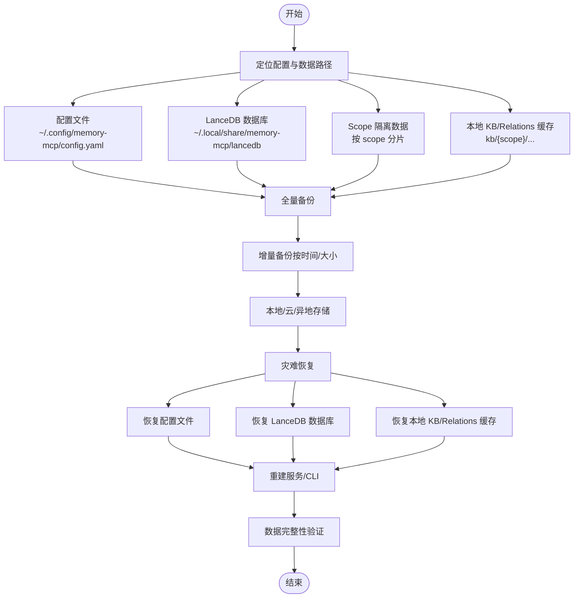
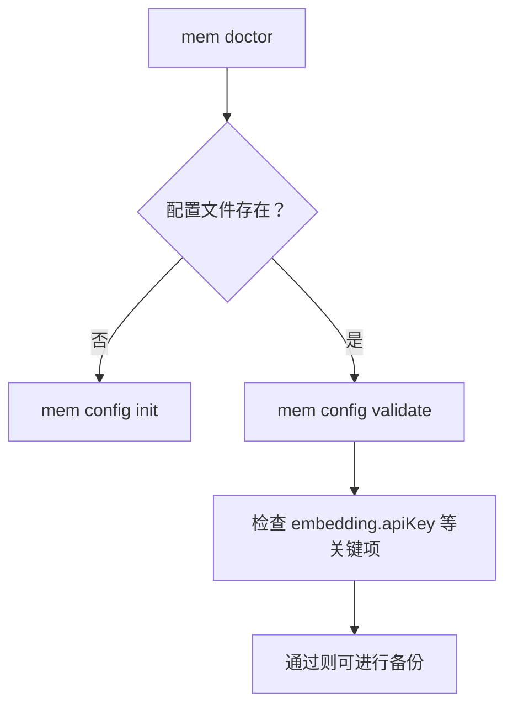
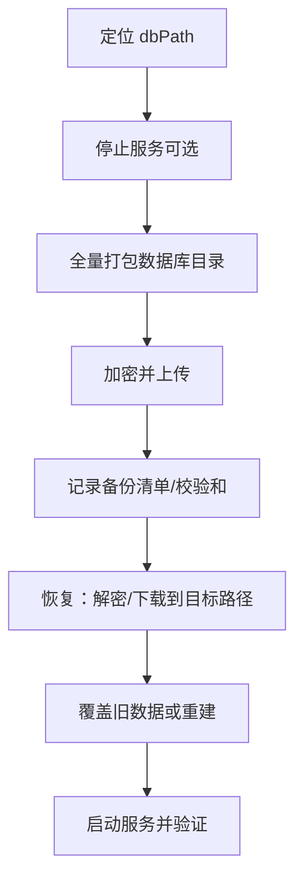
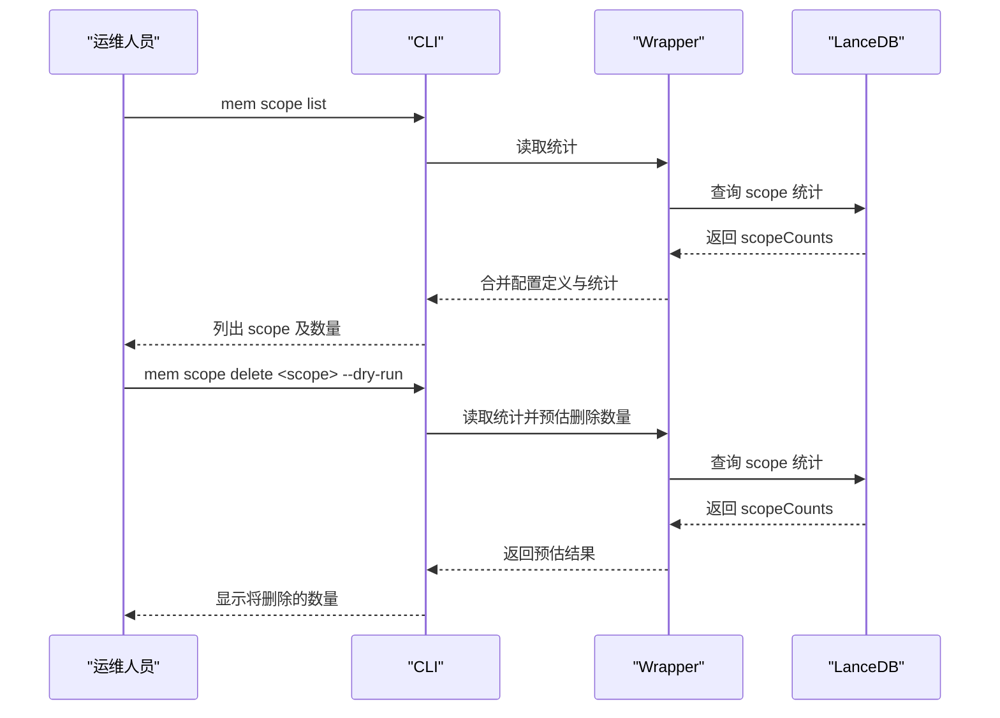
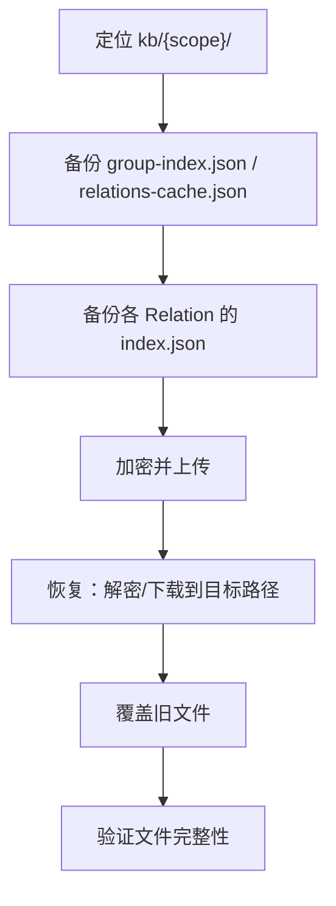
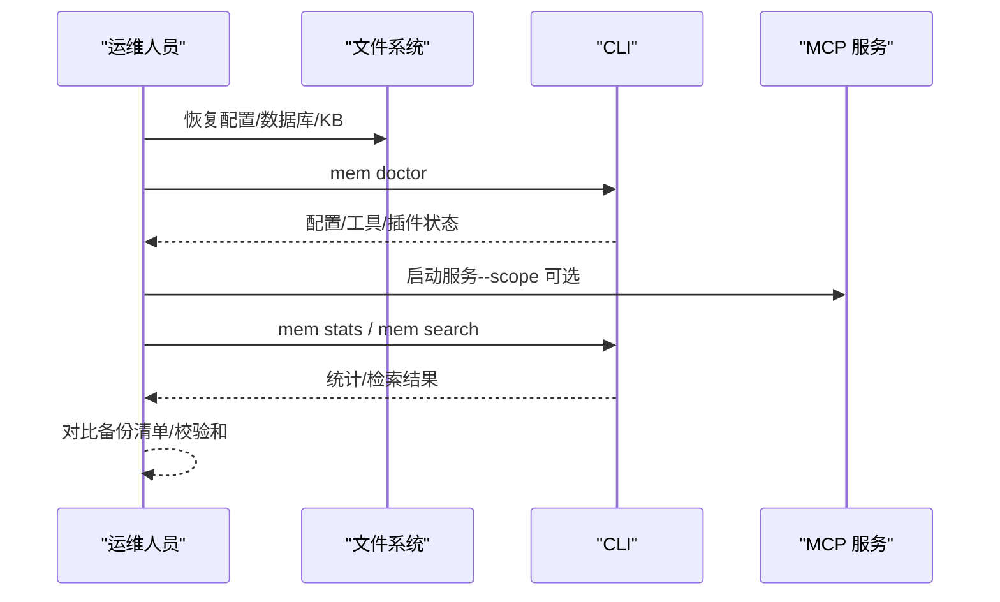
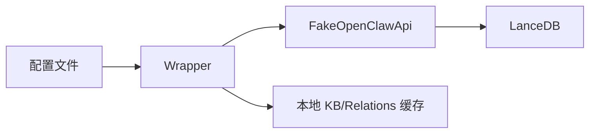

# 备份恢复

<cite>
**本文引用的文件**
- [README.md](file://README.md)
- [docs/USAGE_GUIDE.md](file://docs/USAGE_GUIDE.md)
- [package.json](file://package.json)
- [tsconfig.json](file://tsconfig.json)
- [src/config.ts](file://src/config.ts)
- [src/index.ts](file://src/index.ts)
- [src/cli.ts](file://src/cli.ts)
- [src/fake-api.ts](file://src/fake-api.ts)
- [src/lifecycle.ts](file://src/lifecycle.ts)
- [bin/mem.mjs](file://bin/mem.mjs)
- [docs/code-reveiew-report.md](file://docs/code-reveiew-report.md)
- [docs/knowledge-index-skill_DESIGN.md](file://docs/knowledge-index-skill_DESIGN.md)
</cite>

## 目录
1. [简介](#简介)
2. [项目结构](#项目结构)
3. [核心组件](#核心组件)
4. [架构总览](#架构总览)
5. [详细组件分析](#详细组件分析)
6. [依赖分析](#依赖分析)
7. [性能考虑](#性能考虑)
8. [故障排除指南](#故障排除指南)
9. [结论](#结论)
10. [附录](#附录)

## 简介
本文件面向“备份与恢复”的标准操作程序（SOP），结合代码库的实际实现，给出针对 LanceDB 数据库文件、配置文件、Scope 隔离数据、以及与“知识索引 SKILL”相关的本地 KB/缓存的备份与恢复策略。内容涵盖：
- 备份策略：全量与增量备份的实施方法
- 存储位置与安全：本地、云存储备份与异地备份
- 灾难恢复流程：数据恢复、服务重建、配置恢复、数据完整性验证
- 自动化方案：定时任务、监控与失败告警
- 数据迁移与版本升级时的数据保护

## 项目结构
该项目围绕 memory-lancedb-pro 的封装，提供 MCP 服务与 CLI 工具，核心数据（LanceDB 向量数据库）与配置（YAML）位于用户家目录与项目目录中，支持多项目 Scope 隔离。

```mermaid
graph TB
subgraph "应用层"
CLI["CLI 命令行<br/>mem.*"]
MCP["MCP 服务<br/>stdio/SSE"]
end
subgraph "运行时适配层"
FAKE["FakeOpenClawApi<br/>工具注册/事件钩子"]
WRAP["Wrapper<br/>scope 注入/标签处理"]
end
subgraph "数据层"
CFG["配置文件<br/>~/.config/memory-mcp/config.yaml"]
DB["LanceDB 数据库<br/>~/.local/share/memory-mcp/lancedb"]
KB["本地知识库(KB)<br/>kb/{scope}/..."]
end
CLI --> WRAP
MCP --> WRAP
WRAP --> FAKE
FAKE --> DB
WRAP --> CFG
WRAP --> KB
```

图表来源
- [src/index.ts:207-498](file://src/index.ts#L207-L498)
- [src/config.ts:104-121](file://src/config.ts#L104-L121)
- [src/cli.ts:35-55](file://src/cli.ts#L35-L55)
- [docs/knowledge-index-skill_DESIGN.md:774-794](file://docs/knowledge-index-skill_DESIGN.md#L774-L794)

章节来源
- [README.md:1-120](file://README.md#L1-L120)
- [docs/USAGE_GUIDE.md:1-60](file://docs/USAGE_GUIDE.md#L1-L60)
- [src/config.ts:104-121](file://src/config.ts#L104-L121)
- [src/cli.ts:35-55](file://src/cli.ts#L35-L55)
- [docs/knowledge-index-skill_DESIGN.md:774-794](file://docs/knowledge-index-skill_DESIGN.md#L774-L794)

## 核心组件
- 配置系统：负责解析 YAML 配置、环境变量扩展、默认路径解析与初始化。
- 运行时包装器：负责 scope 注入、标签前缀处理、工具调用桥接。
- CLI：提供 serve/list/search/stats/store/delete/config/doctor/scope 等命令。
- FakeOpenClawApi：适配底层插件工具注册、事件与钩子、CLI 注册。
- 知识索引 SKILL：提供本地 KB、Relations 缓存、Group 树索引等文件化知识存储。

章节来源
- [src/config.ts:1-312](file://src/config.ts#L1-L312)
- [src/index.ts:1-515](file://src/index.ts#L1-L515)
- [src/cli.ts:1-617](file://src/cli.ts#L1-L617)
- [src/fake-api.ts:1-318](file://src/fake-api.ts#L1-L318)
- [docs/knowledge-index-skill_DESIGN.md:220-281](file://docs/knowledge-index-skill_DESIGN.md#L220-L281)

## 架构总览
下图展示备份与恢复的关键数据流：配置文件、LanceDB 数据库、Scope 隔离数据、以及本地 KB/Relations 缓存。

图表来源
- [src/config.ts:104-121](file://src/config.ts#L104-L121)
- [src/cli.ts:35-55](file://src/cli.ts#L35-L55)
- [docs/knowledge-index-skill_DESIGN.md:774-794](file://docs/knowledge-index-skill_DESIGN.md#L774-L794)

## 详细组件分析

### 配置文件备份与恢复
- 配置文件路径解析顺序：环境变量覆盖 → 默认用户目录 → 当前目录 → 默认模板。
- 默认配置文件权限设置为 0o600，具备基础安全属性。
- 建议在备份前使用 doctor 命令进行健康检查，确保配置有效。

图表来源
- [src/cli.ts:449-517](file://src/cli.ts#L449-L517)
- [src/config.ts:107-121](file://src/config.ts#L107-L121)
- [src/config.ts:296-311](file://src/config.ts#L296-L311)

章节来源
- [src/config.ts:107-121](file://src/config.ts#L107-L121)
- [src/config.ts:296-311](file://src/config.ts#L296-L311)
- [src/cli.ts:449-517](file://src/cli.ts#L449-L517)

### LanceDB 数据库文件备份与恢复
- 默认数据库路径：用户本地共享目录，支持通过配置覆盖。
- Scope 隔离：不同 scope 的数据在物理上按目录划分，便于按 scope 粒度备份/恢复。
- 建议：
  - 全量备份：打包数据库目录（含索引、表数据）。
  - 增量备份：基于文件系统时间戳或大小变化，仅复制变更部分。
  - 异地备份：将备份文件加密后上传至云存储或异地存储。

图表来源
- [src/cli.ts:35-41](file://src/cli.ts#L35-L41)
- [src/index.ts:212-227](file://src/index.ts#L212-L227)
- [docs/USAGE_GUIDE.md:541-555](file://docs/USAGE_GUIDE.md#L541-L555)

章节来源
- [src/cli.ts:35-41](file://src/cli.ts#L35-L41)
- [src/index.ts:212-227](file://src/index.ts#L212-L227)
- [docs/USAGE_GUIDE.md:541-555](file://docs/USAGE_GUIDE.md#L541-L555)

### Scope 隔离数据的备份与恢复
- Scope 注入：服务启动时可锁定到特定 scope，所有写入被强制到该 scope。
- Scope 管理：支持列出 scope 及其记忆数量，支持删除指定 scope 的全部记忆。
- 建议：
  - 按 scope 进行独立备份/恢复，避免跨 scope 数据污染。
  - 删除 scope 前务必预演，确认范围。

图表来源
- [src/cli.ts:523-610](file://src/cli.ts#L523-L610)
- [src/index.ts:254-311](file://src/index.ts#L254-L311)

章节来源
- [src/cli.ts:523-610](file://src/cli.ts#L523-L610)
- [src/index.ts:254-311](file://src/index.ts#L254-L311)

### 本地知识库（KB）与 Relations 缓存的备份与恢复
- 本地 KB 与 Relations 缓存均为文件化结构，便于整体打包备份。
- 支持按 scope 隔离，便于按项目粒度备份。
- 建议：
  - 全量备份：打包 kb/{scope}/ 下的 group-index.json、relations-cache.json、各 Relation 的 index.json。
  - 增量备份：基于文件变更时间或内容哈希。
  - 恢复：覆盖目标目录，确保权限与路径正确。

图表来源
- [docs/knowledge-index-skill_DESIGN.md:774-794](file://docs/knowledge-index-skill_DESIGN.md#L774-L794)
- [docs/knowledge-index-skill_DESIGN.md:718-762](file://docs/knowledge-index-skill_DESIGN.md#L718-L762)
- [docs/knowledge-index-skill_DESIGN.md:671-710](file://docs/knowledge-index-skill_DESIGN.md#L671-L710)

章节来源
- [docs/knowledge-index-skill_DESIGN.md:718-762](file://docs/knowledge-index-skill_DESIGN.md#L718-L762)
- [docs/knowledge-index-skill_DESIGN.md:774-794](file://docs/knowledge-index-skill_DESIGN.md#L774-L794)
- [docs/knowledge-index-skill_DESIGN.md:671-710](file://docs/knowledge-index-skill_DESIGN.md#L671-L710)

### 灾难恢复流程
- 数据恢复：
  - 恢复配置文件（权限 0o600）。
  - 恢复 LanceDB 数据库目录。
  - 恢复本地 KB/Relations 缓存。
- 服务重建：
  - 使用 mem doctor 验证配置与工具注册。
  - 启动 MCP 服务（stdio 或 SSE），必要时指定 --scope。
- 配置恢复：
  - 使用 mem config show/validate 校验恢复后的配置。
- 数据完整性验证：
  - 使用 mem stats、mem list、mem search 验证 scope 统计与检索结果。
  - 对照备份清单与校验和，确保文件未损坏。

图表来源
- [src/cli.ts:449-517](file://src/cli.ts#L449-L517)
- [src/cli.ts:114-169](file://src/cli.ts#L114-L169)
- [src/index.ts:207-242](file://src/index.ts#L207-L242)

章节来源
- [src/cli.ts:449-517](file://src/cli.ts#L449-L517)
- [src/cli.ts:114-169](file://src/cli.ts#L114-L169)
- [src/index.ts:207-242](file://src/index.ts#L207-L242)

### 备份自动化方案
- 定时任务：
  - 使用 cron 或系统计划任务定期执行全量/增量备份脚本。
  - 建议：在业务低峰期执行，避免影响服务性能。
- 备份监控：
  - 记录备份日志、备份清单与校验和。
  - 监控磁盘空间、IO 延迟、网络带宽。
- 失败告警：
  - 备份失败时通过邮件/IM 发送告警。
  - 告警内容包含时间戳、失败原因、重试建议。

章节来源
- [docs/code-reveiew-report.md:1-162](file://docs/code-reveiew-report.md#L1-L162)

### 数据迁移与版本升级时的数据保护
- 迁移策略：
  - 迁移前先进行全量备份。
  - 在新环境中先恢复配置与数据库，再启动服务进行验证。
- 版本升级：
  - 升级前备份配置与数据库。
  - 升级后使用 doctor 与健康检查命令验证服务可用性。
  - 如遇兼容性问题，回滚到上一版本并恢复备份。

章节来源
- [docs/USAGE_GUIDE.md:568-617](file://docs/USAGE_GUIDE.md#L568-L617)
- [src/cli.ts:449-517](file://src/cli.ts#L449-L517)

## 依赖分析
- 配置依赖：配置文件解析依赖 YAML 解析器与环境变量。
- 数据依赖：LanceDB 数据库依赖嵌入模型配置与 dbPath。
- 知识索引依赖：本地 KB/Relations 缓存依赖脚本与目录结构。

图表来源
- [src/config.ts:1-312](file://src/config.ts#L1-L312)
- [src/index.ts:1-515](file://src/index.ts#L1-L515)
- [src/fake-api.ts:1-318](file://src/fake-api.ts#L1-L318)
- [docs/knowledge-index-skill_DESIGN.md:774-794](file://docs/knowledge-index-skill_DESIGN.md#L774-L794)

章节来源
- [src/config.ts:1-312](file://src/config.ts#L1-L312)
- [src/index.ts:1-515](file://src/index.ts#L1-L515)
- [src/fake-api.ts:1-318](file://src/fake-api.ts#L1-L318)
- [docs/knowledge-index-skill_DESIGN.md:774-794](file://docs/knowledge-index-skill_DESIGN.md#L774-L794)

## 性能考虑
- 备份窗口：尽量安排在业务低峰期，避免影响检索性能。
- 增量策略：基于文件变更时间或内容哈希，减少 IO 与网络传输。
- 存储介质：优先使用本地 SSD 作为中间缓存，再上传云存储。
- 验证效率：使用 mem stats 与少量检索用例快速验证恢复结果。

## 故障排除指南
- 配置问题：
  - 使用 mem doctor 检查配置文件是否存在、API Key 是否有效。
- 数据库问题：
  - 确认 dbPath 权限与磁盘空间充足。
  - 恢复后使用 mem stats 验证 scope 统计。
- SSE 安全问题：
  - 代码审查指出 SSE CORS 配置过于宽松且无认证，建议限制来源并添加认证。
- Scope 权限：
  - 锁定 scope 模式下，跨 scope 请求会被拒绝，需确认服务启动参数与请求 scope 一致。

章节来源
- [src/cli.ts:449-517](file://src/cli.ts#L449-L517)
- [docs/code-reveiew-report.md:39-54](file://docs/code-reveiew-report.md#L39-L54)
- [src/index.ts:351-370](file://src/index.ts#L351-L370)

## 结论
本 SOP 基于代码库的实际实现，明确了配置、LanceDB 数据库、Scope 隔离数据与本地 KB/Relations 缓存的备份与恢复方法。通过全量与增量备份、本地/云/异地存储、自动化监控与告警，以及灾难恢复流程与版本升级保护，可有效保障数据安全与服务连续性。

## 附录
- CLI 常用命令参考：serve、list、search、stats、store、delete、config、doctor、scope。
- 配置文件路径解析与初始化：支持环境变量覆盖、默认用户目录、当前目录与默认模板。
- Scope 隔离：支持跨 scope 与锁定 scope 两种模式，便于多项目数据隔离与备份。

章节来源
- [docs/USAGE_GUIDE.md:43-164](file://docs/USAGE_GUIDE.md#L43-L164)
- [src/config.ts:104-121](file://src/config.ts#L104-L121)
- [src/config.ts:296-311](file://src/config.ts#L296-L311)
- [src/index.ts:426-498](file://src/index.ts#L426-L498)