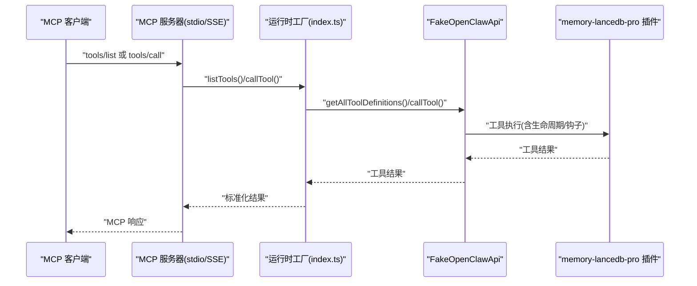
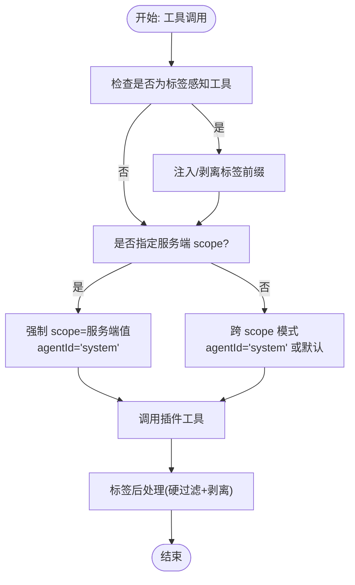
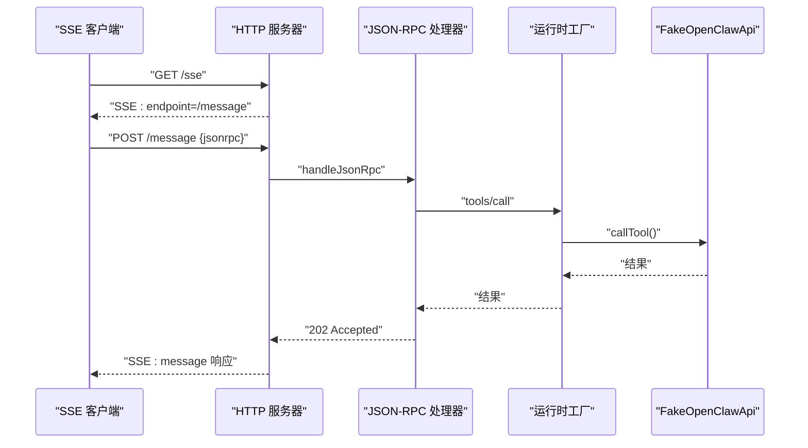
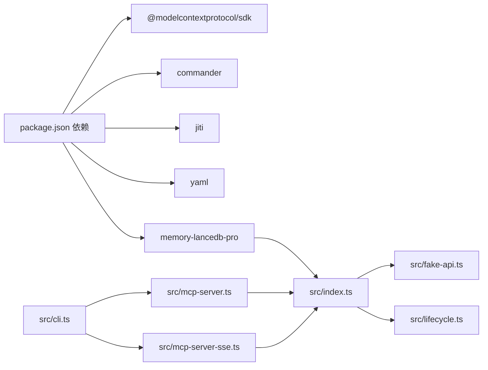

# 性能优化

<cite>
**本文引用的文件**
- [README.md](file://README.md)
- [package.json](file://package.json)
- [src/index.ts](file://src/index.ts)
- [src/config.ts](file://src/config.ts)
- [src/mcp-server.ts](file://src/mcp-server.ts)
- [src/mcp-server-sse.ts](file://src/mcp-server-sse.ts)
- [src/fake-api.ts](file://src/fake-api.ts)
- [src/cli.ts](file://src/cli.ts)
- [src/lifecycle.ts](file://src/lifecycle.ts)
- [src/schema.ts](file://src/schema.ts)
- [bin/mem.mjs](file://bin/mem.mjs)
- [docs/USAGE_GUIDE.md](file://docs/USAGE_GUIDE.md)
- [test/integration.test.mjs](file://test/integration.test.mjs)
</cite>

## 目录
1. [简介](#简介)
2. [项目结构](#项目结构)
3. [核心组件](#核心组件)
4. [架构总览](#架构总览)
5. [详细组件分析](#详细组件分析)
6. [依赖分析](#依赖分析)
7. [性能考量](#性能考量)
8. [故障排查指南](#故障排查指南)
9. [结论](#结论)
10. [附录](#附录)

## 简介
本指南聚焦于 memory-lancedb-mcp 的性能优化，围绕以下主题展开：
- 内存使用优化：向量嵌入缓存策略、LanceDB 存储优化、批量操作处理
- 并发处理配置：SSE 模式的连接池管理、stdio 模式的进程池优化
- 存储配置优化：存储路径选择、索引策略、数据压缩设置
- 网络性能优化：SSE 连接优化、超时配置、流量控制
- 资源监控指标与性能基准测试方法
- 容量规划与扩展性建议

本项目通过 MCP 协议桥接 memory-lancedb-pro，提供 stdio 与 SSE 两种传输模式，支持多项目隔离与生命周期自动召回/捕获，底层依赖 LanceDB 向量数据库与嵌入模型服务。

## 项目结构
该项目采用“入口模块 + 传输层 + 运行时适配 + CLI”的分层组织：
- 入口与运行时：src/index.ts、src/fake-api.ts、src/lifecycle.ts
- 传输层：src/mcp-server.ts（stdio）、src/mcp-server-sse.ts（SSE）
- 配置与模式转换：src/config.ts、src/schema.ts
- CLI：src/cli.ts、bin/mem.mjs
- 文档与测试：docs/USAGE_GUIDE.md、test/integration.test.mjs

```mermaid
graph TB
subgraph "应用入口"
IDX["src/index.ts<br/>运行时工厂/标签处理"]
CFG["src/config.ts<br/>配置解析/映射"]
SCH["src/schema.ts<br/>TypeBox→JSON Schema"]
end
subgraph "传输层"
STDIO["src/mcp-server.ts<br/>stdio 传输"]
SSE["src/mcp-server-sse.ts<br/>SSE 传输"]
end
subgraph "运行时适配"
FAKE["src/fake-api.ts<br/>FakeOpenClawApi"]
LIFE["src/lifecycle.ts<br/>生命周期桥接"]
end
subgraph "CLI"
CLI["src/cli.ts<br/>命令行工具"]
BIN["bin/mem.mjs<br/>CLI 入口"]
end
IDX --> FAKE
IDX --> LIFE
STDIO --> IDX
SSE --> IDX
CLI --> STDIO
CLI --> SSE
BIN --> CLI
CFG --> IDX
SCH --> STDIO
SCH --> SSE
```

图表来源
- [src/index.ts:1-515](file://src/index.ts#L1-L515)
- [src/config.ts:1-312](file://src/config.ts#L1-L312)
- [src/mcp-server.ts:1-306](file://src/mcp-server.ts#L1-L306)
- [src/mcp-server-sse.ts:1-405](file://src/mcp-server-sse.ts#L1-L405)
- [src/fake-api.ts:1-318](file://src/fake-api.ts#L1-L318)
- [src/lifecycle.ts:1-178](file://src/lifecycle.ts#L1-L178)
- [src/schema.ts:1-151](file://src/schema.ts#L1-L151)
- [src/cli.ts:1-617](file://src/cli.ts#L1-L617)
- [bin/mem.mjs:1-8](file://bin/mem.mjs#L1-L8)

章节来源
- [README.md:1-738](file://README.md#L1-L738)
- [package.json:1-46](file://package.json#L1-L46)

## 核心组件
- 运行时工厂与标签处理：负责加载配置、构建 FakeOpenClawApi、注册插件、注入标签前缀、强制 scope 注入与 ACL 检查、生命周期事件桥接。
- 传输层：stdio（默认）与 SSE（HTTP）两种 MCP 传输实现，分别面向本地 MCP 客户端与远程/多客户端场景。
- 配置系统：YAML 配置解析、环境变量扩展、dbPath 与 embedding/LLM/retrieval 等参数映射。
- CLI：mem 命令集合，支持 serve、list/search/stats/store/delete/scope/config/doctor 等。
- 模式转换：TypeBox Schema 到 JSON Schema 的转换，保证 MCP tools/list 输出兼容。

章节来源
- [src/index.ts:190-498](file://src/index.ts#L190-L498)
- [src/mcp-server.ts:43-140](file://src/mcp-server.ts#L43-L140)
- [src/mcp-server-sse.ts:57-209](file://src/mcp-server-sse.ts#L57-L209)
- [src/config.ts:167-214](file://src/config.ts#L167-L214)
- [src/cli.ts:114-169](file://src/cli.ts#L114-L169)
- [src/schema.ts:45-150](file://src/schema.ts#L45-L150)

## 架构总览
MCP 服务通过 stdio 或 SSE 将工具暴露给客户端，运行时工厂负责：
- 加载配置并映射到插件期望的配置结构
- 创建 FakeOpenClawApi，注册工具、事件与钩子
- 注册 memory-lancedb-pro 插件，完成工具注册
- 提供工具调用、生命周期事件、Hook 触发与 CLI 实例



图表来源
- [src/mcp-server.ts:61-124](file://src/mcp-server.ts#L61-L124)
- [src/mcp-server-sse.ts:247-287](file://src/mcp-server-sse.ts#L247-L287)
- [src/index.ts:455-495](file://src/index.ts#L455-L495)
- [src/fake-api.ts:217-235](file://src/fake-api.ts#L217-L235)

## 详细组件分析

### 运行时工厂与标签处理（内存使用与检索优化的关键）
- 标签前缀注入与剥离：在 memory_store/memory_recall/memory_list 上注入/剥离“【标签:…】”前缀，实现软过滤（BM25 加权）与结果清洗。
- 强制 scope 注入：当服务端指定 --scope 时，强制所有请求落到该 scope，并通过 agentId="system" 绕过 ACL 检查，确保一致性与安全性。
- 生命周期桥接：在工具调用前后触发 before_prompt_build/agent_end/session_end 等事件，支持自动召回与自动捕获。



图表来源
- [src/index.ts:313-453](file://src/index.ts#L313-L453)

章节来源
- [src/index.ts:18-82](file://src/index.ts#L18-L82)
- [src/index.ts:313-453](file://src/index.ts#L313-L453)

### stdio 传输（本地 MCP 客户端）
- 使用 StdioServerTransport，标准输入输出承载 MCP 协议消息。
- 默认抑制调试日志以避免污染 stdio。
- 支持生命周期工具调用与工具列表。

章节来源
- [src/mcp-server.ts:43-140](file://src/mcp-server.ts#L43-L140)

### SSE 传输（远程/多客户端）
- 提供 /sse（SSE 事件流）与 /message（JSON-RPC）端点。
- 简单的客户端集合维护，响应仅发送给首个连接的 SSE 客户端。
- 支持健康检查 /health 与跨域头。



图表来源
- [src/mcp-server-sse.ts:82-172](file://src/mcp-server-sse.ts#L82-L172)
- [src/mcp-server-sse.ts:292-330](file://src/mcp-server-sse.ts#L292-L330)

章节来源
- [src/mcp-server-sse.ts:57-209](file://src/mcp-server-sse.ts#L57-L209)

### 配置系统（存储路径、索引与检索参数）
- 配置来源：MEM_CONFIG_PATH 环境变量、默认 ~/.config/memory-mcp/config.yaml、当前目录 config.yaml。
- 关键参数：dbPath（LanceDB 存储路径）、embedding（provider/model/baseURL/dimensions）、retrieval（mode/vectorWeight/bm25Weight/minScore/filterNoise 等）。
- 环境变量扩展：${VAR} 语法在字符串中递归展开。

章节来源
- [src/config.ts:107-214](file://src/config.ts#L107-L214)
- [README.md:675-714](file://README.md#L675-L714)

### CLI（命令行工具与健康检查）
- serve：启动 stdio 或 SSE 服务器，支持 --scope、--dry-run、--sse、--port/--host。
- list/search/stats/store/delete/scope/config/doctor 等命令。
- doctor：检查配置文件存在性、解析、API Key、插件加载与工具列表。

章节来源
- [src/cli.ts:114-169](file://src/cli.ts#L114-L169)
- [src/cli.ts:175-303](file://src/cli.ts#L175-L303)
- [src/cli.ts:449-517](file://src/cli.ts#L449-L517)

### 模式转换（TypeBox → JSON Schema）
- 将 TypeBox schema 转换为标准 JSON Schema，清理 TypeBox 内部属性，保留 required、enum、oneOf/anyOf/allOf 等。
- 确保 MCP tools/list 的输入模式兼容。

章节来源
- [src/schema.ts:45-150](file://src/schema.ts#L45-L150)

## 依赖分析
- 外部依赖：@modelcontextprotocol/sdk（MCP 协议实现）、commander（CLI）、jiti（TS 直载）、yaml（配置解析）、memory-lancedb-pro（核心插件）。
- 运行时依赖：Node.js 18+，LanceDB 原生模块（Linux x64/ARM64/macOS）。



图表来源
- [package.json:26-31](file://package.json#L26-L31)
- [src/index.ts:9-12](file://src/index.ts#L9-L12)

章节来源
- [package.json:1-46](file://package.json#L1-L46)

## 性能考量

### 内存使用优化
- 向量嵌入缓存
  - 嵌入模型调用频率直接影响内存与网络开销。建议：
    - 合理设置检索参数（retrieval.minScore、candidatePoolSize）以减少不必要的向量计算与排序。
    - 使用标签软过滤（BM25 加权）降低无效召回，从而减少后续处理与序列化开销。
    - 在高频检索场景中，尽量复用查询词与关键词清单，避免重复构造查询。
  - 参考配置项：embedding.dimensions、embedding.requestDimensions、embedding.taskQuery/taskPassage、retrieval.candidatePoolSize、retrieval.minScore。
- LanceDB 存储优化
  - 存储路径选择：dbPath 建议放置在高性能磁盘（SSD），避免网络盘导致 IO 延迟。
  - 索引策略：默认混合检索（向量 + BM25）已较优；如需进一步优化，可在插件层面调整索引参数（如向量索引类型、倒排索引粒度），但需结合具体数据规模与查询模式评估。
  - 数据压缩：LanceDB 支持列式压缩，建议启用以降低存储与 IO 压力；同时注意压缩比与解压 CPU 开销的平衡。
- 批量操作处理
  - 批量写入：在 CLI 或外部脚本中合并多次 store 调用，减少工具调用次数与序列化开销。
  - 批量删除：使用 scope 管理命令一次性清理大规模 scope，避免逐条 forget 的高开销。

章节来源
- [src/config.ts:57-77](file://src/config.ts#L57-L77)
- [src/config.ts:229-290](file://src/config.ts#L229-L290)
- [src/cli.ts:523-610](file://src/cli.ts#L523-L610)

### 并发处理配置
- SSE 模式
  - 当前实现维护一个客户端集合，响应仅发送给首个连接的 SSE 客户端。对于多客户端场景，建议：
    - 使用反向代理（如 Nginx/HAProxy）进行连接分发与负载均衡。
    - 为每个客户端单独实例化服务，避免共享状态带来的竞争。
    - 控制并发请求数（如通过反向代理的 max_conns 或上游限流）。
  - 连接池管理：建议在反向代理层启用 keep-alive 与连接复用，减少 TCP/TLS 握手开销。
- stdio 模式
  - stdio 为单进程标准流，天然串行。若需并发，建议：
    - 通过外部进程池（如 PM2、Docker Compose 多实例）启动多个服务实例，配合反向代理路由。
    - 在 MCP 客户端侧进行任务拆分与并发调度，服务端保持单实例以简化状态管理。

章节来源
- [src/mcp-server-sse.ts:78-80](file://src/mcp-server-sse.ts#L78-L80)
- [src/mcp-server-sse.ts:146-157](file://src/mcp-server-sse.ts#L146-L157)
- [README.md:257-276](file://README.md#L257-L276)

### 存储配置优化
- 存储路径选择
  - dbPath 建议使用本地 SSD，避免 NFS/网络盘导致的延迟抖动。
  - 若多实例共享存储，需确保文件锁与并发访问一致性（建议单实例写入，多实例只读副本）。
- 索引策略
  - 混合检索（向量 + BM25）默认已较优；如数据量极大，可考虑：
    - 向量索引类型切换（如 IVF/PQ/IVF-PQ）与参数调优。
    - 倒排索引粒度与词干提取策略（取决于语言与领域）。
- 数据压缩
  - 启用列式压缩以降低存储与 IO；根据数据特征选择压缩算法（如 LZ4/ZSTD）。

章节来源
- [src/config.ts:229-290](file://src/config.ts#L229-L290)
- [docs/USAGE_GUIDE.md:423-426](file://docs/USAGE_GUIDE.md#L423-L426)

### 网络性能优化
- SSE 连接优化
  - 使用反向代理开启 keep-alive、HTTP/2/3，减少握手与队头阻塞。
  - 限制并发连接数与请求大小，防止资源耗尽。
- 超时配置
  - 嵌入模型与检索超时：在配置中设置 embedding.timeoutMs、retrieval.rerankTimeoutMs 等，避免长时间阻塞。
- 流量控制
  - 通过反向代理限速、熔断与排队，保护后端服务免受突发流量冲击。

章节来源
- [src/config.ts:38-44](file://src/config.ts#L38-L44)
- [src/config.ts:67-68](file://src/config.ts#L67-L68)

### 资源监控指标与性能基准测试
- 监控指标建议
  - CPU/内存：Node.js 进程指标（RSS/V8 堆、线程数）
  - IO：LanceDB 文件系统读写、磁盘队列深度
  - 网络：SSE 连接数、请求延迟、吞吐量、错误率
  - 检索：向量查询耗时、BM25 倒排扫描耗时、召回命中率
- 基准测试方法
  - 使用 CLI 的 doctor 与 stats 验证配置与数据规模。
  - 构造固定关键词清单，重复执行 search/list，统计 P50/P95 延迟与吞吐。
  - 对比不同检索参数（minScore、candidatePoolSize、vectorWeight）对延迟与命中率的影响。

章节来源
- [src/cli.ts:449-517](file://src/cli.ts#L449-L517)
- [src/cli.ts:279-303](file://src/cli.ts#L279-L303)

### 容量规划与扩展性
- 单机扩展
  - CPU：根据检索复杂度与并发请求峰值估算核心数；为 GC 与压缩预留额外 CPU。
  - 内存：V8 堆上限与向量数据缓存占用；建议预留 20-30% 安全余量。
  - 存储：SSD 容量按数据量与压缩比估算，预留 30% 空间。
- 多实例扩展
  - SSE 模式：通过反向代理多实例横向扩展，注意数据写入一致性与只读副本策略。
  - stdio 模式：通过进程池与容器编排（Docker/K8s）扩展，避免共享状态。
- 数据规模
  - 大规模 scope：使用 scope 管理命令定期清理与归档，避免单表过大影响查询性能。

章节来源
- [src/cli.ts:523-610](file://src/cli.ts#L523-L610)
- [docs/USAGE_GUIDE.md:541-554](file://docs/USAGE_GUIDE.md#L541-L554)

## 故障排查指南
- 配置问题
  - 配置文件不存在或解析失败：使用 doctor 与 config validate 检查。
  - API Key 缺失或环境变量未设置：doctor 会提示缺失的环境变量。
- 插件加载失败
  - 确认 memory-lancedb-pro 已安装且版本兼容；检查 Node.js 版本与原生模块。
- SSE 连接异常
  - 检查反向代理配置、CORS 头、keep-alive 与超时设置。
- Scope 权限拒绝
  - 锁定 scope 模式下，请求的 scope 必须与服务端 --scope 一致；跨 scope 模式下 ACL 由插件层控制。

章节来源
- [src/cli.ts:449-517](file://src/cli.ts#L449-L517)
- [src/mcp-server-sse.ts:174-209](file://src/mcp-server-sse.ts#L174-L209)
- [docs/USAGE_GUIDE.md:618-667](file://docs/USAGE_GUIDE.md#L618-L667)

## 结论
本指南从内存使用、并发处理、存储配置、网络性能、监控与容量规划六个维度，结合代码实现与文档说明，给出了可落地的优化建议。实践中应以 doctor 与 stats 为起点，逐步调整检索参数与存储配置，并通过反向代理与进程池实现水平扩展，最终达成稳定、高效、可扩展的长期记忆服务。

## 附录
- CLI 命令参考与最佳实践详见使用手册。
- 测试用例覆盖运行时工厂、工具注册与生命周期事件，可作为回归测试基线。

章节来源
- [docs/USAGE_GUIDE.md:1-672](file://docs/USAGE_GUIDE.md#L1-L672)
- [test/integration.test.mjs:1-131](file://test/integration.test.mjs#L1-L131)