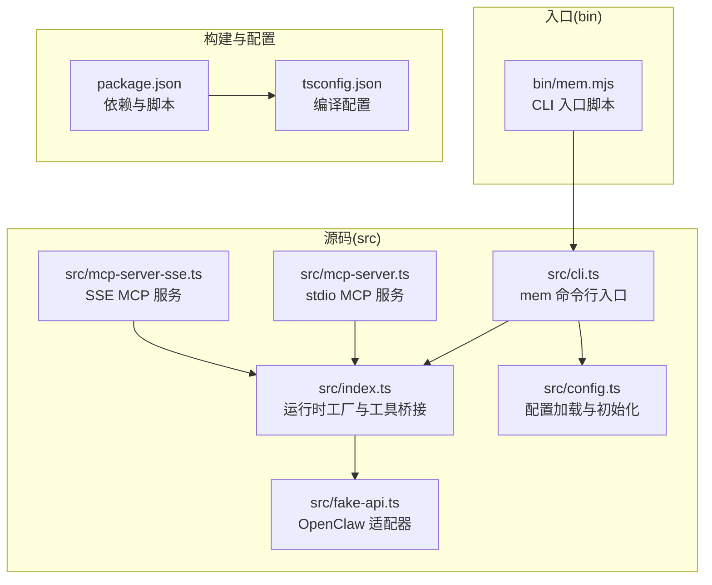
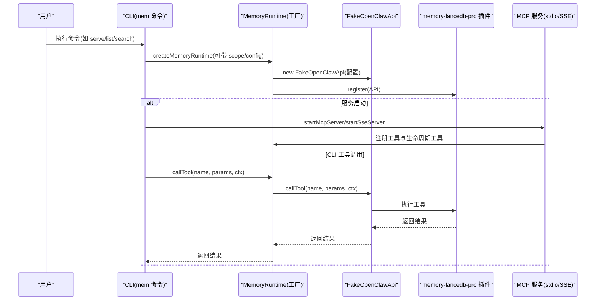

# 环境部署

<cite>
**本文引用的文件**
- [README.md](file://README.md)
- [package.json](file://package.json)
- [tsconfig.json](file://tsconfig.json)
- [src/index.ts](file://src/index.ts)
- [src/cli.ts](file://src/cli.ts)
- [src/config.ts](file://src/config.ts)
- [src/fake-api.ts](file://src/fake-api.ts)
- [src/mcp-server.ts](file://src/mcp-server.ts)
- [src/mcp-server-sse.ts](file://src/mcp-server-sse.ts)
- [bin/mem.mjs](file://bin/mem.mjs)
- [docs/USAGE_GUIDE.md](file://docs/USAGE_GUIDE.md)
</cite>

## 目录
1. [简介](#简介)
2. [系统要求与前置条件](#系统要求与前置条件)
3. [项目结构概览](#项目结构概览)
4. [核心组件与职责](#核心组件与职责)
5. [架构总览](#架构总览)
6. [详细部署步骤](#详细部署步骤)
7. [平台特定说明与故障排除](#平台特定说明与故障排除)
8. [性能与稳定性建议](#性能与稳定性建议)
9. [故障排除指南](#故障排除指南)
10. [结语](#结语)

## 简介
本指南面向需要在本地或远程环境中部署 memory-lancedb-mcp 的用户，提供从系统要求、前置条件、安装流程到平台特定注意事项与故障排除的完整说明。项目通过 MCP 协议提供长期记忆能力，支持 stdio（本地客户端）与 SSE（HTTP 远程/多客户端）两种传输模式，并内置多项目隔离（scope）与标签系统等高级特性。

## 系统要求与前置条件
- Node.js 版本要求：≥18（由项目 engines 字段与安装文档共同确认）
- Git：用于克隆仓库
- 嵌入 API 密钥：OpenAI / SiliconFlow / Ollama 等供应商之一
- 平台原生模块兼容性：LanceDB 原生模块在部分平台存在二进制依赖，详见平台特定说明

章节来源
- [README.md:72-87](file://README.md#L72-L87)
- [package.json:37-39](file://package.json#L37-L39)

## 项目结构概览
项目采用“源码在 src/，构建产物在 dist/”的典型 TypeScript 工程布局，CLI 入口位于 bin/mem.mjs，核心运行时与工具在 src/index.ts 中创建，MCP 服务分别在 stdio 与 SSE 两套实现中启动。

图表来源
- [src/index.ts:190-498](file://src/index.ts#L190-L498)
- [src/cli.ts:105-616](file://src/cli.ts#L105-L616)
- [src/config.ts:107-214](file://src/config.ts#L107-L214)
- [src/fake-api.ts:57-317](file://src/fake-api.ts#L57-L317)
- [src/mcp-server.ts:43-140](file://src/mcp-server.ts#L43-L140)
- [src/mcp-server-sse.ts:57-209](file://src/mcp-server-sse.ts#L57-L209)
- [bin/mem.mjs:1-8](file://bin/mem.mjs#L1-L8)
- [package.json:10-15](file://package.json#L10-L15)
- [tsconfig.json:1-19](file://tsconfig.json#L1-L19)

章节来源
- [src/index.ts:190-498](file://src/index.ts#L190-L498)
- [src/cli.ts:105-616](file://src/cli.ts#L105-L616)
- [src/config.ts:107-214](file://src/config.ts#L107-L214)
- [src/fake-api.ts:57-317](file://src/fake-api.ts#L57-L317)
- [src/mcp-server.ts:43-140](file://src/mcp-server.ts#L43-L140)
- [src/mcp-server-sse.ts:57-209](file://src/mcp-server-sse.ts#L57-L209)
- [bin/mem.mjs:1-8](file://bin/mem.mjs#L1-L8)
- [package.json:10-15](file://package.json#L10-L15)
- [tsconfig.json:1-19](file://tsconfig.json#L1-L19)

## 核心组件与职责
- 运行时工厂（createMemoryRuntime）：负责加载配置、创建 FakeOpenClawApi、注册插件、注入生命周期钩子与工具，并提供统一的工具调用与事件发射接口
- FakeOpenClawApi：适配 memory-lancedb-pro 的运行时接口，捕获工具工厂、事件与钩子，并暴露给 MCP 层
- CLI（mem 命令）：提供 serve/list/search/stats/store/delete/config/doctor/scope 等子命令，支持 dry-run、SSE、scope 等参数
- MCP 服务（stdio/SSE）：将工具与生命周期工具暴露为 MCP 协议，stdio 用于本地客户端，SSE 用于远程/多客户端
- 配置系统：支持 YAML 文件、环境变量扩展、默认路径与初始化

章节来源
- [src/index.ts:190-498](file://src/index.ts#L190-L498)
- [src/fake-api.ts:57-317](file://src/fake-api.ts#L57-L317)
- [src/cli.ts:105-616](file://src/cli.ts#L105-L616)
- [src/mcp-server.ts:43-140](file://src/mcp-server.ts#L43-L140)
- [src/mcp-server-sse.ts:57-209](file://src/mcp-server-sse.ts#L57-L209)
- [src/config.ts:107-214](file://src/config.ts#L107-L214)

## 架构总览
下面的序列图展示了 CLI 与 MCP 服务如何协同工作，以及运行时工厂如何加载插件与适配器。

图表来源
- [src/cli.ts:114-169](file://src/cli.ts#L114-L169)
- [src/index.ts:207-247](file://src/index.ts#L207-L247)
- [src/fake-api.ts:113-127](file://src/fake-api.ts#L113-L127)
- [src/mcp-server.ts:61-124](file://src/mcp-server.ts#L61-L124)
- [src/mcp-server-sse.ts:247-287](file://src/mcp-server-sse.ts#L247-L287)

章节来源
- [src/cli.ts:114-169](file://src/cli.ts#L114-L169)
- [src/index.ts:207-247](file://src/index.ts#L207-L247)
- [src/fake-api.ts:113-127](file://src/fake-api.ts#L113-L127)
- [src/mcp-server.ts:61-124](file://src/mcp-server.ts#L61-L124)
- [src/mcp-server-sse.ts:247-287](file://src/mcp-server-sse.ts#L247-L287)

## 详细部署步骤
以下为通用安装流程，适用于大多数平台。平台特定的原生模块与兼容性问题将在后续章节详述。

- 克隆仓库
  - 使用 Git 克隆项目到本地
- 安装依赖
  - 使用 npm 安装项目依赖，其中会自动安装 memory-lancedb-pro（含 LanceDB 等子依赖）
- TypeScript 编译
  - 使用 npx tsc 或 npm run build 生成 dist/ 目录
- 初始化配置
  - 运行 node ./bin/mem.mjs config init 创建默认配置文件 ~/.config/memory-mcp/config.yaml
  - 编辑配置文件，填入嵌入 API 密钥（支持 ${ENV_VAR} 语法）
- 启动服务
  - stdio 模式（本地客户端）：mem serve
  - SSE 模式（远程/多客户端）：mem serve --sse --port 3100 --host 0.0.0.0

章节来源
- [README.md:80-96](file://README.md#L80-L96)
- [README.md:127-131](file://README.md#L127-L131)
- [bin/mem.mjs:1-8](file://bin/mem.mjs#L1-L8)
- [src/cli.ts:114-169](file://src/cli.ts#L114-L169)

## 平台特定说明与故障排除
本节针对不同平台的原生模块与兼容性问题提供具体指导。

- Linux (x64)
  - LanceDB 需要 AVX2 指令集。若出现“非法指令”类错误，需使用仅 AVX 的构建或 ARM64 兼容版本
  - 若原生模块缺失，可手动安装 Linux x64 原生模块
- WSL（Windows Subsystem for Linux）
  - npm 可能检测为 Windows 平台，导致缺少 Linux 原生模块
  - 解决方案：手动安装 Linux 原生模块到 node_modules/@lancedb/ 目录
- macOS
  - LanceDB 原生模块可自动安装，无需额外操作
- ARM64 / Apple Silicon
  - 确保使用 ARM64 原生模块；如遇问题，执行重建命令

LanceDB 原生模块安装与兼容性要点
- 项目通过 jiti 直接从 node_modules/memory-lancedb-pro 加载 TypeScript 源文件，零额外步骤
- 若遇到原生模块缺失或平台不匹配，可按平台说明手动安装或重建

章节来源
- [README.md:132-168](file://README.md#L132-L168)
- [README.md:127-131](file://README.md#L127-L131)

## 性能与稳定性建议
- 使用 SSE 模式时，建议将 host 限制在本地回环地址，避免暴露至不受信任网络
- 在跨 scope 模式下，所有 scope 的记忆均可访问；锁定 scope 模式下，所有操作被强制限制在单一 scope 内
- 合理设置检索权重与阈值，结合标签系统与分类，提升召回准确性
- 定期运行 doctor 健康检查，确保配置与 API 密钥有效

章节来源
- [src/mcp-server-sse.ts:174-190](file://src/mcp-server-sse.ts#L174-L190)
- [src/mcp-server.ts:130-140](file://src/mcp-server.ts#L130-L140)
- [src/cli.ts:449-517](file://src/cli.ts#L449-L517)

## 故障排除指南
常见问题与解决思路
- 服务启动失败
  - 先验证配置：mem config validate
  - 检查 API Key：mem config show
  - 运行健康检查：mem doctor
- 嵌入模型错误
  - 确认 embedding.model 与 baseURL 正确
  - Ollama 本地模型需确认服务已启动
- 召回结果不准确
  - 优先使用“实体名 + 技术术语”的 query 格式
  - 提升记忆内容长度与独特性
  - 使用 tags 与 category 参数缩小范围
- Scope 权限拒绝
  - 锁定 scope 模式下，请求的 scope 必须与服务端一致
  - 跨 scope 模式下，memory_store 不指定 scope 将自动写入 global
- 原生模块问题
  - Linux x64：确保 AVX2 支持或使用 ARM64 兼容版本
  - WSL：手动安装 Linux 原生模块
  - Apple Silicon：执行重建命令

章节来源
- [docs/USAGE_GUIDE.md:618-666](file://docs/USAGE_GUIDE.md#L618-L666)
- [README.md:132-168](file://README.md#L132-L168)
- [src/mcp-server.ts:130-140](file://src/mcp-server.ts#L130-L140)
- [src/mcp-server-sse.ts:174-190](file://src/mcp-server-sse.ts#L174-L190)

## 结语
通过以上步骤与注意事项，您可以在不同平台上成功部署 memory-lancedb-mcp，并根据需求选择 stdio 或 SSE 传输模式。建议在生产环境中结合 scope 隔离与健康检查，确保服务稳定与数据安全。